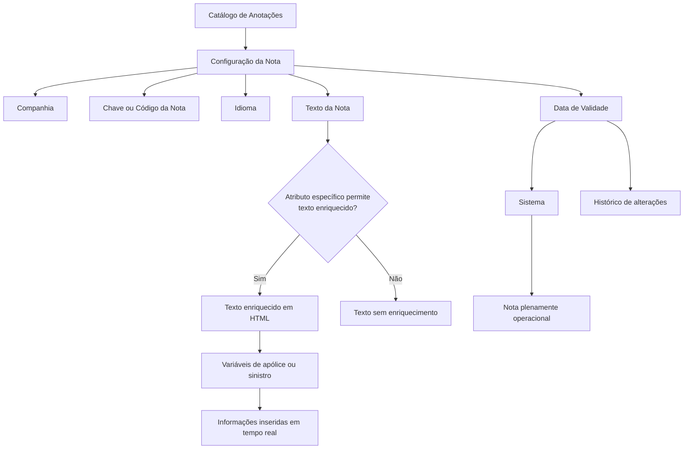
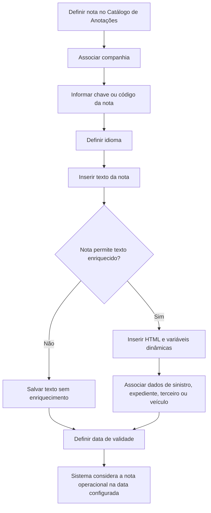

# Definição do Texto das Notas — Catálogo de Anotações do Sistema

## 1. Metadados do Documento
- **Arquivo de Origem:** `Não identificado no conteúdo fornecido`
- **Tipo de Documento:** `Especificação Técnica / Documentação Funcional`
- **Domínio / Sistema:** `Reef / Mapfre — Anotações e Notificações`
- **Público-Alvo:** `Analistas funcionais, desenvolvedores, equipes de configuração e operação`
- **Data/Versão Identificada:** `Não identificada`
- **Owner identificado:** `user:agonzalez_mapfre.com`
- **Lifecycle identificado:** `Approved Source`

---

## 2. Resumo Executivo & Contexto de Negócio

O documento define o conteúdo textual das notas configuradas no catálogo de Anotações do Sistema. O objetivo explícito é determinar o texto de cada nota definida, incluindo a possibilidade de enriquecimento do conteúdo quando a própria definição da nota permitir esse comportamento por meio de um atributo específico.

A configuração de uma nota é associada a uma companhia, identificada por código, e utiliza uma chave ou código próprio para identificar cada nota. A definição também inclui o idioma do texto, permitindo a manutenção de versões em idiomas distintos, como espanhol, inglês e turco.

O texto de uma nota pode conter conteúdo enriquecido. O exemplo apresentado demonstra uma notificação em HTML com variáveis de contexto associadas a terceiros, sinistros, expedientes, datas e dados de veículo de aluguel. Esse mecanismo permite que informações de apólices ou sinistros sejam incorporadas em tempo real ao texto apresentado ao destinatário.

A data de validade controla o momento a partir do qual uma nota se torna plenamente operacional no sistema. O uso correto da data de validade permite conservar o histórico das alterações realizadas nas definições das notas.

O documento recomenda a leitura de diretrizes e documentos funcionais vinculados, especialmente os tópicos de Anotações e Notificações, para impedir interpretações isoladas e potencialmente incorretas da configuração de textos.

---

## 3. Arquitetura, Componentes & Tecnologias Envolvidas

Os componentes e conceitos identificados no conteúdo são:

- **Reef:** Repositório ou contexto de documentação no qual a definição está publicada.
- **Mapfre:** Contexto corporativo identificado no exemplo de comunicação e nos metadados.
- **Catálogo de Anotações:** Estrutura que armazena a configuração de notas.
- **Notas / Anotações:** Entidades configuráveis por companhia, código, idioma, texto e validade.
- **Notificações:** Tema funcional vinculado à definição de notas.
- **Texto enriquecido:** Conteúdo textual capaz de incorporar informações dinâmicas de apólice ou sinistro.
- **HTML:** Formato usado no exemplo de conteúdo enriquecido.
- **Variáveis de negócio:** Marcadores inseridos no HTML para dados de terceiro, sinistro, expediente, datas e veículo.
- **Sistema:** Consumidor das configurações de notas e responsável por considerar a data de validade.



> **Nota de Análise:** O documento menciona o catálogo de Anotações, Anotações e Notificações, mas não detalha interfaces, APIs, banco de dados, contratos JSON, métodos HTTP, mecanismos de persistência ou regras de substituição das variáveis dinâmicas.

---

## 4. Regras de Negócio, Especificações Funcionais & Processos

### 4.1 Objetivo da definição de texto de notas

1. O documento tem como objetivo definir o texto de cada nota configurada.
2. O texto de uma nota pode ser enriquecido.
3. O enriquecimento somente pode ocorrer quando o parâmetro ou atributo específico da definição da nota indicar que essa configuração é permitida.
4. A possibilidade de texto enriquecido deve ser coerente com a definição da respectiva nota.

### 4.2 Identificação da configuração

1. Cada configuração é realizada para uma companhia.
2. O atributo de companhia contém o código da companhia sobre a qual a configuração está sendo realizada.
3. Cada nota possui uma chave ou código identificador.
4. O atributo de nota contém a chave ou o código da nota configurada.

### 4.3 Idioma

1. A propriedade de idioma identifica o idioma em que o texto da nota foi escrito.
2. O documento apresenta como exemplos idiomas identificados por códigos correspondentes a:
   - Espanhol;
   - Inglês;
   - Turco.
3. O documento não informa quais são os códigos concretos de idioma adotados pelo sistema.

### 4.4 Texto enriquecido

1. A propriedade de texto enriquecido contém o texto da nota.
2. O texto enriquecido pode ser configurado somente se o atributo específico da definição da nota indicar essa possibilidade.
3. O texto enriquecido permite associar informações de apólice ou sinistro em tempo real.
4. O documento exemplifica a associação dinâmica de:
   - Número do sinistro;
   - Data de ocorrência;
   - Dados de terceiro;
   - Número de expediente;
   - Tipo de veículo;
   - Datas inicial e final de aluguel de veículo.

### 4.5 Data de validade

1. A data de validade indica ao Sistema a data a partir da qual a nota está ou estará plenamente operacional.
2. A utilização correta da data de validade permite manter um histórico das mudanças efetuadas nas definições de notas.
3. O documento não detalha o comportamento do Sistema antes da data de validade, após alterações de uma nota já vigente ou em caso de sobreposição de períodos de validade.

### 4.6 Vínculos e leitura recomendada

1. O documento contém vínculos para diretrizes e documentos funcionais.
2. A leitura desses materiais é recomendada para evitar erro decorrente da interpretação isolada da entrada.
3. Os vínculos explicitamente apresentados são:
   - Anotações;
   - Notificações.

### 4.7 Exemplo de processo de composição de notificação



---

## 5. Tabelas de Parâmetros, Ambientes e Estruturas de Dados

| Item / Parâmetro | Descrição / Função | Tipo / Valores / Formato | Ambiente / Observações |
| :--- | :--- | :--- | :--- |
| Companhia | Contém o código da companhia para a qual está sendo realizada a configuração. | Código de companhia; formato não especificado. | Aplicável à configuração de notas no catálogo de Anotações. |
| Nota | Contém a chave ou código da nota. | Chave ou código; formato não especificado. | Identifica a nota configurada. |
| Idioma | Identifica o idioma em que o texto da nota está escrito. | Código de idioma; exemplos: espanhol, inglês e turco. | Os códigos efetivos não são detalhados. |
| Texto Enriquecido | Contém o texto da nota e pode incluir conteúdo enriquecido. | Texto; o exemplo utiliza HTML. | Permitido somente quando o atributo específico da definição da nota permitir. |
| Atributo específico da nota | Indica se o texto da nota pode ser configurado como enriquecido. | Atributo/indicador; valores não especificados. | É condição para habilitar o texto enriquecido. |
| Data de Validade | Indica a data a partir da qual a nota está ou estará plenamente operacional no Sistema. | Data; formato não especificado. | Permite manter histórico das alterações nas definições. |
| Anotações | Documento funcional vinculado. | Referência documental. | Leitura recomendada. |
| Notificações | Documento funcional vinculado. | Referência documental. | Leitura recomendada. |
| Owner | Responsável identificado nos metadados da documentação. | `user:agonzalez_mapfre.com` | Valor literal identificado no conteúdo. |
| Lifecycle | Estado de ciclo de vida identificado nos metadados. | `Approved Source` | Valor literal identificado no conteúdo. |

### 5.1 Variáveis e elementos do exemplo de texto enriquecido

| Item / Parâmetro | Descrição / Função | Tipo / Valores / Formato | Ambiente / Observações |
| :--- | :--- | :--- | :--- |
| `[nom_tercero]` | Nome do terceiro destinatário da comunicação. | Marcador dinâmico entre colchetes. | Usado na saudação: `Estimado/a [nom_tercero]`. |
| `[NUM_SINI]` | Número do sinistro. | Marcador dinâmico entre colchetes. | Usado com `[NUM_EXP]`. |
| `[NUM_EXP]` | Número do expediente. | Marcador dinâmico entre colchetes. | Usado com `[NUM_SINI]`. |
| `[FEC_SINI]` | Data do sinistro ou da solicitação mencionada no texto. | Marcador dinâmico entre colchetes. | Usado na frase referente ao dia da solicitação. |
| `[9999999999.DTTIP_COCHE]` | Tipo de veículo disponibilizado. | Marcador dinâmico qualificado. | Exibido na comunicação sobre veículo à disposição. |
| `[9999999999.DTFEC_INI_ALQUILER]` | Data inicial do período de aluguel do veículo. | Marcador dinâmico qualificado. | Exibido na comunicação sobre o período de disponibilidade. |
| `[9999999999.DTFEC_FIN_ALQUILER]` | Data final do período de aluguel do veículo. | Marcador dinâmico qualificado. | Exibido na comunicação sobre o período de disponibilidade. |
| `<u>` | Sublinha o trecho “solicitarle los documentos faltantes”. | Tag HTML. | Usada no exemplo de conteúdo enriquecido. |
| `<br>` | Insere quebra de linha no corpo da comunicação. | Tag HTML. | Usada repetidamente no exemplo. |
| `<font color='green'>` | Aplica cor verde ao texto “Cuidamos del medio ambiente”. | Tag HTML com atributo de cor. | Usada na assinatura. |
| `<font color='red'>` | Aplica cor vermelha ao texto “MAPFRE”. | Tag HTML com atributo de cor. | Usada na assinatura. |

---

## 6. Bateria de Perguntas & Respostas para RAG (FAQ Sintético)

### P1: Qual é o objetivo da definição de texto das notas no catálogo de Anotações?
**R:** O objetivo é definir o texto de cada nota configurada no catálogo de Anotações. O texto pode ser enriquecido quando o parâmetro ou atributo específico da definição da nota indicar que esse enriquecimento é permitido.

### P2: Qual informação deve ser configurada no atributo Companhia?
**R:** O atributo Companhia deve conter o código da companhia sobre a qual está sendo realizada a configuração da nota. O documento não especifica o formato, tamanho ou lista de códigos de companhia válidos.

### P3: Como uma nota é identificada no catálogo de Anotações?
**R:** Uma nota é identificada pelo atributo Nota, que contém a chave ou o código correspondente. O documento não informa convenções de nomenclatura, unicidade, formato ou tamanho desse código.

### P4: Quais idiomas podem ser usados no texto de uma nota?
**R:** A propriedade Idioma identifica o idioma em que o texto está escrito. O documento cita como exemplos espanhol, inglês e turco, identificados por códigos de idioma, mas não informa os códigos específicos adotados.

### P5: Quando o texto enriquecido pode ser utilizado em uma nota?
**R:** O texto enriquecido pode ser utilizado somente quando o atributo específico da definição da nota indicar que a nota pode ser configurada dessa maneira. O documento determina que essa possibilidade deve ser coerente com a definição da própria nota.

### P6: Que tipo de informação pode ser incorporada em tempo real a um texto enriquecido?
**R:** O documento informa que o texto enriquecido pode associar, em tempo real, informações de apólice ou sinistro. O exemplo inclui nome de terceiro, número de sinistro, número de expediente, data, tipo de veículo e datas de início e fim de aluguel.

### P7: Qual é a finalidade da Data de Validade de uma nota?
**R:** A Data de Validade informa ao Sistema a data a partir da qual a nota está ou estará plenamente operacional. O uso correto dessa propriedade permite conservar o histórico das alterações realizadas nas definições de notas.

### P8: O exemplo de texto enriquecido utiliza qual formato?
**R:** O exemplo utiliza HTML, incluindo as tags `<html>`, `<body>`, `<br>`, `<u>` e `<font>`. O conteúdo contém também marcadores dinâmicos entre colchetes, como `[nom_tercero]` e `[NUM_SINI]`.

### P9: Quais variáveis de sinistro aparecem no exemplo de notificação?
**R:** O exemplo apresenta `[NUM_SINI]` para o número do sinistro, `[NUM_EXP]` para o número do expediente e `[FEC_SINI]` para a data mencionada na solicitação anterior. O documento não descreve a origem técnica nem a regra de substituição desses valores.

### P10: Como o exemplo informa a disponibilidade de veículo ao destinatário?
**R:** O texto informa que existe um veículo à disposição e utiliza `[9999999999.DTTIP_COCHE]` para o tipo de veículo, `[9999999999.DTFEC_INI_ALQUILER]` para a data inicial de aluguel e `[9999999999.DTFEC_FIN_ALQUILER]` para a data final de aluguel.

### P11: Quais documentos vinculados devem ser consultados para evitar interpretação incorreta?
**R:** O documento recomenda a leitura das diretrizes e documentos funcionais vinculados, especialmente Anotações e Notificações. A recomendação existe para evitar que a interpretação isolada da entrada leve a erro.

### P12: O documento define APIs, métodos HTTP ou contratos de integração para as notas?
**R:** Não. O conteúdo fornecido define atributos funcionais da configuração de notas e apresenta um exemplo de HTML enriquecido, mas não detalha APIs, métodos HTTP, contratos JSON, endpoints, banco de dados ou mecanismos de integração.

---

## 7. Glossário de Termos, Siglas & Conceitos-Chave

- **Anotações:** Catálogo ou domínio funcional no qual são configuradas notas para companhias, idiomas, textos e períodos de validade.
- **Nota:** Entidade configurada no catálogo de Anotações, identificada por chave ou código e associada a uma companhia.
- **Notificações:** Tema funcional vinculado ao documento e relacionado ao uso de textos de notas.
- **Texto Enriquecido:** Texto de nota que pode incorporar informações dinâmicas, em tempo real, desde que essa configuração seja permitida pela definição da nota.
- **Companhia:** Organização identificada por código sobre a qual a configuração da nota é realizada.
- **Data de Validade:** Data a partir da qual uma nota está ou estará plenamente operacional no Sistema.
- **HTML:** Linguagem de marcação usada no exemplo para estruturar, sublinhar, quebrar linhas e aplicar cores ao conteúdo da notificação.
- **Sinistro:** Evento tratado no exemplo de comunicação, identificado por número e associado a informações como expediente e data.
- **Expediente:** Referência identificada pela variável `[NUM_EXP]` no exemplo de notificação.
- **Apólice:** Informação de negócio que pode ser associada em tempo real a texto enriquecido, segundo o documento.
- **Owner:** Metadado de responsabilidade identificado como `user:agonzalez_mapfre.com`.
- **Lifecycle:** Metadado de ciclo de vida identificado como `Approved Source`.
- **N/A:** Resposta apresentada para a pergunta frequente sobre recomendações operacionais locais de codificação, uso e definição da tabela de textos de Anotações.

---

## 8. Notas Críticas, Riscos & Limitações

- O documento não identifica o arquivo de origem, data, versão, autor formal ou histórico de revisões.
- O documento não especifica os valores possíveis do atributo que habilita o texto enriquecido.
- Não há definição de formato, tamanho, obrigatoriedade ou validação dos campos Companhia, Nota, Idioma e Data de Validade.
- Os códigos concretos para os idiomas mencionados — espanhol, inglês e turco — não são fornecidos.
- O exemplo contém variáveis dinâmicas, mas não detalha a origem dos dados, a sintaxe formal, as regras de resolução, a validação de campos ausentes ou o comportamento em caso de erro.
- O uso de HTML é demonstrado, mas não há definição de tags permitidas, sanitização, codificação de caracteres, política de segurança ou compatibilidade com canais de notificação.
- O documento cita Anotações e Notificações como vínculos recomendados, mas o conteúdo desses documentos não foi fornecido.
- A pergunta frequente sobre recomendações operacionais locais possui resposta `N/A`; portanto, não há orientação local adicional documentada.
- **Nota de Análise:** O texto extraído apresenta caracteres corrompidos em palavras como “denir”, “conguración” e “identica”. Esta estrutura preserva o sentido aparente sem inventar correções funcionais não sustentadas pelo conteúdo.

---

## 9. Conteúdo Bruto Estruturado (Referência Fiel)

```text
--- [PÁGINA 1 DE 2] ---

DEFINICIÓN El Texto de las Notas
Objetivo
El objetivo del documento es denir el texto de cada una de las notas denidas, texto que podrá estar enriquecido de acuerdo con el
parámetro que lo indica en su denición.
Datos Identicativos
Datos Identicativos
Compañía
Documentation / DOCUMENTACIÓN Reef
DOCUMENTACIÓN Reef
Mapfredocument
DOCUMENTACIÓN Reef
Owner
user:agonzalez_mapfre.com
Lifecycle
Approved Source
 / 
 VL
Buscar Inicio Soluciones Arquitecturas APIs Componentes Cloud Documentación Zeus Reef Ayuda
ES


--- [PÁGINA 2 DE 2] ---

Este Atributo del catálogo de Anotaciones contiene el código de la compañía sobre la cual se está realizando la conguración.
Nota
Este atributo contendrá la clave o código de la nota.
Idioma
Esta propiedad identica el Idioma en el que está escrito el texto de la nota, como por ejemplo con los códigos que identiquen a los idiomas
español, inglés, turco,...
Texto Enriquecido
Esta propiedad del catálogo de contiene el texto de la nota, texto que podrá estar enriquecido siempre y cuando y por coherencia con su
denición, el atributo de especíco de la nota indique que se puede congurarse de esa manera.
A modo de ejemplo:
NOTA: Como se puede observar el texto enriquecido de la anotación permite asociar, en tiempo real, información de la póliza o siniestro
como por ejemplo el número del siniestro, la fecha de ocurrencia,...
Fecha de Validez
Esta propiedad le indica al Sistema la fecha a partir de la cual la nota está o estará plenamente operativa en el sistema por lo que su correcto
uso permite tener un histórico de los cambios efectuados en sus deniciones.
Vínculos
Relación de Directrices y Documentos funcionales cuya lectura recomendada para evitar que la interpretación aislada de la presente entrada
pueda conducir a error.
Anotaciones
Noticaciones
Preguntas frecuentes
(1) ¿Existe alguna recomendación operativa que deba ser tomada en consideración localmente en la codicación, uso y denición de la tabla
de textos de las Anotaciones del Sistema?
N/A
 1
 2
 3
 4
 5
 6
 7
 8
 9
10
11
12
<html>
<body>
Estimado/a [nom_tercero],
<br>
Nos volvemos a poner en contacto con usted para <u>solicitarle los documentos faltantes</u> referentes al siniestro 
[NUM_SINI]/[NUM_EXP] solicitados el pasado d&iacute;a [FEC_SINI].
Aprovechamos para comunicarle que dispone de un veh&iacute;culo de tipo [9999999999.DTTIP_COCHE] a su disposici&oacute;n 
entre los d&iacute;as [9999999999.DTFEC_INI_ALQUILER] y [9999999999.DTFEC_FIN_ALQUILER].
<br><br>
Un cordial saludo,
<br><br>
<font color='green'>Cuidamos del medio ambiente</font> - <font color='red'>MAPFRE</font>
</body>
</html>
```
