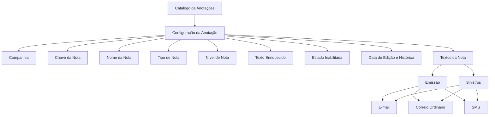

# Definição e Configuração de Anotações no Sistema

## 1. Metadados do Documento
- **Arquivo de Origem:** Não identificado — conteúdo bruto fornecido pelo usuário
- **Tipo de Documento:** Especificação Técnica / Documentação Funcional
- **Domínio / Sistema:** Sistema de Anotações; documentação Reef
- **Público-Alvo:** Desenvolvedores, Analistas Funcionais, Operação e equipes responsáveis pela configuração
- **Data/Versão Identificada:** Não identificada

---

## 2. Resumo Executivo & Contexto de Negócio

O documento descreve a definição de anotações utilizadas no sistema para gerar textos simples durante processos de emissão e sinistros. As anotações podem ser direcionadas por canais como e-mail, correio ordinário ou SMS.

A configuração de uma anotação inclui dados identificativos, como companhia, código da nota e nome. Esses dados permitem identificar a anotação e configurar elementos associados, incluindo título e textos enriquecidos.

O documento também apresenta atributos de governança e controle, como data de edição, tipo de nota, nível de nota, indicação de texto enriquecido e estado de inabilitação. A data de edição permite preservar histórico de versões conforme mudanças de conteúdo.

Como recomendação operacional, a documentação orienta que os registros do catálogo sejam codificados de acordo com a natureza dos tipos ou níveis de anotação. Essa prática facilita ordenação, agrupamento, manutenção e interpretação da configuração.

---

## 3. Arquitetura, Componentes & Tecnologias Envolvidas

Os componentes e conceitos identificados são:

- **Catálogo de Anotações:** repositório/configuração de registros de anotação.
- **Anotação / Nota:** entidade configurável, identificada por uma chave e um nome.
- **Emissão:** processo no qual anotações podem ser utilizadas para gerar textos.
- **Sinistros:** processo no qual anotações podem ser utilizadas para gerar textos.
- **Textos da Nota:** conteúdo associado a uma anotação.
- **Texto enriquecido:** texto que pode conter formatações como negrito, sublinhado ou cor diferente de preto.
- **Canais de envio citados:** e-mail, correio ordinário e SMS.
- **Reef:** ambiente ou contexto documental mencionado em “DOCUMENTACIÓN Reef”.
- **Mapfredocument:** termo exibido no conteúdo de navegação/documentação.



> **Nota de Análise:** O documento não detalha tecnologias de implementação, protocolos, métodos HTTP, contratos JSON, base de dados, APIs ou mecanismos técnicos de envio para e-mail, correio ordinário e SMS.

---

## 4. Regras de Negócio, Especificações Funcionais & Processos

### Objetivo funcional das anotações

1. O sistema deve permitir a definição de notas que possam ser utilizadas em processos de emissão.
2. O sistema deve permitir a definição de notas que possam ser utilizadas em processos de sinistros.
3. As notas devem possibilitar a geração de textos simples.
4. Os textos gerados podem ser enviados por e-mail, correio ordinário ou SMS.
5. A configuração de uma nota deve permitir definir título, textos enriquecidos e demais atributos apresentados.

### Dados identificativos

1. **Companhia**
   - O atributo Companhia contém o código da companhia sobre a qual a configuração está sendo realizada.

2. **Nota**
   - O atributo Nota contém a chave da nota.
   - A chave da nota é o código que identifica a anotação.
   - A identificação permite configurar título, textos enriquecidos e demais elementos da anotação.

3. **Nome**
   - O atributo Nome contém a denominação pela qual a nota deve ser identificada.
   - O conteúdo apresenta como exemplos “DOCUMENTACIÓN Reef” e “Mapfredocument”.

### Controle de versão e estado

1. **Data de edição**
   - A propriedade Data de edição permite manter histórico de versões das anotações.
   - O histórico é associado a alterações que possam ocorrer no conteúdo da anotação.

2. **Tipo de nota**
   - O tipo de nota atribuído na configuração indica a natureza da anotação.

3. **Nível de nota**
   - O nível de nota indica em qual nível do sistema a anotação deve ser utilizada.

4. **Texto enriquecido**
   - O atributo “¿Tiene Texto enriquecido?” indica se a nota possui texto enriquecido.
   - Texto enriquecido pode conter negrito, sublinhado ou cor diferente de preto.

5. **Inabilitação**
   - Quando o atributo “¿Está Inhabilitada?” está ativado, o sistema interpreta que a anotação não está habilitada para uso.
   - Uma anotação inabilitada não permite modificar qualquer dado de sua configuração.

### Diretriz operacional de codificação

1. É considerada boa prática codificar os registros do catálogo conforme a natureza dos tipos ou níveis das anotações.
2. A codificação baseada em tipo ou nível permite ordenar e agrupar a definição das anotações.
3. A ordenação e o agrupamento facilitam a manutenção da configuração.

---

## 5. Tabelas de Parâmetros, Ambientes e Estruturas de Dados

| Item / Parâmetro | Descrição / Função | Tipo / Valores / Formato | Ambiente / Observações |
| :--- | :--- | :--- | :--- |
| Companhia | Contém o código da companhia sobre a qual é realizada a configuração. | Código da companhia; formato não detalhado. | Configuração do catálogo de anotações. |
| Nota | Contém a chave/código que identifica uma anotação. | Código da nota; exemplos: `NOT01`, `HP-07`, `3aAA`. | Utilizado para configurar título, textos enriquecidos e outros dados da anotação. |
| Nome | Contém o nome pelo qual a nota deve ser identificada. | Texto; exemplos apresentados: `DOCUMENTACIÓN Reef`, `Mapfredocument`. | Configuração da anotação. |
| Data de edição | Permite manter histórico de versões conforme alterações de conteúdo. | Data; formato não detalhado. | Controle de versões das anotações. |
| Tipo de nota | Indica a natureza da anotação atribuída na configuração. | Tipo não detalhado. | Recomendado para codificação, ordenação e agrupamento. |
| Nível de nota | Indica em qual nível do sistema a anotação deve ser utilizada. | Nível não detalhado. | Recomendado para codificação, ordenação e agrupamento. |
| ¿Tiene Texto enriquecido? | Indica se a nota possui texto enriquecido. | Sim/Não implícito; valores exatos não detalhados. | Texto pode conter negrito, sublinhado ou cor diferente de preto. |
| ¿Está Inhabilitada? | Indica que a anotação está inabilitada para uso. | Estado ativado/desativado; valores exatos não detalhados. | Quando ativado, impede o uso e a alteração de qualquer dado de configuração. |
| Textos da Nota | Conteúdo textual associado à anotação. | Texto simples ou texto enriquecido. | Pode ser usado em emissão e sinistros. |
| E-mail | Canal citado para envio dos textos gerados. | Canal de comunicação. | Sem detalhamento de integração. |
| Correio ordinário | Canal citado para envio dos textos gerados. | Canal de comunicação. | Sem detalhamento operacional. |
| SMS | Canal citado para envio dos textos gerados. | Canal de comunicação. | Sem detalhamento de integração. |
| NOT01 | Código de nota associado a “Correo Electrónico Requerimiento Testigos”. | Código de anotação. | Exemplo apresentado no documento. |
| HP-07 | Código de nota associado a “Correo Electrónico Requerimiento Judicial”. | Código de anotação. | Exemplo apresentado no documento. |
| 3aAA | Código de nota associado a “Carta Improcedencia Siniestro”. | Código de anotação. | Exemplo apresentado no documento. |

---

## 6. Bateria de Perguntas & Respostas para RAG (FAQ Sintético)

### P1: Qual é o objetivo do catálogo de anotações?
**R:** O catálogo de anotações tem o objetivo de definir notas utilizáveis nos processos de emissão e sinistros, permitindo gerar textos simples para envio por e-mail, correio ordinário ou SMS.

### P2: O que representa o atributo Companhia em uma anotação?
**R:** O atributo Companhia contém o código da companhia sobre a qual está sendo realizada a configuração da anotação.

### P3: Qual é a função do atributo Nota?
**R:** O atributo Nota contém a chave ou código que identifica a anotação. Essa chave é utilizada para configurar elementos da nota, como título, textos enriquecidos e demais informações associadas.

### P4: Para que serve a data de edição da anotação?
**R:** A data de edição permite manter um histórico de versões das anotações de acordo com as mudanças que possam ocorrer no conteúdo de cada anotação.

### P5: O que o tipo de nota indica?
**R:** O tipo de nota configurado para uma anotação indica a natureza daquela anotação.

### P6: O que o nível de nota define?
**R:** O nível de nota indica em qual nível do sistema a anotação deve ser utilizada. O documento não detalha os níveis possíveis.

### P7: O que significa uma anotação possuir texto enriquecido?
**R:** Significa que o texto da anotação pode conter formatação, como negrito, sublinhado ou uma cor diferente de preto.

### P8: O que ocorre quando o atributo “¿Está Inhabilitada?” é ativado?
**R:** Quando esse atributo está ativado, o sistema interpreta que a anotação não está habilitada para uso. Além disso, não pode ser modificado qualquer dado da configuração dessa anotação.

### P9: Quais canais de envio são citados para os textos gerados pelas anotações?
**R:** O documento cita e-mail, correio ordinário e SMS como canais para envio dos textos gerados a partir das anotações.

### P10: Qual prática é recomendada para a codificação dos registros do catálogo?
**R:** Recomenda-se codificar os registros conforme a natureza dos tipos ou níveis das anotações. Essa prática ajuda a ordenar e agrupar as definições, facilitando a manutenção.

### P11: Quais exemplos de códigos e descrições de nota são apresentados?
**R:** O documento apresenta `NOT01` para “Correo Electrónico Requerimiento Testigos”, `HP-07` para “Correo Electrónico Requerimiento Judicial” e `3aAA` para “Carta Improcedencia Siniestro”.

---

## 7. Glossário de Termos, Siglas & Conceitos-Chave

- **Anotação / Nota:** Registro configurável no catálogo de anotações, utilizado para gerar textos em emissão e sinistros.
- **Catálogo de Anotações:** Conjunto de registros de anotações e seus atributos de configuração.
- **Companhia:** Código da companhia sobre a qual uma configuração de anotação é realizada.
- **Emissão:** Processo citado como consumidor potencial de anotações para geração de textos.
- **Sinistros:** Processo citado como consumidor potencial de anotações para geração de textos.
- **Texto enriquecido:** Texto que pode conter formatação, como negrito, sublinhado ou cor diferente de preto.
- **Tipo de nota:** Atributo que indica a natureza de uma anotação.
- **Nível de nota:** Atributo que indica o nível do sistema em que uma anotação deve ser usada.
- **Reef:** Termo identificado na documentação e nos exemplos de nome de anotação; seu significado não é definido no conteúdo.
- **SMS:** Canal de envio citado no documento; a expansão da sigla não é apresentada no conteúdo.

---

## 8. Notas Críticas, Riscos & Limitações

- O documento não identifica o nome do arquivo de origem, data, versão formal, autor ou responsável técnico.
- Não há detalhamento sobre tecnologias, APIs, banco de dados, integrações ou mecanismos de distribuição por e-mail, correio ordinário ou SMS.
- Não são apresentados valores permitidos para tipo de nota, nível de nota, campos obrigatórios, formatos de código ou validações de unicidade.
- O documento não informa o fluxo operacional para criação, alteração, aprovação, publicação ou inabilitação de uma anotação.
- A anotação inabilitada não pode ser utilizada nem ter dados de configuração modificados; o documento não descreve como uma anotação poderia voltar a ser habilitada.
- O documento referencia “Vínculos”, “Directrices” e “Documentos funcionales”, mas não apresenta as relações ou os documentos vinculados.
- **Nota de Análise:** A documentação fornece uma definição funcional do catálogo, mas não detalha contratos técnicos, métodos HTTP, estruturas JSON, permissões, trilhas de auditoria ou implementação dos canais de envio.

---

## 9. Conteúdo Bruto Estruturado (Referência Fiel)

```text
--- [PÁGINA 1 DE 2] ---

DEFINICIÓN de ANOTACIONES
Objetivo
El objetivo es denir notas que puedan ser utilizadas en emisión, en siniestros para generar textos sencillos, y enviarlos por email, correo
ordinario o sms, etc.
Datos Identicativos
Datos Identicativos
Compañía
Este Atributo del catálogo de Anotaciones contiene el código de la compañía sobre la cual se está realizando la conguración.
Nota
Este atributo contendrá la clave de la nota que será el código que identique a la misma para congurar su título, sus textos enriquecidos etc.
Nombre
Este atributo contiene el nombre por el cual se quiere identicar a la nota. A modo de ejemplo:
Documentation / DOCUMENTACIÓN Reef
DOCUMENTACIÓN Reef
Mapfredocument
DOCUMENTACIÓN Reef
Owner
user:agonzalez_mapfre.com
Lifecycle
Approved Source
 / 
 VL
Buscar Inicio Soluciones Arquitecturas APIs Componentes Cloud Documentación Zeus Reef Ayuda
ES


--- [PÁGINA 2 DE 2] ---

NOTA DESCRIPCIÓN
NOT01 Correo Electrónico Requerimiento Testigos
HP-07 Correo Electrónico Requerimiento Judicial
3aAA Carta Improcedencia Siniestro
... ...
Fecha de edición
Esta Propiedad permite tener un histórico de versiones de las anotaciones de acuerdo con los cambios que se hayan podido producir en el
contenido de la misma.
Tipo de nota
El tipo de nota asignado a la nota en su conguración, indica la naturaleza de la misma.
Nivel de nota
El tipo de nivel de la nota indica en qué nivel del Sistema debe ser utilizada.
¿Tiene Texto enriquecido?
Este atributo le indica al sistema si la nota tiene o no 'texto enriquecido', es decir si su texto puede estar en negrita, subrayado, en otro color
distinto al negro,...
¿Está Inhabilitada?
Con este atributo activado el Sistema interpreta que la anotación no está habilitada para ser utilizada ni podrá modicarse cualquier dato de
su conguración.
Vínculos
Relación de Directrices y Documentos funcionales cuya lectura recomendada para evitar que la interpretación aislada de la presente entrada
pueda conducir a error.
Textos de la Nota
Preguntas frecuentes
(1) ¿Existe alguna recomendación operativa que deba ser tomada en consideración localmente en la codicación, uso y denición de la tabla
de Anotaciones del Sistema?
Es una buena práctica codicar los registros de este catálogo de acuerdo con la naturaleza de los tipos o niveles de las anotaciones, lo que
permitiría ordenar y agrupar la denición realizada facilitando su mantenimiento.
```
