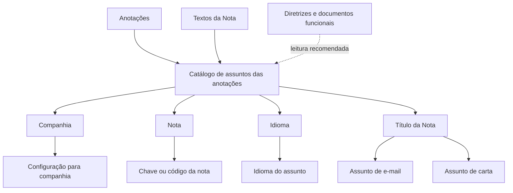

# Catálogo do Sistema — Definição do Título de Notas

## 1. Metadados do Documento
- **Arquivo de Origem:** `Não identificado no conteúdo fornecido`
- **Tipo de Documento:** Especificação Técnica / Documentação de Catálogo
- **Domínio / Sistema:** Reef / Mapfre — Catálogo de assuntos de anotações
- **Público-Alvo:** Desenvolvedores, Analistas Funcionais, Operação e Negócio
- **Data/Versão Identificada:** Não identificada
- **Estado do Documento:** `Lifecycle: Approved Source`

---

## 2. Resumo Executivo & Contexto de Negócio

O documento descreve a configuração do **título de notas** em um Catálogo do Sistema. O objetivo declarado é configurar o título da nota para que seja utilizado como o **assunto de uma carta ou de um e-mail**.

A configuração é organizada em atributos identificativos e atributos de conteúdo. Os dados identificativos incluem a companhia à qual a configuração se aplica e a nota, representada por uma chave ou código. O idioma identifica a língua em que o assunto da nota foi escrito.

O atributo **Título da Nota** contém o assunto que será aplicado ao e-mail ou à carta. O documento apresenta exemplos de títulos associados a tipos de comunicação, incluindo solicitações de documentação para aceitação de sinistro e comunicação de improcedência de sinistro.

A entrada também referencia vínculos com diretrizes e documentos funcionais. A leitura desses materiais é recomendada para evitar interpretações isoladas ou incorretas da configuração apresentada.

---

## 3. Arquitetura, Componentes & Tecnologias Envolvidas

Os elementos explicitamente citados são:

- **Reef:** contexto de documentação e catálogo do sistema.
- **Mapfre:** referência organizacional presente na documentação.
- **Catálogo de assuntos das anotações:** catálogo configurável que contém atributos relacionados ao assunto/título de notas.
- **Companhia:** código da companhia sobre a qual a configuração é realizada.
- **Nota:** chave ou código da nota.
- **Idioma:** propriedade que identifica a língua do assunto configurado.
- **Título da Nota:** assunto usado em uma carta ou e-mail.
- **E-mail:** canal de comunicação que pode utilizar o título da nota como assunto.
- **Carta:** canal de comunicação que pode utilizar o título da nota como assunto.
- **Anotações / Textos da Nota:** itens relacionados indicados na seção de vínculos.



**Nota de Análise:** o conteúdo não descreve integrações técnicas, interfaces HTTP, bancos de dados, contratos JSON, servidores, URLs de ambiente, mecanismos de autenticação ou tecnologias de implementação. A relação apresentada é funcional e configuracional.

---

## 4. Regras de Negócio, Especificações Funcionais & Processos

### 4.1 Objetivo da configuração

A configuração do Catálogo do Sistema tem como objetivo definir o título da nota para uso como assunto em comunicações por carta ou e-mail.

### 4.2 Dados identificativos

A configuração possui dados identificativos que delimitam o contexto da entrada do catálogo:

1. **Companhia**
   - Contém o código da companhia sobre a qual a configuração está sendo realizada.
   - A companhia funciona como contexto organizacional da configuração do assunto.

2. **Nota**
   - Contém a chave ou o código da nota.
   - A nota identifica a entrada cuja configuração de título será definida.

### 4.3 Idioma

A propriedade **Idioma** identifica o idioma em que o assunto da nota foi escrito.

O documento cita como exemplos idiomas identificados por códigos correspondentes a:

- Espanhol;
- Inglês;
- Turco.

**Nota de Análise:** o documento não informa quais são os códigos concretos desses idiomas, nem apresenta uma tabela de códigos ISO ou convenção equivalente.

### 4.4 Título da Nota

O atributo **Título da Nota** contém o assunto do e-mail ou da carta associado à nota.

A configuração permite associar um título a uma comunicação específica. Entre os exemplos apresentados:

- Para **EMAIL**, com descrição **Correo Electrónico**, o assunto é:
  - `Requerimiento Testigos Solicitud necesaria para aceptación del siniestro`

- Para **CARTA**, com descrição **Requested Documents**, o assunto é:
  - `Claim documentation request`

- Para **CARTA**, com descrição **Carta Improcedencia Siniestro**, o assunto é:
  - `Comunicación Improcedencia Siniestro: [NUM_SINI]`

O marcador `[NUM_SINI]` aparece no exemplo de assunto de improcedência de sinistro.

**Nota de Análise:** o documento não detalha a origem, o formato, a regra de substituição ou o momento de resolução do marcador `[NUM_SINI]`.

### 4.5 Vínculos e leitura complementar

A seção **Vínculos** indica a existência de diretrizes e documentos funcionais relacionados. A leitura desses materiais é recomendada para evitar que a interpretação isolada da entrada do catálogo conduza a erro.

Os vínculos mencionados são:

- Anotações;
- Textos da Nota.

**Nota de Análise:** o documento menciona os vínculos, porém não fornece URLs, identificadores documentais, conteúdo adicional ou regras funcionais desses documentos.

---

## 5. Tabelas de Parâmetros, Ambientes e Estruturas de Dados

| Item / Parâmetro | Descrição / Função | Tipo / Valores / Formato | Ambiente / Observações |
| :--- | :--- | :--- | :--- |
| Companhia | Contém o código da companhia sobre a qual a configuração do catálogo é realizada. | Código da companhia; formato não informado. | Aplicável à configuração do catálogo de assuntos das anotações. |
| Nota | Contém a chave ou o código da nota. | Chave ou código; formato não informado. | Identifica a nota configurada. |
| Idioma | Identifica o idioma no qual o assunto da nota está escrito. | Códigos de idioma; exemplos de idiomas: espanhol, inglês e turco. | Os códigos concretos não são informados. |
| Título da Nota | Contém o assunto do e-mail ou da carta associado à nota. | Texto livre de assunto/título. | Pode ser usado em comunicação por e-mail ou carta. |
| Tipo de comunicação | Indica o canal da comunicação configurada. | `EMAIL` ou `CARTA`, conforme exemplos. | Não há lista completa de tipos de comunicação. |
| Descrição | Descrição funcional associada ao tipo de comunicação. | Texto. | Exemplos: `Correo Electrónico`, `Requested Documents`, `Carta Improcedencia Siniestro`. |
| Assunto / Título | Texto que será usado como assunto de e-mail ou carta. | Texto; pode conter marcador como `[NUM_SINI]`. | A regra de substituição do marcador não é detalhada. |
| Lifecycle | Situação exibida para a documentação. | `Approved Source`. | Informação apresentada na interface de documentação. |
| Owner | Proprietário exibido para a documentação. | `user:agonzalez_mapfre.com`. | Informação apresentada na interface de documentação. |

### Exemplos de configuração de título

| Nota / Tipo | Descrição | Assunto / Título |
| :--- | :--- | :--- |
| EMAIL | Correo Electrónico | Requerimiento Testigos Solicitud necesaria para aceptación del siniestro |
| CARTA | Requested Documents | Claim documentation request |
| CARTA | Carta Improcedencia Siniestro | Comunicación Improcedencia Siniestro: [NUM_SINI] |
| ... | ... | ... |

### Ambientes, servidores e rotas de log

| Item / Parâmetro | Descrição / Função | Tipo / Valores / Formato | Ambiente / Observações |
| :--- | :--- | :--- | :--- |
| Ambientes | Não detalhados no documento. | Não informado. | Não há URLs, nomes de ambientes ou mapeamento de servidores. |
| Servidores | Não detalhados no documento. | Não informado. | Não há hosts, portas ou endereços. |
| Rotas de log | Não detalhadas no documento. | Não informado. | Não há caminhos, variáveis ou políticas de log. |

---

## 6. Bateria de Perguntas & Respostas para RAG (FAQ Sintético)

### P1: Qual é o objetivo do Catálogo do Sistema para título de notas?
**R:** O objetivo do Catálogo do Sistema é configurar o título da nota para que ele seja utilizado como assunto de uma carta ou de um e-mail.

### P2: Qual atributo identifica a companhia à qual a configuração pertence?
**R:** O atributo **Companhia** contém o código da companhia sobre a qual está sendo realizada a configuração do catálogo de assuntos das anotações.

### P3: O que o atributo Nota representa na configuração?
**R:** O atributo **Nota** contém a chave ou o código da nota. O documento não especifica o formato técnico dessa chave ou código.

### P4: Para que serve a propriedade Idioma?
**R:** A propriedade **Idioma** identifica o idioma em que o assunto da nota foi escrito. O documento cita como exemplos idiomas identificados por códigos para espanhol, inglês e turco, mas não informa os códigos concretos.

### P5: Onde o valor de Título da Nota é utilizado?
**R:** O valor de **Título da Nota** é utilizado como assunto de uma comunicação por e-mail ou por carta.

### P6: Qual é o exemplo de assunto para um e-mail relacionado à solicitação de testemunhas?
**R:** O exemplo apresentado para `EMAIL`, com descrição `Correo Electrónico`, é: `Requerimiento Testigos Solicitud necesaria para aceptación del siniestro`.

### P7: Qual é o assunto configurado para a carta “Requested Documents”?
**R:** Para `CARTA` com descrição `Requested Documents`, o assunto apresentado é `Claim documentation request`.

### P8: Como o documento exemplifica uma comunicação de improcedência de sinistro?
**R:** O documento apresenta uma entrada `CARTA` com a descrição `Carta Improcedencia Siniestro` e o assunto `Comunicación Improcedencia Siniestro: [NUM_SINI]`.

### P9: O que significa o marcador `[NUM_SINI]` no título de improcedência de sinistro?
**R:** O documento mostra `[NUM_SINI]` como parte do título `Comunicación Improcedencia Siniestro: [NUM_SINI]`. Contudo, não explica sua origem, formato, regra de preenchimento ou processo de substituição.

### P10: Quais documentos relacionados devem ser consultados para evitar interpretação isolada da configuração?
**R:** A seção de vínculos recomenda consultar diretrizes e documentos funcionais relacionados. Os itens explicitamente listados são **Anotações** e **Textos da Nota**.

### P11: O documento informa métodos HTTP ou contratos de integração para o Catálogo do Sistema?
**R:** Não. O conteúdo fornecido não descreve métodos HTTP, APIs, contratos JSON, integrações entre microsserviços ou detalhes de implementação técnica.

### P12: Existem ambientes, URLs, servidores ou rotas de log documentados?
**R:** Não. O documento não apresenta URLs de ambiente, nomes de servidores, portas, rotas de logs ou variáveis de configuração operacional.

---

## 7. Glossário de Termos, Siglas & Conceitos-Chave

- **Reef:** nome presente no contexto da documentação e na navegação exibida. O documento não define tecnicamente o sistema Reef.
- **Mapfre:** referência organizacional presente no conteúdo e no identificador do proprietário.
- **Catálogo do Sistema:** estrutura de configuração utilizada para definir atributos relacionados às notas, incluindo o título usado como assunto de carta ou e-mail.
- **Catálogo de assuntos das anotações:** catálogo mencionado como contendo o atributo Companhia para delimitar a configuração.
- **Companhia:** código da companhia sobre a qual a configuração é realizada.
- **Nota:** chave ou código que identifica uma nota.
- **Idioma:** propriedade que identifica o idioma em que o assunto da nota foi escrito.
- **Título da Nota:** atributo que contém o assunto de um e-mail ou de uma carta.
- **EMAIL:** tipo de comunicação exemplificado no documento.
- **CARTA:** tipo de comunicação exemplificado no documento.
- **Siniestro:** termo em espanhol presente nos exemplos; refere-se ao contexto de sinistro.
- **`[NUM_SINI]`:** marcador presente no assunto de comunicação de improcedência de sinistro; significado operacional e regra de substituição não detalhados.
- **Lifecycle:** campo exibido na documentação com o valor `Approved Source`.
- **Owner:** campo exibido na documentação com o valor `user:agonzalez_mapfre.com`.

---

## 8. Notas Críticas, Riscos & Limitações

- O documento não identifica o arquivo original, data de publicação, versão, autor formal ou histórico de alterações.
- O conteúdo não apresenta um dicionário completo de valores para os atributos Companhia, Nota e Idioma.
- Os códigos concretos dos idiomas mencionados — espanhol, inglês e turco — não são informados.
- O documento mostra o marcador `[NUM_SINI]`, mas não explica sua semântica, fonte de dados, validação ou regra de substituição.
- Não há definição de obrigatoriedade, validação, unicidade ou precedência entre Companhia, Nota, Idioma e Título da Nota.
- Não são documentadas APIs, contratos de integração, banco de dados, arquitetura de implantação, servidores, URLs, portas, ambientes ou logs.
- A lista de exemplos de configurações é explicitamente incompleta, pois termina com `... ... ...`.
- A seção de vínculos recomenda a leitura de **Anotações** e **Textos da Nota**, mas o conteúdo desses documentos não foi fornecido.
- A interpretação isolada desta entrada pode conduzir a erro, conforme alerta expresso da própria seção de vínculos.

---

## 9. Conteúdo Bruto Estruturado (Referência Fiel)

```text
--- [PÁGINA 1 DE 2] ---

DEFINICIÓN del TÍTULO de la Nota
Objetivo
El objetivo de este Catálogo del Sistema es configurar el el título de las notas como asunto de la carta o del email.
Datos Identificativos
Datos Identificativos
Compañía
Este Atributo del catálogo de asuntos de las anotaciones contiene el código de la compañía sobre la cual se está realizando la configuración.
Nota
Este atributo contendrá la clave o código de la nota.
Documentation / DOCUMENTACIÓN Reef
DOCUMENTACIÓN Reef
Mapfredocument
DOCUMENTACIÓN Reef
Owner
user:agonzalez_mapfre.com
Lifecycle
Approved Source
 /
VL
Buscar Inicio Soluciones Arquitecturas APIs Componentes Cloud Documentación Zeus Reef Ayuda
ES


--- [PÁGINA 2 DE 2] ---

Idioma
Esta propiedad identifica el Idioma en el que está escrito el asunto de la nota, como por ejemplo con los códigos que identifiquen a los
idiomas español, inglés, turco,...
Título de la Nota
Este atributo contiene el asunto del email o de la carta el título de la nota. A modo de ejemplo...
NOTA DESCRIPCIÓN ASUNTO / TÍTULO
EMAIL Correo Electrónico Requerimiento Testigos Solicitud necesaria para aceptación del siniestro
CARTA Requested Documents Claim documentation request
CARTA Carta Improcedencia Siniestro Comunicación Improcedencia Siniestro: [NUM_SINI]
... ... ...
Vínculos
Relación de Directrices y Documentos funcionales cuya lectura recomendada para evitar que la interpretación aislada de la presente entrada
pueda conducir a error.
Anotaciones
Textos de la Nota
```
