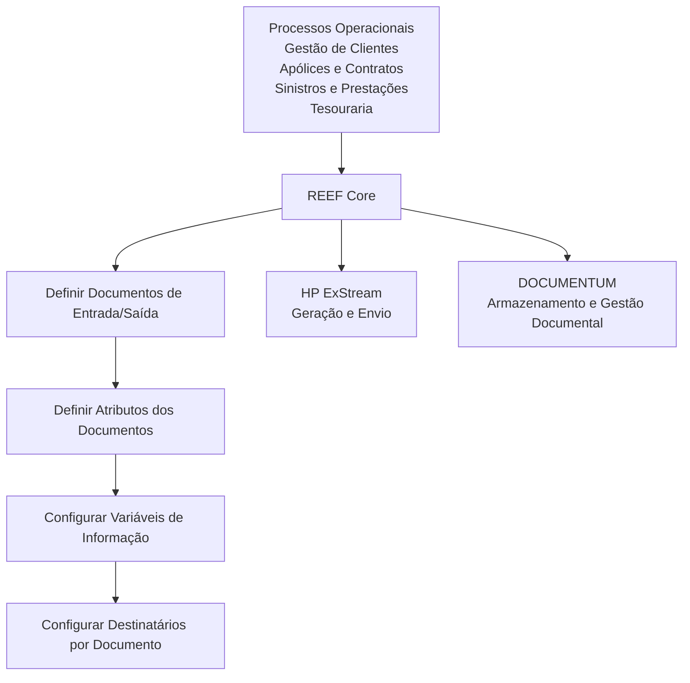

# Integração do REEF Core com Geração, Distribuição e Gestão Documental

## 1. Metadados do Documento
- **Arquivo de Origem:** Não identificado
- **Tipo de Documento:** Arquitetura de Software
- **Domínio / Sistema:** REEF Core / Operacional MAPFRE / Gestão Documental
- **Público-Alvo:** Arquitetos, Desenvolvedores, Operação e Negócio
- **Data/Versão Identificada:** Dezembro de 2023

---

## 2. Resumo Executivo & Contexto de Negócio

O documento descreve a ampliação da funcionalidade do núcleo do **REEF Core** para integração com ferramentas corporativas responsáveis pela geração, envio, armazenamento e gestão de documentos e notificações. A integração está relacionada às operações existentes nos processos operacionais de Gestão de Clientes, Gestão de Apólices e Contratos, Gestão de Sinistros e Prestações.

A geração e a distribuição de documentos ou mensagens podem ser desencadeadas por eventos operacionais. Os exemplos apresentados incluem emissão de apólice de Automóveis, cadastro de intermediário, autorização de controle técnico, encerramento de sinistro por improcedência e fechamento do caixa principal na Tesouraria.

O documento também contempla operações que exigem validação da existência ou ausência de informações na plataforma de gestão documental. Essas validações são aplicáveis, por exemplo, à confirmação de carteira de motorista digitalizada, cédula profissional ativa, questionário médico e declaração de danos perante o Consórcio de Compensação de Seguros.

Em dezembro de 2023, as ferramentas corporativas identificadas para esse contexto são **HP ExStream**, para geração e envio de documentos, e **DOCUMENTUM**, para armazenamento e gestão documental. O objetivo declarado é conhecer os catálogos e a ordem de configuração necessária para viabilizar a integração corporativa.

---

## 3. Arquitetura, Componentes & Tecnologias Envolvidas

| Componente / Tecnologia | Papel identificado no documento |
| :--- | :--- |
| REEF Core | Núcleo cuja funcionalidade foi ampliada para integrar-se às ferramentas corporativas documentais. |
| Operacional | Contexto dos processos suportados, incluindo clientes, apólices e contratos, sinistros, prestações e Tesouraria. |
| HP ExStream | Ferramenta corporativa de geração e envio de documentos e notificações, identificada para dezembro de 2023. |
| DOCUMENTUM | Ferramenta corporativa de armazenamento e gestão documental, identificada para dezembro de 2023. |
| Gestão de Clientes | Processo operacional citado como suportado pelo Operacional. |
| Gestão de Apólices e Contratos | Processo operacional citado como suportado pelo Operacional. |
| Gestão de Sinistros e Prestações | Processo operacional citado como suportado pelo Operacional. |
| Catálogos de documentos | Conjunto de configurações necessário para a integração com geração, distribuição e gestão documental. |



> **Nota de Análise:** o documento identifica as ferramentas corporativas e os catálogos de configuração, mas não detalha APIs, protocolos, métodos HTTP, contratos JSON, topologias de infraestrutura ou fluxos técnicos de comunicação entre REEF Core, HP ExStream e DOCUMENTUM.

---

## 4. Regras de Negócio, Especificações Funcionais & Processos

### 4.1 Eventos que podem determinar geração e envio de documentos ou mensagens

1. **Emissão de apólice de Automóveis**
   - Ao finalizar a emissão de uma apólice de Automóveis, pode ocorrer o envio de um SMS de confirmação.
   - Ao finalizar a emissão de uma apólice de Automóveis, pode ocorrer a geração e o envio por correio eletrônico das CC.PP. como documento anexo ao tomador da apólice.

2. **Cadastro de intermediário**
   - Ao cadastrar um intermediário no sistema, pode ocorrer o envio ao Regulador do contrato laboral com a entidade MAPFRE.

3. **Autorização de controle técnico em cotação**
   - Ao autorizar um controle técnico em uma cotação, o intermediário pode ser informado por meio da geração e envio de um correio eletrônico.

4. **Encerramento de sinistro por improcedência**
   - Ao concluir um sinistro por improcedência, pode ser enviada uma carta ao segurado para notificá-lo formalmente desse fato.

5. **Fechamento de caixa principal na Tesouraria**
   - Ao fechar o caixa principal na Tesouraria, pode ser enviado um correio eletrônico ao Diretor de Administração e Finanças da entidade MAPFRE Local.

### 4.2 Validações de existência de documentação na plataforma documental

1. **Apólice de Automóveis com condutor novel**
   - Ao finalizar a emissão de uma apólice de Automóveis, deve-se validar a existência de algum condutor novel.
   - Caso exista condutor novel, deve-se verificar a disponibilidade da carteira de motorista digitalizada e armazenada.

2. **Cadastro de intermediário para seguros de VIDA Risco**
   - Ao cadastrar um intermediário, deve-se verificar se a cédula profissional está ativa.
   - A cédula profissional é o documento que ampara a entidade seguradora perante o Regulador local para que o intermediário possa contratar seguros de VIDA Risco.

3. **Autorização de controle técnico em proposta de Saúde**
   - Ao tentar autorizar um controle técnico em uma proposta de Saúde, deve-se revisar a disponibilidade do questionário médico do segurado.

4. **Abertura de sinistro associado a evento catastrófico**
   - Ao abrir um sinistro associado a um evento catastrófico, deve-se verificar se o segurado realizou previamente a declaração de danos e a solicitação de indenização perante o Consórcio de Compensação de Seguros.

### 4.3 Ordem de configuração dos catálogos

A relação apresentada no documento determina a seguinte sequência de configuração:

1. Definir documentos de entrada e saída.
2. Definir atributos dos documentos.
3. Configurar variáveis de informação.
4. Configurar destinatários por documento.

---

## 5. Tabelas de Parâmetros, Ambientes e Estruturas de Dados

| Item / Parâmetro | Descrição / Função | Tipo / Valores / Formato | Ambiente / Observações |
| :--- | :--- | :--- | :--- |
| Ferramenta de geração e envio | Geração e envio corporativo de documentos e notificações. | HP ExStream | Identificada como ferramenta corporativa em dezembro de 2023. |
| Ferramenta de armazenamento e gestão documental | Armazenamento e gestão documental corporativa. | DOCUMENTUM | Identificada como ferramenta corporativa em dezembro de 2023. |
| Documentos de Entrada/Saída | Primeiro catálogo a configurar para integração documental. | Catálogo de configuração | Sem campos ou valores detalhados. |
| Atributos dos Documentos | Segundo catálogo a configurar. | Catálogo de configuração | Sem atributos específicos detalhados. |
| Variáveis de Informação | Terceiro catálogo a configurar. | Catálogo de configuração | Sem nomes, tipos ou regras de preenchimento detalhados. |
| Destinatários por Documento | Quarto catálogo a configurar. | Catálogo de configuração | Sem canais, critérios ou cadastro de destinatários detalhados. |
| SMS de confirmação | Notificação citada após emissão de apólice de Automóveis. | SMS | Não há fornecedor, template ou conteúdo especificado. |
| CC.PP. | Documento anexo enviado por correio eletrônico ao tomador da apólice de Automóveis. | Documento | A expansão da sigla não é informada. |
| Carteira de motorista | Documento que deve estar digitalizado e armazenado para condutor novel. | Documento digitalizado | Aplicável à emissão de apólice de Automóveis. |
| Cédula profissional | Documento cuja condição ativa deve ser verificada para intermediário. | Documento com status ativo | Relacionada à contratação de seguros de VIDA Risco. |
| Questionário médico | Documento cuja disponibilidade deve ser revisada. | Documento | Aplicável à autorização de controle técnico em proposta de Saúde. |
| Declaração de danos | Documento que deve ter sido realizado previamente pelo segurado. | Declaração | Aplicável a sinistro associado a evento catastrófico. |
| Solicitação de indenização | Solicitação que deve ter sido realizada perante o Consórcio de Compensação de Seguros. | Solicitação | Aplicável a sinistro associado a evento catastrófico. |

---

## 6. Bateria de Perguntas & Respostas para RAG (FAQ Sintético)

### P1: Qual é o objetivo da integração documental do REEF Core?
**R:** O objetivo é conhecer a relação de catálogos e a ordem de configuração necessária para integrar o REEF Core às ferramentas corporativas de geração, distribuição, armazenamento e gestão de documentos e notificações.

### P2: Quais ferramentas corporativas são mencionadas para geração, envio e gestão documental?
**R:** Em dezembro de 2023, o documento identifica o HP ExStream como ferramenta corporativa para geração e envio de documentos e notificações, e o DOCUMENTUM como ferramenta corporativa para armazenamento e gestão documental.

### P3: Quais processos operacionais são citados no contexto da integração do REEF Core?
**R:** O documento cita Gestão de Clientes, Gestão de Apólices e Contratos, Gestão de Sinistros e Prestações. Também apresenta um exemplo relacionado ao fechamento do caixa principal na Tesouraria.

### P4: O que pode ocorrer ao finalizar a emissão de uma apólice de Automóveis?
**R:** O documento apresenta como exemplos o envio de um SMS de confirmação e a geração e envio por correio eletrônico das CC.PP. como documento anexo ao tomador da apólice.

### P5: Qual validação documental é necessária quando existe um condutor novel em uma apólice de Automóveis?
**R:** Deve-se validar a existência de algum condutor novel na apólice e, caso a condição seja confirmada, verificar se a carteira de motorista do condutor está digitalizada e armazenada na plataforma de gestão documental.

### P6: Qual documento deve ser verificado no cadastro de um intermediário relacionado a seguros de VIDA Risco?
**R:** Deve-se verificar se o intermediário possui cédula profissional ativa. O documento informa que essa cédula ampara a entidade seguradora perante o Regulador local para que o intermediário possa contratar seguros de VIDA Risco.

### P7: Que verificação deve ser feita antes de autorizar um controle técnico em uma proposta de Saúde?
**R:** Deve-se revisar se existe ou não o questionário médico do segurado.

### P8: Qual condição documental deve ser verificada ao abrir um sinistro associado a evento catastrófico?
**R:** Deve-se verificar se o segurado realizou previamente a declaração de danos e a solicitação de indenização perante o Consórcio de Compensação de Seguros.

### P9: Qual é a ordem dos catálogos a configurar para a integração documental?
**R:** A sequência indicada é: definir documentos de entrada e saída; definir atributos dos documentos; configurar variáveis de informação; e configurar destinatários por documento.

### P10: O documento especifica APIs, métodos HTTP ou contratos JSON para a integração?
**R:** Não. O documento apresenta o contexto funcional, ferramentas corporativas, exemplos operacionais e a ordem dos catálogos de configuração, mas não detalha APIs, métodos HTTP, contratos JSON, URLs, versões, portas ou protocolos.

---

## 7. Glossário de Termos, Siglas & Conceitos-Chave

- **REEF Core:** Núcleo do REEF cuja funcionalidade foi ampliada para integração com ferramentas corporativas documentais.
- **HP ExStream:** Ferramenta corporativa identificada para geração e envio de documentos e notificações.
- **DOCUMENTUM:** Ferramenta corporativa identificada para armazenamento e gestão documental.
- **CC.PP.:** Documento citado como anexo enviado ao tomador de uma apólice de Automóveis; o documento não informa a expansão da sigla.
- **MAPFRE:** Entidade mencionada em exemplos de contrato laboral e comunicação ao Diretor de Administração e Finanças da entidade MAPFRE Local.
- **Intermediário:** Entidade cadastrada no sistema, relacionada a validação de cédula profissional e comunicações ao Regulador.
- **Regulador:** Entidade à qual pode ser enviado o contrato laboral de um intermediário e perante a qual a cédula profissional ampara a entidade seguradora.
- **Condutor novel:** Condutor cuja presença em uma apólice de Automóveis exige verificação de carteira de motorista digitalizada e armazenada.
- **Controle Técnico:** Evento cuja autorização pode exigir comunicação ao intermediário ou validação de documentação do segurado.
- **Consórcio de Compensação de Seguros:** Entidade perante a qual devem ter sido realizadas a declaração de danos e a solicitação de indenização em caso de sinistro associado a evento catastrófico.

---

## 8. Notas Críticas, Riscos & Limitações

- O documento não identifica o arquivo de origem, autor, versão formal, data de publicação ou página de aprovação técnica além da referência temporal a dezembro de 2023.
- O documento não especifica APIs, endpoints, protocolos, autenticação, contratos de dados, formatos de documentos, mecanismos de erro ou monitoramento.
- O documento não detalha os campos, atributos, regras de preenchimento ou dependências entre os catálogos de documentos, atributos, variáveis e destinatários.
- O documento não define critérios técnicos para determinar quando um documento está disponível, digitalizado, armazenado, ativo ou válido.
- A sigla **CC.PP.** é utilizada sem expansão ou detalhamento adicional.
- Os exemplos apresentados devem ser tratados como possíveis operações; o documento não afirma que constituem uma lista exaustiva de eventos de negócio.
- **Nota de Análise:** o documento lista HP ExStream e DOCUMENTUM, mas não descreve como REEF Core se comunica tecnicamente com essas ferramentas.

---

## 9. Conteúdo Bruto Estruturado (Referência Fiel)

```text
--- [PÁGINA 1 DE 2] ---

DEFINICIÓN del Módulo de Notificaciones / Documentos de Entrada y
Salida

Contexto

La Funcionalidad del Núcleo de Reef.core ha sido ampliada para que el Sistema pueda integrarse con las herramientas Corporativas
encargadas de la generación, envío y almacenamiento de documentos y/o notificaciones de acuerdo con la relación de Operaciones
existentes en los distintos procesos que soporta el Operacional: Gestión de Clientes, Gestión de Pólizas y Contratos, Gestión de Siniestros y
Prestaciones, …

Como posibles ejemplos de operaciones que determinan la generación y envío de documentos o mensajes se podrían considerar las
siguientes:

Al finalizar la emisión de una póliza de Automóviles el envío de un SMS de confirmación así como la generación y envío por correo
electrónico de las CC.PP como documento anexo al tomador de la póliza.

Al dar de alta un Intermediario en el sistema el envío al Regulador del Contrato laboral con la entidad MAPFRE.

Al autorizar un Control Técnico en una cotización, informar al Intermediario de este hecho mediante la generación y envío de un correo
electrónico.

Al terminar un Siniestro por improcedencia el envío de una carta al Asegurado notificando formalmente este hecho.

Al cerrar en la Tesorería el cajero principal, el envío de un correo electrónico al Director de Administración y Finanzas de la entidad
MAPFRE Local.

…

Como posibles ejemplos de operaciones que necesitan evaluar la existencia o inexistencia de información en la Plataforma de Gestión
Documental se podrían considerar las siguientes:

Al finalizar la emisión de una póliza de Automóviles validar la existencia de algún Conductor novel en ella y en caso de ser afirmativo,
verificar que contemos con su Carnet de Conducir escaneado y almacenado.

Al dar de alta un Intermediario en el sistema verificar que se tenga su Cédula Profesional activa, cédula que ampara a la entidad
aseguradora ante el Regulador local para que el Intermediario pueda contratar de seguros de VIDA Riesgo.

Al intentar autorizar un Control Técnico en una propuesta de Salud, revisar si se dispone o no del Cuestionario médico del Asegurado.

Al aperturar un Siniestro asociado a un evento catastrófico, verificar que el Asegurado haya realizado previamente la declaración de
Daños y solicitud de Indemnización ante del Consorcio de Compensación de Seguros.

…

NOTA: A Diciembre 2023 las Herramientas Corporativas para la "Generación y Envío de Documentos" y "Almacenamiento y Gestión
Documental" son HP ExStream y DOCUMENTUM respectivamente.

Objetivo

Documentation / DOCUMENTACIÓN Reef
DOCUMENTACIÓN Reef
Mapfredocument
DOCUMENTACIÓN Reef
Owner
user:agonzalez_mapfre.com
Lifecycle
Approved Source
/
VL
Buscar Inicio Soluciones Arquitecturas APIs Componentes Cloud Documentación Zeus Reef Ayuda
ES

--- [PÁGINA 2 DE 2] ---

Conocer la relación de catálogos y el orden de su configuración para conseguir la integración con las herramientas Corporativas de
Generación y Distribución de documentos y notificaciones.

Catálogos a configurar

Definir Documentos Entrada/Salida

Definir Atributos de los Documentos

Configurar Variables de Información

Configurar Destinatarios por Documento
```
