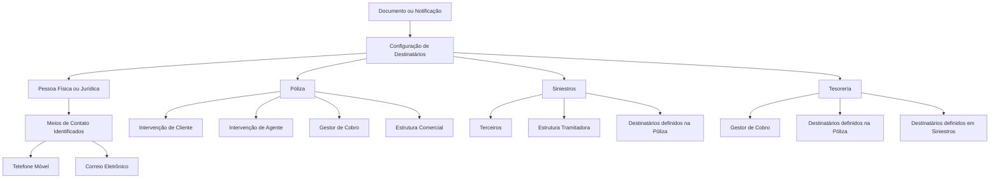

# Configuração de Destinatários para Documentos e Notificações — DOCUMENTACIÓN Reef

## 1. Metadados do Documento
- **Arquivo de Origem:** Não identificado no conteúdo extraído
- **Tipo de Documento:** Especificação Técnica / Procedimento de Configuração
- **Domínio / Sistema:** DOCUMENTACIÓN Reef / Mapfredocument
- **Público-Alvo:** Desenvolvedores, Analistas Funcionais, Operação e Arquitetos
- **Data/Versão Identificada:** Não identificada
- **Owner identificado:** `user:agonzalez_mapfre.com`
- **Lifecycle identificado:** Approved

---

## 2. Resumo Executivo & Contexto de Negócio

O documento descreve a configuração dos destinatários de documentos e notificações no contexto de DOCUMENTACIÓN Reef. Destinatários são pessoas físicas ou jurídicas para as quais documentos e/ou notificações devem ser enviados.

A utilização correta da configuração depende da identificação adequada dos meios de contato dos destinatários, incluindo telefone móvel e endereço de correio eletrônico. O texto não detalha o modelo de dados desses contatos, nem o mecanismo técnico de envio.

A configuração contempla destinatários vinculados aos domínios de Póliza, Siniestros e Tesorería. Cada domínio possui figuras de destinatário próprias, além de permitir reutilização de destinatários definidos em uma póliza ou em siniestros, conforme aplicável.

A associação entre uma figura de destinatário e um documento/notificação possui data de validade, permitindo histórico de alterações, rastreabilidade e exploração posterior das definições. Também existem propriedades para inabilitar um destinatário e para permitir múltiplos destinatários para uma mesma tipologia.

---

## 3. Arquitetura, Componentes & Tecnologias Envolvidas

### Sistemas e componentes identificados

| Componente / Termo | Papel descrito |
| :--- | :--- |
| DOCUMENTACIÓN Reef | Área ou sistema no qual a configuração é documentada. |
| Mapfredocument | Nome exibido no cabeçalho da documentação. |
| Documento / Notificação | Entidade configurável que possui destinatários associados. |
| Destinatário | Pessoa física ou jurídica que recebe documentos e/ou notificações. |
| Póliza | Domínio que contempla intervenções de cliente e agente, gestor de cobro e estrutura comercial. |
| Siniestros | Domínio que contempla terceiros, estrutura tramitadora e destinatários definidos na póliza. |
| Tesorería | Domínio que contempla gestor de cobro e destinatários definidos em póliza ou siniestros. |
| Meios de contato | Dados como telefone móvel e correio eletrônico, necessários para o envio. |



> **Nota de Análise:** O conteúdo não descreve arquitetura de infraestrutura, APIs, métodos HTTP, contratos JSON, bancos de dados, tecnologias de implementação ou integrações técnicas externas.

---

## 4. Regras de Negócio, Especificações Funcionais & Processos

### Objetivo funcional

1. Configurar pessoas físicas ou jurídicas como destinatárias de documentos e/ou notificações.
2. Garantir que os meios de contato dos destinatários estejam corretamente identificados.
3. Associar uma ou mais figuras de destinatário a cada documento ou notificação configurada.
4. Controlar a validade temporal da associação entre figura de destinatário e documento.
5. Manter histórico das alterações efetuadas nas definições.
6. Permitir rastreabilidade e exploração posterior das informações configuradas.
7. Inabilitar destinatários para impedir sua utilização na geração e no envio de documentos ou notificações.
8. Permitir múltiplos destinatários para a mesma tipologia quando a propriedade `mul_dcn` estiver ativada.

### Figuras de destinatário por domínio

#### Póliza

As figuras de destinatário previstas para Póliza são:

- **Intervenção de Cliente:** tomador, assegurado, cesión de derechos e outras intervenções não especificadas.
- **Intervenção de Agente:** principal, secundário, asesor e outras intervenções não especificadas.
- **Gestor de cobro:** domiciliación bancaria, cobrador e outras figuras não especificadas.
- **Estrutura comercial:** primeiro nível, segundo nível e terceiro nível.

#### Siniestros

As figuras de destinatário previstas para Siniestros são:

- **Terceros:** tramitador, supervisor, hospital e cristalero.
- **Estrutura tramitadora:** primeiro nível, segundo nível e terceiro nível.
- **Destinatários definidos na póliza:** qualquer destinatário previamente definido na póliza pode ser utilizado como destinatário em siniestros.

#### Tesorería

As figuras de destinatário previstas para Tesorería são:

- **Gestor de cobro.**
- **Destinatários definidos na póliza.**
- **Destinatários definidos em siniestros.**

### Regras de associação e validade

| Regra | Descrição |
| :--- | :--- |
| Múltiplas figuras por documento | É permitido definir várias figuras de destinatário para cada documento ou notificação configurada. |
| Identificação do documento/notificação | O código do documento/notificação identifica a chave da entidade no sistema. |
| Vigência da associação | A data de validade define a partir de quando a associação entre figura de destinatário e documento está disponível para utilização no sistema. |
| Histórico | A configuração correta de datas de validade habilita histórico das alterações em definições. |
| Rastreabilidade | O histórico habilitado permite traçar e explorar posteriormente as informações configuradas. |
| Inabilitação | Um destinatário inabilitado não pode ser utilizado na geração e no envio de documentos ou notificações. |
| Múltiplos destinatários | Quando `mul_dcn` está ativado, o documento ou notificação deve ser gerado e enviado a cada destinatário encontrado para a mesma tipologia. |

---

## 5. Tabelas de Parâmetros, Ambientes e Estruturas de Dados

| Item / Parâmetro | Descrição / Função | Tipo / Valores / Formato | Ambiente / Observações |
| :--- | :--- | :--- | :--- |
| Compañía | Indica o código da companhia sobre a qual está sendo configurado o documento ou a notificação. | Código de companhia não detalhado. | Configuração de Documento ou Notificação. |
| `opr_idn_val` | Identificador de operação. | `id de operacion`. | O formato não é detalhado. |
| Código do Documento/Notificação | Identifica a chave que identificará o Documento ou Notificação no Sistema. | Código não detalhado. | Chave da entidade no sistema. |
| Fecha de Validez | Estabelece a data a partir da qual a associação da figura do destinatário ao documento fica disponível para utilização. | Data; formato não informado. | Suporta histórico, rastreabilidade e exploração das alterações. |
| `ntf_ade_typ_val` | Tipo de destinatário de notificação. | `1: INTERVENCION`; `2: ACTIVIDAD DE TERCERO`; `3: GESTOR DE COBRO`; `4: ESTRUCTURA COMERCIAL`; `5: ESTRUCTURA TRAMITADORA`. | Valores explicitamente listados no documento. |
| `sqn_val` | Sequência. | Não detalhado. | Sem formato informado. |
| `thp_acv_val` | Classificação da atividade da pessoa física ou jurídica, caracterizada como terceiro. | Não detalhado. | Aplicável a terceiro. |
| `bnf_typ_val` | Tipo de beneficiário. | Não detalhado. | Sem valores especificados. |
| `itc_val` | Forma de atuação do intermediário. | `"p"`, `"o"`, `"a"`. | O significado de cada valor não é detalhado. |
| `mnr_typ_val` | Tipo de gestor. | Não detalhado. | Sem valores especificados. |
| `lvl_val` | Nível. | Não detalhado. | Pode estar relacionado às estruturas comercial ou tramitadora, mas essa relação não é explicitamente definida. |
| `tyl_val` | Tipologia. | Não detalhado. | Sem valores especificados. |
| `ctg_val` | Categoria. | Não detalhado. | Sem valores especificados. |
| Inhabilitación | Determina que o destinatário está inabilitado para geração e envio. | Propriedade; valores não detalhados. | Impede uso do destinatário. |
| `mul_dcn` | Permite múltiplos destinatários para a mesma tipologia de destinatários. | Propriedade de ativação; formato não detalhado. | O documento/notificação deve ser gerado e enviado a cada destinatário identificado. |
| Telefone móvel | Meio de contato do destinatário. | Não detalhado. | Deve estar corretamente identificado. |
| Correio eletrônico | Meio de contato do destinatário. | Não detalhado. | Deve estar corretamente identificado. |

---

## 6. Bateria de Perguntas & Respostas para RAG (FAQ Sintético)

### P1: Qual é o objetivo da configuração de destinatários em DOCUMENTACIÓN Reef?
**R:** O objetivo é configurar as pessoas físicas ou jurídicas que receberão documentos e/ou notificações. Para que a geração e o envio sejam possíveis, os meios de contato dos destinatários, como telefone móvel e correio eletrônico, devem estar corretamente identificados.

### P2: Quais figuras de destinatário podem ser configuradas para Póliza?
**R:** Para Póliza, o documento lista Intervenção de Cliente, incluindo tomador, assegurado e cesión de derechos; Intervenção de Agente, incluindo principal, secundário e asesor; Gestor de cobro, incluindo domiciliación bancaria e cobrador; e Estrutura comercial nos níveis primeiro, segundo e terceiro.

### P3: Quais destinatários podem ser utilizados em Siniestros?
**R:** Em Siniestros, podem ser utilizados terceiros, como tramitador, supervisor, hospital e cristalero; membros da estrutura tramitadora nos níveis primeiro, segundo e terceiro; e qualquer pessoa já definida como destinatária na póliza.

### P4: Quais destinatários podem ser utilizados em Tesorería?
**R:** Tesorería pode utilizar gestor de cobro, qualquer destinatário definido na póliza e qualquer destinatário definido em siniestros.

### P5: É possível associar mais de uma figura de destinatário ao mesmo documento ou notificação?
**R:** Sim. O documento afirma que podem ser definidas várias figuras de destinatário para cada documento ou notificação configurada.

### P6: Qual é a função da Fecha de Validez na associação de destinatários?
**R:** A Fecha de Validez estabelece a data a partir da qual a associação entre a figura do destinatário e o documento fica disponível para ser usada pelo sistema. A configuração correta dessa data permite manter histórico das alterações, rastrear mudanças e explorar posteriormente as informações.

### P7: O que ocorre quando um destinatário está inabilitado?
**R:** A propriedade Inhabilitación determina que o destinatário não poderá ser utilizado na geração nem no envio de documentos ou notificações.

### P8: Qual é o comportamento da propriedade `mul_dcn`?
**R:** Quando `mul_dcn` é ativada, podem existir múltiplos destinatários para a mesma tipologia de destinatário. Nesse caso, o documento ou a notificação deve ser gerado e enviado para cada destinatário encontrado.

### P9: Quais são os valores definidos para `ntf_ade_typ_val`?
**R:** Os valores são: `1` para INTERVENCION; `2` para ACTIVIDAD DE TERCERO; `3` para GESTOR DE COBRO; `4` para ESTRUCTURA COMERCIAL; e `5` para ESTRUCTURA TRAMITADORA.

### P10: Qual atributo identifica a chave de um Documento ou Notificação no sistema?
**R:** O Código do Documento/Notificação identifica a chave que identificará o Documento ou Notificação no Sistema. O texto não informa o nome técnico do campo correspondente nem o formato do código.

### P11: O que representa o parâmetro `thp_acv_val`?
**R:** O parâmetro `thp_acv_val` representa a classificação da atividade da pessoa física ou jurídica, identificada no texto como terceiro. O documento não apresenta os valores permitidos nem regras adicionais de validação.

### P12: Quais valores de forma de atuação do intermediário são listados para `itc_val`?
**R:** O documento lista os valores `"p"`, `"o"` e `"a"` para `itc_val`. O significado semântico individual de cada código não é explicado no conteúdo fornecido.

---

## 7. Glossário de Termos, Siglas & Conceitos-Chave

- **DOCUMENTACIÓN Reef:** Nome da área ou sistema de documentação mencionado no conteúdo.
- **Mapfredocument:** Nome exibido no cabeçalho da documentação.
- **Destinatário:** Pessoa física ou jurídica à qual serão enviados documentos e/ou notificações.
- **Documento / Notificação:** Entidade configurável que pode possuir uma ou mais figuras de destinatário.
- **Póliza:** Domínio que contempla destinatários relacionados a cliente, agente, cobrança e estrutura comercial.
- **Siniestros:** Domínio que contempla terceiros, estrutura tramitadora e destinatários definidos em póliza.
- **Tesorería:** Domínio que contempla gestor de cobro e destinatários oriundos de póliza ou siniestros.
- **Intervención:** Tipo de destinatário associado a intervenções.
- **Actividad de Tercero:** Tipo de destinatário associado à atividade de uma pessoa física ou jurídica classificada como terceiro.
- **Gestor de Cobro:** Figura relacionada à gestão de cobrança, incluindo domiciliación bancaria e cobrador.
- **Estructura Comercial:** Estrutura organizacional comercial com primeiro, segundo e terceiro níveis.
- **Estructura Tramitadora:** Estrutura organizacional tramitadora com primeiro, segundo e terceiro níveis.
- **`opr_idn_val`:** Identificador de operação.
- **`ntf_ade_typ_val`:** Tipo de destinatário de notificação.
- **`sqn_val`:** Sequência.
- **`thp_acv_val`:** Classificação da atividade de terceiro.
- **`bnf_typ_val`:** Tipo de beneficiário.
- **`itc_val`:** Forma de atuação do intermediário.
- **`mnr_typ_val`:** Tipo de gestor.
- **`lvl_val`:** Nível.
- **`tyl_val`:** Tipologia.
- **`ctg_val`:** Categoria.
- **`mul_dcn`:** Propriedade que permite múltiplos destinatários para uma mesma tipologia.

---

## 8. Notas Críticas, Riscos & Limitações

- O documento não informa o nome do arquivo original, data, versão, autor técnico ou histórico de revisões.
- O conteúdo não detalha APIs, métodos HTTP, contratos JSON, persistência, serviços, filas, infraestrutura, autenticação ou autorização.
- Os formatos e domínios válidos para `opr_idn_val`, `sqn_val`, `thp_acv_val`, `bnf_typ_val`, `mnr_typ_val`, `lvl_val`, `tyl_val` e `ctg_val` não são fornecidos.
- Os significados individuais dos valores `"p"`, `"o"` e `"a"` de `itc_val` não são explicados.
- O documento não define como o sistema resolve destinatários quando há múltiplos registros para uma mesma tipologia, exceto que o envio deve ocorrer para cada destinatário quando `mul_dcn` estiver ativado.
- Não há detalhamento sobre tratamento de dados de contato ausentes, inválidos, duplicados ou desatualizados.
- A terceira página não contém conteúdo textual funcional adicional.

---

## 9. Conteúdo Bruto Estruturado (Referência Fiel)

```text
--- [PÁGINA 1 DE 3] ---

EN CONSTRUCCIÓN
Conguración de los DESTINATARIOS de los
Documentos/Noticaciones
Objetivo
Los destinatarios son aquellas personas Físicas/Jurídicas a quienes se van a enviar los Documentos y/o Noticaciones.
Para ello, la información de los medios de contacto de dichas personas (teléfono móvil, dirección de correo electrónico, ...) tiene que estar
correctamente identicada para poder ser empleada.
Las guras que se contemplan son:
PÓLIZA:
Intervención de Cliente (tomador, asegurado, cesión de derechos, etc.)
Intervención de Agente (principal, secundario, asesor, etc.)
Gestor de cobro (domiciliación bancaria, cobrador, etc.)
Estructura comercial (1er. nivel, 2do. nivel y 3er. nivel)
SINIESTROS:
Terceros (tramitador, supervisor, hospital, cristalero)
Estructura tramitadora (1er. nivel, 2do. nivel y 3er. nivel)
Cualquiera de los denidos en la póliza como destinatario
TESORERÍA:
Gestor de cobro.
Cualquiera de los denidos en la póliza como destinatario.
Cualquiera de los denidos en siniestros como destinatario.
NOTA: Se pueden denir varias guras de destinatario por cada documento o Noticación congurada.
-Propiedades
Propiedades
Compañía.
Esta propiedad le indica al sistema el código de la compañía sobre la que se está realizando la conguración del Documento o Noticación.
Documentation / DOCUMENTACIÓN Reef
DOCUMENTACIÓN Reef
Mapfredocument
DOCUMENTACIÓN Reef
Owner
user:agonzalez_mapfre.com
Lifecycle
Approved Source
 / 
 VL
Buscar Inicio Soluciones Arquitecturas APIs Componentes Cloud Documentación Zeus Reef Ayuda
ES


--- [PÁGINA 2 DE 3] ---

opr_idn_val
id de operacion
Código del Documento/Noticación
Este atributo identica la clave que identicará al Documento o Noticación en el Sistema.
Fecha de Validez
Esta propiedad establece la fecha a partir de la cual la asociación de la gura del Destinatario al Documento está disponible en el sistema
para ser utilizada, por lo que una correcta conguración habilita tener un histórico de los cambios efectuados en las deniciones y poder así
trazar y explotar posteriormente esta información.
ntf_ade_typ_val
tipo destinatario noticacion - 1: INTERVENCION - 2: ACTIVIDAD DE TERCERO - 3: GESTOR DE COBRO - 4: ESTRUCTURA COMERCIAL - 5:
ESTRUCTURA TRAMITADORA
sqn_val
secuencia
thp_acv_val
clasicación de la actividad de la persona física o jurídica (tercero)
bnf_typ_val
tipo beneciario
itc_val
forma de actuacion del intermediario ("p","o","a")
mnr_typ_val
tipo de gestor
lvl_val
nivel
tyl_val
tipologia
ctg_val
categoria
Inhabilitación
Esta propiedad establece que el Destinatario está inhabilitado para poder ser utilizado en la generación y envío de los documentos o
noticaciones.
mul_dcn
La activación de esta propiedad establece que se pueden encontrar múltiples Destinatarios para la misma tipología de Destinatarios y por
tanto el documento o noticación se tiene que generar y enviar a cada uno de ellos.
Vínculos
Preguntas frecuentes


--- [PÁGINA 3 DE 3] ---

[Página em branco ou apenas elementos visuais/imagem]
```
