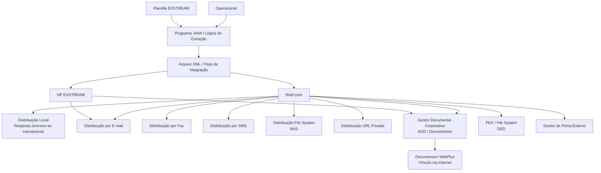

# Definição de Atributos para Documentos e Notificações no Reef.core

## 1. Metadados do Documento
- **Arquivo de Origem:** Não identificado no conteúdo fornecido
- **Tipo de Documento:** Especificação Técnica / Manual Funcional
- **Domínio / Sistema:** Reef.core, documentação Reef, MAPFRE, gestão e distribuição de documentos/notificações
- **Público-Alvo:** Desenvolvedores, Arquitetos, Operação, Tecnologia e Processos das entidades MAPFRE locais
- **Data/Versão Identificada:** Não identificada

---

## 2. Resumo Executivo & Contexto de Negócio

O documento define propriedades e atributos aplicáveis a documentos e notificações gerados para terceiros. A finalidade declarada é detalhar as configurações necessárias para documentos de diferentes classificações, incluindo documentos contratuais, comerciais, informativos, de Voz do Cliente e operativos.

A configuração de um documento ou notificação contempla identificação, companhia, data de validade, versão, âmbito de entrada ou saída, canais de distribuição e propriedades operativas. A data de validade permite manter histórico das alterações realizadas nas definições e, consequentemente, possibilita rastrear e explorar posteriormente essas informações.

O Reef.core pode integrar-se com ferramentas corporativas de geração e distribuição de documentos ou assumir diretamente essas tarefas. O catálogo define a ferramenta geradora e distribuidora, com os valores documentados `Reef.core` e `HP EXSTREAM`.

Os canais de distribuição incluem retorno síncrono ao transacional, e-mail, fax, SMS, file system, URL privada, gestor documental corporativo, distribuição a fornecedor externo, assinatura eletrônica e vínculo WebPlus do Documentum. Cada meio pode exigir atributos específicos para completar a operação de geração, entrega e acesso ao documento.

A responsabilidade pela correta configuração e implementação das lógicas de extração e validação é atribuída ao departamento de Tecnologia e Processos da entidade MAPFRE local. O documento apresenta como exemplo a necessidade de impedir impressão direta de CC.PP. para flotilhas de automóveis no MAPFRE México, direcionando essas operações para processamento batch.

---

## 3. Arquitetura, Componentes & Tecnologias Envolvidas

Os componentes, sistemas e tecnologias explicitamente citados são:

- **Reef.core:** sistema que pode gerar e distribuir documentos e notificações, além de integrar-se com ferramentas corporativas.
- **Operacional:** origem das informações necessárias para a geração de documentos e notificações.
- **Programa JAVA / Lógica de Extração:** gera um arquivo XML e extrai do Operacional as informações necessárias à integração.
- **XML:** peça de integração produzida pela lógica de extração.
- **HP EXSTREAM:** ferramenta geradora documentada para composição de documentos.
- **Plantilla EXSTREAM:** modelo-base utilizado para codificação da lógica de extração JAVA e geração/distribuição de documentos.
- **Gestor Documental Corporativo / AGD / Documentum:** destino de arquivamento de documentos.
- **Documentum WebPlus:** mecanismo para disponibilizar documentos do gestor documental por link na Internet.
- **NAS:** destino de documentos distribuídos via File System.
- **PEX / DED:** distribuição para fornecedor externo por File System, para posterior incorporação ao processo de Distribuição Externalizada de Documentação.
- **Gestor de Firma:** serviço externo que realiza ações necessárias ao tipo de assinatura solicitado.
- **Serviço Web / Transacional:** utilizados no canal de distribuição local síncrona.
- **E-mail, Fax e SMS:** meios de entrega ou de comunicação de credenciais de acesso.



### Fluxo funcional de geração e distribuição

1. A configuração identifica o documento ou notificação por companhia, código, versão, validade e âmbito de uso.
2. O catálogo define o canal ou os canais de distribuição e as propriedades operativas necessárias.
3. A lógica de negócio de validação determina se o documento ou notificação deve ser habilitado e enviado à ferramenta corporativa de distribuição.
4. A lógica de extração, implementada como programa JAVA, extrai dados do Operacional e gera um arquivo XML.
5. A ferramenta geradora definida no catálogo, Reef.core ou HP EXSTREAM, utiliza as informações de integração e a plantilla aplicável para compor o documento.
6. A distribuição é executada pelo meio configurado, considerando os atributos específicos exigidos pelo canal.
7. Quando aplicável, o documento é armazenado e indexado no gestor documental segundo os modelos e tipos documentais locais.

> **Nota de Análise:** O documento cita Reef.core, HP EXSTREAM, Documentum, WebPlus, PEX e DED, mas não especifica interfaces, métodos HTTP, contratos JSON, endpoints, versões, portas ou protocolos técnicos de integração.

---

## 4. Regras de Negócio, Especificações Funcionais & Processos

### 4.1 Propriedades de identificação e vigência

- **Compañía:** indica ao sistema o código da companhia sobre a qual está sendo realizada a configuração do documento ou notificação.
- **Código do Documento/Notificação:** identifica a chave que identificará o documento ou notificação no sistema.
- **Data de Validade:** estabelece a data a partir da qual a definição do documento fica disponível para uso no sistema.
  - Uma configuração correta permite manter um histórico de mudanças realizadas nas definições.
  - O histórico pode ser rastreado e explorado posteriormente.
- **Entrada ou Saída:** identifica o âmbito de uso do documento ou notificação conforme valores permitidos no catálogo do núcleo.
- **Versão:** estabelece a versão do documento ou notificação.
- **Inabilitação:** determina que o atributo do documento ou notificação fica inabilitado para uso.

### 4.2 Regras de distribuição

- A **Distribuição Local** retorna o documento de forma síncrona na resposta do serviço web ao transacional.
  - O transacional é responsável por apresentar o documento em tela ou enviá-lo a uma impressora.
- A **Distribuição por Correio Eletrônico** envia o documento como anexo a endereços de e-mail indicados.
- A **Distribuição por Fax** envia o documento ao telefone indicado.
- A **Distribuição por SMS** envia uma mensagem ao número de telefone móvel indicado.
- A **Distribuição File System** deposita o documento em uma NAS.
- A **Distribuição URL Privada** disponibiliza o documento pela Internet por meio de um link enviado ao cliente por e-mail.
  - O acesso à documentação é obtido mediante uma chave.
  - A chave pode ser enviada por SMS.
  - A chave pode ser informada no próprio e-mail sem ser incluída explicitamente, utilizando como exemplo o Documento Nacional de Identidade ou o número da apólice.
- A **Distribuição Gestor Documental** arquiva o documento no gestor documental corporativo AGD.
- A **Distribuição Proveedor Externo** deposita o documento em um file system para incorporação posterior ao processo DED.
- A **Distribuição Firma Electrónica** encaminha o documento ao serviço externo do Gestor de Firma.
  - O Gestor de Firma executa ações para produzir o tipo de assinatura requerido na solicitação.
  - Os exemplos citados incluem assinatura por terceiros de confiança e assinatura biométrica.
- A **Distribuição Gestor Documental vía Vínculo** disponibiliza, pela Internet, documentos residentes no gestor documental corporativo.
  - O link é enviado ao cliente por e-mail.
  - O acesso utiliza uma chave enviada por SMS ou informada no e-mail sem inclusão explícita, usando como exemplos o Documento Nacional de Identidade ou número da apólice.

### 4.3 Geração e extração de dados

- A **Plantilla Diseño Documento** contém o código da plantilla EXSTREAM.
- A plantilla EXSTREAM serve como base para a codificação da lógica de extração JAVA.
- A lógica de extração deve considerar os canais de distribuição e as etiquetas necessárias para gerar e distribuir o documento.
- A **Lógica de Extração** é um programa JAVA que:
  1. Gera um arquivo XML.
  2. Extrai do Operacional as informações necessárias ao documento ou notificação.
  3. Integra a informação com a ferramenta responsável pela composição e envio.
- Os atributos necessários variam conforme o meio de envio definido e utilizado.

### 4.4 Exemplo de envio de carta de finiquito de sinistro por e-mail

Para comunicar-se com o beneficiário de um sinistro e enviar por correio eletrônico, como anexo, a carta de finiquito do sinistro, devem ser completadas duas ações distintas:

1. **Ação de envio do e-mail**
   - Conhecer o endereço de e-mail.
   - Definir o remetente.
   - Redigir o assunto.
   - Redigir o corpo do e-mail.

2. **Ação de geração e anexação do documento físico**
   - Identificar qual plantilla definida na ferramenta corporativa será utilizada.
   - Transmitir, na peça de integração, os dados requeridos pelo desenho da plantilla.
   - Os exemplos de dados citados são:
     - Logo.
     - Assinatura.
     - Dados registrais da entidade MAPFRE.
     - Nome e sobrenomes do beneficiário.
     - Valor da indenização final.

### 4.5 Indexação, obtenção e validação

- **Indexação Gestor Documental:** quando o documento deve ser distribuído e, portanto, armazenado no gestor documental, deve-se indicar o método de indexação dentro da relação local de modelos e tipos documentais existentes.
- **Método de Obtenção do Documento:** identifica o método de obtenção do documento ou notificação segundo valores permitidos no catálogo do núcleo.
- **Lógica de Negócio - Validação:** procedimento que verifica se um documento ou notificação deve ser considerado habilitado e enviado à ferramenta corporativa responsável pela distribuição.
- **Exemplo de validação no MAPFRE México:**
  - Flotilhas de automóveis não devem imprimir diretamente seus CC.PP.
  - As impressões devem ser realizadas em modo batch.
  - Mesmo que o canal de Distribuição Local esteja habilitado para todas as operações de emissão de apólices, uma lógica de validação corretamente implementada pode impedir a impressão direta.

### 4.6 Responsabilidade organizacional

O departamento de Tecnologia e Processos da entidade MAPFRE local é responsável por configurar e implementar corretamente:

- As lógicas de extração.
- As lógicas de validação.

### 4.7 Retenção

- **Aplica Retención:** marcado no documento como `== Pendiente ==`.
- Não há detalhamento adicional sobre regras, critérios, período ou comportamento de retenção.

---

## 5. Tabelas de Parâmetros, Ambientes e Estruturas de Dados

### 5.1 Propriedades de documentos e notificações

| Item / Parâmetro | Descrição / Função | Tipo / Valores / Formato | Ambiente / Observações |
| :--- | :--- | :--- | :--- |
| Compañía | Indica o código da companhia sobre a qual é realizada a configuração. | Código de companhia | Documento ou notificação |
| Código do Documento/Notificação | Identifica a chave do documento ou notificação no sistema. | Chave / código | Documento ou notificação |
| Data de Validade | Define a data a partir da qual a definição fica disponível para uso. | Data | Permite histórico, rastreabilidade e exploração posterior de alterações. |
| Entrada ou Saída | Identifica o âmbito de uso do documento ou notificação. | Valores permitidos no catálogo do núcleo | Não detalhado no documento. |
| Versão | Estabelece a versão do documento ou notificação. | Versão | Não detalhado no documento. |
| Plantilla Diseño Documento | Contém o código da plantilla EXSTREAM usada como base da lógica de extração JAVA. | Código de plantilla EXSTREAM | Deve considerar canais de distribuição e etiquetas necessárias. |
| Ferramenta Geradora | Define a ferramenta que gera e distribui o documento ou notificação. | `1 Reef.core`; `2 HP EXSTREAM` | Reef.core pode realizar geração e distribuição diretamente. |
| Lógica de Extração | Programa JAVA que gera XML e extrai informações do Operacional. | Programa JAVA / arquivo XML | Integra dados com a ferramenta de composição e envio. |
| Indexação Gestor Documental | Define o método de indexação do documento no gestor documental. | Método conforme modelos e tipos documentais locais | Aplicável quando houver armazenamento no gestor documental. |
| Método de Obtenção do Documento | Identifica o método de obtenção do documento ou notificação. | Valores permitidos no catálogo do núcleo | Valores não detalhados. |
| Lógica de Negócio - Validação | Verifica se o documento ou notificação deve ser habilitado e enviado à distribuição. | Procedimento de validação | Deve controlar exceções e restrições de negócio. |
| Aplica Retención | Propriedade de retenção. | `== Pendiente ==` | Sem detalhamento adicional. |
| Inhabilitación | Inabilita o atributo do documento ou notificação para uso. | Estado de inabilitação | Não há valores técnicos detalhados. |

### 5.2 Canais de distribuição

| Item / Parâmetro | Descrição / Função | Tipo / Valores / Formato | Ambiente / Observações |
| :--- | :--- | :--- | :--- |
| Distribuição Local | Retorna o documento de forma síncrona na resposta do serviço web ao transacional. | Serviço web / resposta síncrona | O transacional apresenta em tela ou envia para impressora. |
| Distribuição Correio Eletrônico | Envia o documento como anexo a endereços indicados. | E-mail com anexo | Requer endereço de e-mail, remetente, assunto e corpo. |
| Distribuição por Fax | Envia o documento por fax ao telefone indicado. | Fax / telefone | Não há detalhamento de formato ou integração. |
| Distribuição por SMS | Envia mensagem ao telefone móvel indicado. | SMS / telefone móvel | Pode ser usado para enviar chave de acesso. |
| Distribuição File System | Deposita o documento em uma NAS. | File System / NAS | Não há caminho ou servidor especificado. |
| Distribuição URL Privada | Disponibiliza documento por link enviado por e-mail. | Link Internet / chave de acesso | Chave pode ser enviada por SMS ou informada indiretamente no e-mail. |
| Distribuição Gestor Documental | Arquiva o documento no gestor documental corporativo. | AGD / Documentum | Requer definição de método de indexação quando aplicável. |
| Distribuição Proveedor Externo | Deposita documento em file system para posterior incorporação ao processo externo. | PEX / File System / DED | Associada à Distribuição Externalizada de Documentação. |
| Distribuição Firma Electrónica | Envia documento ao serviço externo do Gestor de Firma. | Serviço externo | Exemplos: assinatura por terceiros de confiança e assinatura biométrica. |
| Distribuição Gestor Documental vía Vínculo | Disponibiliza documentos do gestor documental por link na Internet. | Documentum WebPlus / link / chave | Link enviado por e-mail; chave pode ser enviada por SMS. |

### 5.3 Dados citados para o exemplo de e-mail com carta de finiquito

| Item / Parâmetro | Descrição / Função | Tipo / Valores / Formato | Ambiente / Observações |
| :--- | :--- | :--- | :--- |
| Endereço de e-mail | Destino da comunicação ao beneficiário. | Endereço de e-mail | Necessário para a ação de envio do e-mail. |
| Remetente | Identifica quem envia o e-mail. | Não detalhado | Necessário para a ação de envio. |
| Assunto | Texto de assunto do e-mail. | Texto | Necessário para a ação de envio. |
| Corpo do e-mail | Conteúdo da mensagem de e-mail. | Texto | Necessário para a ação de envio. |
| Plantilla corporativa | Modelo utilizado para gerar o anexo físico. | Plantilla definida na ferramenta corporativa | A seleção depende da geração do documento. |
| Logo | Dado transmitido conforme o desenho da plantilla. | Não detalhado | Exemplo de dado de integração. |
| Assinatura | Dado transmitido conforme o desenho da plantilla. | Não detalhado | Exemplo de dado de integração. |
| Dados registrais MAPFRE | Dados da entidade MAPFRE utilizados no documento. | Não detalhado | Exemplo de dado de integração. |
| Nome e sobrenomes do beneficiário | Identificação do beneficiário. | Não detalhado | Exemplo de dado de integração. |
| Valor da indenização final | Informação de indenização do sinistro. | Valor monetário não especificado | Exemplo de dado de integração. |

---

## 6. Bateria de Perguntas & Respostas para RAG (FAQ Sintético)

### P1: Qual é o objetivo da definição de atributos de documentos e notificações no Reef.core?
**R:** O objetivo é detalhar as propriedades de documentos e possíveis notificações que podem ser gerados e enviados a terceiros, independentemente de sua classificação, incluindo documentos contratuais, comerciais, informativos, de Voz do Cliente e operativos.

### P2: Como a data de validade de um documento contribui para rastreabilidade?
**R:** A data de validade estabelece a partir de quando uma definição de documento fica disponível no sistema. Sua configuração correta permite manter um histórico das mudanças efetuadas nas definições, rastrear essas alterações e explorar posteriormente as informações registradas.

### P3: Quais ferramentas geradoras de documentos estão previstas no catálogo?
**R:** O catálogo documenta dois tipos de ferramenta geradora: `1 Reef.core` e `2 HP EXSTREAM`. O texto informa que o Reef.core pode ser responsável pela geração e distribuição, embora o submódulo de notificações esteja orientado à integração com ferramentas corporativas de geração e envio.

### P4: Como funciona a Distribuição Local de documentos?
**R:** Na Distribuição Local, o documento é devolvido de forma síncrona na resposta de um serviço web ao sistema transacional. O transacional é responsável por apresentar o documento em tela ou enviá-lo a uma impressora.

### P5: Como funciona o acesso por URL Privada?
**R:** Na Distribuição URL Privada, o documento fica acessível pela Internet mediante um link enviado ao cliente por correio eletrônico. O acesso é protegido por uma chave, que pode ser enviada ao usuário por SMS ou informada no e-mail sem apresentá-la explicitamente, usando dados como o Documento Nacional de Identidade ou o número da apólice.

### P6: Qual é a função da lógica de extração?
**R:** A lógica de extração é um programa JAVA que gera um arquivo XML e extrai do Operacional todas as informações de que o documento ou notificação necessita para integrar-se à ferramenta encarregada de sua composição e envio.

### P7: Quais informações são necessárias para enviar uma carta de finiquito de sinistro por e-mail?
**R:** O processo requer duas ações. Para o envio do e-mail, são necessários endereço eletrônico, remetente, assunto e corpo da mensagem. Para gerar e anexar o arquivo físico, é necessário selecionar a plantilla definida na ferramenta corporativa e transmitir os dados exigidos pelo desenho, como logo, assinatura, dados registrais da entidade MAPFRE, nome e sobrenomes do beneficiário e valor da indenização final.

### P8: Quando deve ser configurada a indexação no gestor documental?
**R:** A indexação deve ser indicada quando o documento precisa ser distribuído e, consequentemente, armazenado no Gestor Documental. O método deve ser definido dentro da relação de modelos e tipos documentais existentes localmente.

### P9: Qual é a finalidade da lógica de negócio de validação?
**R:** A lógica de negócio de validação verifica se um documento ou notificação deve ser considerado habilitado e enviado à ferramenta corporativa responsável por sua distribuição. Ela permite aplicar restrições específicas mesmo quando um canal esteja genericamente habilitado.

### P10: Qual regra de negócio é apresentada para flotilhas de automóveis no MAPFRE México?
**R:** O documento informa que as flotilhas de automóveis no MAPFRE México não devem imprimir diretamente seus CC.PP.; a impressão deve ocorrer em modo batch. Uma lógica de validação corretamente implementada pode bloquear a impressão direta, mesmo que o canal de Distribuição Local esteja habilitado para operações de emissão de apólices.

### P11: Quem é responsável pela implementação das lógicas de extração e validação?
**R:** A responsabilidade pela correta configuração e implementação das lógicas de extração e validação é do departamento de Tecnologia e Processos da entidade MAPFRE local.

### P12: Como ocorre a distribuição por fornecedor externo?
**R:** Na Distribuição Proveedor Externo, identificada como PEX / File System – DED, o documento é depositado em um file system para posterior incorporação ao processo de Distribuição Externalizada de Documentação.

---

## 7. Glossário de Termos, Siglas & Conceitos-Chave

- **AGD:** Gestor documental corporativo citado como destino de arquivamento de documentos.
- **CC.PP.:** Sigla mencionada no exemplo de flotilhas de automóveis no MAPFRE México; o documento não apresenta expansão ou definição.
- **DED:** Distribuição Externalizada de Documentação.
- **Documentum:** Gestor documental corporativo citado para arquivamento de documentos.
- **Documentum WebPlus:** mecanismo que permite acesso, via Internet e link, a documentos residentes no gestor documental corporativo.
- **File System:** sistema de arquivos utilizado para depósito de documentos.
- **Gestor de Firma:** serviço externo que toma ações para produzir o tipo de assinatura solicitado.
- **HP EXSTREAM:** ferramenta geradora de documentos listada no catálogo.
- **Lógica de Extração:** programa JAVA que gera XML e extrai dados do Operacional para integração com a ferramenta de composição e envio.
- **Lógica de Negócio - Validação:** procedimento que decide se um documento ou notificação deve ser habilitado e enviado à distribuição.
- **NAS:** destino de documentos distribuídos pelo canal File System.
- **Operacional:** fonte das informações requeridas para gerar documentos ou notificações.
- **PEX:** termo associado à distribuição em fornecedor externo por File System.
- **Plantilla EXSTREAM:** modelo cujo código serve de base para a lógica de extração JAVA.
- **Reef.core:** sistema que pode gerar e distribuir documentos ou integrar-se com ferramentas corporativas para essas tarefas.
- **SMS:** mensageria enviada ao telefone móvel indicado; também pode transportar chave de acesso.
- **URL Privada:** modalidade de acesso a documento pela Internet mediante link e chave.
- **XML:** arquivo gerado pela lógica de extração para integração de dados.
- **Voz del Cliente:** classificação de documentos ou notificações citada no escopo do documento.

---

## 8. Notas Críticas, Riscos & Limitações

- O documento não identifica arquivo de origem, autor, data, versão documental ou versão do Reef.core.
- Não há especificação de endpoints, protocolos, métodos HTTP, contratos JSON/XML detalhados, autenticação, criptografia, formatos de arquivo ou códigos de erro.
- Os valores permitidos para **Entrada ou Saída** e para **Método de Obtenção do Documento** são referenciados como pertencentes ao catálogo do núcleo, mas não são apresentados.
- O atributo **Aplica Retención** está explicitamente pendente e não possui regras associadas.
- Não são definidos os critérios técnicos de indexação do gestor documental, somente a necessidade de escolher um método conforme modelos e tipos documentais locais.
- A segurança da URL Privada depende de uma chave, mas o documento não detalha expiração, política de senha, tentativa máxima, auditoria, revogação ou mecanismo de validação.
- A configuração e implementação corretas das lógicas de extração e validação dependem do departamento de Tecnologia e Processos de cada entidade MAPFRE local.
- O documento apresenta o caso de uso de flotilhas do MAPFRE México, mas não estabelece se a regra é aplicável a outras entidades, países, produtos ou operações.
- As siglas **PEX** e **CC.PP.** são citadas sem expansão explícita completa no conteúdo fornecido.

---

## 9. Conteúdo Bruto Estruturado (Referência Fiel)

```text
--- [PÁGINA 1 DE 3] ---

DEFINICIÓN de los Atributos de los Documentos/Noticaciones
Objetivo
Detallar las Propiedades de todos aquellos Documentos o posibles Noticaciones que se pueden generar y enviar a Terceras Personas
cualesquiera que sea su clasicación: Contractuales, Comerciales, Informativas, Voz del Cliente, Operativas,...
Propiedades
Canales de Distribución
Propiedades Operativas
Propiedades
Compañía.
Esta propiedad le indica al sistema el código de la compañía sobre la que se está realizando la conguración del Documento o Noticación.
Código del Documento/Noticación
Este atributo identica la clave que identicará al Documento o Noticación en el Sistema.
Fecha de Validez
Esta propiedad establece la fecha a partir de la cual la denición del Documento está disponible en el sistema para ser utilizada, por lo que
una correcta conguración habilita tener un histórico de los cambios efectuados en las deniciones y poder así trazar y explotar
posteriormente esta información.
Entrada o Salida
Esta propiedad identica el ámbito de uso del documento o noticación de acuerdo con los valores permitidos en el catálogo del núcleo.
Versión
Esta propiedad establece la versión del Documento o Noticación.
Canales de Distribución
Distribución Local
Esta propiedad establece si el documento se devuelve de forma síncrona en la respuesta del servicio web entregándolo al transaccional,
siendo éste quien se encargará de presentarlo por pantalla o enviarlo a una impresora.
Documentation / DOCUMENTACIÓN Reef
DOCUMENTACIÓN Reef
Mapfredocument
DOCUMENTACIÓN Reef
Owner
user:agonzalez_mapfre.com
Lifecycle
Approved Source
 / 
 VL
Buscar Inicio Soluciones Arquitecturas APIs Componentes Cloud Documentación Zeus Reef Ayuda
ES


--- [PÁGINA 2 DE 3] ---

Distribución Correo Electrónico
El documento se enviará como documento adjunto en un correo electrónico a las direcciones indicadas.
Distribución por Fax
Fax El Documento se enviará por Fax al Teléfono indicado.
Distribución por SMS (Mensajería)
SMS Se enviará un mensaje al Teléfono móvil indicado.
Distribución File System
Sistema de archivos – File System El Documento se depositará en una NAS.
Distribución URL Privada
Url privada El documento será accesible a través de Internet, mediante un link que se enviará al cliente por correo electrónico. El acceso a la
documentación se obtiene a través de una clave que se podrá enviar al usuario por SMS o informándola en el propio correo electrónico sin
incluirla explícitamente (por ejemplo, utilizando el "Documento Nacional de Identidad", el "número de la póliza", …)
Distribución Gestor Documental
Documentum el documento se archivará en el gestor documental corporativo (AGD).
Distribución Proveedor Externo
PEX / File System – DED (Distribución en proveedor externo) El Documento será depositado en un le System para su posterior
incorporación al proceso de Distribución Externalizada de Documentación (DED).
Distribución Firma Electrónica
Firma Electrónica El documento se envía al servicio externo del Gestor de Firma que tomará las acciones oportunas para que se produzca el
tipo de rmado requerido en la petición, por ejemplo, rmado por terceros de conanza, rma biométrica, ...
Distribución Gestor Documental vía Vínculo
Documentum WebPlus El documento o los documentos residentes en el gestor documental corporativo, serán accesibles a través de Internet
mediante un link que se enviará al cliente por correo electrónico. El acceso a la documentación se obtiene a través de una clave que se podrá
enviar al usuario por SMS o informándola en el propio correo electrónico sin incluirla explícitamente (por ejemplo, utilizando el "Documento
Nacional de Identidad", el "número de la póliza", …)
Propiedades Operativas
Plantilla Diseño Documento
Esta propiedad contiene el código de la Plantilla EXSTREAM que servirá como base para la codicación de la lógica de extracción JAVA (de
acuerdo con los canales de distribución y las etiquetas que sean necesarias rellenar para poder generar y distribuir nuestro documento).
Herramienta Generadora
Aunque en principio el sub módulo de noticaciones está orientado a la integración con las herramientas corporativas de generación y envío
de los Documentos, el sistema también permite que sea el propio Reef.core el encargado de realizar ambas tareas y este atributo del
catálogo establece expresamente cual va a ser la herramienta generadora (y distribuidora) del Documento o Noticación.
TIPO HERRAMIENTA
1 Reef.core
2 HP EXSTREAM
Lógica de Extracción


--- [PÁGINA 3 DE 3] ---

Programa JAVA que permite generar ur archivo xml y que se encarga de extraer del Operacional toda aquella información que necesita el
Documento o Noticación para su integración con la herramienta encargada de su composición y envío.
Dependiendo del medio de envío denido y empleado con el documento se habrán de indicar los atributos especícos para poder completar
la operación ya que los mismos varían dependiendo del medio utilizado.
Por ejemplo, si queremos comunicarnos con el beneciario de un siniestro para enviarle por correo electrónico y como archivo anexo la carta
niquito del Siniestro, tendremos que completar dos acciones diferentes:
Una primera que englobará todos las acciones que permitan enviar el correo electrónico, y
Una segunda que permita generar y anexar el archivo ‘físico’ al correo electrónico.
Por tanto y para la primera acción es necesario conocer la dirección de correo electrónico, denir quien va a ser el remitente, redactar el
asunto y el cuerpo del correo…,
En cambio para la segunda acción tendremos que conocer qué plantilla de las denidas en la Herramienta Corporativa vamos a utilizar para
su generación y dependiendo del diseño de la misma, qué datos se han de transmitir desde el Operacional en la pieza de integración: Logo,
Firma y datos registrales de la entidad MAPFRE, Nombre y Apellidos del Beneciario, importe de la indemnización nal, …
Indexación Gestor Documental
En el supuesto que el Documento deba ser distribuido y por tanto almacenado en el Gestor Documental se debe indicar el método de
indexación del documento dentro de la relación de Modelos y Tipos Documentales existentes localmente.
Método de Obtención del Documento
Esta propiedad del catálogo identica el método de obtención del documento o noticación de acuerdo con los valores permitidos en el
catálogo del núcleo.
Lógica de Negocio - Validación
Procedimiento que se encarga de vericar si para un Documento o Noticación se debe o no considerar su habilitación y envío a la
herramienta Corporativa encargada de su distribución.
Por Ejemplo, en MAPFRE México las Flotillas de Automóviles no deben imprimir sus CC.PP directamente sino en forma Batch. Como
consecuencia de ello y aunque por denición el CANAL de Distribución Local estuviera habilitado para todas las operaciones de emisión de
pólizas, con una lógica de validación implementada correctamente se podría controlar que no fuera factible imprimirlas en modo directo.
NOTA: Es responsabilidad del departamento de Tecnología y Procesos de la Entidad MAPFRE local congurar e implementar correctamente
las lógicas de Extracción y Validación.
Aplica Retención
== Pendiente ==
Inhabilitación
Esta propiedad establece que el Atributo del Documento o Noticación está inhabilitado para poder ser utilizado.
Vínculos
Documentos / Noticaciones
Documentos / Variables o Etiquetas
Preguntas frecuentes
```
