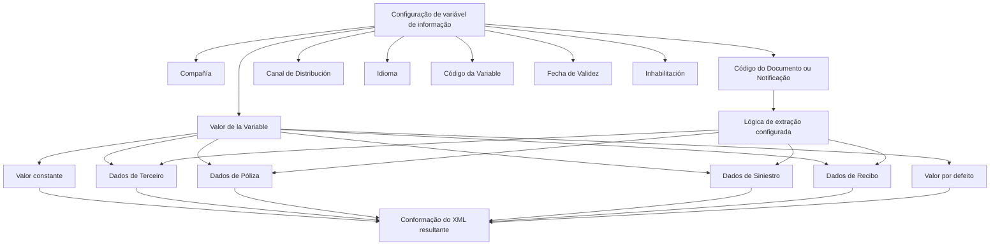

# Definição das Variáveis de Informação de Documentos e Notificações no Reef

## 1. Metadados do Documento
- **Arquivo de Origem:** `Não identificado no conteúdo extraído`
- **Tipo de Documento:** `Especificação Técnica`
- **Domínio / Sistema:** `Reef / Mapfredocument / Documentos e Notificações`
- **Público-Alvo:** `Desenvolvedores, Arquitetos, Operação e equipes de configuração funcional`
- **Data/Versão Identificada:** `Não identificada`

---

## 2. Resumo Executivo & Contexto de Negócio

O documento descreve a definição e a configuração de variáveis de informação, também chamadas de etiquetas, utilizadas em Documentos e Notificações no contexto do Reef. O objetivo declarado é detalhar as variáveis empregadas de acordo com os respectivos canais de distribuição, permitindo a conformação correta de arquivos XML.

A configuração de cada variável está associada a uma companhia, a um código de Documento ou Notificação, a um canal de distribuição e a um idioma. Esses atributos delimitam o contexto no qual uma variável pode ser usada e permitem identificar uma definição específica dentro do sistema.

As variáveis podem receber valores constantes, valores obtidos de dados de entidades como Terceiro, Póliza, Siniestro e Recibo, ou valores padrão. O documento ilustra o uso de etiquetas para uma notificação de improcedência de sinistro enviada por correio eletrônico ao tomador de uma apólice.

A propriedade de data de validade permite que as definições de variáveis sejam disponibilizadas no sistema a partir de uma data determinada. Essa capacidade suporta histórico, rastreabilidade e posterior exploração das mudanças efetuadas nas definições de Documentos e Notificações.

---

## 3. Arquitetura, Componentes & Tecnologias Envolvidas

Os componentes e conceitos explicitamente mencionados são:

| Componente / Conceito | Papel descrito no documento |
| :--- | :--- |
| Reef | Contexto de documentação em que a definição de variáveis é apresentada. |
| Mapfredocument | Nome exibido no conteúdo de documentação. |
| Documentos / Notificações | Entidades cuja configuração utiliza variáveis ou etiquetas de informação. |
| Variáveis de informação / etiquetas | Elementos substituídos por valores durante a conformação do XML resultante. |
| Canal de Distribución | Contexto de distribuição no qual uma variável associada a Documento ou Notificação será utilizada. |
| Catálogo do núcleo | Fonte dos valores permitidos para o canal de distribuição. |
| XML resultante | Arquivo conformado a partir das definições e valores das variáveis. |
| Terceiro, Póliza, Siniestro, Recibo | Possíveis fontes de dados para obtenção do valor de uma variável. |
| Lógica de extração | Lógica configurada para Documento ou Notificação, utilizada para obter determinados valores. |



**Nota de Análise:** O conteúdo não detalha métodos HTTP, contratos JSON, infraestrutura, banco de dados, versões de tecnologia, mecanismos de autenticação ou endpoints associados ao Reef ou ao Mapfredocument.

---

## 4. Regras de Negócio, Especificações Funcionais & Processos

1. A configuração de variáveis de informação é realizada no contexto de uma **Compañía**.
2. A propriedade **Compañía** informa ao sistema o código da companhia sobre a qual está sendo realizada a configuração das variáveis de Documento ou Notificação.
3. O **Código del Documento/Notificación** identifica a chave que identificará o Documento ou a Notificação no sistema.
4. O **Canal de Distribución** identifica o canal no qual a variável associada ao Documento ou à Notificação será empregada.
5. Os valores aceitos para o **Canal de Distribución** devem estar de acordo com os valores permitidos no catálogo do núcleo.
6. O **Idioma** corresponde à chave do idioma utilizada na definição de Documentos ou Notificações. O documento cita como exemplos espanhol, inglês e turco.
7. O **Código de la Variable** contém o código da variável ou etiqueta de informação que será substituída por um valor específico ao conformar o XML resultante.
8. A **Fecha de Validez** determina a data a partir da qual a definição da variável para o Documento fica disponível para uso no sistema.
9. A configuração correta da **Fecha de Validez** permite manter histórico das mudanças realizadas nas definições e viabiliza rastrear e explorar essas informações posteriormente.
10. O **Valor de la Variable** pode ser:
    - Obtido dos dados de um Terceiro.
    - Obtido dos dados de uma Póliza.
    - Obtido dos dados de um Siniestro.
    - Obtido dos dados de um Recibo.
    - Definido como valor padrão.
    - Definido como valor constante.
11. A propriedade **Inhabilitación** estabelece que a variável de Documento ou Notificação está inabilitada e não pode ser utilizada.
12. No exemplo de notificação por correio eletrônico sobre improcedência de sinistro:
    - A etiqueta `EMAIL_ASUNTO` recebe o valor constante `Improcedencia de Siniestro`.
    - A etiqueta `EMAIL_FROM` recebe o valor constante `mapfre@mapfre.com`.
    - A etiqueta `EMAIL_TO` não recebe valor configurado, pois o valor será obtido dos dados do tomador da póliza durante a execução da lógica de extração configurada para o Documento ou Notificação.

---

## 5. Tabelas de Parâmetros, Ambientes e Estruturas de Dados

| Item / Parâmetro | Descrição / Função | Tipo / Valores / Formato | Ambiente / Observações |
| :--- | :--- | :--- | :--- |
| Compañía | Indica ao sistema o código da companhia sobre a qual ocorre a configuração das variáveis de Documento ou Notificação. | Código de companhia; formato não detalhado. | Aplicável à configuração das variáveis. |
| Código del Documento/Notificación | Identifica a chave que identificará o Documento ou a Notificação no sistema. | Código/chave; formato não detalhado. | Associado à definição da variável. |
| Canal de Distribución | Identifica o canal de distribuição no qual a variável será utilizada. | Valores permitidos no catálogo do núcleo. | Associado a Documento ou Notificação. |
| Idioma | Chave do idioma empregada na definição de Documentos ou Notificações. | Exemplos: espanhol, inglês, turco. | Associado à definição de Documento ou Notificação. |
| Código de la Variable | Código da variável ou etiqueta de informação a ser substituída durante a conformação do XML. | Código de variável; formato não detalhado. | Exemplo de etiquetas: `EMAIL_ASUNTO`, `EMAIL_FROM`, `EMAIL_TO`. |
| Fecha de Validez | Define a data a partir da qual a variável estará disponível no sistema. | Data; formato não detalhado. | Permite histórico, rastreabilidade e exploração posterior das mudanças. |
| Valor de la Variable | Contém o valor da variável de informação. | Valor constante, valor padrão ou valor extraído de dados. | Pode ser obtido de Terceiro, Póliza, Siniestro ou Recibo. |
| Inhabilitación | Define que a variável do Documento ou Notificação está inabilitada para uso. | Estado de inabilitação; valores não detalhados. | Impede a utilização da variável. |
| `EMAIL_ASUNTO` | Assunto de uma notificação por correio eletrônico. | Valor constante: `Improcedencia de Siniestro`. | Exemplo relacionado a uma notificação de improcedência de sinistro. |
| `EMAIL_FROM` | Remetente de uma notificação por correio eletrônico. | Valor constante: `mapfre@mapfre.com`. | Exemplo relacionado a uma notificação de improcedência de sinistro. |
| `EMAIL_TO` | Destinatário de uma notificação por correio eletrônico. | Sem valor constante configurado. | Obtido dos dados do tomador da póliza pela lógica de extração. |

---

## 6. Bateria de Perguntas & Respostas para RAG (FAQ Sintético)

### P1: Qual é o objetivo da definição de variáveis de informação para Documentos e Notificações?
**R:** O objetivo é detalhar as variáveis ou etiquetas utilizadas em Documentos e Notificações, considerando seus canais de distribuição, para conformar corretamente os arquivos XML resultantes.

### P2: Qual propriedade identifica a companhia para a qual uma variável está sendo configurada?
**R:** A propriedade **Compañía** indica ao sistema o código da companhia sobre a qual está sendo realizada a configuração das variáveis do Documento ou da Notificação.

### P3: Como o sistema identifica um Documento ou uma Notificação na configuração de variáveis?
**R:** O atributo **Código del Documento/Notificación** contém a chave que identificará o Documento ou a Notificação no sistema.

### P4: Como são definidos os valores permitidos para o Canal de Distribución?
**R:** O Canal de Distribución deve utilizar valores permitidos no catálogo do núcleo. O documento não apresenta os valores desse catálogo.

### P5: Para que serve a Fecha de Validez de uma variável?
**R:** A Fecha de Validez estabelece a partir de qual data a definição da variável no Documento está disponível no sistema. Uma configuração correta permite manter histórico das mudanças, rastrear alterações e explorar posteriormente essas informações.

### P6: De quais fontes o Valor de la Variable pode ser obtido?
**R:** O valor pode ser obtido de dados de Terceiro, Póliza, Siniestro ou Recibo. O valor também pode ser atribuído por defeito ou configurado como um valor constante.

### P7: O que acontece quando uma variável possui Inhabilitación?
**R:** A propriedade Inhabilitación estabelece que a variável associada ao Documento ou à Notificação está inabilitada e não pode ser utilizada.

### P8: Qual valor é configurado para a variável `EMAIL_ASUNTO` no exemplo apresentado?
**R:** A variável ou etiqueta `EMAIL_ASUNTO` recebe o valor constante `Improcedencia de Siniestro`.

### P9: Qual é o valor configurado para `EMAIL_FROM` no exemplo de notificação?
**R:** A variável `EMAIL_FROM` recebe o valor constante `mapfre@mapfre.com`.

### P10: Como o valor de `EMAIL_TO` é definido no exemplo de notificação de improcedência de sinistro?
**R:** A variável `EMAIL_TO` não recebe um valor configurado. O destinatário é obtido dos dados do tomador da póliza quando a lógica de extração configurada para o Documento ou Notificação é executada.

### P11: Qual é a função do Código de la Variable?
**R:** O Código de la Variable contém o código da variável ou etiqueta de informação que será substituída por um valor determinado durante a conformação do XML resultante.

### P12: Quais idiomas são citados como exemplos para a propriedade Idioma?
**R:** O documento cita espanhol, inglês e turco como exemplos de idiomas utilizados na definição de Documentos ou Notificações.

---

## 7. Glossário de Termos, Siglas & Conceitos-Chave

- **Canal de Distribución:** Canal no qual uma variável associada a Documento ou Notificação será utilizada.
- **Código de la Variable:** Código da etiqueta ou variável de informação que será substituída ao conformar o XML.
- **Compañía:** Propriedade que identifica o código da companhia no contexto da configuração.
- **Documento / Notificación:** Entidade configurável que utiliza variáveis de informação para composição de conteúdo e XML.
- **Fecha de Validez:** Data a partir da qual uma definição de variável passa a estar disponível no sistema.
- **Inhabilitación:** Propriedade que torna uma variável indisponível para utilização.
- **Lógica de extração:** Lógica configurada para Documento ou Notificação usada para obter valores de informação.
- **Póliza:** Entidade citada como possível fonte de dados para o valor de uma variável.
- **Recibo:** Entidade citada como possível fonte de dados para o valor de uma variável.
- **Siniestro:** Entidade citada como possível fonte de dados para o valor de uma variável; no exemplo, relaciona-se à improcedência de um sinistro.
- **Tercero:** Entidade citada como possível fonte de dados para o valor de uma variável.
- **Valor por defeito:** Valor atribuído como padrão à variável.
- **XML:** Arquivo resultante da conformação em que as etiquetas de informação recebem valores.

---

## 8. Notas Críticas, Riscos & Limitações

- O documento não informa formatos técnicos para códigos, datas, valores, idiomas ou canais de distribuição.
- O catálogo do núcleo é citado como fonte dos valores permitidos para o Canal de Distribución, mas seu conteúdo não é apresentado.
- Não há detalhamento da lógica de extração, incluindo critérios, regras de priorização, contratos ou tratamento de falhas.
- Não são descritos mecanismos de validação para valores constantes, valores padrão ou valores extraídos.
- Não há detalhes sobre a estrutura final do XML resultante, suas tags, esquemas, namespaces ou regras de serialização.
- Os termos Reef e Mapfredocument aparecem no conteúdo, mas suas responsabilidades arquiteturais não são explicadas.
- O exemplo aborda somente uma notificação por correio eletrônico de improcedência de sinistro; não há outros canais de distribuição detalhados.

---

## 9. Conteúdo Bruto Estruturado (Referência Fiel)

```text
--- [PÁGINA 1 DE 2] ---

DEFINICIÓN de las Variables de Información de los
Documentos/Noticaciones
Objetivo
Detallar las Variables/Etiquetas utilizadas en los Documentos y de acuerdo con sus canales de distribución para conformar correctamente
los archivos xml.
Propiedades
Propiedades
Compañía.
Esta propiedad le indica al sistema el código de la compañía sobre la que se está realizando la conguración de las variables del Documento
o Noticación.
Código del Documento/Noticación
Este atributo identica la clave que identicará al Documento o Noticación en el Sistema.
Canal de Distribución
Esta propiedad identica el canal de distribución en el que la variable de información asociada al documento o noticación va a ser empleada
y de acuerdo con los valores permitidos en el catálogo del núcleo.
Idioma.
Esta propiedad es la clave del Idioma empleado en la denición de los Documentos o Noticaciones, como por ejemplo: español, inglés,
turco, ...
Código de la Variable
Este Atributo contiene el código de la variable o etiqueta de información que se sustituirá con un valor determinado al conformar el xml
resultante.
Fecha de Validez
Esta propiedad establece la fecha a partir de la cual la denición de la Variable en el Documento está disponible en el sistema para ser
utilizada, por lo que una correcta conguración habilita tener un histórico de los cambios efectuados en las deniciones y poder así trazar y
explotar posteriormente esta información.
Valor de la Variable
Documentation / DOCUMENTACIÓN Reef
DOCUMENTACIÓN Reef
Mapfredocument
DOCUMENTACIÓN Reef
Owner
user:agonzalez_mapfre.com
Lifecycle
Approved Source
 / 
 VL
Buscar Inicio Soluciones Arquitecturas APIs Componentes Cloud Documentación Zeus Reef Ayuda
ES


--- [PÁGINA 2 DE 2] ---

Este Atributo contiene el valor de la variable de información, valor que podrá obtenerse de los datos del Tercero, Póliza, Siniestro, Recibo,... o
tener un valor asignado por defecto.
Como ejemplo, si se pretende enviar por correo electrónico al tomador de la póliza y desde la dirección @mapfre.com una noticación
indicando la improcedencia de un siniestro, podríamos tener ...
En la variable de información o etiqueta 'EMAIL_ASUNTO' el valor constante 'Improcedencia de Siniestro'.
En la variable de información 'EMAIL_FROM' el valor constante 'mapfre@mapfre.com', y
En la variable de información 'EMAIL_TO' ningún valor puesto que el mismo se obtendrá de los datos del tomador de la póliza al ejecutar
la lógica de extracción congurada para el Documento o Noticación.
Inhabilitación
Esta propiedad establece que la Variable del Documento o Noticación está inhabilitada para poder ser utilizada.
Vínculos
Documentos / Noticaciones
Documentos / Atributos
Preguntas frecuentes
```
