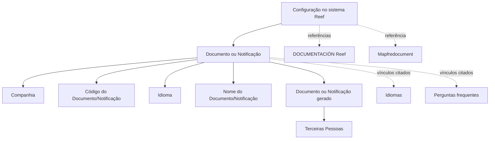

# Definição e Configuração de Documentos ou Notificações no Reef

## 1. Metadados do Documento
- **Arquivo de Origem:** `Não identificado no conteúdo fornecido`
- **Tipo de Documento:** `Procedimento / Documentação funcional`
- **Domínio / Sistema:** `Reef / Mapfredocument`
- **Público-Alvo:** `Configuração funcional, operação e equipes responsáveis por documentos ou notificações`
- **Data/Versão Identificada:** `Não identificada`
- **Lifecycle Identificado:** `Approved Source`

---

## 2. Resumo Executivo & Contexto de Negócio

O documento descreve a definição de Documentos ou Notificações no sistema Reef. O objetivo declarado é identificar e configurar todos os documentos ou possíveis notificações que podem ser gerados e enviados a terceiras pessoas.

A configuração abrange diferentes classificações de documentos ou notificações: contratuais, comerciais, informativas, Voz del Cliente e operativas. O conteúdo não detalha critérios específicos, modelos de envio, canais de comunicação, eventos disparadores ou contratos técnicos associados a essas classificações.

A definição de cada Documento ou Notificação é baseada em propriedades de companhia, código, idioma e nome. Essas propriedades determinam, respectivamente, o contexto organizacional da configuração, a chave identificadora no sistema, o idioma da definição e a denominação apresentada para o idioma utilizado.

O documento também aponta vínculos relacionados a idiomas e perguntas frequentes, além de referências à documentação Reef e ao contexto Mapfredocument. Não há detalhamento adicional sobre navegação, permissões, persistência de dados ou integrações externas.

---

## 3. Arquitetura, Componentes & Tecnologias Envolvidas

Os elementos explicitamente citados são:

| Componente / Elemento | Papel identificado |
| :--- | :--- |
| Reef | Sistema no qual ocorre a definição e configuração de Documentos ou Notificações. |
| Mapfredocument | Referência de documentação ou domínio apresentada no conteúdo. |
| Documentos ou Notificações | Entidades configuráveis que podem ser geradas e enviadas a terceiras pessoas. |
| Terceiras Pessoas | Destinatários dos documentos ou notificações gerados. |
| Companhia | Propriedade que informa o código da companhia para a qual a configuração é realizada. |
| Idiomas | Vínculo e propriedade usada na definição dos documentos ou notificações. |
| Perguntas frequentes | Vínculo citado na documentação. |
| Documentation / DOCUMENTACIÓN Reef | Referências de documentação apresentadas no conteúdo. |



**Nota de Análise:** O conteúdo não descreve microsserviços, APIs, métodos HTTP, bancos de dados, tecnologias de implementação, ambientes, URLs técnicas, autenticação ou contratos JSON.

---

## 4. Regras de Negócio, Especificações Funcionais & Processos

### Objetivo funcional

O sistema deve permitir identificar e configurar todos os Documentos ou possíveis Notificações que podem:

1. Ser gerados.
2. Ser enviados.
3. Ter como destinatárias terceiras pessoas.
4. Pertencer a classificações como:
   - Contractuais;
   - Comerciais;
   - Informativas;
   - Voz del Cliente;
   - Operativas;
   - Outras classificações representadas por reticências no conteúdo original.

### Propriedades da definição

1. **Companhia**
   - Indica ao sistema o código da companhia sobre a qual a configuração do Documento ou Notificação está sendo realizada.

2. **Código do Documento/Notificação**
   - Identifica a chave que identificará o Documento ou Notificação no sistema.

3. **Idioma**
   - Representa a chave do idioma utilizado na definição dos Documentos ou Notificações.
   - Os exemplos explicitamente apresentados são espanhol, inglês e turco.

4. **Nome do Documento/Notificação**
   - Contém a denominação ou descrição do documento ou notificação.
   - A denominação ou descrição deve estar de acordo com o idioma utilizado na definição.

### Vínculos citados

- Idiomas.
- Perguntas frequentes.
- Documentation / DOCUMENTACIÓN Reef.
- Mapfredocument.

**Nota de Análise:** O documento não especifica obrigatoriedade de campos, unicidade por companhia e idioma, regras de validação, formato dos códigos, processo de aprovação, workflow de publicação ou comportamento de envio das notificações.

---

## 5. Tabelas de Parâmetros, Ambientes e Estruturas de Dados

| Item / Parâmetro | Descrição / Função | Tipo / Valores / Formato | Ambiente / Observações |
| :--- | :--- | :--- | :--- |
| Companhia | Informa ao sistema o código da companhia sobre a qual a configuração é realizada. | Código de companhia; formato não detalhado. | Aplicável à configuração de Documento ou Notificação. |
| Código do Documento/Notificação | Identifica a chave do Documento ou Notificação no sistema. | Chave; formato não detalhado. | Não há regra de unicidade explicitada. |
| Idioma | Chave do idioma empregado na definição. | Exemplos: espanhol, inglês, turco. | Relacionado ao vínculo “Idiomas”. |
| Nome do Documento/Notificação | Denominação ou descrição do documento ou notificação conforme o idioma da definição. | Texto; formato não detalhado. | Dependente do idioma utilizado. |
| Classificação | Categoria possível para o Documento ou Notificação. | Contractuais, Comerciais, Informativas, Voz del Cliente, Operativas e outras não detalhadas. | Não são descritas regras específicas por classificação. |
| Destinatário | Pessoa que pode receber o Documento ou Notificação gerado. | Terceiras Pessoas. | Não há detalhamento sobre canal ou mecanismo de entrega. |
| Lifecycle | Estado apresentado nos metadados da página. | `Approved Source`. | Não há explicação funcional adicional. |
| Owner | Proprietário apresentado nos metadados da página. | `user:agonzalez_mapfre.com` | Identificador exibido no conteúdo original. |

---

## 6. Bateria de Perguntas & Respostas para RAG (FAQ Sintético)

### P1: Qual é o objetivo da definição de Documentos ou Notificações no Reef?
**R:** O objetivo é identificar e configurar todos os Documentos ou possíveis Notificações que podem ser gerados e enviados a terceiras pessoas, independentemente da classificação atribuída a esses documentos ou notificações.

### P2: Quais classificações de Documentos ou Notificações são citadas?
**R:** O documento cita classificações contratuais, comerciais, informativas, Voz del Cliente e operativas. O uso de reticências indica que podem existir outras classificações, mas elas não são detalhadas.

### P3: Qual é a função da propriedade Companhia?
**R:** A propriedade Companhia indica ao sistema o código da companhia sobre a qual está sendo realizada a configuração do Documento ou Notificação.

### P4: Para que serve o Código do Documento/Notificação?
**R:** O Código do Documento/Notificação identifica a chave que identificará o Documento ou Notificação no sistema.

### P5: Como o idioma é usado na definição de um Documento ou Notificação?
**R:** O idioma é a chave do idioma empregado na definição dos Documentos ou Notificações. O conteúdo apresenta como exemplos espanhol, inglês e turco.

### P6: O que representa o Nome do Documento/Notificação?
**R:** O Nome do Documento/Notificação contém a denominação ou descrição do documento ou notificação de acordo com o idioma utilizado em sua definição.

### P7: Quem pode receber os Documentos ou Notificações configurados?
**R:** Os Documentos ou Notificações podem ser gerados e enviados a terceiras pessoas. O conteúdo não define perfis, tipos de destinatário, canais de envio ou critérios de seleção.

### P8: Quais vínculos são mencionados para a documentação de Documentos ou Notificações?
**R:** O conteúdo menciona vínculos para Idiomas e Perguntas frequentes, além de referências a Documentation / DOCUMENTACIÓN Reef e Mapfredocument.

### P9: O documento informa APIs ou métodos HTTP para Documentos ou Notificações?
**R:** Não. O documento apresenta apenas o objetivo funcional e as propriedades Companhia, Código do Documento/Notificação, Idioma e Nome do Documento/Notificação. Não há APIs, métodos HTTP ou contratos JSON detalhados.

### P10: Há informações sobre ambientes, servidores ou URLs do sistema Reef?
**R:** Não. O conteúdo não informa ambientes, servidores, URLs, portas, credenciais, tecnologias de infraestrutura ou rotas de logs.

---

## 7. Glossário de Termos, Siglas & Conceitos-Chave

- **Reef:** Sistema ou contexto documental no qual são definidos e configurados Documentos ou Notificações.
- **Documento ou Notificação:** Entidade configurável que pode ser gerada e enviada a terceiras pessoas.
- **Companhia:** Propriedade que indica o código da companhia associada à configuração.
- **Código do Documento/Notificação:** Chave que identifica o Documento ou Notificação no sistema.
- **Idioma:** Chave do idioma utilizado na definição de Documentos ou Notificações.
- **Voz del Cliente:** Classificação de Documento ou Notificação citada no conteúdo, sem detalhamento adicional.
- **Mapfredocument:** Referência apresentada na documentação, sem definição adicional no texto.
- **Lifecycle:** Metadado apresentado com o valor `Approved Source`.
- **Approved Source:** Valor de Lifecycle exibido no conteúdo; o documento não explica seu significado operacional.

---

## 8. Notas Críticas, Riscos & Limitações

- O conteúdo não identifica o arquivo de origem, data, versão ou autor documental, exceto pelo campo `Owner` apresentado na página.
- Não são descritos fluxos de geração, aprovação, publicação, envio, reenvio, cancelamento ou rastreabilidade de Documentos ou Notificações.
- Não há especificação de APIs, integrações, microsserviços, tecnologias, banco de dados, segurança, autenticação ou autorização.
- Não há regras explícitas de validação para Companhia, Código do Documento/Notificação, Idioma ou Nome do Documento/Notificação.
- Não são definidos formatos, tamanhos, obrigatoriedade, valores permitidos ou regras de unicidade para as propriedades.
- O documento cita o sistema Reef e Mapfredocument, mas não detalha a relação técnica ou funcional entre esses elementos.
- A extração contém caracteres de substituição em palavras como `Noticaciones`, `Identicar`, `congurar` e `denición`; a interpretação semântica foi mantida sem inventar conteúdo ausente.

---

## 9. Conteúdo Bruto Estruturado (Referência Fiel)

```text
--- [PÁGINA 1 DE 1] ---

DEFINICIÓN de los Documentos o Noticaciones
Objetivo
Identicar y congurar todos aquellos Documentos o posibles Noticaciones que se pueden generar y enviar a Terceras Personas
cualesquiera que sea su clasicación: Contractuales, Comerciales, Informativas, Voz del Cliente, Operativas,...
Propiedades
Compañía.
Esta propiedad le indica al sistema el código de la compañía sobre la que se está realizando la conguración del Documento o Noticación.
Código del Documento/Noticación
Este atributo identica la clave que identicará al Documento o Noticación en el Sistema.
Idioma.
Esta propiedad es la clave del Idioma empleado en la denición de los Documentos o Noticaciones, como por ejemplo: español, inglés,
turco, ...
Nombre del Documento/Noticación
Esta propiedad contiene la denominación o descripción del documento o noticación de acuerdo con el idioma utilizado en su denición.
Vínculos
Idiomas
Preguntas frecuentes
Documentation / DOCUMENTACIÓN Reef
DOCUMENTACIÓN Reef
Mapfredocument
DOCUMENTACIÓN Reef
Owner
user:agonzalez_mapfre.com
Lifecycle
Approved Source
 / 
 VL
Buscar Inicio Soluciones Arquitecturas APIs Componentes Cloud Documentación Zeus Reef Ayuda
ES
```
