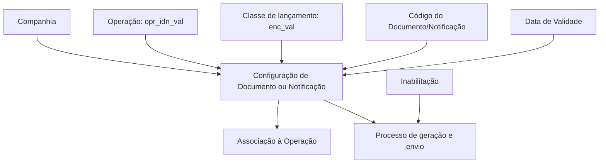

# Configuração de Atribuição de Documentos ou Notificações às Operações de Contabilidade no Reef

## 1. Metadados do Documento
- **Arquivo de Origem:** Não informado
- **Tipo de Documento:** Procedimento de configuração
- **Domínio / Sistema:** Reef / Mapfredocument / Contabilidade
- **Público-Alvo:** Configuradores funcionais, operação e equipes responsáveis pela documentação Reef
- **Data/Versão Identificada:** Não identificada
- **Estado identificado:** `EN CONSTRUCCIÓN`
- **Owner identificado:** `user:agonzalez_mapfre.com`
- **Lifecycle identificado:** `Approved Source / VL`

---

## 2. Resumo Executivo & Contexto de Negócio

O documento descreve a configuração para atribuir Documentos ou Notificações às Operações da CONTABILIDAD no sistema Reef. O objetivo explícito é associar documentos ou notificações a operações contábeis por meio de propriedades de configuração.

A configuração contempla a identificação da companhia, a identificação da operação, a classe de lançamento contábil e o código do Documento/Notificação. Esses atributos determinam o contexto no qual um Documento ou Notificação é associado a uma Operação.

A propriedade de data de validade permite estabelecer a partir de quando um Documento está associado a uma Operação. Segundo o texto, a configuração correta dessa data permite manter o histórico das alterações realizadas nas definições, rastrear mudanças e explorar posteriormente as informações históricas.

O documento também registra uma propriedade de inabilitação. Quando configurada, essa propriedade estabelece que o Documento/Notificação não pode ser utilizado no processo de geração e envio dos documentos ou notificações associados à Operação.

---

## 3. Arquitetura, Componentes & Tecnologias Envolvidas

Os elementos identificados no conteúdo são:

| Componente / Termo | Papel identificado no documento |
| :--- | :--- |
| Reef | Sistema ou domínio documental mencionado em referências de documentação. |
| Mapfredocument | Nome citado no conteúdo, sem detalhamento funcional adicional. |
| CONTABILIDAD | Domínio no qual Documentos ou Notificações são atribuídos às Operações. |
| Documento / Notificação | Entidade configurável e associada a uma Operação. |
| Operação | Entidade identificada por `opr_idn_val` e associada a Documento ou Notificação. |
| Companhia | Contexto organizacional da configuração. |
| Classe de lançamento | Atributo identificado por `enc_val`. |
| Processo de geração e envio | Processo que pode ser impedido pela propriedade de inabilitação. |

O conteúdo não descreve microsserviços, APIs, protocolos, bancos de dados, URLs de ambiente, tecnologias de infraestrutura ou contratos de integração. Também não apresenta um fluxo técnico detalhado que permita reconstruir um diagrama Mermaid fiel.

### Relação funcional identificada



> **Nota de Análise:** O diagrama representa exclusivamente relações funcionais inferidas das propriedades descritas. O documento não detalha componentes técnicos, métodos HTTP, contratos JSON, persistência de dados ou integração entre sistemas.

---

## 4. Regras de Negócio, Especificações Funcionais & Processos

### 4.1 Atribuição de Documento ou Notificação

A configuração tem como objeto a atribuição de Documentos ou Notificações às Operações da CONTABILIDAD. O Documento ou Notificação é definido por propriedades que delimitam sua aplicabilidade.

### 4.2 Companhia

A propriedade **Compañía** informa ao sistema o código da companhia sobre a qual está sendo realizada a configuração do Documento ou Notificação.

### 4.3 Identificação da Operação

O atributo `opr_idn_val` é identificado como o **id de operación**. O documento não detalha o formato, domínio de valores, obrigatoriedade ou mecanismo de validação de `opr_idn_val`.

### 4.4 Classe de Lançamento

O atributo `enc_val` é identificado como **clase de asiento**. O documento não detalha os valores permitidos, a estrutura ou a relação exata entre a classe de lançamento e a operação.

### 4.5 Código do Documento ou Notificação

O atributo **Código del Documento/Notificación** identifica a chave que identificará o Documento ou Notificação no Sistema.

### 4.6 Data de Validade

A propriedade **Fecha de Validez** estabelece a data a partir da qual o Documento está associado à Operação para utilização.

O uso correto da data de validade e da configuração permite:

1. Manter um histórico das mudanças efetuadas nas definições.
2. Rastrear as alterações realizadas.
3. Explorar posteriormente as informações históricas.

### 4.7 Resultado da Última Operação

O atributo `opr_fit` é apresentado como **último operación ok/ko**. O conteúdo não informa o significado detalhado de `ok/ko`, as condições que produzem esse resultado ou o processo operacional ao qual o atributo se aplica.

### 4.8 Inabilitação

A propriedade **Inhabilitación** estabelece que o Documento/Notificação está inabilitado para uso no processo de geração e envio dos documentos ou notificações associados à Operação.

> **Nota de Análise:** O documento não especifica se a inabilitação é temporária, reversível, automática, manual ou condicionada por data de validade.

---

## 5. Tabelas de Parâmetros, Ambientes e Estruturas de Dados

| Item / Parâmetro | Descrição / Função | Tipo / Valores / Formato | Ambiente / Observações |
| :--- | :--- | :--- | :--- |
| Compañía | Informa o código da companhia sobre a qual a configuração do Documento ou Notificação é realizada. | Código de companhia; formato não detalhado. | Aplicável à configuração de Documento ou Notificação. |
| `opr_idn_val` | Identificador da operação. | `id de operacion`; formato não detalhado. | Associado à Operação. |
| `enc_val` | Classe de lançamento. | `clase de asiento`; valores não detalhados. | O documento não especifica regras de validação. |
| Código del Documento/Notificación | Identifica a chave que identificará o Documento ou Notificação no Sistema. | Código ou chave; formato não detalhado. | Identificação do Documento ou Notificação. |
| Fecha de Validez | Define a partir de quando o Documento é associado à Operação para utilização. | Data; formato não detalhado. | Possibilita histórico, rastreabilidade e exploração posterior de alterações. |
| `opr_fit` | Resultado da última operação. | `último operacion ok/ko`. | Sem explicação adicional sobre `ok/ko`. |
| Inhabilitación | Indica que o Documento/Notificação está inabilitado para utilização. | Propriedade de inabilitação; valores não detalhados. | Afeta o processo de geração e envio dos documentos ou notificações associados à Operação. |
| Owner | Proprietário identificado na documentação. | `user:agonzalez_mapfre.com` | Referência documental. |
| Lifecycle | Estado de ciclo de vida identificado. | `Approved Source / VL` | Referência documental. |
| Estado do conteúdo | Indicação textual de construção. | `EN CONSTRUCCIÓN` | O conteúdo pode estar incompleto. |

---

## 6. Bateria de Perguntas & Respostas para RAG (FAQ Sintético)

### P1: Qual é o objetivo da configuração descrita na documentação Reef?
**R:** O objetivo é configurar a atribuição de Documentos ou Notificações às Operações da CONTABILIDAD. A configuração usa propriedades como companhia, identificador da operação, classe de lançamento, código do Documento/Notificação, data de validade e inabilitação.

### P2: Qual propriedade informa a companhia da configuração de Documento ou Notificação?
**R:** A propriedade **Compañía** informa ao sistema o código da companhia sobre a qual está sendo realizada a configuração do Documento ou Notificação.

### P3: O que representa o atributo `opr_idn_val`?
**R:** O atributo `opr_idn_val` é identificado no documento como o `id de operacion`. O conteúdo não informa o formato desse identificador nem suas regras de validação.

### P4: Qual é a finalidade do atributo `enc_val`?
**R:** O atributo `enc_val` é identificado como `clase de asiento`, isto é, a classe de lançamento. O documento não detalha os valores possíveis nem como a classe de lançamento interfere na associação entre Documento/Notificação e Operação.

### P5: Como o Documento ou Notificação é identificado no Sistema?
**R:** O atributo **Código del Documento/Notificación** identifica a chave que identificará o Documento ou Notificação no Sistema.

### P6: Para que serve a data de validade na associação de um Documento a uma Operação?
**R:** A propriedade **Fecha de Validez** estabelece a data a partir da qual o Documento está associado à Operação para utilização. O documento afirma que a configuração correta dessa data permite manter histórico de alterações, rastrear modificações nas definições e explorar posteriormente essas informações.

### P7: O que acontece quando um Documento/Notificação está inabilitado?
**R:** Quando a propriedade **Inhabilitación** estabelece que o Documento/Notificação está inabilitado, ele não pode ser utilizado no processo de geração e envio dos documentos ou notificações associados à Operação.

### P8: O que significa o campo `opr_fit`?
**R:** O campo `opr_fit` é apresentado como `último operacion ok/ko`. O documento não define o significado operacional de `ok/ko`, nem descreve a lógica de atualização desse campo.

### P9: A documentação informa APIs, métodos HTTP ou contratos JSON para a configuração?
**R:** Não. O conteúdo apresentado não descreve APIs, métodos HTTP, contratos JSON, endpoints, portas, protocolos, banco de dados ou detalhes de integração técnica.

### P10: O documento fornece detalhes sobre ambientes, URLs ou servidores?
**R:** Não. Não foram identificados ambientes técnicos, URLs, servidores, credenciais, rotas de log ou parâmetros de infraestrutura no conteúdo fornecido.

### P11: A documentação está em estado final ou em construção?
**R:** O conteúdo contém a indicação `EN CONSTRUCCIÓN`, o que sinaliza que o material está em construção. Além disso, diversos atributos são nomeados, mas não possuem detalhamento de formato, valores permitidos ou regras de validação.

### P12: Quem é o owner identificado no conteúdo?
**R:** O conteúdo identifica o owner como `user:agonzalez_mapfre.com`.

---

## 7. Glossário de Termos, Siglas & Conceitos-Chave

- **Reef:** Sistema ou domínio documental citado nas referências `Documentation / DOCUMENTACIÓN Reef` e `DOCUMENTACIÓN Reef`.
- **Mapfredocument:** Nome citado no conteúdo; não há definição funcional adicional.
- **CONTABILIDAD:** Área ou domínio contábil ao qual pertencem as Operações mencionadas.
- **Documento / Notificação:** Entidade configurada e associada a uma Operação.
- **Operação:** Entidade à qual um Documento ou Notificação pode ser associado.
- **Compañía:** Propriedade que identifica o código da companhia no contexto da configuração.
- **`opr_idn_val`:** Atributo identificado como `id de operacion`.
- **`enc_val`:** Atributo identificado como `clase de asiento`.
- **`opr_fit`:** Atributo identificado como `último operacion ok/ko`.
- **Fecha de Validez:** Propriedade que estabelece a data a partir da qual um Documento é associado à Operação para uso.
- **Inhabilitación:** Propriedade que torna o Documento/Notificação indisponível para o processo de geração e envio associado à Operação.
- **Owner:** Referência ao proprietário da documentação, identificado como `user:agonzalez_mapfre.com`.
- **Lifecycle:** Estado de ciclo de vida documental identificado como `Approved Source / VL`.
- **OK/KO:** Valores apresentados para a última operação; o significado não é detalhado no conteúdo.

---

## 8. Notas Críticas, Riscos & Limitações

- O conteúdo possui o estado `EN CONSTRUCCIÓN`, indicando possível incompletude documental.
- Não há detalhamento sobre obrigatoriedade, tipos de dados, formatos, valores aceitos ou validações para `opr_idn_val`, `enc_val`, código do Documento/Notificação, data de validade, `opr_fit` e inabilitação.
- O documento não explica a semântica operacional de `ok/ko` no atributo `opr_fit`.
- Não há descrição de interfaces, APIs, métodos HTTP, contratos JSON, mensageria, integração entre sistemas ou persistência de dados.
- Não foram identificados ambientes, URLs, servidores, portas, credenciais, rotas de logs ou procedimentos de monitoramento.
- O documento afirma que a data de validade suporta histórico e rastreabilidade, mas não especifica regras para sobreposição de períodos, alteração retroativa ou conflito entre configurações.
- A inabilitação é definida como impeditiva para geração e envio, mas não são descritos os critérios para habilitar ou desabilitar um Documento/Notificação.

---

## 9. Conteúdo Bruto Estruturado (Referência Fiel)

```text
--- [PÁGINA 1 DE 2] ---

EN CONSTRUCCIÓN
Asignación de los Documentos o Noticaciones a las Operaciones de
la CONTABILIDAD
Objetivo
-Propiedades
Propiedades
Compañía.
Esta propiedad le indica al sistema el código de la compañía sobre la que se está realizando la conguración del Documento o Noticación.
opr_idn_val
id de operacion
enc_val
clase de asiento
Código del Documento/Noticación
Este atributo identica la clave que identicará al Documento o Noticación en el Sistema.
Fecha de Validez
Esta propiedad establece la fecha a partir de la cual el Documento está asociado a la Operación para ser utilizado, por lo que un correcto uso
y conguración habilita tener un histórico de los cambios efectuados en las deniciones y poder así trazar y explotar posteriormente esta
información.
opr_t
ltro operacion ok/ko
Inhabilitación
Esta propiedad establece que el Documento/Noticación está inhabilitado para ser utilizado en el proceso de generación y envío de los
documentos o noticaciones asociados la Operación.
Documentation / DOCUMENTACIÓN Reef
DOCUMENTACIÓN Reef
Mapfredocument
DOCUMENTACIÓN Reef
Owner
user:agonzalez_mapfre.com
Lifecycle
Approved Source
 /
 VL
Buscar Inicio Soluciones Arquitecturas APIs Componentes Cloud Documentación Zeus Reef Ayuda
ES

--- [PÁGINA 2 DE 2] ---

Vínculos
Preguntas frecuentes
```
