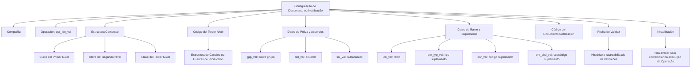

# Configuração de Documentos ou Notificações para Operações do Processo de EMISIÓN

## 1. Metadados do Documento
- **Arquivo de Origem:** Não identificado no conteúdo fornecido
- **Tipo de Documento:** Especificação Técnica / Documentação de Configuração
- **Domínio / Sistema:** Reef / Mapfredocument
- **Público-Alvo:** Responsáveis pela configuração de documentos ou notificações associados a operações
- **Data/Versão Identificada:** Não identificada

---

## 2. Resumo Executivo & Contexto de Negócio

O documento descreve a configuração para atribuição de **Documentos ou Notificações** às operações do processo de **EMISIÓN**. O foco apresentado é a definição de propriedades que determinam em qual contexto uma associação entre documento/notificação e operação deve ser utilizada.

A configuração é segmentada por companhia, operação e níveis da estrutura comercial. O documento também relaciona atributos de grupo de apólice, acordo, subacordo, ramo e dados de suplemento, permitindo restringir a associação a condições específicas do domínio de seguros.

A propriedade **Fecha de Validez** estabelece a data a partir da qual o Documento ou Notificação fica associado à Operação. O texto destaca que a configuração correta da vigência habilita histórico das alterações realizadas nas definições, além de permitir rastrear e explorar posteriormente essas informações.

A propriedade **Inhabilitación** determina que um Documento ou Notificação está desativado. Quando inabilitado, o Documento ou Notificação não deve ser avaliado nem considerado durante a execução da Operação.

> **Nota de Análise:** o conteúdo fornecido lista propriedades e finalidades, mas não detalha telas, APIs, métodos HTTP, contratos JSON, persistência, valores permitidos ou regras de precedência entre configurações.

---

## 3. Arquitetura, Componentes & Tecnologias Envolvidas

Os componentes e contextos explicitamente citados são:

- **Reef:** contexto de documentação identificado como “DOCUMENTACIÓN Reef”.
- **Mapfredocument:** nome exibido no conteúdo de documentação.
- **Proceso de EMISIÓN:** processo ao qual Documentos ou Notificações são atribuídos.
- **Operación:** entidade identificada pelo atributo `opr_idn_val`.
- **Documento/Notificación:** entidade configurada e associada a uma Operação.
- **Estructura Comercial:** estrutura formada por Primeiro, Segundo e Terceiro Níveis.
- **Estructura de canales o Fuentes de Producción:** contexto associado ao atributo “Código del Tercer Nivel”.
- **Suplemento:** contexto representado por tipo, código e subcódigo.
- **Lifecycle:** identificado como `Approved`.
- **Owner:** `user:agonzalez_mapfre.com`.



---

## 4. Regras de Negócio, Especificações Funcionais & Processos

1. A configuração é realizada para uma **Compañía**. A propriedade de companhia informa o código da companhia sobre a qual está sendo realizada a configuração do Documento ou Notificação.

2. A configuração deve identificar a **Operación** por meio do atributo `opr_idn_val`, descrito como “id de operacion”.

3. A associação pode ser contextualizada pela **Estructura Comercial**:
   - **Clave del Primer Nivel:** contém o código que identifica o Primeiro Nível da Estrutura Comercial no Sistema.
   - **Clave del Segundo Nivel:** contém o código que identifica o Segundo Nível da Estrutura Comercial no Sistema.
   - **Clave del Tercer Nivel:** contém o código que identifica o Terceiro Nível da Estrutura Comercial no Sistema.
   - **Código del Tercer Nivel:** identifica a chave do Terceiro Nível da estrutura de canais ou Fontes de Produção no Sistema.

4. A associação pode incluir critérios relativos a:
   - apólice de grupo;
   - acordo;
   - subacordo;
   - ramo;
   - tipo de suplemento;
   - código de suplemento;
   - subcódigo de suplemento.

5. O **Código del Documento/Notificación** identifica a chave que identificará o Documento ou Notificação da Operação.

6. A **Fecha de Validez** estabelece a data a partir da qual o Documento está associado à Operação e disponível para utilização.

7. O uso e a configuração corretos da **Fecha de Validez** habilitam:
   - histórico de alterações efetuadas nas definições;
   - rastreabilidade das informações;
   - exploração posterior das informações configuradas.

8. A **Inhabilitación** estabelece que o Documento ou Notificação está desativado.

9. Quando houver **Inhabilitación**, o Documento ou Notificação:
   - não deve ser avaliado;
   - não deve ser contemplado na execução da Operação.

> **Nota de Análise:** o documento não esclarece se todos os atributos de segmentação são obrigatórios, opcionais ou mutuamente exclusivos. Também não define como o sistema se comporta quando mais de uma configuração aplicável é encontrada.

---

## 5. Tabelas de Parâmetros, Ambientes e Estruturas de Dados

| Item / Parâmetro | Descrição / Função | Tipo / Valores / Formato | Ambiente / Observações |
| :--- | :--- | :--- | :--- |
| Compañía | Informa o código da companhia para a qual é realizada a configuração do Documento ou Notificação. | Código de companhia; formato não detalhado. | Processo de configuração de Documento ou Notificação. |
| `opr_idn_val` | Identificador da Operação. | “id de operacion”. | Associado ao processo de EMISIÓN. |
| Clave del Primer Nivel | Contém o código que identifica o Primeiro Nível da Estrutura Comercial no Sistema. | Código; formato não detalhado. | Estrutura Comercial. |
| Clave del Segundo Nivel | Contém o código que identifica o Segundo Nível da Estrutura Comercial no Sistema. | Código; formato não detalhado. | Estrutura Comercial. |
| Clave del Tercer Nivel | Contém o código que identifica o Terceiro Nível da Estrutura Comercial no Sistema. | Código; formato não detalhado. | Estrutura Comercial. |
| Código del Tercer Nivel | Identifica a chave do Terceiro Nível da estrutura de canais ou Fuentes de Producción. | Código; formato não detalhado. | Estrutura de canais ou Fontes de Produção. |
| `gpp_val` | Referência a “poliza grupo”. | Valor não detalhado. | Configuração da associação. |
| `del_val` | Referência a “acuerdo”. | Valor não detalhado. | Configuração da associação. |
| `sbl_val` | Referência a “subacuerdo”. | Valor não detalhado. | Configuração da associação. |
| `lob_val` | Referência a “ramo”. | Valor não detalhado. | Configuração da associação. |
| `enr_typ_val` | Referência a “tipo suplemento”. | Valor não detalhado. | Configuração da associação. |
| `enr_val` | Referência a “codigo suplemento”. | Valor não detalhado. | Configuração da associação. |
| `enr_sbd_val` | Referência a “subcodigo suplemento”. | Valor não detalhado. | Configuração da associação. |
| Código del Documento/Notificación | Identifica a chave que identificará o Documento ou Notificação da Operação. | Código; formato não detalhado. | Associação com Operação. |
| Fecha de Validez | Define a data a partir da qual o Documento está associado à Operação para utilização. | Data; formato não detalhado. | Suporta histórico, rastreabilidade e exploração posterior. |
| `opr_fit` | Exibido como “filtro operacion ok/ko”. | Não detalhado. | Significado funcional e valores permitidos não são explicados. |
| Inhabilitación | Indica que o Documento ou Notificação está desativado. | Estado de desativação; valores não detalhados. | Impede avaliação e contemplação durante a execução da Operação. |
| Owner | Proprietário identificado na documentação. | `user:agonzalez_mapfre.com` | DOCUMENTACIÓN Reef. |
| Lifecycle | Estado de ciclo de vida exibido. | `Approved` | DOCUMENTACIÓN Reef. |

---

## 6. Bateria de Perguntas & Respostas para RAG (FAQ Sintético)

### P1: Qual é o objetivo da configuração descrita na documentação Reef?
**R:** O objetivo é atribuir Documentos ou Notificações às Operações do processo de EMISIÓN. A configuração reúne propriedades que delimitam o contexto em que um Documento ou Notificação deve ficar associado a uma Operação.

### P2: Qual propriedade identifica a operação configurada?
**R:** A operação é identificada pelo atributo `opr_idn_val`, descrito no documento como “id de operacion”.

### P3: Como a companhia participa da configuração de um Documento ou Notificação?
**R:** A propriedade **Compañía** informa o código da companhia sobre a qual está sendo realizada a configuração do Documento ou Notificação.

### P4: Quais níveis da Estrutura Comercial são contemplados?
**R:** O documento menciona a **Clave del Primer Nivel**, a **Clave del Segundo Nivel** e a **Clave del Tercer Nivel**. Cada atributo contém o código que identifica o respectivo nível da Estrutura Comercial no Sistema.

### P5: Qual é a finalidade do Código del Tercer Nivel?
**R:** O Código del Tercer Nivel identifica a chave do Terceiro Nível da estrutura de canais ou Fuentes de Producción no Sistema.

### P6: Quais atributos de apólice, acordo e suplemento são listados?
**R:** O texto lista `gpp_val` para “poliza grupo”, `del_val` para “acuerdo”, `sbl_val` para “subacuerdo”, `lob_val` para “ramo”, `enr_typ_val` para “tipo suplemento”, `enr_val` para “codigo suplemento” e `enr_sbd_val` para “subcodigo suplemento”.

### P7: O que identifica o Código del Documento/Notificación?
**R:** O Código del Documento/Notificación identifica a chave que identificará o Documento ou Notificação da Operação.

### P8: O que é definido pela Fecha de Validez?
**R:** A Fecha de Validez estabelece a data a partir da qual o Documento está associado à Operação para ser utilizado.

### P9: Por que a Fecha de Validez é importante?
**R:** Segundo o documento, a utilização e configuração corretas da Fecha de Validez permitem manter histórico das alterações efetuadas nas definições, rastrear as informações e explorá-las posteriormente.

### P10: O que ocorre quando um Documento ou Notificação está inabilitado?
**R:** A Inhabilitación estabelece que o Documento ou Notificação está desativado. Nessa condição, ele não deve ser avaliado nem contemplado durante a execução da Operação.

### P11: O documento especifica valores, formatos ou obrigatoriedade dos atributos?
**R:** Não. O conteúdo identifica os atributos e descreve algumas finalidades, mas não apresenta formatos técnicos, domínios de valores, regras de obrigatoriedade, APIs ou contratos de integração.

### P12: Qual é o estado de ciclo de vida informado para a documentação?
**R:** O estado de Lifecycle exibido no conteúdo é `Approved`.

---

## 7. Glossário de Termos, Siglas & Conceitos-Chave

- **Reef:** nome presente na identificação “DOCUMENTACIÓN Reef”; o documento não expande ou define a sigla/nome.
- **Mapfredocument:** nome exibido no cabeçalho da documentação; não possui definição adicional no conteúdo.
- **EMISIÓN:** processo no qual são atribuídos Documentos ou Notificações; não há expansão adicional no texto.
- **Operación:** entidade à qual um Documento ou Notificação pode ser associado.
- **Documento/Notificación:** entidade configurada para associação a uma Operação.
- **Estructura Comercial:** estrutura composta por Primeiro, Segundo e Terceiro Níveis.
- **Fuentes de Producción:** contexto citado junto à estrutura de canais e ao Código del Tercer Nivel.
- **Ramo:** atributo identificado por `lob_val`; o documento não define seu significado adicional.
- **Suplemento:** contexto representado por tipo, código e subcódigo.
- **Inhabilitación:** condição de desativação que impede avaliação e contemplação do Documento ou Notificação na execução da Operação.
- **Fecha de Validez:** data a partir da qual o Documento está associado à Operação para utilização.
- **Lifecycle:** estado do ciclo de vida da documentação, apresentado como `Approved`.

---

## 8. Notas Críticas, Riscos & Limitações

- O conteúdo não informa o nome do arquivo original, data, versão, autor técnico, histórico de revisões ou sistema de origem detalhado.
- O documento não apresenta contratos de APIs, métodos HTTP, payloads JSON, endpoints, mecanismos de autenticação, tecnologias de implementação ou infraestrutura.
- Não são definidos formatos, tipos, valores permitidos ou obrigatoriedade para `opr_idn_val`, `gpp_val`, `del_val`, `sbl_val`, `lob_val`, `enr_typ_val`, `enr_val` e `enr_sbd_val`.
- Não há regra explícita de precedência entre configurações que possam corresponder à mesma Operação.
- O atributo exibido como `opr_fit` contém a descrição “filtro operacion ok/ko”, mas o documento não detalha sua semântica, valores aceitos ou efeito na execução.
- A documentação menciona histórico e rastreabilidade por meio da Fecha de Validez, mas não informa retenção, auditoria, consulta ou procedimento de manutenção desse histórico.
- **Risco operacional:** uma configuração incorreta da Fecha de Validez pode comprometer o histórico e a rastreabilidade mencionados no próprio documento.
- **Risco funcional:** uma Inhabilitación ativa faz com que o Documento ou Notificação não seja avaliado nem contemplado durante a execução da Operação.

---

## 9. Conteúdo Bruto Estruturado (Referência Fiel)

```text
--- [PÁGINA 1 DE 2] ---

EN CONSTRUCCIÓN
Asignación de los Documentos o Noticaciones a las Operaciones del
Proceso de EMISIÓN
Objetivo
-Propiedades
Propiedades
Compañía.
Esta propiedad le indica al sistema el código de la compañía sobre la que se está realizando la conguración del Documento o Noticación.
opr_idn_val
id de operacion
Clave del Primer Nivel
Este atributo contiene el código por el que se identica el Primer Nivel de la Estructura Comercial en el Sistema.
Clave del Segundo Nivel
Este atributo contiene el código por el que se identica el Segundo Nivel de la Estructura Comercial en el Sistema.
Clave del Tercer Nivel
Este atributo contiene el código por el que se identica el Tercer Nivel de la Estructura Comercial en el Sistema.
Código del Tercer Nivel
Este atributo identicará la clave del Tercer Nivel de la estructura de canales o Fuentes de Producción en el Sistema.
gpp_val
poliza grupo
del_val
acuerdo
Documentation / DOCUMENTACIÓN Reef
DOCUMENTACIÓN Reef
Mapfredocument
DOCUMENTACIÓN Reef
Owner
user:agonzalez_mapfre.com
Lifecycle
Approved Source
 /
VL
Buscar Inicio Soluciones Arquitecturas APIs Componentes Cloud Documentación Zeus Reef Ayuda
ES


--- [PÁGINA 2 DE 2] ---

sbl_val
subacuerdo
lob_val
ramo
enr_typ_val
tipo suplemento
enr_val
codigo suplemento
enr_sbd_val
subcodigo suplemento
Código del Documento/Noticación
Este atributo identica la clave que identicará al Documento o Noticación de la Operación.
Fecha de Validez
Esta propiedad establece la fecha a partir de la cual el Documento está asociado a la Operación para ser utilizado, por lo que un correcto uso
y conguración habilita tener un histórico de los cambios efectuados en las deniciones y poder así trazar y explotar posteriormente esta
información.
opr_t
ltro operacion ok/ko
Inhabilitación
Esta propiedad establece que el Documento o Noticación está desactivado y por tanto ni va a ser evaluado ni va a ser contemplado en la
ejecución de la Operación.
Vínculos
Preguntas frecuentes
```
