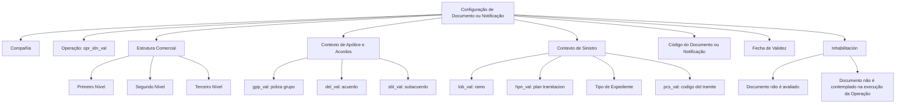

# Configuração da Atribuição de Documentos ou Notificações às Operações do Processo de Sinistros

## 1. Metadados do Documento
- **Arquivo de Origem:** Não identificado no conteúdo extraído
- **Tipo de Documento:** Especificação Técnica
- **Domínio / Sistema:** Processo de **SINIESTROS**; documentação **Reef / Mapfredocument**
- **Público-Alvo:** Configuradores funcionais, analistas de negócio, operação e equipes técnicas
- **Data/Versão Identificada:** Não identificada
- **Lifecycle identificado:** Approved
- **Owner identificado:** `user:agonzalez_mapfre.com`

---

## 2. Resumo Executivo & Contexto de Negócio

O documento descreve uma configuração em construção para atribuir **Documentos ou Notificações** às **Operações** do processo de **SINIESTROS**. O conteúdo relaciona propriedades que determinam o contexto organizacional, comercial, contratual e operacional no qual um Documento ou Notificação é associado a uma Operação.

A configuração considera, entre outros atributos, companhia, identificador de operação, níveis da estrutura comercial, grupo de apólice, acordo, subacordo, ramo, plano de tramitação, tipo de expediente e código de trâmite. Esses atributos permitem identificar o cenário aplicável à associação do Documento ou Notificação.

O atributo **Fecha de Validez** possibilita estabelecer a partir de quando um Documento está associado a uma Operação. Segundo o documento, a configuração adequada dessa data permite manter histórico das alterações realizadas nas definições, além de viabilizar rastreabilidade e exploração posterior das informações.

A propriedade **Inhabilitación** desativa um Documento ou Notificação. Quando essa propriedade está configurada, o Documento ou Notificação não é avaliado e não é considerado durante a execução da Operação.

> **Nota de Análise:** O documento não descreve métodos HTTP, contratos JSON, persistência, integrações, interfaces de configuração, responsáveis pela operação nem regras de precedência entre propriedades.

---

## 3. Arquitetura, Componentes & Tecnologias Envolvidas

Os elementos explicitamente identificados no conteúdo são:

| Componente / Termo | Papel identificado no documento |
| :--- | :--- |
| Processo de SINIESTROS | Processo no qual ocorre a atribuição de Documentos ou Notificações às Operações. |
| Operação | Entidade associada a um Documento ou Notificação; identificada, entre outros dados, por `opr_idn_val`. |
| Documento / Notificação | Elemento configurável e associável a uma Operação. |
| Compañía | Propriedade que informa o código da companhia na qual a configuração está sendo realizada. |
| Estrutura Comercial | Estrutura composta por Primeiro, Segundo e Terceiro Níveis. |
| Estrutura de canais ou Fuentes de Producción | Estrutura mencionada na descrição do Código do Terceiro Nível. |
| Reef | Nome presente na documentação e na navegação da plataforma documental. |
| Mapfredocument | Nome presente no cabeçalho do conteúdo extraído. |
| Zeus | Nome presente apenas no menu de navegação; não há detalhamento funcional. |



> **Nota de Análise:** O diagrama representa exclusivamente relações inferidas da organização das propriedades descritas no texto. O documento não apresenta uma arquitetura de software, integrações técnicas ou fluxo de execução detalhado.

---

## 4. Regras de Negócio, Especificações Funcionais & Processos

1. A configuração é realizada para associar um **Documento ou Notificação** a uma **Operação** do processo de SINIESTROS.
2. A propriedade **Compañía** informa o código da companhia sobre a qual a configuração do Documento ou Notificação está sendo realizada.
3. O atributo `opr_idn_val` corresponde ao **id de operación**.
4. A **Clave del Primer Nivel** contém o código de identificação do Primeiro Nível da Estrutura Comercial no sistema.
5. A **Clave del Segundo Nivel** contém o código de identificação do Segundo Nível da Estrutura Comercial no sistema.
6. A **Clave del Tercer Nivel** contém o código de identificação do Terceiro Nível da Estrutura Comercial no sistema.
7. O **Código del Tercer Nivel** identifica a chave do Terceiro Nível da estrutura de canais ou Fuentes de Producción no sistema.
8. O documento relaciona `gpp_val` à **poliza grupo**, `del_val` ao **acuerdo**, `sbl_val` ao **subacuerdo**, `lob_val` ao **ramo**, `hpn_val` ao **plan tramitacion** e `pcs_val` ao **codigo del tramite**.
9. O **Tipo de Expediente** contém a chave usada para identificar os diferentes danos causados no sinistro.
10. O **Código del Documento/Notificación** identifica a chave que identificará o Documento ou Notificação no sistema.
11. A **Fecha de Validez** estabelece a data a partir da qual o Documento é associado à Operação para utilização.
12. O uso e a configuração corretos da **Fecha de Validez** habilitam histórico das alterações efetuadas nas definições, rastreabilidade das informações e exploração posterior dessas informações.
13. A propriedade **Inhabilitación** estabelece que o Documento ou Notificação está desativado.
14. Quando um Documento ou Notificação está inabilitado, o elemento não é avaliado e não é contemplado na execução da Operação.
15. O texto apresenta `opr_fit` como “filtro operacion ok/ko”, mas não detalha regra, valores aceitos, comportamento ou impacto operacional desse filtro.

---

## 5. Tabelas de Parâmetros, Ambientes e Estruturas de Dados

| Item / Parâmetro | Descrição / Função | Tipo / Valores / Formato | Ambiente / Observações |
| :--- | :--- | :--- | :--- |
| Compañía | Indica o código da companhia sobre a qual é realizada a configuração do Documento ou Notificação. | Código da companhia; formato não detalhado. | Processo de SINIESTROS. |
| `opr_idn_val` | Identificador da operação. | “id de operacion”. | Não há formato ou domínio de valores descrito. |
| Clave del Primer Nivel | Código que identifica o Primeiro Nível da Estrutura Comercial. | Código; formato não detalhado. | Estrutura Comercial no sistema. |
| Clave del Segundo Nivel | Código que identifica o Segundo Nível da Estrutura Comercial. | Código; formato não detalhado. | Estrutura Comercial no sistema. |
| Clave del Tercer Nivel | Código que identifica o Terceiro Nível da Estrutura Comercial. | Código; formato não detalhado. | Estrutura Comercial no sistema. |
| Código del Tercer Nivel | Identifica a chave do Terceiro Nível da estrutura de canais ou Fuentes de Producción. | Código; formato não detalhado. | Estrutura de canais ou Fuentes de Producción. |
| `gpp_val` | Poliza grupo. | Não detalhado. | Sem observações adicionais. |
| `del_val` | Acuerdo. | Não detalhado. | Sem observações adicionais. |
| `sbl_val` | Subacuerdo. | Não detalhado. | Sem observações adicionais. |
| `lob_val` | Ramo. | Não detalhado. | Sem observações adicionais. |
| `hpn_val` | Plan tramitacion. | Não detalhado. | Sem observações adicionais. |
| Tipo de Expediente | Chave que identifica os diferentes danos provocados no sinistro. | Chave; formato não detalhado. | Processo de SINIESTROS. |
| `pcs_val` | Código do trâmite. | Não detalhado. | Sem observações adicionais. |
| Código del Documento/Notificación | Chave que identifica o Documento ou Notificação no sistema. | Código; formato não detalhado. | Associação com uma Operação. |
| Fecha de Validez | Data a partir da qual o Documento fica associado à Operação para utilização. | Data; formato não detalhado. | Suporta histórico, rastreabilidade e exploração de alterações. |
| `opr_fit` | Filtro de operação “ok/ko”. | “ok/ko”; sem semântica adicional descrita. | O comportamento do filtro não é detalhado. |
| Inhabilitación | Desativa o Documento ou Notificação. | Estado de desativação; formato não detalhado. | O elemento não é avaliado nem contemplado na execução da Operação. |

---

## 6. Bateria de Perguntas & Respostas para RAG (FAQ Sintético)

### P1: Qual é o objetivo da configuração descrita no documento?
**R:** O objetivo é atribuir Documentos ou Notificações às Operações do processo de SINIESTROS, utilizando propriedades que representam companhia, operação, estrutura comercial, dados de apólice, acordos, ramo, plano de tramitação, tipo de expediente e código de trâmite.

### P2: Para que serve a propriedade Compañía?
**R:** A propriedade Compañía informa ao sistema o código da companhia sobre a qual está sendo realizada a configuração do Documento ou Notificação.

### P3: O que identifica o parâmetro `opr_idn_val`?
**R:** O parâmetro `opr_idn_val` é apresentado como o identificador da operação, descrito no conteúdo como “id de operacion”.

### P4: Como o documento utiliza os níveis da Estrutura Comercial?
**R:** O documento define Clave del Primer Nivel, Clave del Segundo Nivel e Clave del Tercer Nivel como os códigos que identificam, respectivamente, os três níveis da Estrutura Comercial no sistema.

### P5: Qual é a finalidade do Código del Tercer Nivel?
**R:** O Código del Tercer Nivel identifica a chave do Terceiro Nível da estrutura de canais ou Fuentes de Producción no sistema.

### P6: Para que serve a Fecha de Validez na associação de Documento à Operação?
**R:** A Fecha de Validez estabelece a data a partir da qual o Documento está associado à Operação para uso. A configuração correta dessa propriedade permite preservar histórico das mudanças nas definições, rastrear essas mudanças e explorar posteriormente as informações.

### P7: O que ocorre quando um Documento ou Notificação está com Inhabilitación configurada?
**R:** O Documento ou Notificação fica desativado. Nessa condição, o elemento não será avaliado e não será considerado durante a execução da Operação.

### P8: Como o Tipo de Expediente é definido no processo de SINIESTROS?
**R:** O Tipo de Expediente contém a chave pela qual são identificados os diferentes danos provocados no sinistro.

### P9: O que representa o Código del Documento/Notificación?
**R:** O Código del Documento/Notificación identifica a chave que identificará o Documento ou Notificação no sistema.

### P10: Quais parâmetros de apólice, acordo e ramo são mencionados?
**R:** O conteúdo menciona `gpp_val` como poliza grupo, `del_val` como acuerdo, `sbl_val` como subacuerdo e `lob_val` como ramo. Não há detalhamento sobre formatos, valores permitidos ou regras de combinação entre esses parâmetros.

### P11: O que significa `opr_fit`?
**R:** O documento apresenta `opr_fit` como “filtro operacion ok/ko”. Não há explicação adicional sobre o significado de “ok/ko”, condições de aplicação, valores válidos além dessa indicação ou efeito na execução da Operação.

### P12: O documento define APIs ou contratos de integração para Documentos e Notificações?
**R:** Não. O conteúdo extraído não especifica APIs, métodos HTTP, payloads, contratos JSON, bancos de dados, URLs de ambientes ou integrações técnicas.

---

## 7. Glossário de Termos, Siglas & Conceitos-Chave

- **SINIESTROS:** Processo citado como o contexto para atribuição de Documentos ou Notificações às Operações.
- **Documento / Notificación:** Elemento configurável associado a uma Operação.
- **Operación:** Entidade à qual um Documento ou Notificação pode ser associado.
- **Compañía:** Propriedade que identifica o código da companhia na configuração.
- **Estructura Comercial:** Estrutura formada por Primeiro, Segundo e Terceiro Níveis.
- **Fuentes de Producción:** Termo citado como parte da estrutura de canais relacionada ao Código del Tercer Nivel.
- **Tipo de Expediente:** Chave usada para identificar diferentes danos provocados em um sinistro.
- **Fecha de Validez:** Data a partir da qual a associação entre Documento e Operação passa a ser utilizada.
- **Inhabilitación:** Propriedade que desativa um Documento ou Notificação.
- **`opr_idn_val`:** Identificador de operação.
- **`gpp_val`:** Poliza grupo.
- **`del_val`:** Acuerdo.
- **`sbl_val`:** Subacuerdo.
- **`lob_val`:** Ramo.
- **`hpn_val`:** Plan tramitacion.
- **`pcs_val`:** Codigo del tramite.
- **`opr_fit`:** Filtro de operação indicado como “ok/ko”.
- **Reef:** Nome identificado na documentação e na navegação exibida.
- **Mapfredocument:** Nome identificado no cabeçalho do conteúdo extraído.

---

## 8. Notas Críticas, Riscos & Limitações

- O conteúdo está marcado como **“EN CONSTRUCCIÓN”**, indicando que a documentação pode estar incompleta.
- Não foi identificado nome de arquivo, data, versão, autor técnico, ambiente, URL, servidor ou dependência de infraestrutura.
- O documento não define obrigatoriedade, cardinalidade, tipo técnico, formato, valores permitidos ou validações para as propriedades listadas.
- Não há regra explícita de precedência ou combinação entre companhia, operação, níveis comerciais, apólice, acordo, subacordo, ramo, plano de tramitação, tipo de expediente e código de trâmite.
- O campo `opr_fit` é citado apenas como “filtro operacion ok/ko”; não há detalhamento funcional suficiente para implementar ou operar esse filtro.
- Não há descrição de APIs, telas, fluxos de aprovação, auditoria, autenticação, autorização, persistência ou tratamento de erros.
- A ausência de detalhes sobre ativação, desativação e vigência simultânea pode gerar interpretações divergentes na operação da configuração.

---

## 9. Conteúdo Bruto Estruturado (Referência Fiel)

```text
--- [PÁGINA 1 DE 2] ---

EN CONSTRUCCIÓN
Asignación de los Documentos o Noticaciones a las Operaciones del
Proceso de SINIESTROS
Objetivo
-Propiedades
Propiedades
Compañía.
Esta propiedad le indica al sistema el código de la compañía sobre la que se está realizando la conguración del Documento o Noticación.
opr_idn_val
id de operacion
Clave del Primer Nivel
Este atributo contiene el código por el que se identica el Primer Nivel de la Estructura Comercial en el Sistema.
Clave del Segundo Nivel
Este atributo contiene el código por el que se identica el Segundo Nivel de la Estructura Comercial en el Sistema.
Clave del Tercer Nivel
Este atributo contiene el código por el que se identica el Tercer Nivel de la Estructura Comercial en el Sistema.
Código del Tercer Nivel
Este atributo identicará la clave del Tercer Nivel de la estructura de canales o Fuentes de Producción en el Sistema.
gpp_val
poliza grupo
del_val
acuerdo
Documentation / DOCUMENTACIÓN Reef
DOCUMENTACIÓN Reef
Mapfredocument
DOCUMENTACIÓN Reef
Owner
user:agonzalez_mapfre.com
Lifecycle
Approved Source
 /
 VL
Buscar Inicio Soluciones Arquitecturas APIs Componentes Cloud Documentación Zeus Reef Ayuda
ES


--- [PÁGINA 2 DE 2] ---

sbl_val
subacuerdo
lob_val
ramo
hpn_val
plan tramitacion
Tipo de Expediente
Este atributo contiene la clave por la que se va a identicar los distintos daños provocados en el siniestro.
pcs_val
codigo del tramite
Código del Documento/Noticación
Este atributo identica la clave que identicará al Documento o Noticación en el Sistema.
Fecha de Validez
Esta propiedad establece la fecha a partir de la cual el Documento está asociado a la Operación para ser utilizado, por lo que un correcto uso
y conguración habilita tener un histórico de los cambios efectuados en las deniciones y poder así trazar y explotar posteriormente esta
información.
opr_t
ltro operacion ok/ko
Inhabilitación
Esta propiedad establece que el Documento o Noticación está desactivado y por tanto ni va a ser evaluado ni va a ser contemplado en la
ejecución de la Operación.
Vínculos
Preguntas frecuentes
```
