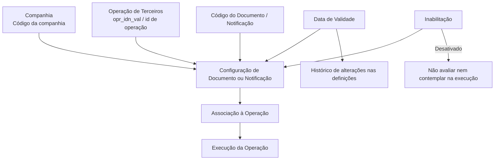
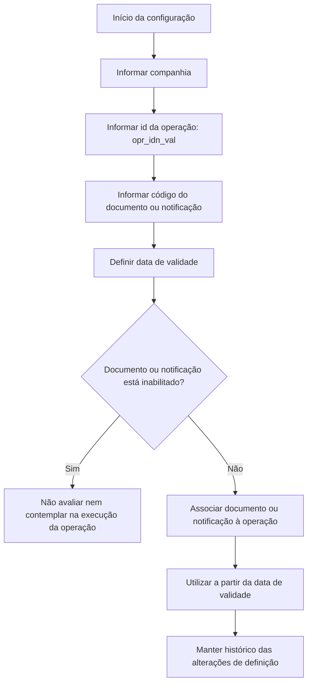

# Documentação Reef — Atribuição de Documentos ou Notificações a Operações de Terceiros

## 1. Metadados do Documento
- **Arquivo de Origem:** Não informado
- **Tipo de Documento:** Especificação Técnica
- **Domínio / Sistema:** Reef / Mapfre
- **Público-Alvo:** Desenvolvedores, Arquitetos, Operação e Negócio
- **Data/Versão Identificada:** Não identificada

---

## 2. Resumo Executivo & Contexto de Negócio

O documento apresenta uma funcionalidade do sistema Reef para atribuição de documentos ou notificações às operações de terceiros. O conteúdo está explicitamente marcado como **“EN CONSTRUCCIÓN”**, indicando que a documentação ou a funcionalidade descrita encontra-se em construção.

A configuração é orientada por propriedades que determinam a companhia, a operação, o documento ou notificação, a data de validade e a inabilitação. Essas propriedades permitem associar um documento ou notificação a uma operação específica.

A propriedade de data de validade permite definir a partir de quando o documento está associado à operação para utilização. Segundo o documento, uma configuração correta dessa data habilita o histórico das alterações feitas nas definições, permitindo rastrear e explorar posteriormente essas informações.

A propriedade de inabilitação permite desativar o documento ou notificação. Quando inabilitado, o item não deve ser avaliado nem considerado durante a execução da operação.

---

## 3. Arquitetura, Componentes & Tecnologias Envolvidas

Os elementos identificados são:

- **Reef:** Sistema ou domínio de documentação apresentado.
- **Mapfre:** Contexto corporativo indicado pelo cabeçalho “Mapfredocument”.
- **Operações de Terceiros:** Operações às quais documentos ou notificações podem ser atribuídos.
- **Documento / Notificação:** Entidade configurável e associável a uma operação.
- **Companhia:** Propriedade que identifica o código da companhia para a qual a configuração é realizada.
- **Data de Validade:** Propriedade temporal que controla quando a associação passa a ser utilizada.
- **Inabilitação:** Propriedade que exclui o documento ou notificação da avaliação e execução operacional.



> **Nota de Análise:** O documento não descreve métodos HTTP, contratos JSON, banco de dados, tecnologias de implementação, URLs de ambiente, integrações externas ou responsabilidades de microsserviços.

---

## 4. Regras de Negócio, Especificações Funcionais & Processos

1. A configuração de documento ou notificação deve indicar a **companhia** sobre a qual a configuração está sendo realizada.
2. A propriedade de companhia informa ao sistema o código da companhia relacionado à configuração do documento ou notificação.
3. A configuração deve identificar a operação por meio do atributo `opr_idn_val`, descrito como **id de operação**.
4. A configuração deve conter o código do documento ou notificação.
5. O código do documento ou notificação identifica a chave que identificará o documento ou notificação no sistema.
6. A data de validade define a partir de qual data o documento está associado à operação para ser utilizado.
7. A configuração correta da data de validade permite manter um histórico das alterações realizadas nas definições.
8. O histórico habilitado pela data de validade pode ser rastreado e explorado posteriormente.
9. A inabilitação estabelece que o documento ou notificação está desativado.
10. Um documento ou notificação inabilitado não deve ser avaliado.
11. Um documento ou notificação inabilitado não deve ser contemplado durante a execução da operação.
12. O documento apresenta o campo `opr_�t` com a descrição textual `�ltro operacion ok/ko`; o significado técnico, formato e regra de utilização desse campo não são detalhados.

### Fluxo funcional identificado



---

## 5. Tabelas de Parâmetros, Ambientes e Estruturas de Dados

| Item / Parâmetro | Descrição / Função | Tipo / Valores / Formato | Ambiente / Observações |
| :--- | :--- | :--- | :--- |
| Companhia | Indica ao sistema o código da companhia sobre a qual a configuração do documento ou notificação está sendo realizada. | Código da companhia; formato não detalhado. | Aplicável à configuração de documento ou notificação. |
| `opr_idn_val` | Identificador da operação. | Id de operação; formato não detalhado. | Relaciona o documento ou notificação a uma operação. |
| Código do Documento / Notificação | Identifica a chave que identificará o documento ou notificação no sistema. | Código ou chave; formato não detalhado. | Campo de identificação do documento ou notificação. |
| Fecha de Validez / Data de Validade | Estabelece a data a partir da qual o documento está associado à operação para utilização. | Data; formato não detalhado. | Permite histórico, rastreabilidade e exploração posterior das alterações de definição. |
| `opr_�t` | Descrição literal apresentada: `�ltro operacion ok/ko`. | Não detalhado. | O texto contém caracteres de extração corrompidos; sem definição adicional. |
| Inhabilitación / Inabilitação | Estabelece que o documento ou notificação está desativado. | Estado de desativação; valores não detalhados. | Quando ativo, o item não é avaliado nem contemplado na execução da operação. |
| Reef | Sistema ou domínio associado à documentação. | Nome de sistema. | Cabeçalho da documentação. |
| Mapfredocument | Identificador textual apresentado no cabeçalho. | Texto. | O documento não detalha seu significado técnico. |
| Lifecycle | Campo textual apresentado no cabeçalho. | `Approved Source` | Não há explicação adicional no conteúdo extraído. |
| Owner | Campo textual apresentado no cabeçalho. | `user:agonzalez_mapfre.com` | Valor transcrito literalmente do documento. |

---

## 6. Bateria de Perguntas & Respostas para RAG (FAQ Sintético)

### P1: Qual é o objetivo da funcionalidade documentada no Reef?
**R:** A funcionalidade trata da atribuição de documentos ou notificações às operações de terceiros. A configuração associa um documento ou notificação a uma operação, considerando propriedades como companhia, identificador da operação, código do documento ou notificação, data de validade e inabilitação.

### P2: Qual propriedade informa a companhia na configuração de um documento ou notificação?
**R:** A propriedade **Companhia** informa ao sistema o código da companhia sobre a qual está sendo realizada a configuração do documento ou notificação. O documento não especifica o formato desse código.

### P3: Qual campo identifica a operação associada ao documento ou notificação?
**R:** O atributo `opr_idn_val` é descrito como o **id de operação**. O documento não detalha o formato, o tipo de dado ou regras adicionais de validação para `opr_idn_val`.

### P4: Para que serve o código do documento ou notificação?
**R:** O código do documento ou notificação identifica a chave que identificará o documento ou notificação no sistema. Não há detalhamento sobre nomenclatura, tamanho, valores permitidos ou origem dessa chave.

### P5: Como a data de validade afeta a associação entre documento e operação?
**R:** A data de validade estabelece a partir de quando o documento está associado à operação para ser utilizado. Uma configuração correta permite manter um histórico das alterações efetuadas nas definições, além de rastrear e explorar essas informações posteriormente.

### P6: O que acontece quando um documento ou notificação é inabilitado?
**R:** Quando a propriedade de inabilitação estabelece que o documento ou notificação está desativado, o item não será avaliado e não será contemplado durante a execução da operação.

### P7: O documento especifica como ocorre a avaliação de documentos ou notificações?
**R:** Não. O documento informa apenas que um documento ou notificação inabilitado não será avaliado nem contemplado na execução da operação. Os critérios, mecanismos ou resultados da avaliação não são detalhados.

### P8: O que o histórico habilitado pela data de validade permite?
**R:** O histórico permite registrar alterações efetuadas nas definições relacionadas à associação do documento ou notificação com a operação. O documento afirma que essas informações podem ser rastreadas e exploradas posteriormente.

### P9: O que significa o campo `opr_�t`?
**R:** O documento apresenta o campo `opr_�t` acompanhado do texto `�ltro operacion ok/ko`. Como há caracteres corrompidos na extração e não existe explicação complementar, não é possível determinar com fidelidade o significado, o formato ou a regra de negócio desse campo.

### P10: Quais tecnologias ou interfaces de integração são especificadas para Reef?
**R:** O conteúdo extraído não especifica tecnologias, APIs, métodos HTTP, contratos de integração, portas, URLs, bases de dados ou componentes de infraestrutura. A documentação limita-se às propriedades funcionais da atribuição de documentos ou notificações às operações de terceiros.

---

## 7. Glossário de Termos, Siglas & Conceitos-Chave

- **Reef:** Nome do sistema ou domínio associado à documentação.
- **Mapfre:** Contexto corporativo indicado pelo texto `Mapfredocument`.
- **Operações de Terceiros:** Operações para as quais documentos ou notificações podem ser configurados.
- **Documento / Notificação:** Entidade cuja chave é identificada no sistema e que pode ser associada a uma operação.
- **Companhia:** Propriedade que informa o código da companhia relacionada à configuração.
- **`opr_idn_val`:** Atributo descrito como identificador da operação.
- **Data de Validade:** Data a partir da qual um documento ou notificação passa a estar associado a uma operação para utilização.
- **Inabilitação:** Estado que desativa o documento ou notificação, impedindo sua avaliação e consideração durante a execução da operação.
- **`opr_�t`:** Campo com texto corrompido na extração; seu significado não é detalhado.
- **OK/KO:** Termos apresentados no texto associado a `opr_�t`; o documento não define o significado no contexto da funcionalidade.

---

## 8. Notas Críticas, Riscos & Limitações

- O documento está identificado como **“EN CONSTRUCCIÓN”**, indicando conteúdo potencialmente incompleto.
- Não há nome do arquivo de origem, data, versão ou autoria documental completa identificados no conteúdo fornecido.
- Não há detalhamento sobre tipos de dados, formatos de datas, obrigatoriedade de campos, validações, mensagens de erro ou permissões.
- O campo `opr_�t` contém caracteres corrompidos na extração e não possui explicação suficiente para interpretação segura.
- Não são documentados métodos de integração, APIs, contratos, URLs, ambientes, servidores, bancos de dados ou tecnologias de implementação.
- Não há detalhamento sobre o processo de avaliação de documentos ou notificações, apenas a regra de exclusão quando há inabilitação.
- O valor de proprietário `user:agonzalez_mapfre.com` foi preservado como texto literal, pois o documento não esclarece se representa usuário, e-mail, identificador corporativo ou outro tipo de referência.

---

## 9. Conteúdo Bruto Estruturado (Referência Fiel)

```text
--- [PÁGINA 1 DE 2] ---

Documentation / DOCUMENTACIÓN Reef
DOCUMENTACIÓN Reef
Mapfredocument
DOCUMENTACIÓN Reef
Owner
user:agonzalez_mapfre.com
Lifecycle
Approved Source
 /
 VL
Buscar Inicio Soluciones Arquitecturas APIs Componentes Cloud Documentación Zeus Reef Ayuda
ES


--- [PÁGINA 2 DE 2] ---

EN CONSTRUCCIÓN
Asignación de los Documentos o Noti�caciones a las Operaciones de
TERCEROS
Objetivo
-Propiedades
Propiedades
Compañía.
Esta propiedad le indica al sistema el código de la compañía sobre la que se está realizando la con�guración del Documento o Noti�cación.
opr_idn_val
id de operacion
Código del Documento/Noti�cación
Este atributo identi�ca la clave que identi�cará al Documento o Noti�cación en el Sistema.
Fecha de Validez
Esta propiedad establece la fecha a partir de la cual el Documento está asociado a la Operación para ser utilizado, por lo que una correcta
con�guración habilita tener un histórico de los cambios efectuados en las de�niciones y poder así trazar y explotar posteriormente esta
información.
opr_�t
�ltro operacion ok/ko
Inhabilitación
Esta propiedad establece que el Documento o Noti�cación está desactivado y por tanto ni va a ser evaluado ni va a ser contemplado en la
ejecución de la Operación.
Vínculos
Preguntas frecuentes
```
