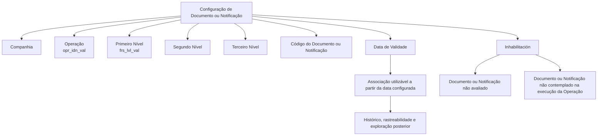

# Configuração de Documentos ou Notificações Associados a Operações de Tesouraria

## 1. Metadados do Documento
- **Arquivo de Origem:** Não identificado no conteúdo fornecido
- **Tipo de Documento:** Especificação Técnica
- **Domínio / Sistema:** Tesouraria / DOCUMENTACIÓN Reef / Mapfre
- **Público-Alvo:** Desenvolvedores, Arquitetos, Operação e Negócio
- **Data/Versão Identificada:** Não identificada

---

## 2. Resumo Executivo & Contexto de Negócio

O documento descreve a configuração para atribuir Documentos ou Notificações a Operações de Tesouraria. A configuração é realizada por meio de propriedades que identificam a companhia, a operação e níveis da Estrutura Comercial.

A associação possui uma **Data de Validade**, que determina a partir de quando um Documento ou Notificação passa a estar associado à Operação e pode ser utilizado. Segundo o documento, essa configuração permite manter histórico das alterações efetuadas nas definições e viabiliza rastreabilidade e exploração posterior das informações.

O documento também apresenta uma propriedade de **Inhabilitación**, utilizada para desativar um Documento ou Notificação. Quando inabilitado, o item não deve ser avaliado nem considerado durante a execução da Operação.

O conteúdo é limitado a propriedades de configuração e descrições funcionais resumidas. Não há detalhamento sobre métodos HTTP, contratos JSON, persistência, telas, regras de autorização ou implementação técnica dos componentes envolvidos.

---

## 3. Arquitetura, Componentes & Tecnologias Envolvidas

Os elementos explicitamente citados são:

| Componente / Conceito | Descrição sustentada pelo documento |
| :--- | :--- |
| Tesouraria | Domínio no qual ocorre a atribuição de Documentos ou Notificações às Operações. |
| Documento ou Notificação | Entidade configurável e associável a uma Operação. |
| Operação | Elemento de Tesouraria identificado por `opr_idn_val`. |
| Companhia | Propriedade que informa o código da companhia sobre a qual a configuração é realizada. |
| Estrutura Comercial | Estrutura composta por Primeiro, Segundo e Terceiro Nível. |
| DOCUMENTACIÓN Reef | Área documental identificada no conteúdo. |
| Mapfredocument | Termo exibido no cabeçalho de navegação/documentação. |
| Zeus | Termo exibido no menu de navegação documental, sem detalhamento adicional. |



> **Nota de Análise:** O documento não detalha uma arquitetura de software, integrações, tecnologias de implementação, APIs, bancos de dados, endpoints, URLs de ambiente ou contratos de dados.

---

## 4. Regras de Negócio, Especificações Funcionais & Processos

1. A configuração de Documento ou Notificação deve informar a **Companhia** sobre a qual a configuração é realizada.
2. A operação associada é identificada pela propriedade `opr_idn_val`, descrita como “id de operacion”.
3. O **Primeiro Nível** da Estrutura Comercial é identificado por `frs_lvl_val`.
4. A configuração pode conter chaves para o Primeiro, Segundo e Terceiro Nível da Estrutura Comercial.
5. O código do Documento ou Notificação identifica a chave que identificará o Documento ou Notificação no Sistema.
6. A **Data de Validade** estabelece a data a partir da qual o Documento está associado à Operação para utilização.
7. A configuração correta da Data de Validade habilita histórico de mudanças nas definições.
8. O histórico das definições permite rastrear e explorar posteriormente as informações.
9. A propriedade **Inhabilitación** desativa o Documento ou Notificação.
10. Um Documento ou Notificação inabilitado não deve ser avaliado.
11. Um Documento ou Notificação inabilitado não deve ser contemplado na execução da Operação.
12. O texto contém a expressão fragmentada `opr_t` seguida de `ltro operacion ok/ko`; não há descrição suficiente para estabelecer seu significado funcional com segurança.

---

## 5. Tabelas de Parâmetros, Ambientes e Estruturas de Dados

| Item / Parâmetro | Descrição / Função | Tipo / Valores / Formato | Ambiente / Observações |
| :--- | :--- | :--- | :--- |
| Companhia | Indica ao sistema o código da companhia sobre a qual está sendo realizada a configuração do Documento ou Notificação. | Código de companhia; formato não detalhado. | Configuração de Documento ou Notificação. |
| `opr_idn_val` | Identificador da Operação. | “id de operacion”; formato não detalhado. | Operações de Tesouraria. |
| `frs_lvl_val` | Identificador do Primeiro Nível. | “primer nivel”; formato não detalhado. | Estrutura Comercial. |
| Chave do Primeiro Nível | Contém o código que identifica o Primeiro Nível da Estrutura Comercial no Sistema. | Código; formato não detalhado. | Estrutura Comercial. |
| Chave do Segundo Nível | Contém o código que identifica o Segundo Nível da Estrutura Comercial no Sistema. | Código; formato não detalhado. | Estrutura Comercial. |
| Chave do Terceiro Nível | Contém o código que identifica o Terceiro Nível da Estrutura Comercial no Sistema. | Código; formato não detalhado. | Estrutura Comercial. |
| Código do Documento/Notificação | Identifica a chave que identificará o Documento ou Notificação no Sistema. | Código; formato não detalhado. | Configuração de Documento ou Notificação. |
| Data de Validade | Estabelece a partir de quando o Documento está associado à Operação para ser utilizado. | Data; formato não detalhado. | Permite histórico, rastreabilidade e exploração posterior. |
| Inhabilitación | Estabelece que o Documento ou Notificação está desativado. | Estado de ativação; valores não detalhados. | O item não é avaliado nem contemplado na execução da Operação. |
| `opr_t` | Expressão apresentada no conteúdo bruto sem descrição confiável. | Não identificado. | Associada no texto a `ltro operacion ok/ko`; significado não detalhado. |

> **Nota de Análise:** O documento não apresenta servidores, ambientes, URLs, portas, diretórios de logs, variáveis de configuração, tipos de dados formais ou valores permitidos para os parâmetros.

---

## 6. Bateria de Perguntas & Respostas para RAG (FAQ Sintético)

### P1: Qual é o objetivo da configuração descrita no documento?
**R:** O objetivo é atribuir Documentos ou Notificações a Operações de Tesouraria por meio de propriedades de configuração, incluindo companhia, operação, níveis da Estrutura Comercial, código do Documento ou Notificação, Data de Validade e Inhabilitación.

### P2: Para que serve a propriedade Companhia?
**R:** A propriedade Companhia informa ao sistema o código da companhia sobre a qual está sendo realizada a configuração do Documento ou Notificação.

### P3: O que identifica o parâmetro `opr_idn_val`?
**R:** O parâmetro `opr_idn_val` é descrito no documento como o identificador da Operação (“id de operacion”).

### P4: Qual é a função de `frs_lvl_val`?
**R:** O documento descreve `frs_lvl_val` como o valor relacionado ao Primeiro Nível (“primer nivel”) da Estrutura Comercial.

### P5: Como o Primeiro Nível da Estrutura Comercial é identificado?
**R:** A Chave do Primeiro Nível contém o código pelo qual o Primeiro Nível da Estrutura Comercial é identificado no Sistema.

### P6: Qual é a finalidade das chaves do Segundo e Terceiro Nível?
**R:** A Chave do Segundo Nível contém o código que identifica o Segundo Nível da Estrutura Comercial no Sistema, enquanto a Chave do Terceiro Nível contém o código que identifica o Terceiro Nível da Estrutura Comercial no Sistema.

### P7: O que representa o Código do Documento/Notificação?
**R:** O Código do Documento/Notificação identifica a chave que identificará o Documento ou Notificação no Sistema.

### P8: Qual é o efeito da Data de Validade na associação de um Documento a uma Operação?
**R:** A Data de Validade estabelece a data a partir da qual o Documento está associado à Operação para utilização.

### P9: Por que a Data de Validade é relevante para rastreabilidade?
**R:** Segundo o documento, uma configuração correta da Data de Validade permite manter histórico das alterações efetuadas nas definições, viabilizando rastreamento e exploração posterior das informações.

### P10: O que ocorre quando um Documento ou Notificação está inabilitado?
**R:** Quando a propriedade Inhabilitación estabelece que o Documento ou Notificação está desativado, esse item não será avaliado nem contemplado durante a execução da Operação.

### P11: O documento informa quais APIs ou métodos HTTP são usados para configurar Documentos ou Notificações?
**R:** Não. O documento não apresenta métodos HTTP, APIs, endpoints, contratos JSON ou mecanismos técnicos de integração.

### P12: O que significa o campo `opr_t`?
**R:** O conteúdo fornecido apresenta `opr_t` e a expressão `ltro operacion ok/ko`, mas não fornece descrição suficiente para determinar o significado funcional ou técnico desse campo sem especulação.

---

## 7. Glossário de Termos, Siglas & Conceitos-Chave

- **Companhia:** Código da companhia sobre a qual é realizada a configuração do Documento ou Notificação.
- **Documento ou Notificação:** Entidade configurável que pode ser associada a uma Operação.
- **Estrutura Comercial:** Estrutura organizacional mencionada com Primeiro, Segundo e Terceiro Nível.
- **Data de Validade:** Data a partir da qual o Documento está associado à Operação para utilização.
- **Inhabilitación:** Propriedade que desativa um Documento ou Notificação.
- **`opr_idn_val`:** Identificador da Operação, descrito como “id de operacion”.
- **`frs_lvl_val`:** Valor relacionado ao Primeiro Nível, descrito como “primer nivel”.
- **DOCUMENTACIÓN Reef:** Identificação da área documental exibida no conteúdo.
- **Tesouraria:** Domínio de Operações ao qual os Documentos ou Notificações são associados.

---

## 8. Notas Críticas, Riscos & Limitações

- O conteúdo indica explicitamente “EN CONSTRUCCIÓN”, sugerindo material ainda em construção.
- Não foram identificados data, versão, nome de arquivo, autor formal ou histórico de revisões; o conteúdo mostra `Owner user:agonzalez_mapfre.com` e `Lifecycle Approved Source`.
- Não há detalhamento de implementação, persistência, telas, APIs, autenticação, autorização, validações de campos ou tratamento de erros.
- Não há valores permitidos, obrigatoriedade, formato de datas ou regras de precedência entre companhia, operação e níveis da Estrutura Comercial.
- O trecho `opr_t` / `ltro operacion ok/ko` está corrompido ou incompleto na extração e não deve ser interpretado sem acesso ao documento original.
- Não são descritos critérios para ativação, reativação ou auditoria da propriedade Inhabilitación.
- Não são informados ambientes, URLs, servidores, logs ou dependências de sistemas externos.

---

## 9. Conteúdo Bruto Estruturado (Referência Fiel)

```text
--- [PÁGINA 1 DE 2] ---

EN CONSTRUCCIÓN
Asignación de los Documentos o Noticaciones a las Operaciones de
la TESORERÍA
Objetivo
-Propiedades
Propiedades
Compañía.
Esta propiedad le indica al sistema el código de la compañía sobre la que se está realizando la conguración del Documento o Noticación.
opr_idn_val
id de operacion
frs_lvl_val
primer nivel
Clave del Primer Nivel
Este atributo contiene el código por el que se identica el Primer Nivel de la Estructura Comercial en el Sistema.
Clave del Segundo Nivel
Este atributo contiene el código por el que se identica el Segundo Nivel de la Estructura Comercial en el Sistema.
Clave del Tercer Nivel
Este atributo contiene el código por el que se identica el Tercer Nivel de la Estructura Comercial en el Sistema.
Código del Documento/Noticación
Este atributo identica la clave que identicará al Documento o Noticación en el Sistema.
Fecha de Validez
Esta propiedad establece la fecha a partir de la cual el Documento está asociado a la Operación para ser utilizado, por lo que una correcta
conguración habilita tener un histórico de los cambios efectuados en las deniciones y poder así trazar y explotar posteriormente esta
Documentation / DOCUMENTACIÓN Reef
DOCUMENTACIÓN Reef
Mapfredocument
DOCUMENTACIÓN Reef
Owner
user:agonzalez_mapfre.com
Lifecycle
Approved Source
 /
 VL
Buscar Inicio Soluciones Arquitecturas APIs Componentes Cloud Documentación Zeus Reef Ayuda
ES


--- [PÁGINA 2 DE 2] ---

información.
opr_t
ltro operacion ok/ko
Inhabilitación
Esta propiedad establece que el Documento o Noticación está desactivado y por tanto ni va a ser evaluado ni va a ser contemplado en la
ejecución de la Operación.
Vínculos
Preguntas frecuentes
```
