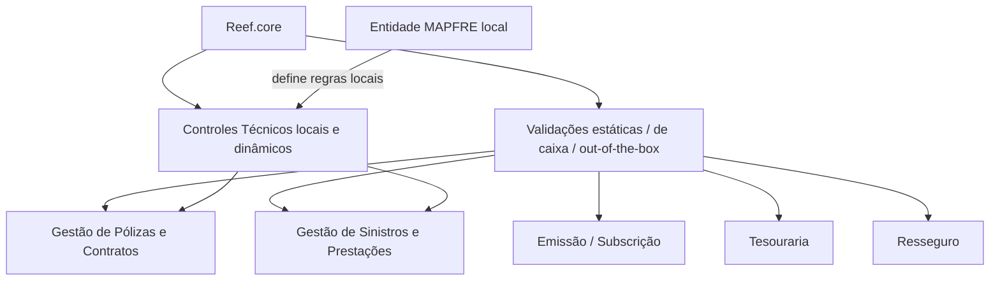

# Controles Técnicos no Reef.core — Definição, Parametrização e Operativa

## 1. Metadados do Documento
- **Arquivo de Origem:** Não identificado no conteúdo fornecido
- **Tipo de Documento:** Manual Operacional / Documentação Funcional
- **Domínio / Sistema:** Reef.core / MAPFRE
- **Público-Alvo:** Desenvolvedores, Arquitetos, Operação e participantes do desenvolvimento de produtos e serviços da entidade MAPFRE local
- **Data/Versão Identificada:** Não identificada

---

## 2. Resumo Executivo & Contexto de Negócio

O documento define o conceito de **Controles Técnicos** no sistema Reef.core. O Reef.core já possui validações estáticas, também chamadas de validações “de caixa” ou *out-of-the-box*, aplicadas às operações, módulos e objetos funcionais de uma companhia de seguros. Essas validações são inerentes ao sistema e não podem ser ignoradas, inclusive durante parametrizações ou configurações locais.

Os Controles Técnicos representam um conjunto complementar de regras de negócio que entidades MAPFRE podem estabelecer voluntária e localmente. Essas regras são executadas dinamicamente em pontos específicos de determinadas operações, atendendo a necessidades técnicas, comerciais ou administrativas da entidade local.

Os exemplos apresentados incluem restrições de subscrição e emissão de apólices para veículos esportivos com mais de cinco anos, limitação de soma segurada de Incêndio em apólices Múltiple Empresarial e permissão para liquidações parciais de danos materiais abaixo de determinado valor sem o visto do perito.

O documento tem como objetivo facilitar a compreensão das propriedades, características, tarefas e ações necessárias para a correta parametrização dos Controles Técnicos no Reef.core. O foco declarado é tornar a configuração compreensível para todos os grupos de interesse envolvidos no desenvolvimento de produtos e serviços da entidade MAPFRE local.

---

## 3. Arquitetura, Componentes & Tecnologias Envolvidas

O conteúdo não descreve arquitetura técnica de infraestrutura, protocolos, APIs, bancos de dados, URLs de ambiente ou tecnologias de implementação. A arquitetura funcional identificável é composta pelo Reef.core, suas validações estáticas nativas e os Controles Técnicos configuráveis localmente.

Os Controles Técnicos são citados principalmente nos processos de **Gestão de Pólizas e Contratos** e **Gestão de Sinistros e Prestações**. O documento também menciona módulos como Emissão/Subscrição, Sinistros, Tesouraria e Resseguro, além de objetos como apólices, sinistros, expedientes e recibos.



**Nota de Análise:** o documento não detalha componentes de software, serviços, métodos HTTP, contratos JSON, persistência de dados ou mecanismos técnicos usados pelo Reef.core para executar os Controles Técnicos.

---

## 4. Regras de Negócio, Especificações Funcionais & Processos

### 4.1 Validações estáticas do Reef.core

As validações estáticas do Reef.core são controles inerentes às operações de uma companhia genérica de seguros. O documento estabelece que essas validações não podem ser evitadas ou desativadas por parametrização ou configuração local.

Regras exemplificadas:

1. A data de vencimento de uma apólice deve ser obrigatoriamente igual ou superior à data de efeito da apólice.
2. Um sinistro somente pode ser iniciado sobre uma apólice se o respectivo código estiver previamente identificado no sistema.
3. Durante a emissão, o código do gestor de cobrança dos recibos, o quadro de distribuição de comissões e o código do plano de pagamento informados pelo usuário emissor/subscritor devem estar habilitados e vigentes na parametrização no momento da operação.
4. Não é possível emitir um suplemento de anulação para uma apólice que já esteja anulada.
5. Não é possível tentar reabilitar uma apólice que não esteja previamente anulada.

### 4.2 Controles Técnicos configuráveis

Os Controles Técnicos são regras de negócio que entidades MAPFRE podem definir voluntária e localmente em operações e pontos concretos do sistema. Essas regras podem controlar permissões, impossibilidades operacionais e condições de execução conforme regras técnicas, comerciais ou administrativas.

Exemplos documentados:

1. Conforme a sinistralidade e o apetite de risco da entidade local, permitir ou impedir a subscrição e emissão de apólices para veículos de uso esportivo com antiguidade superior a cinco anos.
2. Controlar tecnicamente, em Central, a possibilidade ou impossibilidade de emitir uma apólice Múltiple Empresarial cuja soma segurada de Incêndio ultrapasse 5.000.000 Euros.
3. Permitir que um Tramitador realize liquidações parciais em expedientes de Danos Materiais abaixo de 1.000 Dólares sem o visto do Perito atribuído no sistema.

### 4.3 Processo de parametrização citado

O documento lista os seguintes catálogos ou elementos de configuração dos Controles Técnicos:

- Controles Técnicos.
- Níveis de Salto.
- Procedimentos dos Controles Técnicos.
- Níveis de Autorização.
- Papéis.
- Usuários por Papel.
- Níveis de Autorização por Papel.
- Operativa dos Controles Técnicos no Processo de Subscrição/Emissão.
- Palavras Reservadas.

**Nota de Análise:** o conteúdo fornecido enumera os catálogos de configuração, mas não descreve seus campos, sequência operacional, dependências, critérios de parametrização ou comportamento detalhado.

---

## 5. Tabelas de Parâmetros, Ambientes e Estruturas de Dados

| Item / Parâmetro | Descrição / Função | Tipo / Valores / Formato | Ambiente / Observações |
| :--- | :--- | :--- | :--- |
| Data de vencimento da apólice | Deve atender à validação de vigência da apólice | Igual ou superior à data de efeito | Validação estática do Reef.core |
| Data de efeito da apólice | Referência para a validação da data de vencimento | Data | Validação estática do Reef.core |
| Código de sinistro | Deve estar previamente identificado para permitir iniciar um sinistro sobre uma apólice | Código | Validação estática do Reef.core |
| Código do gestor de cobrança | Código capturado durante a emissão de recibos da apólice | Código parametrizado, habilitado e vigente | Processo de emissão |
| Quadro de distribuição de comissões | Informação capturada pelo usuário emissor/subscritor | Parametrização habilitada e vigente | Processo de emissão |
| Código do plano de pagamento | Informação capturada pelo usuário emissor/subscritor | Código parametrizado, habilitado e vigente | Processo de emissão |
| Uso do veículo | Critério de controle para subscrição e emissão | Veículo de uso “deportivo” | Exemplo de Controle Técnico local |
| Antiguidade do veículo | Critério para permitir ou não subscrição e emissão | Superior a 5 anos | Exemplo de Controle Técnico local |
| Tipo de apólice | Produto sujeito ao controle de soma segurada | Múltiple Empresarial | Exemplo de Controle Técnico em Central |
| Soma segurada de Incêndio | Limite usado para controlar a emissão da apólice | Superior a 5.000.000 Euros | Exemplo de Controle Técnico |
| Tipo de expediente | Contexto para liquidações parciais | Danos Materiais | Exemplo de Controle Técnico |
| Valor da liquidação parcial | Limite para dispensar visto do perito | Inferior a 1.000 Dólares | Exemplo de Controle Técnico |
| Papel operacional | Papel autorizado a efetuar liquidações parciais | Tramitador | Exemplo de Controle Técnico |
| Visto do Perito | Aprovação que pode não ser exigida conforme valor da liquidação | Não exigido abaixo de 1.000 Dólares, conforme exemplo | Perito atribuído no sistema |
| Níveis de Salto | Catálogo de configuração citado | Não detalhado | Controle Técnico |
| Procedimentos dos Controles Técnicos | Catálogo de configuração citado | Não detalhado | Controle Técnico |
| Níveis de Autorização | Catálogo de configuração citado | Não detalhado | Controle Técnico |
| Papéis | Catálogo de configuração citado | Não detalhado | Controle Técnico |
| Usuários por Papel | Catálogo de configuração citado | Não detalhado | Controle Técnico |
| Níveis de Autorização por Papel | Catálogo de configuração citado | Não detalhado | Controle Técnico |
| Palavras Reservadas | Elemento citado na configuração | Não detalhado | Controle Técnico |

---

## 6. Bateria de Perguntas & Respostas para RAG (FAQ Sintético)

### P1: O que são Controles Técnicos no Reef.core?
**R:** Controles Técnicos são regras de negócio que as entidades MAPFRE podem estabelecer voluntária e localmente sobre determinadas operações do Reef.core. Essas regras são executadas dinamicamente em pontos concretos das operações para atender necessidades técnicas, comerciais ou administrativas.

### P2: Qual é a diferença entre uma validação estática e um Controle Técnico no Reef.core?
**R:** As validações estáticas, também chamadas de validações de caixa ou *out-of-the-box*, são inerentes ao Reef.core e não podem ser evitadas por configuração local. Os Controles Técnicos são regras locais e voluntárias, aplicadas dinamicamente em operações específicas conforme necessidades da entidade MAPFRE local.

### P3: A data de vencimento de uma apólice pode ser menor que a data de efeito?
**R:** Não. O documento indica que o Reef.core deve validar que a data de vencimento de uma apólice seja obrigatoriamente igual ou superior à data de efeito da apólice.

### P4: Em que condição é possível iniciar um sinistro sobre uma apólice?
**R:** Um sinistro pode ser iniciado sobre uma apólice somente quando o código do sinistro estiver previamente identificado no sistema.

### P5: Quais dados da emissão precisam estar habilitados e vigentes na parametrização?
**R:** O documento cita o código do gestor de cobrança dos recibos, o quadro de distribuição de comissões da apólice e o código do plano de pagamento. Essas informações, capturadas pelo usuário emissor/subscritor, devem estar habilitadas e vigentes no momento da operação.

### P6: É possível emitir um suplemento de anulação para uma apólice já anulada?
**R:** Não. O Reef.core impede operacionalmente a emissão de um suplemento de anulação sobre uma apólice que já esteja anulada.

### P7: É possível reabilitar uma apólice que não foi anulada?
**R:** Não. O documento estabelece como validação estática a impossibilidade de tentar reabilitar uma apólice que não esteja anulada previamente.

### P8: Como um Controle Técnico pode tratar veículos esportivos antigos?
**R:** Conforme a sinistralidade e o apetite de risco da entidade local, um Controle Técnico pode permitir ou impedir a subscrição e emissão de apólices para veículos de uso esportivo com antiguidade superior a cinco anos.

### P9: Qual limite de soma segurada de Incêndio é citado para uma apólice Múltiple Empresarial?
**R:** O documento apresenta como exemplo um Controle Técnico em Central para controlar a possibilidade ou impossibilidade de emissão de uma apólice Múltiple Empresarial quando a soma segurada de Incêndio ultrapassar 5.000.000 Euros.

### P10: Quando um Tramitador pode realizar uma liquidação parcial sem visto do Perito?
**R:** O exemplo apresentado permite que um Tramitador realize liquidações parciais em expedientes de Danos Materiais com valor inferior a 1.000 Dólares sem o visto do Perito atribuído no sistema.

### P11: Em quais processos os Controles Técnicos normalmente são executados?
**R:** O documento informa que os Controles Técnicos normalmente são executados nos processos de Gestão de Pólizas e Contratos e de Gestão de Sinistros e Prestações.

### P12: Quais catálogos de configuração de Controles Técnicos são citados?
**R:** São citados Controles Técnicos, Níveis de Salto, Procedimentos dos Controles Técnicos, Níveis de Autorização, Papéis, Usuários por Papel, Níveis de Autorização por Papel, Operativa dos Controles Técnicos no Processo de Subscrição/Emissão e Palavras Reservadas.

---

## 7. Glossário de Termos, Siglas & Conceitos-Chave

- **Reef.core:** Sistema mencionado como responsável por validações estáticas e pela parametrização de Controles Técnicos.
- **Controles Técnicos:** Regras de negócio locais, voluntárias e dinâmicas configuradas sobre operações específicas do Reef.core.
- **Validações de caixa / out-of-the-box:** Validações estáticas e inerentes ao sistema, que não podem ser evitadas por configuração local.
- **Gestão de Pólizas e Contratos:** Processo citado como área usual de execução dos Controles Técnicos.
- **Gestão de Sinistros e Prestações:** Processo citado como área usual de execução dos Controles Técnicos.
- **Emissão / Subscrição:** Módulo ou processo citado para operações relacionadas a apólices e à operativa dos Controles Técnicos.
- **Tesouraria:** Módulo do sistema citado no documento.
- **Resseguro:** Módulo do sistema citado no documento.
- **Tramitador:** Papel citado como responsável por poder efetuar liquidações parciais em determinado cenário.
- **Perito:** Papel atribuído no sistema cujo visto pode ser dispensado no exemplo de liquidações parciais.
- **Múltiple Empresarial:** Tipo de apólice citado no exemplo de controle sobre soma segurada de Incêndio.
- **Níveis de Salto:** Catálogo de configuração citado, sem detalhamento funcional adicional.
- **Níveis de Autorização:** Catálogo de configuração citado, sem detalhamento funcional adicional.
- **Palavras Reservadas:** Elemento de configuração citado, sem detalhamento funcional adicional.

---

## 8. Notas Críticas, Riscos & Limitações

- O documento não identifica nome do arquivo, data, versão, autores técnicos, histórico de alterações ou escopo de versão do Reef.core.
- Não há detalhamento dos campos, valores permitidos, dependências, persistência ou telas dos catálogos de configuração listados.
- Não são apresentados fluxos completos de aprovação, regras de escalonamento, semântica dos Níveis de Salto ou configuração de Níveis de Autorização.
- Não há contratos de integração, APIs, métodos HTTP, estruturas JSON, rotas de logs, URLs, servidores, portas ou ambientes técnicos.
- Os valores de cinco anos, 5.000.000 Euros e 1.000 Dólares são apresentados como exemplos de regras de negócio; o conteúdo não afirma que sejam parâmetros universais ou obrigatórios para todas as entidades MAPFRE.
- **Nota de Análise:** o documento cita a operativa no processo de Subscrição/Emissão, mas não apresenta o procedimento operacional detalhado.

---

## 9. Conteúdo Bruto Estruturado (Referência Fiel)

```text
--- [PÁGINA 1 DE 2] ---

DEFINICIÓN de los CONTROLES TÉCNICOS
Contexto
¿Qué son los Controles Técnicos? ¿En qué se diferencian de las validaciones existentes en el sistema?
Reef.core contempla ‘validaciones’ de caja' o ‘validaciones out-of-the-box’ en todas y cada una de las operaciones que los Usuarios pueden
realizar sobre los procesos de la entidad (Gestión de Pólizas y Contratos, Gestión de Siniestros y Prestaciones, Gestión Económica
Financiera, …), módulos del sistema (Emisión/Suscripción, Siniestros, Tesorería, Reaseguro,…) y objetos (pólizas, siniestros, expedientes,
recibos, …) que conforman el cuerpo de funcionalidad de la aplicación.
Estas validaciones son estáticas y no se pueden soslayar (ni tan siquiera cuando se efectúa la parametrización o conguración local del
sistema) puesto que todas ellas son validaciones y controles inherentes a las operaciones de una compañía genérica de seguros, tal y como
por ejemplo:
La validación que el sistema debe realizar sobre la fecha de vencimiento de una póliza para comprobar que obligatoriamente ha de ser
igual o superior a la fecha de efecto de la póliza.
La validación que la aplicación debe realizar para permitir iniciar un siniestro sobre una póliza, siempre y cuando su código esté
identicado previamente en el sistema.
La comprobación en el proceso de emisión del código del gestor de cobro de los recibos de la póliza, del cuadro de distribución de
comisiones de la póliza ó del código del plan de pago capturados por el usuario emisor/suscriptor, de acuerdo a la información
parametrizada que esté habilitada y vigente en el momento de realizar la operación.
La imposibilidad operativa de emitir un suplemento de anulación sobre una póliza que ya esté anulada o intentar rehabilitar una póliza
que no esté anulada previamente.
Etc.
Ahora bien, sobre algunas de estas operaciones y en lugares muy concretos de las mismas es posible que se puedan efectuar y ejecutar
dinámicamente otro conjunto de controles o validaciones de acuerdo a las reglas y usos de negocio que técnica, comercial o
administrativamente la entidad MAPFRE quiera o necesite establecer como por ejemplo:
De acuerdo a la siniestralidad y al apetito de riesgo de la entidad local, permitir ó no la suscripción y emisión de pólizas sobre vehículos
de uso ‘deportivo’ con una antigüedad mayor a 5 años.
Controlar técnicamente en Central la im/posibilidad de emitir una póliza Múltiple Empresarial con una suma asegurada de Incendio que
supere los 5.000.000 Euros.
Permitir que un Tramitador puede efectuar liquidaciones parciales en expedientes de Daños Materiales por un importe inferior a los 1.000
Dólares sin contar el Visto Bueno del Perito asignado en el sistema.
… étc.
Documentation / DOCUMENTACIÓN Reef
DOCUMENTACIÓN Reef
Mapfredocument
DOCUMENTACIÓN Reef
Owner
user:agonzalez_mapfre.com
Lifecycle
Approved Source
 /
 VL
Buscar Inicio Soluciones Arquitecturas APIs Componentes Cloud Documentación Zeus Reef Ayuda
ES

--- [PÁGINA 2 DE 2] ---

Estas reglas de negocio que las entidades MAPFRE pueden establecer voluntaria y localmente sobre determinadas operaciones, las
denominaremos de aquí en adelante como Controles Técnicos.
Normalmente los Controles Técnicos se ejecutan en los procesos de Gestión de Pólizas y Contratos y Gestión de Siniestros y
Prestaciones.
Objetivo
Facilitar la comprensión de las propiedades y características de los Controles Técnicos así como de las tareas y acciones que han de
realizarse en Reef.core para conseguir una correcta y adecuada parametrización de los mismos en el sistema, siendo su enfoque
comprensible por todos los colaboradores de los grupos de interés de la entidad MAPFRE local responsables o participantes en ejecutar el
proceso de desarrollo de productos y servicios.
Catálogos de Conguración de los CONTROLES TÉCNICOS.
Controles Técnicos
Niveles de Salto
Procedimientos de los Controles Técnicos
Niveles de Autorización
Roles
Usuarios por Rol
Niveles de Autorización por Rol
Operativa de los Controles Técnicos en el Proceso de Suscripción/Emisión
Palabras 'Reservadas'
Consejo:
```
