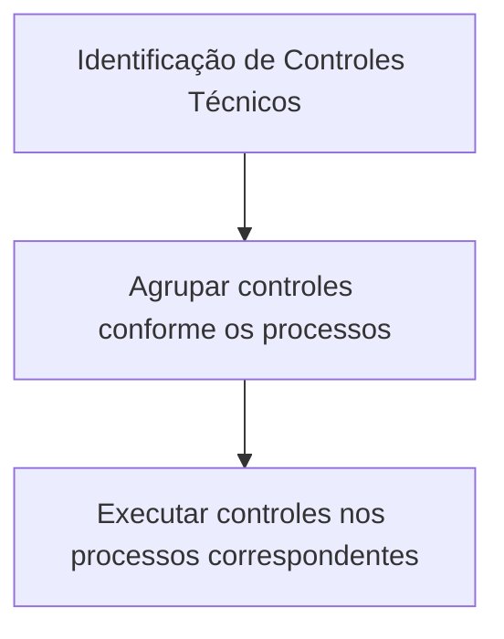

# Documentação Reef — Definição dos Controles Técnicos do Sistema

## 1. Metadados do Documento
- **Arquivo de Origem:** Não identificado no conteúdo fornecido
- **Tipo de Documento:** Especificação Técnica
- **Domínio / Sistema:** Reef / Mapfre
- **Público-Alvo:** Desenvolvedores, Arquitetos, Analistas Funcionais e Operação
- **Data/Versão Identificada:** Não identificada

---

## 2. Resumo Executivo & Contexto de Negócio

O documento descreve a definição dos **Controles Técnicos** do Sistema Reef. O núcleo do sistema possibilita a codificação desses controles em um repositório de informação específico, disponibilizado inicialmente às instalações com conteúdo pré-carregado.

O catálogo de Controles Técnicos possui propriedades gerais para identificar a companhia, o código do controle, o idioma utilizado nas descrições e a descrição do próprio controle. Esses atributos permitem registrar controles técnicos associados a uma companhia e descrevê-los em diferentes idiomas.

A descrição do Controle Técnico pode representar mensagens ou condições operacionais, como a existência prévia de uma liquidação em um expediente ou uma cobertura que ultrapassa a soma segurada recomendada pelo PLATEA. O conteúdo apresentado não detalha o mecanismo de execução, os métodos de integração, os contratos de dados ou os processos que consomem os controles técnicos.

O documento recomenda a leitura de diretrizes e documentos funcionais vinculados, pois a interpretação isolada da definição de Controles Técnicos pode conduzir a erro. Como boa prática, recomenda-se agrupar a identificação dos Controles Técnicos conforme os processos nos quais os controles serão executados.

---

## 3. Arquitetura, Componentes & Tecnologias Envolvidas

Os componentes e conceitos explicitamente mencionados são:

| Componente / Conceito | Descrição sustentada pelo documento |
| :--- | :--- |
| Sistema Reef | Sistema ao qual pertence a documentação de Controles Técnicos. |
| Núcleo do Sistema | Componente que permite codificar Controles Técnicos em um repositório de informação específico. |
| Repositório de informação específico | Repositório entregue inicialmente às instalações com conteúdo pré-carregado para a codificação de Controles Técnicos. |
| Controles Técnicos | Elementos codificados no catálogo, identificados por companhia, código, idioma e descrição. |
| Companhia | Propriedade que informa o código da companhia sobre a qual a definição do Controle Técnico é realizada. |
| PLATEA | Referenciado em um exemplo de mensagem de Controle Técnico; o documento não define a sigla ou o sistema. |
| Expediente | Referenciado em exemplo de mensagem de Controle Técnico; o documento não detalha sua estrutura ou ciclo de vida. |
| Liquidação | Referenciada em exemplo de mensagem de Controle Técnico; o documento não detalha regras de criação ou processamento. |
| Cobertura | Referenciada em exemplo de mensagem de Controle Técnico; o documento não detalha seu modelo de dados. |
| Soma Segurada | Referenciada em exemplo de mensagem de Controle Técnico; o documento não detalha cálculo ou origem. |

O conteúdo não apresenta arquitetura de camadas, integrações, microsserviços, tecnologias, ambientes, protocolos, APIs, fluxos de dados ou pipeline de CI/CD. Portanto, não há evidência suficiente para reconstruir um diagrama Mermaid sem inferências.

> *Nota de Análise: O documento afirma que o núcleo do Sistema Reef codifica Controles Técnicos em um repositório específico, mas não detalha componentes físicos ou lógicos, interfaces, persistência, métodos HTTP, contratos JSON ou relações de execução entre sistemas.*

---

## 4. Regras de Negócio, Especificações Funcionais & Processos

### 4.1 Definição de Controles Técnicos

1. O núcleo do Sistema Reef possui a possibilidade de codificar Controles Técnicos.
2. Os Controles Técnicos são codificados em um repositório de informação específico.
3. O repositório é entregue inicialmente às instalações com conteúdo pré-carregado.
4. A definição de um Controle Técnico está associada a uma companhia por meio do código da companhia.
5. Cada Controle Técnico possui uma chave de identificação denominada Código do Controle Técnico.
6. Cada definição utiliza um Código de Idioma para as descrições dos níveis da Estrutura Geográfica.
7. Os idiomas exemplificados são espanhol, inglês e turco.
8. A Descrição do Controle Técnico registra a descrição associada ao controle.
9. O documento recomenda consultar diretrizes e documentos funcionais relacionados para evitar interpretações incorretas causadas pela leitura isolada da documentação.
10. Como boa prática, a identificação dos Controles Técnicos deve ser agrupada de acordo com os processos nos quais esses controles serão executados.

### 4.2 Exemplos de descrições de Controles Técnicos

| Código mencionado | Descrição apresentada |
| :--- | :--- |
| Error 344 | El Expediente ya cuenta con una Liquidación. |
| Error 455 | La Cobertura supera la Suma Asegurada recomendada por PLATEA. |

### 4.3 Processo de organização recomendado

O único processo recomendado explicitamente é a organização da identificação dos Controles Técnicos por processo de execução:



> *Nota de Análise: O diagrama representa exclusivamente a boa prática descrita no documento. Não foram fornecidas etapas de cadastro, aprovação, publicação, execução, tratamento de erro ou manutenção dos Controles Técnicos.*

---

## 5. Tabelas de Parâmetros, Ambientes e Estruturas de Dados

### 5.1 Propriedades Gerais do Controle Técnico

| Item / Parâmetro | Descrição / Função | Tipo / Valores / Formato | Ambiente / Observações |
| :--- | :--- | :--- | :--- |
| Compañía | Indica ao sistema o código da companhia sobre a qual está sendo realizada a definição do Controle Técnico. | Código de companhia; formato não detalhado. | Aplicável à definição do Controle Técnico. |
| Código del Control Técnico | Determina a chave do Controle Técnico definido. | Código ou chave; formato não detalhado. | Identificador do Controle Técnico. |
| Código de Idioma | Chave do idioma empregado na definição das descrições dos níveis da Estrutura Geográfica. | Código de idioma; exemplos: espanhol, inglês, turco. | O documento não fornece padrão de códigos. |
| Descripción del Control Técnico | Indica a descrição do Controle Técnico capturado no Sistema. | Texto descritivo; exemplos de mensagens de erro são apresentados. | O texto original menciona “Moneda o Divisa” nesta descrição, embora o contexto da seção trate de Controle Técnico. |
| Vínculos | Relação de diretrizes e documentos funcionais cuja leitura é recomendada. | Relação documental; estrutura não detalhada. | A consulta é recomendada para evitar interpretação isolada incorreta. |

### 5.2 Dados de ambiente, servidores, URLs e logs

| Item / Parâmetro | Descrição / Função | Tipo / Valores / Formato | Ambiente / Observações |
| :--- | :--- | :--- | :--- |
| Ambientes | Não detalhados no conteúdo fornecido. | Não identificado. | Não há URLs, servidores, portas ou credenciais. |
| Rotas de log | Não detalhadas no conteúdo fornecido. | Não identificado. | Não há caminhos de arquivos ou configurações de log. |
| APIs | Não detalhadas no conteúdo fornecido. | Não identificado. | Não há métodos HTTP, endpoints ou contratos. |
| Banco de dados / persistência | Apenas é citado um “repositório de informação específico”. | Não identificado. | Tecnologia, modelo de dados e localização não são especificados. |

---

## 6. Bateria de Perguntas & Respostas para RAG (FAQ Sintético)

### P1: Qual é a finalidade do repositório de informação específico mencionado na documentação Reef?
**R:** O repositório de informação específico é utilizado pelo núcleo do Sistema Reef para codificar os Controles Técnicos. O documento informa que esse repositório é entregue inicialmente às instalações com conteúdo pré-carregado, mas não detalha a tecnologia, o local de armazenamento ou o processo de carga desse conteúdo.

### P2: Quais propriedades gerais identificam um Controle Técnico no Sistema Reef?
**R:** A documentação apresenta as propriedades Compañía, Código del Control Técnico, Código de Idioma, Descripción del Control Técnico e Vínculos. A companhia informa o código da empresa associada à definição; o código do controle é sua chave; o código de idioma identifica o idioma das descrições; a descrição registra o texto associado ao controle; e os vínculos relacionam diretrizes e documentos funcionais recomendados.

### P3: Para que serve a propriedade Compañía na definição de um Controle Técnico?
**R:** A propriedade Compañía informa ao Sistema Reef o código da companhia sobre a qual está sendo realizada a definição do Controle Técnico. O documento não especifica o formato, o tamanho ou uma lista de valores permitidos para esse código.

### P4: O que determina o Código del Control Técnico?
**R:** O Código del Control Técnico determina a chave do Controle Técnico definido. A documentação não especifica padrão de nomenclatura, tipo de dado, obrigatoriedade, unicidade ou mecanismo de geração desse código.

### P5: Qual é a finalidade do Código de Idioma?
**R:** O Código de Idioma é a chave do idioma empregado na definição das descrições dos níveis da Estrutura Geográfica. O documento cita espanhol, inglês e turco como exemplos de idiomas, mas não define os códigos formais utilizados para representá-los.

### P6: Quais exemplos de mensagens são fornecidos para a Descripción del Control Técnico?
**R:** O documento fornece dois exemplos: “Error 344 - El Expediente ya cuenta con una Liquidación.” e “Error 455 - La Cobertura supera la Suma Asegurada recomendada por PLATEA.” Não são detalhadas as condições técnicas de disparo, as regras de severidade ou o tratamento desses erros.

### P7: Qual boa prática é recomendada para codificar Controles Técnicos?
**R:** A boa prática recomendada é agrupar a identificação dos Controles Técnicos de acordo com os processos sobre os quais os controles serão executados. A documentação não fornece uma taxonomia de processos, convenção de códigos ou exemplos de agrupamento.

### P8: Por que o documento recomenda consultar os vínculos relacionados?
**R:** Os vínculos correspondem à relação de diretrizes e documentos funcionais cuja leitura é recomendada para evitar que a interpretação isolada da documentação de Controles Técnicos conduza a erro. O conteúdo fornecido não lista os documentos vinculados.

### P9: O documento descreve APIs ou métodos HTTP para gerenciar Controles Técnicos?
**R:** Não. O documento não apresenta APIs, endpoints, métodos HTTP, contratos JSON, formatos de requisição, formatos de resposta ou mecanismos de autenticação para gerenciar Controles Técnicos.

### P10: O documento informa como os Controles Técnicos são executados?
**R:** Não em detalhe. O documento apenas recomenda que a identificação dos controles seja agrupada conforme os processos nos quais serão executados. Não há informação sobre motor de regras, gatilhos, ordem de execução, retorno, bloqueio, alerta ou tratamento de falhas.

---

## 7. Glossário de Termos, Siglas & Conceitos-Chave

- **Reef:** Nome do sistema ou domínio associado à documentação.
- **Controle Técnico:** Elemento que pode ser codificado no repositório específico do núcleo do Sistema Reef e identificado por propriedades gerais.
- **Compañía:** Propriedade que indica o código da companhia associada à definição de um Controle Técnico.
- **Código del Control Técnico:** Chave que identifica o Controle Técnico definido.
- **Código de Idioma:** Chave do idioma empregado nas descrições dos níveis da Estrutura Geográfica.
- **Estrutura Geográfica:** Estrutura cujos níveis possuem descrições definidas por idioma; o documento não apresenta sua composição.
- **Descripción del Control Técnico:** Propriedade destinada à descrição do Controle Técnico capturado no Sistema.
- **Vínculos:** Relação de diretrizes e documentos funcionais recomendados para complementar a interpretação da documentação.
- **Expediente:** Termo citado no exemplo “El Expediente ya cuenta con una Liquidación”; não definido adicionalmente.
- **Liquidación:** Termo citado no exemplo associado ao Error 344; não definido adicionalmente.
- **Cobertura:** Termo citado no exemplo associado ao Error 455; não definido adicionalmente.
- **Suma Asegurada:** Termo citado no exemplo associado ao Error 455; não definido adicionalmente.
- **PLATEA:** Termo citado como referência para a soma segurada recomendada; a sigla ou sistema não é definido no documento.

---

## 8. Notas Críticas, Riscos & Limitações

- O conteúdo não identifica o arquivo de origem, a data, a versão, o autor técnico ou o histórico de revisões.
- Não são informados ambientes, servidores, URLs, portas, credenciais, rotas de logs ou procedimentos operacionais.
- Não há detalhamento de APIs, métodos HTTP, contratos de integração, modelos de persistência ou tecnologias utilizadas pelo repositório de informação.
- Não há definição do ciclo de vida dos Controles Técnicos, incluindo criação, alteração, aprovação, publicação, desativação ou auditoria.
- Não são informadas regras de validação para Compañía, Código del Control Técnico, Código de Idioma ou Descripción del Control Técnico.
- A propriedade “Descripción del Control Técnico” contém uma redação que menciona “Moneda o Divisa”, embora a seção seja dedicada a Controles Técnicos. O documento não esclarece se se trata de texto reutilizado, inconsistência documental ou relação funcional.
- PLATEA, Expediente, Liquidación, Cobertura e Suma Asegurada aparecem somente nos exemplos e não possuem definição adicional.
- As diretrizes e documentos funcionais vinculados são recomendados, mas não são identificados no conteúdo fornecido.
- O documento não detalha como os controles são executados, quais processos os consomem, quais consequências operacionais resultam de um controle ou como erros são tratados.

---

## 9. Conteúdo Bruto Estruturado (Referência Fiel)

```text
--- [PÁGINA 1 DE 2] ---

Documentation / DOCUMENTACIÓN Reef
DOCUMENTACIÓN Reef
Mapfredocument
DOCUMENTACIÓN Reef
Owner
user:agonzalez_mapfre.com
Lifecycle
Approved Source
 / 
 VL
Buscar Inicio Soluciones Arquitecturas APIs Componentes Cloud Documentación Zeus Reef Ayuda
ES


--- [PÁGINA 2 DE 2] ---

DEFINICIÓN de los CONTROLES TÉCNICOS del Sistema
El núcleo del Sistema cuenta con la posibilidad de codicar los Controles Técnicos en un repositorio de información especíco que se
entrega inicialmente a las instalaciones con contenido pre-cargado y cuyas propiedades son:
Propiedades Generales
Propiedades Generales
Compañía
Esta propiedad le indica al sistema el código de la compañía sobre la que se está realizando la denición del Control Técnico.
Código del Control Técnico
Esta propiedad determina la clave del Control Técnico denido.
Código de Idioma
Esta propiedad es la clave del Idioma empleado en la denición de las descripciones de los niveles de la Estructura Geográca, como por
ejemplo: español, inglés, turco, ...
Descripción del Control Técnico
Esta propiedad indica la descripción de la Moneda o Divisa que se está capturando en el Sistema, e.g:
Error 344 - El Expediente ya cuenta con una Liquidación.
Error 455 - La Cobertura supera la Suma Asegurada recomendada por PLATEA.
Vínculos
Relación de Directrices y Documentos funcionales cuya lectura recomendada para evitar que la interpretación aislada del presente
documento pueda conducir a error.
Denición Controles Técnicos
Preguntas frecuentes
(1) ¿Existe alguna circunstancia que tenga que ser tomada en consideración sobre este catálogo?
Puede considerarse como una buena práctica en la codicación de los Controles Técnicos en este catálogo el agrupar su identicación de
acuerdo con los procesos sobre los que se van a ejecutar.
```
