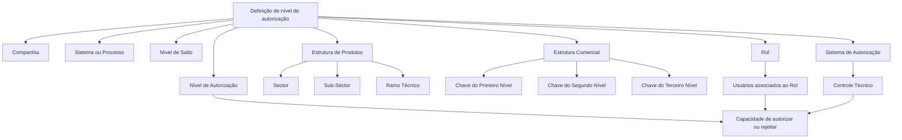

# Especialização dos Níveis de Autorização dos Controles Técnicos por Papel de Usuário no Reef.core

## 1. Metadados do Documento
- **Arquivo de Origem:** Não identificado no conteúdo extraído
- **Tipo de Documento:** Especificação Técnica
- **Domínio / Sistema:** Reef.core; Controles Técnicos; autorização por papel de usuário
- **Público-Alvo:** Desenvolvedores, Arquitetos, Operação e Analistas Funcionais
- **Data/Versão Identificada:** Não identificada
- **Owner identificado:** `user:agonzalez_mapfre.com`
- **Lifecycle identificado:** `Approved Source`

---

## 2. Resumo Executivo & Contexto de Negócio

O documento descreve a funcionalidade de especialização do nível de autorização concedido a um papel de controle técnico — e, consequentemente, aos usuários associados a esse papel — no contexto dos Controles Técnicos do Reef.core.

A especialização do nível de autorização é configurada a partir de atributos organizados em três dimensões: companhia e sistema/processo; estrutura de produtos; e estrutura comercial. A configuração também considera o ponto do processo no qual o controle técnico é executado, denominado **Nível de Salto**.

A estrutura de produtos é composta pelos atributos **Sector**, **Sub-Sector** e **Ramo Técnico**. A estrutura comercial é composta pelas chaves de primeiro, segundo e terceiro nível. Cada atributo permite o uso de códigos genéricos para aplicar a autorização a todos os elementos configurados naquele nível ou de códigos específicos para limitar a especialização a uma estrutura concreta.

O documento também estabelece que a autorização ou rejeição de um controle técnico depende do sistema/departamento de autorização configurado no controle e do nível de autorização atribuído ao papel e ao usuário. Como exemplo, controles cujo sistema ou departamento de autorização seja Reaseguro somente podem ser autorizados ou rejeitados por um papel e usuário cujo nível de autorização permita essa ação.

---

## 3. Arquitetura, Componentes & Tecnologias Envolvidas

### Componentes e conceitos identificados

| Componente / Conceito | Papel no contexto descrito |
| :--- | :--- |
| **Reef.core** | Núcleo do sistema que possibilita especializar o nível de autorização de papéis de controle técnico. |
| **Controles Técnicos** | Contexto funcional no qual os níveis de autorização são aplicados. |
| **Rol de control técnico** | Papel cujo nível de autorização pode ser configurado e especializado. |
| **Usuarios asociados al rol** | Usuários que recebem o efeito do nível de autorização atribuído ao papel. |
| **Sistema o Proceso** | Processo no qual a definição se insere; os exemplos citados são Emisión e Siniestros. |
| **Sistema de Autorización** | Sistema entendido como departamento da companhia apto a autorizar o controle técnico. |
| **Estructura de Productos** | Estrutura formada por Sector, Sub-Sector e Ramo Técnico. |
| **Estructura Comercial** | Estrutura formada por Primeiro, Segundo e Terceiro Nível. |
| **Nivel de Salto** | Lugar concreto do processo de emissão ou sinistros onde a regra de negócio ou controle técnico é executado. |
| **Reaseguro** | Exemplo de sistema/departamento de autorização citado no documento. |

### Fluxo lógico de especialização e autorização



> **Nota de Análise:** O documento descreve atributos de configuração e regras de especialização, mas não detalha arquitetura de infraestrutura, APIs, métodos HTTP, contratos JSON, persistência de dados ou tecnologias de implementação.

---

## 4. Regras de Negócio, Especificações Funcionais & Processos

### Especialização de autorização por papel

1. O núcleo do Reef.core permite especializar o nível de autorização concedido ao papel de controle técnico.
2. Os usuários associados ao papel recebem o efeito do nível de autorização atribuído ao papel.
3. A especialização pode ser definida considerando:
   - Sistema ou processo;
   - Nível de salto;
   - Estrutura de produtos;
   - Estrutura comercial.
4. A definição deve indicar a companhia sobre a qual o nível de autorização está sendo configurado.
5. A definição deve indicar o papel por meio da respectiva chave de catálogo.
6. A definição deve indicar o sistema de autorização, entendido como departamento da companhia.
7. A definição deve indicar o nível de autorização específico associado ao papel e aos usuários vinculados a esse papel.

### Regras da estrutura de produtos

1. **Sector**
   - O código genérico `9999` especializa o nível de autorização para todos os setores configurados no sistema.
   - Um código de setor específico especializa o nível de autorização exclusivamente para o setor indicado.

2. **Sub-Sector**
   - O código genérico `9999` especializa o nível de autorização para todos os subsetores configurados no sistema.
   - Um código de subsetor específico especializa o nível de autorização exclusivamente para esse subsetor.
   - A definição do subsetor deve sempre considerar o valor do atributo Sector da estrutura de produtos.

3. **Ramo Técnico**
   - O código genérico `999` especializa o nível de autorização para todos os ramos técnicos configurados no sistema.
   - Um código de ramo técnico específico especializa o nível de autorização exclusivamente para o ramo indicado.
   - A definição do ramo técnico deve sempre considerar os valores dos atributos Sector e Sub-Sector da estrutura de produtos.

### Regras da estrutura comercial

1. **Clave del Primer Nivel**
   - O código genérico `99` especializa o nível de autorização para todos os primeiros níveis da estrutura comercial configurada na companhia.
   - Um código específico especializa a autorização exclusivamente para o primeiro nível indicado.

2. **Clave del Segundo Nivel**
   - O código genérico `999` especializa o nível de autorização para todos os segundos níveis da estrutura comercial configurada na companhia.
   - Um código específico especializa a autorização exclusivamente para o segundo nível indicado.
   - A definição do segundo nível deve considerar o valor do Primeiro Nível da estrutura comercial.

3. **Clave del Tercer Nivel**
   - O código genérico `9999` especializa o nível de autorização para todas as oficinas da estrutura comercial da companhia.
   - Um código de oficina específico especializa a autorização exclusivamente para a oficina indicada.
   - A definição do terceiro nível deve considerar os valores do Primeiro Nível e do Segundo Nível da estrutura comercial.

### Regras de autorização de controles técnicos

1. O **Código del Sistema de Autorización** identifica o sistema, entendido como departamento da companhia, que poderá autorizar o controle técnico.
2. Um controle técnico configurado com o departamento de autorização **Reaseguro** somente poderá ser autorizado ou rejeitado por:
   - um papel cujo nível de autorização permita a ação; e
   - um usuário associado a esse papel.
3. O atributo **Nivel de Autorización** determina o nível específico de autorização associado ao papel e aos usuários da companhia vinculados ao papel.
4. O documento informa que, tradicionalmente, as entidades MAPFRE definiram o intervalo de níveis `NIVEL0` até `NIVEL09`.

---

## 5. Tabelas de Parâmetros, Ambientes e Estruturas de Dados

| Item / Parâmetro | Descrição / Função | Tipo / Valores / Formato | Ambiente / Observações |
| :--- | :--- | :--- | :--- |
| Compañía | Indica o código da companhia sobre a qual é realizada a definição do nível de autorização. | Código de companhia | Não há formato adicional informado. |
| Código del Sistema | Indica o código do sistema ou processo em que a definição de autorização se insere. | Código de sistema ou processo | Exemplos citados: Emisión, Siniestros. |
| Sector | Determina a chave do setor para especialização da autorização do papel. | Código específico ou `9999` | `9999` aplica-se a todos os setores configurados. |
| Sub-Sector | Determina o código do subsetor para especialização da autorização do papel. | Código específico ou `9999` | `9999` aplica-se a todos os subsetores; considerar o Sector definido. |
| Ramo | Determina a chave do Ramo Técnico para especialização da autorização. | Código específico ou `999` | `999` aplica-se a todos os ramos técnicos; considerar Sector e Sub-Sector. |
| Nivel de Salto | Determina o ponto concreto do processo de emissão ou sinistros no qual a regra ou controle técnico é executado. | Não informado | Não há códigos ou valores exemplificados. |
| Clave del Primer Nivel | Código do primeiro nível da estrutura comercial para o qual a autorização é especializada. | Código específico ou `99` | `99` aplica-se a todos os primeiros níveis da companhia. |
| Clave del Segundo Nivel | Código do segundo nível da estrutura comercial para o qual a autorização é especializada. | Código específico ou `999` | `999` aplica-se a todos os segundos níveis; considerar o Primeiro Nível. |
| Clave del Tercer Nivel | Código do terceiro nível da estrutura comercial para o qual a autorização é especializada. | Código de oficina específico ou `9999` | `9999` aplica-se a todas as oficinas; considerar Primeiro e Segundo Nível. |
| Rol | Determina a chave do papel no catálogo. | Chave de rol | O documento não apresenta catálogo nem valores de exemplo. |
| Código del Sistema de Autorización | Indica o sistema/departamento que poderá autorizar o controle técnico. | Código de sistema/departamento | Reaseguro é citado como exemplo. |
| Nivel de Autorización | Determina o nível específico atribuído ao papel e aos usuários associados. | Tradicionalmente `NIVEL0` a `NIVEL09` | O documento não explica a semântica individual de cada nível. |

---

## 6. Bateria de Perguntas & Respostas para RAG (FAQ Sintético)

### P1: Qual é o objetivo da especialização de níveis de autorização no Reef.core?
**R:** O objetivo é especializar o nível de autorização concedido a um papel de controle técnico e, por consequência, aos usuários associados a esse papel. A especialização pode considerar sistema ou processo, nível de salto, estrutura de produtos e estrutura comercial.

### P2: O que acontece quando o atributo Sector recebe o código genérico 9999?
**R:** O código genérico `9999` no atributo Sector permite especializar o nível de autorização do papel para todos os setores configurados no sistema. Para restringir a autorização a um setor, deve-se utilizar o código específico desse setor.

### P3: Como o Sub-Sector deve ser configurado em relação ao Sector?
**R:** O Sub-Sector pode receber o código genérico `9999` para abranger todos os subsetores configurados no sistema ou um código específico para restringir a especialização a um subsetor. A definição deve sempre considerar o valor do atributo Sector da estrutura de produtos.

### P4: Qual código genérico deve ser usado para todos os ramos técnicos?
**R:** O atributo Ramo Técnico utiliza o código genérico `999` para especializar o nível de autorização para todos os ramos técnicos configurados no sistema. Para um ramo específico, deve-se usar o código desse ramo, considerando os atributos Sector e Sub-Sector da definição.

### P5: O que representa o Nível de Salto em um controle técnico?
**R:** O Nível de Salto determina o lugar concreto do processo de emissão ou de sinistros no qual a regra de negócio ou o controle técnico é executado. O documento não apresenta valores, códigos ou uma enumeração de níveis de salto.

### P6: Como configurar a autorização para todos os primeiros níveis da estrutura comercial?
**R:** Para todos os primeiros níveis da estrutura comercial configurada na companhia, a Clave del Primer Nivel deve utilizar o valor genérico `99`. Para limitar a especialização, deve-se utilizar o código de um primeiro nível específico.

### P7: Quais códigos genéricos são utilizados nos níveis comercial de segundo e terceiro nível?
**R:** A Clave del Segundo Nivel utiliza `999` para abranger todos os segundos níveis configurados na companhia. A Clave del Tercer Nivel utiliza `9999` para abranger todas as oficinas da estrutura comercial. Configurações específicas devem respeitar os níveis comerciais superiores já definidos.

### P8: Quem pode autorizar ou rejeitar um controle técnico associado ao departamento de Reaseguro?
**R:** Um controle técnico cuja configuração determine Reaseguro como sistema ou departamento de autorização somente poderá ser autorizado ou rejeitado por um papel e por um usuário cujo nível de autorização permita essa ação.

### P9: O que representa o Código del Sistema de Autorización?
**R:** O Código del Sistema de Autorización identifica o sistema entendido como departamento da companhia que poderá autorizar o controle técnico. Esse atributo determina qual área é competente para autorizar ou rejeitar o controle.

### P10: Qual é a relação entre o Rol e os usuários da companhia?
**R:** O atributo Rol determina a chave do papel no catálogo. O nível de autorização definido para esse papel fica associado também aos usuários da companhia que tenham esse papel atribuído.

### P11: Quais níveis de autorização são mencionados como tradição nas entidades MAPFRE?
**R:** O documento informa que tradicionalmente as entidades MAPFRE definiram o intervalo de níveis de autorização entre `NIVEL0` e `NIVEL09`. Não há detalhamento sobre permissões ou hierarquia de cada nível individual.

---

## 7. Glossário de Termos, Siglas & Conceitos-Chave

- **Reef.core:** Sistema citado como núcleo que permite especializar níveis de autorização de papéis de controle técnico.
- **Control Técnico:** Regra de negócio ou controle executado em um ponto concreto de um processo de emissão ou sinistros.
- **Rol:** Papel de catálogo para o qual é configurado um nível de autorização.
- **Nivel de Autorización:** Nível específico de autorização associado a um papel e aos usuários vinculados a ele.
- **Nivel de Salto:** Lugar concreto do processo de emissão ou sinistros onde um controle técnico ou regra de negócio é executado.
- **Sistema de Autorización:** Sistema entendido como departamento da companhia apto a autorizar um controle técnico.
- **Sector:** Nível da estrutura de produtos utilizado para especializar a autorização.
- **Sub-Sector:** Nível da estrutura de produtos subordinado ao Sector.
- **Ramo Técnico:** Nível da estrutura de produtos que deve considerar Sector e Sub-Sector na definição.
- **Estructura Comercial:** Estrutura organizacional composta por Primeiro, Segundo e Terceiro Nível.
- **Oficina:** Elemento identificado pelo Terceiro Nível da estrutura comercial.
- **Emisión:** Exemplo de sistema ou processo mencionado no documento.
- **Siniestros:** Exemplo de sistema ou processo mencionado no documento.
- **Reaseguro:** Exemplo de sistema/departamento de autorização mencionado no documento.
- **NIVEL0 a NIVEL09:** Intervalo de níveis de autorização tradicionalmente definido nas entidades MAPFRE, conforme o documento.

---

## 8. Notas Críticas, Riscos & Limitações

- O documento não identifica nome de arquivo, data, versão, autor formal ou histórico de alterações.
- Não são apresentados métodos HTTP, APIs, contratos JSON, estrutura de banco de dados, interfaces de usuário ou mecanismos de persistência.
- O documento não detalha a precedência entre definições genéricas e específicas quando múltiplas configurações puderem corresponder ao mesmo controle técnico.
- O documento não define o significado funcional, a hierarquia ou as permissões individuais dos níveis `NIVEL0` a `NIVEL09`.
- O documento não apresenta os códigos válidos de companhia, sistema, setor, subsetor, ramo, níveis comerciais, papéis ou departamentos de autorização.
- O documento recomenda a leitura conjunta dos documentos **Sistemas de la Aplicación**, **Estructura de Productos**, **Estructura Comercial**, **Definición Controles Técnicos** e **Usuarios de la Compañía** para evitar interpretações isoladas incorretas.
- **Nota de Análise:** O conteúdo descreve a configuração funcional de autorização, mas não detalha como o Reef.core resolve conflitos entre configurações nem em qual ordem avalia os atributos.

---

## 9. Conteúdo Bruto Estruturado (Referência Fiel)

```text
--- [PÁGINA 1 DE 3] ---

ESPECIALIZACIÓN de los NIVELES de AUTORIZACIÓN de los
Controles Técnicos por ROL de Usuario
En el ámbito funcional de los Controles Técnicos en Reef.core el núcleo del Sistema cuenta con la posibilidad de especializar el nivel de
Autorización otorgado al Rol de control técnico (y por ende a los usuarios que este tenga asociados) de acuerdo con el sistema, el nivel de
salto y las estructuras de productos y comercial.
Propiedades Generales
Propiedades Generales
Compañía
Esta propiedad le indica al sistema el código de la compañía sobre la que se está realizando la denición del nivel de autorización.
Código del Sistema
Esta propiedad indica el código del Sistema o Proceso (Emisión, Siniestros,...) en el que se inscribe la denición del nivel de autorización.
Sector
Esta propiedad determina la clave del sector en el que se está particularizando el nivel de autorización del rol.
Utilizando el valor genérico en este atributo (código 9999) el sistema permite especializar el nivel de autorización del rol para todos los
sectores congurados en el sistema o bien, al utilizar el código de un sector en particular de los n existentes, especializar el nivel de
autorización del rol exclusivamente para este.
Sub-Sector
Este atributo determina a su vez el código del sub-sector para el que se está especializando el nivel de autorización del rol.
Utilizando el valor genérico en este atributo (código 9999) el sistema permite especializar el nivel de autorización del rol para todos los
subsectores congurados en el sistema o bien, al utilizar el código de un subsector en concreto de los existentes, especializar el nivel de
autorización del rol exclusivamente para este (teniendo siempre en consideración el valor del atributo del sector de la estructura de
productos que tenga la denición)
Ramo
Consejo:
Consejo:
Documentation / DOCUMENTACIÓN Reef
DOCUMENTACIÓN Reef
Mapfredocument
DOCUMENTACIÓN Reef
Owner
user:agonzalez_mapfre.com
Lifecycle
Approved Source
 / 
 VL
Buscar Inicio Soluciones Arquitecturas APIs Componentes Cloud Documentación Zeus Reef Ayuda
ES


--- [PÁGINA 2 DE 3] ---

Esta propiedad determina la clave del Ramo Técnico para el que se está especializando el nivel de autorización.
Utilizando el valor genérico en este atributo (código 999) el sistema permite especializar el nivel de autorización del rol para todos los
ramos técnicos congurados en el sistema o bien, al utilizar el código de un ramo técnico en particular de los existentes, especializar el
nivel de autorización del rol exclusivamente para este (teniendo siempre en consideración el valor de los atributos del sector y subsector
de la estructura de productos que tenga la denición)
Nivel de Salto
Este atributo determina el lugar concreto del proceso de emisión o siniestros en donde se ejecuta la regla de negocio o control técnico.
Clave del Primer Nivel
Este atributo contiene el código del primer nivel de la estructura comercial para el que se está especicando el nivel de Autorización del rol.
Utilizando el valor genérico en este atributo (código 99) el sistema permite especializar el nivel de autorización del rol para todos los
primeros niveles de la estructura comercial congurada en la compañía o bien, al utilizar el código de un nivel en concreto de los n
existentes especializar el nivel de autorización del rol exclusivamente para este.
Clave del Segundo Nivel
Este atributo contiene el código del segundo nivel de la estructura comercial para el que se está especicando el nivel de Autorización del rol.
Utilizando el valor genérico en este atributo (código 999) el sistema permite especializar el nivel de autorización del rol para todos los
segundos niveles de la estructura comercial congurada en la compañía o bien, al utilizar el código de un segundo nivel en concreto de los
n existentes especializar el nivel de autorización del rol exclusivamente para este (teniendo siempre en consideración el valor del atributo
del primer nivel de la estructura comercial de la denición)
Clave del Tercer Nivel
Este atributo contiene el código del tercer nivel de la estructura comercial para el que se está especializando el nivel de Autorización otorgado
al rol.
Utilizando el valor genérico en este atributo (código 9999) el sistema permite especializar el nivel de autorización del rol para todas las
ocinas de la estructura comercial de la compañía o bien, al utilizar el código de una ocina en particular (de las n existentes) especializar
el nivel de autorización del rol exclusivamente para ella (teniendo siempre en consideración el valor de los atributos del primer y segundo
nivel de la estructura comercial que tenga la denición)
Rol
Este Atributo del catálogo determina la clave del Rol
Código del Sistema de Autorización
Esta propiedad indica el código del Sistema (entendido como Departamento de la compañía) que podrá autorizar el control técnico.
De esta manera un control técnico cuya conguración determine que el sistema o departamento de autorización sea de Reaseguro,
únicamente podrá ser autorizado o rechazado por un rol y usuario cuyo nivel de autorización así lo posibilite.
Nivel de Autorización
Este atributo nalmente determina el nivel de autorización especíco que va a tener asociado el rol y los usuarios de la compañía que este
tenga asignados.
Consejo:
Consejo:
Consejo:
Consejo:


--- [PÁGINA 3 DE 3] ---

Vínculos
Relación de Directrices y Documentos funcionales cuya lectura recomendada para evitar que la interpretación aislada del presente
documento pueda conducir a error.
Sistemas de la Aplicación
Estructura de Productos
Estructura Comercial
Denición Controles Técnicos
Usuarios de la Compañía
Preguntas frecuentes
(1) ¿Existe alguna circunstancia operativa que deba ser tomada en consideración sobre este catálogo?
Tradicionalmente se han denido en las Entidades MAPFRE el rango de niveles: NIVEL0 al NIVEL09
```
