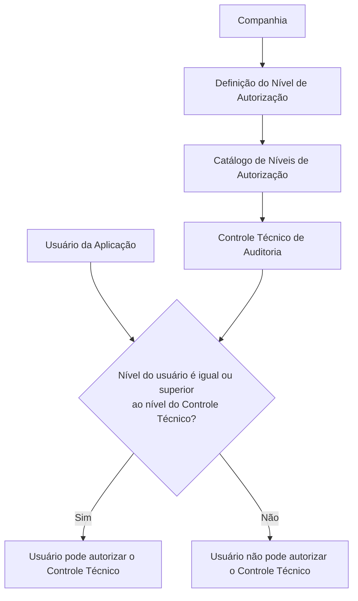

# Definição dos Níveis de Autorização dos Controles Técnicos

## 1. Metadados do Documento
- **Arquivo de Origem:** Não identificado no conteúdo fornecido
- **Tipo de Documento:** Especificação Técnica / Documentação Funcional
- **Domínio / Sistema:** Reef / Controles Técnicos de Auditoria / MAPFRE
- **Público-Alvo:** Desenvolvedores, Arquitetos, Operação, Auditoria e Negócio
- **Data/Versão Identificada:** Não identificada

---

## 2. Resumo Executivo & Contexto de Negócio

O documento define o conceito de níveis de autorização associados aos Controles Técnicos no núcleo do sistema Reef. A aplicação permite codificar níveis de autorização tanto para os próprios Controles Técnicos quanto para os usuários da aplicação.

Para autorizar um Controle Técnico de Auditoria, é obrigatório atribuir previamente ao controle um código de nível de autorização existente na aplicação. O usuário que realizar a autorização deve possuir um nível de autorização igual ou superior ao nível associado ao Controle Técnico de Auditoria.

O catálogo ou repositório de níveis de autorização é entregue inicialmente vazio às instalações. Portanto, a organização deve cadastrar os níveis de autorização aplicáveis antes de utilizar o mecanismo de autorização dos Controles Técnicos.

O documento descreve propriedades gerais para a definição de um nível de autorização: companhia, chave do nível, descrição completa e descrição abreviada. Também referencia documentos funcionais relacionados, incluindo “Definición Controles Técnicos” e “Preguntas frecuentes”.

Tradicionalmente, as Entidades MAPFRE utilizam o intervalo de níveis `NIVEL0` até `NIVEL09`. O documento não especifica quais valores devem ser atribuídos a cada nível, nem detalha fluxos de cadastro, APIs, métodos HTTP, persistência de dados ou perfis específicos de usuários.

---

## 3. Arquitetura, Componentes & Tecnologias Envolvidas

Os componentes e conceitos explicitamente citados são:

- **Sistema Reef:** sistema cuja documentação contém a definição de níveis de autorização.
- **Núcleo do Sistema:** componente funcional que permite codificar níveis de autorização.
- **Controles Técnicos:** entidades às quais podem ser associados níveis de autorização.
- **Controles Técnicos de Auditoria:** controles que exigem atribuição de código de nível de autorização.
- **Usuários da aplicação:** entidades que devem possuir nível igual ou superior ao nível do controle para autorizá-lo.
- **Catálogo/Repositório de níveis de autorização:** repositório inicialmente vazio nas instalações.
- **Companhia:** propriedade que informa o código da companhia para a qual o nível é definido.
- **Documentação Reef / Mapfredocument:** referências presentes na interface de documentação.



> **Nota de Análise:** O documento descreve a regra de comparação entre o nível do usuário e o nível do Controle Técnico, mas não detalha a implementação técnica dessa validação, bancos de dados, interfaces, serviços, APIs ou integrações.

---

## 4. Regras de Negócio, Especificações Funcionais & Processos

### 4.1. Codificação de níveis de autorização

1. O núcleo do sistema possui capacidade para codificar possíveis níveis de autorização.
2. Os níveis de autorização podem ser associados aos Controles Técnicos.
3. Os níveis de autorização podem ser associados aos usuários da aplicação.
4. A definição de um nível de autorização deve considerar a companhia à qual a definição pertence.
5. Cada nível de autorização possui uma chave, uma descrição e uma descrição abreviada.

### 4.2. Regra de autorização de Controles Técnicos de Auditoria

1. Um Controle Técnico de Auditoria deve receber um código de nível de autorização.
2. O código atribuído ao Controle Técnico de Auditoria deve pertencer aos possíveis códigos de nível existentes na aplicação.
3. O usuário que pretende autorizar o Controle Técnico de Auditoria deve possuir um nível de autorização.
4. O nível de autorização do usuário deve ser igual ou superior ao nível de autorização atribuído ao Controle Técnico de Auditoria.
5. Caso o nível do usuário não seja igual ou superior ao nível do Controle Técnico de Auditoria, o documento estabelece implicitamente que o usuário não atende à condição necessária para realizar a autorização.

### 4.3. Inicialização do repositório

1. O repositório de informações sobre níveis de autorização é entregue inicialmente vazio às instalações.
2. A ausência inicial de conteúdo exige que os níveis aplicáveis sejam definidos ou carregados na instalação antes do uso operacional do mecanismo de autorização.

### 4.4. Intervalo tradicional de níveis

O documento informa que, tradicionalmente, as Entidades MAPFRE definiram o intervalo de níveis:

- `NIVEL0`
- `NIVEL1`
- `NIVEL2`
- `NIVEL3`
- `NIVEL4`
- `NIVEL5`
- `NIVEL6`
- `NIVEL7`
- `NIVEL8`
- `NIVEL9`

> **Nota de Análise:** O documento não informa o significado semântico, a hierarquia detalhada ou as responsabilidades associadas a cada código entre `NIVEL0` e `NIVEL09`. A regra explicitamente definida utiliza a relação “igual ou superior”.

---

## 5. Tabelas de Parâmetros, Ambientes e Estruturas de Dados

| Item / Parâmetro | Descrição / Função | Tipo / Valores / Formato | Ambiente / Observações |
| :--- | :--- | :--- | :--- |
| Companhia | Indica o código da companhia sobre a qual é realizada a definição do nível de autorização. | Código de companhia; formato não detalhado. | Propriedade geral da definição. |
| Nível de Autorização | Determina a chave do nível de autorização. | Chave/código; formato não detalhado. | Deve existir na aplicação para ser associado a um Controle Técnico de Auditoria. |
| Descrição do Nível de Autorização | Indica a descrição do nível de autorização. | Texto; tamanho e formato não detalhados. | Propriedade geral da definição. |
| Descrição Abreviada | Contém a abreviatura do nível de autorização capturado no sistema. | Texto abreviado; formato não detalhado. | Propriedade geral da definição. |
| Controle Técnico de Auditoria | Controle que requer a atribuição de um código de nível de autorização. | Entidade funcional; estrutura não detalhada. | O usuário autorizador deve ter nível igual ou superior. |
| Nível de autorização do usuário | Nível atribuído ao usuário da aplicação para permitir autorização de controles. | Código de nível; formato não detalhado. | Comparado com o nível do Controle Técnico de Auditoria. |
| Repositório de níveis de autorização | Repositório que armazena informações dos níveis de autorização. | Conteúdo inicialmente vazio. | Entregue vazio às instalações. |
| Intervalo tradicional MAPFRE | Faixa tradicional de níveis de autorização mencionada para Entidades MAPFRE. | `NIVEL0` a `NIVEL09`. | O documento não define a semântica individual de cada nível. |
| Documentação relacionada | Relação de diretrizes e documentos funcionais cuja leitura é recomendada. | “Definición Controles Técnicos” e “Preguntas frecuentes”. | A leitura é recomendada para evitar interpretação isolada incorreta. |
| Owner | Proprietário exibido na documentação Reef. | `user:agonzalez_mapfre.com` | Informação apresentada no conteúdo bruto. |
| Lifecycle | Estado de ciclo de vida exibido na documentação. | `Approved Source` | Não há detalhamento adicional sobre o significado operacional. |

---

## 6. Bateria de Perguntas & Respostas para RAG (FAQ Sintético)

### P1: Qual é a finalidade dos níveis de autorização no sistema Reef?
**R:** Os níveis de autorização permitem codificar níveis associados aos Controles Técnicos e aos usuários da aplicação. Para Controles Técnicos de Auditoria, o nível do usuário é usado para verificar se o usuário está habilitado a realizar a autorização.

### P2: Qual condição um usuário deve atender para autorizar um Controle Técnico de Auditoria?
**R:** O usuário deve possuir um nível de autorização igual ou superior ao código de nível de autorização associado ao Controle Técnico de Auditoria que pretende autorizar.

### P3: É obrigatório atribuir nível de autorização a um Controle Técnico de Auditoria?
**R:** Sim. O documento estabelece que é necessário atribuir aos Controles Técnicos de Auditoria um código de nível de autorização entre os códigos de níveis existentes na aplicação.

### P4: O que acontece se o nível de autorização do usuário for inferior ao nível do Controle Técnico de Auditoria?
**R:** O usuário não atende à condição definida para autorizar o Controle Técnico de Auditoria, pois o documento exige nível igual ou superior ao nível atribuído ao controle.

### P5: O repositório de níveis de autorização já contém dados quando é entregue à instalação?
**R:** Não. O documento informa que o repositório de informações é entregue inicialmente vazio de conteúdo às instalações.

### P6: Quais propriedades gerais compõem a definição de um nível de autorização?
**R:** A definição possui as propriedades Companhia, Nível de Autorização, Descrição do Nível de Autorização e Descrição Abreviada.

### P7: Qual é a função da propriedade Companhia na definição do nível de autorização?
**R:** A propriedade Companhia informa ao sistema o código da companhia sobre a qual está sendo realizada a definição do nível de autorização.

### P8: O que representa a propriedade Nível de Autorização?
**R:** A propriedade Nível de Autorização determina a chave do nível de autorização.

### P9: Quais níveis de autorização são tradicionalmente definidos nas Entidades MAPFRE?
**R:** O documento informa que as Entidades MAPFRE tradicionalmente definiram o intervalo de níveis entre `NIVEL0` e `NIVEL09`.

### P10: O documento explica o significado operacional de cada nível entre NIVEL0 e NIVEL09?
**R:** Não. O documento somente informa o intervalo tradicional de níveis. Não há descrição das permissões, responsabilidades ou critérios específicos associados a cada código.

### P11: Quais documentos funcionais relacionados devem ser consultados para evitar interpretação isolada incorreta?
**R:** O documento recomenda a consulta às diretrizes e documentos funcionais relacionados, incluindo “Definición Controles Técnicos” e “Preguntas frecuentes”.

### P12: O documento especifica APIs, métodos HTTP ou contratos JSON para os níveis de autorização?
**R:** Não. O documento descreve regras funcionais e propriedades gerais, mas não detalha APIs, métodos HTTP, contratos JSON, modelos de persistência ou integrações técnicas.

---

## 7. Glossário de Termos, Siglas & Conceitos-Chave

- **Controle Técnico:** Entidade do sistema à qual podem ser associados níveis de autorização.
- **Controle Técnico de Auditoria:** Controle Técnico que exige atribuição de um código de nível de autorização para ser autorizado por um usuário habilitado.
- **Nível de Autorização:** Código ou chave que representa um nível usado na validação de autorização de Controles Técnicos.
- **Companhia:** Código da companhia sobre a qual se realiza a definição de um nível de autorização.
- **Descrição do Nível de Autorização:** Texto descritivo associado ao nível de autorização.
- **Descrição Abreviada:** Abreviatura do nível de autorização capturado no sistema.
- **Reef:** Nome do sistema ou repositório de documentação mencionado no documento.
- **MAPFRE:** Organização ou entidade corporativa mencionada como referência para o intervalo tradicional de níveis.
- **NIVEL0 a NIVEL09:** Intervalo tradicional de códigos de nível de autorização mencionado para Entidades MAPFRE.
- **Lifecycle — Approved Source:** Estado exibido na documentação; o documento não fornece definição adicional para esse estado.

---

## 8. Notas Críticas, Riscos & Limitações

- O repositório de níveis de autorização é entregue inicialmente sem conteúdo; a ausência de cadastro de níveis pode impedir a configuração operacional da autorização de Controles Técnicos de Auditoria.
- O documento não especifica a escala de precedência detalhada entre `NIVEL0` e `NIVEL09`; apenas estabelece que a autorização exige nível de usuário igual ou superior ao nível do controle.
- Não há detalhamento sobre mecanismos técnicos de validação, banco de dados, telas, permissões, APIs, serviços, eventos ou integrações.
- Não são definidos formatos, tamanhos, obrigatoriedade individual ou regras de unicidade para Companhia, Nível de Autorização, Descrição e Descrição Abreviada.
- O documento recomenda a leitura de “Definición Controles Técnicos” e “Preguntas frecuentes”, indicando que sua interpretação isolada pode conduzir a erro.
- Não há versões, datas de publicação, responsáveis funcionais além do campo `Owner`, ou critérios de aprovação descritos no conteúdo fornecido.

---

## 9. Conteúdo Bruto Estruturado (Referência Fiel)

```text
--- [PÁGINA 1 DE 2] ---

DEFINICIÓN de los NIVELES de AUTORIZACIÓN de los Controles
Técnicos
Funcionalmente, el núcleo del Sistema cuenta con la posibilidad de codicar los posibles niveles de autorización que van a tener asociados
los propios Controles Técnicos y los usuarios de la aplicación.
En el caso de los controles técnicos de Auditoría es necesario asignarles un código de nivel de autorización, dentro de los posibles códigos
de niveles existentes en la aplicación, lo cual implica que el Usuario que pretenda autorizarlo ha de tener asignado un nivel de autorización
igual o superior al del control técnico para poder realizarlo.
Este repositorio de información se entrega inicialmente a las instalaciones vacío de contenido.
Propiedades Generales
Propiedades Generales
Compañía
Esta propiedad le indica al sistema el código de la compañía sobre la que se está realizando la denición del Nivel de Autorización.
Nivel de Autorización
Esta propiedad determina la clave del Nivel de Autorización.
Descripción del Nivel de Autorización
Esta propiedad indica la descripción del Nivel de Autorización.
Descripción Abreviada
Esta propiedad contiene la abreviatura del Nivel de Autorización que se está capturando en el Sistema.
Vínculos
Relación de Directrices y Documentos funcionales cuya lectura recomendada para evitar que la interpretación aislada del presente
documento pueda conducir a error.
Denición Controles Técnicos
Preguntas frecuentes
(1) ¿Existe alguna circunstancia operativa que deba ser tomada en consideración sobre este catálogo?
Documentation / DOCUMENTACIÓN Reef
DOCUMENTACIÓN Reef
Mapfredocument
DOCUMENTACIÓN Reef
Owner
user:agonzalez_mapfre.com
Lifecycle
Approved Source
 /
VL
Buscar Inicio Soluciones Arquitecturas APIs Componentes Cloud Documentación Zeus Reef Ayuda
ES

--- [PÁGINA 2 DE 2] ---

Tradicionalmente se han denido en las Entidades MAPFRE el rango de niveles: NIVEL0 al NIVEL09
```
