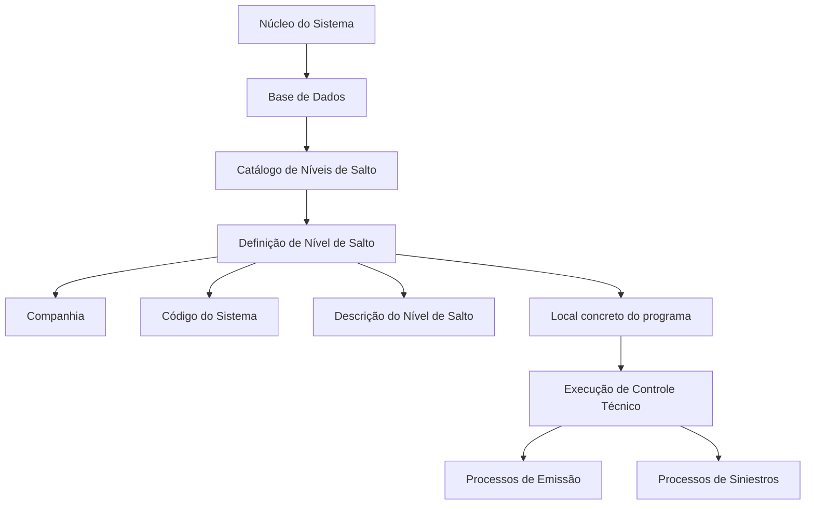
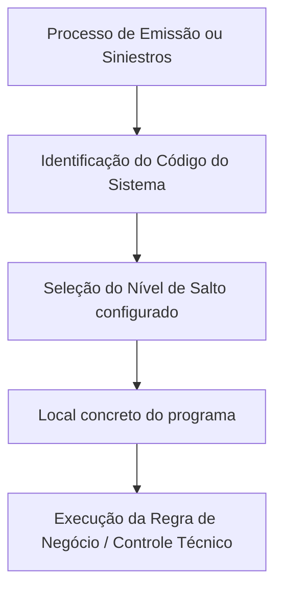

# Catálogo de Níveis de Salto dos Controles Técnicos — Reef.core

## 1. Metadados do Documento
- **Arquivo de Origem:** Nome não identificado no conteúdo fornecido
- **Tipo de Documento:** Especificação Técnica
- **Domínio / Sistema:** Reef.core / Controles Técnicos para Emissão e Siniestros
- **Público-Alvo:** Desenvolvedores, Arquitetos, Operação e Analistas Funcionais
- **Data/Versão Identificada:** Não identificada
- **Status identificado:** `Lifecycle: Approved`
- **Proprietário identificado:** `user:agonzalez_mapfre.com`

---

## 2. Resumo Executivo & Contexto de Negócio

O documento define o catálogo de **Níveis de Salto** dos Controles Técnicos no núcleo do sistema. Um Nível de Salto representa um possível ponto — também denominado “sitio” — no qual uma regra de negócio ou Controle Técnico pode ser executado durante os processos de **Emissão** e **Siniestros**.

Os Níveis de Salto são armazenados em Base de Dados e entregues inicialmente às instalações com conteúdo pré-configurado. Cada definição está associada a uma Companhia, a um Código do Sistema, a um número de Nível de Salto e a uma descrição funcional do ponto de execução.

O catálogo apresentado contempla pontos de execução para os sistemas identificados pelos códigos **2**, **3**, **5** e **7**. O sistema 2 concentra níveis relacionados a apólices, riscos, coberturas, resseguro, emissão, inspeções, comissões e reabilitação de intervenções de risco. O sistema 7 reúne níveis vinculados à identificação, tratamento, reabilitação, encerramento e faturamento de sinistros e expedientes.

A principal restrição operacional é explícita: **o conteúdo do catálogo não deve ser modificado**. Portanto, qualquer equipe que utilize os Níveis de Salto deve tratá-los como uma configuração de referência pré-configurada, sem alterações diretas no conteúdo listado.

---

## 3. Arquitetura, Componentes & Tecnologias Envolvidas

O conteúdo não detalha microsserviços, métodos HTTP, contratos de integração, tecnologias de implementação, URLs de ambiente, servidores ou mecanismos de persistência além de mencionar que os Níveis de Salto ficam armazenados em uma **Base de Dados**.

Os componentes conceituais identificados são:

| Componente / Conceito | Descrição baseada no documento |
| :--- | :--- |
| Núcleo do Sistema | Componente que possui a facilidade de armazenar em Base de Dados os possíveis sítios ou Níveis de Salto. |
| Base de Dados | Repositório onde os possíveis Níveis de Salto para execução dos Controles Técnicos são armazenados. |
| Catálogo de Níveis de Salto | Repositório de informação entregue inicialmente às instalações com conteúdo pré-configurado. |
| Controle Técnico | Regra ou controle executado em um local concreto do programa, determinado pelo Nível de Salto. |
| Processos de Emissão | Processo corporativo no qual Controles Técnicos podem ser executados em Níveis de Salto configurados. |
| Processos de Siniestros | Processo corporativo no qual Controles Técnicos podem ser executados em Níveis de Salto configurados. |
| Companhia | Propriedade que identifica o código da companhia sobre a qual é definida a configuração do Nível de Salto. |
| Código do Sistema | Propriedade que identifica o sistema ao qual pertence o local de salto do Controle Técnico. |



> **Nota de Análise:** O documento não detalha a arquitetura técnica interna do Reef.core, o modelo físico da Base de Dados, os métodos de execução dos Controles Técnicos, nem contratos de entrada e saída associados a cada Nível de Salto.

---

## 4. Regras de Negócio, Especificações Funcionais & Processos

### 4.1. Definição de Nível de Salto

1. O núcleo do sistema armazena em Base de Dados os possíveis “sitios”, também chamados de **Níveis de Salto**.
2. Um Nível de Salto define o local em que um Controle Técnico pode ser executado.
3. Os Controles Técnicos podem ser executados durante processos de **Emissão** e de **Siniestros**.
4. O repositório de Níveis de Salto é entregue inicialmente às instalações com conteúdo pré-configurado.
5. A definição de um Nível de Salto possui propriedades gerais: Companhia, Código do Sistema, Nível de Salto e Descrição do Nível de Salto.

### 4.2. Propriedades Gerais

| Propriedade | Regra / Significado funcional |
| :--- | :--- |
| Companhia | Indica o código da companhia sobre a qual está sendo realizada a definição do Nível de Salto do Controle Técnico. |
| Código do Sistema | Indica o código do sistema no qual está inscrito o local de salto do Controle Técnico. |
| Nível de Salto | Determina o local concreto do programa onde a regra de negócio é executada. |
| Descrição do Nível de Salto | Indica a descrição do Nível de Salto do Controle Técnico. |

### 4.3. Restrição Operacional

- **O conteúdo do catálogo não deve ser modificado.**
- O documento não apresenta exceções, fluxo de aprovação, mecanismo de versionamento ou procedimento operacional para alteração do catálogo.

### 4.4. Fluxo Funcional Inferido do Conteúdo



> **Nota de Análise:** O fluxo acima representa exclusivamente a relação conceitual descrita no documento. Não há detalhamento de critérios de seleção, ordem de execução, tratamento de erros, condições de ativação ou comportamento do Controle Técnico após sua execução.

---

## 5. Tabelas de Parâmetros, Ambientes e Estruturas de Dados

### 5.1. Estrutura lógica da definição de Nível de Salto

| Item / Parâmetro | Descrição / Função | Tipo / Valores / Formato | Ambiente / Observações |
| :--- | :--- | :--- | :--- |
| Companhia | Código da companhia sobre a qual é realizada a definição do Nível de Salto. | Código não especificado | Aplicável à definição do Controle Técnico. |
| Código do Sistema | Código do sistema ao qual pertence o local de salto. | Valores identificados: 2, 3, 5 e 7 | Determina a associação funcional do Nível de Salto. |
| Nível de Salto | Identificador do ponto concreto do programa no qual a regra de negócio é executada. | Numérico, conforme catálogo | Não são fornecidas regras de sequenciamento ou unicidade além da associação com o sistema. |
| Descrição do Nível de Salto | Denominação funcional do ponto de execução do Controle Técnico. | Texto | O documento apresenta denominações em espanhol. |
| Conteúdo do Catálogo | Conjunto pré-configurado de Níveis de Salto entregue às instalações. | Catálogo de referência | Não deve ser modificado. |
| Persistência | Armazenamento dos possíveis Níveis de Salto. | Base de Dados | Tecnologia e modelo de dados não especificados. |

### 5.2. Catálogo de Níveis de Salto — Sistema 2

| Item / Parâmetro | Descrição / Função | Tipo / Valores / Formato | Ambiente / Observações |
| :--- | :--- | :--- | :--- |
| Sistema | Código do Sistema | `2` | Associado aos níveis listados abaixo. |
| Nível de Salto | Dados fixos da apólice | `1` — `DATOS FIJOS PÓLIZA` | Conteúdo do catálogo não deve ser modificado. |
| Nível de Salto | Dados variáveis da apólice | `2` — `DATOS VARIABLES PÓLIZA` | Conteúdo do catálogo não deve ser modificado. |
| Nível de Salto | Terceiros | `3` — `TERCEROS` | Conteúdo do catálogo não deve ser modificado. |
| Nível de Salto | Dados variáveis do risco | `4` — `DATOS VARIABLES RIESGO` | Conteúdo do catálogo não deve ser modificado. |
| Nível de Salto | Dados variáveis agravantes | `5` — `DATOS VARIABLES AGRAVANTES` | Conteúdo do catálogo não deve ser modificado. |
| Nível de Salto | Coberturas | `6` — `COBERTURAS` | Conteúdo do catálogo não deve ser modificado. |
| Nível de Salto | Resseguro | `7` — `REASEGURO` | Conteúdo do catálogo não deve ser modificado. |
| Nível de Salto | Opções do menu | `8` — `OPCIONES DEL MENU` | Conteúdo do catálogo não deve ser modificado. |
| Nível de Salto | Validador de emissão | `9` — `VALIDADOR DE EMISIÓN` | Conteúdo do catálogo não deve ser modificado. |
| Nível de Salto | Seleção de riscos de vida | `10` — `SELECCIÓN RIESGOS VIDA` | Conteúdo do catálogo não deve ser modificado. |
| Nível de Salto | Inspeções | `11` — `INSPECCIONES/INSPECTIONS` | Conteúdo do catálogo não deve ser modificado. |
| Nível de Salto | Comissões | `12` — `COMISIONES` | Conteúdo do catálogo não deve ser modificado. |
| Nível de Salto | Reabilitação de intervenções de risco | `13` — `REHABILITACIÓN INTERVENCIONES RIESGO` | Conteúdo do catálogo não deve ser modificado. |

### 5.3. Catálogo de Níveis de Salto — Sistemas 3 e 5

| Item / Parâmetro | Descrição / Função | Tipo / Valores / Formato | Ambiente / Observações |
| :--- | :--- | :--- | :--- |
| Sistema | Código do Sistema | `3` | Associado a liquidações. |
| Nível de Salto | Dados fixos de liquidações | `1` — `DAT.FIJOS LIQUIDACIONES` | Conteúdo do catálogo não deve ser modificado. |
| Nível de Salto | Coberturas de liquidações | `2` — `COBERTURAS LIQUIDACIONES` | Conteúdo do catálogo não deve ser modificado. |
| Sistema | Código do Sistema | `5` | Associado a recibos. |
| Nível de Salto | Dados do recibo | `1` — `DATOS DEL RECIBO` | Conteúdo do catálogo não deve ser modificado. |

### 5.4. Catálogo de Níveis de Salto — Sistema 7

| Item / Parâmetro | Descrição / Função | Tipo / Valores / Formato | Ambiente / Observações |
| :--- | :--- | :--- | :--- |
| Sistema | Código do Sistema | `7` | Associado a siniestros e expedientes. |
| Nível de Salto | Identificação do siniestro | `1` — `IDENTIFICACIÓN DEL SINIESTRO` | Conteúdo do catálogo não deve ser modificado. |
| Nível de Salto | Dados do siniestro | `2` — `DATOS SINIESTRO` | Conteúdo do catálogo não deve ser modificado. |
| Nível de Salto | Causas e consequências do siniestro | `3` — `CAUSAS CONSECUENCIAS SINIESTRO` | Conteúdo do catálogo não deve ser modificado. |
| Nível de Salto | Dados complementares do siniestro | `4` — `DATOS COMPLEMENTARIOS SINIESTRO` | Conteúdo do catálogo não deve ser modificado. |
| Nível de Salto | Dados fixos do expediente | `5` — `DATOS FIJOS DEL EXPEDIENTE` | Conteúdo do catálogo não deve ser modificado. |
| Nível de Salto | Coberturas do expediente | `6` — `COBERTURAS DEL EXPEDIENTE` | Conteúdo do catálogo não deve ser modificado. |
| Nível de Salto | Encerramento de expedientes | `7` — `TERMINACIÓN DE EXPEDIENTES` | Conteúdo do catálogo não deve ser modificado. |
| Nível de Salto | Reabilitação de sinistros | `8` — `REHABILITACIÓN DE SINIESTROS` | Conteúdo do catálogo não deve ser modificado. |
| Nível de Salto | Reabilitação de expedientes | `9` — `REHABILITACIÓN DE EXPEDIENTES` | Conteúdo do catálogo não deve ser modificado. |
| Nível de Salto | Inclusão de faturamento | `10` — `ALTA FACTURACIÓN` | Conteúdo do catálogo não deve ser modificado. |
| Nível de Salto | Alteração de avaliação no faturamento | `11` — `CAMBIO VALORACIÓN EN LA FACTURACIÓN` | Conteúdo do catálogo não deve ser modificado. |
| Nível de Salto | Planos de renda | `12` — `PLANES DE RENTA` | Conteúdo do catálogo não deve ser modificado. |

---

## 6. Bateria de Perguntas & Respostas para RAG (FAQ Sintético)

### P1: O que é um Nível de Salto no contexto dos Controles Técnicos do Reef.core?
**R:** Um Nível de Salto é um possível “sitio” ou local concreto do programa no qual uma regra de negócio, denominada Controle Técnico, pode ser executada. Os Níveis de Salto são armazenados em Base de Dados e podem ser utilizados durante processos de Emissão e Siniestros.

### P2: Onde os Níveis de Salto dos Controles Técnicos são armazenados?
**R:** O documento informa que o núcleo do sistema possui a facilidade de armazenar em uma Base de Dados os possíveis sítios, também denominados Níveis de Salto, nos quais os Controles Técnicos podem ser executados.

### P3: O catálogo de Níveis de Salto pode ser modificado pelas instalações?
**R:** Não. A seção de perguntas frequentes estabelece explicitamente que o conteúdo do catálogo não deve ser modificado. O catálogo é entregue inicialmente às instalações com conteúdo pré-configurado.

### P4: Quais propriedades compõem a definição de um Nível de Salto?
**R:** A definição possui as propriedades Companhia, Código do Sistema, Nível de Salto e Descrição do Nível de Salto. A Companhia identifica o código da companhia; o Código do Sistema identifica o sistema associado; o Nível de Salto determina o ponto concreto de execução; e a Descrição identifica funcionalmente esse ponto.

### P5: Qual Nível de Salto do sistema 2 corresponde ao validador de emissão?
**R:** No sistema `2`, o Nível de Salto `9` possui a denominação `VALIDADOR DE EMISIÓN`. O documento não detalha quais validações são executadas nesse ponto.

### P6: Qual é o Nível de Salto de coberturas no sistema 2?
**R:** No sistema `2`, o Nível de Salto `6` corresponde a `COBERTURAS`. Esse ponto integra o catálogo pré-configurado e não deve ser modificado.

### P7: Quais Níveis de Salto do sistema 7 tratam da reabilitação?
**R:** O sistema `7` possui o Nível de Salto `8`, denominado `REHABILITACIÓN DE SINIESTROS`, e o Nível de Salto `9`, denominado `REHABILITACIÓN DE EXPEDIENTES`.

### P8: Qual ponto do sistema 7 corresponde ao encerramento de expedientes?
**R:** O encerramento de expedientes está associado ao sistema `7`, Nível de Salto `7`, com a denominação `TERMINACIÓN DE EXPEDIENTES`.

### P9: Quais Níveis de Salto estão associados a liquidações?
**R:** O sistema `3` contém dois Níveis de Salto relacionados a liquidações: Nível `1`, `DAT.FIJOS LIQUIDACIONES`, e Nível `2`, `COBERTURAS LIQUIDACIONES`.

### P10: Qual Nível de Salto está associado aos dados do recibo?
**R:** O sistema `5` possui o Nível de Salto `1`, denominado `DATOS DEL RECIBO`.

### P11: O documento especifica quais métodos, APIs ou contratos JSON são expostos pelos Controles Técnicos?
**R:** Não. O documento descreve somente o catálogo de pontos de execução dos Controles Técnicos. Não há detalhamento de métodos HTTP, APIs, contratos JSON, tecnologias de implementação ou interfaces de integração.

### P12: Qual Nível de Salto do sistema 2 trata de inspeções?
**R:** No sistema `2`, o Nível de Salto `11` é denominado `INSPECCIONES/INSPECTIONS`. O documento não fornece regras adicionais sobre o comportamento de inspeções nesse ponto.

---

## 7. Glossário de Termos, Siglas & Conceitos-Chave

- **Base de Dados:** Repositório no qual o núcleo do sistema armazena os possíveis Níveis de Salto.
- **Código do Sistema:** Propriedade que identifica o sistema no qual está inscrito o local de salto do Controle Técnico.
- **Companhia:** Propriedade que identifica o código da companhia associada à definição do Nível de Salto.
- **Controle Técnico:** Controle ou regra de negócio executada em um local concreto do programa.
- **Emisión:** Processo de emissão mencionado como contexto para execução de Controles Técnicos.
- **Expediente:** Termo usado nos Níveis de Salto do sistema 7, incluindo dados fixos, coberturas, encerramento e reabilitação de expedientes.
- **Nível de Salto:** Local concreto do programa onde uma regra de negócio é executada; também denominado “sitio”.
- **Reef.core:** Sistema citado como possuidor dos Níveis de Salto atualmente configurados.
- **Reaseguro:** Denominação do Nível de Salto `7` do sistema `2`.
- **Siniestro / Siniestros:** Processo e contexto funcional associado aos Níveis de Salto do sistema 7.
- **Sitio:** Termo utilizado no documento como sinônimo de Nível de Salto.

---

## 8. Notas Críticas, Riscos & Limitações

- O documento determina que o conteúdo do catálogo de Níveis de Salto **não deve ser modificado**.
- Não há descrição de procedimento autorizado para criação, alteração, exclusão, aprovação ou versionamento de Níveis de Salto.
- Não há especificação de chaves de Base de Dados, modelo de tabelas, tipos de dados, índices ou relacionamentos físicos.
- Não são descritos os métodos de execução, a sequência entre Níveis de Salto, as condições de ativação ou os resultados esperados de cada Controle Técnico.
- Não há definição de APIs, URLs, ambientes, servidores, portas, mecanismos de autenticação ou contratos de integração.
- O documento recomenda consultar as diretrizes e documentos funcionais vinculados para evitar interpretação isolada que possa conduzir a erro.
- **Nota de Análise:** O documento lista os sistemas `2`, `3`, `5` e `7`, mas não fornece a denominação completa de cada sistema além das descrições dos respectivos Níveis de Salto.

---

## 9. Conteúdo Bruto Estruturado (Referência Fiel)

```text
--- [PÁGINA 1 DE 3] ---

DEFINICIÓN de los NIVELES de SALTO de los Controles Técnicos
El núcleo del Sistema cuenta con la facilidad de tener almacenados en la Base de Datos los posibles 'sitios' (también denominados niveles de
salto) en los que se pueden ejecutar los Controles Técnicos durante la ejecución de los procesos de Emisión y Siniestros.
Este repositorio de información se entrega inicialmente a las instalaciones con su contenido pre congurado.
Propiedades Generales
Propiedades Generales
Compañía
Esta propiedad le indica al sistema el código de la compañía sobre la que se está realizando la denición del Nivel de Salto del control
técnico.
Código del Sistema
Esta propiedad indica el código del Sistema en el que se inscribe el lugar de salto del control técnico.
Nivel de Salto
Este atributo determina el lugar concreto del programa en donde se ejecuta la regla de negocio.
Descripción del Nivel de Salto
Esta propiedad indica la descripción del Nivel de Salto del Control Técnico.
Los valores de los Niveles actualmente congurados en Reef.core y de acuerdo con el Sistema al que están asociados son:
SISTEMA NIVEL DE SALTO DENOMINACIÓN NIVEL DE SALTO
2 1 DATOS FIJOS PÓLIZA
2 2 DATOS VARIABLES PÓLIZA
2 3 TERCEROS
2 4 DATOS VARIABLES RIESGO
2 5 DATOS VARIABLES AGRAVANTES
Documentation / DOCUMENTACIÓN Reef
DOCUMENTACIÓN Reef
Mapfredocument
DOCUMENTACIÓN Reef
Owner
user:agonzalez_mapfre.com
Lifecycle
Approved Source
 / 
 VL
Buscar Inicio Soluciones Arquitecturas APIs Componentes Cloud Documentación Zeus Reef Ayuda
ES


--- [PÁGINA 2 DE 3] ---

SISTEMA NIVEL DE SALTO DENOMINACIÓN NIVEL DE SALTO
2 6 COBERTURAS
2 7 REASEGURO
2 8 OPCIONES DEL MENU
2 9 VALIDADOR DE EMISIÓN
2 10 SELECCIÓN RIESGOS VIDA
2 11 INSPECCIONES/INSPECTIONS
2 12 COMISIONES
2 13 REHABILITACIÓN INTERVENCIONES RIESGO
3 1 DAT.FIJOS LIQUIDACIONES
3 2 COBERTURAS LIQUIDACIONES
5 1 DATOS DEL RECIBO
7 1 IDENTIFICACIÓN DEL SINIESTRO
7 2 DATOS SINIESTRO
7 3 CAUSAS CONSECUENCIAS SINIESTRO
7 4 DATOS COMPLEMENTARIOS SINIESTRO
7 5 DATOS FIJOS DEL EXPEDIENTE
7 6 COBERTURAS DEL EXPEDIENTE
7 7 TERMINACIÓN DE EXPEDIENTES
7 8 REHABILITACIÓN DE SINIESTROS
7 9 REHABILITACIÓN DE EXPEDIENTES
7 10 ALTA FACTURACIÓN
7 11 CAMBIO VALORACIÓN EN LA FACTURACIÓN
7 12 PLANES DE RENTA
Vínculos
Relación de Directrices y Documentos funcionales cuya lectura recomendada para evitar que la interpretación aislada del presente
documento pueda conducir a error.
Sistemas de la Aplicación


--- [PÁGINA 3 DE 3] ---

Preguntas frecuentes
(1) ¿Existe alguna circunstancia operativa que deba ser tomada en consideración sobre este catálogo?
No debe modicarse su contenido.
```
