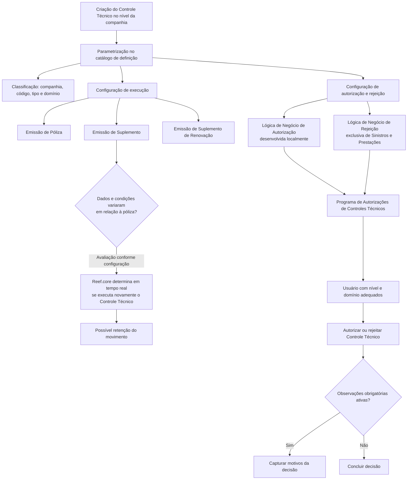

# Definição Operativa dos Controles Técnicos no Reef.core

## 1. Metadados do Documento
- **Arquivo de Origem:** Não informado; conteúdo identificado como `DOCUMENTACIÓN Reef`
- **Tipo de Documento:** Especificação Técnica
- **Domínio / Sistema:** Reef.core — Controles Técnicos, Emissão de Pólizas, Suplementos, Renovações, Gestão de Sinistros e Prestações
- **Público-Alvo:** Desenvolvedores, Arquitetos, Operação, Tecnologia local e Direção Técnica de Sinistros
- **Data/Versão Identificada:** Não identificada

---

## 2. Resumo Executivo & Contexto de Negócio

O documento descreve a definição operativa de **Controles Técnicos** no sistema **Reef.core**. Depois que os Controles Técnicos são criados no nível da companhia, devem ser parametrizadas propriedades que os classificam e modulam seu comportamento operacional nos processos de Emissão e de Sinistros.

As propriedades gerais definem o escopo organizacional do Controle Técnico, a sua identificação, a tipologia corporativa e condições de execução em Pólizas, Suplementos e Suplementos de Renovação. Determinados valores são definidos corporativamente e não podem ser ampliados localmente no sistema.

O documento também descreve regras para autorização e rejeição de Controles Técnicos. A lógica de negócio de autorização e a lógica de negócio de rejeição dependem de componentes de software desenvolvidos pela Direção de Tecnologia local, de acordo com critérios definidos pela entidade e, no caso de rejeição, pela Direção Técnica de Sinistros.

A configuração pode exigir a captura obrigatória das observações que justificam a autorização ou rejeição de um Controle Técnico. Também existe uma propriedade de Estrutura Detalhe que está descontinuada no núcleo do sistema e não deve ser utilizada nem reutilizada para propósitos locais.

Como boa prática, a codificação dos Controles Técnicos deve permitir sua identificação e agrupamento conforme os processos nos quais serão executados. O documento recomenda a leitura complementar de materiais sobre Controles Técnicos, Níveis de Autorização e Perguntas Frequentes.

---

## 3. Arquitetura, Componentes & Tecnologias Envolvidas

| Componente / Conceito | Papel identificado no documento |
| :--- | :--- |
| **Reef.core** | Sistema que interpreta a configuração do Controle Técnico e determina sua execução em processos de emissão, suplementos e renovações. |
| **Catálogo de definição do Controle Técnico** | Local de parametrização das propriedades operativas, de classificação, execução, autorização e rejeição. |
| **Controle Técnico** | Elemento configurável que pode ser executado, autorizado ou rejeitado conforme regras, processos e permissões definidas. |
| **Programa de Autorizações de Controles Técnicos** | Programa no qual o usuário autoriza ou rejeita Controles Técnicos e, quando configurado, informa obrigatoriamente os motivos da decisão. |
| **Componente de Lógica de Negócio de Autorização** | Componente desenvolvido pela Direção de Tecnologia local para avaliar se o Controle Técnico pode ser autorizado. |
| **Componente de Lógica de Negócio de Rejeição** | Componente desenvolvido pela Direção de Tecnologia local para avaliar se o Controle Técnico pode ser rejeitado; aplicável exclusivamente à Gestão de Sinistros e Prestações. |
| **Equipe local de Tecnologia** | Responsável por considerar a funcionalidade de avaliação de condições em suplementos e por desenvolver, implementar e nomear componentes locais de autorização e rejeição. |
| **Direção Técnica de Sinistros** | Define critérios que podem ser considerados pela lógica de negócio de rejeição. |
| **Sistema de Autorização / Departamento da companhia** | Determina o departamento autorizado a aprovar ou rejeitar determinado Controle Técnico. |



**Nota de Análise:** O documento não detalha tecnologias de implementação, métodos HTTP, contratos JSON, banco de dados, URLs, ambientes, servidores, versões de componentes ou interfaces de integração.

---

## 4. Regras de Negócio, Especificações Funcionais & Processos

### 4.1 Definição operativa e classificação

1. Os Controles Técnicos são criados inicialmente em nível de companhia.
2. Após a criação, propriedades devem ser parametrizadas para classificar o Controle Técnico e modular seu comportamento operacional nos processos de Emissão e Sinistros.
3. Cada Controle Técnico deve possuir um código identificador.
4. Cada Controle Técnico deve possuir uma tipologia para que o sistema possa gerenciá-lo adequadamente.
5. O valor do Tipo de Controle Técnico deve ser um dos valores definidos corporativamente.
6. Os valores disponíveis para o Tipo de Controle Técnico não podem ser ampliados no sistema.
7. O Domínio de Autorização também deve usar um dos valores definidos corporativamente.
8. Os valores disponíveis para o Domínio de Autorização não podem ser ampliados no sistema.

### 4.2 Regras de execução por processo

1. Quando a propriedade **Se executa em Pólizas** está ativada na definição do Controle Técnico, o Reef.core interpreta que o Controle Técnico deve ser executado na emissão da Póliza.
2. Quando a propriedade **Se executa em Suplementos** está ativada no catálogo de definição, o Reef.core interpreta que o Controle Técnico deve ser executado especificamente nos suplementos da apólice.
3. Quando a propriedade **Se executa nas Renovações** está ativada na definição do Controle Técnico, o Reef.core interpreta que o Controle Técnico deve ser executado na emissão dos Suplementos de Renovação.
4. A propriedade **Avaliar Condições em Suplementos** permite que o Reef.core determine em tempo real se deve executar novamente um Controle Técnico em um suplemento.
5. A avaliação em suplementos considera se os dados e condições que provocaram a existência do Controle Técnico na emissão do suplemento variaram em relação aos dados e condições existentes previamente na apólice.
6. O resultado da avaliação pode determinar se o movimento fica retido.
7. A equipe local de Tecnologia deve considerar essa funcionalidade ao implementar a lógica de negócio ou o componente de software associado ao Controle Técnico.
8. A lógica ou componente associado deve gravar as condições de execução do Controle Técnico.

### 4.3 Regras de autorização

1. Para Controles Técnicos de Auditoria, a propriedade **Nível de Autorização** identifica o nível mínimo que deve estar associado ao usuário que pretende autorizar o Controle Técnico.
2. O **Domínio de Autorização** determina o domínio do sistema no qual o Controle Técnico está circunscrito, permitindo gerenciar sua aprovação corretamente.
3. O **Código do Sistema de Autorização** identifica o código do sistema, entendido como o departamento da companhia, que pode autorizar o Controle Técnico.
4. Um Controle Técnico cujo sistema ou departamento de autorização seja Reaseguro somente pode ser autorizado ou rejeitado por um papel e usuário cujo nível de autorização assim o determine.
5. A **Lógica de Negócio de Autorização** é avaliada pelo Reef.core por meio de componente de software desenvolvido pela Direção de Tecnologia local.
6. A Lógica de Negócio de Autorização avalia se o Controle Técnico pode ou não ser autorizado de acordo com os critérios determinados pela entidade.

### 4.4 Regras de rejeição

1. A **Lógica de Negócio de Rejeição** permite avaliar se o Controle Técnico pode ou não ser rejeitado.
2. Os critérios de rejeição são determinados pela Direção Técnica de Sinistros.
3. A Lógica de Negócio de Rejeição aplica-se exclusivamente ao processo de Gestão de Sinistros e Prestações.
4. O desenvolvimento, a implementação e a nomenclatura da propriedade de Lógica de Negócio de Rejeição são responsabilidade da equipe local de Tecnologia.
5. A propriedade **Ação em caso de Rejeição** somente se aplica quando a operação está sendo executada em modo on-line.
6. Em modo on-line, a Ação em caso de Rejeição determina qual ação deve ser seguida.
7. Os possíveis valores para a Ação em caso de Rejeição são definidos corporativamente.

### 4.5 Observações e propriedade obsoleta

1. Quando a propriedade **Observações Obrigatórias** está ativa na configuração detalhada do Controle Técnico, o Programa de Autorizações de Controles Técnicos deve obrigar a captura do motivo ou dos motivos pelos quais um usuário autoriza ou rejeita o Controle Técnico.
2. A funcionalidade da propriedade **Estrutura Detalhe** está descontinuada no núcleo do sistema.
3. A propriedade Estrutura Detalhe não deve ser usada nem reutilizada para qualquer propósito local, pois é uma propriedade obsoleta.
4. Originalmente, a Estrutura Detalhe permitia executar, a partir do Programa de Autorizações de Controles Técnicos, uma chamada a uma estrutura de informação que detalhava e complementava o motivo de autorização ou rejeição pelo usuário.

### 4.6 Boa prática de codificação

- Recomenda-se que os Controles Técnicos sejam codificados de forma a permitir sua identificação e agrupamento de acordo com os processos nos quais serão executados.

---

## 5. Tabelas de Parâmetros, Ambientes e Estruturas de Dados

| Item / Parâmetro | Descrição / Função | Tipo / Valores / Formato | Ambiente / Observações |
| :--- | :--- | :--- | :--- |
| Companhia | Indica o código da companhia na qual está sendo realizada a definição operativa do Controle Técnico. | Código da companhia; formato não detalhado. | Aplicável à definição operativa. |
| Código do Controle Técnico | Identifica o Controle Técnico. | Código; formato não detalhado. | Aplicável ao catálogo de definição. |
| Tipo de Controle Técnico | Identifica a tipologia do Controle Técnico para gestão adequada pelo sistema. | Um dos valores definidos corporativamente. | Os valores não podem ser ampliados no sistema. |
| Nível de Autorização | Define o nível mínimo associado ao usuário que pretende autorizar um Controle Técnico de Auditoria. | Nível de autorização; escala ou formato não detalhado. | Aplicável a Controles Técnicos de Auditoria. |
| Se executa em Pólizas | Indica que o Controle Técnico deve ser executado na emissão da Póliza. | Propriedade ativada ou desativada; valores exatos não detalhados. | Interpretada pelo Reef.core. |
| Se executa em Suplementos | Indica que o Controle Técnico deve ser executado especificamente nos suplementos da apólice. | Propriedade ativada ou desativada; valores exatos não detalhados. | Interpretada pelo Reef.core. |
| Se executa nas Renovações | Indica que o Controle Técnico deve ser executado na emissão de Suplementos de Renovação. | Propriedade ativada ou desativada; valores exatos não detalhados. | Interpretada pelo Reef.core. |
| Avaliar Condições em Suplementos | Permite determinar em tempo real se o Controle Técnico deve ser executado novamente em suplemento, com base na variação de dados e condições em relação à apólice. | Atributo de definição; valores exatos não detalhados. | A lógica associada deve gravar as condições de execução. |
| Lógica de Negócio de Autorização | Permite avaliar se o Controle Técnico pode ser autorizado segundo critérios determinados pela entidade. | Componente de software local; nome e contrato não detalhados. | Desenvolvido pela Direção de Tecnologia local; avaliado pelo Reef.core. |
| Lógica de Negócio de Rejeição | Permite avaliar se o Controle Técnico pode ser rejeitado segundo critérios definidos pela Direção Técnica de Sinistros. | Componente de software local; nome e contrato não detalhados. | Exclusivo da Gestão de Sinistros e Prestações; responsabilidade da equipe local de Tecnologia. |
| Ação em caso de Rejeição | Determina a ação a seguir após rejeição do Controle Técnico. | Um dos valores definidos corporativamente. | Aplicável somente quando a operação é executada em modo on-line. |
| Domínio de Autorização | Determina o domínio do sistema ao qual o Controle Técnico pertence para gerenciamento correto da aprovação. | Um dos valores definidos corporativamente. | Os valores não podem ser ampliados no sistema. |
| Código do Sistema de Autorização | Define o sistema, entendido como departamento da companhia, autorizado a aprovar o Controle Técnico. | Código de sistema/departamento; formato não detalhado. | Exemplo citado: Reaseguro. |
| Observações Obrigatórias | Exige a captura dos motivos da autorização ou rejeição no Programa de Autorizações de Controles Técnicos. | Propriedade ativada ou desativada; valores exatos não detalhados. | Aplicável à configuração detalhada do Controle Técnico. |
| Estrutura Detalhe | Propriedade anteriormente usada para chamar estrutura de informação complementar ao motivo de autorização ou rejeição. | Propriedade obsoleta. | Descontinuada no núcleo; não usar ou reutilizar localmente. |

**Ambientes, URLs, servidores e rotas de log:** não identificados no conteúdo fornecido.

---

## 6. Bateria de Perguntas & Respostas para RAG (FAQ Sintético)

### P1: Qual é o objetivo da definição operativa de um Controle Técnico no Reef.core?
**R:** A definição operativa parametriza propriedades que classificam o Controle Técnico e modulam seu comportamento nos processos de Emissão e de Sinistros. Essas propriedades incluem identificação, tipologia, execução em Pólizas, Suplementos e Renovações, além de regras de autorização e rejeição.

### P2: O Reef.core executa um Controle Técnico na emissão de uma Póliza?
**R:** Sim, quando a propriedade **Se executa em Pólizas** estiver ativada na definição do Controle Técnico. Nessa condição, o Reef.core interpreta que o Controle Técnico deve ser executado durante a emissão da Póliza.

### P3: Como configurar a execução de um Controle Técnico em suplementos?
**R:** A propriedade **Se executa em Suplementos** deve estar ativada no catálogo de definição. Quando ativa, o Reef.core interpreta que o Controle Técnico deve ser executado especificamente nos suplementos da apólice.

### P4: Qual é a função da propriedade Avaliar Condições em Suplementos?
**R:** Essa propriedade permite que o Reef.core determine em tempo real se precisa executar novamente o Controle Técnico em um suplemento. A avaliação considera se os dados e condições que originaram o controle no suplemento variaram em relação aos dados e condições previamente existentes na apólice; o resultado pode implicar a retenção do movimento.

### P5: O que a equipe local de Tecnologia precisa implementar para Avaliar Condições em Suplementos?
**R:** A equipe local de Tecnologia deve considerar essa funcionalidade na implementação da lógica de negócio ou do componente de software associado ao Controle Técnico. Essa implementação deve gravar as condições de execução do Controle Técnico.

### P6: Quem pode autorizar um Controle Técnico de Auditoria?
**R:** Para Controles Técnicos de Auditoria, o usuário que pretende autorizar deve ter associado pelo menos o nível mínimo definido na propriedade **Nível de Autorização**. O documento também estabelece que o domínio e o sistema de autorização podem restringir quem pode aprovar ou rejeitar o Controle Técnico.

### P7: Como funciona o Código do Sistema de Autorização?
**R:** O Código do Sistema de Autorização identifica o sistema, entendido como departamento da companhia, que pode autorizar o Controle Técnico. Por exemplo, quando o sistema ou departamento de autorização de um Controle Técnico é Reaseguro, a autorização ou rejeição somente pode ser feita por um papel e usuário cujo nível de autorização permita essa atuação.

### P8: Quem desenvolve a Lógica de Negócio de Autorização?
**R:** A Direção de Tecnologia local desenvolve o componente de software da Lógica de Negócio de Autorização. O Reef.core usa esse componente para avaliar se o Controle Técnico pode ser autorizado conforme os critérios determinados pela entidade.

### P9: Em quais processos a Lógica de Negócio de Rejeição pode ser aplicada?
**R:** A Lógica de Negócio de Rejeição é de aplicação exclusiva no processo de Gestão de Sinistros e Prestações. Ela avalia se um Controle Técnico pode ou não ser rejeitado segundo os critérios determinados pela Direção Técnica de Sinistros.

### P10: Quando a Ação em caso de Rejeição é aplicável?
**R:** A propriedade **Ação em caso de Rejeição** aplica-se unicamente quando a operação é executada em modo on-line. Nessa condição, ela determina a ação a ser seguida, usando um dos valores definidos corporativamente.

### P11: Quando o usuário precisa informar observações ao autorizar ou rejeitar um Controle Técnico?
**R:** O usuário deve informar o motivo ou os motivos da autorização ou rejeição quando a propriedade **Observações Obrigatórias** estiver ativada na configuração detalhada do Controle Técnico. A captura ocorre no Programa de Autorizações de Controles Técnicos.

### P12: A propriedade Estrutura Detalhe pode ser reutilizada em uma implementação local?
**R:** Não. A funcionalidade da propriedade **Estrutura Detalhe** está descontinuada no núcleo do sistema. O documento determina que ela não deve ser usada nem reutilizada para qualquer finalidade de âmbito local, pois é obsoleta.

### P13: É possível adicionar novos valores ao Tipo de Controle Técnico ou ao Domínio de Autorização?
**R:** Não. Tanto o Tipo de Controle Técnico quanto o Domínio de Autorização devem usar valores definidos corporativamente. O documento informa expressamente que os valores dessas propriedades não podem ser ampliados no sistema.

---

## 7. Glossário de Termos, Siglas & Conceitos-Chave

- **Reef.core:** Sistema que interpreta a configuração dos Controles Técnicos e gerencia sua execução em processos de emissão, suplementos e renovações.
- **Controle Técnico:** Elemento configurável que pode ser executado, autorizado ou rejeitado segundo propriedades, regras e permissões.
- **Póliza:** Processo ou entidade de emissão de apólice citado como contexto de execução de Controles Técnicos.
- **Suplemento:** Movimento associado à apólice no qual um Controle Técnico pode ser executado especificamente.
- **Suplemento de Renovação:** Suplemento emitido no processo de renovação, no qual o Controle Técnico pode ser executado quando configurado.
- **Gestão de Sinistros e Prestações:** Processo no qual a Lógica de Negócio de Rejeição é aplicável exclusivamente.
- **Nível de Autorização:** Nível mínimo que um usuário deve ter para autorizar Controles Técnicos de Auditoria.
- **Domínio de Autorização:** Domínio do sistema no qual o Controle Técnico está circunscrito para que sua aprovação seja gerenciada corretamente.
- **Sistema de Autorização:** Sistema entendido como departamento da companhia que pode autorizar ou rejeitar o Controle Técnico.
- **Reaseguro:** Exemplo de sistema ou departamento de autorização citado no documento.
- **Modo on-line:** Condição operacional necessária para aplicação da propriedade Ação em caso de Rejeição.
- **Estrutura Detalhe:** Propriedade obsoleta e descontinuada no núcleo do sistema.

---

## 8. Notas Críticas, Riscos & Limitações

- Os valores de **Tipo de Controle Técnico**, **Domínio de Autorização** e **Ação em caso de Rejeição** são definidos corporativamente; o documento não detalha quais são esses valores.
- O sistema não permite ampliar localmente os valores de Tipo de Controle Técnico e Domínio de Autorização.
- A Lógica de Negócio de Autorização depende de componente de software desenvolvido pela Direção de Tecnologia local.
- A Lógica de Negócio de Rejeição depende da equipe local de Tecnologia para desenvolvimento, implementação e nomenclatura, além de usar critérios definidos pela Direção Técnica de Sinistros.
- A Lógica de Negócio de Rejeição é restrita à Gestão de Sinistros e Prestações.
- A propriedade Ação em caso de Rejeição somente é aplicável a operações em modo on-line.
- A equipe local de Tecnologia deve garantir a gravação das condições de execução quando usar Avaliar Condições em Suplementos.
- A propriedade Estrutura Detalhe é obsoleta, está descontinuada no núcleo e não deve ser reutilizada.
- O documento não fornece detalhes de contratos de software, métodos de integração, estruturas de dados, formatos de códigos, tecnologias, servidores, URLs, ambientes, logs ou mecanismos de persistência.
- A leitura isolada do documento pode conduzir a erro; o próprio conteúdo recomenda consultar materiais sobre Controles Técnicos, Níveis de Autorização e Perguntas Frequentes.

---

## 9. Conteúdo Bruto Estruturado (Referência Fiel)

```text
--- [PÁGINA 1 DE 3] ---

DEFINICIÓN Operativa de los CONTROLES TÉCNICOS
Una vez creados los Controles Técnicos a nivel de compañía, se tienen que parametrizar una serie de propiedades que lo clasican y
operativamente modulan su comportamiento en los Procesos de Emisión y de Siniestros.
Propiedades Generales
Propiedades Generales
Compañía
Esta propiedad le indica al sistema el código de la compañía sobre la que se está realizando la denición Operativa del Control Técnico.
Código del Control Técnico
Esta propiedad indica el código del Control Técnico.
Tipo de Control Técnico
Por cada control técnico se debe identicar su tipología para que el Sistema pueda gestionarlo adecuadamente siendo su valor uno de los
denidos corporativamente.
NOTA: No es posible ampliar en el sistema los valores de esta propiedad.
Nivel de Autorización
En el caso de los controles técnicos de Auditoría, esta propiedad del catálogo identica el nivel mínimo que debe tener asociado cualquier
usuario que pretenda Autorizar el Control Técnico para poder realizarlo.
Se ejecuta en Pólizas
En el supuesto que este parámetro esté activado en la denición del control técnico, Reef.core interpreta que el control técnico se ha de
ejecutar en la emisión de la Póliza.
Se ejecuta en Suplementos
En el supuesto que esta propiedad esté activada en el catálogo de denición, Reef.core interpreta que el Control Técnico se debe ejecutar
especícamente en los suplementos de la póliza.
Se ejecuta en las Renovaciones
En el supuesto que este parámetro esté activado en la denición del control técnico, Reef.core interpreta que el control técnico se ha de
ejecutar en la emisión de los Suplementos de Renovación.
Documentation / DOCUMENTACIÓN Reef
DOCUMENTACIÓN Reef
Mapfredocument
DOCUMENTACIÓN Reef
Owner
user:agonzalez_mapfre.com
Lifecycle
Approved Source
 /
 VL
Buscar Inicio Soluciones Arquitecturas APIs Componentes Cloud Documentación Zeus Reef Ayuda
ES

--- [PÁGINA 2 DE 3] ---

Evaluar Condiciones en Suplementos
Si los datos y condiciones que provocan la existencia de un control técnico en la emisión de un suplemento no varían respecto de los datos y
condiciones previamente existentes en la póliza, con este atributo de la denición del control técnico se puede lograr que Reef.core
determine en tiempo real si se tiene o no que ejecutar nuevamente en el suplemento, es decir, si el resultado del control técnico implique que
el movimiento quede retenido.
Es necesario que el equipo local de Tecnología tenga presente la funcionalidad de este atributo en la implementación de la lógica de
negocio o componente software asociado al control técnico para que se graben las condiciones de su ejecución.
Lógica de Negocio de Autorización
Mediante el desarrollo por parte de la Dirección de Tecnología local de este componente software, Reef.core va a evaluar si se puede o no
autorizar el Control Técnico de acuerdo con los criterios que determine la entidad.
Lógica de Negocio de Rechazo
Mediante el desarrollo por parte de la Dirección de Tecnología local de este componente software, se puede evaluar si se puede o no
rechazar el Control Técnico de acuerdo con los criterios que determine la Dirección técnica de Siniestros.
Esta propiedad es de aplicación exclusiva en el proceso de Gestión de Siniestros y Prestaciones.
Al igual que con la lógica de negocio de autorización, es responsabilidad del equipo local de Tecnología del desarrollo, implementación y
nomenclatura de esta propiedad.
Acción en caso de Rechazo
Únicamente en el supuesto que la operación se esté ejecutando en modo on-line esta característica de los controles técnicos determina qué
acción se ha de seguir siendo sus posibles valores uno de los denidos corporativamente.
Dominio de Autorización
Con esta propiedad del catálogo, se determina el dominio del Sistema en el que se circunscribe el control técnico y poder así gestionar su
aprobación correctamente siendo su valor uno de los denidos corporativamente.
NOTA: No es posible ampliar en el sistema los valores de esta propiedad.
Código del Sistema de Autorización
Esta propiedad indica el código del sistema (entendido como Departamento de la compañía) que podrá autorizar el control técnico.
De esta manera un control técnico cuyo sistema o departamento de autorización indique que sea de Reaseguro solamente podrá ser
autorizado o rechazado por un rol y usuario cuyo nivel de autorización así lo determine.
Observaciones Obligatorias
La activación de esta propiedad en la conguración detallada del Control Técnico implica la obligatoriedad de capturar en el Programa de
Autorizaciones de Controles Técnicos el motivo o los motivos por los que un Usuario autoriza o rechaza el control técnico.
Estructura Detalle
La funcionalidad de esta propiedad está descontinuada en el núcleo del sistema por lo cual no debe usarse o reutilizarse para ningún
propósito de ámbito local al ser una propiedad obsoleta.
Originalmente la denición de esta propiedad permitía ejecutar desde el Programa de Autorizaciones de Controles Técnicos la llamada a
una estructura de información que posibilitaba detallar y complementar el motivo por el que el Usuario autorizaba o rechazaba el control
técnico.
Consejo:
Consejo:

--- [PÁGINA 3 DE 3] ---

Vínculos
Relación de Directrices y Documentos funcionales cuya lectura recomendada para evitar que la interpretación aislada del presente
documento pueda conducir a error.
Controles Técnicos
Niveles de Autorización
Preguntas frecuentes
(1) ¿Existe alguna circunstancia operativa que deba ser tomada en consideración sobre este catálogo?
Puede considerarse como una buena práctica en la codicación de los Controles Técnicos en este catálogo, el que se identiquen y agrupen
de acuerdo con los procesos sobre los que se van a ejecutar.
```
