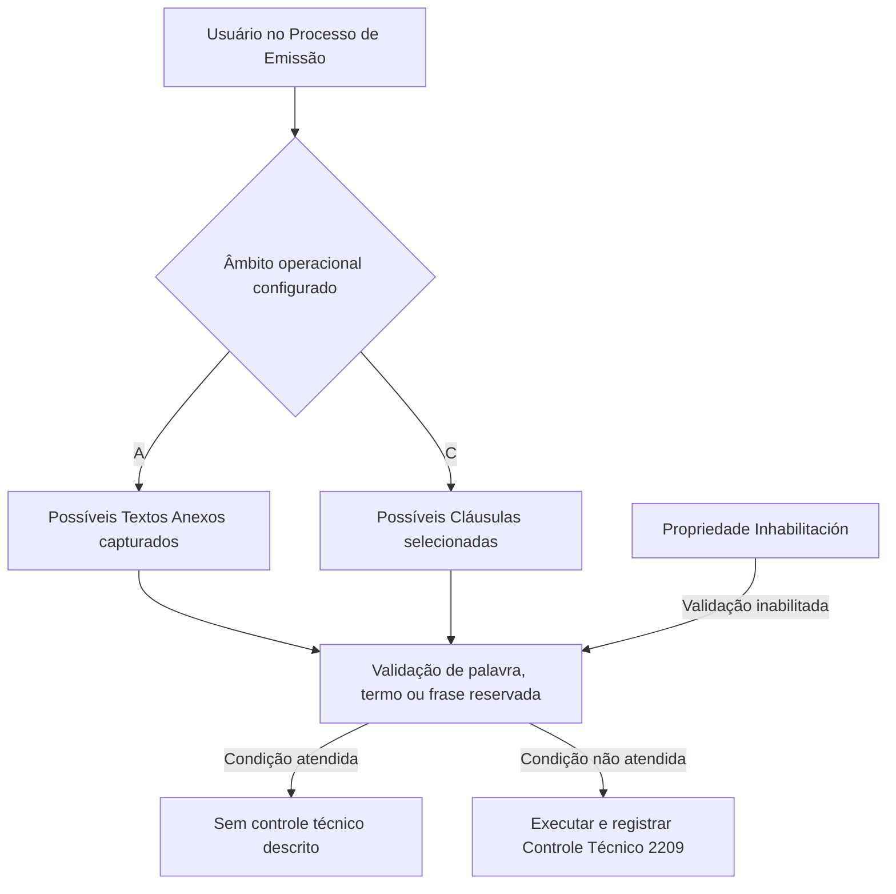

# Catálogo de Palavras, Termos e Frases Reservadas do REEF.CORE

## 1. Metadados do Documento
- **Arquivo de Origem:** `Não identificado`
- **Tipo de Documento:** `Especificação Técnica`
- **Domínio / Sistema:** `REEF.CORE — Ramos Técnicos de Caución e Crédito`
- **Público-Alvo:** `Usuários do Processo de Emissão e Direção de Administração e Finanças da entidade MAPFRE local`
- **Data/Versão Identificada:** `Não identificada`

---

## 2. Resumo Executivo & Contexto de Negócio

O documento define um catálogo do REEF.CORE destinado à identificação de palavras, termos e expressões reservadas. O catálogo é aplicável aos textos anexos e às cláusulas que usuários possam registrar ou selecionar durante o Processo de Emissão.

A aplicação está explicitamente restrita aos Ramos Técnicos pertencentes a Caución e Crédito. O objetivo operacional é garantir o uso obrigatório dos termos cadastrados no catálogo nos textos anexos ou cláusulas abrangidos pela configuração.

Quando a condição configurada no catálogo não é cumprida, o REEF.CORE executa e registra um controle técnico predefinido. O código do controle técnico utilizado para a validação é **2209**.

A configuração inicial do catálogo vem previamente estabelecida. A manutenção posterior deve ser realizada pela Direção de Administração e Finanças da entidade MAPFRE local.

---

## 3. Arquitetura, Componentes & Tecnologias Envolvidas

O documento cita o sistema **REEF.CORE**, o **Processo de Emissão**, textos anexos, cláusulas, usuários e a Direção de Administração e Finanças da entidade MAPFRE local.

Não há detalhamento de tecnologias, endpoints, métodos HTTP, contratos de integração, bancos de dados, ambientes, servidores ou componentes de infraestrutura.



> **Nota de Análise:** O documento não descreve o comportamento técnico preciso quando a propriedade **Inhabilitación** está habilitada, além de informar que a validação fica inabilitada para uso nos processos de verificação.

---

## 4. Regras de Negócio, Especificações Funcionais & Processos

### Objetivo do catálogo

- O REEF.CORE possui um catálogo de definição para identificar palavras, termos ou expressões.
- As palavras, termos ou expressões definidos no catálogo devem ser empregados obrigatoriamente:
  - nos textos anexos que usuários registrem; ou
  - nas cláusulas que usuários selecionem.
- O uso obrigatório está relacionado ao Processo de Emissão.
- O escopo de aplicação é exclusivo aos Ramos Técnicos pertencentes a Caución e Crédito.

### Controle técnico de validação

- Caso a condição de utilização dos termos, palavras ou frases reservadas não seja cumprida:
  - o REEF.CORE executa um controle técnico predefinido;
  - o REEF.CORE registra o controle técnico executado.
- O código do controle técnico de validação é **2209**.

### Propriedades operacionais

1. **Compañía**
   - Contém o código da companhia sobre a qual a definição do controle é realizada.

2. **Textos Anexos o Cláusulas**
   - Identifica o âmbito operacional no qual será inscrita a execução do controle dos termos ou frases.
   - Valores possíveis:
     - **A:** sobre os possíveis textos anexos capturados.
     - **C:** sobre as possíveis cláusulas selecionadas.

3. **Código de la Cláusula o Texto Anexo**
   - Indica o código da cláusula ou do texto anexo para o qual a validação será realizada.
   - A interpretação do código depende do valor definido na propriedade **Textos Anexos o Cláusulas**.

4. **Palabra, Término o Frase Reservada**
   - Define o valor do termo ou da frase que deve ser validado e controlado.

### Outras propriedades

1. **Inhabilitación**
   - Estabelece que a validação sobre a palavra ou termo reservado está inabilitada.
   - Quando inabilitada, a validação não pode ser utilizada nos processos de verificação.

### Manutenção da configuração

- A configuração inicial do catálogo vem previamente definida.
- A manutenção posterior da configuração deve ser feita pela Direção de Administração e Finanças da entidade MAPFRE local.

---

## 5. Tabelas de Parâmetros, Ambientes e Estruturas de Dados

| Item / Parâmetro | Descrição / Função | Tipo / Valores / Formato | Ambiente / Observações |
| :--- | :--- | :--- | :--- |
| Sistema | Sistema que contém o catálogo de definição | `REEF.CORE` | Aplicável ao Processo de Emissão |
| Escopo de negócio | Ramos abrangidos pelo catálogo | Ramos Técnicos de `Caución` e `Crédito` | Uso exclusivo para esses ramos |
| Controle técnico | Controle predefinido executado quando a condição não é cumprida | Código `2209` | O documento informa execução e registro do controle |
| Compañía | Código da companhia sobre a qual a definição do controle é realizada | Código de companhia | Formato não detalhado |
| Textos Anexos o Cláusulas | Define o âmbito operacional da validação | `A` ou `C` | `A` para textos anexos; `C` para cláusulas |
| Valor `A` | Âmbito de validação sobre textos | Possíveis Textos Anexos capturados | Aplicável conforme propriedade de âmbito |
| Valor `C` | Âmbito de validação sobre cláusulas | Possíveis Cláusulas selecionadas | Aplicável conforme propriedade de âmbito |
| Código de la Cláusula o Texto Anexo | Identifica o elemento que será validado | Código de cláusula ou texto anexo | Depende do valor de `A` ou `C` |
| Palabra, Término o Frase Reservada | Valor que deve ser validado e controlado | Palavra, termo ou frase | Formato não detalhado |
| Inhabilitación | Inabilita a validação de palavra ou termo reservado | Propriedade operacional | Impede o emprego da validação nos processos de verificação |
| Responsável pela manutenção | Área responsável pela manutenção posterior do catálogo | Direção de Administração e Finanças | Entidade MAPFRE local |
| Ambientes | Ambientes técnicos identificados | Não identificado | O documento não lista URLs, servidores ou ambientes |

---

## 6. Bateria de Perguntas & Respostas para RAG (FAQ Sintético)

### P1: Qual é o objetivo do catálogo de palavras, termos e frases reservadas do REEF.CORE?
**R:** O catálogo do REEF.CORE identifica palavras, termos ou expressões que devem ser utilizados obrigatoriamente em textos anexos registrados por usuários ou em cláusulas selecionadas por usuários no Processo de Emissão, exclusivamente para Ramos Técnicos de Caución e Crédito.

### P2: Em quais ramos o catálogo de termos reservados do REEF.CORE é aplicável?
**R:** O catálogo é aplicável exclusivamente aos Ramos Técnicos pertencentes a Caución e Crédito.

### P3: O que acontece quando uma condição configurada no catálogo não é atendida?
**R:** Quando a condição não é cumprida, o REEF.CORE executa e registra um controle técnico predefinido para a validação.

### P4: Qual é o código do controle técnico utilizado pelo REEF.CORE para validar termos reservados?
**R:** O código do controle técnico estabelecido pelo REEF.CORE para realizar a validação é **2209**.

### P5: Qual é a função da propriedade “Compañía” no catálogo?
**R:** A propriedade **Compañía** contém o código da companhia sobre a qual está sendo realizada a definição do controle.

### P6: Quais são os valores da propriedade “Textos Anexos o Cláusulas”?
**R:** A propriedade aceita o valor **A**, para possíveis textos anexos capturados, ou o valor **C**, para possíveis cláusulas selecionadas.

### P7: Como o código de cláusula ou texto anexo é utilizado na validação?
**R:** A propriedade **Código de la Cláusula o Texto Anexo** indica o código da cláusula ou do texto anexo sobre o qual a validação será realizada. A interpretação depende do âmbito escolhido na propriedade **Textos Anexos o Cláusulas**.

### P8: O que é definido na propriedade “Palabra, Término o Frase Reservada”?
**R:** Essa propriedade estabelece o valor da palavra, termo ou frase que o REEF.CORE deve validar e controlar.

### P9: O que significa a propriedade “Inhabilitación”?
**R:** A propriedade **Inhabilitación** estabelece que a validação sobre determinada palavra ou termo reservado está inabilitada e não pode ser empregada nos processos de verificação.

### P10: Quem deve manter a configuração do catálogo após a configuração inicial?
**R:** A manutenção posterior da configuração deve ser realizada pela Direção de Administração e Finanças da entidade MAPFRE local.

### P11: O documento detalha APIs, métodos HTTP ou contratos JSON do REEF.CORE?
**R:** Não. O documento não detalha APIs, métodos HTTP, contratos JSON, endpoints, tecnologias de implementação, servidores ou ambientes técnicos.

---

## 7. Glossário de Termos, Siglas & Conceitos-Chave

- **REEF.CORE:** Sistema citado como responsável pelo catálogo de definição e pela execução e registro do controle técnico de validação.
- **Catálogo:** Estrutura de definição usada para identificar palavras, termos ou expressões de uso obrigatório.
- **Caución:** Ramo Técnico citado como parte do escopo exclusivo de aplicação do catálogo.
- **Crédito:** Ramo Técnico citado como parte do escopo exclusivo de aplicação do catálogo.
- **Processo de Emissão:** Processo no qual usuários podem registrar textos anexos ou selecionar cláusulas.
- **Textos Anexos:** Possíveis textos capturados no Processo de Emissão; âmbito correspondente ao valor `A`.
- **Cláusulas:** Possíveis cláusulas selecionadas no Processo de Emissão; âmbito correspondente ao valor `C`.
- **Controle Técnico 2209:** Controle técnico predefinido pelo REEF.CORE para efetuar a validação.
- **Inhabilitación:** Propriedade que inabilita a validação de palavra ou termo reservado para processos de verificação.
- **MAPFRE local:** Entidade cuja Direção de Administração e Finanças deve realizar a manutenção posterior do catálogo.

---

## 8. Notas Críticas, Riscos & Limitações

- O documento não identifica nome de arquivo, data, versão, autor técnico ou histórico de alterações.
- O documento não detalha a lógica exata de comparação entre o termo reservado e o texto anexo ou cláusula.
- O documento não informa se a validação diferencia maiúsculas, minúsculas, acentuação, plural, variações linguísticas ou ocorrência parcial de termos.
- O documento não descreve a severidade, mensagem, canal de registro ou efeito operacional do controle técnico **2209**.
- O documento não informa o formato dos códigos de companhia, cláusula ou texto anexo.
- O documento não lista ambientes, URLs, servidores, permissões, APIs, métodos HTTP ou contratos de integração.
- O documento afirma que a configuração inicial vem previamente definida, mas não apresenta seus valores.
- O exemplo anunciado na segunda página não possui conteúdo apresentado na extração fornecida.

---

## 9. Conteúdo Bruto Estruturado (Referência Fiel)

```text
--- [PÁGINA 1 DE 2] ---

DEFINICIÓN de las 'PALABRAS, TÉRMINOS y FRASES RESERVADAS'
de REEF.CORE
Objetivo
Reef.core cuenta con un catálogo de denición en el que se identican las 'palabras', 'términos' o 'expresiones' que se deben emplear
obligatoriamente en los textos anexos y/o cláusulas que los Usuarios puedan registrar o seleccionar en el Proceso de Emisión
exclusivamente para los Ramos Técnicos pertenecientes a Caución y Crédito, de tal manera que de no cumplirse la condición se ejecuta y
registra un control técnico que está predenido en Reef.core.
El código del Control Técnico establecido por Reef.core para efectuar la validación es el 2209
Propiedades Operativas
Otras Operativas
Propiedades Operativas
Compañía
Este Atributo del catálogo contiene el código de la compañía sobre la que se está realizando la denición del control.
Textos Anexos o Cláusulas
Esta propiedad identica el ámbito operativo en el que se inscribirá la ejecución del control de los términos/frases, siendo sus posibles
valores:
"A" - Sobre los Posibles Textos Anexos capturados, ó bien
"C" - Sobre las Posibles Cláusulas seleccionadas.
Código de la Cláusula o Texto Anexo
Esta propiedad indica el código de la Cláusula o del Texto Anexo sobre la/el que se quiere realizar la validación de acuerdo con el valor de la
anterior propiedad.
Palabra, Término o Frase Reservada
Este Dato establece el valor del Término o de la Frase que se quiere validar y controlar.
Consejo:
Documentation / DOCUMENTACIÓN Reef
DOCUMENTACIÓN Reef
Mapfredocument
DOCUMENTACIÓN Reef
Owner
user:agonzalez_mapfre.com
Lifecycle
Approved Source
 /
VL
Buscar Inicio Soluciones Arquitecturas APIs Componentes Cloud Documentación Zeus Reef Ayuda
ES

--- [PÁGINA 2 DE 2] ---

Otras Propiedades
Inhabilitación
Esta propiedad establece que la validación sobre la palabra o del término reservado, está inhabilitada para poder ser empleada en los
procesos de vericación.
Vínculos
Relación de Directrices y Documentos funcionales cuya lectura recomendada para evitar que la interpretación aislada del presente
documento pueda conducir a error.
Preguntas frecuentes
(1) ¿Existe alguna circunstancia operativa que deba ser tomada en consideración sobre este catálogo?
La conguración inicial viene prejada. Su posterior mantenimiento lo debe realizar la Dirección de Administración y Finanzas de la Entidad
MAPFRE local.
Ejemplo:
```
