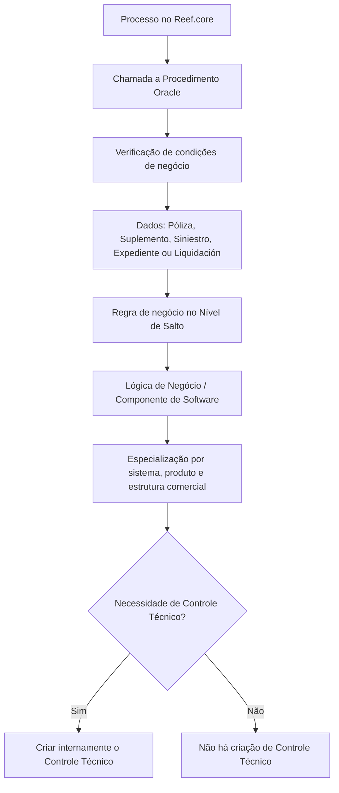

# Configuração de Procedimentos de Controles Técnicos no Reef.core

## 1. Metadados do Documento
- **Arquivo de Origem:** Não identificado no conteúdo extraído
- **Tipo de Documento:** Especificação Técnica / Documentação de Configuração
- **Domínio / Sistema:** Reef.core — Controles Técnicos
- **Público-Alvo:** Desenvolvedores, Arquitetos, Operação, Analistas Funcionais e equipes locais de Tecnologia MAPFRE
- **Data/Versão Identificada:** Não identificada
- **Proprietário identificado na fonte:** `agonzalez_mapfre.com`
- **Lifecycle identificado na fonte:** Approved Source

---

## 2. Resumo Executivo & Contexto de Negócio

O documento descreve a configuração dos procedimentos associados aos Controles Técnicos no sistema Reef.core. Esses controles são executados por chamadas a Procedimentos Oracle, caracterizados no texto como sub-rotinas de software ou lógicas de negócio responsáveis por verificar condições do processo no qual foram implementadas.

Os Procedimentos Oracle podem avaliar dados relacionados a entidades como Póliza, Suplemento, Siniestro, Expediente e Liquidación. Com base nas verificações realizadas, a lógica de negócio determina a necessidade de criação interna de Controles Técnicos no Reef.core.

A configuração permite especializar a execução de um componente de software de acordo com o sistema, o nível de salto, a estrutura de produtos e a estrutura comercial. Essa especialização é feita por propriedades de escopo, incluindo companhia, setor, subsetor, ramo técnico e níveis da estrutura comercial.

O catálogo de componentes de software também associa a execução a elementos funcionais, como Menu de Opções, Opção do Menu de Opções e Estrutura de Informação. O documento recomenda que a nomenclatura dos componentes identifique a condição avaliada e respeite a guia de escrita do Reef.core.

---

## 3. Arquitetura, Componentes & Tecnologias Envolvidas

### Componentes e conceitos identificados

| Componente / Conceito | Papel descrito no documento |
| :--- | :--- |
| **Reef.core** | Sistema no qual os Controles Técnicos são executados e configurados. |
| **Controles Técnicos** | Controles criados internamente quando procedimentos ou lógicas de negócio determinam sua necessidade. |
| **Procedimentos Oracle** | Sub-rotinas de software ou lógicas de negócio chamadas pelo Reef.core para verificar condições do processo. |
| **Lógica de Negócio** | Nome da lógica executada; sua nomenclatura é responsabilidade do departamento de Tecnologia da entidade MAPFRE Local. |
| **Nível de Salto** | Local específico do programa em que a regra de negócio é avaliada e o componente de software é executado. |
| **Estrutura de Produtos** | Estrutura considerada na especialização por setor, subsetor e ramo técnico. |
| **Estrutura Comercial** | Estrutura considerada na especialização por primeiro, segundo e terceiro níveis. |
| **Menu de Opções** | Menu sobre o qual se deseja executar o componente de software. |
| **Opção do Menu de Opções** | Opção específica, dentro do menu configurado, na qual o componente deve ser executado. |
| **Estrutura de Informação** | Estrutura cuja chave delimita a execução do componente de software. |



> **Nota de Análise:** O documento menciona Procedimentos Oracle, mas não detalha nomes de procedures, assinaturas, parâmetros, métodos de invocação, contratos de entrada/saída ou mecanismos de tratamento de erro.

---

## 4. Regras de Negócio, Especificações Funcionais & Processos

### 4.1 Execução dos Controles Técnicos

1. O Reef.core executa Controles Técnicos por meio de chamadas a Procedimentos Oracle.
2. Os Procedimentos Oracle são definidos como sub-rotinas de software ou lógicas de negócio.
3. As sub-rotinas verificam as condições do processo para o qual foram implementadas.
4. As sub-rotinas podem verificar dados de Póliza, Suplemento, Siniestro, Expediente, Liquidación e outras entidades indicadas por reticências no documento.
5. As verificações determinam se é necessário criar internamente Controles Técnicos.
6. A execução pode ser especializada considerando:
   - Sistema;
   - Nível de Salto;
   - Estruturas de produtos;
   - Estrutura comercial.

### 4.2 Especialização pela estrutura de produtos

- **Setor:** O valor genérico `9999` contempla todos os setores configurados no sistema. Um código específico restringe a execução ao setor correspondente.
- **Subsetor:** O valor genérico `9999` contempla todos os subsetores configurados. Um código específico restringe a execução ao subsetor correspondente, considerando sempre o valor definido para o setor.
- **Ramo técnico:** O valor genérico `999` contempla todos os ramos técnicos configurados. Um código específico restringe a execução ao ramo correspondente, considerando os valores de setor e subsetor definidos na estrutura de produtos.

### 4.3 Especialização pela estrutura comercial

- **Primeiro nível:** O valor genérico `99` contempla todos os primeiros níveis configurados na companhia. Um código específico restringe a execução ao primeiro nível indicado.
- **Segundo nível:** O valor genérico `999` contempla todos os segundos níveis configurados na companhia. Um código específico restringe a execução ao segundo nível indicado, considerando o primeiro nível definido.
- **Terceiro nível:** O valor genérico `9999` contempla todas as oficinas da estrutura comercial da companhia. Um código específico restringe a execução à oficina indicada, considerando primeiro e segundo níveis definidos.

### 4.4 Especialização por menu e informação

- O **Menu de Opções** determina o menu no qual o componente de software deve ser executado.
- A **Opção do Menu de Opções** determina a opção específica dentro do menu configurado.
- A **Estrutura de Informação** determina a chave da estrutura na qual o componente deve ser executado.
- O valor genérico `ZZZZZZZZZZ` para Estrutura de Informação permite a execução para qualquer estrutura de informação existente.
- Uma chave específica de Estrutura de Informação restringe a execução exclusivamente à estrutura correspondente.

### 4.5 Convenção de nomenclatura

Como boa prática, a nomenclatura dos componentes de software do catálogo deve:

1. Identificar a condição que o componente irá avaliar.
2. Respeitar a guia de escrita de nomenclatura existente no Reef.core.
3. Ser responsabilidade do departamento de Tecnologia da entidade MAPFRE Local, conforme a propriedade Lógica de Negócio.

---

## 5. Tabelas de Parâmetros, Ambientes e Estruturas de Dados

| Item / Parâmetro | Descrição / Função | Tipo / Valores / Formato | Ambiente / Observações |
| :--- | :--- | :--- | :--- |
| Companhia | Indica o código da companhia para a qual está sendo definida a configuração do componente de software. | Código de companhia; formato não detalhado. | Aplicável à definição do componente software. |
| Código do Sistema | Indica o código do Sistema/Processo no qual se enquadra a execução do Controle Técnico. | Código de sistema/processo; formato não detalhado. | Aplicável ao Reef.core. |
| Setor | Determina a chave do setor para a configuração do componente de software. | Código específico ou genérico `9999`. | `9999` contempla todos os setores configurados no sistema. |
| Subsetor | Determina a chave do subsetor para a configuração do componente de software. | Código específico ou genérico `9999`. | Deve considerar o valor configurado para Setor. |
| Ramo | Determina a chave do ramo técnico para a configuração do componente de software. | Código específico ou genérico `999`. | Deve considerar Setor e Subsetor da estrutura de produtos. |
| Chave do Primeiro Nível | Contém o código do primeiro nível da estrutura comercial. | Código específico ou genérico `99`. | `99` contempla todos os primeiros níveis da companhia. |
| Chave do Segundo Nível | Contém o código do segundo nível da estrutura comercial. | Código específico ou genérico `999`. | Deve considerar a definição do Primeiro Nível. |
| Chave do Terceiro Nível | Contém o código do terceiro nível da estrutura comercial. | Código específico ou genérico `9999`. | `9999` contempla todas as oficinas; deve considerar Primeiro e Segundo Níveis. |
| Nível de Salto | Determina o ponto específico do programa onde a regra de negócio é avaliada e o componente é executado. | Valor/código não detalhado. | Define o local de execução no programa. |
| Lógica de Negócio | Determina o nome da lógica de negócio executada. | Nome definido segundo nomenclatura local. | A nomenclatura é responsabilidade da Tecnologia da MAPFRE Local. |
| Menu de Opções | Indica o menu sobre o qual o componente de software deve ser executado. | Identificador de menu; formato não detalhado. | Relaciona a execução a uma área funcional. |
| Opção do Menu de Opções | Indica a opção específica do menu na qual o componente deve ser executado. | Identificador de opção; formato não detalhado. | Depende do Menu de Opções definido. |
| Estrutura de Informação | Indica a chave da estrutura de informação para execução do componente. | Chave específica ou valor genérico `ZZZZZZZZZZ`. | O valor genérico contempla qualquer estrutura de informação existente. |
| Procedimentos Oracle | Executam verificações de condições do processo e dados de negócio. | Sub-rotinas Oracle; assinatura não detalhada. | Chamados pelo Reef.core. |
| Dados avaliáveis | Dados passíveis de validação pelas sub-rotinas. | Póliza, Suplemento, Siniestro, Expediente, Liquidación, entre outros não especificados. | O documento não descreve campos ou estruturas desses dados. |

---

## 6. Bateria de Perguntas & Respostas para RAG (FAQ Sintético)

### P1: Como os Controles Técnicos são executados no Reef.core?
**R:** Os Controles Técnicos são executados no Reef.core mediante chamadas a Procedimentos Oracle. Esses procedimentos atuam como sub-rotinas de software ou lógicas de negócio que verificam as condições do processo para o qual foram implementados e determinam a necessidade de criação interna de Controles Técnicos.

### P2: Quais dados podem ser avaliados pelos Procedimentos Oracle dos Controles Técnicos?
**R:** O documento informa que os Procedimentos Oracle podem verificar dados de Póliza, Suplemento, Siniestro, Expediente e Liquidación. O texto também utiliza reticências após essa lista, mas não identifica outras entidades ou estruturas específicas.

### P3: Qual é a finalidade do atributo Nível de Salto?
**R:** O atributo Nível de Salto determina o lugar concreto do programa no qual a regra de negócio é avaliada e no qual o componente de software é executado.

### P4: Qual valor deve ser usado para aplicar uma configuração de Controle Técnico a todos os setores?
**R:** Deve ser usado o código genérico `9999` no atributo Setor. Esse código permite que a execução do componente de software seja considerada para todos os setores configurados no sistema.

### P5: Como uma configuração de Subsetor deve considerar o atributo Setor?
**R:** Uma configuração específica de Subsetor especializa a execução exclusivamente para o subsetor indicado, mas deve sempre considerar o valor do atributo Setor existente na definição.

### P6: Qual é o valor genérico para todos os ramos técnicos?
**R:** O valor genérico para Ramo é `999`. Esse valor permite que a execução do componente de software seja contemplada para todos os ramos técnicos configurados no sistema.

### P7: Como configurar um componente para todos os primeiros níveis da estrutura comercial?
**R:** Deve-se utilizar o código genérico `99` no atributo Chave do Primeiro Nível. Esse valor contempla todos os primeiros níveis da estrutura comercial configurada na companhia.

### P8: Qual código representa todas as oficinas no terceiro nível da estrutura comercial?
**R:** O código genérico `9999` na Chave do Terceiro Nível contempla todas as oficinas da estrutura comercial da companhia. Uma configuração específica deve considerar os atributos de Primeiro e Segundo Níveis definidos.

### P9: Para que servem Menu de Opções e Opção do Menu de Opções?
**R:** O Menu de Opções indica o menu sobre o qual o componente de software deve ser executado. A Opção do Menu de Opções indica qual das opções existentes nesse menu será utilizada para a execução do componente.

### P10: Como configurar a execução para qualquer Estrutura de Informação?
**R:** Deve-se utilizar o código genérico `ZZZZZZZZZZ` no atributo Estrutura de Informação. Esse valor permite que o componente seja considerado para qualquer estrutura de informação existente.

### P11: Quem é responsável pela nomenclatura da Lógica de Negócio?
**R:** A nomenclatura da Lógica de Negócio é responsabilidade do departamento de Tecnologia da entidade MAPFRE Local.

### P12: Qual prática de nomenclatura é recomendada para componentes de software do catálogo?
**R:** O documento recomenda que a nomenclatura identifique a condição que o componente de software avaliará e respeite a guia de escrita existente no Reef.core para nomenclatura.

---

## 7. Glossário de Termos, Siglas & Conceitos-Chave

- **Reef.core:** Sistema no qual os Controles Técnicos são executados e configurados.
- **Controle Técnico:** Controle criado internamente no Reef.core quando uma lógica de negócio determina sua necessidade.
- **Procedimento Oracle:** Sub-rotina de software ou lógica de negócio chamada pelo Reef.core para verificar condições de um processo.
- **Lógica de Negócio:** Regra ou componente de software cuja nomenclatura é responsabilidade da Tecnologia da MAPFRE Local.
- **Nível de Salto:** Ponto concreto do programa onde uma regra de negócio é avaliada e um componente é executado.
- **Póliza:** Entidade de negócio citada como dado passível de verificação; o documento não oferece definição adicional.
- **Suplemento:** Entidade de negócio citada como dado passível de verificação; o documento não oferece definição adicional.
- **Siniestro:** Entidade de negócio citada como dado passível de verificação; o documento não oferece definição adicional.
- **Expediente:** Entidade de negócio citada como dado passível de verificação; o documento não oferece definição adicional.
- **Liquidación:** Entidade de negócio citada como dado passível de verificação; o documento não oferece definição adicional.
- **Setor / Subsetor / Ramo:** Elementos da estrutura de produtos usados para especializar a execução de componentes.
- **Estrutura Comercial:** Estrutura de companhia organizada em primeiro, segundo e terceiro níveis.
- **Oficina:** Unidade associada ao terceiro nível da estrutura comercial.
- **Estrutura de Informação:** Estrutura identificada por uma chave e usada para delimitar a execução do componente de software.
- **MAPFRE Local:** Entidade cuja área de Tecnologia é indicada como responsável pela nomenclatura da Lógica de Negócio.

---

## 8. Notas Críticas, Riscos & Limitações

- O documento não identifica o arquivo de origem, a data, a versão ou autores técnicos além do proprietário exibido no cabeçalho extraído.
- O documento não especifica os nomes, assinaturas, parâmetros de entrada, retorno ou contratos dos Procedimentos Oracle.
- O documento não detalha a precedência entre configurações genéricas e específicas quando múltiplas definições forem aplicáveis.
- O documento estabelece dependências hierárquicas explícitas: Subsetor depende de Setor; Ramo depende de Setor e Subsetor; Segundo Nível depende de Primeiro Nível; Terceiro Nível depende de Primeiro e Segundo Níveis.
- O documento recomenda a leitura de documentos vinculados para evitar interpretações isoladas incorretas: **Definición Controles Técnicos**, **Estructuras de Información** e **Preguntas frecuentes**.
- **Nota de Análise:** Não há detalhamento adicional sobre os valores permitidos para Companhia, Código do Sistema, Nível de Salto, Menu de Opções ou Opção do Menu de Opções.
- **Nota de Análise:** O conteúdo extraído contém caracteres corrompidos em alguns trechos, como `denición`, `verican` e `ocinas`; a interpretação foi preservada apenas quando o termo era inequivocamente identificável pelo contexto.

---

## 9. Conteúdo Bruto Estruturado (Referência Fiel)

```text
--- [PÁGINA 1 DE 3] ---

CONFIGURACIÓN de los PROCEDIMIENTOS de los CONTROLES
TÉCNICOS
Contexto
Los controles técnicos se ejecutan en Reef.core mediante llamadas a Procedimientos Oracle, que no son sino subrutinas Software ó lógicas
de negocio que verican las condiciones del proceso para el que han sido implementadas, comprueban los datos de la Póliza, Suplemento,
Siniestro, Expediente, Liquidación, ... y determinan la necesidad de crear internamente los Controles Técnicos.
Reef.core cuenta con la posibilidad de especializar la ejecución de estas subrutinas o componentes software de acuerdo con el sistema, el
nivel de salto y las estructuras de productos y comercial.
Propiedades Generales
Propiedades Generales
Compañía
Esta propiedad le indica al sistema el código de la compañía sobre la que se está realizando la denición del componente software.
Código del Sistema
Esta propiedad indica el código del Sistema/Proceso en el que se inscribe la ejecución del control técnico.
Sector
Esta propiedad determina la clave del sector para el que se está congurando el componente software del control técnico.
Utilizando el valor genérico en este atributo (código 9999) el sistema permite que la la ejecución del componente software se contemple
para todos los sectores congurados en el sistema o bien, al utilizar el código de un sector en particular de los n existentes, especializar la
ejecución exclusivamente para este.
Sub-Sector
Esta propiedad determina la clave del subsector para el que se está congurando el componente software del control técnico.
Consejo:
Documentation / DOCUMENTACIÓN Reef
DOCUMENTACIÓN Reef
Mapfredocument
DOCUMENTACIÓN Reef
Owner
user:agonzalez_mapfre.com
Lifecycle
Approved Source
 /
VL
Buscar Inicio Soluciones Arquitecturas APIs Componentes Cloud Documentación Zeus Reef Ayuda
ES

--- [PÁGINA 2 DE 3] ---

Utilizando el valor genérico en este atributo (código 9999) el sistema permite que la la ejecución del componente software se contemple
para todos los subsectores congurados en el sistema o bien, al utilizar el código de un subsector en particular de los n existentes,
especializar la ejecución exclusivamente para este (teniendo siempre en consideración el valor del atributo del sector que tenga la
denición).
Ramo
Esta propiedad determina la clave del ramo técnico para el que se está congurando el componente software del control técnico.
Utilizando el valor genérico en este atributo (código 999) el sistema permite que la la ejecución del componente software se contemple
para todos los ramos técnicos congurados en el sistema o bien, al utilizar el código de un ramo en particular de los n existentes,
especializar la ejecución exclusivamente para este (teniendo siempre en consideración el valor de los atributos del sector y subsector de
la estructura de productos que tenga la denición).
Clave del Primer Nivel
Este atributo contiene el código del primer nivel de la estructura comercial para el que se está especicando el componente software del
control técnico.
Utilizando el valor genérico en este atributo (código 99) el sistema permite que la la ejecución del componente software se contemple
para todos los primeros niveles de la estructura comercial congurada en la compañía o bien, al utilizar el código de un primer nivel en
concreto, especializar la ejecución exclusivamente para este.
Clave del Segundo Nivel
Este atributo contiene el código del segundo nivel de la estructura comercial para el que se está especicando el componente software del
control técnico.
Utilizando el valor genérico en este atributo (código 999) el sistema permite que la la ejecución del componente software se contemple
para todos los segundos niveles de la estructura comercial congurada en la compañía o bien, al utilizar el código de un segundo nivel en
particular, especializar la ejecución exclusivamente para este (teniendo siempre en consideración el valor del atributo del primer nivel de la
estructura comercial que tenga la denición).
Clave del Tercer Nivel
Este atributo contiene el código del tercer nivel de la estructura comercial para el que se está especicando el componente software del
control técnico.
Utilizando el valor genérico en este atributo (código 9999) el sistema permite que la la ejecución del componente software se contemple
para todas las ocinas de la estructura comercial de la compañía o bien, al utilizar el código de una ocina en particular (de las n
existentes) especializar la ejecución exclusivamente para ella (teniendo siempre en consideración el valor de los atributos del primer y
segundo nivel de la estructura comercial que tenga la denición)
Nivel de Salto
Este atributo determina el lugar concreto del programa en donde se evalúa la regla de negocio y se ejecuta el componente software.
Lógica de Negocio
Consejo:
Consejo:
Consejo:
Consejo:
Consejo:

--- [PÁGINA 3 DE 3] ---

Esta propiedad determina el nombre de la lógica de negocio cuya nomenclatura es responsabilidad del departamento de Tecnología de la
entidad MAPFRE Local.
Menú de Opciones
Este atributo indica el Menú de Opciones sobre el que se quiere ejecutar el componente software.
Opción del Menú de Opciones
Este atributo indica, de acuerdo con el Menú de Opciones de la denición, sobre cual de las opciones existentes en el mismo se debe ejecutar
el componente software.
Estructura de Información
Este atributo indica la clave de la Estructura de Información para la que se quiere ejecutar el componente software.
Utilizando el valor genérico en este atributo (código ZZZZZZZZZZ) el sistema permite que la la ejecución del componente software se
contemple para cualquier estructura de información existente o bien, al utilizar el código de una estructura de información en particular,
especializar la ejecución exclusivamente para ella.
Vínculos
Relación de Directrices y Documentos funcionales cuya lectura recomendada para evitar que la interpretación aislada del presente
documento pueda conducir a error.
Denición Controles Técnicos
Estructuras de Información
Preguntas frecuentes
(1) ¿Existe alguna circunstancia que tenga que ser tomada en consideración sobre este catálogo?
Puede considerarse como una buena práctica en la codicación de los componentes software de este catálogo identicar en su
nomenclatura la condición que van a evaluar además de respetar la guía de escritura existente en Reef.core para su nomenclatura.
Consejo:
```
