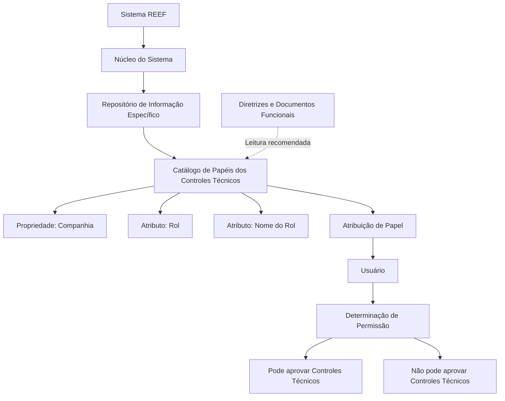

# Definição de Papéis dos Controles Técnicos no Sistema REEF

## 1. Metadados do Documento
- **Arquivo de Origem:** Não identificado no conteúdo fornecido
- **Tipo de Documento:** Especificação Funcional
- **Domínio / Sistema:** REEF — Controles Técnicos
- **Público-Alvo:** Analistas funcionais, administradores do sistema e equipes responsáveis por controles técnicos
- **Data/Versão Identificada:** Não identificada

---

## 2. Resumo Executivo & Contexto de Negócio

O documento descreve a definição de papéis (*Roles*) utilizados pelos Controles Técnicos do núcleo do Sistema REEF. O sistema permite definir e codificar esses papéis em um repositório de informações específico.

Os papéis são atribuídos aos usuários e determinam se cada usuário pode ou não aprovar controles técnicos. Portanto, o catálogo de papéis é um mecanismo funcional de definição de capacidade de aprovação para usuários.

A definição de cada papel considera, no mínimo, a companhia à qual o papel se aplica, a chave de identificação do papel e o nome ou denominação de reconhecimento do papel criado.

O documento recomenda que a identificação e a estruturação dos papéis sejam realizadas conforme os processos sobre os quais os controles técnicos serão executados. Essa estruturação pode usar tanto as chaves de identificação quanto as denominações dos papéis.

O conteúdo também referencia diretrizes e documentos funcionais relacionados, cuja leitura é recomendada para evitar interpretações incorretas decorrentes da análise isolada desta especificação.

---

## 3. Arquitetura, Componentes & Tecnologias Envolvidas

Os componentes funcionais identificados são:

- **Sistema REEF:** Sistema cujo núcleo permite definir e codificar papéis para Controles Técnicos.
- **Núcleo do Sistema:** Componente funcional que disponibiliza a capacidade de manutenção dos papéis.
- **Repositório de Informação Específico:** Repositório no qual os papéis são definidos e codificados.
- **Catálogo de Papéis dos Controles Técnicos:** Catálogo que contém os atributos de identificação e denominação dos papéis.
- **Usuários:** Entidades que recebem a atribuição de papéis.
- **Controles Técnicos:** Controles cuja aprovação é permitida ou negada conforme o papel atribuído ao usuário.
- **Companhia:** Propriedade que indica o código da companhia no contexto da definição de papéis.
- **Documentação REEF / Mapfredocument:** Itens de documentação exibidos como referência no conteúdo.



> **Nota de Análise:** O documento não detalha tecnologias de implementação, métodos HTTP, contratos JSON, banco de dados, mecanismos de autenticação, fluxos de interface ou regras técnicas de persistência.

---

## 4. Regras de Negócio, Especificações Funcionais & Processos

### 4.1 Definição e uso de papéis

1. O núcleo do Sistema REEF possui a capacidade de definir e codificar papéis.
2. Os papéis são mantidos em um repositório de informação específico.
3. Os papéis são atribuídos a usuários.
4. A atribuição de um papel determina se o usuário pode ou não aprovar controles técnicos.
5. O documento não descreve o processo operacional de atribuição de papéis aos usuários.

### 4.2 Propriedades gerais do catálogo de papéis

1. **Companhia**
   - Indica ao sistema o código da companhia sobre a qual está sendo realizada a definição dos papéis.
   - A propriedade contextualiza os papéis considerados nos Controles Técnicos.

2. **Rol**
   - Representa a chave de identificação do papel.
   - É um atributo do catálogo de papéis dos Controles Técnicos.

3. **Nome do Rol**
   - Contém o nome ou a denominação utilizada para reconhecer e descrever o papel criado.
   - É um atributo do catálogo de papéis dos Controles Técnicos.

### 4.3 Boa prática operacional

A identificação e a estruturação dos papéis podem ser realizadas em conformidade com os processos sobre os quais os controles técnicos serão executados. A estruturação pode considerar:

- A chave que identifica o papel.
- A denominação atribuída ao papel.

### 4.4 Vínculos documentais

O documento estabelece que existem diretrizes e documentos funcionais relacionados. A leitura desses materiais é recomendada para reduzir o risco de erro causado pela interpretação isolada do documento de definição de papéis.

> **Nota de Análise:** O conteúdo cita “Definición Controles Técnicos” e “Preguntas frecuentes”, mas não apresenta o conteúdo integral dessas referências.

---

## 5. Tabelas de Parâmetros, Ambientes e Estruturas de Dados

| Item / Parâmetro | Descrição / Função | Tipo / Valores / Formato | Ambiente / Observações |
| :--- | :--- | :--- | :--- |
| Companhia | Informa o código da companhia para a qual os papéis estão sendo definidos. | Código de companhia; formato não detalhado. | Aplicável à definição de papéis dos Controles Técnicos. |
| Rol | Define a chave de identificação do papel. | Chave de identificação; formato não detalhado. | Atributo do catálogo de papéis dos Controles Técnicos. |
| Nome do Rol | Registra o nome ou a denominação para reconhecer e descrever o papel criado. | Nome ou denominação; formato não detalhado. | Atributo do catálogo de papéis dos Controles Técnicos. |
| Papel atribuído | Papel associado a um usuário para determinar capacidade de aprovação. | Papel do catálogo; regras de associação não detalhadas. | Determina se o usuário pode ou não aprovar controles técnicos. |
| Repositório de informação específico | Local funcional onde os papéis são definidos e codificados. | Não detalhado. | Referenciado pelo núcleo do Sistema REEF. |
| Diretrizes e documentos funcionais | Materiais relacionados cuja leitura é recomendada. | Documentação relacionada. | Devem ser consultados para evitar interpretações isoladas incorretas. |
| Lifecycle | Valor exibido na referência de documentação. | `Approved Source` | Associado ao conteúdo de documentação exibido. |
| Owner | Proprietário exibido na referência de documentação. | `user:agonzalez_mapfre.com` | Valor literal apresentado no conteúdo fornecido. |

---

## 6. Bateria de Perguntas & Respostas para RAG (FAQ Sintético)

### P1: Qual é a finalidade dos papéis no Sistema REEF?
**R:** Os papéis são definidos e codificados pelo núcleo do Sistema REEF em um repositório de informação específico. Quando atribuídos aos usuários, os papéis determinam se esses usuários podem ou não aprovar controles técnicos.

### P2: Onde os papéis dos Controles Técnicos são mantidos?
**R:** O documento informa que os papéis são definidos e codificados em um repositório de informação específico. O conteúdo não identifica a tecnologia, o nome físico ou a localização técnica desse repositório.

### P3: Quais propriedades gerais compõem a definição de um papel?
**R:** A definição apresenta as propriedades Companhia, Rol e Nome do Rol. Companhia indica o código da companhia; Rol determina a chave de identificação; Nome do Rol registra a denominação usada para reconhecer e descrever o papel criado.

### P4: O que representa o atributo Rol no catálogo de papéis?
**R:** O atributo Rol determina a chave de identificação do papel no catálogo de papéis dos Controles Técnicos.

### P5: Para que serve a propriedade Companhia?
**R:** A propriedade Companhia indica ao sistema o código da companhia sobre a qual está sendo realizada a definição dos papéis que devem ser considerados nos Controles Técnicos.

### P6: Qual é a função do Nome do Rol?
**R:** O Nome do Rol contém o nome ou a denominação pela qual o papel criado será reconhecido e descrito no catálogo de papéis dos Controles Técnicos.

### P7: Como o documento recomenda estruturar os papéis?
**R:** O documento recomenda, como boa prática, identificar e estruturar os papéis de acordo com os processos sobre os quais os controles técnicos serão executados. Essa estruturação pode ser feita pela chave de identificação ou pela denominação dos papéis.

### P8: A atribuição de um papel garante que um usuário pode aprovar um controle técnico?
**R:** A atribuição de um papel é o mecanismo que determina se um usuário pode ou não aprovar controles técnicos. O documento não define quais papéis específicos concedem ou negam a capacidade de aprovação.

### P9: O documento define métodos de aprovação ou fluxos de interface?
**R:** Não. O documento descreve apenas que os papéis atribuídos aos usuários determinam a possibilidade de aprovar controles técnicos. Métodos de aprovação, telas, etapas operacionais e contratos técnicos não são detalhados.

### P10: Por que devem ser consultadas as diretrizes e os documentos funcionais vinculados?
**R:** A leitura das diretrizes e dos documentos funcionais relacionados é recomendada para evitar que uma interpretação isolada do documento de definição de papéis conduza a erros.

---

## 7. Glossário de Termos, Siglas & Conceitos-Chave

- **REEF:** Nome do sistema referido no conteúdo como “Sistema” e em referências de documentação como “DOCUMENTACIÓN Reef”. O significado expandido da sigla não é informado.
- **Controles Técnicos:** Controles cuja aprovação depende da atribuição de papéis aos usuários.
- **Rol / Papel:** Entidade funcional definida e codificada em um repositório específico; quando atribuída a um usuário, determina a possibilidade de aprovação de controles técnicos.
- **Catálogo de Papéis:** Catálogo dos papéis dos Controles Técnicos, contendo atributos como Rol e Nome do Rol.
- **Companhia:** Propriedade que informa o código da companhia no contexto da definição de papéis.
- **Nome do Rol:** Denominação usada para reconhecer e descrever um papel criado.
- **Vínculos:** Relação de diretrizes e documentos funcionais de leitura recomendada.
- **Lifecycle:** Campo exibido na referência de documentação com o valor `Approved Source`.
- **Owner:** Campo exibido na referência de documentação com o valor `user:agonzalez_mapfre.com`.
- **VL:** Sigla exibida no conteúdo sem definição adicional.

---

## 8. Notas Críticas, Riscos & Limitações

- O documento não identifica o arquivo de origem, data, versão, autor formal ou sistema de versionamento.
- O documento não detalha quais papéis existem, quais permissões cada papel concede ou quais critérios determinam a aprovação de um controle técnico.
- Não são apresentados métodos HTTP, APIs, contratos JSON, banco de dados, interface de usuário, rotas de log, URLs, servidores ou ambientes.
- O processo de criação, alteração, exclusão e atribuição de papéis não é descrito.
- A interpretação isolada do documento pode levar a erro; o próprio documento recomenda a consulta de diretrizes e documentos funcionais vinculados.
- A referência a “Definición Controles Técnicos” e “Preguntas frecuentes” não inclui conteúdo suficiente para reconstruir suas regras ou procedimentos.
- O exemplo visual de documentação apresenta textos de navegação e metadados, mas não explica sua relação técnica com a manutenção de papéis.

---

## 9. Conteúdo Bruto Estruturado (Referência Fiel)

```text
--- [PÁGINA 1 DE 1] ---

DEFINICIÓN de los ROLES de los Controles Técnicos
Funcionalmente, el núcleo del Sistema cuenta con la posibilidad de denir y codicar en un repositorio de información especíco los Roles
que una vez asignados a los Usuarios determinarán si estos pueden o no aprobar los controles técnicos.
Propiedades Generales
Propiedades Generales
Compañía
Esta propiedad le indica al sistema el código de la compañía sobre la que se está realizando la denición de los roles que se han de
considerar en los controles técnicos.
Rol
Este Atributo del catálogo de Roles de los controles técnicos determina la clave de identicación del Rol.
Nombre del Rol
Este Atributo del catálogo de Roles contiene el nombre o denominación por el que vamos a reconocer y describir al Rol creado.
Vínculos
Relación de Directrices y Documentos funcionales cuya lectura recomendada para evitar que la interpretación aislada del presente
documento pueda conducir a error.
Denición Controles Técnicos
Preguntas frecuentes
(1) ¿Existe alguna circunstancia operativa que deba ser tomada en consideración sobre este catálogo?
Puede considerarse como una buena práctica su identicación y estructuración de acuerdo con los procesos sobre los que se van a ejecutar,
ya sea sobre la clave que los identica o sobre sus denominaciones.
Ejemplo:
Documentation / DOCUMENTACIÓN Reef
DOCUMENTACIÓN Reef
Mapfredocument
DOCUMENTACIÓN Reef
Owner
user:agonzalez_mapfre.com
Lifecycle
Approved Source
 /
 VL
Buscar Inicio Soluciones Arquitecturas APIs Componentes Cloud Documentación Zeus Reef Ayuda
ES
```
