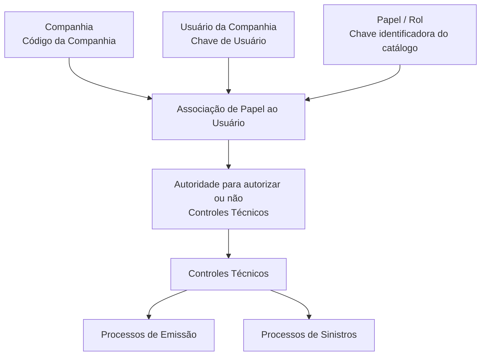

# Definição de Usuários por Papel de Controles Técnicos

## 1. Metadados do Documento
- **Arquivo de Origem:** Não identificado no conteúdo fornecido
- **Tipo de Documento:** Especificação Funcional
- **Domínio / Sistema:** Reef / Controles Técnicos / Usuários da Companhia
- **Público-Alvo:** Usuários funcionais, administradores de catálogo e equipes responsáveis por emissão e sinistros
- **Data/Versão Identificada:** Não identificada
- **Status identificado:** Approved Source / VL
- **Owner identificado:** `user:agonzalez_mapfre.com`

---

## 2. Resumo Executivo & Contexto de Negócio

O documento define o catálogo de associação entre usuários configurados de uma companhia e papéis relacionados a Controles Técnicos. Essa associação determina a autoridade de cada usuário para autorizar ou não controles técnicos levantados nos processos de emissão e sinistros.

O núcleo funcional do sistema permite configurar um papel para cada usuário da companhia. A configuração é contextualizada pelo código da companhia, pela chave que identifica o papel e pelo código do usuário.

A principal restrição operacional declarada é que cada usuário pode estar associado a apenas um papel. O documento não descreve exceções, fluxos de aprovação detalhados, métodos de integração, interfaces, contratos de dados ou critérios adicionais para autorização.

O conteúdo também referencia documentos funcionais relacionados — Controles Técnicos, Usuários da Companhia e Perguntas frequentes — cuja leitura é recomendada para evitar interpretações isoladas ou incorretas desta definição.

---

## 3. Arquitetura, Componentes & Tecnologias Envolvidas

Os elementos funcionais identificados são:

- **Sistema Reef:** Repositório ou domínio documental indicado no conteúdo.
- **Núcleo do Sistema:** Componente funcional responsável pela associação de papel ao usuário configurado da companhia.
- **Catálogo de Papéis:** Catálogo cujo atributo `Rol` determina a chave identificadora do papel.
- **Usuários da Companhia:** Entidades que recebem um único papel.
- **Controles Técnicos:** Controles levantados nos processos de emissão e sinistros, cuja autorização depende do papel associado ao usuário.
- **Processos de emissão e sinistros:** Processos de negócio nos quais os controles técnicos são levantados.
- **Mapfredocument / DOCUMENTACIÓN Reef:** Elementos de navegação ou gestão documental exibidos no conteúdo.



> **Nota de Análise:** O documento descreve uma relação funcional entre companhia, usuário, papel e autoridade sobre Controles Técnicos. Não há detalhamento sobre tecnologias de implementação, serviços, endpoints HTTP, contratos JSON, banco de dados, interfaces de tela ou mecanismos de autenticação.

---

## 4. Regras de Negócio, Especificações Funcionais & Processos

### 4.1 Finalidade da associação de papel

1. O núcleo do sistema permite atribuir um papel aos usuários configurados de uma companhia.
2. O papel atribuído determina a autoridade do usuário para autorizar ou não os Controles Técnicos.
3. Os Controles Técnicos abrangidos pela definição são aqueles levantados nos processos de emissão e sinistros.

### 4.2 Propriedades gerais da associação

1. A propriedade **Companhia** informa ao sistema o código da companhia na qual a associação de papel ao usuário está sendo realizada.
2. A propriedade **Rol** é um atributo do catálogo e determina a chave que identifica o papel.
3. A propriedade **Clave de Usuario** contém o código do usuário.

### 4.3 Restrição operacional

1. Um usuário pode estar associado a **somente um papel**.
2. O documento não informa se a substituição de um papel existente exige revogação prévia, aprovação, auditoria ou histórico de alterações.

### 4.4 Documentação relacionada

A interpretação desta definição deve considerar, quando necessário, os documentos ou temas relacionados listados:

- Controles Técnicos.
- Usuários da Companhia.
- Perguntas frequentes.

---

## 5. Tabelas de Parâmetros, Ambientes e Estruturas de Dados

| Item / Parâmetro | Descrição / Função | Tipo / Valores / Formato | Ambiente / Observações |
| :--- | :--- | :--- | :--- |
| Companhia | Indica o código da companhia sobre a qual é realizada a associação de papel ao usuário. | Código de companhia; formato não detalhado. | Propriedade geral da associação. |
| Rol | Determina a chave que identifica o papel no catálogo. | Chave de papel; formato não detalhado. | Um único papel pode ser associado a cada usuário. |
| Clave de Usuario | Contém o código do usuário. | Código de usuário; formato não detalhado. | Identifica o usuário que recebe o papel. |
| Usuário da Companhia | Usuário configurado para uma companhia e elegível para receber um papel. | Entidade funcional; estrutura não detalhada. | Associado a apenas um papel. |
| Papel / Rol | Elemento do catálogo que define a autoridade do usuário sobre Controles Técnicos. | Chave identificadora do catálogo. | Determina a possibilidade de autorizar ou não controles técnicos. |
| Controles Técnicos | Controles levantados nos processos de emissão e sinistros. | Conceito funcional; estrutura não detalhada. | A autorização depende do papel associado ao usuário. |
| Processo de Emissão | Processo no qual podem ser levantados Controles Técnicos. | Processo de negócio; não detalhado. | Não há fluxo operacional descrito. |
| Processo de Sinistros | Processo no qual podem ser levantados Controles Técnicos. | Processo de negócio; não detalhado. | Não há fluxo operacional descrito. |
| Owner | Proprietário identificado no registro documental. | `user:agonzalez_mapfre.com` | Exibido como metadado documental. |
| Lifecycle | Estado de ciclo de vida exibido no registro documental. | `Approved Source / VL` | Significado de `VL` não detalhado. |

---

## 6. Bateria de Perguntas & Respostas para RAG (FAQ Sintético)

### P1: Qual é a finalidade do catálogo de definição de usuários por papel de Controles Técnicos?
**R:** O catálogo permite associar usuários configurados de uma companhia a um papel. Esse papel determina a autoridade do usuário para autorizar ou não os Controles Técnicos levantados nos processos de emissão e sinistros.

### P2: Um usuário pode possuir mais de um papel de Controles Técnicos?
**R:** Não. A regra operacional explícita determina que somente um papel pode ser associado a cada usuário.

### P3: Qual propriedade identifica a companhia na associação de papel ao usuário?
**R:** A propriedade **Companhia** informa o código da companhia sobre a qual está sendo realizada a associação do papel ao usuário da companhia.

### P4: Como o papel é identificado no catálogo?
**R:** O atributo **Rol** determina a chave que identifica o papel no catálogo.

### P5: Qual informação é armazenada na propriedade Clave de Usuario?
**R:** A propriedade **Clave de Usuario** contém o código do usuário associado ao papel.

### P6: Sobre quais processos o papel do usuário influencia a autorização de Controles Técnicos?
**R:** O papel influencia a autoridade para autorizar ou não Controles Técnicos levantados nos processos de emissão e sinistros.

### P7: O documento informa quais ações específicas um usuário pode executar para autorizar Controles Técnicos?
**R:** Não. O documento informa apenas que o papel determina a autoridade para autorizar ou não os Controles Técnicos. Não detalha ações de interface, etapas de aprovação ou critérios de decisão.

### P8: O documento descreve endpoints, APIs ou contratos de integração para o catálogo?
**R:** Não. Não há métodos HTTP, URLs de serviço, contratos JSON, esquemas de integração ou tecnologias de implementação descritos no conteúdo fornecido.

### P9: Quais documentos relacionados devem ser consultados para evitar interpretação isolada?
**R:** O documento recomenda consultar os temas ou documentos relacionados **Controles Técnicos**, **Usuários da Companhia** e **Perguntas frequentes**.

### P10: O que acontece quando um usuário já possui um papel e precisa receber outro?
**R:** O documento estabelece apenas que um usuário pode ter um único papel. Não detalha o procedimento para substituição, revogação, histórico ou aprovação da alteração do papel existente.

---

## 7. Glossário de Termos, Siglas & Conceitos-Chave

- **Companhia:** Entidade identificada por um código, sobre a qual é realizada a associação de papel ao usuário.
- **Clave de Usuario:** Propriedade que contém o código do usuário.
- **Controles Técnicos:** Controles levantados nos processos de emissão e sinistros, sujeitos à autorização ou não conforme o papel do usuário.
- **Emissão:** Processo de negócio citado como origem de Controles Técnicos.
- **Papel / Rol:** Papel identificado por uma chave de catálogo e atribuído ao usuário para determinar sua autoridade sobre Controles Técnicos.
- **Reef:** Nome exibido no contexto da documentação e navegação documental.
- **Sinistros:** Processo de negócio citado como origem de Controles Técnicos.
- **VL:** Sigla exibida no campo de ciclo de vida `Approved Source / VL`; o documento não apresenta sua definição.
- **Mapfredocument:** Termo exibido na navegação documental; seu significado ou função não é detalhado.

---

## 8. Notas Críticas, Riscos & Limitações

- A associação é limitada a um único papel por usuário; configurações que necessitem de múltiplas autoridades simultâneas não são descritas ou suportadas pelo conteúdo apresentado.
- Não há critérios detalhados para decidir quando um Controle Técnico deve ser autorizado ou negado.
- Não há definição de permissões por papel, matriz de autorização, níveis hierárquicos ou segregação de funções.
- Não há especificação de auditoria, rastreabilidade, histórico de alterações ou responsáveis pela manutenção do catálogo.
- Não há detalhes de interface, APIs, integrações, persistência de dados, segurança, autenticação ou tratamento de erros.
- O documento recomenda a leitura de documentos relacionados para evitar interpretação isolada, indicando dependência conceitual de Controles Técnicos, Usuários da Companhia e Perguntas frequentes.

---

## 9. Conteúdo Bruto Estruturado (Referência Fiel)

```text
--- [PÁGINA 1 DE 1] ---

DEFINICIÓN de los USUARIOS por Rol de Controles Técnicos
Funcionalmente, el núcleo del Sistema cuenta con la posibilidad de asignar a los Usuarios con gurados de la Compañía un rol que
determinará su autoridad para autorizar o no los controles técnicos levantados en los procesos de emisión y siniestros.

Propiedades Generales

Propiedades Generales

Compañía
Esta propiedad le indica al sistema el código de la compañía sobre la que se está realizando la asignación del Rol al usuario de la Compañía.

Rol
Este Atributo del catálogo determina la clave que identi ca el Rol.

Clave de Usuario
Esta propiedad, por último, contiene el código del Usuario.

Vínculos
Relación de Directrices y Documentos funcionales cuya lectura recomendada para evitar que la interpretación aislada del presente
documento pueda conducir a error.

Controles Técnicos
Usuarios de la Compañía
Preguntas frecuentes

(1) ¿Existe alguna circunstancia operativa que deba ser tomada en consideración sobre este catálogo?
Únicamente se puede asociar un rol por usuario.

Documentation / DOCUMENTACIÓN Reef
DOCUMENTACIÓN Reef
Mapfredocument

DOCUMENTACIÓN Reef
Owner
user:agonzalez_mapfre.com

Lifecycle
Approved Source
 /
VL

Buscar Inicio Soluciones Arquitecturas APIs Componentes Cloud Documentación Zeus Reef Ayuda
ES
```
