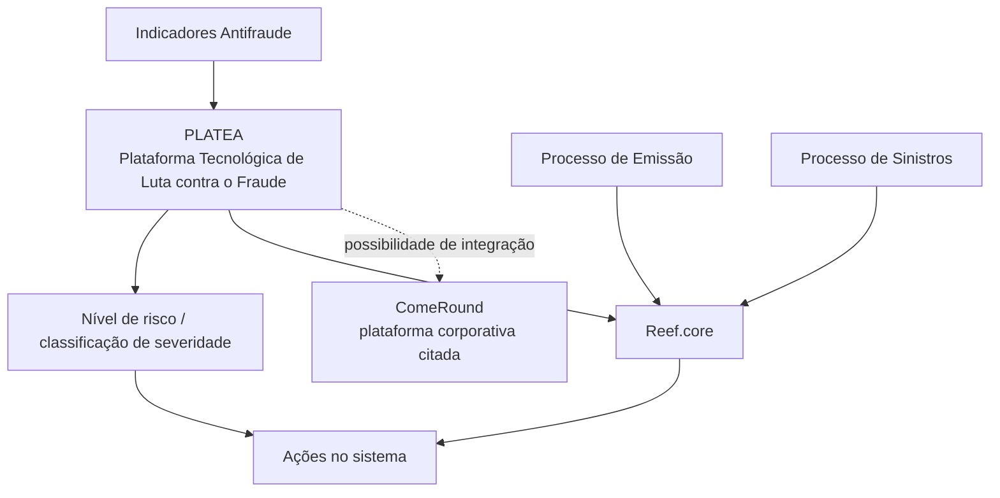

# Definição de Seleção Digital de Risco — PLATEA e Reef.core

## 1. Metadados do Documento
- **Arquivo de Origem:** Não identificado no conteúdo extraído
- **Tipo de Documento:** Arquitetura de Software / Apresentação Executiva
- **Domínio / Sistema:** PLATEA, Reef.core, Grupo MAPFRE, emissão digital, fraude
- **Público-Alvo:** Desenvolvedores, Arquitetos, Operação e Negócio
- **Data/Versão Identificada:** Não identificada

---

## 2. Resumo Executivo & Contexto de Negócio

PLATEA é apresentada como a Plataforma Tecnológica de Luta contra o Fraude, desenvolvida internamente para as entidades do Grupo MAPFRE. A plataforma visa fornecer tecnologias avançadas para uma gestão integral, eficaz e eficiente de fraude em diferentes processos de negócio.

O escopo de PLATEA inclui prevenção, deteção precoce, investigação, medição e controlo de operações. A solução é aplicável a diferentes canais, ramos e momentos do processo de cotação e contratação.

O documento descreve a integração entre Reef.core e PLATEA para suportar ações no sistema conforme o nível de risco retornado por PLATEA. Esse nível de risco representa uma classificação de severidade atribuída a um indicador.

A integração é destinada aos processos de Emissão e Sinistros. No contexto de emissão digital, PLATEA pretende sofisticar critérios de subscrição, orientar decisões de negócio para crescimento rentável e facilitar a subscrição.

PLATEA também enfatiza o aproveitamento do conhecimento e das informações de cada entidade do Grupo MAPFRE, a integração com outras plataformas corporativas — como ComeRound — e a redução do risco reputacional.

---

## 3. Arquitetura, Componentes & Tecnologias Envolvidas

| Componente / Sistema | Papel identificado no documento |
| :--- | :--- |
| **PLATEA** | Plataforma Tecnológica de Luta contra o Fraude do Grupo MAPFRE. Classifica a severidade de indicadores de risco e suporta gestão de fraude. |
| **Reef.core** | Sistema integrado a PLATEA para executar ações conforme o nível de risco retornado. |
| **ComeRound** | Exemplo de plataforma corporativa com a qual PLATEA pode integrar. |
| **Processo de Emissão** | Processo no qual o serviço PLATEA é citado explicitamente. |
| **Processo de Sinistros** | Processo citado como parte do objetivo de integração entre Reef.core e PLATEA. |
| **Indicadores Antifraude** | Indicadores associados ao âmbito e às ações antifraude. |
| **Ramos Técnicos** | Possuem parâmetros relacionados a PLATEA. |
| **Catálogos de Configuração de PLATEA** | Elementos de configuração citados, sem detalhamento de estrutura ou campos. |



**Nota de Análise:** O conteúdo extraído não detalha protocolos de integração, métodos HTTP, contratos JSON, tecnologias de implementação, topologia de infraestrutura ou regras de encaminhamento por nível de risco.

---

## 4. Regras de Negócio, Especificações Funcionais & Processos

### Objetivo de integração

A integração entre Reef.core e PLATEA deve permitir que o sistema realize diferentes ações de acordo com o nível de risco retornado por PLATEA nos processos de Emissão e Sinistros.

### Classificação de risco

- O nível de risco é definido como uma **classificação com a qual PLATEA determina o grau de severidade de um indicador**.
- O documento não especifica níveis, escalas, códigos, limiares, pesos, fórmulas de cálculo ou ações concretas correspondentes a cada classificação de risco.
- O documento também não detalha quais indicadores antifraude compõem a avaliação realizada por PLATEA.

### Capacidades atribuídas a PLATEA

1. **Compreensão do fraude**
   - Entender e conhecer o fraude em cada mercado.
   - Compreender o comportamento dos perfis fraudulentos.

2. **Gestão integral do fraude**
   - Aplicação em diferentes canais.
   - Aplicação em diferentes ramos.
   - Aplicação em distintos momentos do processo de cotação e contratação.

3. **Desenvolvimento interno**
   - Permitir integração e escalabilidade com outras plataformas corporativas.
   - ComeRound é citado como exemplo de plataforma corporativa.

4. **Gestão sob medida**
   - Aproveitar conhecimento e informação de cada entidade do Grupo MAPFRE.
   - Reduzir o risco reputacional.

5. **Mecanismos sofisticados de deteção**
   - Utilizar mecanismos baseados em anomalias.
   - Utilizar modelos preditivos.

### Processo de emissão digital

O documento afirma que PLATEA melhora e facilita a subscrição na emissão digital ao sofisticar critérios de subscrição na emissão de negócio digital. O objetivo de negócio mencionado é orientar decisões para crescimento rentável.

**Nota de Análise:** O documento cita “Ações Antifraude” e “Serviço PLATEA em Processo de Emissão”, mas não apresenta o fluxo operacional, os gatilhos de chamada, os critérios de decisão ou as ações executadas por Reef.core.

---

## 5. Tabelas de Parâmetros, Ambientes e Estruturas de Dados

| Item / Parâmetro | Descrição / Função | Tipo / Valores / Formato | Ambiente / Observações |
| :--- | :--- | :--- | :--- |
| PLATEA | Plataforma Tecnológica de Luta contra o Fraude. | Plataforma corporativa. | Desenvolvida internamente para entidades do Grupo MAPFRE. |
| Reef.core | Sistema integrado a PLATEA para realizar ações conforme risco retornado. | Sistema / componente. | Aplicável aos processos de Emissão e Sinistros. |
| Nível de risco | Classificação usada por PLATEA para determinar a severidade de um indicador. | Classificação de severidade; valores não informados. | Não há escala, códigos ou limiares descritos. |
| Indicadores Antifraude | Indicadores associados ao escopo e às ações antifraude. | Catálogo / indicador; estrutura não informada. | O documento não lista indicadores específicos. |
| Parâmetros de Ramos Técnicos | Parâmetros relacionados a PLATEA. | Parâmetros de configuração; campos não informados. | Citados em “Configuração Produtos e Processos”. |
| Catálogos de Configuração de PLATEA | Catálogos usados para configuração de PLATEA. | Catálogo; formato não informado. | Sem detalhamento de conteúdo, campos ou manutenção. |
| Processo de Emissão | Processo de negócio no qual é citado o serviço PLATEA. | Processo de negócio. | Inclui contexto de emissão digital e subscrição. |
| Processo de Sinistros | Processo de negócio previsto no objetivo de integração. | Processo de negócio. | Sem detalhamento operacional adicional. |
| ComeRound | Plataforma corporativa citada como exemplo de integração. | Plataforma corporativa. | Não há detalhes sobre interface ou fluxo de integração. |
| Modelos preditivos | Mecanismos sofisticados de deteção de fraude. | Modelo preditivo; tecnologia não informada. | Não são descritos algoritmos, dados ou métricas. |
| Mecanismos baseados em anomalias | Mecanismos de deteção de fraude. | Mecanismo analítico; implementação não informada. | Sem regras, parâmetros ou limiares especificados. |

---

## 6. Bateria de Perguntas & Respostas para RAG (FAQ Sintético)

### P1: O que é a plataforma PLATEA no contexto do Grupo MAPFRE?
**R:** PLATEA é a materialização da Plataforma Tecnológica de Luta contra o Fraude, desenvolvida internamente por e para as entidades do Grupo MAPFRE. A plataforma busca viabilizar a gestão integral, eficaz e eficiente de fraude em diferentes processos de negócio.

### P2: Qual é o objetivo da integração entre Reef.core e PLATEA?
**R:** O objetivo é integrar Reef.core e PLATEA para que o sistema possa realizar diferentes ações dependendo do nível de risco retornado por PLATEA nos processos de Emissão e Sinistros.

### P3: O que representa o nível de risco retornado por PLATEA?
**R:** O nível de risco é uma classificação com a qual PLATEA determina o grau de severidade de um indicador. O conteúdo não informa os valores possíveis dessa classificação, seus limiares ou o mapeamento para ações específicas.

### P4: Em quais processos de negócio a integração entre Reef.core e PLATEA é aplicada?
**R:** O objetivo documentado menciona os processos de Emissão e Sinistros. Também há uma seção intitulada “Serviço PLATEA em Processo de Emissão”, mas sem detalhamento adicional do serviço.

### P5: Como PLATEA apoia a emissão digital?
**R:** PLATEA melhora e facilita a subscrição na emissão digital ao sofisticar os critérios de subscrição na emissão de negócio digital. Essa capacidade permite orientar decisões de negócio para um crescimento rentável.

### P6: Quais capacidades de gestão de fraude são atribuídas a PLATEA?
**R:** PLATEA abrange prevenção, deteção precoce, investigação, medição e controlo de operações. A plataforma também é apresentada como aplicável a diferentes canais, ramos e momentos dos processos de cotação e contratação.

### P7: Como PLATEA trata mecanismos de deteção de fraude?
**R:** O documento informa que PLATEA utiliza mecanismos sofisticados de deteção de fraude baseados em anomalias e em modelos preditivos. Não são apresentados modelos, algoritmos, fontes de dados ou critérios de ativação.

### P8: Quais elementos de configuração relacionados a PLATEA são citados?
**R:** O documento cita parâmetros de Ramos Técnicos relacionados com PLATEA, catálogos de configuração de PLATEA e indicadores antifraude. Não há descrição de campos, valores permitidos, formato ou processo de manutenção dessas configurações.

### P9: PLATEA pode integrar-se a outras plataformas corporativas?
**R:** Sim. O documento afirma que o desenvolvimento interno de PLATEA permite integração e escalabilidade com outras plataformas corporativas, citando ComeRound como exemplo.

### P10: Como PLATEA contribui para reduzir risco reputacional?
**R:** PLATEA permite uma gestão sob medida ao aproveitar o conhecimento e as informações de cada entidade do Grupo MAPFRE. O documento relaciona essa capacidade à redução do risco reputacional.

### P11: O documento especifica quais ações são tomadas para cada nível de risco?
**R:** Não. O documento afirma que diferentes ações serão realizadas no sistema de acordo com o nível de risco devolvido por PLATEA, mas não especifica as ações, os níveis de risco ou as regras de decisão.

### P12: O documento descreve APIs, contratos ou métodos HTTP de PLATEA?
**R:** Não. O conteúdo extraído não contém métodos HTTP, URLs, contratos JSON, esquemas de mensagem, autenticação, portas ou especificações técnicas de interface.

---

## 7. Glossário de Termos, Siglas & Conceitos-Chave

- **PLATEA:** Plataforma Tecnológica de Luta contra o Fraude desenvolvida internamente para as entidades do Grupo MAPFRE.
- **Reef.core:** Sistema que deve ser integrado a PLATEA para realizar ações conforme o nível de risco retornado.
- **Grupo MAPFRE:** Grupo corporativo cujas entidades são destinatárias da plataforma PLATEA.
- **Emissão:** Processo de negócio citado no objetivo de integração e no contexto de emissão digital.
- **Emissão digital:** Contexto no qual PLATEA sofisticaria critérios de subscrição para apoiar decisões de negócio.
- **Sinistros:** Processo de negócio citado como parte do escopo da integração Reef.core–PLATEA.
- **Indicadores Antifraude:** Indicadores associados ao âmbito e às ações antifraude; não detalhados no conteúdo.
- **Nível de risco:** Classificação de severidade de um indicador determinada por PLATEA.
- **Ramos Técnicos:** Elemento de configuração que possui parâmetros relacionados a PLATEA.
- **Catálogos de Configuração de PLATEA:** Catálogos citados para configuração da plataforma, sem estrutura detalhada.
- **ComeRound:** Plataforma corporativa mencionada como exemplo de integração possível.
- **Modelos preditivos:** Mecanismos citados para deteção de fraude.
- **Anomalias:** Base para mecanismos sofisticados de deteção de fraude.

---

## 8. Notas Críticas, Riscos & Limitações

- O arquivo de origem, a data, a versão e a autoria formal do documento não foram identificados no conteúdo extraído.
- Não há detalhamento de APIs, URLs, protocolos, mecanismos de autenticação, contratos de dados, SLAs ou requisitos não funcionais.
- Não são informados valores ou categorias para o nível de risco, nem o mapeamento entre classificação de severidade e ações realizadas por Reef.core.
- Os “Indicadores Antifraude”, os “Catálogos de Configuração de PLATEA” e os “Parâmetros Ramos Técnicos relacionados com PLATEA” são citados sem lista de campos, regras de preenchimento ou exemplos.
- Embora o processo de Sinistros faça parte do objetivo de integração, o conteúdo não apresenta fluxo funcional específico para Sinistros.
- A menção a ComeRound limita-se a um exemplo de plataforma corporativa integrável; não há evidência de uma integração efetivamente implementada.
- Os mecanismos baseados em anomalias e modelos preditivos são citados sem detalhamento técnico, operacional ou de governança.
- A extração contém caracteres corrompidos em algumas palavras do texto original, preservados na referência bruta para fins de auditoria.

---

## 9. Conteúdo Bruto Estruturado (Referência Fiel)

```text
--- [PÁGINA 1 DE 2] ---

DEFINICIÓN SELECCIÓN DIGITAL del RIESGO (PLATEA)
Contexto
PLATEA es la materialización de la Plataforma Tecnológica de Lucha contra el Fraude desarrollada internamente por y para las entidades del
Grupo MAPFRE.
Su principal objetivo es el de dotar a las entidades del grupo MAPFRE de tecnologías avanzadas con las que realizar una gestión integral,
ecaz y eciente del fraude en diferentes procesos de negocio, incluyendo no solo la prevención y detección temprana, sino también
capacidades de investigación, medición y control de las operaciones.
E+n este documento veremos qué es PLATEA, sus principales características, su escalabilidad y profundizaremos en cómo PLATEA mejora y
facilita la suscripción en la emisión digital al sosticar los criterios de suscripción en la emisión de negocio digital, lo que permite orientar las
decisiones de negocio hacia un crecimiento rentable.
PLATEA permite mejorar competencias como:
Comprensión del fraude: Entender y conocer el fraude en cada mercado y comprender el comportamiento de los perles fraudulentos.
Gestión integral del fraude: PLATEA es aplicable a diferentes Canales, Ramos y distintos momentos del Proceso de cotización y
contratación.
Desarrollo interno: Permitir la Integración y la Escalabilidad con otras plataformas corporativas (por ejemplo, ComeRound).
Gestión a medida: Aprovechar el conocimiento e información de cada entidad del GRUPO MAPFRE y reducir el riesgo reputacional.
Mecanismos sosticados de detección de fraude: Utilizar mecanismos basados en anomalías y modelos predictivos.
Objetivo
Integrar Reef.core y PLATEA para poder realizar distintas acciones en el Sistema dependiendo del nivel de riesgo (Clasicación con la que
PLATEA determina el grado de severidad de un indicador) devuelto por PLATEA en los procesos de Emisión y Siniestros.
Conguración Productos y Procesos
Parámetros Ramos Técnicos relacionados con PLATEA
Catálogos de Conguración de PLATEA
Indicadores Antifraude
Documentation / DOCUMENTACIÓN Reef
DOCUMENTACIÓN Reef
Mapfredocument
DOCUMENTACIÓN Reef
Owner
user:agonzalez_mapfre.com
Lifecycle
Approved Source
 / 
 VL
Buscar Inicio Soluciones Arquitecturas APIs Componentes Cloud Documentación Zeus Reef Ayuda
ES

--- [PÁGINA 2 DE 2] ---

Ámbito Indicadores Antifraude
Acciones Antifraude
Servicio PLATEA en Proceso de Emisión
```
