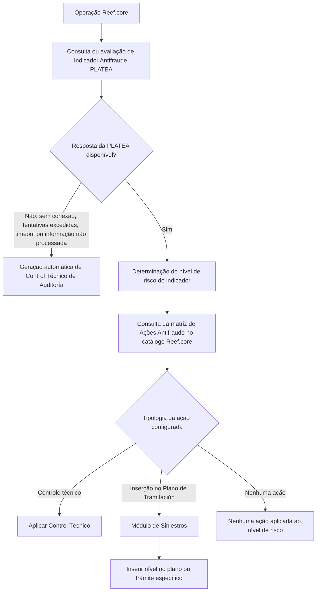

# Definição de Ações Antifraude no Catálogo do Reef.core

## 1. Metadados do Documento
- **Arquivo de Origem:** `Não identificado no conteúdo fornecido`
- **Tipo de Documento:** `Especificação Técnica / Documentação Funcional`
- **Domínio / Sistema:** `Reef.core, PLATEA, Emissão, Siniestros`
- **Público-Alvo:** `Desenvolvedores, Arquitetos, Operação e Negócio`
- **Data/Versão Identificada:** `Não identificada`
- **Owner identificado:** `user:agonzalez_mapfre.com`
- **Lifecycle identificado:** `Approved Source`

---

## 2. Resumo Executivo & Contexto de Negócio

O documento define o catálogo de **Ações Antifraude** do sistema **Reef.core**. O catálogo permite configurar uma matriz que determina quais ações devem ser consideradas pelo sistema conforme o nível de risco atribuído a um indicador antifraude.

A configuração é associada a uma companhia, a um módulo do Reef.core, a uma operação afetada, a um indicador antifraude da PLATEA e a uma ação antifraude. Os módulos explicitamente suportados são **Emissão** e **Siniestros**, identificados pelos valores `EM` e `TS`, respectivamente.

As ações antifraude inicialmente previstas podem inserir elementos no Plano de Tramitación, exclusivamente no módulo de Siniestros, ou gerar Controles Técnicos, aplicáveis aos módulos de Emissão e Siniestros. Também é permitido configurar a ausência de ação para determinado nível de risco quando a entidade assim estabelecer.

O documento define um comportamento de contingência: quando a PLATEA não responder — por indisponibilidade de conexão, esgotamento de tentativas, timeout ou ausência de informação processada sobre o elemento avaliado — o Reef.core gera automaticamente um **Control Técnico de Auditoría**.

A documentação também prevê propriedades de vigência e inabilitação para preservar o histórico de alterações nas definições configuradas no catálogo. O documento recomenda consultar diretrizes e documentos funcionais relacionados para evitar interpretações isoladas ou incorretas.

---

## 3. Arquitetura, Componentes & Tecnologias Envolvidas

### Componentes e domínios identificados

| Componente / Domínio | Papel descrito no documento |
| :--- | :--- |
| **Reef.core** | Sistema que mantém o catálogo de definição da matriz de ações antifraude e executa ações conforme o risco de indicadores. |
| **PLATEA** | Origem dos indicadores antifraude e da classificação de severidade do indicador. |
| **Módulo de Emissão** | Módulo Reef.core identificado pelo valor `EM`; pode utilizar Controles Técnicos. |
| **Módulo de Siniestros** | Módulo Reef.core identificado pelo valor `TS`; pode utilizar Controles Técnicos e inserções no Plano de Tramitación. |
| **Plano de Tramitación** | Estrutura local usada no módulo de Siniestros para inserir níveis ou trâmites específicos. |
| **Control Técnico** | Ação disponível para Emissão e Siniestros; pode possuir severidades conhecidas e suportadas pelo sistema. |
| **Control Técnico de Auditoría** | Controle gerado automaticamente quando não há resposta utilizável da PLATEA. |
| **Tesorería** | Módulo mencionado como possibilidade futura de integração. |
| **Proveedores del Módulo de Terceros** | Área mencionada como possibilidade futura de integração. |

### Fluxo funcional identificado



> **Nota de Análise:** O documento não detalha métodos HTTP, contratos JSON, endpoints, mecanismos de autenticação, banco de dados, filas, protocolos de integração ou a implementação técnica da comunicação entre Reef.core e PLATEA.

---

## 4. Regras de Negócio, Especificações Funcionais & Processos

### 4.1 Objetivo do catálogo de Ações Antifraude

O Reef.core permite configurar, em um catálogo de definição, uma matriz de ações a serem consideradas pelo sistema de acordo com os níveis de risco de um indicador antifraude.

Cada definição deve relacionar:

- Companhia.
- Módulo Reef.core.
- Operação Reef.core afetada.
- Código do Indicador Antifraude da PLATEA.
- Código da Ação Antifraude.
- Nível de risco do indicador.
- Tipologia de ação.
- Propriedades complementares aplicáveis à ação configurada.

### 4.2 Escopo de módulos

Os módulos Reef.core explicitamente indicados são:

- **Emissão:** valor `EM`.
- **Siniestros:** valor `TS`.

A documentação indica que, futuramente, a integração também poderá ser realizada para:

- Módulo de Tesorería.
- Proveedores del Módulo de Terceros.

### 4.3 Nível de risco do indicador

O nível de risco corresponde à classificação usada pela PLATEA para determinar o grau de severidade de um indicador. Os valores possíveis são aqueles configurados no Reef.core.

A definição de Ações Antifraude deve considerar o nível de risco do indicador para determinar a ação aplicável.

### 4.4 Regra de contingência para ausência de resposta da PLATEA

O Reef.core deve gerar automaticamente um **Control Técnico de Auditoría** quando não for obtida resposta da PLATEA devido a qualquer uma das seguintes situações:

1. Não há conexão com a PLATEA.
2. O número de tentativas de conexão foi superado.
3. Ocorreu timeout.
4. A PLATEA ainda não possui informação processada sobre o elemento avaliado.

Os elementos exemplificados como passíveis de avaliação incluem:

- Presupuesto.
- Póliza.
- Siniestro.
- Expediente.
- Outros elementos equivalentes, conforme indicado por “etcétera”.

### 4.5 Tipologias de ação antifraude

Inicialmente, o Reef.core contempla dois tipos de ações:

1. **Inserção de trâmites no Plano de Tramitación**
   - Exclusiva do módulo de Siniestros.
   - Pode ocorrer por inserção de nível ou de trâmite específico.

2. **Controles Técnicos**
   - Aplicáveis aos módulos de Emissão e Siniestros.
   - Podem utilizar quaisquer severidades conhecidas e suportadas pelo sistema.

Também existe a possibilidade de não configurar ação alguma para um nível de risco, quando a entidade assim determinar.

### 4.6 Inserção no Plano de Tramitación

A inserção de trâmites no Plano de Tramitación pode ocorrer das seguintes formas:

1. **Inserção de um nível no Plano de Tramitación**
   - O nível funciona como agrupação de trâmites da mesma natureza.

2. **Inserção de um trâmite específico no Plano de Tramitación**
   - O trâmite deve estar associado ao nível e ao plano configurados.

As propriedades relacionadas ao Plano de Tramitación aplicam-se somente quando:

- A definição corresponde a uma operação do módulo de Siniestros; e
- O tipo de ação configurado requer essas propriedades.

### 4.7 Propriedades exclusivas de Siniestros

As seguintes propriedades afetam exclusivamente indicadores definidos para o módulo de Siniestros:

- **Marca Expediente:** permite etiquetar o expediente como possível fraude.
- **Aviso del Plan de Tramitación:** permite indicar e incluir um aviso que aparecerá no expediente do Siniestro.

### 4.8 Inabilitação e vigência

A propriedade **Inhabilitación** indica que o registro configurado para a Ação Antifraude no catálogo está desativado ou inabilitado para uso.

A propriedade **Fecha de Validez** determina a data a partir da qual o registro configurado para a Ação Antifraude se torna operacional no sistema. O uso correto da data de validade permite manter histórico das alterações efetuadas ao longo do tempo.

---

## 5. Tabelas de Parâmetros, Ambientes e Estruturas de Dados

| Item / Parâmetro | Descrição / Função | Tipo / Valores / Formato | Ambiente / Observações |
| :--- | :--- | :--- | :--- |
| Compañía | Código da companhia para a qual é realizada a definição de Ações Antifraude. | Código de companhia. | Propriedade operativa do catálogo. |
| Módulo Reef.core | Determina o módulo ao qual pertence a operação Reef.core afetada. | `EM` para Emissão; `TS` para Siniestros. | Futuramente poderá integrar Tesorería e Proveedores del Módulo de Terceros. |
| Operación Reef.core | Determina o código da operação Reef.core afetada. | Código de operação. | Propriedade operativa. |
| Código del Indicador Antifraude | Determina o código do indicador antifraude da PLATEA. | Código de indicador. | Associado à PLATEA. |
| Código de la Acción Antifraude | Determina o código da Ação Antifraude. | Código de ação. | Associado à matriz de ações. |
| Nivel de Riesgo del Indicador | Contém a classificação pela qual a PLATEA determina a severidade de um indicador. | Valores configurados no Reef.core. | Usado para selecionar ações antifraude. |
| Tipología de la Acción | Classifica a ação que o Reef.core deve executar conforme o cumprimento do indicador. | Inserção no Plano de Tramitación; Controle Técnico; ausência de ação. | Inserção no plano é exclusiva de Siniestros. |
| Código del Control Técnico | Contém o código de erro de Controle Técnico quando o tipo de ação o determinar. | Código de erro. | Aplicável somente quando a ação for Controle Técnico. |
| Plan de Tramitación | Contém o código de um plano configurado localmente no sistema. | Código de plano. | Somente para operações de Siniestros e quando o tipo de ação determinar. |
| Nivel del Plan de Tramitación | Contém o código de um nível associado ao plano; o nível agrupa trâmites da mesma natureza. | Código de nível. | Somente para operações de Siniestros e quando o tipo de ação determinar. |
| Trámite del Nivel | Pode conter o código de um trâmite associado ao nível e ao plano de tramitación. | Código de trâmite. | Somente para operações de Siniestros e quando o tipo de ação determinar. |
| Marca Expediente | Permite etiquetar o expediente como possível fraude. | Marca / indicação de possível fraude. | Exclusiva para indicadores do módulo de Siniestros. |
| Aviso del Plan de Tramitación | Permite incluir um aviso exibido no expediente do Siniestro. | Aviso. | Exclusiva para indicadores do módulo de Siniestros. |
| Inhabilitación | Indica que o registro de ação antifraude está desativado ou inabilitado. | Estado de inabilitação. | Propriedade adicional do catálogo. |
| Fecha de Validez | Determina a partir de quando o registro configurado passa a estar operativo. | Data. | Suporta histórico de alterações na configuração. |
| Control Técnico de Auditoría | Controle técnico gerado automaticamente quando a PLATEA não fornece resposta utilizável. | Controle automático. | Acionado por indisponibilidade, tentativas excedidas, timeout ou dados não processados. |

---

## 6. Bateria de Perguntas & Respostas para RAG (FAQ Sintético)

### P1: Qual é o objetivo do catálogo de Ações Antifraude do Reef.core?
**R:** O catálogo de Ações Antifraude permite configurar uma matriz que define quais ações o Reef.core deve considerar conforme os níveis de risco de um indicador antifraude. A definição associa companhia, módulo, operação afetada, indicador da PLATEA, ação antifraude, nível de risco e propriedades adicionais aplicáveis.

### P2: Quais módulos Reef.core são suportados na definição de Ações Antifraude?
**R:** O documento identifica os módulos de Emissão, representado por `EM`, e de Siniestros, representado por `TS`. Também informa que, futuramente, a integração poderá incluir o módulo de Tesorería e os Proveedores del Módulo de Terceros.

### P3: O que acontece quando a PLATEA não responde à consulta de um indicador antifraude?
**R:** O Reef.core gera automaticamente um Control Técnico de Auditoría quando não há resposta da PLATEA por falta de conexão, superação do número de tentativas de conexão, timeout ou ausência de informação processada sobre o elemento avaliado, como presupuesto, póliza, siniestro ou expediente.

### P4: Quais tipos de ações antifraude estão inicialmente disponíveis no Reef.core?
**R:** Inicialmente existem dois tipos: inserção de trâmites no Plano de Tramitación, exclusiva do módulo de Siniestros, e Controles Técnicos, utilizáveis pelos módulos de Emissão e Siniestros. Também pode ser configurada a ausência de ação para um nível de risco quando a entidade assim estabelecer.

### P5: Como funciona a inserção no Plano de Tramitación?
**R:** A inserção pode ocorrer por meio da inclusão de um nível no Plano de Tramitación, agrupando trâmites da mesma natureza, ou pela inclusão de um trâmite específico. Essa funcionalidade é exclusiva do módulo de Siniestros.

### P6: Quando os campos Plan de Tramitación, Nivel del Plan de Tramitación e Trámite del Nivel devem ser utilizados?
**R:** Esses campos são aplicáveis somente quando a definição corresponde a uma operação do módulo de Siniestros e quando o tipo de ação configurado assim o determinar. O plano aponta para um Plano de Tramitación configurado localmente; o nível identifica uma agrupação de trâmites; e o trâmite identifica um item associado ao nível e ao plano.

### P7: O que é a propriedade Marca Expediente?
**R:** Marca Expediente é uma propriedade exclusiva dos indicadores definidos para o módulo de Siniestros. Ela permite etiquetar o expediente como possível fraude.

### P8: Para que serve o Aviso del Plan de Tramitación?
**R:** O Aviso del Plan de Tramitación é uma propriedade exclusiva do módulo de Siniestros que permite indicar e incluir um aviso exibido no expediente do Siniestro.

### P9: Qual é a finalidade do Código del Control Técnico?
**R:** O Código del Control Técnico contém o Código de Error de Control Técnico quando a tipologia da ação configurada determina a aplicação de um Controle Técnico.

### P10: Como o catálogo controla a ativação e a vigência de uma configuração?
**R:** A propriedade Inhabilitación indica que o registro da Ação Antifraude está desativado ou inabilitado. A propriedade Fecha de Validez define a data a partir da qual o registro se torna operativo e permite manter histórico das alterações realizadas ao longo do tempo.

### P11: De onde vêm os níveis de risco do indicador antifraude?
**R:** A PLATEA determina o grau de severidade do indicador antifraude. Os valores possíveis para o nível de risco são aqueles configurados no Reef.core.

### P12: O documento define APIs, métodos HTTP ou contratos JSON entre Reef.core e PLATEA?
**R:** Não. O documento descreve regras funcionais e propriedades do catálogo de Ações Antifraude, mas não detalha APIs, métodos HTTP, endpoints, contratos JSON, autenticação ou protocolos de integração.

---

## 7. Glossário de Termos, Siglas & Conceitos-Chave

- **Reef.core:** Sistema que mantém o catálogo de definição da matriz de ações antifraude e executa as ações configuradas.
- **PLATEA:** Sistema ou fonte citada como responsável pelos indicadores antifraude e pela classificação de severidade dos indicadores.
- **EM:** Valor indicado para o módulo de Emissão do Reef.core.
- **TS:** Valor indicado para o módulo de Siniestros do Reef.core.
- **Ação Antifraude:** Ação configurada no Reef.core em função do nível de risco de um indicador antifraude.
- **Indicador Antifraude:** Indicador identificado por código na PLATEA e utilizado na configuração da matriz de ações.
- **Nivel de Riesgo del Indicador:** Classificação de severidade de um indicador determinada pela PLATEA, com valores configurados no Reef.core.
- **Control Técnico:** Tipo de ação antifraude aplicável aos módulos de Emissão e Siniestros.
- **Control Técnico de Auditoría:** Controle técnico criado automaticamente quando não há resposta utilizável da PLATEA.
- **Plan de Tramitación:** Plano configurado localmente no sistema, usado em operações do módulo de Siniestros.
- **Nivel del Plan de Tramitación:** Agrupação de trâmites da mesma natureza associada a um Plano de Tramitación.
- **Trámite:** Item específico que pode ser inserido no Plano de Tramitación.
- **Expediente:** Elemento relacionado ao módulo de Siniestros que pode ser etiquetado como possível fraude e receber avisos.
- **Marca Expediente:** Propriedade que permite etiquetar um expediente como possível fraude.
- **Aviso del Plan de Tramitación:** Aviso que pode ser incluído e exibido no expediente de um Siniestro.
- **Inhabilitación:** Estado que desativa ou inabilita uma configuração de Ação Antifraude.
- **Fecha de Validez:** Data a partir da qual uma configuração de Ação Antifraude passa a estar operativa.

---

## 8. Notas Críticas, Riscos & Limitações

- A indisponibilidade da PLATEA, o timeout, a superação de tentativas de conexão ou a falta de dados processados provocam a geração automática de um **Control Técnico de Auditoría**.
- O documento não informa a severidade específica do Control Técnico de Auditoría gerado automaticamente.
- O documento não detalha o mecanismo técnico de integração entre Reef.core e PLATEA.
- O documento não especifica APIs, URLs, protocolos, contratos de dados, estruturas JSON, banco de dados ou mecanismos de persistência.
- Inserções no Plano de Tramitación são exclusivas do módulo de Siniestros.
- As propriedades Marca Expediente e Aviso del Plan de Tramitación são exclusivas de indicadores do módulo de Siniestros.
- Tesorería e Proveedores del Módulo de Terceros são citados apenas como possibilidades futuras de integração; não há detalhamento funcional ou técnico adicional.
- A documentação recomenda consultar os documentos relacionados — Indicadores Antifraude, Ámbito Indicadores Antifraude, Controles técnicos e Preguntas frecuentes — para evitar interpretação isolada.
- A seção de perguntas frequentes não apresenta recomendação operacional local para codificação, uso e definição da tabela de Ações Antifraude, registrando `N/A`.

---

## 9. Conteúdo Bruto Estruturado (Referência Fiel)

```text
--- [PÁGINA 1 DE 3] ---

DEFINICIÓN de las ACCIONES ANTIFRAUDE
Objetivo
Funcionalmente, Reef.core cuenta con la posibilidad de conformar en un catálogo de denición la matriz de acciones que se tienen que
considerar en el sistema dependiendo de los niveles de riesgo de un indicador.
De acuerdo con su naturaleza:
Propiedades Operativas
Otras Propiedades
Propiedades Operativas
Compañía
Este Atributo del catálogo contiene el código de la compañía sobre la que se está realizando la denición de las Acciones Antifraude.
Módulo Reef.core
Esta Propiedad determina el Módulo de Reef.core al que pertenece la Operación Reef.core afectada pudiendo ser sus valores Emisión o
Siniestros ('EM'/'TS' Respectivamente)
NOTA: A futuro la integración también podrá realizarse para el Módulo de Tesorería y para los Proveedores del Módulo de Terceros.
Operación Reef.core
Esta Propiedad determina el código de la Operación de Reef.core afectada.
Código del Indicador Antifraude
Este Atributo determina el código del Indicador Antifraude de PLATEA.
Código de la Acción Antifraude
Este Atributo determina el código de la Acción Antifraude.
Nivel de Riesgo del Indicador
Esta Propiedad contiene la clasicación con la que PLATEA determina el grado de severidad de un indicador siendo sus posibles valores
aquellos congurados por Reef.core
NOTA: Si no se obtiene una respuesta de PLATEA, ya sea porque no haya conexión, se haya superado el número de intentos de conexión, se
haya producido un timeout o PLATEA no disponga aún de información procesada sobre el elemento a evaluar: presupuesto, póliza, siniestro,
Documentation / DOCUMENTACIÓN Reef
DOCUMENTACIÓN Reef
Mapfredocument
DOCUMENTACIÓN Reef
Owner
user:agonzalez_mapfre.com
Lifecycle
Approved Source
 /
VL
Buscar Inicio Soluciones Arquitecturas APIs Componentes Cloud Documentación Zeus Reef Ayuda
ES

--- [PÁGINA 2 DE 3] ---

expediente, etcétera, se generará automáticamente un Control Técnico de Auditoría.
Tipología de la Acción
Esta Propiedad contiene la clasicación de la acción con la que Reef.core determina las acciones debe realizarse en el sistema y de acuerdo
con el cumplimiento del indicador.
Inicialmente las acciones que se pueden en Reef.core serán de dos tipos:
Inserción de trámites en el Plan de tramitación (Este tipo es exclusivo del módulo de Siniestros)
Controles técnicos (Este tipo sirve tanto para el módulo de Emisión como Siniestros)
La inserción de trámites se podrá realizar mediante:
Inserción de un Nivel en el plan de Tramitación, como agrupación de trámites de la misma naturaleza.
Inserción de un Trámite especíco en el plan de Tramitación.
Los Controles técnicos podrán ser de cualquiera de las severidades conocidas y soportadas en el sistema.
Adicionalmente existirá la posibilidad de no incluir acción alguna en un nivel de riesgo cuando la entidad asó lo establezca.
Código del Control Técnico
Esta Propiedad contendrá el Código de Error de Control Técnico siempre y cuando el tipo de acción así lo determine.
Plan de Tramitación
Solamente en el caso que la denición se corresponda con alguna operación propia del Módulo de siniestros, este Atributo contendrá el
código de uno de los Planes de Tramitación congurados localmente en el Sistema siempre y cuando el tipo de acción así lo determine.
Nivel del Plan de Tramitación
Solamente en el caso que la denición se corresponda con alguna operación propia del Módulo de siniestros, este Atributo contendrá el
código de uno de los Niveles, como agrupación de trámites de la misma naturaleza, asociados al Plan de Tramitación siempre y cuando el
tipo de acción así lo determine.
Trámite del Nivel
Solamente en el caso que la denición se corresponda con alguna operación propia del Módulo de siniestros, este Atributo podrá contener el
código de uno de los Trámites asociados al Nivel y al Plan de Tramitación siempre y cuando el tipo de acción así lo determine.
Marca Expediente
Esta Propiedad afecta exclusivamente a los indicadores denidos para el módulo de siniestros y permite etiquetar como posible fraude el
expediente.
Aviso del Plan de Tramitación
Esta Propiedad afecta exclusivamente a los indicadores denidos para el módulo de siniestros y permite indicar e incluir un aviso que
aparecerá en el expediente del Siniestro.
Otras Propiedades
Inhabilitación
Esta propiedad establece que el Registro congurado para la Acción Antifraude en el Catálogo está desactivado o inhabilitado para ser
utilizado.
Fecha de Validez
Esta propiedad le indica al Sistema la fecha a partir de la cual el registro congurado de la Acción Antifraude está operativo en el sistema por
lo que su correcto uso permite tener un histórico de los cambios efectuados a lo largo del tiempo.
Vínculos

--- [PÁGINA 3 DE 3] ---

Relación de Directrices y Documentos funcionales cuya lectura recomendada para evitar que la interpretación aislada del presente
documento pueda conducir a error.
Indicadores Antifraude
Ámbito Indicadores Antifraude
Controles técnicos
Preguntas frecuentes
(1) ¿Existe alguna recomendación operativa que deba ser tomada en consideración localmente en la codicación, uso y denición de la tabla
de Acciones Antifraude de Reef.core?
N/A
```
