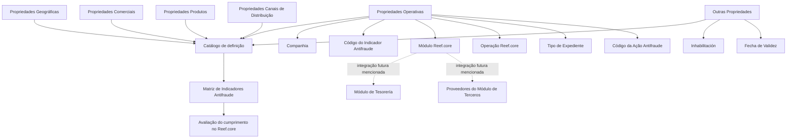

# Definição do Âmbito dos Indicadores Antifraude de PLATEA no Reef.core

## 1. Metadados do Documento
- **Arquivo de Origem:** `Não identificado no conteúdo extraído`
- **Tipo de Documento:** Especificação Técnica / Documento Funcional
- **Domínio / Sistema:** PLATEA, Reef.core, indicadores e ações Antifraude
- **Público-Alvo:** Analistas funcionais, desenvolvedores, arquitetos e equipes de operação/manutenção de catálogo
- **Data/Versão Identificada:** Não identificada
- **Proprietário identificado:** `agonzalez_mapfre.com`
- **Lifecycle identificado:** Approved

---

## 2. Resumo Executivo & Contexto de Negócio

O documento define o âmbito de configuração da matriz de indicadores Antifraude de PLATEA no sistema Reef.core. O mecanismo funcional apresentado permite conformar, em um catálogo de definição, os critérios que delimitam quais indicadores Antifraude e ações Antifraude serão avaliados pelo sistema.

A definição de uma ação Antifraude é composta por propriedades classificadas segundo sua natureza: operativa, geográfica, comercial, de produtos, de canais de distribuição e outras propriedades de controle. Essas propriedades permitem associar uma configuração Antifraude a uma companhia, operação Reef.core, módulo Reef.core, estrutura geográfica, estrutura comercial, produto e canal de distribuição.

O documento destaca que, quando o módulo da definição corresponde ao módulo de Siniestros, o atributo Tipo de Expediente identifica o tipo de expediente afetado pela ação definida. Também registra uma possibilidade futura de integração para o módulo de Tesorería e para provedores do módulo de Terceros, sem detalhar cronograma, interface, contratos ou condições dessa integração.

A manutenção do catálogo é apoiada pelo uso de valores genéricos nas propriedades de estruturas Geográfica, Comercial, Produtos e Canais de Distribuição. Os valores `9999` para campos numéricos e `ZZZZ` para campos alfanuméricos permitem facilitar a manutenção da definição e especializar ações Antifraude para qualquer combinação dos valores dessas estruturas.

O documento também estabelece controles de vigência e disponibilidade: a propriedade Inhabilitación indica que um registro configurado está desativado ou inabilitado, enquanto Fecha de Validez determina a data a partir da qual a configuração se torna operativa, permitindo preservar o histórico de alterações ao longo do tempo.

---

## 3. Arquitetura, Componentes & Tecnologias Envolvidas

Os componentes e conceitos explicitamente mencionados são:

- **PLATEA:** contexto dos indicadores Antifraude.
- **Reef.core:** sistema no qual o catálogo de definição e a avaliação da matriz de indicadores Antifraude são realizados.
- **Catálogo de definição:** catálogo funcional usado para configurar o âmbito da matriz de indicadores Antifraude.
- **Matriz de indicadores Antifraude:** conjunto de indicadores cujo cumprimento será avaliado no sistema.
- **Ação Antifraude:** elemento identificado por código ou chave e configurado no catálogo.
- **Módulo Reef.core:** propriedade que identifica o módulo ao qual pertence a operação Reef.core afetada.
- **Operação Reef.core:** operação afetada pela definição configurada.
- **Módulo de Siniestros:** módulo para o qual o atributo Tipo de Expediente pode ser aplicável.
- **Módulo de Tesorería:** módulo citado como possível alvo de integração futura.
- **Proveedores del Módulo de Terceros:** elemento citado como possível alvo de integração futura.
- **Estruturas de segmentação:** Estrutura Geográfica, Estrutura Comercial, Estrutura de Produtos e Estrutura de Canais de Distribuição.

> **Nota de Análise:** O conteúdo não apresenta tecnologias de implementação, protocolos, APIs, métodos HTTP, contratos JSON, bancos de dados, servidores, URLs, ambientes ou diagramas técnicos de infraestrutura.



---

## 4. Regras de Negócio, Especificações Funcionais & Processos

### 4.1. Regra central do catálogo Antifraude

O Reef.core possui a possibilidade funcional de conformar, em um catálogo de definição, o âmbito da matriz de indicadores Antifraude. O cumprimento desses indicadores será avaliado no sistema.

A definição do âmbito é organizada por natureza de propriedade:

1. Propriedades Operativas.
2. Propriedades Geográficas.
3. Propriedades Comerciais.
4. Propriedades Produtos.
5. Propriedades Canais de Distribuição.
6. Outras Propriedades.

### 4.2. Regras para propriedades operativas

- **Companhia:** contém o código da companhia sobre a qual está sendo realizada a definição das ações Antifraude.
- **Código do Indicador Antifraude:** determina o código ou a chave do Indicador Antifraude de PLATEA.
- **Módulo Reef.core:** determina o módulo Reef.core ao qual pertence a operação Reef.core afetada.
- **Operação Reef.core:** determina o código da operação Reef.core afetada.
- **Tipo de Expediente:** determina o código ou a chave do Tipo de Expediente afetado pela ação definida quando o módulo da definição corresponde ao módulo de Siniestros.
- **Código da Ação Antifraude:** determina o código ou a chave da Ação Antifraude.

### 4.3. Regra de integração futura

O documento informa que, futuramente, a integração também poderá ser realizada para:

- Módulo de Tesorería.
- Proveedores del Módulo de Terceros.

> **Nota de Análise:** O documento não detalha se essa integração futura altera atributos do catálogo, quais operações serão abrangidas, os canais de integração, critérios de ativação ou responsáveis pela implementação.

### 4.4. Regras para propriedades geográficas

A estrutura geográfica é configurada com chaves para quatro níveis e com código postal:

1. **Código do Primeiro Nível:** identifica a chave do primeiro nível da estrutura Geográfica.
2. **Código do Segundo Nível:** identifica especificamente a chave do segundo nível da estrutura Geográfica.
3. **Código do Terceiro Nível:** identifica especificamente a chave do terceiro nível da estrutura Geográfica.
4. **Código do Quarto Nível:** identifica especificamente a chave do quarto nível da estrutura Geográfica.
5. **Código Postal:** contém a chave que identifica o Código Postal associado aos cinco níveis da estrutura geográfica.

### 4.5. Regras para propriedades comerciais

A estrutura comercial é configurada por três níveis:

1. **Chave do Primeiro Nível:** código que identifica o primeiro nível da Estrutura Comercial no sistema.
2. **Chave do Segundo Nível:** código que identifica o segundo nível da Estrutura Comercial no sistema.
3. **Chave do Terceiro Nível:** código que identifica o terceiro nível da Estrutura Comercial no sistema.

### 4.6. Regras para propriedades de produtos

A estrutura de produtos contém:

1. **Sector:** identifica a chave do Setor.
2. **Sub-Sector:** identifica no sistema a chave do Sub-Setor.
3. **Ramo Técnico:** identifica a chave do Ramo Técnico da Estrutura de Produtos da Companhia.

### 4.7. Regras para propriedades de canais de distribuição

A estrutura de canais contém três níveis:

1. **Código do Primeiro Nível:** identifica a chave do primeiro nível da estrutura de canais ou Tipos de Clientes Distribuidores no sistema.
2. **Código do Segundo Nível:** identifica a chave do segundo nível da estrutura de canais ou Agrupaciones no sistema.
3. **Código do Terceiro Nível:** identifica a chave do terceiro nível da estrutura de canais ou Fuentes de Producción no sistema.

### 4.8. Regras de estado e vigência

- **Inhabilitación:** estabelece que o registro configurado para o Indicador Antifraude no catálogo está desativado ou inabilitado para uso.
- **Fecha de Validez:** informa ao sistema a data a partir da qual o registro configurado para o Indicador Antifraude está operativo. O uso correto da data de validade permite manter o histórico das alterações realizadas ao longo do tempo.

### 4.9. Regra de codificação genérica para manutenção e especialização

Nos valores das propriedades das estruturas Geográfica, Comercial, Produtos e Canais de Distribuição, podem ser usados valores genéricos:

- `9999` em campos numéricos.
- `ZZZZ` em campos alfanuméricos.

Esses valores genéricos facilitam a manutenção do catálogo de definição e permitem especializar as ações Antifraude para qualquer combinação dos valores das estruturas aplicáveis.

### 4.10. Documentos relacionados recomendados

O documento recomenda a leitura das seguintes diretrizes e documentos funcionais para evitar interpretações incorretas decorrentes da leitura isolada:

- Definición de Indicadores Antifraude.
- Estructura Geográfica.
- Estructura Comercial.
- Estructura de Productos.
- Estructura de Canales de Distribución.

---

## 5. Tabelas de Parâmetros, Ambientes e Estruturas de Dados

### 5.1. Classificação das propriedades de definição

| Item / Parâmetro | Descrição / Função | Tipo / Valores / Formato | Ambiente / Observações |
| :--- | :--- | :--- | :--- |
| Propriedades Operativas | Delimitam a companhia, indicador, módulo, operação, tipo de expediente e ação Antifraude. | Categoria de propriedades | Aplicável ao catálogo de definição. |
| Propriedades Geográficas | Delimitam a configuração por níveis da estrutura geográfica e código postal. | Categoria de propriedades | Possui quatro níveis explicitamente descritos. |
| Propriedades Comerciais | Delimitam a configuração por níveis da estrutura comercial. | Categoria de propriedades | Possui três níveis explicitamente descritos. |
| Propriedades Produtos | Delimitam a configuração por setor, subsetor e ramo técnico. | Categoria de propriedades | Vinculada à estrutura de produtos da companhia. |
| Propriedades Canais de Distribuição | Delimitam a configuração por níveis de canais, agrupações e fontes de produção. | Categoria de propriedades | Possui três níveis explicitamente descritos. |
| Outras Propriedades | Controlam disponibilidade e vigência de registros. | Categoria de propriedades | Inclui Inhabilitación e Fecha de Validez. |

### 5.2. Propriedades operativas

| Item / Parâmetro | Descrição / Função | Tipo / Valores / Formato | Ambiente / Observações |
| :--- | :--- | :--- | :--- |
| Companhia | Código da companhia sobre a qual se realiza a definição das ações Antifraude. | Código da companhia | Aplicável à definição de ações Antifraude. |
| Código do Indicador Antifraude | Código ou chave do Indicador Antifraude de PLATEA. | Código ou chave | Indicador Antifraude de PLATEA. |
| Módulo Reef.core | Módulo Reef.core ao qual pertence a operação Reef.core afetada. | Módulo | O documento cita integração futura para Tesorería e Proveedores del Módulo de Terceros. |
| Operação Reef.core | Código da operação Reef.core afetada. | Código da operação | Associada ao módulo Reef.core. |
| Tipo de Expediente | Código ou chave do Tipo de Expediente afetado pela ação definida. | Código ou chave | Aplicável quando o módulo da definição corresponde a Siniestros. |
| Código da Ação Antifraude | Código ou chave da Ação Antifraude. | Código ou chave | Parte da configuração do catálogo. |

### 5.3. Propriedades geográficas

| Item / Parâmetro | Descrição / Função | Tipo / Valores / Formato | Ambiente / Observações |
| :--- | :--- | :--- | :--- |
| Código do Primeiro Nível | Chave que identifica o primeiro nível da estrutura Geográfica. | Chave | Estrutura Geográfica. |
| Código do Segundo Nível | Chave que identifica o segundo nível da estrutura Geográfica. | Chave | Estrutura Geográfica. |
| Código do Terceiro Nível | Chave que identifica o terceiro nível da estrutura Geográfica. | Chave | Estrutura Geográfica. |
| Código do Quarto Nível | Chave que identifica o quarto nível da estrutura Geográfica. | Chave | Estrutura Geográfica. |
| Código Postal | Chave que identifica o Código Postal associado aos cinco níveis da estrutura geográfica. | Código Postal | O documento menciona associação aos cinco níveis, embora descreva explicitamente quatro códigos de nível. |

### 5.4. Propriedades comerciais, de produtos e de canais

| Item / Parâmetro | Descrição / Função | Tipo / Valores / Formato | Ambiente / Observações |
| :--- | :--- | :--- | :--- |
| Chave Comercial do Primeiro Nível | Código que identifica o primeiro nível da Estrutura Comercial no sistema. | Código | Estrutura Comercial. |
| Chave Comercial do Segundo Nível | Código que identifica o segundo nível da Estrutura Comercial no sistema. | Código | Estrutura Comercial. |
| Chave Comercial do Terceiro Nível | Código que identifica o terceiro nível da Estrutura Comercial no sistema. | Código | Estrutura Comercial. |
| Sector | Chave do Setor. | Chave | Estrutura de Produtos. |
| Sub-Sector | Chave do Sub-Setor no sistema. | Chave | Estrutura de Produtos. |
| Ramo Técnico | Chave do Ramo Técnico da Estrutura de Produtos da Companhia. | Chave | Estrutura de Produtos. |
| Código de Canal do Primeiro Nível | Chave do primeiro nível da estrutura de canais ou Tipos de Clientes Distribuidores. | Chave | Estrutura de Canais de Distribuição. |
| Código de Canal do Segundo Nível | Chave do segundo nível da estrutura de canais ou Agrupaciones. | Chave | Estrutura de Canais de Distribuição. |
| Código de Canal do Terceiro Nível | Chave do terceiro nível da estrutura de canais ou Fuentes de Producción. | Chave | Estrutura de Canais de Distribuição. |

### 5.5. Controles e valores genéricos

| Item / Parâmetro | Descrição / Função | Tipo / Valores / Formato | Ambiente / Observações |
| :--- | :--- | :--- | :--- |
| Inhabilitación | Indica que o registro configurado para o Indicador Antifraude está desativado ou inabilitado para uso. | Estado de habilitação | Registro do catálogo. |
| Fecha de Validez | Data a partir da qual o registro configurado passa a estar operativo. | Data | Permite manter histórico de mudanças ao longo do tempo. |
| Valor genérico numérico | Valor genérico empregado em propriedades das estruturas aplicáveis. | `9999` | Pode ser usado em campos numéricos. |
| Valor genérico alfanumérico | Valor genérico empregado em propriedades das estruturas aplicáveis. | `ZZZZ` | Pode ser usado em campos alfanuméricos. |

### 5.6. Ambientes, URLs, logs e infraestrutura

| Item / Parâmetro | Descrição / Função | Tipo / Valores / Formato | Ambiente / Observações |
| :--- | :--- | :--- | :--- |
| Ambientes técnicos | Não detalhados. | Não identificado | O conteúdo não fornece DEV, QA, UAT, produção ou equivalente. |
| URLs | Não detalhadas. | Não identificado | O conteúdo não fornece URLs de acesso ou endpoints. |
| Rotas de log | Não detalhadas. | Não identificado | O conteúdo não fornece caminhos, formatos ou níveis de log. |
| Servidores | Não detalhados. | Não identificado | O conteúdo não fornece hosts, portas ou infraestrutura. |
| APIs e contratos | Não detalhados. | Não identificado | O conteúdo não fornece métodos HTTP, payloads ou contratos de integração. |

---

## 6. Bateria de Perguntas & Respostas para RAG (FAQ Sintético)

### P1: Qual é o objetivo do catálogo de definição de indicadores Antifraude no Reef.core?
**R:** O catálogo de definição permite conformar o âmbito da matriz de indicadores Antifraude. O cumprimento dos indicadores configurados nessa matriz será avaliado no sistema Reef.core.

### P2: Quais categorias de propriedades podem compor a definição de uma ação Antifraude?
**R:** A definição pode usar Propriedades Operativas, Propriedades Geográficas, Propriedades Comerciais, Propriedades Produtos, Propriedades Canais de Distribuição e Outras Propriedades.

### P3: Como a companhia é identificada na definição de ações Antifraude?
**R:** A propriedade Companhia contém o código da companhia sobre a qual está sendo realizada a definição das Ações Antifraude.

### P4: Qual propriedade identifica o indicador Antifraude de PLATEA?
**R:** O Código do Indicador Antifraude determina o código ou a chave do Indicador Antifraude de PLATEA.

### P5: Quando o Tipo de Expediente deve ser aplicado na configuração Antifraude?
**R:** O Tipo de Expediente determina o código ou a chave do tipo de expediente afetado pela ação definida quando o módulo da definição corresponde ao módulo de Siniestros.

### P6: Como o documento trata a disponibilidade de uma configuração de Indicador Antifraude?
**R:** A propriedade Inhabilitación estabelece que o registro configurado para o Indicador Antifraude no catálogo está desativado ou inabilitado para uso.

### P7: Qual é a finalidade da Fecha de Validez em um registro Antifraude?
**R:** A Fecha de Validez informa ao sistema a data a partir da qual o registro configurado passa a estar operativo. Seu uso correto permite manter um histórico das mudanças realizadas ao longo do tempo.

### P8: Quais valores genéricos podem ser usados nas estruturas Geográfica, Comercial, Produtos e Canais de Distribuição?
**R:** Podem ser empregados os valores genéricos `9999` para campos numéricos e `ZZZZ` para campos alfanuméricos. Esses valores facilitam a manutenção do catálogo e permitem especializar ações Antifraude para qualquer combinação de valores dessas estruturas.

### P9: Quantos níveis da estrutura geográfica são descritos no documento?
**R:** O documento descreve explicitamente Código do Primeiro Nível, Código do Segundo Nível, Código do Terceiro Nível e Código do Quarto Nível. Também informa que o Código Postal está associado aos cinco níveis da estrutura geográfica.

### P10: Como são representadas as propriedades da estrutura comercial?
**R:** A estrutura comercial possui Chave do Primeiro Nível, Chave do Segundo Nível e Chave do Terceiro Nível. Cada uma contém o código identificador do respectivo nível da Estrutura Comercial no sistema.

### P11: Quais atributos de produto podem delimitar uma ação Antifraude?
**R:** As Propriedades Produtos incluem Sector, Sub-Sector e Ramo Técnico. O Ramo Técnico é identificado como uma chave da Estrutura de Produtos da Companhia.

### P12: Como a estrutura de canais de distribuição é segmentada?
**R:** A estrutura é segmentada em Código do Primeiro Nível, Código do Segundo Nível e Código do Terceiro Nível. Esses níveis correspondem, respectivamente, à estrutura de canais ou Tipos de Clientes Distribuidores, Agrupaciones e Fuentes de Producción.

### P13: Quais integrações futuras são citadas para além do módulo Reef.core atualmente tratado?
**R:** O documento informa que, futuramente, a integração também poderá ser realizada para o Módulo de Tesorería e para os Proveedores del Módulo de Terceros. Não são detalhados mecanismos, interfaces ou cronograma dessa integração.

### P14: Que documentos devem ser consultados para evitar interpretação isolada da definição de indicadores Antifraude?
**R:** O documento recomenda consultar Definición de Indicadores Antifraude, Estructura Geográfica, Estructura Comercial, Estructura de Productos e Estructura de Canales de Distribución.

---

## 7. Glossário de Termos, Siglas & Conceitos-Chave

- **PLATEA:** contexto no qual existe o Indicador Antifraude mencionado no documento.
- **Reef.core:** sistema que permite conformar o catálogo de definição e avaliar o cumprimento da matriz de indicadores Antifraude.
- **Indicador Antifraude:** indicador de PLATEA identificado por código ou chave e avaliado no Reef.core.
- **Ação Antifraude:** ação identificada por código ou chave, configurada no catálogo de definição.
- **Catálogo de definição:** catálogo usado para configurar o âmbito de avaliação da matriz de indicadores Antifraude.
- **Matriz de Indicadores Antifraude:** matriz cujo cumprimento será avaliado no sistema.
- **Módulo Reef.core:** módulo do Reef.core ao qual pertence a operação afetada.
- **Operação Reef.core:** operação afetada pela definição configurada.
- **Siniestros:** módulo citado como condição de aplicação do Tipo de Expediente.
- **Tipo de Expediente:** código ou chave do tipo de expediente afetado por uma ação definida no contexto do módulo de Siniestros.
- **Tesorería:** módulo mencionado como possibilidade de integração futura.
- **Proveedores del Módulo de Terceros:** provedores do módulo de Terceros, mencionados como possibilidade de integração futura.
- **Estructura Geográfica:** estrutura segmentada em níveis geográficos e Código Postal.
- **Estructura Comercial:** estrutura segmentada em três níveis comerciais.
- **Estructura de Productos:** estrutura que inclui Sector, Sub-Sector e Ramo Técnico.
- **Estructura de Canales de Distribución:** estrutura de canais com níveis associados a Tipos de Clientes Distribuidores, Agrupaciones e Fuentes de Producción.
- **Inhabilitación:** propriedade que indica que um registro está desativado ou inabilitado para utilização.
- **Fecha de Validez:** data a partir da qual um registro configurado fica operativo no sistema.
- **Valores genéricos:** valores `9999` e `ZZZZ` usados para facilitar manutenção e especialização do catálogo.

---

## 8. Notas Críticas, Riscos & Limitações

- O conteúdo não identifica o nome do arquivo de origem, data, versão documental ou responsável funcional além da referência de owner `agonzalez_mapfre.com`.
- Não há detalhamento de APIs, métodos HTTP, eventos, contratos de integração, bancos de dados, tecnologias, endpoints, URLs, credenciais, logs, servidores ou ambientes.
- A integração futura com o Módulo de Tesorería e com os Proveedores del Módulo de Terceros é apenas mencionada; não há definição de escopo, dependências, cronograma ou implementação.
- O Código Postal é descrito como associado aos cinco níveis da estrutura geográfica, mas o texto apresenta explicitamente apenas Código do Primeiro, Segundo, Terceiro e Quarto Nível. O quinto nível não é especificado.
- Os tipos de dados, tamanhos, obrigatoriedade, cardinalidade e regras de validação dos atributos não são informados.
- O documento recomenda a leitura de documentos funcionais relacionados para evitar erros de interpretação isolada. Portanto, a configuração deve ser analisada juntamente com as definições de indicadores e das estruturas Geográfica, Comercial, Produtos e Canais de Distribuição.
- Não são apresentados critérios sobre precedência entre configurações específicas e configurações que utilizem `9999` ou `ZZZZ`.

---

## 9. Conteúdo Bruto Estruturado (Referência Fiel)

```text
--- [PÁGINA 1 DE 3] ---

DEFINICIÓN del ÁMBITO de los INDICADORES ANTIFRAUDE de
PLATEA
Objetivo
Funcionalmente, Reef.core cuenta con la posibilidad de conformar en un catálogo de denición el ámbito de la matriz de indicadores
Antifraude cuyo cumplimiento va a ser evaluado en el sistema.
De acuerdo con su naturaleza:
Propiedades Operativas
Propiedades Geográcas
Propiedades Comerciales
Propiedades Productos
Propiedades Canales de Distribución
Otras Propiedades
Propiedades Operativas
Compañía
Este Atributo del catálogo contiene el código de la compañía sobre la que se está realizando la denición de las Acciones Antifraude.
Código del Indicador Antifraude
Este Atributo determina el código o clave del Indicador Antifraude de PLATEA.
Módulo Reef.core
Esta Propiedad determina el Módulo de Reef.core al que pertenece la Operación Reef.core afectada.
NOTA: A futuro la integración también podrá realizarse para el Módulo de Tesorería y para los Proveedores del Módulo de Terceros.
Operación Reef.core
Esta Propiedad determina el código de la Operación de Reef.core afectada.
Tipo de Expediente
Este Atributo determina el código o clave del Tipo de Expediente afecto a la acción denida en el caso que el módulo de la denición
corresponda al módulo de Siniestros.
Documentation / DOCUMENTACIÓN Reef
DOCUMENTACIÓN Reef
Mapfredocument
DOCUMENTACIÓN Reef
Owner
user:agonzalez_mapfre.com
Lifecycle
Approved Source
 / 
 VL
Buscar Inicio Soluciones Arquitecturas APIs Componentes Cloud Documentación Zeus Reef Ayuda
ES


--- [PÁGINA 2 DE 3] ---

Código de la Acción Antifraude
Este Atributo determina el código o clave de la Acción Antifraude.
Propiedades Geográcas
Código del Primer Nivel
Este atributo contiene la clave que identicará al Primer Nivel de la estructura Geográca.
Código del Segundo Nivel
Este atributo identica especícamente la clave que identicará al Segundo Nivel de la estructura Geográca.
Código del Tercer Nivel
Este atributo identica especícamente la clave que identicará al Tercer Nivel de la estructura Geográca.
Código del Cuarto Nivel
Este atributo identica especícamente la clave que identicará al Cuarto Nivel de la estructura Geográca.
Código Postal
Esta Propiedad contiene la clave que identica el Código Postal asociado a los cinco niveles de la estructura geográca.
Propiedades Comerciales
Clave del Primer Nivel
Este atributo contiene el código por el que se identica el Primer Nivel de la Estructura Comercial en el Sistema.
Clave del Segundo Nivel
Este atributo contiene el código por el que se identica el Segundo Nivel de la Estructura Comercial en el Sistema.
Clave del Tercer Nivel
Este atributo contiene el código por el que se identica el Tercer Nivel de la Estructura Comercial en el Sistema.
Propiedades Productos
Sector
Esta propiedad identica la clave del Sector.
Sub-Sector
Este atributo identica en el sistema la clave del Sub-Sector.
Ramo Técnico
Esta propiedad identica la clave del Ramo Técnico de la Estructura de Productos de la Compañía.
Propiedades Canales
Código del Primer Nivel
Este atributo identica la clave del Primer Nivel de la estructura de canales o Tipos de Clientes Distribuidores en el Sistema.
Código del Segundo Nivel
Este atributo identica la clave del Segundo Nivel de la estructura de canales o Agrupaciones en el Sistema:
Código del Tercer Nivel


--- [PÁGINA 3 DE 3] ---

Este atributo identicará la clave del Tercer Nivel de la estructura de canales o Fuentes de Producción en el Sistema.
Otras Propiedades
Inhabilitación
Esta propiedad establece que el Registro congurado para el Indicador Antifraude en el Catálogo está desactivado o inhabilitado para ser
utilizado.
Fecha de Validez
Esta propiedad le indica al Sistema la fecha a partir de la cual el registro congurado para el Indicador Antifraude está operativo en el sistema
por lo que su correcto uso permite tener un histórico de los cambios efectuados a lo largo del tiempo.
Vínculos
Relación de Directrices y Documentos funcionales cuya lectura recomendada para evitar que la interpretación aislada del presente
documento pueda conducir a error.
Denición de Indicadores Antifraude
Estructura Geográca
Estructura Comercial
Estructura de Productos
Estructura de Canales de Distribución
Preguntas frecuentes
(1) ¿Existe alguna consideración operativa que deba ser tomada en consideración localmente en la codicación, uso y denición de la tabla
de Acciones Antifraude en Reef.core?
En los valores de las diferentes Propiedades de las estructuras Geográca, Comercial, Productos y Canales de Distribución se pueden
emplear los valores genéricos (9999 ó ZZZZ en campos numéricos o alfanuméricos respectivamente) que facilitan el mantenimiento del
catálogo de denición y permiten a su vez especializar las acciones Antifraude para cualquier combinación de sus valores.
```
