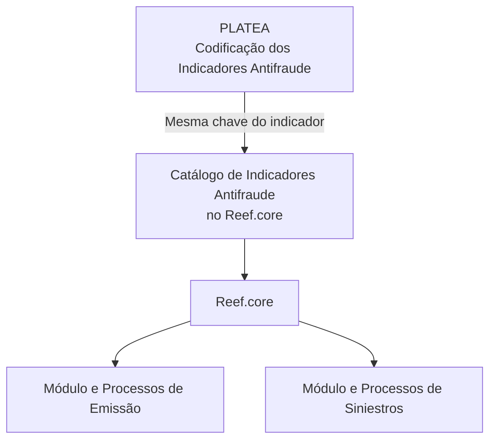

# Definição dos Indicadores Antifraude de PLATEA no Reef.core

## 1. Metadados do Documento
- **Arquivo de Origem:** Não identificado no conteúdo fornecido
- **Tipo de Documento:** Especificação Técnica
- **Domínio / Sistema:** Reef.core, PLATEA, Indicadores Antifraude
- **Público-Alvo:** Não identificado
- **Data/Versão Identificada:** Não identificada

---

## 2. Resumo Executivo & Contexto de Negócio

O documento define a configuração da matriz de **Indicadores Antifraude** no sistema **Reef.core**, utilizando a codificação de indicadores previamente realizada na plataforma **PLATEA**, em um catálogo específico de informações.

A regra central de integração funcional determina que a chave atribuída a cada Indicador Antifraude em PLATEA deve ser exatamente a mesma chave declarada em Reef.core. Essa chave compartilhada é o mecanismo de emparelhamento entre as duas plataformas.

O catálogo não precisa reproduzir necessariamente todos os indicadores existentes em PLATEA. Devem ser definidos em Reef.core apenas os indicadores capazes de gerar algum tipo de ação dentro do sistema.

Cada indicador pode ser qualificado para uso nos módulos e processos de **Emissão** e de **Siniestros** do Reef.core. O catálogo também suporta controle de inabilitação e de validade temporal, permitindo preservar o histórico de alterações ao longo do tempo.

---

## 3. Arquitetura, Componentes & Tecnologias Envolvidas

| Componente / Sistema | Papel descrito |
| :--- | :--- |
| **PLATEA** | Plataforma que realiza a codificação dos Indicadores Antifraude. |
| **Reef.core** | Sistema que configura a matriz de Indicadores Antifraude em catálogo específico e utiliza os indicadores em seus módulos e processos. |
| **Catálogo de Indicadores Antifraude** | Estrutura de informação onde os indicadores são definidos, descritos, qualificados por módulo e controlados por validade ou inabilitação. |
| **Módulo de Emissão** | Módulo e processos do Reef.core que podem utilizar indicadores qualificados para emissão. |
| **Módulo de Siniestros** | Módulo e processos do Reef.core que podem utilizar indicadores qualificados para sinistros. |



**Nota de Análise:** o conteúdo fornecido não detalha interfaces técnicas, métodos HTTP, contratos JSON, banco de dados, tecnologias de implementação ou mecanismos automáticos de sincronização entre PLATEA e Reef.core.

---

## 4. Regras de Negócio, Especificações Funcionais & Processos

### 4.1 Configuração da matriz de indicadores

1. Reef.core permite configurar uma matriz de Indicadores Antifraude.
2. A matriz é formada conforme a codificação dos indicadores realizada em PLATEA.
3. A configuração é realizada em um catálogo de informação específico.
4. Não é obrigatório cadastrar em Reef.core 100% dos indicadores existentes em PLATEA.
5. Devem ser definidos somente os indicadores que possam gerar algum tipo de ação em Reef.core.

### 4.2 Regra de correspondência entre plataformas

1. PLATEA atribui uma chave ou código a cada Indicador Antifraude.
2. Reef.core deve declarar exatamente a mesma chave para o Indicador Antifraude correspondente.
3. A chave compartilhada é utilizada para emparelhar PLATEA e Reef.core.
4. A codificação realizada por PLATEA deve ser respeitada na configuração dos indicadores em Reef.core.

### 4.3 Qualificação por módulo

- O atributo **Empleo en el Módulo de Emisión** qualifica o Indicador Antifraude para uso no Módulo e nos Processos de Emissão do Reef.core.
- O atributo **Empleo en el Módulo de Siniestros** qualifica o Indicador Antifraude para uso no Módulo e nos Processos de Siniestros do Reef.core.

### 4.4 Controle operacional e histórico

- O atributo **Inhabilitación** informa que o registro configurado para o Indicador Antifraude está desativado ou inabilitado para uso.
- O atributo **Fecha de Validez** informa ao sistema a data a partir da qual o registro configurado fica operacional.
- O uso correto da data de validade permite manter um histórico das alterações realizadas ao longo do tempo.

---

## 5. Tabelas de Parâmetros, Ambientes e Estruturas de Dados

| Item / Parâmetro | Descrição / Função | Tipo / Valores / Formato | Ambiente / Observações |
| :--- | :--- | :--- | :--- |
| Compañía | Código da companhia sobre a qual está sendo definida a configuração dos Indicadores Antifraude. | Código de companhia | Catálogo de Indicadores Antifraude do Reef.core |
| Idioma | Chave do idioma usada na configuração da categoria do fornecedor. | Exemplos citados: espanhol, inglês, turco | Também orienta a descrição do indicador |
| Código del Indicador Antifraude | Código ou chave do Indicador Antifraude de PLATEA. | Exemplo: `IND-1`, `IND-7`, `IND-9` | Deve ser idêntico em PLATEA e Reef.core |
| Descripción del Indicador Antifraude | Denominação ou descrição do Indicador Antifraude de PLATEA conforme o idioma usado na definição. | Texto | Exemplo apresentado em espanhol |
| Empleo en el Módulo de Emisión | Qualifica o indicador para uso no módulo e processos de Emissão do Reef.core. | Propriedade de qualificação | Sem valores permitidos detalhados |
| Empleo en el Módulo de Siniestros | Qualifica o indicador para uso no módulo e processos de Siniestros do Reef.core. | Propriedade de qualificação | Sem valores permitidos detalhados |
| Inhabilitación | Determina que o registro configurado está desativado ou inabilitado para uso. | Propriedade de estado | Catálogo de Indicadores Antifraude |
| Fecha de Validez | Data a partir da qual o registro configurado está operacional no sistema. | Data | Permite histórico de mudanças |

| Código do Indicador | Descrição apresentada |
| :--- | :--- |
| `IND-1` | Robo de las Ruedas del Vehículo sin Utilización de Grúa |
| `IND-7` | Matrícula Asegurada con Anomalías Anteriores |
| `IND-9` | Vehículo Asegurado con Siniestro Total y sin Perjudicados |

---

## 6. Bateria de Perguntas & Respostas para RAG (FAQ Sintético)

### P1: Qual é o objetivo da configuração de Indicadores Antifraude no Reef.core?
**R:** O objetivo é permitir que Reef.core configure uma matriz de Indicadores Antifraude em um catálogo específico, de acordo com a codificação dos indicadores realizada na plataforma PLATEA.

### P2: O código do Indicador Antifraude pode ser diferente em PLATEA e Reef.core?
**R:** Não. A chave ou código atribuído ao indicador em PLATEA deve ser exatamente o mesmo declarado em Reef.core, pois essa chave é utilizada para emparelhar as duas plataformas.

### P3: É obrigatório cadastrar em Reef.core todos os Indicadores Antifraude existentes em PLATEA?
**R:** Não. O documento indica que provavelmente não é necessário definir 100% dos indicadores existentes em PLATEA. Devem ser definidos os indicadores que possam gerar algum tipo de ação em Reef.core.

### P4: Para que serve o atributo Compañía no catálogo de Indicadores Antifraude?
**R:** O atributo Compañía contém o código da companhia para a qual está sendo realizada a definição dos Indicadores Antifraude.

### P5: Como o idioma influencia a configuração de um Indicador Antifraude?
**R:** O atributo Idioma contém a chave do idioma utilizada na configuração. A descrição do Indicador Antifraude é definida de acordo com o idioma utilizado na definição, com exemplos como espanhol, inglês e turco.

### P6: O que significa Empleo en el Módulo de Emisión?
**R:** Essa propriedade qualifica o Indicador Antifraude para utilização no Módulo e nos Processos de Emissão do Reef.core.

### P7: O que significa Empleo en el Módulo de Siniestros?
**R:** Essa propriedade qualifica o Indicador Antifraude para utilização no Módulo e nos Processos de Siniestros do Reef.core.

### P8: O que acontece quando um indicador possui a propriedade Inhabilitación?
**R:** A propriedade Inhabilitación estabelece que o registro configurado para o Indicador Antifraude no catálogo está desativado ou inabilitado para ser utilizado.

### P9: Qual é a função da Fecha de Validez de um Indicador Antifraude?
**R:** A Fecha de Validez indica a data a partir da qual o registro configurado para o Indicador Antifraude passa a estar operacional no sistema. O uso dessa data permite manter um histórico das mudanças realizadas ao longo do tempo.

### P10: Qual recomendação operacional deve ser seguida localmente na codificação e definição dos indicadores?
**R:** Deve-se respeitar a codificação realizada por PLATEA durante a configuração dos Indicadores Antifraude no Reef.core.

---

## 7. Glossário de Termos, Siglas & Conceitos-Chave

- **PLATEA:** Plataforma responsável pela codificação dos Indicadores Antifraude mencionados no documento.
- **Reef.core:** Sistema que configura e utiliza a matriz de Indicadores Antifraude em catálogo específico.
- **Indicador Antifraude:** Registro identificado por um código ou chave de PLATEA, configurado no catálogo do Reef.core e potencialmente utilizado para gerar ações.
- **Catálogo:** Estrutura de informação específica usada para definir a matriz de Indicadores Antifraude no Reef.core.
- **Emisión:** Módulo e processos de Emissão do Reef.core.
- **Siniestros:** Módulo e processos de Siniestros do Reef.core.
- **Inhabilitación:** Propriedade que indica que um registro está desativado ou inabilitado para uso.
- **Fecha de Validez:** Data a partir da qual o registro configurado fica operacional no sistema.

---

## 8. Notas Críticas, Riscos & Limitações

- A divergência entre o código configurado em PLATEA e o código declarado no Reef.core impede o emparelhamento previsto entre as plataformas.
- O documento não define valores permitidos, formato técnico, obrigatoriedade ou comportamento operacional detalhado para os atributos de qualificação de Emissão e Siniestros.
- O documento não informa como Reef.core recebe, consulta ou sincroniza os dados codificados em PLATEA.
- O documento não detalha quais ações são geradas por cada Indicador Antifraude dentro do Reef.core.
- Os documentos relacionados recomendados são: **Ámbito Indicadores Antifraude** e **Acciones Antifraude**. A leitura isolada deste documento pode levar a interpretações incorretas.
- **Nota de Análise:** não foram identificadas versões, datas, URLs, ambientes, endpoints, servidores, contratos de integração ou detalhes de implementação técnica no conteúdo fornecido.

---

## 9. Conteúdo Bruto Estruturado (Referência Fiel)

```text
--- [PÁGINA 1 DE 2] ---

DEFINICIÓN de los INDICADORES ANTIFRAUDE de PLATEA
Objetivo
Funcionalmente, Reef.core cuenta con la posibilidad de conformar la matriz de los Indicadores Antifraude de acuerdo con la codicación de
los mismos realizada en PLATEA en un catálogo de información especíco.
Propiedades Operativas
Otras Propiedades
Propiedades Operativas
Compañía
Este Atributo del catálogo contiene el código de la compañía sobre la que se está realizando la denición de los indicadores Antifraude.
Idioma
Este Atributo contiene la clave del Idioma empleado en la conguración de la Categoría del Proveedor como por ejemplo: español, inglés,
turco, ...
Código del Indicador Antifraude
Este Atributo determina el código o clave del Código del Indicador Antifraude de PLATEA.
A destacar que solamente se deben denir aquellos indicadores que puedan generar algún tipo de acción en Reef.core, es decir,
probablemente no haya que denir el 100% de los indicadores que existen en PLATEA.
También es importante resaltar que la clave dada en PLATEA para un indicador, deberá ser la misma que la que se declare en Reef.core, ya
que esta clave será la utilizada para emparejar ambas Plataformas.
Descripción del Indicador Antifraude
Esta propiedad contiene la denominación o descripción del Indicador Antifraude de PLATEA de acuerdo con el idioma utilizado en la
denición.
A modo de ejemplo y si el idioma de la denición es el español...
INDICADOR DESCRIPCIÓN
IND-1 Robo de las Ruedas del Vehículo sin Utilización de Grúa
Documentation / DOCUMENTACIÓN Reef
DOCUMENTACIÓN Reef
Mapfredocument
DOCUMENTACIÓN Reef
Owner
user:agonzalez_mapfre.com
Lifecycle
Approved Source
 / 
 VL
Buscar Inicio Soluciones Arquitecturas APIs Componentes Cloud Documentación Zeus Reef Ayuda
ES


--- [PÁGINA 2 DE 2] ---

INDICADOR DESCRIPCIÓN
IND-7 Matrícula Asegurada con Anomalías Anteriores
IND-9 Vehículo Asegurado con Siniestro Total y sin Perjudicados
... ...
Empleo en el Módulo de Emisión
Esta propiedad del catálogo calica al Indicador Antifraude para su empleo en el Módulo y Procesos de Emisión de Reef.core.
Empleo en el Módulo de Siniestros
Esta propiedad del catálogo calica al Indicador Antifraude para su empleo en el Módulo y Procesos de Siniestros de Reef.core.
Otras Propiedades
Inhabilitación
Esta propiedad establece que el Registro congurado para el Indicador Antifraude en el Catálogo está desactivado o inhabilitado para ser
utilizado.
Fecha de Validez
Esta propiedad le indica al Sistema la fecha a partir de la cual el registro congurado para el Indicador Antifraude está operativo en el sistema
por lo que su correcto uso permite tener un histórico de los cambios efectuados a lo largo del tiempo.
Vínculos
Relación de Directrices y Documentos funcionales cuya lectura recomendada para evitar que la interpretación aislada del presente
documento pueda conducir a error.
Ámbito Indicadores Antifraude
Acciones Antifraude
Preguntas frecuentes
(1) ¿Existe alguna recomendación operativa que deba ser tomada en consideración localmente en la codicación, uso y denición de la tabla
de Indicadores Antifraude de PLATEA?
Se debe respetar la codicación realizada por PLATEA en la conguración de los indicadores de Reef.core.
```
