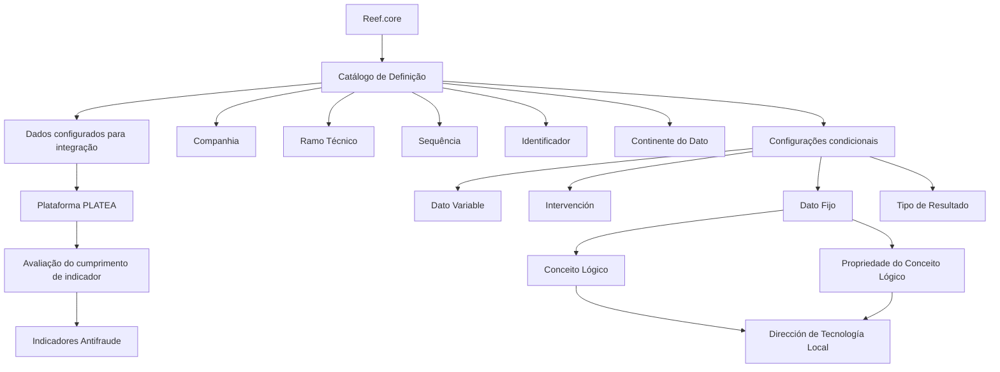

# Definição dos Dados do Serviço PLATEA — Processo de Emissão no Reef.core

## 1. Metadados do Documento
- **Arquivo de Origem:** Não identificado no conteúdo fornecido
- **Tipo de Documento:** Especificação Técnica / Documentação Funcional
- **Domínio / Sistema:** Reef.core, Plataforma PLATEA, Indicadores Antifraude, Processo de Emissão
- **Público-Alvo:** Desenvolvedores, Arquitetos, Operação, Tecnologia Local e áreas responsáveis por Indicadores Antifraude
- **Data/Versão Identificada:** Não identificada

---

## 2. Resumo Executivo & Contexto de Negócio

O documento define os dados necessários para integrar o sistema **Reef.core** à **Plataforma PLATEA** durante o Processo de Emissão. A configuração é realizada por meio de um catálogo de informações específicas no Reef.core.

A finalidade funcional do catálogo é permitir a definição dos dados necessários para que a integração com a Plataforma PLATEA avalie o cumprimento de determinado indicador. O contexto indicado relaciona-se a **Indicadores Antifraude**.

A especificação descreve propriedades operativas e condicionais para a definição de dados. Algumas propriedades aplicam-se a todos os registros, como Companhia, Ramo Técnico, Sequência, Identificador e Continente do Dato. Outras propriedades dependem da tipologia do dado configurado, incluindo Dato Variable, Intervención, Dato Fijo e Tipo de Resultado.

Para dados do tipo intervenção, a configuração pode identificar a figura de intervenção, determinar se a intervenção é principal e informar se corresponde à intervenção usada para cálculo das primas das coberturas. Para dados do tipo dado fixo, a origem da informação é definida por Conceito Lógico e Propriedade do Conceito Lógico.

O documento atribui à **Dirección de Tecnología Local** a responsabilidade e competência pela definição dos valores de Conceito Lógico e Propriedade do Conceito Lógico. Também define o comportamento do resultado de consultas como detalhe ou acumulado.

---

## 3. Arquitetura, Componentes & Tecnologias Envolvidas

Os componentes e domínios explicitamente citados são:

- **Reef.core:** sistema que permite configurar, em catálogo específico, os dados necessários para a integração.
- **Catálogo de Definição:** catálogo que contém os atributos usados para definir dados de integração e avaliação.
- **Plataforma PLATEA:** plataforma integrada ao Reef.core para avaliação do cumprimento de indicadores.
- **Processo de Emissão:** processo ao qual a tabela de Serviços de PLATEA está associada.
- **Indicadores Antifraude:** domínio funcional citado como contexto para a definição dos indicadores.
- **Dirección de Tecnología Local:** área responsável pela atribuição de valores de Conceito Lógico e Propriedade do Conceito Lógico.
- **Estrutura de Produtos da Companhia:** referência usada para a identificação do Ramo Técnico.
- **Coberturas:** referência para a intervenção usada no cálculo de primas.



> **Nota de Análise:** O documento descreve a integração entre Reef.core e a Plataforma PLATEA, mas não detalha protocolos, métodos HTTP, contratos JSON, mecanismos de autenticação, endpoints, versões, ambientes, servidores ou tratamento técnico de erros.

---

## 4. Regras de Negócio, Especificações Funcionais & Processos

### 4.1 Objetivo funcional do catálogo

O Reef.core possui a possibilidade de configurar em um catálogo de informação específico todos os dados necessários para integrar-se à Plataforma PLATEA e avaliar o cumprimento de determinado indicador.

### 4.2 Identificação da companhia e do produto

1. O atributo **Compañía** contém o código da companhia sobre a qual está sendo realizada a definição dos indicadores Antifraude.
2. A propriedade **Ramo Técnico** identifica a chave do Ramo Técnico da Estrutura de Produtos da Companhia.
3. O atributo **Secuencia** é um número sequencial consecutivo.

### 4.3 Identificação e tipologia dos dados de integração

1. A propriedade **Identificador** contém a chave do identificador do atributo definido na PLATEA.
2. O documento fornece como exemplo o identificador `ID-Contratante`, usado para identificar o dado do Tomador do Seguro.
3. A propriedade **Continente del Dato** determina a tipologia do dado no Reef.core para formar o JSON de integração com a PLATEA.
4. Os valores possíveis de Continente del Dato são os valores configurados corporativamente.

### 4.4 Regras condicionais para Dato Variable

1. O atributo **Dato Variable** aplica-se quando o valor do tipo do conteúdo é um dado variável.
2. Nesse caso, Dato Variable identifica o nome do Dato Variable.

### 4.5 Regras condicionais para Intervención

1. O atributo **Intervención** aplica-se quando o dado é do tipo intervenção.
2. Intervención detalha a figura associada ao dado, com exemplos como Tomador, Beneficiario e Conductor.
3. A propriedade **Intervención Principal** aplica-se unicamente quando o dado é do tipo intervenção.
4. Intervención Principal indica se a intervenção é ou não a intervenção principal.
5. A propriedade **Intervención Cálculo** aplica-se unicamente quando o dado é do tipo intervenção.
6. Intervención Cálculo indica se a intervenção é aquela pela qual são calculadas as primas das Coberturas.

### 4.6 Regras condicionais para Dato Fijo

1. O atributo **Concepto Lógico** aplica-se quando o dado é do tipo Dato Fijo.
2. Concepto Lógico detalha a procedência do conceito lógico no qual reside a informação.
3. O atributo **Propiedad del Concepto Lógico** aplica-se quando o dado é do tipo Dato Fijo.
4. Propiedad del Concepto Lógico detalha a propriedade específica do conceito lógico onde reside a informação.
5. A responsabilidade e competência pela atribuição dos valores de Concepto Lógico e Propiedad del Concepto Lógico são da **Dirección de Tecnología Local**.

### 4.7 Regra de Tipo de Resultado

1. A propriedade **Tipo de Resultado** determina se o resultado da consulta é detalhe ou acumulado.
2. Quando o Tipo de Resultado é **detalle**, se a consulta devolver mais de uma fila, a saída será composta por cada uma das filas retornadas.
3. Quando o Tipo de Resultado é **acumulado**, se a consulta devolver várias filas, a saída será a soma dos resultados.

### 4.8 Documentos e diretrizes relacionadas

O documento recomenda a leitura de diretrizes e documentos funcionais relacionados para evitar que uma interpretação isolada conduza a erro:

- Indicadores Antifraude
- Ámbito Indicadores Antifraude
- Acciones Antifraude
- Preguntas frecuentes

### 4.9 Recomendação operacional local

A pergunta frequente sobre recomendação operacional local para codificação, uso e definição da tabela de Serviços de PLATEA para o Processo de Emissão possui a resposta:

- **N/A**

> **Nota de Análise:** O documento não apresenta recomendações operacionais locais adicionais para codificação, uso ou definição da tabela de Serviços de PLATEA no Processo de Emissão.

---

## 5. Tabelas de Parâmetros, Ambientes e Estruturas de Dados

| Item / Parâmetro | Descrição / Função | Tipo / Valores / Formato | Ambiente / Observações |
| :--- | :--- | :--- | :--- |
| Compañía | Contém o código da companhia sobre a qual é realizada a definição dos indicadores Antifraude. | Código de companhia; formato não detalhado. | Associado à definição de Indicadores Antifraude. |
| Ramo Técnico | Identifica a chave do Ramo Técnico da Estrutura de Produtos da Companhia. | Chave; formato não detalhado. | Relacionado à Estrutura de Produtos da Companhia. |
| Secuencia | Define um número sequencial consecutivo. | Número sequencial consecutivo. | Não detalha valor inicial, tamanho ou reinicialização. |
| Identificador | Contém a chave do identificador do atributo definido na PLATEA. | Chave de identificador; exemplo: `ID-Contratante`. | `ID-Contratante` é citado para identificar o dado do Tomador do Seguro. |
| Continente del Dato | Determina a tipologia do dado no Reef.core para conformar o JSON de integração com a PLATEA. | Valores configurados corporativamente. | Valores concretos não são apresentados. |
| Dato Variable | Identifica o nome do dado variável. | Nome de Dato Variable; formato não detalhado. | Aplicável se o valor do tipo do conteúdo for dado variável. |
| Intervención | Detalha a figura associada a um dado do tipo intervenção. | Exemplos: Tomador, Beneficiario, Conductor. | Aplicável quando o dado for do tipo intervenção. |
| Intervención Principal | Indica se a intervenção é a intervenção principal. | Indicador booleano ou equivalente não detalhado. | Aplicável unicamente a dado do tipo intervenção. |
| Intervención Cálculo | Indica se a intervenção é aquela pela qual são calculadas as primas das Coberturas. | Indicador booleano ou equivalente não detalhado. | Aplicável unicamente a dado do tipo intervenção. |
| Concepto Lógico | Detalha a procedência do conceito lógico onde reside a informação. | Conceito lógico; formato não detalhado. | Aplicável a Dato Fijo. Valor atribuído sob responsabilidade da Dirección de Tecnología Local. |
| Propiedad del Concepto Lógico | Detalha a propriedade específica do conceito lógico onde reside a informação. | Propriedade de conceito lógico; formato não detalhado. | Aplicável a Dato Fijo. Valor atribuído sob responsabilidade da Dirección de Tecnología Local. |
| Tipo de Resultado | Estabelece se o resultado da consulta é detalhe ou acumulado. | `detalle` ou `acumulado`. | Detalle retorna cada fila; acumulado retorna a soma quando houver várias filas. |

### Comportamento do Tipo de Resultado

| Tipo de Resultado | Condição | Saída definida |
| :--- | :--- | :--- |
| detalle | A consulta devolve mais de uma fila. | A saída contém cada uma das filas retornadas. |
| acumulado | A consulta devolve várias filas. | A saída devolve a soma. |

### Sistemas, domínios e responsabilidades

| Item | Função / Relação | Observações |
| :--- | :--- | :--- |
| Reef.core | Permite configurar um catálogo específico com dados necessários à integração. | Sistema de origem da configuração. |
| Plataforma PLATEA | Recebe a integração para permitir a avaliação do cumprimento de determinado indicador. | Não há detalhes de interface ou contrato técnico. |
| Indicadores Antifraude | Contexto da definição associada ao atributo Compañía. | Há documentos vinculados recomendados sobre o tema. |
| Dirección de Tecnología Local | Responsável e competente pela atribuição de valores para Concepto Lógico e Propiedad del Concepto Lógico. | Responsabilidade explícita no documento. |
| Processo de Emissão | Processo relacionado à tabela de Serviços de PLATEA. | Não possui detalhamento processual adicional. |

---

## 6. Bateria de Perguntas & Respostas para RAG (FAQ Sintético)

### P1: Qual é o objetivo da configuração de dados do Serviço PLATEA no Reef.core?
**R:** O objetivo é configurar, em um catálogo de informação específico do Reef.core, os dados necessários para integrar o Reef.core à Plataforma PLATEA e permitir a avaliação do cumprimento de determinado indicador.

### P2: Qual atributo identifica a companhia usada na definição dos Indicadores Antifraude?
**R:** O atributo **Compañía** contém o código da companhia sobre a qual está sendo realizada a definição dos indicadores Antifraude.

### P3: O que representa a propriedade Ramo Técnico no catálogo de definição?
**R:** A propriedade **Ramo Técnico** identifica a chave do Ramo Técnico da Estrutura de Produtos da Companhia.

### P4: Como a propriedade Secuencia deve ser preenchida?
**R:** A propriedade **Secuencia** é definida como um número sequencial consecutivo. O documento não especifica o valor inicial, o formato numérico ou regras de reinicialização da sequência.

### P5: Para que serve o campo Identificador e qual exemplo é fornecido?
**R:** O campo **Identificador** contém a chave do identificador do atributo definido na PLATEA. O documento cita `ID-Contratante` como exemplo de identificador usado para identificar o dado do Tomador do Seguro.

### P6: Qual é a função do campo Continente del Dato na integração PLATEA?
**R:** **Continente del Dato** determina a tipologia do dado no Reef.core para conformar o JSON de integração com a PLATEA. Os valores possíveis são aqueles configurados corporativamente, sem enumeração explícita no documento.

### P7: Quando o campo Dato Variable deve ser utilizado?
**R:** O campo **Dato Variable** deve ser utilizado quando o valor do tipo do conteúdo for um dado variável. Nessa situação, o atributo identifica o nome do Dato Variable.

### P8: Quais informações podem ser configuradas para um dado do tipo intervenção?
**R:** Para um dado do tipo intervenção, o catálogo pode detalhar a figura da intervenção por meio do campo **Intervención**, com exemplos como Tomador, Beneficiario e Conductor. Também pode indicar se a intervenção é a principal, por meio de **Intervención Principal**, e se é a intervenção usada para calcular as primas das Coberturas, por meio de **Intervención Cálculo**.

### P9: Quem é responsável por atribuir valores de Concepto Lógico e Propiedad del Concepto Lógico?
**R:** A responsabilidade e competência pela atribuição dos valores de **Concepto Lógico** e **Propiedad del Concepto Lógico** são da **Dirección de Tecnología Local**.

### P10: Quando Concepto Lógico e Propiedad del Concepto Lógico são aplicáveis?
**R:** Ambos são aplicáveis quando o dado é do tipo **Dato Fijo**. Concepto Lógico detalha a procedência do conceito lógico onde reside a informação; Propiedad del Concepto Lógico detalha a propriedade específica desse conceito lógico onde a informação reside.

### P11: Como funciona o Tipo de Resultado igual a detalle?
**R:** Quando o **Tipo de Resultado** é `detalle` e a consulta retorna mais de uma fila, a saída contém cada uma das filas devolvidas pela consulta.

### P12: Como funciona o Tipo de Resultado igual a acumulado?
**R:** Quando o **Tipo de Resultado** é `acumulado` e a consulta retorna várias filas, a saída devolve a soma dos resultados retornados.

### P13: O documento fornece recomendações operacionais locais para a tabela de Serviços de PLATEA no Processo de Emissão?
**R:** Não. A seção de perguntas frequentes apresenta a resposta `N/A` para a questão sobre recomendações operacionais locais relativas à codificação, uso e definição da tabela de Serviços de PLATEA para o Processo de Emissão.

---

## 7. Glossário de Termos, Siglas & Conceitos-Chave

- **Reef.core:** Sistema que possui um catálogo específico para configuração de dados necessários à integração com a Plataforma PLATEA.
- **PLATEA / Plataforma PLATEA:** Plataforma com a qual o Reef.core se integra para avaliar o cumprimento de determinado indicador.
- **Indicadores Antifraude:** Contexto funcional citado para a definição de indicadores por companhia.
- **Compañía:** Atributo que contém o código da companhia associada à definição dos indicadores Antifraude.
- **Ramo Técnico:** Chave do Ramo Técnico da Estrutura de Produtos da Companhia.
- **Secuencia:** Número sequencial consecutivo.
- **Identificador:** Chave do identificador de um atributo definido na PLATEA.
- **ID-Contratante:** Exemplo de identificador PLATEA usado para identificar o dado do Tomador do Seguro.
- **Continente del Dato:** Propriedade que determina a tipologia do dado do Reef.core para compor o JSON de integração com a PLATEA.
- **Dato Variable:** Dado cujo nome é identificado pelo atributo Dato Variable quando o tipo do conteúdo for variável.
- **Intervención:** Tipo de dado e atributo que detalha a figura de intervenção, como Tomador, Beneficiario ou Conductor.
- **Intervención Principal:** Propriedade que informa se uma intervenção é a intervenção principal.
- **Intervención Cálculo:** Propriedade que informa se uma intervenção é usada para o cálculo das primas das Coberturas.
- **Dato Fijo:** Tipo de dado para o qual são aplicáveis Concepto Lógico e Propiedad del Concepto Lógico.
- **Concepto Lógico:** Atributo que informa a procedência do conceito lógico no qual reside a informação de um Dato Fijo.
- **Propiedad del Concepto Lógico:** Atributo que informa a propriedade específica do conceito lógico na qual reside a informação.
- **Tipo de Resultado:** Propriedade que define se a saída de uma consulta será detalhe ou acumulado.
- **detalle:** Tipo de resultado que retorna cada fila quando a consulta devolve mais de uma fila.
- **acumulado:** Tipo de resultado que retorna a soma quando a consulta devolve várias filas.
- **Dirección de Tecnología Local:** Área responsável e competente pela atribuição de Concepto Lógico e Propiedad del Concepto Lógico.
- **Coberturas:** Elemento citado no contexto do cálculo de primas por uma Intervención Cálculo.

---

## 8. Notas Críticas, Riscos & Limitações

- O documento não identifica arquivo de origem, data, versão, autor técnico, versão do Reef.core ou versão da Plataforma PLATEA.
- Não há detalhamento de endpoints, protocolos, métodos HTTP, contratos JSON, autenticação, autorização, códigos de erro, timeouts ou mecanismos de retentativa para a integração entre Reef.core e PLATEA.
- Apesar de mencionar a composição de JSON de integração, o documento não fornece exemplos de payload, estrutura de campos, regras de serialização ou mapeamento completo para JSON.
- Os valores corporativamente configurados para **Continente del Dato** não são enumerados.
- O documento não define os valores possíveis, tipo técnico ou formato de persistência para Intervención Principal e Intervención Cálculo.
- Não há definição de regras para ausência de dados, dados inválidos, duplicidade de Secuencia, falha de consulta ou falha de cálculo acumulado.
- Os campos Concepto Lógico e Propiedad del Concepto Lógico dependem da atribuição pela Dirección de Tecnología Local, criando dependência operacional explícita dessa área.
- A leitura isolada deste documento pode conduzir a erro; o próprio documento recomenda consultar Indicadores Antifraude, Ámbito Indicadores Antifraude, Acciones Antifraude e Preguntas frecuentes.
- A resposta `N/A` para recomendações operacionais locais significa que o conteúdo fornecido não apresenta orientação local adicional para codificação, uso ou definição da tabela de Serviços de PLATEA no Processo de Emissão.

---

## 9. Conteúdo Bruto Estruturado (Referência Fiel)

```text
--- [PÁGINA 1 DE 2] ---

DEFINICIÓN de los DATOS del SERVICIO PLATEA PROCESO de
EMISIÓN
Objetivo
Funcionalmente, Reef.core cuenta con la posibilidad de congurar en un catálogo de información especíco todos aquellos datos que son
necesarios para integrarse con la Plataforma PLATEA y poder evaluar así el cumplimiento de un determinado indicador.
Propiedades Operativas
Otras Propiedades
Propiedades Operativas
Compañía
Este Atributo del catálogo contiene el código de la compañía sobre la que se está realizando la denición de los indicadores Antifraude.
Ramo Técnico
Esta propiedad identica la clave del Ramo Técnico de la Estructura de Productos de la Compañía.
Secuencia
Este Atributo es un número secuencial consecutivo.
Identicador
Esta propiedad del Catálogo contiene la clave del Identicador del atributo denido en PLATEA como por ejemplo 'ID-Contratante' para
identicar el dato del Tomador del Seguro.
Continente del Dato
Esta Propiedad determina la tipología del dato de Reef.core para conformar el json de integración con PLATEA, siendo sus posibles valores
aquellos que hayan sido congurados corporativamente.
Dato Variable
Este Atributo del Catálogo de Denición, en el supuesto que el valor del tipo del contenido sea un dato variable, identicará el nombre del Dato
Variable.
Intervención
Documentation / DOCUMENTACIÓN Reef
DOCUMENTACIÓN Reef
Mapfredocument
DOCUMENTACIÓN Reef
Owner
user:agonzalez_mapfre.com
Lifecycle
Approved Source
 /
 VL
Buscar Inicio Soluciones Arquitecturas APIs Componentes Cloud Documentación Zeus Reef Ayuda
ES


--- [PÁGINA 2 DE 2] ---

Este Atributo del Catálogo de Denición, en el supuesto que el dato sea del tipo "intervención" detallará su gura: Tomador, Beneciario,
Conductor,...
Intervención Principal
Únicamente en el caso que el dato sea del tipo "intervención", esta propiedad indicará si la intervención es o no la intervención principal.
Intervención Cálculo
Únicamente en el caso que el dato sea del tipo "intervención", esta propiedad indicará si la intervención es la intervención por la cual se
calculan las primas de las Coberturas.
Concepto Lógico
Este Atributo del Catálogo de Denición, en el supuesto que el dato sea del tipo "Dato Fijo" detallará la procedencia del concepto lógico en el
que reside la información.
NOTA: La Responsabilidad y competencia en la asignación de este valor es de la Dirección de Tecnología Local.
Propiedad del Concepto Lógico
Este Atributo del Catálogo de Denición, en el supuesto que el dato sea del tipo "Dato Fijo" detallará la propiedad del concepto lógico en el
que reside especícamente la información.
NOTA: La Responsabilidad y competencia en la asignación de este valor es de la Dirección de Tecnología Local.
Tipo de Resultado
Esta Propiedad establece si el resultado es el detalle o el acumulado de la consulta.
Si el resultado es de tipo detalle, si se devuelve más de una la, la salida serán cada una de las las.
Si el tipo de resultado es acumulado, en caso de devolver varias las, se devuelve la suma
Vínculos
Relación de Directrices y Documentos funcionales cuya lectura recomendada para evitar que la interpretación aislada del presente
documento pueda conducir a error.
Indicadores Antifraude
Ámbito Indicadores Antifraude
Acciones Antifraude
Preguntas frecuentes
(1) ¿Existe alguna recomendación operativa que deba ser tomada en consideración localmente en la codicación, uso y denición de la tabla
de Servicios de PLATEA para el Proceso de Emisión en el Sistema?
N/A
```
