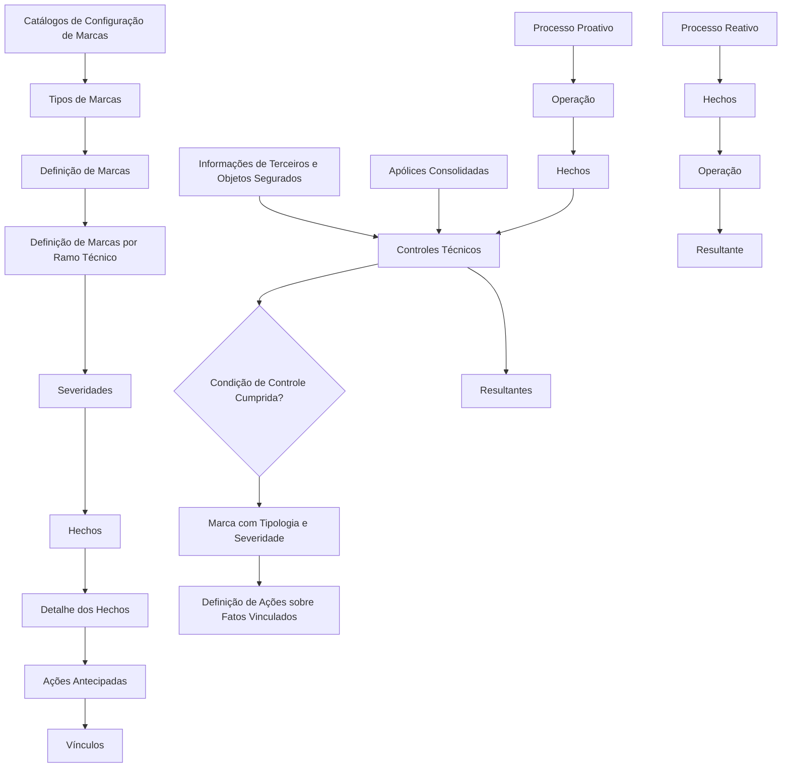

# Definição e Configuração de Marcas no Reef.core

## 1. Metadados do Documento
- **Arquivo de Origem:** Não identificado
- **Tipo de Documento:** Procedimento / Documentação funcional
- **Domínio / Sistema:** Reef.core — processo de emissão de entidades seguradoras
- **Público-Alvo:** Operação, negócio, analistas funcionais e equipes de configuração
- **Data/Versão Identificada:** Não identificada

---

## 2. Resumo Executivo & Contexto de Negócio

O documento apresenta o conceito de **Marcas** no sistema corporativo Reef.core. Uma marca é descrita a partir da definição da Real Academia Española como um sinal aplicado a alguém ou algo para distingui-lo ou indicar qualidade ou pertencimento.

No Reef.core, as Marcas permitem controlar se condições determinadas são cumpridas durante processos de emissão de entidades seguradoras. Os controles incidem sobre informações de **Terceiros**, objetos segurados em contratação e apólices já consolidadas no sistema.

A funcionalidade contempla atuação em dois momentos: o processo **proativo**, associado a controles antecipados durante a emissão, e o processo **reativo**, associado a fatos e apólices já consolidadas. Marcas possuem diferentes tipologias e severidades, permitindo definir ações distintas conforme os fatos vinculados e o resultado dos controles.

O objetivo declarado é conhecer os catálogos que devem ser configurados e sua ordem de execução para tornar a funcionalidade de Marcas plenamente operacional na ferramenta corporativa. Embora a Área Corporativa de Operações tenha proposto expandir a funcionalidade para outros processos, o documento informa que, no momento descrito, a implementação existe apenas no processo de emissão.

---

## 3. Arquitetura, Componentes & Tecnologias Envolvidas

O documento cita os seguintes componentes funcionais e repositórios de configuração:

- **Reef.core:** sistema corporativo no qual a funcionalidade de Marcas está implementada.
- **Processo de emissão:** único processo explicitamente informado como implementado para uso das Marcas.
- **Processo proativo:** fluxo antecipado de operação, fatos, controles técnicos e resultantes.
- **Processo reativo:** fluxo envolvendo fatos, operação e resultante para situações relacionadas a apólices consolidadas.
- **Catálogos de Configuração de Marcas:** conjunto de catálogos necessário para configurar a funcionalidade.
- **Controles Técnicos:** controles aplicados às condições relacionadas a Terceiros, objetos segurados ou apólices.
- **Mapfredocument / Documentação Reef:** referências documentais exibidas na extração.



> **Nota de Análise:** o documento enumera catálogos e elementos de configuração, mas não detalha campos, contratos de integração, métodos HTTP, banco de dados, tecnologias de implementação, URLs, servidores ou ordem explícita de execução entre os catálogos.

---

## 4. Regras de Negócio, Especificações Funcionais & Processos

### Conceito funcional de Marca
1. Uma Marca representa um sinal utilizado para distinguir, indicar qualidade ou indicar pertencimento.
2. No Reef.core, Marcas controlam o cumprimento de condições sobre informações analisadas no processo de emissão.
3. As condições podem incidir sobre:
   - Informações de Terceiros.
   - Objetos segurados em processo de contratação.
   - Apólices já consolidadas no sistema.
4. As Marcas podem possuir diferentes tipologias e severidades.
5. Tipologia e severidade permitem definir ações distintas sobre os fatos vinculados às Marcas ou sobre o cumprimento das condições de controle.

### Processo proativo
O processo proativo é apresentado como um encadeamento entre:

1. Operação.
2. Hechos.
3. Controles Técnicos.
4. Resultantes.

O texto caracteriza o processo proativo como antecipado, associado ao controle de informações no contexto da emissão.

### Processo reativo
O processo reativo é apresentado como um encadeamento entre:

1. Hechos.
2. Operação.
3. Resultante.

O documento associa a atuação reativa a apólices já consolidadas, caracterizando-a como diferida.

### Escopo atual de implementação
- A Área Corporativa de Operações propôs a possibilidade de incorporar Marcas em processos adicionais além da emissão.
- No estado documentado, a funcionalidade está implementada exclusivamente no processo de emissão.

### Catálogos de configuração citados
O documento relaciona os seguintes elementos como parte da configuração de Marcas:

1. Tipos de Marcas.
2. Definição de Marcas.
3. Definição de Marcas por Ramo Técnico.
4. Severidades.
5. Hechos.
6. Detalhe dos Hechos.
7. Ações Antecipadas.
8. Vínculos.

> **Nota de Análise:** a extração afirma que é necessário conhecer a relação entre catálogos e sua ordem de execução, porém não fornece a sequência operacional explícita nem critérios de preenchimento para cada catálogo.

---

## 5. Tabelas de Parâmetros, Ambientes e Estruturas de Dados

| Item / Parâmetro | Descrição / Função | Tipo / Valores / Formato | Ambiente / Observações |
| :--- | :--- | :--- | :--- |
| Reef.core | Ferramenta corporativa que suporta a funcionalidade de Marcas. | Sistema corporativo | A funcionalidade está implementada no processo de emissão. |
| Marca | Sinal usado para controlar o cumprimento de condições sobre informações de negócio. | Conceito funcional | Pode estar vinculada a fatos e condições de controle. |
| Tipos de Marcas | Catálogo citado para configuração das Marcas. | Catálogo de configuração | Valores não detalhados. |
| Definição de Marcas | Catálogo citado para definição das Marcas. | Catálogo de configuração | Campos e regras não detalhados. |
| Definição de Marcas por Ramo Técnico | Configuração de Marcas associada a Ramo Técnico. | Catálogo de configuração | Ramos técnicos não especificados. |
| Severidades | Classificação que permite estabelecer ações diferentes. | Catálogo de configuração | Níveis de severidade não informados. |
| Hechos | Elementos relacionados aos fluxos proativo e reativo. | Catálogo / entidade funcional | O documento não define estrutura ou valores. |
| Detalhe dos Hechos | Detalhamento associado aos Hechos. | Catálogo de configuração | Conteúdo não detalhado. |
| Ações Antecipadas | Ações associadas à configuração de Marcas. | Catálogo de configuração | O documento não especifica ações disponíveis. |
| Vínculos | Relações entre elementos da configuração de Marcas. | Catálogo de configuração | Regras de associação não detalhadas. |
| Controles Técnicos | Controles aplicados a condições sobre Terceiros, objetos segurados ou apólices. | Componente funcional | Critérios técnicos não especificados. |
| Processo proativo | Fluxo antecipado de operação, Hechos, controles técnicos e resultantes. | Processo | Associado ao contexto de emissão. |
| Processo reativo | Fluxo diferido de Hechos, operação e resultante. | Processo | Associado a apólices já consolidadas. |
| Terceiros | Fonte de informação sujeita a condições de controle. | Entidade de negócio | Estrutura de dados não informada. |
| Objetos segurados | Objetos pretendidos para contratação e sujeitos a controle. | Entidade de negócio | Estrutura de dados não informada. |
| Apólices consolidadas | Apólices já existentes no sistema, sujeitas a controles reativos. | Entidade de negócio | Não há identificação de ambiente ou base de dados. |

---

## 6. Bateria de Perguntas & Respostas para RAG (FAQ Sintético)

### P1: O que são Marcas no Reef.core?
**R:** Marcas no Reef.core são mecanismos usados para controlar se determinadas condições são atendidas sobre informações de Terceiros, objetos segurados que se pretende contratar ou apólices já consolidadas. Uma Marca pode possuir tipologia e severidade, permitindo definir ações sobre fatos vinculados ou sobre o cumprimento de condições de controle.

### P2: Em qual processo a funcionalidade de Marcas está implementada atualmente?
**R:** O documento informa que a funcionalidade de Marcas está implementada atualmente apenas no processo de emissão. A Área Corporativa de Operações considera sua inclusão em outros processos, mas essa ampliação não é descrita como implementada.

### P3: Qual é a diferença entre o processo proativo e o processo reativo de Marcas?
**R:** O processo proativo é caracterizado como antecipado e envolve Operação, Hechos, Controles Técnicos e Resultantes. O processo reativo é caracterizado como diferido, relacionado a fatos e a apólices já consolidadas, e envolve Hechos, Operação e Resultante.

### P4: Quais informações podem ser verificadas pelos controles de Marcas?
**R:** Os controles podem verificar condições sobre informações de Terceiros, objetos segurados que estão sendo contratados e apólices já consolidadas no sistema.

### P5: Qual é a finalidade das severidades nas Marcas?
**R:** As severidades permitem estabelecer diferentes ações sobre fatos vinculados às Marcas ou sobre o cumprimento das condições de controle. O documento não apresenta os níveis de severidade disponíveis nem as ações específicas vinculadas a cada nível.

### P6: Quais catálogos são citados para configurar a funcionalidade de Marcas?
**R:** Os catálogos citados são: Tipos de Marcas, Definição de Marcas, Definição de Marcas por Ramo Técnico, Severidades, Hechos, Detalhe dos Hechos, Ações Antecipadas e Vínculos.

### P7: O documento especifica a ordem de execução dos catálogos de Marcas?
**R:** Não. O objetivo do documento é conhecer os catálogos necessários e a ordem de execução para tornar a funcionalidade operacional, mas a extração apresentada não fornece uma sequência explícita de configuração ou execução entre os catálogos.

### P8: O que são Controles Técnicos no contexto de Marcas?
**R:** Controles Técnicos são controles associados à verificação de condições sobre informações de Terceiros, objetos segurados e apólices consolidadas. O documento os posiciona no fluxo proativo, mas não detalha regras técnicas, algoritmos, integrações ou critérios de aprovação e reprovação.

### P9: O que significa atuação proativa das Marcas?
**R:** A atuação proativa corresponde ao uso de Marcas de maneira antecipada, no contexto de emissão, para controlar condições relativas às informações analisadas antes ou durante a contratação.

### P10: O que significa atuação reativa das Marcas?
**R:** A atuação reativa corresponde ao uso de Marcas de maneira diferida sobre apólices já consolidadas no sistema. O documento não detalha eventos disparadores, periodicidade ou ações posteriores do processo reativo.

---

## 7. Glossário de Termos, Siglas & Conceitos-Chave

- **Reef.core:** ferramenta corporativa na qual a funcionalidade de Marcas é tratada no documento.
- **Marca:** sinal utilizado para distinguir, indicar qualidade ou pertencimento; no Reef.core, mecanismo de controle de condições sobre informações de negócio.
- **Terceiros:** entidades cujas informações podem ser submetidas a condições de controle por Marcas.
- **Objetos segurados:** objetos envolvidos em uma contratação que podem ser submetidos a condições de controle.
- **Apólice consolidada:** apólice já consolidada no sistema, associada ao contexto reativo.
- **Hechos:** termo apresentado no documento como elemento dos processos proativo e reativo; não há definição adicional na extração.
- **Ramo Técnico:** dimensão usada na “Definição de Marcas por Ramo Técnico”; ramos específicos não são informados.
- **Severidade:** classificação de Marca usada para possibilitar diferentes ações.
- **Ações Antecipadas:** elemento de configuração citado no catálogo de Marcas; regras e ações concretas não são detalhadas.
- **Vínculos:** relações de configuração citadas no documento; a natureza das relações não é detalhada.
- **Processo proativo:** processo antecipado associado a Operação, Hechos, Controles Técnicos e Resultantes.
- **Processo reativo:** processo diferido associado a Hechos, Operação e Resultante.
- **Área Corporativa de Operações:** área que propôs a possibilidade de expandir a funcionalidade de Marcas para outros processos.

---

## 8. Notas Críticas, Riscos & Limitações

- O documento declara que Marcas podem ser incluídas em processos além da emissão, mas não informa escopo, cronograma, responsáveis ou status dessa expansão.
- Não há descrição dos valores aceitos para Tipos de Marcas, Severidades, Hechos, Ações Antecipadas ou Vínculos.
- Não são apresentados critérios de avaliação dos Controles Técnicos, regras de cálculo, condições de aprovação/reprovação ou efeitos operacionais de cada resultado.
- A ordem de configuração e execução dos catálogos é mencionada como objetivo, porém não está explicitada na extração.
- Não há informações sobre integrações, APIs, métodos HTTP, contratos JSON, bancos de dados, URLs, ambientes, servidores, credenciais ou monitoramento.
- A expressão **Hechos** é recorrente, mas não possui definição funcional adicional no conteúdo extraído.
- A documentação recomenda a consulta de diretrizes e documentos funcionais relacionados para evitar interpretações isoladas incorretas.

---

## 9. Conteúdo Bruto Estruturado (Referência Fiel)

```text
--- [PÁGINA 1 DE 2] ---

DEFINICIÓN MARCAS
Contexto
Atendiendo a la denición de marca del diccionario de la Real Academia Española, una marca es una 'señal que se hace o se pone en alguien
o algo, para distinguirlos, o para denotar calidad o pertenencia'.
Las Marcas en Reef.core permiten controlar en los procesos de emisión de las entidades aseguradoras si se cumplen o no determinadas
condiciones sobre la información de los Terceros y de los objetos asegurados que se pretenden contratar o sobre pólizas ya consolidadas en
el sistema (de manera proactiva y anticipada o reactiva y diferida respectivamente).
Estas marcas pueden ser de diferente tipología y severidad lo que permite establecer distintas acciones sobre los hechos vinculados a ellas o
dicho de otra forma, sobre el cumplimiento de las condiciones de control.
El Área Corporativa de Operaciones ha planteado la posibilidad de incluir en otros procesos más allá del proceso de emisión la
funcionalidad de las marcas si bien hoy por hoy únicamente está implementada en dicho proceso.
Objetivo
Conocer la relación de Catálogos que se deben congurar y el orden en su ejecución para denir y tener plenamente operativa esta
funcionalidad de las herramienta Corporativa.
Proceso PROACTIVO
Operación Hechos CONTROLES TÉCNICOS
Resultantes
Proceso REACTIVO
Hechos OPERACIÓN Resultante
Catálogos de Conguración de MARCAS
Tipos de Marcas
Denición de Marcas
Documentation / DOCUMENTACIÓN Reef
DOCUMENTACIÓN Reef
Mapfredocument
DOCUMENTACIÓN Reef
Owner
user:agonzalez_mapfre.com
Lifecycle
Approved Source
 / 
 VL
Buscar Inicio Soluciones Arquitecturas APIs Componentes Cloud Documentación Zeus Reef Ayuda
ES


--- [PÁGINA 2 DE 2] ---

Denición de Marcas por Ramo Técnico
Severidades
Hechos
Detalle de los Hechos
Acciones Anticipadas
Vínculos
Relación de Directrices y Documentos funcionales cuya lectura recomendada para evitar que la interpretación aislada del presente
documento pueda conducir a error.
Controles TÉCNICOS
```
