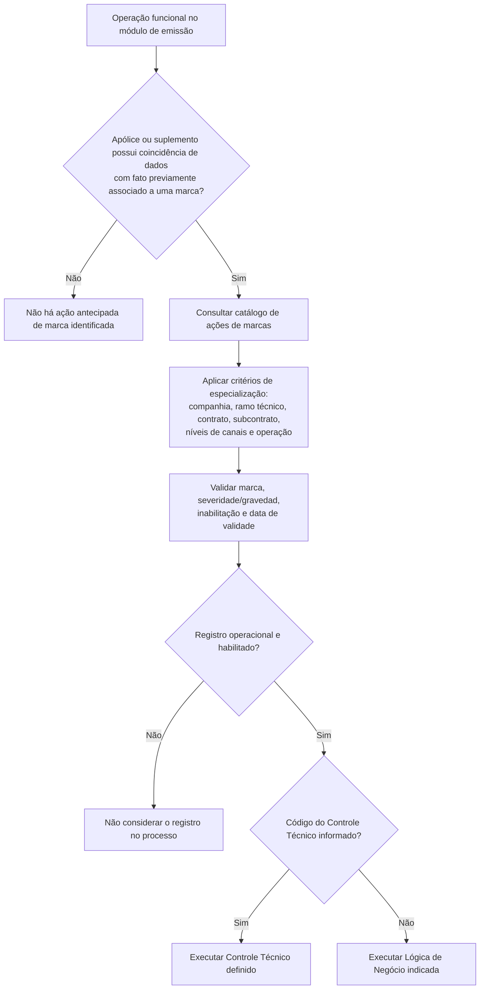
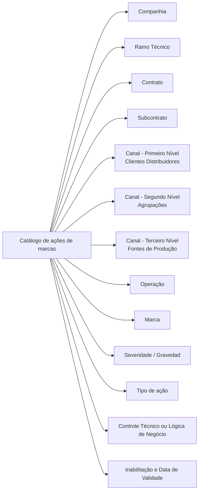

# Definição de Ações Antecipadas de Marcas no Reef.core

## 1. Metadados do Documento
- **Arquivo de Origem:** Não informado — conteúdo bruto fornecido no pedido
- **Tipo de Documento:** Especificação Técnica / Documentação Funcional
- **Domínio / Sistema:** Reef.core — emissão e tratamento de marcas
- **Público-Alvo:** Desenvolvedores, arquitetos, analistas funcionais e equipes de operação/configuração
- **Data/Versão Identificada:** Não identificada
- **Proprietário identificado no extrato:** `user:agonzalez_mapfre.com`
- **Status identificado no extrato:** `Approved Source`

---

## 2. Resumo Executivo & Contexto de Negócio

O documento descreve a configuração de **ações antecipadas associadas a marcas** no sistema **Reef.core**. O objetivo é determinar quais ações devem ser executadas durante operações funcionais do módulo de emissão, considerando o ramo técnico, a tipologia e a severidade de uma marca.

O mecanismo permite que o Reef.core atue preventivamente quando uma operação de emissão ocorre sobre uma apólice ou suplemento cujos dados coincidam com fatos anteriormente associados a uma marca. O exemplo apresentado é a identificação, durante a emissão de uma apólice de nova produção, de um terceiro que possua um registro positivo de alcoolemia.

A parametrização permite especializar ações por companhia, ramo técnico, contrato, subcontrato e níveis da estrutura de canais. Também é possível aplicar configurações genéricas por meio de códigos específicos, permitindo que uma mesma regra seja reutilizada ou diferenciada para combinações particulares de contratos, subcontratos, distribuidores, agrupações e fontes de produção.

A ação atualmente implementada é a execução de **controles técnicos**. Quando um código de controle técnico não é informado, o catálogo permite indicar o nome de uma lógica de negócio alternativa a ser executada. O registro pode ainda ser inabilitado e possuir uma data de validade para suportar a operação temporal e o histórico de alterações de configuração.

---

## 3. Arquitetura, Componentes & Tecnologias Envolvidas

### Componentes e conceitos identificados

| Componente / Conceito | Descrição baseada no documento |
| :--- | :--- |
| **Reef.core** | Sistema que executa tratamento antecipado de marcas durante operações de emissão. |
| **Módulo de emissão** | Contexto funcional no qual as ações associadas a marcas são consideradas. |
| **Catálogo de marcas** | Catálogo que contém atributos de identificação, especialização, marca, severidade e ação a executar. |
| **Catálogo de ações a realizar** | Parametrização que determina a severidade/gravedad da marca e a ação correspondente. |
| **Operação funcional** | Operação identificada por código para a qual uma ação pode ser especializada. |
| **Controle técnico** | Tipo de ação implementado no momento da documentação. É identificado por uma chave/código. |
| **Lógica de negócio** | Alternativa executável quando não é indicada a chave do controle técnico. |
| **Apólice** | Entidade de emissão que pode possuir coincidência de dados com fatos associados a marcas. |
| **Suplemento** | Entidade de emissão que também pode participar do tratamento de marcas. |
| **Ramo técnico** | Código que habilita operações para consideração de ações de marca, desde que o ramo esteja configurado para participar do processo. |
| **Contrato / Subcontrato** | Identificadores usados para especializar ações para contextos contratuais específicos. |
| **Estrutura de canais** | Estrutura composta por Clientes Distribuidores, Agrupações e Fontes de Produção. |

### Fluxo funcional extraído



### Relação entre critérios de configuração



> **Nota de Análise:** O documento não detalha contratos de integração, métodos HTTP, APIs, bancos de dados, eventos, filas, linguagens de implementação ou tecnologias de infraestrutura do Reef.core.

---

## 4. Regras de Negócio, Especificações Funcionais & Processos

### 4.1 Objetivo da configuração

1. O tratamento de marcas deve determinar quais ações serão executadas nas operações funcionais do módulo de emissão.
2. A determinação das ações considera, no mínimo:
   - Ramo técnico;
   - Tipologia da marca;
   - Severidade ou gravidade da marca.
3. O Reef.core pode atuar de forma antecipada quando estiver sendo realizada uma operação de emissão sobre uma apólice ou suplemento.
4. A atuação antecipada depende da existência de coincidências entre dados da emissão e fatos previamente associados a uma marca.
5. O exemplo apresentado é a identificação de um terceiro, durante a emissão de uma apólice de nova produção, que tenha sido detectado previamente com positivo de alcoolemia.

### 4.2 Especialização da ação por contexto

A configuração pode especializar as ações a executar conforme uma combinação de atributos do catálogo:

1. **Companhia:** define o código da companhia para a qual a ação é configurada.
2. **Ramo técnico:** define o ramo técnico cujas operações contemplarão a ação, desde que o ramo esteja configurado para participar do processo de tratamento de marcas.
3. **Contrato:** permite diferenciar ações para um contrato específico em relação aos demais contratos configurados.
4. **Subcontrato:** permite diferenciar ações para um subcontrato específico em relação a outros subcontratos associados ao mesmo contrato.
5. **Primeiro nível da estrutura de canais:** permite diferenciar ações por Cliente Distribuidor.
6. **Segundo nível da estrutura de canais:** permite diferenciar ações por Agrupação.
7. **Terceiro nível da estrutura de canais:** permite diferenciar ações por Fonte de Produção.
8. **Operação:** permite diferenciar ações para uma operação funcional específica.
9. **Marca:** identifica a marca que deve ser considerada.
10. **Severidade/Gravedad:** determina o tipo de severidade ou gravidade da marca para a parametrização da ação.

### 4.3 Uso de códigos genéricos

1. O Reef.core permite o uso do ramo técnico genérico de código `999`.
2. O Reef.core permite o uso do contrato genérico de código `99999`.
3. O texto informa que o subcontrato pode usar o “sector genérico” de código `99999`.
4. O primeiro nível da estrutura de canais pode usar um código genérico `9999`.
5. O segundo nível da estrutura de canais pode usar um código genérico `9999`.
6. O terceiro nível da estrutura de canais pode usar um código genérico `9999`.
7. Os códigos genéricos permitem configurar ações para combinações abrangentes ou especializadas, conforme os atributos associados.

### 4.4 Tipo de ação e execução

1. A propriedade **Tipo de ação a realizar** determina qual ação será executada.
2. A única tipologia de ação explicitamente implementada no documento é a que possibilita a execução de **controles técnicos**.
3. A propriedade **Código do Controle Técnico** determina a chave do controle técnico definido que será executado.
4. Quando a chave do controle técnico não é indicada, a propriedade **Lógica de Negócio** permite determinar o nome da lógica de negócio que será executada em substituição.

### 4.5 Ativação temporal e inabilitação

1. A propriedade **Inhabilitación** indica que o registro do catálogo está desativado ou inabilitado.
2. Um registro inabilitado não deve ser considerado nos processos da entidade seguradora.
3. A propriedade **Fecha de Validez** indica a data a partir da qual o registro está operativo no sistema.
4. O uso da data de validade permite manter histórico de alterações realizadas nas definições ao longo do tempo.

### 4.6 Documentação relacionada

O documento recomenda consultar as seguintes diretrizes e documentos funcionais para evitar interpretação isolada:

- **Definición de Marcas**
- **Controles Técnicos**

---

## 5. Tabelas de Parâmetros, Ambientes e Estruturas de Dados

### 5.1 Atributos identificativos e de especialização

| Item / Parâmetro | Descrição / Função | Tipo / Valores / Formato | Ambiente / Observações |
| :--- | :--- | :--- | :--- |
| Companhia | Código da companhia sobre a qual a configuração da ação é realizada. | Código de companhia; formato não detalhado. | Aplicável à configuração do catálogo de marcas. |
| Ramo Técnico | Define o código do ramo técnico habilitado para considerar ações em suas operações. | Código de ramo técnico; genérico `999`. | O ramo deve estar configurado para participar do processo de tratamento de marcas. |
| Contrato | Identifica o código de um contrato para especializar as ações a realizar. | Código de contrato; genérico `99999`. | Permite diferenciar um contrato de outros contratos configurados. |
| Subcontrato | Identifica a chave de um subcontrato para especializar ações dentro de um contrato. | Chave de subcontrato; o texto cita “sector genérico” `99999`. | A especialização considera também o valor do contrato. |
| Primeiro Nível da Estrutura de Canais | Identifica a chave do primeiro nível da estrutura de canais: Clientes Distribuidores. | Chave de canal; genérico `9999`. | Permite ações específicas para um cliente distribuidor. |
| Segundo Nível da Estrutura de Canais | Identifica a chave do segundo nível da estrutura de canais: Agrupações. | Chave de canal; genérico `9999`. | Permite ações específicas para uma agrupação. |
| Terceiro Nível da Estrutura de Canais | Identifica a chave do terceiro nível da estrutura de canais: Fontes de Produção. | Chave de canal; genérico `9999`. | Permite ações específicas para uma fonte de produção. |
| Operação | Código identificador da operação funcional. | Código de operação; formato não detalhado. | Permite especializar ações para uma operação específica. |
| Marca | Identifica a marca que deve ser considerada. | Identificador de marca; formato não detalhado. | Não são listados valores de marca no extrato. |
| Severidade / Gravedad | Determina o tipo de severidade ou gravidade da marca. | Valor de severidade; valores não detalhados. | Usado na parametrização do catálogo de ações. |

### 5.2 Atributos de execução e vigência

| Item / Parâmetro | Descrição / Função | Tipo / Valores / Formato | Ambiente / Observações |
| :--- | :--- | :--- | :--- |
| Tipo de ação a realizar | Determina a ação que será executada. | Tipologia de ação. | A única tipologia implementada citada é a execução de controles técnicos. |
| Código do Controle Técnico | Define a chave do controle técnico que deve ser executado. | Chave/código; formato não detalhado. | Quando não informado, pode ser utilizada a propriedade Lógica de Negócio. |
| Lógica de Negócio | Nome da lógica de negócio que será executada quando não houver chave de controle técnico. | Nome de lógica de negócio; formato não detalhado. | Atua como alternativa ao controle técnico. |
| Inhabilitación | Indica que o registro está desativado ou inabilitado. | Indicador booleano ou equivalente; formato não detalhado. | Registros inabilitados não são considerados pelos processos da entidade seguradora. |
| Fecha de Validez | Define a data a partir da qual o registro está operativo. | Data; formato não detalhado. | Permite manter histórico de mudanças nas definições. |

### 5.3 Códigos genéricos explicitamente informados

| Contexto | Código genérico | Finalidade |
| :--- | :--- | :--- |
| Ramo Técnico | `999` | Permitir configuração genérica de ações para ramos técnicos. |
| Contrato | `99999` | Permitir configuração genérica de ações para contratos. |
| Subcontrato / “sector genérico” | `99999` | Permitir configuração genérica no atributo de subcontrato, conforme redação do documento. |
| Primeiro Nível da Estrutura de Canais | `9999` | Permitir configuração genérica para Clientes Distribuidores. |
| Segundo Nível da Estrutura de Canais | `9999` | Permitir configuração genérica para Agrupações. |
| Terceiro Nível da Estrutura de Canais | `9999` | Permitir configuração genérica para Fontes de Produção. |

> **Nota de Análise:** O documento utiliza a expressão “Contrato genérico” ao explicar os três níveis da estrutura de canais, embora informe o código `9999`. A tabela preserva o código e registra a finalidade conforme o contexto descrito.

---

## 6. Bateria de Perguntas & Respostas para RAG (FAQ Sintético)

### P1: Qual é o objetivo da configuração de ações antecipadas de marcas no Reef.core?
**R:** A configuração define quais ações devem ser executadas nas operações funcionais do módulo de emissão, considerando o ramo técnico, a tipologia da marca e a severidade ou gravidade da marca. O objetivo é permitir que o Reef.core atue antecipadamente quando identificar coincidências entre dados de uma emissão e fatos previamente associados a uma marca.

### P2: Em quais situações o Reef.core pode executar uma ação antecipada associada a uma marca?
**R:** O Reef.core pode executar uma ação antecipada durante uma operação de emissão sobre uma apólice ou suplemento quando existirem coincidências de dados com fatos previamente associados a uma marca. O documento exemplifica a identificação de um terceiro, em uma apólice de nova produção, que tenha recebido um positivo por alcoolemia.

### P3: Qual condição é necessária para que um ramo técnico participe do tratamento de marcas?
**R:** O ramo técnico deve estar configurado nos parâmetros do ramo para entrar no processo de tratamento de marcas. Apenas informar o código do ramo técnico na configuração da ação não substitui essa condição indicada pelo documento.

### P4: Qual código genérico pode ser usado para o ramo técnico?
**R:** O Reef.core permite utilizar o código `999` como ramo técnico genérico. Esse código pode ser combinado com outros atributos de configuração para definir ações abrangentes ou especializadas.

### P5: Como a configuração diferencia ações entre contratos e subcontratos?
**R:** O atributo Contrato permite especializar ações para um contrato específico, com suporte ao contrato genérico `99999`. O atributo Subcontrato permite especializar ações para um subcontrato específico associado ao mesmo contrato. Para esse atributo, o texto informa o uso de um “sector genérico” com código `99999`, devendo a análise considerar também o valor do contrato.

### P6: Quais níveis da estrutura de canais podem ser usados para especializar uma ação?
**R:** A configuração pode usar três níveis da estrutura de canais: Primeiro Nível, correspondente a Clientes Distribuidores; Segundo Nível, correspondente a Agrupações; e Terceiro Nível, correspondente a Fontes de Produção. Cada nível pode utilizar o código genérico `9999`.

### P7: Qual tipo de ação está implementado segundo o documento?
**R:** O documento informa que atualmente a única tipologia implementada é o tipo de ação que possibilita a execução de controles técnicos. Não há descrição de outras tipologias de ação implementadas.

### P8: O que acontece quando o Código do Controle Técnico não é informado?
**R:** Quando a chave do controle técnico não é indicada, a propriedade Lógica de Negócio permite determinar o nome da lógica de negócio que será executada em seu lugar.

### P9: Qual é o efeito de marcar um registro com Inhabilitación?
**R:** A propriedade Inhabilitación estabelece que o registro do catálogo está desativado ou inabilitado. Um registro nessa condição não deve ser considerado nos processos da entidade seguradora.

### P10: Para que serve a Fecha de Validez na configuração de ações de marcas?
**R:** A Fecha de Validez informa a data a partir da qual o registro está operativo no sistema. O uso correto desse atributo permite manter um histórico das alterações feitas nas definições ao longo do tempo.

### P11: A operação funcional pode ser usada como critério de especialização?
**R:** Sim. A propriedade Operação contém o código identificador da operação funcional e permite especializar as ações a realizar para uma operação específica em relação a outras operações.

### P12: Quais documentos funcionais devem ser consultados junto com esta documentação?
**R:** O documento recomenda a leitura de **Definición de Marcas** e **Controles Técnicos**, para reduzir o risco de uma interpretação isolada e incorreta da configuração de ações antecipadas de marcas.

---

## 7. Glossário de Termos, Siglas & Conceitos-Chave

- **Reef.core:** Sistema citado como responsável por atuar antecipadamente no tratamento de marcas durante operações de emissão.
- **Marca:** Registro ou condição identificada no catálogo de marcas que deve ser considerada na definição de uma ação.
- **Tratamento de marcas:** Processo de avaliação e execução de ações relacionadas a marcas durante operações de emissão.
- **Módulo de emissão:** Módulo no qual ocorrem operações relacionadas a apólices ou suplementos.
- **Apólice:** Entidade de emissão sobre a qual podem ser encontradas coincidências de dados associadas a marcas.
- **Suplemento:** Entidade de emissão também considerada no tratamento antecipado de marcas.
- **Ramo Técnico:** Código que identifica o ramo habilitado para contemplar ações no processo de tratamento de marcas.
- **Contrato:** Código usado para especializar ações em um contexto contratual.
- **Subcontrato:** Chave usada para especializar ações dentro de um contrato.
- **Clientes Distribuidores:** Primeiro nível da estrutura de canais.
- **Agrupações:** Segundo nível da estrutura de canais.
- **Fontes de Produção:** Terceiro nível da estrutura de canais.
- **Operação Funcional:** Operação identificada por código que pode receber uma ação especializada.
- **Severidade / Gravedad:** Nível de severidade ou gravidade associado a uma marca na parametrização do catálogo de ações.
- **Controle Técnico:** Ação implementada que pode ser executada a partir de um código/chave configurado.
- **Lógica de Negócio:** Nome da lógica executada quando não existe código de controle técnico informado.
- **Inhabilitación:** Propriedade que inabilita um registro do catálogo para os processos da entidade seguradora.
- **Fecha de Validez:** Data a partir da qual um registro se torna operativo no sistema.

---

## 8. Notas Críticas, Riscos & Limitações

- O documento não informa versões do Reef.core, datas de publicação, identificadores formais do documento ou autor técnico.
- Não há especificação de prioridade entre configurações genéricas e específicas quando mais de uma combinação de atributos for aplicável.
- O documento não descreve o algoritmo de correspondência usado para determinar coincidências entre dados de emissão e fatos associados a marcas.
- Não são informados contratos de API, estruturas JSON, persistência de dados, serviços externos, tabelas físicas, URLs, ambientes ou rotas de logs.
- A única tipologia de ação explicitamente implementada é a execução de controles técnicos.
- A alternativa por lógica de negócio é descrita somente como um nome a executar; o documento não detalha assinatura, parâmetros de entrada, retorno ou mecanismo técnico de invocação.
- O atributo de Subcontrato menciona “sector genérico” com código `99999`; a terminologia pode representar uma inconsistência de redação ou um conceito não explicado no extrato.
- Nas explicações dos níveis de canais, o documento refere-se a “Contrato genérico” com código `9999`, embora o contexto seja a estrutura de canais. Não há detalhamento adicional para resolver essa possível inconsistência.
- A seção de perguntas frequentes informa que não existem circunstâncias operativas adicionais a considerar: `N/A`.

---

## 9. Conteúdo Bruto Estruturado (Referência Fiel)

```text
--- [PÁGINA 1 DE 3] ---

DEFINIR ACCIONES Anticipadas de las MARCAS
Objetivo
En el tratamiento de las marcas es necesario determinar qué acciones se quieren ejecutar en las operaciones funcionales del módulo de
emisión para un Ramo Técnico y para una tipología y severidad de la marca en particular.
De esta manera Reef.core puede actuar de manera anticipada en el caso de estar realizando una operación de emisión sobre una póliza o
suplemento en los que existan coincidencias de datos con hechos asociados previamente para una marca, e.g: El que se identique un
Tercero en la emisión de una póliza de nueva producción al que se le haya detectado un positivo por alcoholemia.
Datos Identicativos
Otras Propiedades
Datos Identicativos
Compañía
Este Atributo del catálogo de marcas contiene el código de la compañía sobre la que se está realizando la conguración de la acción a
realizar.
Ramo Técnico
Este Atributo del catálogo determina el código del Ramo Técnico que se habilita para que sobre sus operaciones se contemplen las acciones
a realizar.
Siempre y cuando se haya determinado en la conguración de los parámetros del Ramo el que éste vaya a entrar en el proceso de
tratamiento de marcas.
Reef.core permite el uso del ramo técnico genérico (código 999) en la conguración de este atributo.
De esta manera y realizando las combinaciones adecuadas, se pueden ejecutar acciones diferentes para uno o varios contratos en
particular frente a todos los demás contratos congurados.
Contrato
Esta propiedad identica el código de un Contrato, código que permite a Reef.core 'especializar' las acciones a realizar para un contrato en
particular respecto a otros.
Consejo:
Documentation / DOCUMENTACIÓN Reef
DOCUMENTACIÓN Reef
Mapfredocument
DOCUMENTACIÓN Reef
Owner
user:agonzalez_mapfre.com
Lifecycle
Approved Source
 / 
 VL
Buscar Inicio Soluciones Arquitecturas APIs Componentes Cloud Documentación Zeus Reef Ayuda
ES


--- [PÁGINA 2 DE 3] ---

Reef.core permite el uso del Contrato genérico (código 99999) en la conguración de este atributo.
De esta manera y realizando las combinaciones adecuadas, se pueden ejecutar acciones diferentes para uno o varios contratos en
particular frente a todos los demás contratos congurados.
Subcontrato
Esta propiedad identica la clave de un Subcontrato, código que permite a Reef.core 'especializar' las acciones a realizar para un sub contrato
en particular respecto a otros sub contratos asociados al mismo contrato.
Reef.core permite el uso del sector genérico (código 99999) en la conguración de esta propiedad.
De esta manera y realizando las combinaciones adecuadas, se pueden ejecutar acciones diferentes para uno o varios sub contratos en
particular frente a todos los demás sub contratos congurados (contemplando además el valor del Contrato)
Primer Nivel de la Estructura de Canales
Este atributo identica la clave que identicará al Primer Nivel de la estructura de canales (Clientes Distribuidores) en el Sistema, clave que
permite 'especializar' las acciones a realizar de acuerdo con el nivel de la estructura.
Reef.core permite el uso del Contrato genérico (código 9999) en la conguración de este atributo.
De esta manera y realizando las combinaciones adecuadas, se pueden ejecutar acciones diferentes para un cliente distribuidor de la
estructura de canales en particular frente al resto de clientes distribuidores.
Segundo Nivel de la Estructura de Canales
Este atributo identica la clave que identicará al Segundo Nivel de la estructura de canales (Agrupaciones) en el Sistema, clave que permite
'especializar' las acciones a realizar de acuerdo con el nivel de la estructura.
Reef.core permite el uso del Contrato genérico (código 9999) en la conguración de esta propiedad.
De esta manera y realizando las combinaciones adecuadas, se pueden ejecutar acciones diferentes para una agrupación de la estructura
de canales en particular frente al resto de agrupaciones.
Tercer Nivel de la Estructura de Canales
Este atributo identicará la clave del Tercer Nivel de la estructura de canales o Fuentes de Producción en el Sistema, clave que permite
'especializar' las acciones a realizar de acuerdo con el nivel de la estructura.
Reef.core permite el uso del Contrato genérico (código 9999) en la conguración de este atributo.
De esta manera y realizando las combinaciones adecuadas, se pueden ejecutar acciones diferentes para una fuente de producción de la
estructura de canales en particular frente al resto de fuentes de producción conguradas.
Operación
Esta propiedad contiene el código identicador de la Operación Funcional, código que permite 'especializar' las acciones a realizar para una
Operación en particular respecto de otras.
Marca
Consejo:
Consejo:
Consejo:
Consejo:
Consejo:


--- [PÁGINA 3 DE 3] ---

Esta propiedad del catálogo de marcas identica la marca que se debe contemplar.
Severidad/Gravedad
Este atributo en la parametrización del catálogo de acciones a realizar determina tipo de severidad o gravedad de la marca.
Tipo de acción a realizar
Esta propiedad determina el tipo de acción que se va a realizar
Actualmente la única tipología que se ha implementado es el tipo de acción que posibilita la ejecución de controles técnicos.
Código del Control Técnico
Esta propiedad determina la clave del Control Técnico denido que se va a ejecutar.
Lógica de Negocio
En el supuesto que no se haya indicado el atributo anterior (la clave del control técnico), esta propiedad permite determinar el nombre de la
lógica de Negocio que se va a ejecutar en su lugar.
Otras Propiedades
Inhabilitación
Esta propiedad establece que el registro del catálogo está desactivado o inhabilitado para ser considerado en los procesos de la entidad
aseguradora.
Fecha de Validez
Esta propiedad le indica al sistema la fecha a partir de la cual el registro está operativo en el sistema, por lo que su correcto uso permite tener
un histórico de los cambios efectuados en sus deniciones a lo largo del tiempo.
Vínculos
Relación de Directrices y Documentos funcionales cuya lectura recomendada para evitar que la interpretación aislada del presente
documento pueda conducir a error.
Denición de Marcas
Controles Técnicos
Preguntas frecuentes
(1) ¿Existe alguna circunstancia operativa que deba ser tomada en consideración sobre este catálogo?
N/A
```
