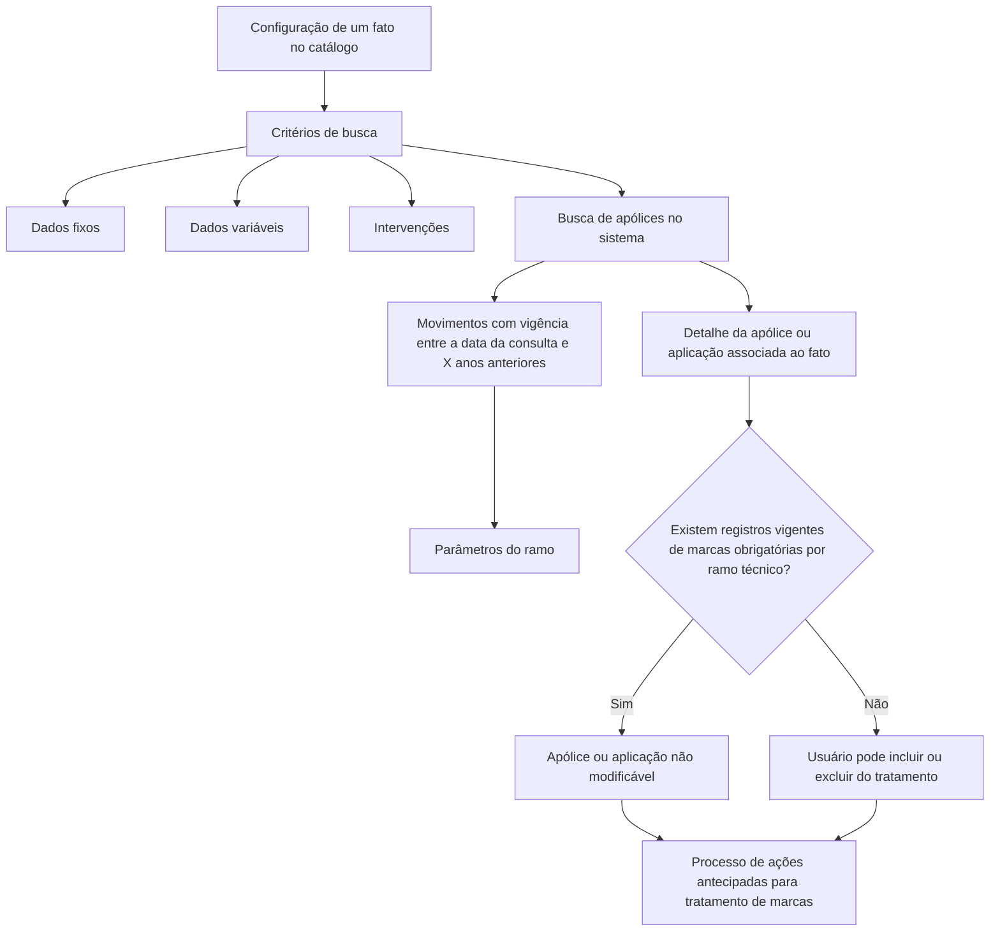

# Detalhamento dos Fatos das Marcas no Reef.core

## 1. Metadados do Documento
- **Arquivo de Origem:** Não identificado — conteúdo extraído de documento corporativo Reef.
- **Tipo de Documento:** Especificação Funcional.
- **Domínio / Sistema:** MAPFRE / Reef.core / tratamento de marcas.
- **Público-Alvo:** Desenvolvedores, Arquitetos, Operação e Analistas Funcionais.
- **Data/Versão Identificada:** Lifecycle: Approved; Source: VL. Data e versão não identificadas.

---

## 2. Resumo Executivo & Contexto de Negócio

O documento descreve o catálogo de detalhes associado aos fatos de marcas no sistema Reef.core. A configuração de um fato permite consultar no sistema as apólices que atendem aos critérios definidos por dados fixos, dados variáveis e intervenções.

A consulta é usada para determinar, mediante intervenção manual e critério do usuário, quais apólices ou aplicações serão incluídas ou excluídas da execução do processo de ações antecipadas para tratamento de marcas. A pesquisa considera movimentos cuja vigência esteja compreendida entre a data da consulta e uma quantidade de anos anteriores configurada nos parâmetros do ramo.

O objetivo declarado é conhecer o detalhe das informações armazenadas por apólice associada a um fato, incluindo os estados possíveis para a apólice ou aplicação. O documento distingue atributos identificativos do fato, atributos de detalhe das apólices encontradas e outras propriedades de controle operacional.

A possibilidade de modificar a seleção para tratamento depende da inexistência de registros vigentes na tabela de marcas obrigatórias por ramo técnico. Quando existem registros dessa natureza no momento da criação do fato, a apólice ou aplicação permanece não modificável.

---

## 3. Arquitetura, Componentes & Tecnologias Envolvidas

| Componente / Conceito | Papel descrito |
| :--- | :--- |
| **Reef.core** | Sistema que recebe a parametrização do fato e o tipo de severidade ou gravidade da marca. |
| **Catálogo de fatos** | Contém atributos identificativos, como companhia, ramo técnico, marca, severidade/gravedad e identificador do fato. |
| **Catálogo de detalhe** | Armazena informações da apólice, aplicação, risco, intervenção de terceiro, documento identificador e situação da apólice/aplicação. |
| **Parâmetros do ramo** | Definem a quantidade de anos retroativos considerada na busca de movimentos. |
| **Tabela de marcas obrigatórias por ramo técnico** | Determina se a apólice ou aplicação pode ser modificada ou excluída do tratamento de ações antecipadas. |
| **Processo de ações antecipadas** | Processo que trata as marcas das apólices ou aplicações selecionadas. |
| **Usuário** | Aplica intervenção manual e critério para incluir ou excluir apólices ou aplicações do tratamento. |



> **Nota de Análise:** O documento não detalha métodos HTTP, contratos JSON, persistência física, interfaces de usuário, integrações externas, tecnologias de infraestrutura ou endpoints do Reef.core.

---

## 4. Regras de Negócio, Especificações Funcionais & Processos

### 4.1 Configuração e busca de apólices

1. Cada fato configurado pode disparar uma busca no sistema.
2. A busca identifica apólices que atendem aos critérios configurados para o fato.
3. Os critérios podem considerar:
   - Dados fixos;
   - Dados variáveis;
   - Intervenções.
4. A pesquisa considera movimentos cuja vigência esteja entre:
   - A data da consulta; e
   - Uma quantidade de anos anteriores no tempo, conforme indicada nos parâmetros do ramo.
5. Após a busca, o usuário pode usar intervenção manual e seu critério para decidir se uma apólice ou aplicação será incluída ou excluída da execução do processo de ações antecipadas de tratamento de marcas.

### 4.2 Identificação do fato

O fato configurado é identificado por atributos de companhia, ramo técnico, marca, severidade/gravedad e identificador do fato. A sequência ou ordem registra o número de sequência da condição de busca usada pelo fato, seja por dado fixo, dado variável ou intervenção de terceiro.

### 4.3 Identificação da apólice, aplicação e risco

1. A propriedade **Póliza** identifica o número da apólice que cumpre a condição do fato.
2. A propriedade **Aplicación** identifica o número de aplicação quando a apólice possui tratamento de emissão de Transportes.
3. A propriedade **Riesgo** identifica o número do risco quando a apólice possui mais de um objeto segurado.

### 4.4 Intervenção de terceiro e documento identificador

1. Quando a tipologia do objeto do fato for **Intervención**, a propriedade **Intervención del Tercero** determina o tipo de terceiro ou sua forma de intervenção.
2. Os exemplos de formas de intervenção indicados são:
   - Tomador;
   - Tomador alterno;
   - Beneficiário;
   - Segurado.
3. Quando o contexto de uma intervenção se referir ao tipo e código do documento identificador do terceiro:
   - **Tipo Documento Identificador** define o tipo de documento usado para identificar a pessoa física ou jurídica;
   - **Clave del Documento Identificador** define o valor do documento usado para identificação.

### 4.5 Situação e vigência da apólice ou aplicação

1. A propriedade **Situación de la Póliza/Aplicación** determina o estado da apólice ou aplicação no momento do cumprimento do fato.
2. Os valores possíveis explicitamente informados são:
   - Expirada;
   - Vigente;
   - Anulada;
   - Rehabilitada;
   - Suspendida.
3. A **Fecha de Efecto del Movimiento** determina a data de efeito do último suplemento da apólice que cumpre o fato.
4. A **Fecha de Vencimiento del Movimiento** determina a data de vencimento do último suplemento da apólice que cumpre o fato.

### 4.6 Modificabilidade e seleção para tratamento

1. A propriedade **Modificable** determina se a apólice ou aplicação pode ser excluída do tratamento de ações antecipadas.
2. A exclusão somente pode ser modificada quando não existirem registros vigentes na tabela de marcas obrigatórias por ramo técnico.
3. Caso existam registros no momento de criação do fato:
   - O valor não pode ser modificado;
   - A apólice fica marcada como não modificável.
4. A propriedade **Seleccionada para su Tratamiento**, quando a modificação é permitida, determina se a apólice ou aplicação será incluída no tratamento de ações antecipadas.

### 4.7 Inabilitação e validade

1. A propriedade **Inhabilitación** estabelece que o fato está desativado ou inabilitado para uso no tratamento de marcas.
2. A propriedade **Fecha de Validez** define a data a partir da qual o registro configurado do fato está plenamente operacional no sistema.
3. O uso correto da data de validade permite manter o histórico das mudanças efetuadas sobre o registro ao longo do tempo.

### 4.8 Diretriz de codificação

O documento não estabelece preferência ou recomendação para padronizar a codificação do catálogo. Entretanto, a entidade MAPFRE deve analisar a conveniência de utilizar transversalmente esse catálogo de informações nos processos da companhia para permitir exploração posterior adequada.

Como exemplo de análise organizacional, o documento sugere distinguir:
- Marcas próprias de cada área técnica da companhia;
- Marcas que possam ser consideradas transversais entre áreas técnicas.

---

## 5. Tabelas de Parâmetros, Ambientes e Estruturas de Dados

| Item / Parâmetro | Descrição / Função | Tipo / Valores / Formato | Ambiente / Observações |
| :--- | :--- | :--- | :--- |
| Compañía | Código da companhia do fato configurado. | Código de companhia. | Atributo do catálogo de fatos. |
| Ramo Técnico | Determina o ramo técnico associado à apólice do fato configurado. | Ramo técnico. | Relacionado aos parâmetros do ramo e às marcas obrigatórias por ramo técnico. |
| Marca | Identifica a marca do fato definido. | Marca. | Propriedade do catálogo de fatos. |
| Severidad/Gravedad | Informa ao Reef.core o tipo de severidade ou gravidade da marca. | Tipo de severidade ou gravidade. | Parametrização do fato. |
| Identificador del Hecho | Identifica o fato em si. | Identificador. | Catálogo de fatos. |
| Secuencia/Orden | Número de sequência da condição de busca do fato. | Número de sequência. | Pode corresponder a dado fixo, dado variável ou intervenção de terceiro. |
| Póliza | Identifica o número de apólice que cumpre a condição do fato. | Número de apólice. | Catálogo de detalhe. |
| Aplicación | Identifica o número de aplicação da apólice. | Número de aplicação. | Aplicável a apólices com tratamento de emissão de Transportes. |
| Riesgo | Identifica o número do risco. | Número de risco. | Aplicável quando a apólice possui mais de um objeto segurado. |
| Intervención del Tercero | Determina o tipo de terceiro ou a forma de intervenção. | Tomador, Tomador alterno, Beneficiário, Segurado, entre outros não especificados. | Aplicável se a tipologia do objeto do fato for Intervención. |
| Tipo Documento Identificador | Determina o tipo de documento para identificação do terceiro. | Tipo de documento. | Aplicável ao contexto de tipo e código do documento identificador de pessoa física ou jurídica. |
| Clave del Documento Identificador | Determina o valor do documento usado na identificação. | Valor do documento. | Aplicável quando o objeto é do tipo Intervención. |
| Situación de la Póliza/Aplicación | Define o estado da apólice ou aplicação no momento do cumprimento do fato. | Expirada, Vigente, Anulada, Rehabilitada ou Suspendida. | Catálogo de detalhe. |
| Fecha de Efecto del Movimiento | Data de efeito do último suplemento da apólice que cumpre o fato. | Data. | Movimento da apólice. |
| Fecha de Vencimiento del Movimiento | Data de vencimento do último suplemento da apólice que cumpre o fato. | Data. | Movimento da apólice. |
| Modificable | Define se a apólice ou aplicação pode ser excluída do tratamento de ações antecipadas. | Modificável ou não modificável. | Depende de registros vigentes na tabela de marcas obrigatórias por ramo técnico. |
| Seleccionada para su Tratamiento | Define se a apólice ou aplicação será incluída no tratamento de ações antecipadas. | Incluída ou não incluída. | Somente modificável quando permitido pela propriedade Modificable. |
| Inhabilitación | Indica que o fato está desativado ou inabilitado. | Estado de inabilitação. | Impede o emprego do fato no tratamento de marcas. |
| Fecha de Validez | Data a partir da qual o registro do fato está plenamente operativo. | Data. | Permite histórico de alterações. |
| Parâmetros do ramo | Definem a quantidade de anos retroativos para a busca de movimentos. | Quantidade de anos. | Usados na pesquisa a partir da data da consulta. |

---

## 6. Bateria de Perguntas & Respostas para RAG (FAQ Sintético)

### P1: Qual é a finalidade da busca executada quando um fato de marca é configurado?
**R:** A busca identifica no sistema as apólices que cumprem os critérios configurados para o fato. Os critérios podem ser dados fixos, dados variáveis e intervenções. O resultado apoia a decisão manual do usuário de incluir ou excluir apólices ou aplicações da execução do processo de ações antecipadas para tratamento de marcas.

### P2: Qual intervalo de vigência é considerado na busca de movimentos das apólices?
**R:** A busca considera movimentos cuja vigência esteja compreendida entre a data da consulta e uma quantidade de anos anteriores no tempo. A quantidade de anos é definida pelos parâmetros do ramo.

### P3: Quais estados podem ser atribuídos à propriedade Situación de la Póliza/Aplicación?
**R:** Os valores explicitamente definidos são Expirada, Vigente, Anulada, Rehabilitada e Suspendida. Esse atributo indica o estado da apólice ou aplicação no momento em que o fato é cumprido.

### P4: Em que situação uma apólice ou aplicação não pode ser excluída do tratamento de ações antecipadas?
**R:** A apólice ou aplicação não pode ser modificada quando existem registros vigentes na tabela de marcas obrigatórias por ramo técnico no momento de criação do fato. Nessa condição, o valor permanece não modificável.

### P5: O que determina a propriedade Seleccionada para su Tratamiento?
**R:** Quando a alteração é permitida, a propriedade Seleccionada para su Tratamiento determina se a apólice ou aplicação será incluída no tratamento de ações antecipadas.

### P6: Quando devem ser preenchidos os dados de intervenção de terceiro?
**R:** Os dados de intervenção de terceiro são aplicáveis quando a tipologia do objeto do fato é do tipo Intervención. Nessa situação, é possível informar o tipo de terceiro ou forma de intervenção, como Tomador, Tomador alterno, Beneficiário ou Segurado.

### P7: Para que servem Tipo Documento Identificador e Clave del Documento Identificador?
**R:** Quando o contexto de uma intervenção se refere ao tipo e ao código do documento identificador do terceiro, Tipo Documento Identificador define o tipo de documento de identificação da pessoa física ou jurídica, enquanto Clave del Documento Identificador define o valor desse documento.

### P8: Em que cenário a propriedade Aplicación é relevante?
**R:** A propriedade Aplicación identifica o número de aplicação da apólice que cumpre a condição do fato. Ela é aplicável a apólices cujo tratamento de emissão é de Transportes.

### P9: Como o sistema registra a vigência relevante do movimento que atende a um fato?
**R:** O sistema utiliza a Fecha de Efecto del Movimiento para registrar a data de efeito do último suplemento da apólice que cumpre o fato e a Fecha de Vencimiento del Movimiento para registrar a data de vencimento desse último suplemento.

### P10: Qual é o papel da Fecha de Validez em um fato configurado?
**R:** A Fecha de Validez informa a partir de qual data o registro configurado do fato está plenamente operativo no sistema. Seu uso correto permite manter um histórico das mudanças efetuadas no registro ao longo do tempo.

### P11: O que significa Inhabilitación no contexto do tratamento de marcas?
**R:** Inhabilitación estabelece que o fato está desativado ou inabilitado para ser empregado no tratamento de marcas.

### P12: O documento define um padrão obrigatório para codificação do catálogo de fatos?
**R:** Não. O documento declara que não existe preferência nem recomendação para estabelecer ou padronizar a codificação. Contudo, recomenda que a MAPFRE analise a conveniência de uso transversal do catálogo nos processos da companhia para exploração posterior adequada.

---

## 7. Glossário de Termos, Siglas & Conceitos-Chave

- **Reef.core:** Sistema citado como receptor da parametrização do tipo de severidade ou gravidade da marca para um fato configurado.
- **Fato / Hecho:** Elemento configurado no catálogo que possui critérios de busca e pode estar associado a marcas.
- **Marca:** Identificador de marca associado a um fato definido.
- **Ramo Técnico:** Ramo associado à apólice do fato configurado; também referencia parâmetros de busca e marcas obrigatórias.
- **Ações antecipadas:** Processo de tratamento de marcas no qual apólices ou aplicações podem ser incluídas ou excluídas.
- **Dados fixos:** Um dos tipos de critério usados para busca de apólices relacionadas ao fato.
- **Dados variáveis:** Um dos tipos de critério usados para busca de apólices relacionadas ao fato.
- **Intervención:** Tipologia de objeto do fato relacionada à intervenção de um terceiro.
- **Tomador:** Exemplo de tipo de terceiro ou forma de intervenção.
- **Tomador alterno:** Exemplo de tipo de terceiro ou forma de intervenção.
- **Beneficiário:** Exemplo de tipo de terceiro ou forma de intervenção.
- **Segurado:** Exemplo de tipo de terceiro ou forma de intervenção.
- **Aplicación:** Número de aplicação associado a apólices com tratamento de emissão de Transportes.
- **Riesgo:** Número de risco aplicável a apólices que possuem mais de um objeto segurado.
- **Suplemento:** Referência usada para identificar as datas de efeito e vencimento do último suplemento da apólice que cumpre o fato.
- **Marcas obrigatórias por ramo técnico:** Registros vigentes que condicionam a modificabilidade da apólice ou aplicação.
- **Inhabilitación:** Estado que impede o uso do fato no tratamento de marcas.
- **Fecha de Validez:** Data a partir da qual o registro configurado do fato está plenamente operativo.

---

## 8. Notas Críticas, Riscos & Limitações

- O documento não especifica métodos HTTP, APIs, contratos de integração, formato de mensagens, banco de dados, tabelas físicas ou mecanismos de persistência.
- O documento não informa quais valores concretos podem ser configurados para companhia, ramo técnico, marca, identificador do fato, severidade/gravedad ou quantidade de anos retroativos.
- A lista de intervenções de terceiro usa exemplos e não declara um catálogo completo de valores permitidos.
- A possibilidade de modificação depende da existência de registros vigentes na tabela de marcas obrigatórias por ramo técnico; porém, o documento não detalha como essa tabela é mantida, consultada ou governada.
- Não há recomendação de padronização de codificação. Isso pode comprometer a exploração transversal futura caso cada área técnica utilize convenções diferentes.
- O documento aponta como risco interpretativo a leitura isolada, recomendando a consulta aos vínculos **Definición de Marcas** e **Preguntas frecuentes**.
- **Nota de Análise:** O documento cita a entidade MAPFRE e o sistema Reef.core, mas não detalha responsabilidades operacionais, perfis de acesso ou regras de autorização para intervenção manual.

---

## 9. Conteúdo Bruto Estruturado (Referência Fiel)

```text
--- [PÁGINA 1 DE 3] ---

DEFINIR DETALLE de los HECHOS de las MARCAS
Contexto
Cada vez que se con gura un hecho existe la posibilidad de realizar una búsqueda en el Sistema para obtener las pólizas que cumplan con
los criterios con gurados (datos jos, datos variables e Intervenciones) para determinar, mediante la intervención manual y el criterio del
Usuario, si se incluyen o excluyen de la ejecución del proceso de acciones anticipadas del tratamiento de marcas.
La búsqueda en el sistema toma en consideración los movimientos cuya vigencia se encuentre entre la fecha de la consulta y x años hacia
atrás en el tiempo según lo indicado en los parámetros del Ramo.
Objetivo
Conocer el detalle de la información que se almacena en el sistema por cada póliza asociada al hecho así como los estados en los que se
pueden encontrar.
Datos Identi cativos
Otras Propiedades
Datos Identi cativos
Compañía
Este Atributo del catálogo de hechos contiene el código de la compañía del hecho con gurado.
Ramo Técnico
Esta propiedad determina el ramo técnico asociado a la póliza del hecho con gurado.
Marca
Esta propiedad del catálogo de hechos identi ca la marca del hecho de nido.
Severidad/Gravedad
Este atributo en la parametrización del hecho le indica a Reef.core el tipo de severidad o gravedad de la marca para el hecho con gurado.
Identi cador del Hecho
Esta propiedad del catálogo identi ca el hecho en sí.
Documentation / DOCUMENTACIÓN Reef
DOCUMENTACIÓN Reef
Mapfredocument
DOCUMENTACIÓN Reef
Owner
user:agonzalez_mapfre.com
Lifecycle
Approved Source
 / 
 VL
Buscar Inicio Soluciones Arquitecturas APIs Componentes Cloud Documentación Zeus Reef Ayuda
ES


--- [PÁGINA 2 DE 3] ---

Secuencia/Orden
Este dato contiene el Número de Secuencia de la condición de búsqueda (por dato jo, dato variable o intervención del Tercero) en el Hecho.
Póliza
Esta propiedad del catálogo de detalle identi ca el número de póliza que cumple con la condición del hecho.
Aplicación
Esta propiedad del catálogo de detalle identi ca el número de aplicación (en el caso de las pólizas cuyo tratamiento de Emisión es de
Transportes) que cumple con la condición del hecho.
Riesgo
Esta propiedad del catálogo de detalle identi ca el número de riesgo (en el caso de las pólizas que tengan más de un objeto asegurado) que
cumple con la condición del hecho.
Intervención del Tercero
Esta propiedad determina el tipo de Tercero o su forma de intervención (Tomador, Tomador alterno, Bene ciario, Asegurado,...) en el caso que
la tipología del Objeto del Hecho fuera del tipo 'Intervención'.
Tipo Documento Identi cador
En el caso que la tipología del Objeto del Hecho fuera del tipo 'Intervención' y el valor del atributo indicara que el contexto se re ere al Tipo y
Código de Documento identi cador del Tercero, esta propiedad determina el tipo de documento con el que se va a identi car a la persona
física o jurídica.
Clave del Documento Identi cador
En el caso que la tipología del Objeto fuera del tipo 'Intervención' y el valor del atributo indicara que el contexto se re ere al Tipo y Código de
Documento identi cador del Tercero, esta propiedad determina el valor del documento con el que se van a identi car.
Situación de la Póliza/Aplicación
Este atributo determina el estado en el que se encuentra la póliza o la aplicación al momento del cumplimiento del hecho. Sus valores pueden
ser: Expirada, Vigente, Anulada, Rehabilitada o Suspendida.
Fecha de Efecto del Movimiento
Esta propiedad determina la fecha de efecto del último suplemento de la póliza que cumple con el hecho.
Fecha de Vencimiento del Movimiento
Esta propiedad determina la fecha de vencimiento del último suplemento de la póliza que cumple con el hecho.
Modi cable
Esta propiedad, siempre y cuando no existan registros en vigor en la tabla de marcas obligatorias por ramo técnico, determina si la póliza o
aplicación se puede o no excluir del tratamiento de acciones anticipadas.
En caso de existir registros en el momento de la creación del hecho, no se podría modi car su valor, quedando la póliza como no modi cable.
Seleccionada para su Tratamiento
Esta propiedad, siempre y cuando se permita su modi cación, determina si la póliza o aplicación se incluye o no en el tratamiento de
acciones anticipadas.
Otras Propiedades
Inhabilitación
Esta propiedad establece que el hecho está desactivado o inhabilitado para ser empleado en el tratamiento de las marcas.


--- [PÁGINA 3 DE 3] ---

Fecha de Validez
Esta propiedad le indica al sistema la fecha a partir de la cual el registro con gurado del hecho está plenamente operativo en el sistema, por
lo que su correcto uso permite tener un histórico de los cambios efectuados sobre ella a lo largo del tiempo.
Vínculos
Relación de Directrices y Documentos funcionales cuya lectura recomendada para evitar que la interpretación aislada del presente
documento pueda conducir a error.
De nición de Marcas
Preguntas frecuentes
(1) ¿Existe alguna circunstancia operativa que deba ser tomada en consideración sobre este catálogo?
No existe una preferencia ni recomendación para establecer o estandarizar en el sistema su codi cación, si bien la entidad MAPFRE debe
analizar la conveniencia de utilizar transversalmente en los procesos de la compañía este catálogo de información para su correcta y
posterior explotación, e.g:
Agrupando y distinguiendo la codi cación de las marcas propias de cada una de las áreas técnicas de la compañía, de aquellas marcas que
se puedan considerar transversales entre ellas.
```
