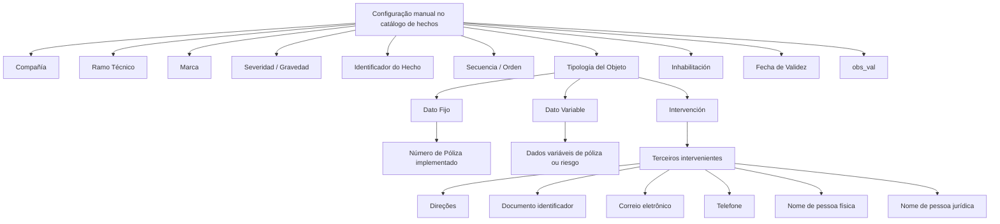

# Definição de Hechos das Marcas no Reef.core

## 1. Metadados do Documento
- **Arquivo de Origem:** `Não informado`
- **Tipo de Documento:** Documentação funcional
- **Domínio / Sistema:** Reef.core — catálogo de hechos/marcas
- **Público-Alvo:** Negócio, analistas funcionais, configuradores e operação
- **Data/Versão Identificada:** Não identificada

---

## 2. Resumo Executivo & Contexto de Negócio

O documento descreve o catálogo de **hechos** do sistema Reef.core. Um hecho representa o cumprimento verificável de uma marca e de sua severidade, previamente configuradas pela entidade seguradora para realizar comprovações sobre terceiros intervenientes em uma apólice e/ou objetos segurados.

A configuração dos valores no catálogo de hechos é manual. Cada configuração identifica a companhia, o ramo técnico, a marca, a severidade, o identificador do hecho, a sequência e o escopo do objeto sobre o qual a validação será aplicada.

O catálogo admite três tipologias de objeto: **Dato Fijo**, **Dato Variable** e **Intervención**. O tratamento de cada tipologia determina os atributos disponíveis e os critérios que podem ser configurados para identificar dados de apólices, riscos ou terceiros.

O documento também define propriedades para manutenção operacional da configuração, incluindo inabilitação, data de validade e observações (`obs_val`). A data de validade permite preservar histórico de mudanças ao longo do tempo.

---

## 3. Arquitetura, Componentes & Tecnologias Envolvidas

### Componentes e conceitos identificados

| Componente / Conceito | Descrição |
| :--- | :--- |
| Reef.core | Sistema no qual é configurado e processado o catálogo de hechos. |
| Catálogo de hechos | Cadastro manual de configurações que associa marcas, severidades, objetos e critérios de identificação. |
| Marca | Elemento identificado e configurado no catálogo de hechos. |
| Severidad/Gravedad | Tipo de severidade ou gravidade da marca informado ao Reef.core. |
| Compañía | Código da companhia para a qual a configuração é realizada. |
| Ramo Técnico | Ramo técnico considerado na configuração do hecho. |
| Terceros | Pessoas ou entidades que podem intervir nas operações de emissão do Reef.core. |
| Póliza | Apólice sobre a qual dados fixos ou variáveis podem ser associados a um hecho. |
| Riesgo | Nível de risco no qual dados variáveis também podem ser configurados. |
| Estrutura geográfica | Catálogos de países, estados, províncias e localidades usados na identificação de endereços de terceiros. |



> **Nota de Análise:** O documento não detalha métodos HTTP, contratos JSON, banco de dados, integrações técnicas, URLs, ambientes ou mecanismos automatizados para o catálogo de hechos.

---

## 4. Regras de Negócio, Especificações Funcionais & Processos

### Definição de hecho

Um hecho é, em termos gerais, uma ação, obra ou acontecimento considerado ocorrido. No contexto do Reef.core, um hecho corresponde ao cumprimento verdadeiro de uma marca e de uma severidade configuradas pela entidade seguradora.

A finalidade do hecho é permitir que o Reef.core execute comprovações sobre:
- Informações de terceiros intervenientes em uma apólice.
- Objetos segurados em uma apólice.

### Configuração do catálogo

- A configuração dos valores do catálogo de hechos é realizada manualmente.
- Cada configuração deve considerar a companhia e o ramo técnico aplicáveis.
- A marca identifica o elemento configurado.
- A severidade ou gravidade indica ao Reef.core a classificação da marca.
- O identificador do hecho identifica a configuração no catálogo.
- A sequência ou ordem é atribuída automaticamente pelo Reef.core.

### Tipologias de objeto

| Tipologia | Regra funcional |
| :--- | :--- |
| Dato Fijo | Atualmente, a única tipologia implementada como dado fixo é o campo **Número de Póliza**. |
| Dato Variable | Pode ser associado qualquer dado variável configurado no ramo técnico, tanto no nível de apólice quanto no nível de risco. |
| Intervención | Pode ser associada qualquer figura de terceiros que possa intervir nas operações de emissão do Reef.core. |

### Regras para a tipologia Intervención

Quando a tipologia do objeto é **Intervención**, a configuração pode identificar:
- Tipo de terceiro ou forma de intervenção, como Tomador, Tomador alterno, Beneficiario e Asegurado.
- Direções.
- Tipo e código do documento identificador do terceiro.
- Correio eletrônico.
- Telefone.
- Nomes e sobrenomes de pessoas físicas.
- Nome da empresa para pessoas jurídicas.

### Regras para atributos de Dato Fijo e Dato Variable

Quando a tipologia é **Dato Fijo** ou **Dato Variable**:
- O atributo define o nome do atributo considerado.
- O valor do dado fixo ou variável determina o valor do atributo configurado.
- A seleção do valor depende da definição realizada para a propriedade Atributo.

### Regras para documento identificador

Quando:
1. A tipologia do objeto é **Intervención**; e
2. O atributo indica o contexto de tipo e código do documento identificador do terceiro;

então:
- **Tipo Documento Identificador** determina o tipo de documento usado para identificar a pessoa física ou jurídica.
- **Clave del Documento Identificador** determina o valor do documento usado para identificação.

### Regras para identificação nominal de terceiros

Quando:
1. A tipologia do objeto é **Intervención**; e
2. O atributo indica contexto de nome e sobrenomes de pessoa física, ou nome de pessoa jurídica;

então:
- **Nombre del Tercero** identifica o nome.
- **Segundo Nombre del Tercero** identifica o segundo nome apenas para pessoas físicas.
- **Primer Apellido del Tercero** identifica o primeiro sobrenome apenas para pessoas físicas.
- **Segundo Apellido del Tercero** identifica o segundo sobrenome apenas para pessoas físicas.

### Regras para endereços de terceiros

Quando:
1. A tipologia do objeto é **Intervención**; e
2. O atributo indica contexto de endereço do terceiro;

podem ser identificados:
- País: primeiro nível da estrutura geográfica.
- Estado: segundo nível da estrutura geográfica.
- Província: terceiro nível da estrutura geográfica.
- Cidade: quarto nível da estrutura geográfica.
- Código postal: chave associada aos cinco níveis da estrutura geográfica.
- Tipo de domicílio: tipo de via, como rua, avenida, praça, estrada ou caminho.
- Endereço: endereço específico do terceiro.
- Número: número do endereço.
- Complemento de endereço: informação adicional, como urbanização, ponto quilométrico ou andar de um edifício em endereço comercial.
- Complemento país: informação complementar de endereço somente quando o endereço registrado não pertence ao país da entidade seguradora.

### Exclusividade entre complementos de endereço

A captura de informações no campo **Complemento Dirección** é exclusiva em relação à captura de informações no campo **Complemento País**. Portanto, ambos os campos não devem ser preenchidos simultaneamente para a mesma configuração.

### Regras de operação e histórico

| Propriedade | Regra |
| :--- | :--- |
| `obs_val` | Permite registrar texto explicativo sobre a configuração do hecho, sua finalidade, intenção e área beneficiada. |
| Inhabilitación | Estabelece que o hecho está desativado ou inabilitado para uso no tratamento de marcas. |
| Fecha de Validez | Define a data a partir da qual o registro configurado fica plenamente operacional no sistema. Permite manter histórico das mudanças ao longo do tempo. |

### Codificação do catálogo

O documento informa que não há preferência nem recomendação para padronizar a codificação dos hechos no sistema. A entidade MAPFRE pode decidir agrupar e codificar os hechos conforme a tipologia dos objetos.

---

## 5. Tabelas de Parâmetros, Ambientes e Estruturas de Dados

| Item / Parâmetro | Descrição / Função | Tipo / Valores / Formato | Ambiente / Observações |
| :--- | :--- | :--- | :--- |
| Compañía | Código da companhia sobre a qual é realizada a configuração. | Código de companhia. | Catálogo de hechos. |
| Ramo Técnico | Determina o ramo técnico considerado na configuração. | Ramo técnico. | Catálogo de hechos. |
| Marca | Identifica a marca configurada. | Marca. | Catálogo de hechos. |
| Severidad/Gravedad | Informa ao Reef.core o tipo de severidade ou gravidade da marca. | Severidade / gravidade. | Catálogo de hechos. |
| Identificador del Hecho | Identifica o hecho no catálogo. | Identificador. | Catálogo de hechos. |
| Secuencia/Orden | Contém o número de sequência do hecho. | Número de sequência. | Atribuído automaticamente pelo Reef.core. |
| Tipología del Objeto | Define o objeto ou escopo de atuação da marca no hecho. | Dato Fijo; Dato Variable; Intervención. | Dato Fijo implementado: Número de Póliza. |
| Intervención del Tercero | Determina o tipo de terceiro ou sua forma de intervenção. | Tomador, Tomador alterno, Beneficiario, Asegurado, entre outros. | Aplicável quando Tipología del Objeto é Intervención. |
| Atributo | Define o atributo considerado na configuração. | Atributo de dado fixo, variável ou informação de terceiro. | Para Intervención, permite detalhar endereços, documentos, e-mail, telefone e nomes. |
| Valor del Dato Fijo/Dato Variable | Define o valor do atributo selecionado. | Valor configurado. | Aplicável a Dato Fijo ou Dato Variable. |
| Tipo Documento Identificador | Define o tipo de documento de identificação. | Tipo de documento. | Aplicável a Intervención com contexto de documento. |
| Clave del Documento Identificador | Define o valor do documento de identificação. | Chave / valor do documento. | Aplicável a Intervención com contexto de documento. |
| Nombre del Tercero | Define o nome de identificação do terceiro. | Nome. | Pessoas físicas ou jurídicas, conforme o atributo. |
| Segundo Nombre del Tercero | Define o segundo nome do terceiro. | Segundo nome. | Aplicável a pessoas físicas. |
| Primer Apellido del Tercero | Define o primeiro sobrenome. | Primeiro sobrenome. | Aplicável a pessoas físicas. |
| Segundo Apellido del Tercero | Define o segundo sobrenome. | Segundo sobrenome. | Aplicável a pessoas físicas. |
| País | Identifica o primeiro nível geográfico do endereço. | Código de país. | Conforme catálogo de países do sistema. |
| Estado | Identifica o segundo nível geográfico do endereço. | Código de estado. | Conforme catálogo de estados do sistema. |
| Provincia | Identifica o terceiro nível geográfico do endereço. | Código de província. | Conforme catálogo de províncias do sistema. |
| Ciudad | Identifica o quarto nível geográfico do endereço. | Código de localidade. | Conforme catálogo de localidades do sistema. |
| Código Postal | Identifica a chave do código postal. | Código postal. | Associado aos cinco níveis geográficos. |
| Tipo de Domicilio | Identifica o tipo de via do endereço. | Calle, avenida, plaza, carretera, camino, entre outros. | Aplicável a endereço de terceiro. |
| Dirección | Identifica o endereço específico do terceiro. | Endereço. | Aplicável a Intervención. |
| Número | Identifica o número do endereço. | Número. | Aplicável a Intervención. |
| Complemento Dirección | Registra informação adicional de endereço. | Urbanização, ponto quilométrico, andar, entre outros. | Exclusivo em relação a Complemento País. |
| Complemento País | Registra informação complementar para endereço fora do país da entidade seguradora. | Informação complementar. | Exclusivo em relação a Complemento Dirección. |
| `obs_val` | Registra observações sobre o hecho. | Texto livre. | Pode descrever finalidade, intenção e área beneficiada. |
| Inhabilitación | Desativa ou inabilita o hecho para tratamento de marcas. | Estado de inabilitação. | Propriedade operacional. |
| Fecha de Validez | Define início de operação plena do registro. | Data. | Suporta histórico de mudanças. |

---

## 6. Bateria de Perguntas & Respostas para RAG (FAQ Sintético)

### P1: O que é um hecho no contexto do Reef.core?
**R:** Um hecho no Reef.core é o cumprimento verdadeiro de uma marca e de uma severidade configuradas pela entidade seguradora. O hecho é utilizado para realizar comprovações sobre informações dos terceiros intervenientes em uma apólice e/ou sobre os objetos segurados nessa apólice.

### P2: Como os valores do catálogo de hechos são configurados no Reef.core?
**R:** Os valores do catálogo de hechos são configurados manualmente. A configuração considera, entre outras propriedades, companhia, ramo técnico, marca, severidade, identificador do hecho, tipologia do objeto e critérios específicos conforme o tipo de objeto selecionado.

### P3: Quais são as tipologias de objeto disponíveis para um hecho?
**R:** As tipologias disponíveis são Dato Fijo, Dato Variable e Intervención. Dato Fijo trata dados fixos; Dato Variable permite associar dados variáveis configurados no ramo técnico em nível de apólice ou risco; Intervención permite associar figuras de terceiros que intervêm nas operações de emissão do Reef.core.

### P4: Qual dado fixo está implementado atualmente no catálogo de hechos?
**R:** O documento informa que, atualmente, a única tipologia implementada quando o tipo é Dato Fijo é o campo Número de Póliza.

### P5: Que dados podem ser associados a um hecho do tipo Dato Variable?
**R:** Quando a tipologia do objeto é Dato Variable, pode-se associar ao hecho qualquer dado variável configurado no ramo técnico, tanto em nível de póliza quanto em nível de riesgo.

### P6: O que pode ser configurado quando a tipologia do objeto é Intervención?
**R:** Para Intervención, é possível associar figuras de terceiros que participam das operações de emissão, como Tomador, Tomador alterno, Beneficiario e Asegurado. Também podem ser configuradas informações de endereço, documento identificador, e-mail, telefone, nomes e sobrenomes de pessoas físicas e nome de empresas de pessoas jurídicas.

### P7: Como é configurada a identificação documental de um terceiro?
**R:** Quando a tipologia é Intervención e o atributo se refere a tipo e código do documento identificador do terceiro, o campo Tipo Documento Identificador determina o tipo de documento, e o campo Clave del Documento Identificador determina o valor do documento usado para identificar a pessoa física ou jurídica.

### P8: Como são tratados os componentes geográficos do endereço de um terceiro?
**R:** Para um hecho do tipo Intervención cujo atributo se refere a endereço, País, Estado, Provincia e Ciudad identificam os quatro primeiros níveis da estrutura geográfica. O Código Postal identifica uma chave associada aos cinco níveis da estrutura geográfica definidos para o endereço.

### P9: É permitido preencher Complemento Dirección e Complemento País ao mesmo tempo?
**R:** Não. O documento estabelece que a captura de informação em Complemento Dirección é exclusiva em relação à captura de informação em Complemento País. Portanto, os dois campos não devem ser utilizados simultaneamente.

### P10: Para que serve o campo obs_val?
**R:** O campo `obs_val` permite registrar um texto aclaratório sobre a configuração do hecho. Esse texto pode explicar a finalidade da configuração, o que se pretende alcançar, a área beneficiada ou outra informação relevante.

### P11: Qual é a função da propriedade Inhabilitación?
**R:** Inhabilitación estabelece que o hecho está desativado ou inabilitado para ser utilizado no tratamento de marcas.

### P12: Como a Fecha de Validez contribui para o histórico do catálogo?
**R:** Fecha de Validez indica a data a partir da qual o registro configurado do hecho fica plenamente operacional no sistema. Seu uso correto permite manter histórico das modificações realizadas ao longo do tempo.

### P13: Existe uma regra obrigatória de codificação dos hechos?
**R:** Não. O documento afirma que não existe preferência nem recomendação para estabelecer ou padronizar a codificação no sistema. A entidade MAPFRE pode optar por agrupar e codificar os hechos segundo a tipologia dos objetos.

---

## 7. Glossário de Termos, Siglas & Conceitos-Chave

- **Reef.core:** Sistema no qual o catálogo de hechos é configurado e utilizado para tratamento de marcas.
- **Hecho:** Cumprimento verificável de uma marca e severidade configuradas para efetuar comprovações.
- **Marca:** Elemento configurado no catálogo de hechos.
- **Severidad/Gravedad:** Classificação de severidade ou gravidade atribuída a uma marca.
- **Compañía:** Código da companhia para a qual a configuração é realizada.
- **Ramo Técnico:** Ramo técnico considerado na configuração do hecho.
- **Póliza:** Apólice.
- **Riesgo:** Nível de risco associado à configuração de dados variáveis.
- **Tercero:** Pessoa ou entidade que pode intervir nas operações de emissão.
- **Tomador:** Figura de terceiro interveniente citada no documento.
- **Tomador alterno:** Forma de intervenção de terceiro citada no documento.
- **Beneficiario:** Figura de terceiro interveniente citada no documento.
- **Asegurado:** Figura de terceiro interveniente citada no documento.
- **Dato Fijo:** Tipologia de objeto para dado fixo; o documento informa que Número de Póliza é a implementação atual.
- **Dato Variable:** Tipologia de objeto para dados variáveis configurados no ramo técnico.
- **Intervención:** Tipologia de objeto relacionada aos terceiros intervenientes.
- **obs_val:** Propriedade para texto aclaratório sobre a configuração do hecho.
- **Inhabilitación:** Propriedade que desativa ou inabilita um hecho.
- **Fecha de Validez:** Data a partir da qual a configuração fica plenamente operacional.

---

## 8. Notas Críticas, Riscos & Limitações

- A configuração do catálogo de hechos é manual, o que pode exigir controles operacionais para consistência e governança dos cadastros.
- O documento informa que apenas o campo **Número de Póliza** está implementado para a tipologia **Dato Fijo**.
- Não há recomendação ou padronização obrigatória para codificação dos hechos; a MAPFRE pode definir seu próprio agrupamento conforme a tipologia dos objetos.
- Complemento Dirección e Complemento País são mutuamente exclusivos.
- O documento recomenda a leitura de Definición de Marcas e Preguntas frecuentes para evitar interpretação isolada e incorreta.
- O conteúdo não detalha contratos técnicos, APIs, integrações, persistência de dados, permissões, ambientes ou fluxos de aprovação.

---

## 9. Conteúdo Bruto Estruturado (Referência Fiel)

```text
--- [PÁGINA 1 DE 4] ---

DEFINIR HECHOS de las MARCAS

Objetivo

Un hecho es, en términos generales, una acción, obra o acontecimiento, algo que se da por ocurrido. Se trata de un término empleado en muchos contextos, derivado del verbo latino facere (“hacer”).

Un hecho en el ámbito de Reef.core es el cumplimiento veraz de alguna marca y severidad que la entidad aseguradora haya configurado en el sistema para realizar alguna comprobación sobre la información de los Terceros intervinientes en una póliza y/o sobre los objetos asegurados en la misma.

La configuración de valores en este catálogo se realiza manualmente.

Datos Identificativos
Otras Propiedades

Datos Identificativos

Compañía
Este Atributo del catálogo de hechos contiene el código de la compañía sobre la que se está realizando la configuración.

Ramo Técnico
Esta propiedad determina el ramo técnico que se ha de tomar en consideración en la configuración del hecho.

Marca
Esta propiedad del catálogo de hechos identifica la marca que se está configurando.

Severidad/Gravedad
Este atributo en la parametrización del hecho le indica a Reef.core el tipo de severidad o gravedad de la marca.

Identificador del Hecho
Esta propiedad del catálogo identifica el hecho.

Secuencia/Orden
Este dato contiene el Número de Secuencia del Hecho. Es un valor que se asigna en Reef.core automáticamente.

Tipología del Objeto

Documentation / DOCUMENTACIÓN Reef
DOCUMENTACIÓN Reef
Mapfredocument
DOCUMENTACIÓN Reef
Owner
user:agonzalez_mapfre.com
Lifecycle
Approved Source / VL
Buscar Inicio Soluciones Arquitecturas APIs Componentes Cloud Documentación Zeus Reef Ayuda
ES

--- [PÁGINA 2 DE 4] ---

Esta propiedad determina el objeto o el ámbito de actuación de la marca en el hecho. Sus valores pueden ser:
Dato Fijo.
Dato Variable.
Intervención.

Actualmente la única tipología que se ha implementado si el tipo es un 'Dato Fijo' es el campo Número de Póliza.

En el caso que la tipología del objeto fuera un dato variable se podrá asociar al hecho cualquier dato variable configurado en el Ramo Técnico a nivel de póliza o a nivel de riesgo indistintamente.

En el caso que la tipología del objeto fuera una Intervención, se podrá asociar cualquiera de las figuras de los Terceros que pueden intervenir en las operaciones de emisión de Reef.core.

Intervención del Tercero
Esta propiedad determina el tipo de Tercero o su forma de intervención (Tomador, Tomador alterno, Beneficiario, Asegurado,...) en el caso que la tipología del Objeto fuera del tipo 'Intervención'.

Atributo
Esta propiedad determina el nombre del atributo que se ha de tomar en consideración en el caso que la tipología del Objeto fuera del tipo 'Dato Fijo o Dato Variable'.

En el caso que la tipología del objeto correspondiera a una 'Intervención' esta propiedad permite profundizar en la definición admitiendo asociar al hecho información específica:
Direcciones.
Tipo y Código del Documento Identificador del Tercero.
Correo Electrónico.
Teléfono.
Nombres y Apellidos en Personas Físicas.
Nombre de la Empresa en Personas Jurídicas.

Valor del Dato Fijo/Dato Variable
Este atributo determina el valor del atributo que se ha de tomar en consideración en el caso que la tipología del Objeto fuera del tipo 'Dato Fijo o Dato Variable' y de acuerdo a su vez con la definición de la propiedad anterior.

Tipo Documento Identificador
En el caso que la tipología del Objeto fuera del tipo 'Intervención' y el valor del atributo indicara que el contexto se refiere al Tipo y Código de Documento identificador del Tercero, esta propiedad determina el tipo de documento con el que se va a identificar a la persona física o jurídica.

Clave del Documento Identificador
En el caso que la tipología del Objeto fuera del tipo 'Intervención' y el valor del atributo indicara que el contexto se refiere al Tipo y Código de Documento identificador del Tercero, esta propiedad determina el valor del documento con el que se van a identificar.

Nombre del Tercero
En el caso que la tipología del Objeto fuera del tipo 'Intervención' y el valor del atributo indicara que el contexto se refiere al Nombre y Apellidos de Personas Físicas o al Nombre en Personas Jurídicas, esta propiedad determina el nombre con el que se van a identificar.

Segundo Nombre del Tercero
En el caso que la tipología del Objeto fuera del tipo 'Intervención' y el valor del atributo indicara que el contexto se refiere al Nombre y Apellidos de Personas Físicas, esta propiedad permite identificar el segundo nombre con el que se va a identificar el hecho.

Primer Apellido del Tercero

--- [PÁGINA 3 DE 4] ---

En el caso que la tipología del Objeto fuera del tipo 'Intervención' y el valor del atributo indicara que el contexto se refiere al Nombre y Apellidos de Personas Físicas, esta propiedad permite identificar el primer apellido con el que se va a identificar el hecho.

Segundo Apellido del Tercero
En el caso que la tipología del Objeto fuera del tipo 'Intervención' y el valor del atributo indicara que el contexto se refiere al Nombre y Apellidos de Personas Físicas, esta propiedad permite identificar el segundo apellido con el que se va a identificar el hecho.

País
En el caso que la tipología del Objeto fuera del tipo 'Intervención' y el valor del atributo indicara que el contexto se refiere a una Dirección del Tercero, esta propiedad permite identificar el código del primer nivel de la estructura Geográfica en la que se encuentra ubicada la Dirección del Tercero de acuerdo con la relación de posibles valores existentes en el catálogo de países existente en el Sistema.

Estado
En el caso que la tipología del Objeto fuera del tipo 'Intervención' y el valor del atributo indicara que el contexto se refiere a una Dirección del Tercero, esta propiedad permite identificar el código del segundo nivel de la estructura Geográfica en la que se encuentra ubicada la Dirección del Tercero de acuerdo con la relación de posibles valores existentes en el catálogo de estados existente en el Sistema.

Provincia
En el caso que la tipología del Objeto fuera del tipo 'Intervención' y el valor del atributo indicara que el contexto se refiere a una Dirección del Tercero, esta propiedad permite identificar el código del tercer nivel de la estructura Geográfica en la que se encuentra ubicada la Dirección del Tercero de acuerdo con la relación de posibles valores existentes en el catálogo de provincias existente en el Sistema.

Ciudad
En el caso que la tipología del Objeto fuera del tipo 'Intervención' y el valor del atributo indicara que el contexto se refiere a una Dirección del Tercero, esta propiedad permite identificar el código del cuarto nivel de la estructura Geográfica en la que se encuentra ubicada la Dirección del Tercero de acuerdo con la relación de posibles valores existentes en el catálogo de localidades existente en el Sistema.

Código Postal
En el caso que la tipología del Objeto fuera del tipo 'Intervención' y el valor del atributo indicara que el contexto se refiere a una Dirección del Tercero, esta propiedad permite identificar la clave que identifica el Código Postal asociado a los cinco niveles de la estructura geográfica en la que está ubicada la Dirección del Tercero.

Tipo de Domicilio
En el caso que la tipología del Objeto fuera del tipo 'Intervención' y el valor del atributo indicara que el contexto se refiere a una Dirección del Tercero, esta propiedad permite identificar el tipo de vía asociada a la dirección del Tercero (calle, avenida, plaza, carretera, camino,...)

Dirección
En el caso que la tipología del Objeto fuera del tipo 'Intervención' y el valor del atributo indicara que el contexto se refiere a una Dirección del Tercero, esta propiedad permite identificar la dirección específica del Tercero.

Número
En el caso que la tipología del Objeto fuera del tipo 'Intervención' y el valor del atributo indicara que el contexto se refiere a una Dirección del Tercero, esta propiedad permite identificar el número de la dirección del Tercero.

Complemento Dirección
En el caso que la tipología del Objeto fuera del tipo 'Intervención' y el valor del atributo indicara que el contexto se refiere a una Dirección del Tercero, esta propiedad permite identificar información complementaria de la Dirección del Tercero como por ejemplo:
1. Para indicar la Urbanización del Domicilio.
2. Para indicar algún punto kilométrico que facilite la ubicación del Domicilio.
3. Para indicar la Planta del Edificio en la que se encuentra la ubicación del Tercero en una Dirección tipificada como Dirección Comercial.

Complemento País

--- [PÁGINA 4 DE 4] ---

En el caso que la tipología del Objeto fuera del tipo 'Intervención' y el valor del atributo indicara que el contexto se refiere a una Dirección del Tercero, esta propiedad permite identificar información complementaria de la Dirección del Tercero siempre y cuando la dirección que se esté capturando en el sistema no sea del país de la entidad aseguradora.

La captura de información en el Campo Complemento Dirección es excluyente de la captura de información del Campo Complemento País.

obs_val
Esta propiedad permite registrar un texto aclaratorio sobre la configuración del Hecho: para qué se configure, qué se pretende con ella, qué área se beneficia de su definición,... es decir, cualquier información relevante sobre el mismo.

Otras Propiedades

Inhabilitación
Esta propiedad establece que el hecho está desactivado o inhabilitado para ser empleado en el tratamiento de las marcas.

Fecha de Validez
Esta propiedad le indica al sistema la fecha a partir de la cual el registro configurado del hecho está plenamente operativo en el sistema, por lo que su correcto uso permite tener un histórico de los cambios efectuados sobre ella a lo largo del tiempo.

Vínculos
Relación de Directrices y Documentos funcionales cuya lectura recomendada para evitar que la interpretación aislada del presente documento pueda conducir a error.
Definición de Marcas
Preguntas frecuentes

(1) ¿Existe alguna circunstancia operativa que deba ser tomada en consideración sobre este catálogo?
No existe una preferencia ni recomendación para establecer o estandarizar en el sistema su codificación, si bien la entidad MAPFRE puede estimar conveniente agrupar los hechos y codificarlos en consecuencia de acuerdo con la tipología de los objetos.
```
