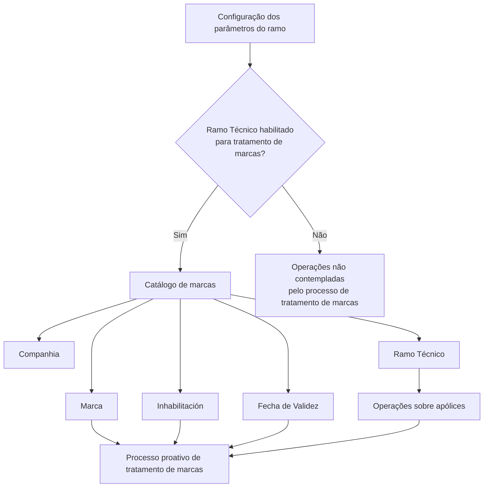

# Catálogo de Definição de Marcas por Ramo Técnico no Reef.core

## 1. Metadados do Documento
- **Arquivo de Origem:** Não identificado no conteúdo fornecido
- **Tipo de Documento:** Especificação Funcional
- **Domínio / Sistema:** Reef.core / DOCUMENTACIÓN Reef
- **Público-Alvo:** Analistas funcionais, equipes de configuração, desenvolvedores e operação
- **Data/Versão Identificada:** Não identificada
- **Lifecycle Identificado:** Approved Source
- **Owner Identificado:** `user:agonzalez_mapfre.com`

---

## 2. Resumo Executivo & Contexto de Negócio

O documento descreve o catálogo de configuração utilizado pelo núcleo do **Reef.core** para identificar marcas obrigatórias por **Ramo Técnico**. A finalidade é permitir que operações sobre apólices de ramos técnicos específicos sejam consideradas no processo proativo de tratamento de marcas.

A configuração depende de duas condições funcionais: o ramo técnico deve estar habilitado para participar do processo de tratamento de marcas na configuração dos parâmetros do ramo; e deve existir uma marca configurada para a combinação de companhia e ramo técnico aplicável.

O catálogo mantém atributos identificativos — Companhia, Ramo Técnico e Marca — e propriedades adicionais — Inhabilitación e Fecha de Validez. Esses atributos permitem controlar a aplicabilidade da marca, sua ativação operacional e a vigência histórica de cada registro configurado.

O conteúdo também referencia documentos funcionais relacionados, especificamente **Definición de Marcas** e **Ramos Técnicos**, cuja leitura é recomendada para reduzir o risco de interpretação isolada e incorreta desta especificação.

---

## 3. Arquitetura, Componentes & Tecnologias Envolvidas

| Componente / Artefato | Papel identificado no documento | Relação com o catálogo |
| :--- | :--- | :--- |
| Reef.core | Núcleo funcional do sistema Reef | Possui a capacidade de identificar marcas obrigatórias por Ramo Técnico. |
| Catálogo de marcas | Estrutura de configuração de marcas | Armazena companhia, ramo técnico, marca, inabilitação e data de validade. |
| Configuração dos parâmetros do ramo | Configuração do Ramo Técnico | Determina se o ramo entra no processo de tratamento de marcas. |
| Processo proativo de tratamento de marcas | Processo funcional | Considera operações sobre apólices dos ramos técnicos habilitados. |
| Apólices | Operações de negócio | Podem ser contempladas pelo processo quando o Ramo Técnico estiver habilitado. |
| Definición de Marcas | Documento funcional relacionado | Leitura recomendada. |
| Ramos Técnicos | Documento funcional relacionado | Leitura recomendada. |



**Nota de Análise:** o documento não detalha tecnologias de implementação, interfaces, métodos HTTP, contratos JSON, banco de dados, ambientes de execução ou integrações técnicas externas do Reef.core.

---

## 4. Regras de Negócio, Especificações Funcionais & Processos

1. O núcleo do **Reef.core** possui a capacidade de identificar marcas obrigatórias por **Ramo Técnico**.
2. A identificação de marcas obrigatórias é aplicada aos ramos técnicos para os quais se pretende executar o processo proativo de tratamento de marcas.
3. O atributo **Compañía** contém o código da companhia para a qual a configuração está sendo realizada.
4. O atributo **Ramo Técnico** determina o código do Ramo Técnico habilitado para que operações sobre suas apólices sejam contempladas no processo de tratamento de marcas.
5. A habilitação do Ramo Técnico depende de configuração prévia nos parâmetros do ramo, definindo que esse ramo participará do processo de tratamento de marcas.
6. A propriedade **Marca** identifica a marca que deve ser contemplada ou controlada no contexto do Ramo Técnico configurado.
7. A propriedade **Inhabilitación** estabelece que a marca configurada para o Ramo Técnico está desativada ou inabilitada para uso nos procedimentos ou processos aplicáveis.
8. A propriedade **Fecha de Validez** informa a data a partir da qual o registro de marca configurado para o Ramo Técnico está operativo no sistema.
9. O uso correto de **Fecha de Validez** permite manter o histórico das alterações efetuadas na configuração da marca ao longo do tempo.
10. Não há circunstância operacional adicional documentada para o catálogo: a resposta da seção de perguntas frequentes é **N/A**.

---

## 5. Tabelas de Parâmetros, Ambientes e Estruturas de Dados

| Item / Parâmetro | Descrição / Função | Tipo / Valores / Formato | Ambiente / Observações |
| :--- | :--- | :--- | :--- |
| Compañía | Contém o código da companhia sobre a qual a configuração é realizada. | Código de companhia; formato não detalhado. | Atributo identificativo do catálogo de marcas. |
| Ramo Técnico | Determina o código do Ramo Técnico habilitado para que operações sobre suas apólices sejam contempladas no processo de tratamento de marcas. | Código de Ramo Técnico; formato não detalhado. | Requer que o ramo tenha sido configurado para entrar no processo de tratamento de marcas. |
| Marca | Identifica a marca que deve ser contemplada ou controlada. | Marca; valores e formato não detalhados. | Atributo identificativo do catálogo de marcas. |
| Inhabilitación | Indica que a marca configurada para o Ramo Técnico está desativada ou inabilitada para uso. | Estado de inabilitação; representação não detalhada. | Aplicável aos procedimentos ou processos correspondentes. |
| Fecha de Validez | Informa a data a partir da qual o registro configurado de marca para o Ramo Técnico está operativo. | Data; formato não detalhado. | Permite preservar histórico de alterações da marca ao longo do tempo. |
| Processo proativo de tratamento de marcas | Processo que contempla operações sobre apólices de ramos técnicos habilitados. | Processo funcional; sem parâmetros detalhados. | Dependente da configuração de parâmetros do ramo e do catálogo de marcas. |
| Pergunta frequente operacional | Existência de circunstâncias operacionais adicionais sobre o catálogo. | `N/A` | Nenhuma circunstância adicional foi documentada. |

---

## 6. Bateria de Perguntas & Respostas para RAG (FAQ Sintético)

### P1: Qual é o objetivo do catálogo de definição de marcas por Ramo Técnico no Reef.core?
**R:** O catálogo permite ao núcleo do Reef.core identificar as marcas obrigatórias por Ramo Técnico para aplicação do processo proativo de tratamento de marcas.

### P2: Quando uma operação sobre uma apólice é contemplada pelo processo de tratamento de marcas?
**R:** Uma operação sobre uma apólice é contemplada quando o respectivo Ramo Técnico está habilitado para participar do processo de tratamento de marcas na configuração dos parâmetros do ramo.

### P3: Qual é a função do atributo Compañía no catálogo de marcas?
**R:** O atributo Compañía contém o código da companhia sobre a qual a configuração do catálogo de marcas está sendo realizada.

### P4: O que o atributo Ramo Técnico determina no catálogo?
**R:** O atributo Ramo Técnico determina o código do Ramo Técnico habilitado para que operações sobre suas apólices sejam consideradas no processo de tratamento de marcas.

### P5: O que deve estar configurado antes de um Ramo Técnico entrar no processo de tratamento de marcas?
**R:** A configuração dos parâmetros do ramo deve determinar que o Ramo Técnico entrará no processo de tratamento de marcas.

### P6: O que a propriedade Marca representa?
**R:** A propriedade Marca identifica a marca que deve ser contemplada ou controlada para o Ramo Técnico configurado.

### P7: Qual é o efeito da propriedade Inhabilitación?
**R:** Inhabilitación estabelece que a marca configurada para o Ramo Técnico está desativada ou inabilitada para utilização nos procedimentos ou processos aplicáveis.

### P8: Para que serve a propriedade Fecha de Validez?
**R:** Fecha de Validez indica a data a partir da qual o registro configurado da marca para o Ramo Técnico está operativo no sistema.

### P9: Como o catálogo suporta histórico de alterações de marcas?
**R:** O correto uso da Fecha de Validez permite manter histórico das mudanças efetuadas na configuração da marca ao longo do tempo.

### P10: Existem circunstâncias operacionais adicionais documentadas para esse catálogo?
**R:** Não. A seção de perguntas frequentes do documento responde `N/A` para a existência de circunstâncias operacionais que devam ser consideradas sobre o catálogo.

### P11: Quais documentos funcionais relacionados devem ser consultados?
**R:** O documento recomenda a leitura de **Definición de Marcas** e **Ramos Técnicos**, pois a interpretação isolada da especificação pode levar a erro.

---

## 7. Glossário de Termos, Siglas & Conceitos-Chave

- **Reef.core:** Núcleo do sistema Reef que possui a capacidade de identificar marcas obrigatórias por Ramo Técnico.
- **Ramo Técnico:** Código e classificação funcional habilitável para que operações sobre suas apólices participem do processo de tratamento de marcas.
- **Marca:** Elemento identificado, contemplado ou controlado pela configuração do catálogo para um Ramo Técnico.
- **Catálogo de marcas:** Estrutura de configuração que reúne atributos identificativos e outras propriedades das marcas por Ramo Técnico.
- **Compañía:** Código da companhia sobre a qual a configuração é efetuada.
- **Inhabilitación:** Propriedade que indica desativação ou inabilitação da marca configurada.
- **Fecha de Validez:** Data a partir da qual o registro de configuração da marca está operativo no sistema.
- **Processo proativo de tratamento de marcas:** Processo que utiliza a configuração de ramos técnicos e marcas para contemplar operações sobre apólices.
- **N/A:** Indicação de que não há informação adicional aplicável na pergunta frequente apresentada.
- **VL:** Sigla exibida no conteúdo bruto; o documento não fornece significado ou contexto adicional.

---

## 8. Notas Críticas, Riscos & Limitações

- A participação de um Ramo Técnico no processo de tratamento de marcas depende de uma configuração prévia nos parâmetros do ramo.
- Uma leitura isolada deste documento pode conduzir a erro; o próprio documento recomenda consultar **Definición de Marcas** e **Ramos Técnicos**.
- O documento não especifica o formato dos códigos de companhia, códigos de Ramo Técnico, valores de Marca, indicador de Inhabilitación ou formato de Fecha de Validez.
- O documento não detalha contratos de integração, métodos HTTP, APIs, persistência de dados, permissões, tecnologias de implementação ou ambientes técnicos.
- A seção de perguntas frequentes não apresenta circunstâncias operacionais adicionais, pois registra `N/A`.

---

## 9. Conteúdo Bruto Estruturado (Referência Fiel)

```text
--- [PÁGINA 1 DE 2] ---

DEFINIR MARCAS por Ramo
Objetivo
Funcionalmente, el núcleo de Reef.core cuenta con la posibilidad de identicar las marcas que son obligatorias por Ramo Técnico sobre los
que se busca aplicar el proceso proactivo del tratamiento de marcas.
Datos Identicativos
Otras Propiedades
Datos Identicativos
Compañía
Este Atributo del catálogo de marcas contiene el código de la compañía sobre la que se está realizando la conguración.
Ramo Técnico
Este Atributo del catálogo determina el código del Ramo Técnico que se habilita para que las operaciones sobre sus pólizas estén
contempladas en el proceso de tratamiento de marcas.
Siempre y cuando se haya determinado en la conguración de los parámetros del ramo el que éste vaya a entrar en el proceso de
tratamiento de marcas.
Marca
Esta propiedad del catálogo de marcas identica la marca que se debe contemplar/controlar.
Otras Propiedades
Inhabilitación
Esta propiedad establece que la marca congurada para el ramo técnico está desactivada o inhabilitada para ser utilizada en los
procedimientos o procesos que sean de aplicación.
Fecha de Validez
Esta propiedad le indica al sistema la fecha a partir de la cual el registro congurado de la marca para el ramo técnico está operativo en el
sistema, por lo que su correcto uso permite tener un histórico de los cambios efectuados sobre ella a lo largo del tiempo.
Vínculos
Documentation / DOCUMENTACIÓN Reef
DOCUMENTACIÓN Reef
Mapfredocument
DOCUMENTACIÓN Reef
Owner
user:agonzalez_mapfre.com
Lifecycle
Approved Source
 / 
 VL
Buscar Inicio Soluciones Arquitecturas APIs Componentes Cloud Documentación Zeus Reef Ayuda
ES


--- [PÁGINA 2 DE 2] ---

Relación de Directrices y Documentos funcionales cuya lectura recomendada para evitar que la interpretación aislada del presente
documento pueda conducir a error.
Denición de Marcas
Ramos Técnicos
Preguntas frecuentes
(1) ¿Existe alguna circunstancia operativa que deba ser tomada en consideración sobre este catálogo?
N/A
```
