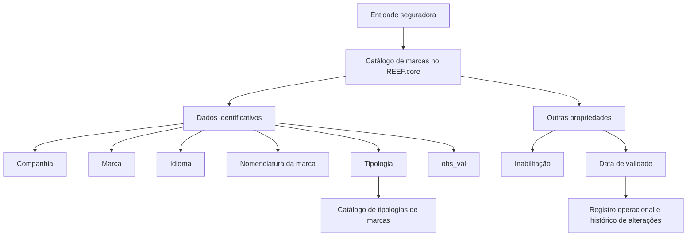

# Definição de Marcas no REEF.core

## 1. Metadados do Documento
- **Arquivo de Origem:** Não identificado no conteúdo extraído
- **Tipo de Documento:** Especificação Funcional
- **Domínio / Sistema:** REEF.core / MAPFRE
- **Público-Alvo:** Negócio, configuração funcional e equipes técnicas da companhia
- **Data/Versão Identificada:** Não identificada

---

## 2. Resumo Executivo & Contexto de Negócio

O documento descreve o catálogo de **marcas** do sistema REEF.core. O catálogo permite que uma entidade seguradora registre e configure as marcas que pretende utilizar nos processos da companhia.

Cada registro de marca reúne informações identificativas, incluindo companhia, chave da marca, idioma, nomenclatura e tipologia. A configuração também permite registrar uma observação livre para explicar a finalidade da marca, a intenção da configuração ou a área beneficiada.

O documento estabelece propriedades operacionais para inabilitação e vigência. A inabilitação impede que uma marca seja empregada, contemplada ou utilizada nos processos da companhia. A data de validade define a partir de quando o registro está operacional e permite manter histórico das alterações realizadas ao longo do tempo.

Não há recomendação ou preferência para padronizar a codificação das marcas. Contudo, a MAPFRE deve avaliar o uso transversal do catálogo, distinguindo marcas próprias de áreas técnicas das marcas transversais, inclusive por tipologia.

---

## 3. Arquitetura, Componentes & Tecnologias Envolvidas

| Componente / Entidade | Função identificada |
| :--- | :--- |
| **REEF.core** | Sistema que disponibiliza o catálogo específico para configuração de marcas. |
| **Catálogo de marcas** | Repositório funcional de informações sobre marcas da entidade seguradora. |
| **Catálogo de tipologias de marcas** | Catálogo que contém os valores possíveis para a tipologia de uma marca. |
| **MAPFRE** | Entidade mencionada como responsável por analisar a conveniência de utilização transversal do catálogo. |
| **Mapfredocument** | Elemento textual exibido na extração documental; o documento não detalha sua função técnica. |



> **Nota de Análise:** O documento descreve propriedades funcionais do catálogo de marcas, mas não detalha interfaces, métodos HTTP, contratos JSON, banco de dados, integrações, ambientes, URLs, versões de software ou mecanismos técnicos de persistência.

---

## 4. Regras de Negócio, Especificações Funcionais & Processos

### 4.1 Objetivo do catálogo de marcas

O REEF.core permite recopilar, em um catálogo específico, as marcas que a entidade seguradora pretende configurar.

### 4.2 Dados identificativos da marca

1. **Companhia**
   - Contém o código da companhia sobre a qual está sendo realizada a configuração.

2. **Marca**
   - Identifica a chave da marca no catálogo de marcas.

3. **Idioma**
   - Contém a chave do idioma utilizado na nomenclatura da marca.
   - O documento cita como exemplos espanhol, inglês e turco.

4. **Nomenclatura da Marca**
   - Contém o nome da marca de acordo com o idioma selecionado para a configuração.

5. **Tipologia**
   - Indica ao REEF.core a tipologia da marca.
   - A tipologia deve corresponder a um dos valores possíveis configurados no catálogo de tipologias de marcas.

6. **obs_val**
   - Permite registrar texto explicativo sobre a definição da marca.
   - Pode registrar, entre outros conteúdos:
     - finalidade da configuração;
     - intenção associada à marca;
     - área beneficiada pela definição;
     - demais informações consideradas relevantes sobre a marca.

### 4.3 Outras propriedades

1. **Inabilitação**
   - Determina que a marca está desativada ou inabilitada.
   - Uma marca inabilitada não deve ser empregada, contemplada ou utilizada nos processos da companhia.

2. **Data de Validade**
   - Define a data a partir da qual o registro configurado de marca torna-se operacional no sistema.
   - O uso correto da data de validade permite manter um histórico das mudanças efetuadas sobre a marca ao longo do tempo.

### 4.4 Considerações operacionais

- Não existe preferência ou recomendação para estabelecer ou padronizar a codificação das marcas no sistema.
- A entidade MAPFRE deve analisar a conveniência de utilizar o catálogo de informação de forma transversal nos processos da companhia.
- A exploração transversal pode envolver:
  - agrupamento e distinção da codificação de marcas próprias de cada área técnica;
  - identificação de marcas transversais entre áreas técnicas;
  - diferenciação de marcas conforme a sua tipologia.

### 4.5 Vínculos documentais recomendados

O documento recomenda a leitura de diretrizes e documentos funcionais relacionados, pois uma interpretação isolada pode conduzir a erro. Os vínculos citados são:

- **Definición de Marcas**
- **Preguntas frecuentes**

---

## 5. Tabelas de Parâmetros, Ambientes e Estruturas de Dados

| Item / Parâmetro | Descrição / Função | Tipo / Valores / Formato | Ambiente / Observações |
| :--- | :--- | :--- | :--- |
| Companhia | Código da companhia para a qual a configuração de marca é realizada. | Código da companhia; formato não especificado. | Aplicável ao catálogo de marcas do REEF.core. |
| Marca | Chave que identifica a marca. | Chave; formato não especificado. | Dado identificativo da marca. |
| Idioma | Chave do idioma usada na nomenclatura da marca. | Chave de idioma; exemplos: espanhol, inglês, turco. | Associado à nomenclatura da marca. |
| Nomenclatura da Marca | Nome da marca no idioma selecionado. | Texto; formato não especificado. | Deve estar de acordo com o idioma configurado. |
| Tipologia | Classificação funcional da marca. | Um dos valores possíveis do catálogo de tipologias de marcas. | O documento não lista os valores possíveis. |
| obs_val | Texto aclaratório sobre a definição e o uso da marca. | Texto livre. | Pode indicar finalidade, intenção, área beneficiada ou informação relevante. |
| Inabilitação | Indica que a marca está desativada para uso nos processos. | Estado de inabilitação; valores técnicos não especificados. | Marca inabilitada não deve ser usada, contemplada ou empregada. |
| Data de Validade | Data de início da operação do registro de marca. | Data; formato não especificado. | Suporta histórico de alterações ao longo do tempo. |
| Catálogo de tipologias de marcas | Fonte dos valores possíveis para a tipologia. | Catálogo de valores; itens não especificados. | Dependência funcional do atributo Tipologia. |
| Codificação de marcas | Forma de codificar marcas no catálogo. | Não padronizada pelo documento. | A MAPFRE deve avaliar conveniência de uso transversal. |

> **Nota de Análise:** O conteúdo extraído não apresenta servidores, URLs, credenciais, variáveis de ambiente, rotas de log, portas de rede ou detalhes de integração.

---

## 6. Bateria de Perguntas & Respostas para RAG (FAQ Sintético)

### P1: Qual é o objetivo do catálogo de marcas no REEF.core?
**R:** O catálogo de marcas do REEF.core permite reunir, em um catálogo específico, as marcas que a entidade seguradora pretende configurar para utilização no contexto da companhia.

### P2: Qual informação o atributo Companhia representa no catálogo de marcas?
**R:** O atributo Companhia contém o código da companhia sobre a qual está sendo realizada a configuração da marca.

### P3: Como uma marca é identificada no REEF.core?
**R:** Uma marca é identificada pela propriedade Marca, que contém a chave da marca no catálogo de marcas. O documento não especifica o formato técnico ou a regra de geração dessa chave.

### P4: Para que serve o atributo Idioma na configuração de uma marca?
**R:** O atributo Idioma contém a chave do idioma empregada na nomenclatura da marca. O documento cita espanhol, inglês e turco como exemplos de idiomas.

### P5: Como a Nomenclatura da Marca deve ser preenchida?
**R:** A Nomenclatura da Marca deve conter o nome da marca de acordo com o idioma selecionado na configuração. Portanto, a nomenclatura está vinculada ao idioma informado para o registro.

### P6: De onde vêm os valores aceitos para a Tipologia da marca?
**R:** A Tipologia deve corresponder a um dos valores possíveis configurados no catálogo de tipologias de marcas. O documento não relaciona os valores desse catálogo.

### P7: Qual é a finalidade do campo obs_val?
**R:** O campo obs_val permite registrar um texto aclaratório sobre a definição da marca, incluindo a razão da configuração, o objetivo pretendido, a área beneficiada ou qualquer outra informação relevante.

### P8: O que acontece quando uma marca é inabilitada?
**R:** Uma marca inabilitada fica desativada para emprego, consideração ou utilização nos processos da companhia.

### P9: Qual é o papel da Data de Validade no catálogo de marcas?
**R:** A Data de Validade informa a partir de qual data o registro de marca configurado está operacional no sistema. O uso correto dessa propriedade permite manter histórico das alterações efetuadas sobre a marca ao longo do tempo.

### P10: O documento define um padrão obrigatório para a codificação das marcas?
**R:** Não. O documento afirma que não existe preferência nem recomendação para estabelecer ou padronizar a codificação das marcas no sistema.

### P11: Que análise a MAPFRE deve realizar sobre o catálogo de marcas?
**R:** A MAPFRE deve analisar a conveniência de utilizar o catálogo de marcas de forma transversal nos processos da companhia, distinguindo marcas próprias de áreas técnicas de marcas transversais, inclusive conforme a tipologia.

### P12: O documento descreve APIs ou contratos técnicos para o catálogo de marcas?
**R:** Não. O conteúdo apresenta a finalidade e os atributos funcionais do catálogo de marcas, mas não detalha APIs, métodos HTTP, contratos JSON, banco de dados ou integrações técnicas.

---

## 7. Glossário de Termos, Siglas & Conceitos-Chave

- **REEF.core:** Sistema citado como responsável por disponibilizar o catálogo específico de marcas.
- **MAPFRE:** Entidade mencionada no documento como responsável por analisar o uso transversal do catálogo de marcas.
- **Marca:** Entidade configurável no catálogo, identificada por uma chave e associada a companhia, idioma, nomenclatura e tipologia.
- **Catálogo de marcas:** Catálogo específico utilizado para reunir as marcas que a entidade seguradora pretende configurar.
- **Catálogo de tipologias de marcas:** Catálogo que contém os valores possíveis de tipologia para uma marca.
- **Tipologia:** Classificação atribuída à marca conforme valores do catálogo de tipologias de marcas.
- **Nomenclatura da Marca:** Nome da marca conforme o idioma selecionado.
- **Inabilitação:** Propriedade que desativa a marca para uso nos processos da companhia.
- **Data de Validade:** Propriedade que define a data a partir da qual o registro de marca está operacional.
- **obs_val:** Propriedade destinada ao registro de texto aclaratório sobre a definição da marca.
- **Mapfredocument:** Termo exibido na extração documental; não há definição funcional ou técnica adicional no conteúdo fornecido.

---

## 8. Notas Críticas, Riscos & Limitações

- O documento não define formatos, obrigatoriedade, cardinalidade ou regras de validação para os atributos do catálogo de marcas.
- Os valores possíveis de **Tipologia** não são apresentados; o documento apenas informa que eles estão configurados em um catálogo específico de tipologias de marcas.
- Não existe recomendação para padronização da codificação das marcas, o que pode demandar governança corporativa adicional para uso transversal.
- A interpretação isolada do documento pode conduzir a erro; a leitura dos documentos vinculados é recomendada.
- Não há detalhes sobre permissões, responsáveis pela manutenção do catálogo, auditoria, integrações, APIs, persistência, ambientes ou procedimentos operacionais.
- A extração contém caracteres possivelmente corrompidos, como `especíco`, `congurar` e `denición`. Esses trechos foram preservados na referência bruta para fidelidade à fonte.

---

## 9. Conteúdo Bruto Estruturado (Referência Fiel)

```text
--- [PÁGINA 1 DE 2] ---

DEFINIR MARCAS
Objetivo
Funcionalmente Reef.core cuenta con la posibilidad de recopilar en un catálogo especíco las 'marcas' que la entidad aseguradora pretende
congurar.
Datos Identicativos
Otras Propiedades
Datos Identicativos
Compañía
Este Atributo del catálogo de marcas contiene el código de la compañía sobre la que se está realizando la conguración.
Marca
Esta propiedad del catálogo de marcas identica la clave de la marca.
Idioma
Este Atributo contiene la clave del idioma empleado en la nomenclatura de la marca como por ejemplo: español, inglés, turco, ...
Nomenclatura de la Marca
Este Atributo contiene el nombre de la marca de acuerdo con el idioma seleccionado para su conguración.
Tipología
Este atributo en la parametrización de la marca le indica a Reef.core su tipología de acuerdo con uno de los [posibles valores] congurados
en el catálogo de tipologías de marcas.
obs_val
Esta propiedad permite registrar un texto aclaratorio sobre la denición de la marca: para qué se congure, qué se pretende con ella, qué área
se benecia de su denición,... es decir, cualquier información relevante sobre la marca.
Otras Propiedades
Inhabilitación
Documentation / DOCUMENTACIÓN Reef
DOCUMENTACIÓN Reef
Mapfredocument
DOCUMENTACIÓN Reef
Owner
user:agonzalez_mapfre.com
Lifecycle
Approved Source
 / 
 VL
Buscar Inicio Soluciones Arquitecturas APIs Componentes Cloud Documentación Zeus Reef Ayuda
ES


--- [PÁGINA 2 DE 2] ---

Esta propiedad establece que la marca está desactivada o inhabilitada para ser empleada, contemplada o utilizada en los procesos de la
compañía.
Fecha de Validez
Esta propiedad le indica al sistema la fecha a partir de la cual el registro congurado de la marca está operativo en el sistema, por lo que su
correcto uso permite tener un histórico de los cambios efectuados sobre ella a lo largo del tiempo.
Vínculos
Relación de Directrices y Documentos funcionales cuya lectura recomendada para evitar que la interpretación aislada del presente
documento pueda conducir a error.
Denición de Marcas
Preguntas frecuentes
(1) ¿Existe alguna circunstancia operativa que deba ser tomada en consideración sobre este catálogo?
No existe una preferencia ni recomendación para establecer o estandarizar en el sistema su codicación, si bien la entidad MAPFRE debe
analizar la conveniencia de utilizar transversalmente en los procesos de la compañía este catálogo de información para su correcta y
posterior explotación, e.g:
Agrupando y distinguiendo la codicación de las marcas propias de cada una de las áreas técnicas de la compañía, de aquellas marcas que
se puedan considerar transversales entre ellas, por su tipología, ...
```
