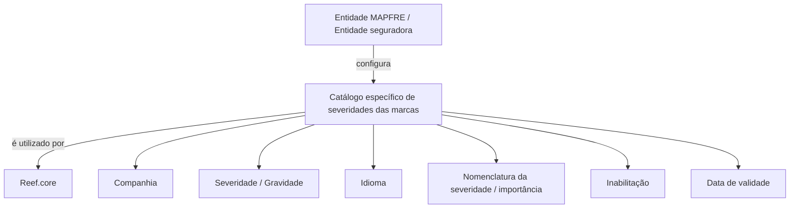

# Definição de Severidades das Marcas no Catálogo Reef.core

## 1. Metadados do Documento
- **Arquivo de Origem:** Não identificado no conteúdo extraído
- **Tipo de Documento:** Especificação Funcional
- **Domínio / Sistema:** Reef.core / Catálogo de Marcas
- **Público-Alvo:** Analistas funcionais, equipes de parametrização, negócio e operação
- **Data/Versão Identificada:** Não identificada

---

## 2. Resumo Executivo & Contexto de Negócio

O documento descreve a parametrização das severidades, também denominadas gravidade ou importância, das marcas no sistema Reef.core. O objetivo funcional é disponibilizar um catálogo específico para que a entidade seguradora configure os níveis de severidade aplicáveis às marcas.

Cada registro de severidade está associado a uma companhia, um idioma e uma nomenclatura textual. A associação com idioma permite manter a denominação da severidade de uma marca de acordo com a língua selecionada na configuração, incluindo exemplos como espanhol, inglês e turco.

A configuração também contém propriedades operacionais para inabilitação e data de validade. A inabilitação impede o uso de determinado código de severidade; a data de validade determina a partir de quando o registro configurado está operacional no sistema e viabiliza o histórico de alterações ao longo do tempo.

O documento não estabelece um padrão obrigatório de codificação para severidades. Entretanto, recomenda que a entidade MAPFRE analise a conveniência de utilizar transversalmente esse catálogo nos processos corporativos, permitindo exploração posterior coerente. Como exemplo não normativo, códigos de menor numeração podem representar severidades de menor gravidade.

---

## 3. Arquitetura, Componentes & Tecnologias Envolvidas

Os componentes e conceitos identificados são:

- **Reef.core:** Sistema que utiliza o catálogo de severidades ou gravidades das marcas.
- **Catálogo de marcas:** Catálogo específico no qual são configuradas as severidades das marcas.
- **Entidade seguradora / MAPFRE:** Organização responsável por analisar e realizar a configuração e potencial padronização de uso do catálogo.
- **Companhia:** Atributo que identifica o código da companhia para a qual a configuração está sendo realizada.
- **Idioma:** Atributo que identifica o idioma empregado na nomenclatura da severidade.
- **Documentação Reef / Mapfredocument:** Referências documentais apresentadas no conteúdo extraído.
- **Definição de Marcas:** Documento funcional cuja leitura é recomendada para evitar interpretação isolada incorreta.



> **Nota de Análise:** O documento não detalha interfaces, métodos HTTP, contratos JSON, banco de dados, tecnologias de infraestrutura, ambientes ou integrações técnicas do Reef.core.

---

## 4. Regras de Negócio, Especificações Funcionais & Processos

### 4.1 Objetivo funcional do catálogo

1. O Reef.core possui a capacidade de recopilar, em um catálogo específico, as severidades ou gravidades das marcas.
2. A entidade seguradora utiliza o catálogo para configurar a severidade ou gravidade pretendida para cada marca.
3. A severidade também é apresentada como importância da marca no conteúdo do documento.

### 4.2 Dados identificativos

1. **Companhia**
   - O atributo contém o código da companhia sobre a qual está sendo realizada a configuração.
   - A configuração de severidade está, portanto, contextualizada por companhia.

2. **Severidade/Gravidade**
   - O atributo informa ao Reef.core o tipo de severidade ou gravidade da marca.
   - O documento não define uma taxonomia fechada de valores de severidade.

3. **Idioma**
   - O atributo contém a chave do idioma usada na nomenclatura da severidade da marca.
   - São citados como exemplos de idioma: espanhol, inglês e turco.

4. **Nomenclatura da Severidade/Importância da marca**
   - O atributo contém o nome da importância ou severidade da marca.
   - O nome deve estar de acordo com o idioma selecionado na configuração.

### 4.3 Outras propriedades

1. **Inabilitação**
   - A propriedade estabelece que o código de severidade da marca está desativado ou inabilitado para uso.
   - O documento não descreve critérios adicionais, permissões, workflow de aprovação ou efeito retroativo da inabilitação.

2. **Data de Validade**
   - A propriedade informa ao sistema a data a partir da qual o registro configurado de importância da marca passa a estar operativo.
   - O uso correto da data de validade permite manter histórico das alterações efetuadas sobre a importância da marca ao longo do tempo.
   - O documento não define formato de data, timezone, regra de encerramento de vigência ou tratamento de sobreposição entre períodos.

### 4.4 Diretriz de codificação e uso corporativo

1. Não existe preferência ou recomendação documentada para estabelecer ou padronizar a codificação no sistema.
2. A entidade MAPFRE deve analisar a conveniência de utilizar transversalmente o catálogo de severidades das marcas nos processos da companhia.
3. A utilização transversal é apresentada como meio para correta exploração posterior das informações.
4. O documento fornece como exemplo de agrupamento e distinção:
   - Severidades podem ser codificadas de acordo com seu grau de importância.
   - Uma menor gravidade pode estar associada a uma menor numeração de código.
5. O exemplo de ordenação numérica não é declarado como regra obrigatória.

### 4.5 Dependência documental

A leitura de **Definición de Marcas** é recomendada para evitar que a interpretação isolada do presente documento conduza a erro.

---

## 5. Tabelas de Parâmetros, Ambientes e Estruturas de Dados

| Item / Parâmetro | Descrição / Função | Tipo / Valores / Formato | Ambiente / Observações |
| :--- | :--- | :--- | :--- |
| Companhia | Contém o código da companhia sobre a qual a configuração é realizada. | Código de companhia; formato não detalhado. | Dado identificativo da configuração. |
| Severidade/Gravidade | Indica ao Reef.core o tipo de severidade ou gravidade da marca. | Código ou tipo de severidade; valores não detalhados. | Dado identificativo da configuração. |
| Idioma | Contém a chave do idioma utilizada na nomenclatura da severidade. | Chave de idioma; exemplos: espanhol, inglês e turco. | Dado identificativo da configuração. |
| Nomenclatura da Severidade/Importância da marca | Contém o nome da importância ou severidade conforme o idioma selecionado. | Texto; formato e tamanho não detalhados. | Dado identificativo da configuração. |
| Inabilitação | Define que o código de severidade está desativado ou inabilitado para uso. | Propriedade de estado; valores não detalhados. | Outras propriedades. |
| Data de Validade | Determina a data a partir da qual o registro de importância está operativo no sistema. | Data; formato não detalhado. | Permite histórico de alterações ao longo do tempo. |
| Codificação de severidade | Possível ordenação de códigos por grau de importância. | Exemplo: menor gravidade, menor numeração do código. | Não existe padrão obrigatório ou recomendação de padronização. |
| Documento relacionado | Documento funcional recomendado para evitar interpretação isolada. | `Definición de Marcas`. | Referência documental. |
| Owner | Proprietário indicado no conteúdo extraído. | `user:agonzalez_mapfre.com`. | Metadado documental. |
| Lifecycle | Estado de ciclo de vida apresentado no conteúdo. | `Approved Source`. | Metadado documental. |

---

## 6. Bateria de Perguntas & Respostas para RAG (FAQ Sintético)

### P1: Qual é o objetivo do catálogo de severidades das marcas no Reef.core?
**R:** O catálogo permite que a entidade seguradora configure, em um repositório específico, as severidades, gravidades ou importâncias aplicáveis às marcas. O atributo de severidade informa ao Reef.core o tipo de gravidade associado à marca.

### P2: Quais atributos identificativos compõem a configuração de severidade de uma marca?
**R:** Os dados identificativos apresentados são Companhia, Severidade/Gravidade, Idioma e Nomenclatura da Severidade/Importância da marca. A Companhia identifica o código da companhia configurada; a Severidade/Gravidade informa o tipo de gravidade; o Idioma identifica a língua da nomenclatura; e a Nomenclatura contém o nome da severidade no idioma selecionado.

### P3: Como a companhia é representada no catálogo de severidades?
**R:** O atributo Companhia contém o código da companhia sobre a qual está sendo realizada a configuração da severidade da marca. O documento não especifica o formato, o tamanho ou uma lista de códigos de companhia válidos.

### P4: Qual é a finalidade do atributo Idioma na severidade da marca?
**R:** O atributo Idioma contém a chave da língua usada para nomear a severidade da marca. O documento cita espanhol, inglês e turco como exemplos. A nomenclatura da severidade deve estar alinhada ao idioma selecionado na configuração.

### P5: O que acontece quando uma severidade é marcada como inabilitada?
**R:** A propriedade Inabilitação estabelece que o código de severidade da marca fica desativado ou inabilitado para ser empregado. O documento não informa como ocorre a reativação, se há validações adicionais ou como a inabilitação afeta registros existentes.

### P6: Para que serve a Data de Validade na configuração de importância da marca?
**R:** A Data de Validade indica a partir de qual data o registro configurado de importância da marca está operativo no sistema. O uso correto dessa data permite manter histórico das mudanças realizadas na importância da marca ao longo do tempo.

### P7: Existe uma padronização obrigatória para os códigos de severidade no Reef.core?
**R:** Não. O documento declara que não existe preferência nem recomendação para estabelecer ou padronizar a codificação de severidades no sistema. A MAPFRE deve avaliar a conveniência de uso transversal desse catálogo em seus processos.

### P8: O documento recomenda alguma convenção para ordenar códigos de severidade?
**R:** O documento apresenta apenas um exemplo: agrupar e distinguir códigos conforme o grau de importância, de modo que uma menor gravidade possa receber uma menor numeração de código. Essa relação é ilustrativa e não é definida como regra obrigatória.

### P9: Qual benefício é associado ao uso transversal do catálogo de severidades?
**R:** O uso transversal do catálogo nos processos da companhia é apontado como uma decisão que a entidade MAPFRE deve analisar, visando a correta exploração posterior da informação de severidade das marcas.

### P10: Qual documento relacionado deve ser consultado para interpretar corretamente esta especificação?
**R:** O documento recomenda a leitura de **Definición de Marcas**, pois a interpretação isolada da especificação de severidades pode conduzir a erro.

### P11: O documento define APIs, métodos HTTP ou contratos de integração do catálogo de severidades?
**R:** Não. O conteúdo extraído descreve atributos funcionais e propriedades de parametrização, mas não apresenta APIs, métodos HTTP, payloads JSON, eventos, integrações, banco de dados ou contratos técnicos.

---

## 7. Glossário de Termos, Siglas & Conceitos-Chave

- **Reef.core:** Sistema que utiliza o catálogo específico para configuração de severidades ou gravidades das marcas.
- **Marca:** Entidade cujo nível de severidade, gravidade ou importância pode ser configurado no catálogo.
- **Catálogo de marcas:** Catálogo específico utilizado para registrar a configuração de severidades das marcas.
- **Severidade/Gravidade:** Tipo ou nível de importância associado a uma marca.
- **Nomenclatura da Severidade/Importância:** Nome textual da severidade da marca conforme o idioma configurado.
- **Inabilitação:** Propriedade que torna o código de severidade desativado ou indisponível para uso.
- **Data de Validade:** Data a partir da qual um registro de importância configurado passa a ser operativo no sistema.
- **MAPFRE:** Entidade mencionada como responsável por analisar a conveniência do uso transversal do catálogo nos processos corporativos.
- **Definición de Marcas:** Documento funcional relacionado cuja leitura é recomendada.
- **Mapfredocument:** Referência apresentada na seção de vínculos do conteúdo extraído.

---

## 8. Notas Críticas, Riscos & Limitações

- O documento não especifica o nome do arquivo de origem, a versão, a data de publicação ou a data de atualização.
- Não há definição de formato, domínio de valores, obrigatoriedade, unicidade ou tamanho dos atributos configuráveis.
- Não foram documentadas regras para sobreposição de datas de validade, encerramento de vigência, exclusão lógica ou tratamento de registros históricos.
- Não existe recomendação nem padrão obrigatório de codificação de severidades; isso pode resultar em inconsistências entre processos caso a MAPFRE não estabeleça governança complementar.
- A relação entre menor gravidade e menor numeração de código é apenas um exemplo, não uma regra funcional mandatória.
- Não há detalhamento de APIs, bancos de dados, integrações, ambientes, controles de acesso ou fluxos de aprovação.
- A interpretação do documento isoladamente pode conduzir a erro; a leitura de **Definición de Marcas** é expressamente recomendada.
- O texto extraído apresenta caracteres corrompidos em trechos como `especíco`, `conguración`, `Denición` e `codicación`; a estrutura analítica preserva o sentido aparente sem introduzir dados externos.

---

## 9. Conteúdo Bruto Estruturado (Referência Fiel)

```text
--- [PÁGINA 1 DE 2] ---

DEFINIR SEVERIDADES de las MARCAS
Objetivo
Funcionalmente Reef.core cuenta con la posibilidad de recopilar en un catálogo especíco las severidades o gravedad de las 'marcas' que la
entidad aseguradora pretende congurar.
Datos Identicativos
Otras Propiedades
Datos Identicativos
Compañía
Este Atributo del catálogo de marcas contiene el código de la compañía sobre la que se está realizando la conguración.
Severidad/Gravedad
Este atributo en la parametrización de la marca le indica a Reef.core el tipo de severidad o gravedad de la misma.
Idioma
Este Atributo contiene la clave del idioma empleado en la nomenclatura de la severidad de la marca como por ejemplo: español, inglés, turco,
...
Nomenclatura de la Severidad/Importancia de la marca
Este Atributo contiene el nombre de la importancia o severidad de la marca de acuerdo con el idioma seleccionado para su conguración.
Otras Propiedades
Inhabilitación
Esta propiedad establece que el código de la severidad de la marca está desactivada o inhabilitada para ser empleada.
Fecha de Validez
Esta propiedad le indica al sistema la fecha a partir de la cual el registro congurado de la importancia de la marca está operativo en el
sistema, por lo que su correcto uso permite tener un histórico de los cambios efectuados sobre ella a lo largo del tiempo.
Vínculos
Documentation / DOCUMENTACIÓN Reef
DOCUMENTACIÓN Reef
Mapfredocument
DOCUMENTACIÓN Reef
Owner
user:agonzalez_mapfre.com
Lifecycle
Approved Source
 / 
 VL
Buscar Inicio Soluciones Arquitecturas APIs Componentes Cloud Documentación Zeus Reef Ayuda
ES


--- [PÁGINA 2 DE 2] ---

Relación de Directrices y Documentos funcionales cuya lectura recomendada para evitar que la interpretación aislada del presente
documento pueda conducir a error.
Denición de Marcas
Preguntas frecuentes
(1) ¿Existe alguna circunstancia operativa que deba ser tomada en consideración sobre este catálogo?
No existe una preferencia ni recomendación para establecer o estandarizar en el sistema su codicación, si bien la entidad MAPFRE debe
analizar la conveniencia de utilizar transversalmente en los procesos de la compañía este catálogo de información para su correcta y
posterior explotación, e.g:
Agrupando y distinguiendo la codicación de las diferentes severidades de las marcas de acuerdo con su grado de importancia como por
ejemplo: a menor gravedad menor numeración del código.
```
