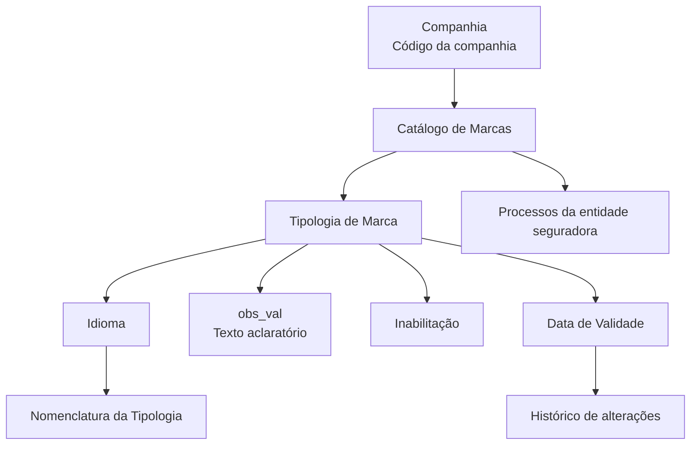

# Definição de Tipologias de Marcas no Reef.core

## 1. Metadados do Documento
- **Arquivo de Origem:** Não identificado no conteúdo extraído
- **Tipo de Documento:** Especificação Funcional
- **Domínio / Sistema:** Reef.core / MAPFRE
- **Público-Alvo:** Negócio, analistas funcionais e equipes responsáveis pela configuração de catálogos no Reef.core
- **Data/Versão Identificada:** Não identificada
- **Owner identificado:** `user:agonzalez_mapfre.com`
- **Lifecycle identificado:** Approved

---

## 2. Resumo Executivo & Contexto de Negócio

O documento descreve a funcionalidade de definição de tipologias de marcas no sistema Reef.core. A funcionalidade permite determinar, em um catálogo específico, diferentes tipologias aplicáveis às marcas.

A configuração da tipologia de marca envolve atributos identificativos e propriedades complementares. Os atributos incluem companhia, tipologia, idioma e nomenclatura da tipologia. As propriedades complementares incluem texto explicativo, inabilitação e data de validade.

A configuração é associada a uma companhia e permite manter a nomenclatura da tipologia em diferentes idiomas. O atributo de observação (`obs_val`) registra informações aclaratórias sobre a finalidade da tipologia, os controles pretendidos, a área beneficiada e demais informações relevantes relativas à marca.

A data de validade estabelece a partir de quando um registro de tipo se torna operacional no sistema. O uso correto dessa data permite manter histórico das mudanças realizadas nas tipologias de marcas ao longo do tempo.

O documento não recomenda nem estabelece uma padronização obrigatória para a codificação do catálogo. Contudo, indica que a entidade MAPFRE deve avaliar a conveniência de usar transversalmente esse catálogo e suas informações nos processos da companhia, visando exploração posterior adequada.

---

## 3. Arquitetura, Componentes & Tecnologias Envolvidas

| Componente / Entidade | Papel identificado no documento | Detalhamento disponível |
| :--- | :--- | :--- |
| Reef.core | Sistema no qual são determinadas e configuradas as tipologias de marcas. | O documento não detalha arquitetura técnica, integrações, APIs ou persistência de dados. |
| Catálogo de marcas | Catálogo específico utilizado para definir as diferentes tipologias das marcas. | Não são detalhados identificadores, estrutura física, serviços ou métodos de acesso. |
| Companhia | Entidade cujo código é informado na configuração do catálogo de marcas. | O atributo Companhia contém o código da companhia configurada. |
| MAPFRE | Entidade que deve analisar a conveniência de uso transversal do catálogo de informação. | Não há detalhamento de equipes, sistemas consumidores ou processos específicos. |
| Documentação Reef / Mapfredocument | Contexto documental de origem da especificação. | São citados na extração, sem detalhes adicionais de integração. |



> **Nota de Análise:** O documento descreve uma estrutura funcional de catálogo no Reef.core, mas não detalha microsserviços, métodos HTTP, contratos JSON, banco de dados, autenticação, ambientes ou ferramentas de implantação.

---

## 4. Regras de Negócio, Especificações Funcionais & Processos

### 4.1 Objetivo funcional
- O Reef.core possui a possibilidade de determinar, em um catálogo específico, diferentes tipologias para as marcas.
- A funcionalidade é denominada no conteúdo como “Definir tipos de marcas”.

### 4.2 Dados identificativos da tipologia de marca
- A configuração deve conter o código da companhia sobre a qual a configuração está sendo realizada.
- O atributo **Tipologia** determina no Reef.core o tipo da marca.
- O atributo **Idioma** contém a chave do idioma utilizada na nomenclatura da tipologia da marca.
- O documento exemplifica idiomas como espanhol, inglês e turco.
- O atributo **Nomenclatura da Tipologia** identifica o nome da tipologia de acordo com o idioma selecionado para configuração.

### 4.3 Outras propriedades da tipologia de marca
- A propriedade **`obs_val`** permite registrar um texto aclaratório sobre a definição da tipologia.
- O conteúdo registrado em `obs_val` pode documentar:
  - O motivo pelo qual a tipologia é configurada.
  - O que se pretende controlar com a tipologia.
  - A área que se beneficia da definição.
  - Qualquer outra informação relevante sobre a marca.
- A propriedade **Inabilitação** estabelece se a tipologia de marca está desativada ou inabilitada para uso nos processos da entidade seguradora.
- A propriedade **Data de Validade** informa ao sistema a data a partir da qual o registro do tipo torna-se operacional.
- O uso correto da Data de Validade permite manter histórico das alterações efetuadas nas tipologias de marcas ao longo do tempo.

### 4.4 Diretriz sobre codificação e exploração do catálogo
- Não existe preferência ou recomendação para estabelecer ou padronizar a codificação no sistema.
- A entidade MAPFRE deve analisar a conveniência de utilizar o catálogo de informação transversalmente nos processos da companhia.
- A avaliação deve considerar a exploração correta e posterior das informações.
- Um uso sugerido pelo documento é agrupar e distinguir a codificação e a nomenclatura das tipologias de marcas conforme o que se pretende controlar com essas tipologias.

### 4.5 Documentos relacionados
- O documento indica vínculo com **Definição de Marcas**.
- A leitura de diretrizes e documentos funcionais relacionados é recomendada para evitar interpretação isolada e incorreta do presente documento.

---

## 5. Tabelas de Parâmetros, Ambientes e Estruturas de Dados

| Item / Parâmetro | Descrição / Função | Tipo / Valores / Formato | Ambiente / Observações |
| :--- | :--- | :--- | :--- |
| Companhia | Contém o código da companhia sobre a qual é realizada a configuração do catálogo de marcas. | Código da companhia; formato não detalhado. | Associado à configuração de tipologias de marcas no Reef.core. |
| Tipologia | Determina no Reef.core o tipo da marca. | Valor de tipologia; domínio de valores não detalhado. | A definição é realizada no catálogo específico de marcas. |
| Idioma | Contém a chave do idioma empregada na nomenclatura da tipologia da marca. | Chave de idioma. Exemplos citados: espanhol, inglês, turco. | Utilizado para determinar a nomenclatura configurada. |
| Nomenclatura da Tipologia | Identifica o nome da tipologia conforme o idioma selecionado. | Nome da tipologia; formato não detalhado. | Dependente do atributo Idioma. |
| `obs_val` | Registra texto aclaratório sobre a definição, finalidade, controles e áreas beneficiadas pela tipologia. | Texto livre; limite e formato não detalhados. | Pode conter qualquer informação relevante sobre a marca. |
| Inabilitação | Estabelece que a tipologia da marca está desativada ou inabilitada. | Estado de inabilitação; valores técnicos não detalhados. | A tipologia inabilitada não deve ser empregada nos processos da entidade seguradora. |
| Data de Validade | Indica a data a partir da qual o registro do tipo fica operacional no sistema. | Data; formato não detalhado. | Suporta o histórico de mudanças na tipologia de marcas. |
| Codificação | Identificação/código aplicável ao catálogo de informação. | Não padronizado pelo documento. | Não há preferência nem recomendação de padronização no sistema. |
| Definição de Marcas | Documento funcional vinculado. | Referência documental. | Leitura recomendada para evitar interpretação isolada. |
| Owner | Proprietário identificado na página documental. | `user:agonzalez_mapfre.com` | Extraído do cabeçalho da documentação. |
| Lifecycle | Estado do documento. | `Approved` | Extraído do cabeçalho da documentação. |

---

## 6. Bateria de Perguntas & Respostas para RAG (FAQ Sintético)

### P1: Qual é o objetivo da funcionalidade de definição de tipos de marcas no Reef.core?
**R:** A funcionalidade permite determinar, em um catálogo específico no Reef.core, as diferentes tipologias aplicáveis às marcas.

### P2: Qual atributo identifica a companhia sobre a qual a configuração da tipologia de marca é realizada?
**R:** O atributo **Companhia** contém o código da companhia sobre a qual está sendo realizada a configuração do catálogo de marcas.

### P3: Como o Reef.core determina o tipo de uma marca?
**R:** O atributo **Tipologia** determina no Reef.core o tipo da marca. O documento não informa o conjunto de valores aceitos para esse atributo.

### P4: Qual é a função do atributo Idioma na tipologia de marca?
**R:** O atributo **Idioma** contém a chave do idioma usada na nomenclatura da tipologia de marca. O documento cita como exemplos os idiomas espanhol, inglês e turco.

### P5: Como a nomenclatura de uma tipologia de marca é definida?
**R:** A **Nomenclatura da Tipologia** identifica o nome da tipologia conforme o idioma selecionado na configuração. Portanto, a nomenclatura está associada ao idioma configurado.

### P6: Para que serve a propriedade `obs_val` no catálogo de marcas?
**R:** A propriedade `obs_val` permite registrar texto aclaratório sobre a definição da tipologia, incluindo a razão de sua configuração, o controle pretendido, a área beneficiada e outras informações relevantes sobre a marca.

### P7: Qual é o efeito de inabilitar uma tipologia de marca?
**R:** A propriedade **Inabilitação** estabelece que a tipologia de marca está desativada ou inabilitada para ser utilizada nos processos da entidade seguradora.

### P8: Qual é a finalidade da Data de Validade na configuração de tipologias?
**R:** A **Data de Validade** indica ao sistema a data a partir da qual o registro de tipo torna-se operacional. Seu uso correto permite manter histórico das mudanças realizadas nas tipologias de marcas ao longo do tempo.

### P9: O documento estabelece uma padronização obrigatória para a codificação do catálogo?
**R:** Não. O documento afirma que não existe preferência nem recomendação para estabelecer ou padronizar a codificação no sistema.

### P10: O que a entidade MAPFRE deve avaliar em relação ao catálogo de tipologias de marcas?
**R:** A entidade MAPFRE deve avaliar a conveniência de utilizar transversalmente, nos processos da companhia, o catálogo de informação para permitir sua correta exploração posterior.

### P11: Como o catálogo pode apoiar controles corporativos segundo o documento?
**R:** O documento exemplifica que a codificação e a nomenclatura das tipologias de marcas podem ser agrupadas e distinguidas conforme aquilo que se deseja controlar por meio dessas tipologias.

### P12: Há detalhes sobre APIs, métodos HTTP ou contratos técnicos do Reef.core?
**R:** Não. O documento apresenta regras funcionais e atributos do catálogo, mas não detalha APIs, métodos HTTP, contratos JSON, tecnologias de integração ou modelos de persistência.

---

## 7. Glossário de Termos, Siglas & Conceitos-Chave

- **Reef.core:** Sistema citado como responsável por permitir a determinação de diferentes tipologias de marcas em um catálogo específico.
- **Catálogo de marcas:** Catálogo específico no qual são configuradas as tipologias das marcas.
- **Tipologia:** Atributo que determina o tipo da marca no Reef.core.
- **Nomenclatura da Tipologia:** Nome da tipologia conforme o idioma selecionado para a configuração.
- **`obs_val`:** Propriedade usada para registrar texto aclaratório sobre a definição e finalidade da tipologia.
- **Inabilitação:** Propriedade que indica que uma tipologia de marca está desativada ou não pode ser utilizada nos processos da entidade seguradora.
- **Data de Validade:** Data a partir da qual o registro de tipo passa a estar operacional no sistema.
- **MAPFRE:** Entidade mencionada como responsável por analisar a conveniência de uso transversal do catálogo de informação.
- **Lifecycle:** Campo documental que aparece com o valor `Approved`.
- **Owner:** Campo documental que identifica o proprietário como `user:agonzalez_mapfre.com`.

---

## 8. Notas Críticas, Riscos & Limitações

- O documento não informa versão funcional, data de publicação, identificação do arquivo de origem ou histórico de versões.
- Não são descritos formatos, tamanhos, obrigatoriedade, valores permitidos ou regras de validação técnica para Companhia, Tipologia, Idioma, Nomenclatura da Tipologia, `obs_val`, Inabilitação e Data de Validade.
- O documento não define uma padronização de codificação; isso pode levar a critérios heterogêneos entre áreas ou processos se a entidade MAPFRE não estabelecer governança complementar.
- A interpretação isolada do documento pode levar a erro. A leitura de diretrizes e documentos funcionais vinculados, especialmente **Definição de Marcas**, é recomendada.
- Não há detalhamento sobre APIs, microsserviços, banco de dados, eventos, integrações, permissões, trilha de auditoria ou comportamento de registros inabilitados já utilizados.
- O texto extraído contém caracteres de codificação corrompida em alguns termos, como `especíco`, `conguración`, `identica` e `denición`. O significado foi preservado na análise funcional, sem inferir conteúdo adicional.

---

## 9. Conteúdo Bruto Estruturado (Referência Fiel)

```text
--- [PÁGINA 1 DE 2] ---

DEFINIR TIPOS de MARCAS
Objetivo
Funcionalmente Reef.core cuenta con la posibilidad de determinar sobre un catálogo especíco las diferentes tipologías de las marcas.
Datos Identicativos
Otras Propiedades
Datos Identicativos
Compañía
Este Atributo del catálogo de marcas contiene el código de la compañía sobre la que se está realizando la conguración.
Tipología
Este atributo determina en Reef.core el tipo de la misma.
Idioma
Este Atributo contiene la clave del idioma empleado en la nomenclatura de la tipología de la marca como por ejemplo: español, inglés, turco,
...
Nomenclatura de la Tipología
Este Atributo identica el nombre de la tipología de acuerdo con el idioma seleccionado para su conguración.
obs_val
Esta propiedad permite registrar un texto aclaratorio sobre la denición de la tipología: para qué se congura, qué se pretende controlar con
ella, qué área se benecia de su denición,... es decir, cualquier información relevante sobre la marca.
Otras Propiedades
Inhabilitación
Esta propiedad establece que la tipología de la marca está desactivada o inhabilitada para ser empleada en los procesos de la entidad
aseguradora.
Fecha de Validez
Documentation / DOCUMENTACIÓN Reef
DOCUMENTACIÓN Reef
Mapfredocument
DOCUMENTACIÓN Reef
Owner
user:agonzalez_mapfre.com
Lifecycle
Approved Source
 / 
 VL
Buscar Inicio Soluciones Arquitecturas APIs Componentes Cloud Documentación Zeus Reef Ayuda
ES


--- [PÁGINA 2 DE 2] ---

Esta propiedad le indica al sistema la fecha a partir de la cual el registro del tipo está operativo en el sistema, por lo que su correcto uso
permite tener un histórico de los cambios efectuados sobre la tipología de las marcas a lo largo del tiempo.
Vínculos
Relación de Directrices y Documentos funcionales cuya lectura recomendada para evitar que la interpretación aislada del presente
documento pueda conducir a error.
Denición de Marcas
Preguntas frecuentes
(1) ¿Existe alguna circunstancia operativa que deba ser tomada en consideración sobre este catálogo?
No existe una preferencia ni recomendación para establecer o estandarizar en el sistema su codicación, si bien la entidad MAPFRE debe
analizar la conveniencia de utilizar transversalmente y en los procesos de la compañía este catálogo de información para su correcta y
posterior explotación, e.g:
Agrupando y distinguiendo la codicación y nomenclatura de las tipologías de las marcas de acuerdo con lo que se pretenda controlar con
ellas.
```
