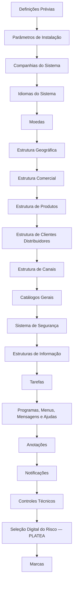

# Definição de Elementos Comuns e Transversais do Sistema

## 1. Metadados do Documento
- **Arquivo de Origem:** Não identificado no texto fornecido
- **Tipo de Documento:** Procedimento / documentação funcional
- **Domínio / Sistema:** Reef / Mapfre / PLATEA
- **Público-Alvo:** Negócio, configuração funcional, administração de sistemas
- **Data/Versão Identificada:** Não identificada
- **Lifecycle Identificado:** Approved Source
- **Owner Identificado:** `user:agonzalez_mapfre.com`

---

## 2. Resumo Executivo & Contexto de Negócio

O documento apresenta a “Definición de Elementos Comunes”, descrevendo elementos comuns ou transversais a todos os módulos do sistema. O conteúdo indica que esses elementos devem ser definidos em uma ordem específica, embora o texto extraído não detalhe regras, responsáveis, telas, contratos ou procedimentos operacionais para cada etapa.

A sequência cobre estruturas organizacionais, comerciais, geográficas, de produtos e de clientes distribuidores. Também inclui parâmetros de instalação, companhias, idiomas, moedas, canais, catálogos gerais, segurança, estruturas de informação, tarefas, programas, menus, mensagens, ajudas, anotações, notificações e controles técnicos.

O documento também referencia “Selección Digital del Riesgo (PLATEA)” e “Marcas”, mas não descreve a integração, o funcionamento ou as regras de negócio associadas a esses termos. A documentação está identificada como “DOCUMENTACIÓN Reef” e contém referências a Mapfre.

---

## 3. Arquitetura, Componentes & Tecnologias Envolvidas

Os componentes funcionais identificados são:

- Reef / DOCUMENTACIÓN Reef
- Mapfre
- PLATEA — Selección Digital del Riesgo
- Parâmetros de instalação
- Companhias do sistema
- Idiomas do sistema
- Moedas
- Estrutura geográfica
- Estrutura comercial
- Estrutura de produtos
- Estrutura de clientes distribuidores
- Estrutura de canais
- Catálogos gerais
- Sistema de segurança
- Estruturas de informação
- Tarefas
- Programas, menus, mensagens e ajudas
- Anotações
- Notificações
- Controles técnicos
- Marcas



> **Nota de Análise:** O documento apresenta uma lista ordenada de elementos de definição, mas não detalha dependências técnicas, interfaces, tecnologias de implementação, métodos HTTP, contratos de dados, URLs ou ambientes.

---

## 4. Regras de Negócio, Especificações Funcionais & Processos

1. Os elementos apresentados são classificados como comuns ou transversais a todos os módulos do sistema.
2. O documento estabelece que a definição desses elementos deve respeitar uma ordem.
3. A sequência começa por definições prévias e parâmetros de instalação.
4. A sequência inclui configurações organizacionais, como companhias, idiomas e moedas.
5. A sequência inclui estruturas de negócio: geográfica, comercial, de produtos, de clientes distribuidores e de canais.
6. A sequência inclui capacidades transversais: catálogos gerais, segurança, estruturas de informação, tarefas, programas, menus, mensagens, ajudas, anotações, notificações e controles técnicos.
7. “Selección Digital del Riesgo (PLATEA)” aparece como elemento listado após controles técnicos.
8. “Marcas” aparece como o último elemento identificado no conteúdo extraído.

> **Nota de Análise:** Não foram identificados critérios de validação, fórmulas de cálculo, permissões por perfil, regras condicionais, campos obrigatórios ou exceções operacionais.

---

## 5. Tabelas de Parâmetros, Ambientes e Estruturas de Dados

| Item / Parâmetro | Descrição / Função | Tipo / Valores / Formato | Ambiente / Observações |
| :--- | :--- | :--- | :--- |
| Definiciones Previas | Ponto inicial da sequência de definição dos elementos comuns. | Etapa de processo | Sem detalhamento adicional. |
| Parámetros Instalación | Parâmetros de instalação do sistema. | Configuração | Sem valores ou atributos especificados. |
| Compañías del Sistema | Companhias pertencentes ao sistema. | Estrutura organizacional | Sem companhias identificadas. |
| Idiomas del Sistema | Idiomas disponíveis ou definidos para o sistema. | Configuração de idioma | Sem idiomas informados. |
| Monedas | Moedas definidas no sistema. | Configuração monetária | O item aparece repetido no conteúdo bruto. |
| Estructura Geográfica | Estrutura geográfica do sistema. | Estrutura organizacional | Sem níveis ou localidades identificados. |
| Estructura Comercial | Estrutura comercial do sistema. | Estrutura organizacional | Sem níveis comerciais identificados. |
| Estructura de Productos | Estrutura de produtos. | Estrutura funcional | Sem produtos, categorias ou hierarquias informados. |
| Estructura de Clientes Distribuidores | Estrutura de clientes distribuidores. | Estrutura funcional | Sem entidades ou atributos detalhados. |
| Estructura de Canales | Estrutura de canais. | Estrutura funcional | Sem canais identificados. |
| Catálogos Generales | Catálogos gerais. | Dados mestres / catálogos | O item aparece repetido no conteúdo bruto. |
| Sistema de Seguridad | Sistema de segurança. | Componente transversal | Sem perfis, permissões ou autenticação especificados. |
| Estructuras de Información | Estruturas de informação. | Estrutura de dados | Sem campos ou modelos especificados. |
| Tareas | Tarefas. | Processo / operação | Sem tarefas detalhadas. |
| Programas, Menús, Mensajes y Ayudas | Programas, menus, mensagens e ajudas do sistema. | Interface e suporte funcional | “Programas” também aparece isoladamente. |
| Anotaciones | Anotações. | Funcionalidade transversal | O item aparece repetido no conteúdo bruto. |
| Notificaciones | Notificações. | Funcionalidade transversal | Sem canais, gatilhos ou destinatários especificados. |
| Controles Técnicos | Controles técnicos. | Controle técnico | O item aparece repetido no conteúdo bruto. |
| Selección Digital del Riesgo (PLATEA) | Seleção digital do risco referenciada como PLATEA. | Funcionalidade / sistema citado | Sem detalhamento adicional. |
| Marcas | Marcas. | Elemento funcional | Aparece repetido no final do conteúdo. |
| Lifecycle | Estado de ciclo de vida da documentação. | `Approved Source` | Identificado nos metadados extraídos. |
| Owner | Proprietário identificado na documentação. | `user:agonzalez_mapfre.com` | Identificado nos metadados extraídos. |

---

## 6. Bateria de Perguntas & Respostas para RAG (FAQ Sintético)

### P1: Qual é o objetivo da documentação de Definição de Elementos Comuns?
**R:** O objetivo é listar elementos comuns ou transversais a todos os módulos do sistema e indicar a ordem em que esses elementos devem ser definidos.

### P2: Qual é a primeira etapa apresentada na sequência de definição?
**R:** A primeira etapa apresentada é “Definiciones Previas”, seguida por “Parámetros Instalación”.

### P3: Quais estruturas organizacionais são mencionadas no documento?
**R:** O documento menciona companhias do sistema, estrutura geográfica, estrutura comercial, estrutura de produtos, estrutura de clientes distribuidores e estrutura de canais.

### P4: O documento informa quais idiomas devem ser configurados no sistema?
**R:** Não. O documento lista “Idiomas del Sistema”, mas não identifica idiomas específicos, códigos, formatos ou regras de priorização.

### P5: Quais elementos de segurança são descritos?
**R:** O documento cita “Sistema de Seguridad” e “Controles Técnicos”, porém não descreve mecanismos de autenticação, autorização, perfis, permissões ou controles técnicos específicos.

### P6: O que é PLATEA no contexto do documento?
**R:** PLATEA é citado como “Selección Digital del Riesgo (PLATEA)”. O texto fornecido não contém explicação adicional sobre finalidade, integração, usuários, regras ou dados processados por PLATEA.

### P7: Quais recursos relacionados à interface e ao suporte ao usuário são citados?
**R:** O documento cita programas, menus, mensagens e ajudas. Também cita anotações e notificações como elementos transversais, mas não detalha seu comportamento.

### P8: Existem parâmetros técnicos, URLs, servidores ou ambientes documentados?
**R:** Não. O conteúdo extraído não apresenta URLs, servidores, portas, variáveis de ambiente, caminhos de log, versões de software ou configurações de infraestrutura.

### P9: Qual é o ciclo de vida identificado para a documentação?
**R:** O ciclo de vida identificado é `Approved Source`.

### P10: Quem é o owner identificado na documentação?
**R:** O owner identificado no conteúdo extraído é `user:agonzalez_mapfre.com`.

### P11: O documento descreve campos ou estruturas de dados para as estruturas de informação?
**R:** Não. “Estructuras de Información” é apenas listado; não há definição de campos, entidades, tipos de dados, chaves ou relacionamentos.

### P12: Há regras detalhadas para moedas e catálogos gerais?
**R:** Não. “Monedas” e “Catálogos Generales” são listados como elementos do processo, mas o documento não apresenta valores permitidos, formatos, tabelas de referência ou regras de manutenção.

---

## 7. Glossário de Termos, Siglas & Conceitos-Chave

- **Reef:** Nome presente nas referências “DOCUMENTACIÓN Reef” e “Documentation / DOCUMENTACIÓN Reef”. O documento não define o significado do termo.
- **Mapfre:** Nome presente na referência “Mapfredocument”. O documento não fornece definição adicional.
- **PLATEA:** Sigla ou nome associado a “Selección Digital del Riesgo”. Não há expansão ou descrição adicional no texto.
- **Approved Source:** Estado de ciclo de vida identificado para a documentação.
- **Elementos Comunes:** Elementos comuns ou transversais a todos os módulos do sistema.
- **Controles Técnicos:** Elemento listado no processo de definição; sem detalhamento sobre controles específicos.
- **Catálogos Generales:** Catálogos gerais mencionados como elemento do sistema; sem conteúdo adicional.

---

## 8. Notas Críticas, Riscos & Limitações

- O arquivo de origem, a data e a versão não foram identificados no conteúdo fornecido.
- O documento lista componentes e uma ordem de definição, mas não descreve como executar cada definição.
- Não foram identificados contratos de integração, APIs, protocolos, URLs, ambientes, servidores, versões ou parâmetros técnicos concretos.
- Não foram identificadas regras de negócio detalhadas para segurança, moedas, companhias, produtos, clientes distribuidores, canais ou marcas.
- PLATEA é citado, mas não possui detalhamento funcional ou técnico adicional.
- A repetição de itens como “Monedas”, “Estructura Geográfica”, “Catálogos Generales”, “Anotaciones”, “Controles Técnicos” e “Marcas” foi preservada na referência bruta, pois pode refletir a estrutura visual ou a extração do documento original.

---

## 9. Conteúdo Bruto Estruturado (Referência Fiel)

```text
--- [PÁGINA 1 DE 3] ---

DEFINICIÓN DE ELEMENTOS COMUNES
Elementos que son Comunes o Transversales a todos los módulos del sistema así como el orden en el que se debe realizar su definición.
Definiciones Previas
Parámetros Instalación
Compañías del Sistema
Idiomas del Sistema
Monedas
Monedas
Estructura Geográfica
Estructura Geográfica
Estructura Comercial
Estructura Comercial
Estructura de Productos
Estructura de Productos
Estructura de Clientes Distribuidores
Documentation / DOCUMENTACIÓN Reef
DOCUMENTACIÓN Reef
Mapfredocument
DOCUMENTACIÓN Reef
Owner
user:agonzalez_mapfre.com
Lifecycle
Approved Source
 /
VL
Buscar Inicio Soluciones Arquitecturas APIs Componentes Cloud Documentación Zeus Reef Ayuda
ES

--- [PÁGINA 2 DE 3] ---

Estructura de Canales
Catálogos Generales
Catálogos Generales
Sistema de Seguridad
Sistema de Seguridad
Estructuras de Información
Estructuras de Información
Tareas
Tareas
Programas, Menús, Mensajes y Ayudas
Programas
Anotaciones
Anotaciones
Notificaciones
Notificaciones
Controles Técnicos
Controles Técnicos
Selección Digital del Riesgo (PLATEA)
PLATEA
Marcas

--- [PÁGINA 3 DE 3] ---

Marcas
```
