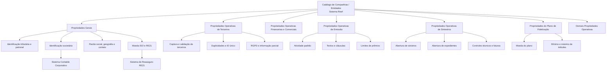

# Definição das Companhias/Entidades do Sistema — Documentação Reef

## 1. Metadados do Documento
- **Arquivo de Origem:** `Não identificado no conteúdo extraído`
- **Tipo de Documento:** `Especificação Técnica / Documentação Funcional`
- **Domínio / Sistema:** `Reef / MAPFRE — Catálogo de Companhias e Entidades`
- **Público-Alvo:** `Desenvolvedores, Arquitetos, Operação, Tecnologia e Processos, Negócio`
- **Data/Versão Identificada:** `Não identificada`
- **Owner identificado no conteúdo:** `user:agonzalez_mapfre.com`
- **Lifecycle identificado no conteúdo:** `Approved Source`

---

## 2. Resumo Executivo & Contexto de Negócio

O documento descreve a definição funcional de companhias ou entidades no núcleo do sistema Reef. O sistema suporta a codificação de múltiplas companhias em um repositório de informações específico, inicialmente entregue às instalações parcialmente sem conteúdo. O catálogo permite definir e codificar até 99 entidades, identificadas individualmente por denominação ou texto descritivo, abreviatura e nome curto.

A configuração de cada entidade é organizada em propriedades gerais e propriedades operativas. As propriedades gerais concentram atributos institucionais, legais, geográficos, de contato, tributários, contábeis e monetários. Entre os exemplos documentados estão a identificação tributária local, a chave de identificação patronal, a chave societária vinculada ao sistema contábil corporativo, a razão social, a estrutura geográfica, a moeda ISO do país e a identificação de reaseguro externo no sistema RE21.

As propriedades operativas de terceiros determinam como os programas do sistema capturam, validam, apresentam, replicam e protegem informações de pessoas físicas e jurídicas. Essas configurações incluem tratamento e posposto, captura de sobrenomes, nome composto, segundo sobrenome, RGPD, ferramenta de proteção de dados, ordem de captura entre código postal e endereço, extensão postal, identificação de duplicidades, ID único de terceiros e visualização parcial de informações.

O documento também descreve propriedades financeiras, comerciais, de emissão, de sinistros, de fidelização e de identificação de usuários. Essas propriedades modulam funcionalidades como identificação de empregados de intermediários, formato de conta corrente, tipo de IVA, prevenção à lavagem de dinheiro por limites de prêmio, validação de termos obrigatórios em apólices, programas de abertura de sinistros e expedientes, utilização de tréboles no plano de fidelização e obrigatoriedade de documento para identificação de usuários.

Diversas configurações exigem atuação das equipes locais da entidade MAPFRE, especialmente Tecnologia e Processos e Direções de Negócio. O documento atribui a essas áreas a responsabilidade por codificar ferramentas de proteção de dados, implementar componentes para ID único de terceiros, definir processos relacionados à prevenção à lavagem de dinheiro e informar a nomenclatura de programas de abertura de sinistros e expedientes.

---

## 3. Arquitetura, Componentes & Tecnologias Envolvidas

O conteúdo não apresenta uma arquitetura técnica de infraestrutura, microsserviços, endpoints, protocolos ou contratos de integração. A arquitetura funcional identificada é centrada no **Catálogo de Companhias/Entidades** do sistema Reef, que parametriza o comportamento de diversos programas e módulos do núcleo.

### Componentes e sistemas citados

| Componente / Sistema | Papel descrito no documento | Observações |
| :--- | :--- | :--- |
| Sistema Reef | Núcleo que permite codificar múltiplas companhias ou entidades. | O documento está identificado como documentação Reef. |
| Catálogo de Companhias / Entidades | Repositório de atributos gerais e operativos de cada entidade. | Permite definir até 99 entidades. |
| Sistema Contable Corporativo | Referência para a chave de identificação societária. | O identificador societário deve corresponder ao identificador da sociedade nesse sistema. |
| Sistema de Reaseguro RE21 | Sistema utilizado para identificar o código da entidade de reaseguro externo. | Não há detalhamento de integração. |
| Programas de atualização de terceiros | Programas cujo comportamento é modulado por atributos de terceiros. | Inclui captura de tratamento, posposto, sobrenomes, endereço e outros dados. |
| Programa de Captura e Modificação de Usuários | Programa afetado por replicação intercompanhias e identificação de usuários. | Replica ou não dados de terceiros entre entidades; também pode exigir documento de usuários. |
| Programa de Captura e Modificação de Terceiros | Programa que pode verificar duplicidades e atribuir ID único a terceiros. | Não são detalhados métodos, telas ou contratos. |
| Programas de Consulta | Programas que podem apresentar informação total ou parcial. | Dependem da configuração de papéis de informação parcial. |
| Programa de Emissão | Programa com limites para textos anexos e cláusulas. | Também aplica regras de emissão descritas. |
| Módulo de Siniestros | Módulo que contém o Programa de Registro de Facturas e controles técnicos. | Pode exigir número de sinistro no registro de faturas. |
| Plano de Fidelização | Módulo que usa moeda ISO e regras de tréboles. | Trata obtenção e troca de tréboles. |
| Ferramenta RGPD | Ferramenta de proteção de dados usada pela companhia quando RGPD estiver ativo. | Exemplos listados: “Sin herramienta Externa”, “OneTrust”, “Ley Orgánica de Protección de Datos Europea”, “Agencia Española de Protección de Datos”. |



> **Nota de Análise:** O documento não detalha arquitetura de rede, APIs, métodos HTTP, bancos de dados, tecnologias de implementação, versões de software, URLs, servidores, portas ou contratos JSON.

---

## 4. Regras de Negócio, Especificações Funcionais & Processos

### 4.1 Capacidade de definição de entidades

1. O núcleo do sistema permite codificar múltiplas companhias em um repositório de informações específico.
2. O repositório é entregue inicialmente às instalações parcialmente vazio de conteúdo.
3. O sistema permite definir e codificar até **99 entidades diferentes**.
4. Cada entidade pode ser individualmente denominada e identificada por:
   - denominação ou texto descritivo;
   - abreviatura;
   - nome curto.
5. As propriedades e funcionalidades de uma companhia são agrupadas nas seguintes categorias:
   - Propriedades Gerais;
   - Propriedades Operativas de Terceiros;
   - Propriedades Operativas Financeiras e Comerciais;
   - Propriedades Operativas de Emissão;
   - Propriedades Operativas de Siniestros;
   - Propriedades do Plano de Fidelização;
   - Demais Propriedades Operativas.

### 4.2 Propriedades gerais

- **Chave e código de identificação:** indicam o método de identificação tributária utilizado localmente em cada país.
- **Exemplo espanhol:** o Número de Identificação Fiscal (NIF) é usado para pessoas físicas com DNI ou NIE atribuídos pelo Ministério do Interior e para pessoas jurídicas, cujo antecedente foi o CIF.
- **Chave de identificação patronal:** identifica a chave patronal da companhia conforme a legislação do país no qual a companhia está localizada.
- **Chave de identificação societária:** identifica contabilmente a companhia segundo as diretrizes corporativas da MAPFRE.
- **Regra obrigatória para a chave societária:** deve corresponder ao identificador da sociedade no Sistema Contable Corporativo.
- **Exemplos de identificadores societários:** `0002` para Mapfre España, `0233` para Mapfre Paraguay Seguros e `0378` para Mapfre Dominicana, S.A.
- **Razão social:** corresponde ao nome com o qual a entidade ou sociedade mercantil MAPFRE está registrada local e legalmente.
- **Estrutura geográfica:** após definir a estrutura geográfica utilizada pela entidade, o catálogo de entidades deve ser atualizado e a estrutura correspondente deve ser atribuída à razão social.
- **Endereço e apartado postal:** atributos permitem codificar e identificar o endereço postal da sede social e o apartado postal da entidade.
- **Telefone e fax:** atributos identificam prefixo telefônico do país, código de área, telefone e número de fax.
- **Regra para código de área:** nem todos os países exigem código de área para realizar conexões telefônicas.
- **Nome e sobrenomes do CEO:** dois atributos armazenam nome e sobrenomes do máximo responsável pela companhia.
- **Moeda do país:** identifica o código ISO da moeda do país.
- **Companhia de reaseguro externo:** identifica o código da entidade no sistema de Reaseguro RE21.
- **Feriados trabalhistas:** dois atributos determinam se sábado e domingo são ou não dias festivos.
- **Atividade que identifica a entidade:** identifica o código de atividade da entidade no sistema; este dado possui valor constante de **`39`**.

### 4.3 Propriedades operativas de terceiros

- **Tratamento e posposto:** dois atributos indicam se programas que atualizam informações de terceiros podem capturar tratamento e/ou posposto para intervenções identificadas como pessoas físicas.
- Quando ambas as marcas estão ativadas, podem ser informados:
  - prefixos como `Ilustrísimo / Ilmo.`, `Excelentísimo / Excmo.`, `Doña`, `Sr.`, `Sra.`, `Srta.`;
  - sufixos como `Junior / Jr.`, `Senior / Sr.`, `II`, `Segundo`.
- **Captura de sobrenomes em pessoas físicas:** dois atributos determinam se os programas devem obrigar ou não a captura do primeiro e do segundo sobrenome.
- **Nome composto:** permite capturar o nome em dois campos separados quando a pessoa física possuir nome composto.
- **Exibição do segundo sobrenome:** define se programas de captura mostram e permitem capturar o segundo sobrenome de pessoa física.
- **Consistência de configuração:** a configuração de exibição do segundo sobrenome deve estar alinhada ao atributo que obriga ou não sua captura.
- **Exemplo cultural citado:** nos Estados Unidos da América do Norte, não é comum indicar segundo sobrenome como nos países latinos.
- **RGPD e ferramenta RGPD:** determina se o Regulamento Geral de Proteção de Dados é aplicável a pessoas físicas, tanto no tratamento e gestão de dados pessoais quanto em sua livre circulação.
- Quando RGPD estiver ativado, deve ser informado o nome da ferramenta de proteção de dados usada pela companhia.
- **Responsabilidade local sobre ferramentas RGPD:** o departamento de Tecnologia e Processos da entidade MAPFRE local é responsável por codificar adequadamente os valores possíveis das ferramentas.
- **Ordem de captura de código postal e endereço postal:** define uma das duas sequências:
  1. capturar primeiro o código postal e preencher automaticamente os dados de endereço postal;
  2. capturar primeiro o endereço postal e, a partir dele, obter o código postal.
- **Extensão postal:** habilita ou não a captura da extensão do código postal nos programas de atualização de terceiros.
- **Terceiros duplicados intercompanhias:** define se o Programa de Captura e Modificação de Usuários replica automaticamente as informações de terceiros em todas as entidades definidas no sistema.
- **Identificação de terceiros duplicados:** faz com que o Programa de Captura e Modificação de Terceiros execute ou não uma verificação automática e interna para identificar terceiros já existentes com outro tipo e chave de documento identificativo.
- **Objetivo da identificação de duplicidades:** evitar, na medida do possível, informações duplicadas de terceiros.
- **ID único de terceiros:** define se o Programa de Captura e Modificação de Terceiros atribui automaticamente uma chave única de uso interno à informação do terceiro capturado.
- **Dependência para ID único:** quando ativado, Tecnologia e Processos deve implementar e desenvolver um componente de software para codificar e atribuir a chave única, segundo critérios definidos pelas Direções de Negócio da entidade MAPFRE local.
- **Informação parcial:** controla se Programas de Consulta exibem total ou parcialmente a informação de um conceito lógico.
- Quando informação parcial estiver ativada, papéis de informação parcial podem restringir a visualização de informações de terceiros, apólices e outros dados para usuários do sistema.
- **Número máximo de registros para exportar terceiros:** armazena o número máximo de registros considerado na exportação de terceiros por arquivos.
- **Criação de cartões em meios de cobrança/pagamento:** determina se usuários podem ou não cadastrar cartões como meios de cobrança/pagamento no bloco de informação correspondente.

### 4.4 Propriedades operativas financeiras e comerciais

- **Empregados de intermediários:** habilita ou não a funcionalidade do núcleo para identificar empregados dos agentes intermediários das apólices.
- **Formato de conta corrente:** indica ao sistema o formato de conta corrente na captura de informações bancárias de pessoa física ou jurídica.
- **Tipo de IVA:** define se deve ser considerada a captura do tipo de IVA no cadastro e alteração de terceiros.
- **Valores possíveis de tipo de IVA:** `Exento`, `Normal` ou `Reducido`.

### 4.5 Propriedades operativas de emissão

- **Atividade padrão:** permite informar o código de atividade do terceiro que o sistema considerará por padrão para obter dados no cadastro de segurados.
- **Comprimento de textos anexos e cláusulas:** dois atributos limitam o comprimento das linhas de texto para textos anexos e cláusulas no Programa de Emissão.
- **Limite de prêmios:** três atributos permitem limitar o valor de prêmios emitidos e vigentes para pessoas físicas e pessoas jurídicas, com valores expressos na mesma moeda.
- **Contexto dos limites de prêmio:** os limites são utilizados para controle de prevenção à lavagem de dinheiro.
- **Abrangência dos limites:** aplicam-se não apenas ao tomador, mas também a intervenientes na apólice, incluindo possíveis beneficiários, segurados, pagadores e tomadores alternativos.
- **Responsabilidade da entidade:** a entidade deve definir e implementar procedimentos de atuação para gerir e explorar adequadamente essas informações.
- **Termos/frases obrigatórios:** para ramos técnicos de Caução e Crédito, esse atributo adapta o comportamento do sistema para controlar e validar que textos anexos e cláusulas contenham palavras, termos ou frases obrigatoriamente definidos pela entidade seguradora.
- **Catálogo de palavras/frases obrigatórias:** a entidade é responsável por definir, em catálogo específico, as palavras ou frases que deseja controlar expressamente.

### 4.6 Propriedades operativas de sinistros

- **Programa de abertura de sinistros:** identifica o código do programa usado para realizar a abertura de sinistros.
- **Programa de abertura de expedientes:** identifica o código do programa usado para abrir expedientes no sistema.
- **Responsabilidade de nomenclatura:** o departamento de Tecnologia e Processos da entidade MAPFRE local deve informar a nomenclatura dos dois programas.
- **Escritório no controle técnico de sinistros:** identifica o código da estrutura comercial da companhia considerado na execução de controles técnicos na gestão de sinistros e prestações.
- **Alternativas para controle técnico:** Escritório Emissor ou Escritório Tramitador.
- **Captura de número de sinistro no registro de faturas:** força ou não a captura do número de sinistro no Programa de Registro de Faturas do módulo de Siniestros.

### 4.7 Propriedades do plano de fidelização

- **Moeda do plano:** identifica o código ISO da moeda usada para obtenção e troca de tréboles, conforme a configuração operativa local do plano de fidelização.
- **Número mínimo de tréboles:** informa o número mínimo de tréboles que um cliente deve possuir para realizar a troca.
- **Número máximo de tréboles:** informa o número máximo de tréboles que um cliente pode trocar no pagamento de recibos.
- **Faixa máxima aberta:** a faixa máxima pode permanecer aberta quando não for informada.

### 4.8 Demais propriedades operativas

- **Identificação de usuários:** afeta os programas de cadastro e alteração de usuários para exigir ou não a captura de tipo de documento e chave do documento na identificação dos usuários do sistema.

---

## 5. Tabelas de Parâmetros, Ambientes e Estruturas de Dados

### 5.1 Limites e valores explícitos

| Item / Parâmetro | Descrição / Função | Tipo / Valores / Formato | Ambiente / Observações |
| :--- | :--- | :--- | :--- |
| Quantidade máxima de entidades | Número máximo de entidades que o sistema permite definir e codificar. | Máximo de `99` entidades. | Sistema Reef. |
| Código de atividade da entidade | Código de atividade que identifica a entidade no sistema. | Valor constante: `39`. | Propriedades Gerais. |
| Identificador societário — Mapfre España | Exemplo de identificador no Sistema Contable Corporativo. | `0002` | Deve corresponder à chave de identificação societária. |
| Identificador societário — Mapfre Paraguay Seguros | Exemplo de identificador no Sistema Contable Corporativo. | `0233` | Deve corresponder à chave de identificação societária. |
| Identificador societário — Mapfre Dominicana, S.A. | Exemplo de identificador no Sistema Contable Corporativo. | `0378` | Deve corresponder à chave de identificação societária. |
| Tipo de IVA | Define se o sistema considera a captura do IVA no cadastro e alteração de terceiros. | `Exento`, `Normal`, `Reducido` | Propriedades Operativas Financeiras e Comerciais. |
| Moeda do país | Código ISO da moeda do país da entidade. | Código ISO não especificado. | Propriedades Gerais. |
| Moeda do plano | Código ISO da moeda usada para obter/trocar tréboles. | Código ISO não especificado. | Plano de Fidelização. |
| Número máximo de registros para exportar terceiros | Limite de registros considerado para exportar terceiros por arquivos. | Número não especificado. | Propriedades Operativas de Terceiros. |
| Número mínimo de tréboles | Mínimo necessário para que um cliente possa trocar tréboles. | Número não especificado. | Plano de Fidelização. |
| Número máximo de tréboles | Máximo de tréboles para troca no pagamento de recibos. | Número não especificado; pode ficar aberto. | Plano de Fidelização. |
| Limite de prêmios | Limites de prêmios emitidos e vigentes para prevenção à lavagem de dinheiro. | Três atributos; valores não especificados; mesma moeda. | Aplica-se a pessoas físicas, jurídicas e intervenientes da apólice. |

### 5.2 Categorias de propriedades do catálogo

| Item / Parâmetro | Descrição / Função | Tipo / Valores / Formato | Ambiente / Observações |
| :--- | :--- | :--- | :--- |
| Propriedades Gerais | Configura identificação, dados institucionais, geografia, contato, moeda e reaseguro. | Grupo de atributos. | Catálogo de Companhias/Entidades. |
| Propriedades Operativas de Terceiros | Modula captura, validação, proteção, duplicidade e exportação de terceiros. | Grupo de atributos. | Afeta programas de terceiros, usuários e consultas. |
| Propriedades Operativas Financeiras e Comerciais | Configura empregados de intermediários, conta corrente e IVA. | Grupo de atributos. | Dados financeiros e comerciais. |
| Propriedades Operativas de Emissão | Configura atividade padrão, textos, cláusulas, limites de prêmios e termos obrigatórios. | Grupo de atributos. | Programa de Emissão e ramos técnicos. |
| Propriedades Operativas de Siniestros | Configura programas de abertura, controles técnicos e registro de faturas. | Grupo de atributos. | Módulo de Siniestros. |
| Propriedades do Plano de Fidelização | Configura moeda e regras de troca de tréboles. | Grupo de atributos. | Plano de Fidelização. |
| Demais Propriedades Operativas | Configura identificação dos usuários. | Grupo de atributos. | Programas de cadastro e alteração de usuários. |

### 5.3 Atributos de propriedades gerais

| Item / Parâmetro | Descrição / Função | Tipo / Valores / Formato | Ambiente / Observações |
| :--- | :--- | :--- | :--- |
| Chave e Código de Identificação | Indicam a forma de identificação tributária local. | Exemplo: NIF; demais valores não especificados. | Varia conforme o país. |
| Chave de Identificação Patronal | Identifica a chave patronal segundo legislação local. | Não especificado. | País da companhia. |
| Chave de Identificação Societária | Identifica contabilmente a sociedade segundo diretrizes corporativas MAPFRE. | Deve corresponder ao identificador contábil corporativo. | Sistema Contable Corporativo. |
| Razão Social | Nome legal e local de registro da entidade/sociedade mercantil MAPFRE. | Texto. | Catálogo de entidades. |
| Estrutura Geográfica | Estrutura geográfica utilizada pela entidade. | Estrutura não especificada. | Deve ser atribuída à razão social após atualização do catálogo. |
| Endereço e Apartado Postal | Identificam endereço da sede social e apartado postal. | Vários atributos. | Catálogo de definição. |
| Telefone e Fax | Identificam prefixo nacional, código de área, telefone e fax. | Vários atributos. | Código de área não é obrigatório em todos os países. |
| Nome e Apelidos do CEO | Identificam o nome e sobrenomes do responsável máximo da companhia. | Dois atributos. | Catálogo de companhias. |
| Moeda do País | Identifica a moeda nacional. | Código ISO. | Catálogo de entidades. |
| Companhia Reaseguro Externo | Identifica código de entidade no RE21. | Código não especificado. | Sistema de Reaseguro RE21. |
| Festivos Laboráveis | Define se sábado e domingo são dias festivos. | Dois atributos booleanos ou equivalentes não especificados. | Tabela de configuração do catálogo. |
| Atividade que identifica a entidade | Identifica código de atividade da entidade. | Valor constante `39`. | Catálogo de definição de entidades. |

### 5.4 Atributos operativos de terceiros

| Item / Parâmetro | Descrição / Função | Tipo / Valores / Formato | Ambiente / Observações |
| :--- | :--- | :--- | :--- |
| Tratamento | Permite ou não capturar tratamento para pessoas físicas. | Habilitado/desabilitado não especificado. | Exemplo: Ilmo., Excmo., Doña, Sr., Sra., Srta. |
| Posposto | Permite ou não capturar sufixo para pessoas físicas. | Habilitado/desabilitado não especificado. | Exemplo: Jr., Sr., II, Segundo. |
| Captura de primeiro sobrenome | Força ou não a captura do primeiro sobrenome. | Atributo de comportamento. | Pessoas físicas. |
| Captura de segundo sobrenome | Força ou não a captura do segundo sobrenome. | Atributo de comportamento. | Pessoas físicas. |
| Nome composto | Permite capturar nome em dois campos separados. | Atributo de comportamento. | Pessoas físicas com nome composto. |
| Exibir segundo sobrenome | Mostra e permite ou não a captura do segundo sobrenome. | Atributo de comportamento. | Deve ser coerente com a obrigatoriedade de captura. |
| RGPD | Define aplicabilidade do Regulamento Geral de Proteção de Dados. | Aplicável/não aplicável não especificado. | Pessoas físicas e dados pessoais. |
| Ferramenta RGPD | Informa a ferramenta de proteção de dados usada pela companhia. | Exemplos documentados. | Codificação sob responsabilidade local de Tecnologia e Processos. |
| Ordem de captura postal | Define se código postal ou endereço é capturado primeiro. | Código postal primeiro ou endereço primeiro. | Preenche/obtém o dado complementar automaticamente. |
| Extensão postal | Habilita captura de extensão do código postal. | Habilitado/desabilitado não especificado. | Programas de atualização de terceiros. |
| Terceiros duplicados intercompanhias | Replica ou não dados de terceiros entre entidades. | Habilitado/desabilitado não especificado. | Programa de Captura e Modificação de Usuários. |
| Identificação de terceiros duplicados | Verifica automaticamente terceiros já existentes com outro tipo/chave documental. | Habilitado/desabilitado não especificado. | Programa de Captura e Modificação de Terceiros. |
| ID único de terceiros | Atribui chave interna única para terceiro capturado. | Habilitado/desabilitado não especificado. | Requer componente local quando ativado. |
| Informação parcial | Permite exibir informação total ou parcial de conceito lógico. | Habilitado/desabilitado não especificado. | Associada a papéis de informação parcial. |
| Máximo para exportação de terceiros | Limita registros exportados por arquivos. | Número não especificado. | Exportação de terceiros. |
| Criação de cartões em meios de cobrança/pagamento | Permite ou não cadastrar cartões como meio de cobrança/pagamento. | Habilitado/desabilitado não especificado. | Bloco de informação correspondente. |

### 5.5 Atributos de emissão, sinistros, fidelização e usuários

| Item / Parâmetro | Descrição / Função | Tipo / Valores / Formato | Ambiente / Observações |
| :--- | :--- | :--- | :--- |
| Empregados de Intermediários | Habilita identificação de empregados de agentes intermediários de apólices. | Habilitado/desabilitado não especificado. | Financeiro e Comercial. |
| Formato de Conta Corrente | Informa formato de conta bancária de pessoa física ou jurídica. | Formato não especificado. | Captura de informação bancária. |
| Tipo de IVA | Define captura de IVA para terceiros. | Exento, Normal ou Reducido. | Financeiro e Comercial. |
| Atividade por Defeito | Código de atividade de terceiro usado por padrão no cadastro de segurados. | Código não especificado. | Emissão. |
| Comprimento de Textos Anexos | Limita comprimento de linhas de textos anexos. | Dois atributos com valores não especificados. | Programa de Emissão. |
| Comprimento de Cláusulas | Limita comprimento de linhas de cláusulas. | Dois atributos com valores não especificados. | Programa de Emissão. |
| Limite de Prêmios | Limita prêmios emitidos e vigentes no contexto de prevenção à lavagem de dinheiro. | Três atributos; valores não especificados. | Pessoas físicas, jurídicas e intervenientes. |
| Termos/Frases Obrigatórios | Valida presença de termos em textos anexos e cláusulas. | Palavras/frases definidas em catálogo específico. | Ramos Técnicos de Caução e Crédito. |
| Programa Abertura Siniestros | Código do programa de abertura de sinistros. | Código não especificado. | Nomenclatura informada por Tecnologia e Processos local. |
| Programa Abertura de Expedientes | Código do programa de abertura de expedientes. | Código não especificado. | Nomenclatura informada por Tecnologia e Processos local. |
| Escritório em Controle Técnico de Siniestros | Define a estrutura comercial usada em controles técnicos. | Escritório Emissor ou Escritório Tramitador. | Gestão de sinistros e prestações. |
| Captura de Número de Sinistro em Faturas | Força ou não a captura do número de sinistro no registro de faturas. | Habilitado/desabilitado não especificado. | Módulo de Siniestros. |
| Moeda do Plano | Código ISO para obter/trocar tréboles. | Código ISO não especificado. | Plano de Fidelização. |
| Número Mínimo de Tréboles | Mínimo para um cliente trocar tréboles. | Número não especificado. | Plano de Fidelização. |
| Número Máximo de Tréboles | Máximo para troca de tréboles no pagamento de recibos. | Número não especificado; pode permanecer aberto. | Plano de Fidelização. |
| Identificação de Usuários | Obriga ou não tipo e chave de documento para identificar usuários. | Habilitado/desabilitado não especificado. | Programas de cadastro e alteração de usuários. |

---

## 6. Bateria de Perguntas & Respostas para RAG (FAQ Sintético)

### P1: Quantas companhias ou entidades podem ser definidas no sistema Reef?
**R:** O sistema Reef permite definir e codificar até 99 entidades diferentes no repositório de informações específico. Cada entidade pode possuir denominação ou texto descritivo, abreviatura e nome curto.

### P2: Quais categorias de propriedades são configuradas para uma entidade no catálogo de companhias?
**R:** O catálogo agrupa as propriedades em Propriedades Gerais, Propriedades Operativas de Terceiros, Propriedades Operativas Financeiras e Comerciais, Propriedades Operativas de Emissão, Propriedades Operativas de Siniestros, Propriedades do Plano de Fidelização e Demais Propriedades Operativas.

### P3: Qual regra deve ser seguida para a chave de identificação societária?
**R:** A chave de identificação societária deve corresponder ao identificador da sociedade no Sistema Contable Corporativo. O documento apresenta como exemplos `0002` para Mapfre España, `0233` para Mapfre Paraguay Seguros e `0378` para Mapfre Dominicana, S.A.

### P4: Qual é o código de atividade constante que identifica uma entidade?
**R:** O atributo “Actividad que identifica la entidad” possui valor constante `39`. Esse código identifica a entidade no sistema.

### P5: Como o catálogo controla a captura do segundo sobrenome de uma pessoa física?
**R:** O catálogo possui atributos que podem obrigar ou não a captura do segundo sobrenome e um atributo que define se o segundo sobrenome é exibido e pode ser informado. A configuração de exibição deve ser consistente com a configuração de obrigatoriedade de captura.

### P6: O que ocorre quando o ID único de terceiros está ativado?
**R:** Quando o atributo de ID único de terceiros está ativado, o Programa de Captura e Modificação de Terceiros atribui automaticamente uma chave única de uso interno ao terceiro capturado. Além disso, o departamento de Tecnologia e Processos deve implementar e desenvolver um componente de software para realizar a codificação e atribuição dessa chave conforme critérios definidos pelas Direções de Negócio da entidade MAPFRE local.

### P7: Como funciona a identificação de terceiros duplicados?
**R:** Quando ativada, a identificação de terceiros duplicados faz com que o Programa de Captura e Modificação de Terceiros execute automática e internamente uma verificação para identificar se o terceiro já existe no sistema com outro tipo e chave de documento identificativo. O objetivo é evitar, tanto quanto possível, a existência de informações duplicadas de terceiros.

### P8: Quais sequências de captura de código postal e endereço postal são suportadas?
**R:** O catálogo permite duas sequências: capturar primeiro o código postal e preencher automaticamente os dados do endereço postal; ou capturar primeiro o endereço postal e obter, a partir dele, o código postal.

### P9: Quais são os valores possíveis para o tipo de IVA?
**R:** O atributo Tipo de IVA pode assumir os valores `Exento`, `Normal` ou `Reducido`. Ele determina se o sistema deve considerar a captura do tipo de IVA no cadastro e alteração de terceiros.

### P10: A quem se aplicam os limites de prêmios para prevenção à lavagem de dinheiro?
**R:** Os limites de prêmios emitidos e vigentes aplicam-se a pessoas físicas e pessoas jurídicas. Os limites não se restringem ao tomador e também abrangem intervenientes da apólice, como possíveis beneficiários, segurados, pagadores e tomadores alternativos.

### P11: Como são controlados termos ou frases obrigatórios em apólices?
**R:** Nos Ramos Técnicos de Caução e Crédito, o atributo de termos/frases obrigatórios adapta o sistema para validar que textos anexos e cláusulas contenham palavras, termos ou frases que a entidade seguradora tenha definido como obrigatórios. A entidade deve manter essas palavras ou frases em um catálogo específico.

### P12: Quem define os programas de abertura de sinistros e expedientes?
**R:** O catálogo identifica o código do Programa de Abertura de Sinistros e do Programa de Abertura de Expedientes. A responsabilidade por informar a nomenclatura de ambos os programas é do departamento de Tecnologia e Processos da entidade MAPFRE local.

### P13: Como o catálogo controla a troca de tréboles no plano de fidelização?
**R:** O catálogo identifica o código ISO da moeda usada para obter e trocar tréboles, define o número mínimo de tréboles necessário para que o cliente possa trocá-los e estabelece o número máximo de tréboles que pode ser usado no pagamento de recibos. O intervalo máximo pode permanecer aberto quando não for informado.

### P14: As duas abreviaturas da definição da entidade possuem uso corporativo obrigatório?
**R:** Não. O documento informa que o uso dos dois campos de abreviatura é puramente local e não existe obrigação corporativa para sua utilização. Como exemplo, para MAPFRE Filipinas, uma das abreviaturas poderia identificar o tipo de entidade empresarial de MAPFRE Insular com o valor “Corp.”.

---

## 7. Glossário de Termos, Siglas & Conceitos-Chave

- **CEO:** Máximo responsável pela companhia; o catálogo possui atributos para nome e sobrenomes dessa pessoa.
- **CIF:** Antecedente citado para identificação de pessoas jurídicas no contexto espanhol.
- **DNI:** Documento Nacional de Identidad, citado como documento de pessoas físicas na Espanha.
- **ID:** Identificador; no contexto do documento, pode ser uma chave única interna atribuída a terceiros.
- **IVA:** Imposto cujo tipo pode ser `Exento`, `Normal` ou `Reducido` no cadastro e alteração de terceiros.
- **MAPFRE:** Organização corporativa referenciada nas diretrizes, entidades locais e exemplos de companhias.
- **NIE:** Número de Identificación de Extranjero, citado como identificação atribuída pelo Ministério do Interior espanhol.
- **NIF:** Número de Identificación Fiscal, forma de identificação tributária utilizada na Espanha.
- **RE21:** Sistema de Reaseguro no qual é identificado o código da entidade de reaseguro externo.
- **RGPD:** Regulamento Geral de Proteção de Dados aplicável a pessoas físicas, ao tratamento e gestão de dados pessoais e à livre circulação desses dados.
- **Sistema Contable Corporativo:** Sistema usado como referência obrigatória para a chave de identificação societária.
- **Terceiro:** Pessoa física ou jurídica cuja informação é capturada, atualizada, consultada, exportada e validada no sistema.
- **Tomador:** Figura interveniente na apólice à qual os limites de prêmios podem se aplicar.
- **Tréboles:** Unidades tratadas no Plano de Fidelização, usadas para obtenção e troca conforme configurações locais.

---

## 8. Notas Críticas, Riscos & Limitações

- O documento não identifica o arquivo de origem, data, versão, autor formal, tecnologias de implementação, servidores, URLs, protocolos, APIs ou estruturas físicas de dados.
- O sistema permite até 99 entidades, constituindo um limite funcional explícito que deve ser considerado em expansões organizacionais.
- A configuração de chave societária depende da correspondência com o Sistema Contable Corporativo; inconsistências podem afetar a identificação contábil da entidade.
- A ativação de ID único de terceiros cria uma dependência explícita de implementação local de um componente de software por Tecnologia e Processos.
- A configuração de ferramentas RGPD depende da codificação adequada de valores pelo departamento de Tecnologia e Processos da entidade MAPFRE local.
- Os limites de prêmios exigem procedimentos operacionais definidos e implementados pela entidade para gestão e exploração adequada das informações de prevenção à lavagem de dinheiro.
- Os termos ou frases obrigatórios dependem de catálogo específico mantido pela entidade; o documento não informa os termos, a estrutura do catálogo ou as regras de manutenção.
- Os códigos dos programas de abertura de sinistros e expedientes não são fornecidos; a nomenclatura deve ser indicada pela equipe local de Tecnologia e Processos.
- O documento cita a configuração de papéis de informação parcial, mas não detalha os papéis, critérios de autorização, matriz de permissões ou mecanismos técnicos de controle de acesso.
- O documento lista exemplos de ferramentas RGPD, mas não estabelece integração, obrigatoriedade, critérios de seleção ou configuração técnica dessas ferramentas.
- Não há detalhamento adicional sobre métodos HTTP, contratos JSON, serviços, bancos de dados ou interfaces para os programas citados.

---

## 9. Conteúdo Bruto Estruturado (Referência Fiel)

```text
--- [PÁGINA 1 DE 6] ---

DEFINICIÓN de las Compañías/Entidades del Sistema
Objetivo
Funcionalmente, el núcleo del Sistema cuenta con la posibilidad de codicar múltiples compañías en un repositorio de información especíco
que se entrega inicialmente a las instalaciones parcialmente vacío de contenido.
El sistema permite denir y codicar hasta un máximo de 99 diferentes entidades pudiendo denominar e identicar individualmente cada una
de ellas mediante una denominación o texto descriptivo además de una abreviatura y un nombre corto.
En la denición de una compañía, las Propiedades y funcionalidades existentes en el sistema se agrupan en:
Propiedades Generales
Propiedades Operativas de Terceros
Propiedades Operativas Financieras y Comerciales
Propiedades Operativas de Emisión
Propiedades Operativas de Siniestros
Propiedades Plan de Fidelización
Resto Propiedades Operativas
Propiedades Generales
Clave y Código de Identicación
Estos dos atributos del catálogo de compañías indicarán la manera de identicación tributaria utilizada localmente en cada unos de los
países.
Por ejemplo: El Número de Identicación Fiscal o NIF es la manera de identicación tributaria utilizada en España para:
Las personas físicas con documento nacional de identidad DNI o con número de identicación de extranjero NIE asignados por el
Ministerio del Interior.
Las personas jurídicas, cuyo antecedente fue el CIF.
Clave de Identicación Patronal
Este atributo sirve para identicar en el catálogo de compañías la clave de identicación patronal de acuerdo con la legislación del país en el
que se ubica la compañía.
Clave de Identicación Societaria
Documentation / DOCUMENTACIÓN Reef
DOCUMENTACIÓN Reef
Mapfredocument
DOCUMENTACIÓN Reef
Owner
user:agonzalez_mapfre.com
Lifecycle
Approved Source
 / 
 VL
Buscar Inicio Soluciones Arquitecturas APIs Componentes Cloud Documentación Zeus Reef Ayuda
ES


--- [PÁGINA 2 DE 6] ---

Este atributo sirve para identicar en el catálogo de compañías la clave de identicación contable de acuerdo con las directrices Corporativas
de MAPFRE.
NOTA: Debe corresponder con el identicador de la sociedad en el sistema Contable Corporativo: 0002 (Mapfre España), 0233 (Mapfre
Paraguay Seguros), 0378 (Mapfre Dominicana, S.A.), ...
Razón Social
Este Atributo del catálogo de compañías indicará el nombre con que la entidad o sociedad mercantil MAPFRE está registrada local y
legalmente.
Estructura Geográca
Una vez denida la Estructura Geográca que va a usarse en la entidad se debe actualizar el catálogo de entidades y asignar la estructura
correspondiente a la Razón Social.
Dirección y Apartado Postal
Varios Atributos del Catálogo de denición permiten codicar e identicar la dirección postal de la Sede Social de la entidad y su apartado
postal.
Teléfono y Fax
Varios Atributos del Catálogo de denición permiten identicar el prejo telefónico del País, la clave del área y el teléfono de la entidad así
como su número de Fax.
NOTA: No es necesario en todos los países denir una clave de área para efectuar las conexiones telefónicas.
Nombre y Apellidos del CEO
Estos dos atributos del catálogo de compañías indicarán el Nombre y Apellidos del máximo Responsable de la compañía.
Moneda del País
Este atributo del catálogo de denición de las entidades, identica en el sistema el código ISO de moneda del país.
Compañía Reaseguro Externo
Este atributo del catálogo de denición de las entidades, identica en el sistema el código de la entidad en el sistema de Reaseguro RE21.
Festivos Laborables
Existen dos atributos en la Tabla de conguración del catálogo de entidades que permiten identicar si los sábados y domingos son o no días
festivos.
Actividad que identica la entidad
Este atributo del catálogo de denición de las entidades, identica el código de actividad que identicará la entidad en el sistema.
Este dato tiene un valor constante de '39'
Propiedades Operativas de Terceros
Tratamiento y Pospuesto
Estos dos atributos le indican al sistema si se va a permitir o no, en los programas que actualizan la información de los terceros, capturar el
Tratamiento y/o el Pospuesto en aquellas intervenciones identicadas como personas físicas
A modo de ejemplo, la activación de ambas marcas permitirían...
Ingresar como prejos: [Ilustrísimo /Ilmo. - Excelentísimo/Excmo. - Doña - Sr. - Sra. - Srta. ,... ]
Ingresar como sujos [ Junior / Jr. - Senior / Sr. - II - Segundo -, ...]
Código de la Actividad


--- [PÁGINA 3 DE 6] ---

Captura Apellidos en Personas Físicas
Existen dos atributos en el catálogo de denición de entidades que modulan el comportamiento de los programas que actualizan la
información de los terceros, forzando o no la captura del primer y del segundo apellido en aquellas intervenciones identicadas como
personas físicas
Nombre Compuesto
Este atributo del catálogo de entidades modula el comportamiento de los programas que actualizan la información de los terceros,
permitiendo la captura del nombre en dos campos separados cuando el nombre de la persona Física es un nombre compuesto.
Muestra Segundo Apellido
Este atributo del catálogo de entidades modula el comportamiento de los programas de captura de los datos de los Terceros, mostrando y
permitiendo o no la captura del segundo Apellido siempre y cuando la información corresponda a una Persona Física.
En Estados Unidos de Norteamérica, por ejemplo, no suele ser común indicar un segundo apellido como en los países latinos.
NOTA: Este dato debe estar en consonancia con el atributo que obliga o no a la captura del segundo apellido.
R.G.P.D. & Herramienta R.G.P.D
Este atributo del catálogo de entidades le indica al sistema si aplica o no el Reglamento General de Protección de Datos para personas
físicas tanto en el tratamiento y gestión de sus datos personales como en su libre circulación.
Caso que esté activado se debe indicar el nombre de la Herramienta de Protección de Datos utilizada por la compañía como por ejemplo ...
'Sin herramienta Externa', 'OneTrust', 'Ley Orgánica de Protección de Datos Europea, 'Agencia Española de Protección de Datos', ...
NOTA: Es Responsabilidad del departamento de Tecnología y Procesos de la Entidad MAPFRE local codicar adecuadamente en el sistema
los posibles valores de las Herramientas.
Captura del Código Postal o de la Dirección Postal
Este atributo del catálogo de entidades modula el comportamiento de los programas que actualizan la información de los terceros haciendo
que el orden de la captura se efectúe:
Primero el Código Postal, y a partir del mismo se rellenan automáticamente los datos de la Dirección Postal.
Primero la Dirección Postal, y a partir de su información se obtiene el Código Postal.
Extensión Postal
Este atributo del catálogo de entidades habilita o no en los programas que actualizan la información de los terceros la captura de la extensión
del Código Postal.
Terceros Duplicados Inter compañías
Este atributo en el catálogo modula el comportamiento del sistema haciendo que el programa de Captura y Modicación de Usuarios
automáticamente replique o no la información del Tercero en todas y cada una de las entidades denidas en el sistema.
Identicación de Terceros Duplicados
Este atributo en el catálogo de denición de compañías hace que el programa de Captura y Modicación de Terceros ejecute o no automática
e internamente la tarea de comprobar si el Tercero ya existe en el sistema con otro Tipo y Clave de Documento identicativo al objeto de
evitar, en la medida de lo posible, información de Terceros duplicados.
ID único de Terceros
Este atributo en el catálogo de denición de compañías hace que el programa de Captura y Modicación de Terceros asigne o no
automáticamente una clave única y de uso interno en la información del Tercero Capturado.
NOTA: Caso que este atributo esté activado, el departamento de Tecnología y Procesos tendrá que implementar y desarrollar un componente
software que se encargue de realizar la codicación y asignación de la clave única de acuerdo a los criterios que determinen y consideren
adecuado las Direcciones de Negocio de la entidad MAPFRE local.
Información Parcial


--- [PÁGINA 4 DE 6] ---

Este atributo en el catálogo de denición de las entidades modula el comportamiento de los Programas de Consulta en el sistema para
controlar el que se muestre total o parcialmente la información de un concepto lógico.
Activando este atributo y mediante la conguración de los Roles de Información Parcial se podrán establecer restricciones a los Usuarios
del Sistema en la visualización de la información de los Terceros, Pólizas, ...
Número Máximo de Registros para exportar Terceros
Este atributo en el catálogo de denición de las entidades contiene el número máximo de registros que se puede considerar para ejecutar la
exportación de los Terceros mediante cheros.
Permitir Creación Tarjetas en Medios de Cobro/Pago
Esta propiedad determina si los Usuarios pueden o no dar de alta tarjetas como medios de cobro/pago en el bloque de Información
correspondiente.
Propiedades Operativas Financieras y Comerciales
Empleados de Intermediarios
Este atributo del catálogo de entidades habilita o no la funcionalidad del núcleo existente para la identicación de los empleados de los
Agentes Intermediarios de las pólizas.
Formato de Cuenta Corriente
Este atributo del catálogo de entidades le indica al sistema el formato de la cuenta corriente en la captura de información bancaria de la
persona Física o Jurídica.
Tipo de I.V.A
Este atributo del catálogo le indica al sistema si se ha de contemplar o no la captura del Tipo de IVA en el alta y modicación de los Terceros
siendo sus posibles valores: Exento, Normal o Reducido.
Propiedades Operativas de Emisión
Actividad por Defecto
Este atributo del catálogo permite indicar el código de actividad del Tercero que por defecto el Sistema tomará en consideración para recoger
sus datos al dar de altar Asegurados.
Longitud de los Textos Anexos y Clausulas
Existen dos atributos en el catálogo de denición de entidades que limitan la longitud de las líneas de texto en los textos anexos y en las
clausulas en el Programa de Emisión.
Límite de Primas
Para el Control en la Prevención del Lavado de Dinero existen tres atributos del catálogo de entidades que permiten al sistema limitar el
importe de las primas emitidas y en vigor tanto para personas físicas como para personas jurídicas, en ambos casos expresadas en la
misma moneda.
Los límites aplican no sólo al Tomador sino a cualquiera de las guras intervinientes en la Póliza tal y como posibles Beneciarios,
Asegurados, Pagadores, Tomadores Alternos, ...
NOTA: Es responsabilidad de la Entidad denir e implementar los procedimientos de actuación a efectos de gestionar y explotar
adecuadamente la información.
Términos/Frases Obligatorios
En el caso de los Ramos Técnicos de Caución & Crédito, este atributo en el catálogo de denición adapta el comportamiento del sistema
haciendo que este controle y valide que tanto los textos anexos como las cláusulas de las pólizas de estos Ramos Técnicos contengan
aquellas palabras, términos o frases que la entidad aseguradora obligatoriamente haya considerado que tengan que reejarse en su texto.
Consejo:


--- [PÁGINA 5 DE 6] ---

NOTA: Es responsabilidad de la Entidad denir en un catálogo especíco, las palabras o frases que se quieran controlar expresamente.
Propiedades Operativas de Siniestros
Programa Apertura Siniestros
Este atributo del catálogo de denición de las entidades, identica el código del Programa con el que se va a realizar la apertura de siniestros.
Programa Apertura de Expedientes
Este atributo del catálogo de denición de las entidades, identica el código del Programa con el que se va a realizar la apertura de
expedientes en el sistema.
NOTA: Es responsabilidad del departamento de Tecnología y Procesos de la Entidad MAPFRE local indicar la nomenclatura de ambos
programas.
Ocina en Control Técnico de Siniestros
Este atributo del catálogo de denición de las entidades, identica el código de la estructura comercial de la compañía que se ha de tomar en
consideración para la ejecución de los controles técnicos en el proceso de gestión de siniestros y prestaciones: o bien la Ocina Emisora o
bien la Ocina Tramitadora.
Captura Número de Siniestro en Registro de Facturas
Este atributo del catálogo de denición de las entidades, modula el comportamiento del sistema forzando la captura o no del número de
Siniestro en el Programa de Registro de Facturas del módulo de Siniestros del núcleo.
Propiedades Plan de Fidelización
Moneda del Plan
Este atributo del catálogo de denición de las entidades, identica en el sistema el código ISO de moneda usada para obtener/canjear
Tréboles de acuerdo con la conguración operativa realizada localmente en el Plan de Fidelización.
Número Mínimo de Tréboles
Este atributo en el catálogo de denición de compañías le indica al Sistema el número mínimo de tréboles que la entidad establece ha de
tener un Cliente para que éste pueda realizar el canje de los mismos.
Número Máximo de Tréboles
Este atributo en el catálogo de denición de compañías le indica al Sistema el número máximo de tréboles que la entidad establece para que
un Cliente pueda canjearlos en el pago de sus recibos, pudiendo quedar abierto este rango si no se informa.
Resto Propiedades Operativas
Identicación Usuarios
Este atributo en el catálogo de denición de las entidades, modula el comportamiento del sistema afectando los Programas de Alta y
Modicación de Usuarios para forzar a que la identicación de los Usuarios del sistema obligue o no a capturar tanto el Tipo de documento
como la Clave del Documento.
Vínculos
Relación de Directrices y Documentos funcionales cuya lectura recomendada para evitar que la interpretación aislada del presente
documento pueda conducir a error.
Actividades de Terceros
Preguntas frecuentes
(1) ¿Por qué existen dos abreviaturas en la denición de la entidad?


--- [PÁGINA 6 DE 6] ---

El ámbito en el uso de estos dos campos es puramente local no existiendo ninguna obligación a nivel corporativo para su utilización. Por
ejemplo y en el caso de MAPFRE Filipinas en una de estas abreviaturas podría identicarse el tipo de entidad empresarial de MAPFRE Insular
colocando el Corp. en uno de ambos atributos, ...
```
