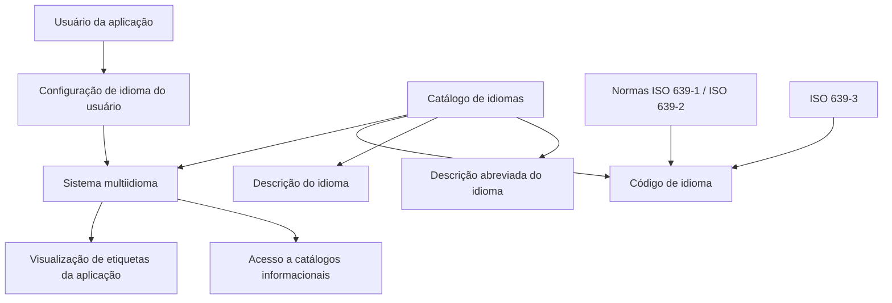

# Definição dos Idiomas Suportados pelo Sistema — Catálogo Multiidioma

## 1. Metadados do Documento
- **Arquivo de Origem:** Não identificado no conteúdo fornecido
- **Tipo de Documento:** Especificação Técnica
- **Domínio / Sistema:** Sistema multiidioma; Reef; Mapfre
- **Público-Alvo:** Desenvolvedores, analistas funcionais e administradores de catálogo
- **Data/Versão Identificada:** Não identificada

---

## 2. Resumo Executivo & Contexto de Negócio

O documento descreve a definição e a manutenção do catálogo de idiomas suportados por um sistema multiidioma. O catálogo controla os idiomas nos quais as etiquetas da aplicação podem ser visualizadas e os idiomas utilizados para acesso a catálogos informacionais, de acordo com a configuração de idioma do usuário.

Cada idioma é definido por uma chave de identificação, uma descrição completa e uma descrição abreviada. Os exemplos apresentados incluem Espanhol/Castelhano, Turco e Inglês, identificados respectivamente pelos códigos `ES`, `TR` e `EN`.

A especificação estabelece que a codificação e a representação dos idiomas no catálogo devem respeitar as normas ISO 639-1 ou ISO 639-2, usando códigos de duas letras. O sistema também está preparado para utilizar a norma ISO 639-3, que identifica idiomas por códigos de três letras.

O documento referencia materiais funcionais relacionados, incluindo “Definición de Usuarios” e “Preguntas frecuentes”, cuja leitura é recomendada para evitar interpretações isoladas ou incorretas da definição de idiomas.

---

## 3. Arquitetura, Componentes & Tecnologias Envolvidas

### Componentes e conceitos identificados

| Componente / Conceito | Descrição fundamentada no documento |
| :--- | :--- |
| Sistema multiidioma | Sistema que permite configurar os idiomas usados para visualização de etiquetas da aplicação e para acesso a catálogos informacionais. |
| Catálogo de idiomas | Relação de idiomas que poderão ser utilizados pelo sistema. |
| Configuração de idioma do usuário | Configuração que determina o idioma utilizado pelo usuário na aplicação. |
| Etiquetas da aplicação | Elementos da aplicação cuja visualização pode ocorrer no idioma configurado. |
| Catálogos | Fontes de informação acessadas conforme a configuração de idioma do usuário. |
| Código de idioma | Chave do idioma ou linguagem que está sendo definida. |
| Descrição do idioma | Nome ou descrição da chave do idioma. |
| Descrição abreviada do idioma | Denominação ou descrição curta da chave do idioma. |
| ISO 639-1 | Norma indicada para codificação e representação de idiomas com códigos de duas letras. |
| ISO 639-2 | Norma indicada para codificação e representação de idiomas com códigos de duas letras. |
| ISO 639-3 | Norma para identificação de idiomas com códigos de três letras; o sistema está preparado para seu uso. |
| Reef | Referência documental identificada como “DOCUMENTACIÓN Reef”. |
| Mapfre | Referência presente no conteúdo por meio de `Mapfredocument` e do usuário `agonzalez_mapfre.com`. |



> **Nota de Análise:** O conteúdo não detalha tecnologias de implementação, bancos de dados, APIs, interfaces, métodos HTTP, contratos JSON, ambientes técnicos ou mecanismos de persistência do catálogo de idiomas.

---

## 4. Regras de Negócio, Especificações Funcionais & Processos

1. O sistema é multiidioma.
2. O sistema permite codificar a relação de linguagens ou idiomas em que as etiquetas da aplicação poderão ser visualizadas.
3. O sistema permite acessar catálogos para obter informação de acordo com a configuração de idioma do usuário que utiliza a aplicação.
4. Cada idioma definido no catálogo deve possuir um código de idioma.
5. O código de idioma contém a chave do idioma ou linguagem que está sendo definida.
6. Cada idioma deve possuir uma descrição de idioma.
7. A descrição de idioma contém o nome ou a descrição da chave do idioma.
8. Cada idioma deve possuir uma descrição abreviada.
9. A descrição abreviada indica a denominação ou descrição curta da chave de idioma definida.
10. A codificação e a representação dos idiomas do catálogo devem respeitar a norma ISO 639-1 ou ISO 639-2.
11. As normas ISO 639-1 e ISO 639-2 são referenciadas para uso de códigos de duas letras.
12. O sistema está preparado para utilizar ISO 639-3 para identificar idiomas com códigos de três letras.
13. A leitura dos documentos relacionados, incluindo “Definición de Usuarios” e “Preguntas frecuentes”, é recomendada para evitar que a interpretação isolada deste documento conduza a erro.
14. Os exemplos de idiomas apresentados no catálogo são:
    - `ES` para Español ou Castellano, com abreviatura `Esp.`
    - `TR` para Türkçe, com abreviatura `Turk.`
    - `EN` para English, com abreviatura `Eng.`

---

## 5. Tabelas de Parâmetros, Ambientes e Estruturas de Dados

### Estrutura lógica do catálogo de idiomas

| Item / Parâmetro | Descrição / Função | Tipo / Valores / Formato | Ambiente / Observações |
| :--- | :--- | :--- | :--- |
| Código de idioma | Contém a chave do idioma ou linguagem definida. | Código de duas letras segundo ISO 639-1 ou ISO 639-2; o sistema também suporta código de três letras segundo ISO 639-3. | Utilizado para codificar e representar idiomas no catálogo. |
| Descrição do idioma | Contém o nome ou a descrição da chave do idioma. | Texto descritivo. | Exemplo: `Español (o Castellano)`, `Türkçe`, `English`. |
| Descrição abreviada do idioma | Indica a denominação ou descrição abreviada da chave de idioma. | Texto abreviado. | Exemplos: `Esp.`, `Turk.`, `Eng.`. |
| Configuração de idioma do usuário | Define o idioma considerado pelo sistema para o usuário que utiliza a aplicação. | Não detalhado. | Determina a visualização de etiquetas e o acesso a catálogos. |
| ISO 639-1 | Norma a ser respeitada na codificação e representação de idiomas. | Código de duas letras. | Mencionada juntamente com ISO 639-2. |
| ISO 639-2 | Norma a ser respeitada na codificação e representação de idiomas. | Código de duas letras, conforme o texto. | Mencionada juntamente com ISO 639-1. |
| ISO 639-3 | Norma para identificar idiomas com código de três letras. | Código de três letras. | O sistema está preparado para utilizá-la. |

### Exemplos de registros do catálogo

| Código de Idioma | Descrição do Idioma | Descrição Abreviada | Observações |
| :--- | :--- | :--- | :--- |
| ES | Español (o Castellano) | Esp. | Exemplo apresentado no documento. |
| TR | Türkçe | Turk. | Exemplo apresentado no documento. |
| EN | English | Eng. | Exemplo apresentado no documento. |

### Referências documentais identificadas

| Item / Parâmetro | Descrição / Função | Tipo / Valores / Formato | Ambiente / Observações |
| :--- | :--- | :--- | :--- |
| Definición de Usuarios | Documento ou diretriz relacionada. | Referência documental. | Leitura recomendada. |
| Preguntas frecuentes | Documento ou material relacionado. | Referência documental. | Leitura recomendada. |
| DOCUMENTACIÓN Reef | Referência documental exibida no conteúdo. | Documentação. | Associada à navegação “Documentation / DOCUMENTACIÓN Reef”. |
| Mapfredocument | Texto/referência identificado na extração. | Não detalhado. | Não há detalhamento adicional. |
| Owner | Campo exibido no conteúdo. | `user:agonzalez_mapfre.com` | Contexto de propriedade documental. |
| Lifecycle | Campo exibido no conteúdo. | `Approved Source / VL` | Significado de `VL` não detalhado. |

---

## 6. Bateria de Perguntas & Respostas para RAG (FAQ Sintético)

### P1: Qual é a finalidade do catálogo de idiomas do sistema?
**R:** O catálogo de idiomas permite codificar a relação de linguagens ou idiomas que podem ser usados para visualizar as etiquetas da aplicação e para acessar catálogos informacionais, conforme a configuração de idioma do usuário.

### P2: Como o sistema determina o idioma das etiquetas exibidas na aplicação?
**R:** O documento informa que as etiquetas da aplicação são visualizadas de acordo com a configuração do idioma do usuário que utiliza a aplicação. Não são detalhados os mecanismos técnicos usados para armazenar ou aplicar essa configuração.

### P3: Quais propriedades devem ser definidas para cada idioma no catálogo?
**R:** Cada idioma deve possuir um código de idioma, uma descrição de idioma e uma descrição abreviada do idioma. O código representa a chave do idioma, a descrição representa seu nome e a descrição abreviada representa sua denominação curta.

### P4: O que representa o campo Código de Idioma?
**R:** O campo Código de Idioma contém a chave do idioma ou da linguagem que está sendo definida no catálogo de idiomas.

### P5: O que representa o campo Descrição do Idioma?
**R:** O campo Descrição do Idioma contém o nome ou a descrição da chave de idioma definida. Os exemplos apresentados incluem “Español (o Castellano)”, “Türkçe” e “English”.

### P6: O que representa o campo Descrição Abreviada do Idioma?
**R:** O campo Descrição Abreviada do Idioma indica a denominação ou descrição abreviada da chave de idioma definida. Os exemplos fornecidos são `Esp.`, `Turk.` e `Eng.`.

### P7: Quais normas devem ser respeitadas para codificar idiomas no catálogo?
**R:** O documento determina que devem ser respeitadas as normas ISO 639-1 ou ISO 639-2 para codificar e representar os idiomas do catálogo com códigos de duas letras.

### P8: O sistema suporta códigos de idioma com três letras?
**R:** Sim. Embora o documento determine o uso de ISO 639-1 ou ISO 639-2 para códigos de duas letras, ele afirma que o sistema também está preparado para utilizar ISO 639-3 para identificar idiomas com códigos de três letras.

### P9: Quais exemplos de idiomas são apresentados no catálogo?
**R:** O documento apresenta `ES` para Español ou Castellano, com abreviatura `Esp.`; `TR` para Türkçe, com abreviatura `Turk.`; e `EN` para English, com abreviatura `Eng.`.

### P10: Quais documentos relacionados devem ser consultados antes de interpretar isoladamente esta especificação?
**R:** O documento recomenda a leitura de diretrizes e documentos funcionais relacionados, incluindo “Definición de Usuarios” e “Preguntas frecuentes”, para evitar que a interpretação isolada leve a erro.

### P11: O documento especifica APIs, métodos HTTP ou contratos de integração para o catálogo de idiomas?
**R:** Não. O conteúdo fornecido descreve propriedades funcionais do catálogo de idiomas e normas de codificação, mas não detalha APIs, métodos HTTP, contratos JSON, bancos de dados ou integrações técnicas.

### P12: O que é possível consultar nos catálogos do sistema multiidioma?
**R:** O sistema permite acessar catálogos para obter informação de acordo com a configuração de idioma do usuário. O documento não especifica quais catálogos existem nem quais dados cada catálogo disponibiliza.

---

## 7. Glossário de Termos, Siglas & Conceitos-Chave

- **Catálogo de idiomas:** Relação de idiomas ou linguagens que podem ser codificados e utilizados pelo sistema.
- **Código de idioma:** Chave que identifica o idioma ou linguagem definida.
- **Descrição do idioma:** Nome ou descrição correspondente à chave de idioma.
- **Descrição abreviada do idioma:** Forma curta da denominação ou descrição de um idioma.
- **ISO 639-1:** Norma citada para codificação e representação de idiomas com códigos de duas letras.
- **ISO 639-2:** Norma citada para codificação e representação de idiomas com códigos de duas letras.
- **ISO 639-3:** Norma citada para identificar idiomas por meio de códigos de três letras.
- **ES:** Código apresentado para Español ou Castellano.
- **TR:** Código apresentado para Türkçe.
- **EN:** Código apresentado para English.
- **Reef:** Nome presente nas referências de documentação do conteúdo fornecido.
- **Mapfre:** Nome presente em `Mapfredocument` e no identificador de usuário `agonzalez_mapfre.com`.
- **Lifecycle:** Campo documental exibido com o valor `Approved Source / VL`.
- **VL:** Sigla ou valor apresentado no campo Lifecycle; seu significado não é detalhado no conteúdo.

---

## 8. Notas Críticas, Riscos & Limitações

- O documento não identifica o nome do arquivo de origem, data, versão, autor formal ou histórico de alterações.
- O conteúdo não informa onde o catálogo de idiomas é mantido, persistido ou administrado.
- O documento não detalha regras de validação para impedir códigos duplicados, descrições duplicadas ou combinações inválidas entre código e descrição.
- O documento cita ISO 639-1, ISO 639-2 e ISO 639-3, mas não define critérios para escolher entre códigos de duas letras e códigos de três letras.
- Não há detalhamento de APIs, contratos de integração, mecanismos de internacionalização, tabelas físicas, banco de dados, URLs, ambientes, logs ou permissões.
- A recomendação de consultar “Definición de Usuarios” e “Preguntas frecuentes” evidencia uma dependência documental: a interpretação isolada desta definição pode conduzir a erro.
- A extração contém caracteres possivelmente corrompidos, como `codicar`, `conguración`, `deniendo` e `Denición`. Esses caracteres são preservados na transcrição bruta por fidelidade à fonte extraída.

---

## 9. Conteúdo Bruto Estruturado (Referência Fiel)

```text
--- [PÁGINA 1 DE 2] ---

DEFINICIÓN de los IDIOMAS soportados por el Sistema
Propiedades Generales
El sistema por ser multiidioma, permite codicar la relación de Lenguajes en los que se podrán visualizar las etiquetas de la Aplicación o
acceder a los catálogos para obtener información todo ello de acuerdo a la conguración del Idioma del Usuario que utiliza la aplicación.
Código de Idioma
Esta propiedad contiene la clave del Idioma o Lenguaje que se está deniendo.
Descripción del Idioma
Esta propiedad contiene el nombre o descripción de la clave del Idioma.
Descripción Abreviada del Idioma
Este Atributo indica cual es la denominación o descripción abreviada de la clave de Idioma que se está deniendo.
IDIOMA DESCRIPCIÓN ABREVIATURA
ES Español (o Castellano) Esp.
TR Türkçe Turk.
EN English Eng.
... ... ...
Vínculos
Relación de Directrices y Documentos funcionales cuya lectura recomendada para evitar que la interpretación aislada del presente
documento pueda conducir a error.
Denición de Usuarios
Preguntas frecuentes
(1) ¿Existe alguna recomendación operativa que deba ser tomada en consideración localmente en la codicación, uso y denición de la tabla
de Idiomas del Sistema?
Documentation / DOCUMENTACIÓN Reef
DOCUMENTACIÓN Reef
Mapfredocument
DOCUMENTACIÓN Reef
Owner
user:agonzalez_mapfre.com
Lifecycle
Approved Source
 / 
 VL
Buscar Inicio Soluciones Arquitecturas APIs Componentes Cloud Documentación Zeus Reef Ayuda
ES


--- [PÁGINA 2 DE 2] ---

Se debe respetar la Norma ISO 639-1 o ISO 639-2 para codicar y representar en el sistema los lenguaje o idiomas del Catálogo con códigos
de dos letras, si bien también está preparado para utilizar la versión ISO 639-3 para identicar los Idiomas con un código de tres letras.
```
