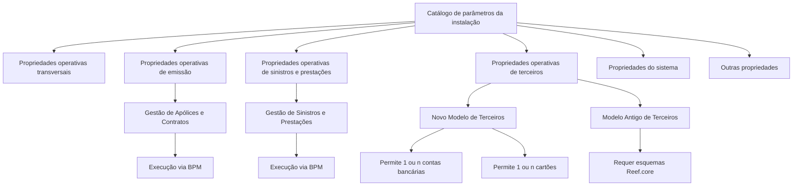

# Definição dos Parâmetros Iniciais da Instalação — Documentação Reef

## 1. Metadados do Documento
- **Arquivo de Origem:** Não identificado no conteúdo extraído
- **Tipo de Documento:** Especificação Técnica
- **Domínio / Sistema:** Reef / MAPFRE
- **Público-Alvo:** Direção de Tecnologia Local e equipes que configuram ou utilizam o Sistema
- **Data/Versão Identificada:** Não identificada

---

## 2. Resumo Executivo & Contexto de Negócio

O documento descreve o catálogo de parâmetros iniciais de uma instalação do Sistema Reef. Esse catálogo permite identificar e codificar parâmetros que interferem no comportamento e na funcionalidade dos módulos do Sistema, sendo entregue inicialmente às entidades com conteúdo parcial.

A definição dos parâmetros é responsabilidade da Direção de Tecnologia Local. Os parâmetros são organizados em agrupamentos de propriedades operativas transversais, emissão, sinistros, terceiros, sistema e outras propriedades. O objetivo é adaptar a instalação às necessidades da entidade ou país sem alterar a definição central do núcleo.

O documento detalha parâmetros que controlam execução via Business Process Management (BPM), utilização do novo ou antigo Modelo de Dados de Terceiros, múltiplas contas bancárias e cartões, formato de datas, banco de dados, conjunto de caracteres, idioma e limites de registros retornados em consultas.

A configuração do modelo de terceiros é especialmente relevante: uma instalação utiliza exclusivamente o Modelo Antigo ou o Novo Modelo de Informação de Terceiros. O Novo Modelo busca atender ao Modelo de Referência de Clientes corporativo da MAPFRE e fornecer maior funcionalidade e flexibilidade.

---

## 3. Arquitetura, Componentes & Tecnologias Envolvidas

Componentes, conceitos e tecnologias citados:

- **Sistema / núcleo do Sistema:** fornece o catálogo de parâmetros de instalação.
- **Catálogo de informações:** estrutura na qual os parâmetros são identificados e codificados.
- **Processo de Gestão de Apólices e Contratos:** pode ter execução via BPM ativada ou desativada.
- **Processo de Gestão de Sinistros e Prestações:** pode ter execução via BPM ativada ou desativada.
- **Business Process Management (BPM):** mecanismo de execução opcional para processos de apólices, contratos, sinistros e prestações.
- **Modelo de Dados de Terceiros Antigo:** modelo alternativo ao Novo Modelo; requer esquemas `Reef.core` quando utilizado.
- **Novo Modelo de Dados de Terceiros:** evolução do modelo de terceiros para alinhamento ao Modelo de Referência de Clientes da MAPFRE.
- **Processos Massivos de Terceiros:** utilizam caixas de correio comuns aos dois modelos de terceiros.
- **Base de Dados da Aplicação:** banco que suporta as informações do Sistema; o atributo descrito identifica se é ORACLE.
- **Gerador de Produtos:** possui limite específico de registros para consultas aos seus catálogos.
- **ORACLE:** banco de dados citado como valor identificado pelo atributo de Base de Dados do Sistema.
- **`Reef.core`:** esquemas que devem estar instalados quando o Modelo Antigo de Terceiros é utilizado.
- **`iso-8859-1`:** exemplo de código de conjunto de caracteres empregado na aplicação.



> **Nota de Análise:** o conteúdo não descreve interfaces, endpoints, contratos JSON, métodos HTTP, topologia de servidores, portas ou fluxos técnicos de integração entre componentes.

---

## 4. Regras de Negócio, Especificações Funcionais & Processos

### Responsabilidade de configuração

1. O núcleo do Sistema disponibiliza um catálogo de informações para identificar e codificar parâmetros que modulam comportamento e funcionalidade dos módulos.
2. O catálogo é entregue inicialmente às entidades com conteúdo parcial.
3. A identificação e a definição de todos os parâmetros são competência da **Direção de Tecnologia Local**.

### Propriedades operativas transversais

- O atributo **Dia de início semanal** identifica o dia em que a semana começa.

### Propriedades operativas de emissão

- O atributo **Hora/Minutos por defeito em Suplementos** identifica a hora e os minutos apresentados como parte:
  - da Data de Efeito da apólice; ou
  - da data de efeito do suplemento no Processo de Emissão.
- Esse atributo é aplicável aos Ramos que tenham configurada a obrigatoriedade de captura dessa informação.
- Valores exemplificados: `00:00`, `12:00` e `24:00`.
- O atributo **BPM em Processo de Gestão de Apólices e Contratos** identifica se a execução desse processo via BPM está ativada ou não.

### Propriedades operativas de sinistros e prestações

- O atributo **BPM em Processo de Gestão de Sinistros e Prestações** identifica se a execução desse processo via BPM está ativada ou não.

### Propriedades operativas de terceiros

- O parâmetro **O Sistema emprega o novo Modelo de Terceiros** indica se países utilizam ou não o Novo Modelo de Dados de Terceiros.
- O Novo Modelo de Dados de Terceiros evoluiu para:
  - atender ao Modelo de Referência de Clientes estabelecido corporativamente pela MAPFRE;
  - fornecer maior funcionalidade e flexibilidade.
- Os modelos de informação de terceiros são mutuamente exclusivos:
  - uma instalação utiliza o Modelo Antigo; ou
  - uma instalação utiliza o Novo Modelo.
- As caixas de correio utilizadas nos Processos Massivos de Terceiros atendem aos dois modelos.
- Quando o Modelo Antigo é usado, os esquemas `Reef.core` precisam estar instalados.
- O atributo **Tipo Documento Identificador Terceiros Genérico** define o tipo de documento atribuído por padrão pelo Sistema na captura inicial de terceiros pertencentes às novas atividades.
- O atributo **Código Identificador Terceiros Genérico** identifica o código genérico de terceiros, `999999`, para determinados acessos à Base de Dados da Aplicação.
- Para o Modelo Antigo:
  - **Contas Bancárias Múltiplas** controla a possibilidade de capturar múltiplas contas bancárias ou somente uma.
  - **Cartões Múltiplos** controla a possibilidade de capturar múltiplos cartões ou somente um.
- Para o Novo Modelo:
  - é permitida a captura de `1` ou `n` contas bancárias;
  - é permitida a captura de `1` ou `n` cartões nos meios de cobrança/pagamento.
- **Consulta Atividade Estendida** está marcada como `== Pendiente ==`.
- **Consulta Segurado Limitada** está marcada como `== Pendiente ==`.

### Propriedades do sistema

- O atributo **Base de Dados do Sistema** identifica se a base que suporta as informações do Sistema é **ORACLE**.
- O atributo **Formato Data sem Separadores** identifica o formato de data sem separadores entre dia, mês e ano: `DDMMYYYY`.
- As constantes **YES** e **NO** existem para compatibilidade entre os idiomas Inglês e Espanhol.
- O atributo **Conjunto de Caracteres do Sistema** identifica o código do conjunto de caracteres usado pela aplicação; `iso-8859-1` é apresentado como exemplo.
- O atributo **Chave da Instalação** identifica localmente a instalação ou país em que a aplicação é executada.
- A Chave da Instalação permite distinguir, em determinados catálogos, registros pertencentes ao núcleo de registros que são extensões particularizadas por Entidade.
- Exemplos apresentados:
  - `TRN`: código de instalação do Núcleo;
  - `MMT`: instalação MAPFRE MiddleSea, Malta;
  - `EUR`: instalação MAPFRE Chile, originalmente EuroAmérica Seguros.
- O atributo **Número Máximo de Registros em Consultas** limita a quantidade máxima de registros obtidos em consultas à Base de Dados da Aplicação para minimizar o impacto global no desempenho.
- O atributo **Número Máximo de Registros em Consultas do Gerador de Produtos** limita a quantidade máxima de registros obtidos em consultas específicas aos Catálogos do Gerador de Produtos para minimizar o impacto global no desempenho.
- O atributo **Idioma da Instalação** identifica o idioma padrão das etiquetas apresentadas no conjunto de Programas da Aplicação.

### Outras propriedades

- A seção **Vínculos** relaciona diretrizes e documentos funcionais cuja leitura é recomendada para evitar interpretações incorretas decorrentes da análise isolada deste documento.
- **Idioma da Instalação** é citado novamente nessa seção.

---

## 5. Tabelas de Parâmetros, Ambientes e Estruturas de Dados

| Item / Parâmetro | Descrição / Função | Tipo / Valores / Formato | Ambiente / Observações |
| :--- | :--- | :--- | :--- |
| Dia de início semanal | Identifica o dia em que a semana começa | Não detalhado | Propriedade operativa transversal |
| Hora/Minutos por defeito em Suplementos | Define hora e minutos mostrados na Data de Efeito da apólice ou suplemento | Exemplos: `00:00`, `12:00`, `24:00` | Aplicável aos Ramos com captura obrigatória configurada |
| BPM em Processo de Gestão de Apólices e Contratos | Indica se o processo é executado via BPM | Ativado ou não ativado; valores não detalhados | Propriedade operativa de emissão |
| BPM em Processo de Gestão de Sinistros e Prestações | Indica se o processo é executado via BPM | Ativado ou não ativado; valores não detalhados | Propriedade operativa de sinistros |
| Sistema emprega o novo Modelo de Terceiros | Distingue países que usam ou não o Novo Modelo de Dados de Terceiros | Novo Modelo ou Modelo Antigo | Os modelos são excludentes em uma instalação |
| Tipo Documento Identificador Terceiros Genérico | Define o tipo de documento padrão na captura inicial de terceiros das novas atividades | Não detalhado | Relacionado à evolução do Novo Modelo de Dados de Terceiros |
| Código Identificador Terceiros Genérico | Identifica o código genérico para determinados acessos à Base de Dados da Aplicação | `999999` | Relacionado ao Novo Modelo e novas atividades de terceiros |
| Contas Bancárias Múltiplas | Permite capturar múltiplas contas bancárias ou somente uma | Uma ou múltiplas; valores de ativação não detalhados | Modula somente o Modelo Antigo; no Novo Modelo permite `1` ou `n` contas |
| Cartões Múltiplos | Permite capturar múltiplos cartões ou somente um | Um ou múltiplos; valores de ativação não detalhados | Modula somente o Modelo Antigo; no Novo Modelo permite `1` ou `n` cartões |
| Consulta Atividade Estendida | Item listado sem especificação funcional | `== Pendiente ==` | Não há detalhamento adicional |
| Consulta Segurado Limitada | Item listado sem especificação funcional | `== Pendiente ==` | Não há detalhamento adicional |
| Base de Dados do Sistema | Identifica se a base que suporta o Sistema é ORACLE | `ORACLE` | Propriedade do Sistema |
| Formato Data sem Separadores | Define formato de campos de data sem separadores | `DDMMYYYY` | Propriedade do Sistema |
| Constante YES | Garante compatibilidade entre Inglês e Espanhol | `YES` | Propriedade do Sistema |
| Constante NO | Garante compatibilidade entre Inglês e Espanhol | `NO` | Propriedade do Sistema |
| Conjunto de Caracteres do Sistema | Identifica o código do conjunto de caracteres da aplicação | Exemplo: `iso-8859-1` | Pode incluir letras, números, sinais de pontuação e espaços |
| Chave da Instalação | Identifica localmente instalação ou país e diferencia registros do núcleo de extensões da Entidade | Exemplos: `TRN`, `MMT`, `EUR` | `TRN`: Núcleo; `MMT`: MAPFRE MiddleSea/Malta; `EUR`: MAPFRE Chile/EuroAmérica Seguros originalmente |
| Número Máximo de Registros em Consultas | Define o máximo de registros retornados em consulta à Base de Dados da Aplicação | Valor não detalhado | Minimiza impacto global sobre desempenho |
| Número Máximo de Registros em Consultas do Gerador de Produtos | Define o máximo de registros retornados em consultas aos Catálogos do Gerador de Produtos | Valor não detalhado | Minimiza impacto global sobre desempenho |
| Idioma da Instalação | Define idioma padrão das etiquetas exibidas nos Programas da Aplicação | Idioma não detalhado | Citado também em Outras Propriedades |
| Esquemas `Reef.core` | Esquemas requeridos para utilização do Modelo Antigo de Terceiros | Nome técnico: `Reef.core` | Necessários quando o Modelo Antigo é utilizado |
| Caixas de correio dos Processos Massivos de Terceiros | Suportam Processos Massivos de Terceiros | Utilizáveis pelos dois modelos | Servem ao Novo Modelo e ao Modelo Antigo |

---

## 6. Bateria de Perguntas & Respostas para RAG (FAQ Sintético)

### P1: Quem é responsável por identificar e definir os parâmetros iniciais da instalação?
**R:** A identificação e a definição de todos os parâmetros iniciais da instalação são competência da Direção de Tecnologia Local.

### P2: Qual é a finalidade do catálogo de parâmetros do Sistema?
**R:** O catálogo permite identificar e codificar os parâmetros que intervêm e modulam o comportamento e a funcionalidade dos diferentes módulos que compõem o Sistema. Ele é entregue inicialmente às entidades com conteúdo parcial.

### P3: O que controla o parâmetro “Hora/Minutos por defeito em Suplementos”?
**R:** O parâmetro identifica a hora e os minutos exibidos como parte da Data de Efeito da apólice ou da data de efeito do suplemento no Processo de Emissão. Ele se aplica aos Ramos que tenham a obrigatoriedade de captura configurada. O documento apresenta como exemplos `00:00`, `12:00` e `24:00`.

### P4: Como o documento define a execução via BPM para apólices, contratos, sinistros e prestações?
**R:** Existem dois atributos: “BPM em Processo de Gestão de Apólices e Contratos” e “BPM em Processo de Gestão de Sinistros e Prestações”. Cada atributo identifica se o respectivo processo tem ou não sua execução via Business Process Management (BPM) ativada.

### P5: Os modelos Antigo e Novo de Informação de Terceiros podem coexistir na mesma instalação?
**R:** Não. O documento estabelece que os dois modelos são excludentes: uma instalação utiliza o Modelo Antigo ou utiliza o Novo Modelo de Informação de Terceiros.

### P6: Qual é o requisito técnico para usar o Modelo Antigo de Dados de Terceiros?
**R:** Quando o Modelo Antigo de Dados de Terceiros é utilizado, os esquemas `Reef.core` devem estar instalados. As caixas de correio dos Processos Massivos de Terceiros podem ser usadas tanto pelo modelo antigo quanto pelo novo.

### P7: Como funcionam múltiplas contas bancárias e múltiplos cartões nos modelos de terceiros?
**R:** No Modelo Antigo, os parâmetros “Contas Bancárias Múltiplas” e “Cartões Múltiplos” modulam a possibilidade de capturar múltiplas ocorrências ou somente uma. No Novo Modelo, o documento informa que é permitida indistintamente a captura de `1` ou `n` contas bancárias e de `1` ou `n` cartões nos meios de cobrança/pagamento.

### P8: Qual código representa o Identificador Terceiros Genérico?
**R:** O código genérico de terceiros é `999999`. O documento informa que esse código é necessário para realizar determinados acessos à Base de Dados da Aplicação.

### P9: Qual formato de data sem separadores é definido pelo Sistema?
**R:** O atributo “Formato Data sem Separadores” identifica o formato `DDMMYYYY`, sem separador entre dia, mês e ano.

### P10: Para que servem os limites máximos de registros em consultas?
**R:** O “Número Máximo de Registros em Consultas” limita o número de registros que podem ser obtidos em uma consulta à Base de Dados da Aplicação. O parâmetro específico do Gerador de Produtos faz o mesmo para consultas aos seus catálogos. Ambos buscam minimizar o impacto global das consultas sobre o desempenho do Sistema.

### P11: O que identifica a Chave da Instalação?
**R:** A Chave da Instalação identifica localmente a instalação ou o país onde a aplicação é executada. Ela permite diferenciar, em determinados catálogos, registros pertencentes ao núcleo de registros que são extensões particularizadas pela Entidade. Os exemplos fornecidos são `TRN`, `MMT` e `EUR`.

### P12: Há detalhamento para Consulta Atividade Estendida e Consulta Segurado Limitada?
**R:** Não. Os dois itens aparecem no documento com a indicação `== Pendiente ==`, sem descrição funcional, regra de negócio ou parâmetros adicionais.

---

## 7. Glossário de Termos, Siglas & Conceitos-Chave

- **BPM:** Business Process Management; mecanismo de execução que pode ser ativado para os processos de Gestão de Apólices e Contratos e de Gestão de Sinistros e Prestações.
- **MAPFRE:** organização citada como referência corporativa para o Modelo de Referência de Clientes e como parte das instalações MAPFRE MiddleSea e MAPFRE Chile.
- **Modelo Antigo de Terceiros:** modelo alternativo ao Novo Modelo de Dados de Terceiros; requer os esquemas `Reef.core`.
- **Novo Modelo de Dados de Terceiros:** evolução do modelo de terceiros para atender ao Modelo de Referência de Clientes corporativo da MAPFRE e proporcionar maior funcionalidade e flexibilidade.
- **Processos Massivos de Terceiros:** processos que utilizam caixas de correio comuns aos modelos Antigo e Novo de Terceiros.
- **`Reef.core`:** esquemas que precisam estar instalados quando o Modelo Antigo de Terceiros é utilizado.
- **ORACLE:** banco de dados identificado pelo atributo Base de Dados do Sistema.
- **Gerador de Produtos:** componente cujos catálogos possuem limite específico de registros em consultas.
- **`DDMMYYYY`:** formato de data sem separadores entre dia, mês e ano.
- **`iso-8859-1`:** exemplo de código de conjunto de caracteres empregado na aplicação.
- **`TRN`:** exemplo de Chave da Instalação correspondente ao código de instalação do Núcleo.
- **`MMT`:** exemplo de Chave da Instalação correspondente à MAPFRE MiddleSea, Malta.
- **`EUR`:** exemplo de Chave da Instalação correspondente à MAPFRE Chile, originalmente EuroAmérica Seguros.
- **`YES` / `NO`:** constantes para compatibilidade entre Inglês e Espanhol.

---

## 8. Notas Críticas, Riscos & Limitações

- O catálogo é entregue às entidades inicialmente com conteúdo parcial; o documento não informa quais parâmetros são entregues pré-configurados.
- A correta identificação e definição dos parâmetros depende da Direção de Tecnologia Local.
- Os modelos Antigo e Novo de Informação de Terceiros são mutuamente exclusivos por instalação.
- O uso do Modelo Antigo de Terceiros depende da instalação dos esquemas `Reef.core`.
- A configuração dos limites máximos de consultas influencia diretamente a mitigação de impacto de desempenho na Base de Dados da Aplicação e nos Catálogos do Gerador de Produtos.
- Os itens **Consulta Atividade Estendida** e **Consulta Segurado Limitada** estão pendentes e não possuem detalhamento adicional.
- O documento não informa valores concretos para ativação de BPM, limites de consulta, idioma, dia inicial da semana, tipo de documento genérico ou configurações de ambiente.
- O documento não detalha métodos HTTP, contratos de integração, URLs, rotas de log, credenciais, servidores, portas ou versões de componentes.

---

## 9. Conteúdo Bruto Estruturado (Referência Fiel)

```text
--- [PÁGINA 1 DE 3] ---

DEFINICIÓN de Los Parámetros Iniciales de la Instalación
El núcleo del Sistema permite identicar y codicar los Parámetros que intervienen y modulan el comportamiento y funcionalidad de los
distintos módulos que lo componen, en un catálogo de información que se entrega a las entidades inicialmente con contenido parcial.
En el catálogo se conguran los diferentes parámetros de acuerdo con las siguientes agrupaciones:
Propiedades Operativas Transversales
Propiedades Operativas de Emisión
Propiedades Operativas de Siniestros
Propiedades Operativas Relacionadas con Personas Físicas y/o Jurídicas
Propiedades Tecnológicas del Sistema
Otras Propiedades
NOTA: Es competencia de la Dirección de Tecnología Local la identicación y denición de todos estos parámetros.
Propiedades Operativas Transversales
Día de inicio semanal
Este Atributo identica el día en el que empieza la semana.
Propiedades Operativas de Emisión
Hora/Minutos por defecto en Suplementos
Este Atributo identica, en aquellos Ramos que tengan congurada la obligatoriedad de su captura, la Hora y minutos que se mostrarán como
parte de la Fecha de Efecto de la póliza o de la fecha de efecto del suplemento en el Proceso de Emisión.
A modo de ejemplo se podría considerar uno de los siguientes valores:
00:00
12:00
24:00
BPM en Proceso de Gestión de Pólizas y Contratos
Este Atributo identica si el proceso de Gestión de Pólizas y Contratos tiene o no activada su ejecución vía Business Process Management
(BPM).
Propiedades Operativas de Siniestros
Documentation / DOCUMENTACIÓN Reef
DOCUMENTACIÓN Reef
Mapfredocument
DOCUMENTACIÓN Reef
Owner
user:agonzalez_mapfre.com
Lifecycle
Approved Source
 / 
 VL
Buscar Inicio Soluciones Arquitecturas APIs Componentes Cloud Documentación Zeus Reef Ayuda
ES


--- [PÁGINA 2 DE 3] ---

BPM en Proceso de Gestión de Siniestros y Prestaciones
Este Atributo identica si el proceso de Gestión de Siniestros y Prestaciones tiene o no activada su ejecución vía Business Process
Management (BPM).
Propiedades Operativas de Terceros
El Sistema emplea el nuevo Modelo de Terceros
El modelo de datos de Terceros se ha evolucionado, para por un lado cumplir el Modelo de Referencia de Clientes establecido en MAPFREa
nivel corporativo y por otro para dotarle de mayor funcionalidad y exibilidad.
Es por ello por lo que se han denido este parámetro para distinguir e indicar si los países están utilizando o no el nuevo modelo de datos de
Terceros.
IMPORTANTE: Los buzones utilizados en los Procesos Masivos de Terceros sirven para ambos modelos: el nuevo y el antiguo pero es
necesario tener instalados los esquemas Reef.core si se utiliza el modelo antiguo.
Tipo Documento Identicador Terceros Genérico
Como consecuencia de la evolución del Nuevo Modelo de Datos de Terceros este atributo identica el Tipo de Documento que el sistema
asignará por defecto en la captura inicial de los Terceros pertenecientes a las nuevas actividades.
Código Identicador Terceros Genérico
Como consecuencia de la evolución del Nuevo Modelo de Datos de Terceros y de las nuevas Actividades de Terceros creadas, es necesario
identicar cual es el código genérico de los Terceros (999999) para realizar determinados accesos a la Base de Datos de la Aplicación.
Cuentas Bancarias Múltiples
Siempre y cuando la instalación utilice el Modelo de Datos de Terceros antiguo, la activación de este parámetro modula la funcionalidad del
sistema permitiendo la posibilidad de capturar múltiples cuentas bancarias o solamente una (a diferencia de si la instalación emplea el
Nuevo Modelo de Datos en el que se permite indistintamente la captura de 1 o n cuentas bancarias).
Tarjetas Múltiples
Siempre y cuando la instalación utilice el Modelo de Datos de Terceros antiguo, la activación de este parámetro modula la funcionalidad del
sistema permitiendo la posibilidad de capturar múltiples Tarjetas o solamente una (a diferencia de si la instalación emplea el Nuevo Modelo
de Datos en el que se permite indistintamente la captura de 1 o n Tarjetas en los medios de cobro/pago).
Consulta Actividad Extendida
== Pendiente ==
Consulta Asegurado Limitada
== Pendiente ==
Propiedades del Sistema
Base de Datos del Sistema
Este Atributo del Catálogo identica si la Base de Datos que soporta la información del Sistema es ORACLE.
Formato Fecha sin Separadores
Este Atributo del Catálogo identica el Formato de los campos fecha sin utilizar separador alguno entre los días, los meses y el año
(DDMMYYYY)
Constante YES
Por compatibilidad entre los idiomas Inglés y Español.
Constante NO


--- [PÁGINA 3 DE 3] ---

Por compatibilidad entre los idiomas Inglés y Español.
Conjunto de Caracteres del Sistema
Un conjunto de caracteres es un sistema de codicación para que las computadoras sepan cómo reconocer un carácter, incluidas letras,
números, signos de puntuación y espacios en blanco.
Este Atributo del Catálogo identica el Código del Conjunto de Caracteres, alfabéticos o no, que cuentan con unas características comunes
en su estructura y en su estilo y que se emplean en la aplicación, como por ejemplo el Código 'iso-8859-1'
Clave de la Instalación
Este Atributo identica localmente la instalación o país en el que se ejecuta la aplicación, permitiendo distinguir en ciertos catálogos de la
aplicación si los registros que contienen pertenecen al núcleo o son extensiones del mismo particularizadas por la Entidad.
A modo de ejemplo:
La Clave 'TRN' corresponde al código de instalación del Núcleo,
La Clave 'MMT' corresponde a la instalación de MAPFRE MiddleSea (Malta),
La Clave 'EUR' sería la instalación de MAPFRE Chile (EuroAmérica Seguros originalmente)
...
Número Máximo de Registros en Consultas
Este Atributo del Catálogo identica el número máximo de registros que se pueden obtener en una consulta a la Base de Datos de la
Aplicación minimizando así el impacto global de la consulta sobre el rendimiento del sistema.
Número Máximo de Registros en Consultas del Generador de Productos
Este Atributo del Catálogo identica el número máximo de registros que se pueden obtener en una consulta especícamente sobre los
Catálogos del Generador de Productos minimizando así el impacto global de la consulta sobre el rendimiento del sistema.
Idioma de la Instalación
Este Atributo identica el idioma por defecto con el que se mostrarán las etiquetas en el conjunto de Programas de la Aplicación.
Otras Propiedades
Vínculos
Relación de Directrices y Documentos funcionales cuya lectura recomendada para evitar que la interpretación aislada del presente
documento pueda conducir a error.
Idioma de la Instalación
Preguntas frecuentes
(1) ¿Son excluyentes los dos Modelos de Información de Terceros en una instalación?
Sí, o bien se utiliza el Modelo Antiguo o bien se emplea el Nuevo Modelo.
```
