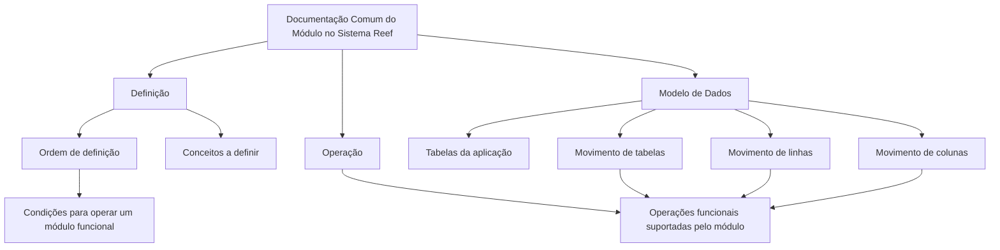

# Documentação Comum do Módulo no Sistema Reef

## 1. Metadados do Documento
- **Arquivo de Origem:** Não identificado no conteúdo fornecido
- **Tipo de Documento:** Manual Operacional
- **Domínio / Sistema:** Reef / Mapfre
- **Público-Alvo:** Não identificado explicitamente
- **Data/Versão Identificada:** Não identificada

---

## 2. Resumo Executivo & Contexto de Negócio

O documento apresenta a estrutura da documentação comum associada à funcionalidade de um módulo no sistema Reef. O conteúdo organiza as informações em três áreas: **Definição**, **Operação** e **Modelo de Dados**.

A seção **Definição** descreve documentos voltados aos conceitos que precisam ser definidos e à ordem necessária para realizar a definição que permitirá operar um módulo funcional. O documento não detalha conceitos específicos, etapas concretas ou entidades de negócio.

A seção **Operação** abrange documentos relacionados às operações funcionais suportadas pelo módulo. O conteúdo extraído não especifica quais operações, regras de execução, usuários responsáveis ou resultados esperados são cobertos.

A seção **Modelo de Dados** é orientada às tabelas da aplicação e descreve o movimento de elementos como tabelas, linhas e colunas de acordo com as operações funcionais. Não foram identificados nomes de tabelas, estruturas de campos, tipos de dados ou relacionamentos específicos.

---

## 3. Arquitetura, Componentes & Tecnologias Envolvidas

Os elementos identificados no conteúdo são:

| Componente / Elemento | Papel identificado |
| :--- | :--- |
| Reef | Sistema ou domínio ao qual a documentação pertence. |
| Módulo funcional | Unidade funcional cuja definição e operações são documentadas. |
| Definição | Área documental para conceitos e sequência de definição necessária à operação do módulo. |
| Operação | Área documental para operações funcionais suportadas pelo módulo. |
| Modelo de Dados | Área documental voltada às tabelas da aplicação, linhas e colunas. |
| Mapfredocument | Termo exibido na área de navegação/documentação; o conteúdo não explica sua função. |
| Zeus | Termo exibido na área de navegação; o conteúdo não explica sua relação com Reef. |
| VL | Valor exibido após “Approved Source”; não há detalhamento adicional. |
| agonzalez_mapfre.com | Identificador exibido como proprietário (`Owner`). |



> **Nota de Análise:** O conteúdo não descreve arquitetura de software, APIs, microsserviços, protocolos, tecnologias de infraestrutura, métodos HTTP, contratos JSON ou ambientes técnicos.

---

## 4. Regras de Negócio, Especificações Funcionais & Processos

### 4.1 Organização documental do módulo

A documentação do módulo no sistema Reef é dividida nos seguintes apartados:

1. **Definição**
2. **Operação**
3. **Modelo de Dados**

### 4.2 Processo de definição para operação do módulo

O documento estabelece que os documentos de **Definição** devem detalhar:

1. Os conceitos que devem ser definidos.
2. A ordem que deve ser seguida para obter a definição necessária.
3. A definição necessária para possibilitar a operação de um módulo funcional.

> **Nota de Análise:** O documento indica a existência de uma ordem de definição, mas não fornece a sequência, os responsáveis, critérios de validação ou condições de aprovação.

### 4.3 Operações funcionais

A área de **Operação** reúne documentos relacionados às operações funcionais suportadas pelo módulo.

> **Nota de Análise:** O conteúdo não identifica operações funcionais específicas, fluxos de exceção, permissões, entradas, saídas ou regras de negócio associadas.

### 4.4 Modelo de dados e movimentação de elementos

A área de **Modelo de Dados** é direcionada às tabelas da aplicação. Adicionalmente, a documentação descreve o movimento dos seguintes elementos conforme as operações funcionais:

- Tabelas;
- Linhas;
- Colunas.

> **Nota de Análise:** Não foram apresentados nomes físicos ou lógicos de tabelas, chaves, colunas, tipos de dados, cardinalidades, regras de integridade ou exemplos de movimentação.

---

## 5. Tabelas de Parâmetros, Ambientes e Estruturas de Dados

| Item / Parâmetro | Descrição / Função | Tipo / Valores / Formato | Ambiente / Observações |
| :--- | :--- | :--- | :--- |
| Sistema | Sistema citado pela documentação. | Reef | Não há ambiente identificado. |
| Estrutura documental | Organização principal das informações do módulo. | Definição, Operação e Modelo de Dados | Aplicável à funcionalidade do módulo no sistema. |
| Definição | Documentos sobre conceitos a definir e ordem de definição. | Seção documental | Necessária para permitir a operação do módulo funcional. |
| Operação | Documentos sobre operações funcionais suportadas. | Seção documental | Operações não especificadas. |
| Modelo de Dados | Documentação orientada às tabelas da aplicação. | Seção documental | Abrange movimento de tabelas, linhas e colunas. |
| Tabelas | Elementos da aplicação abordados pelo modelo de dados. | Não especificado | Nomes e estruturas não apresentados. |
| Linhas | Elementos cujo movimento é descrito conforme operações funcionais. | Não especificado | Sem detalhamento adicional. |
| Colunas | Elementos cujo movimento é descrito conforme operações funcionais. | Não especificado | Sem detalhamento adicional. |
| Owner | Proprietário exibido na plataforma documental. | `user:agonzalez_mapfre.com` | Não há descrição de responsabilidades. |
| Lifecycle | Estado exibido para o conteúdo. | `Approved Source` | O processo de aprovação não é detalhado. |
| Origem adicional | Valor exibido junto ao ciclo de vida. | `VL` | Significado não identificado. |
| Idioma da interface | Idioma exibido na navegação. | `ES` | O conteúdo está em espanhol. |

---

## 6. Bateria de Perguntas & Respostas para RAG (FAQ Sintético)

### P1: Qual é o objetivo da documentação comum do módulo no sistema Reef?
**R:** A documentação comum organiza os pontos relacionados à funcionalidade de um módulo no sistema Reef. As informações são divididas em Definição, Operação e Modelo de Dados.

### P2: Quais são as seções principais da documentação do módulo Reef?
**R:** A documentação é dividida em três seções: Definição, Operação e Modelo de Dados.

### P3: O que a seção Definição documenta?
**R:** A seção Definição contém documentos sobre os conceitos que precisam ser definidos e sobre a ordem que deve ser seguida para alcançar a definição necessária à operação de um módulo funcional.

### P4: O documento apresenta a sequência detalhada para definição do módulo funcional?
**R:** Não. O documento informa que existe uma ordem a ser seguida para realizar a definição necessária, mas não apresenta as etapas dessa sequência.

### P5: Que tipo de informação está contida na seção Operação?
**R:** A seção Operação reúne documentos relacionados às operações funcionais que o módulo suporta. O conteúdo extraído não lista operações específicas.

### P6: Qual é o foco da seção Modelo de Dados?
**R:** A seção Modelo de Dados é orientada às tabelas da aplicação. Também descreve o movimento de tabelas, linhas e colunas conforme as operações funcionais.

### P7: O documento fornece nomes de tabelas ou definição de colunas do sistema Reef?
**R:** Não. O documento menciona tabelas, linhas e colunas como elementos tratados pelo Modelo de Dados, mas não apresenta nomes de tabelas, campos, tipos de dados ou relacionamentos.

### P8: Qual sistema é associado à documentação apresentada?
**R:** A documentação é associada ao sistema Reef, conforme as referências “Documentation / DOCUMENTACIÓN Reef” e “DOCUMENTACIÓN Reef”.

### P9: Quem aparece como proprietário do documento?
**R:** O campo `Owner` apresenta o valor `user:agonzalez_mapfre.com`. O conteúdo não descreve as atribuições desse proprietário.

### P10: Qual status de ciclo de vida é exibido no documento?
**R:** O campo `Lifecycle` apresenta o status `Approved Source`, acompanhado do valor `VL`. O significado de `VL` não é detalhado.

---

## 7. Glossário de Termos, Siglas & Conceitos-Chave

- **Reef:** Sistema ou domínio citado como contexto da documentação.
- **Módulo funcional:** Módulo cuja definição, operações e modelo de dados são tratados pela documentação.
- **Definição:** Área documental que descreve conceitos a definir e a ordem necessária para permitir a operação de um módulo funcional.
- **Operação:** Área documental relacionada às operações funcionais suportadas pelo módulo.
- **Modelo de Dados:** Área documental voltada às tabelas da aplicação e ao movimento de tabelas, linhas e colunas.
- **Lifecycle:** Campo de ciclo de vida exibido com o valor `Approved Source`.
- **Approved Source:** Valor de ciclo de vida exibido no documento; o significado processual não é explicado.
- **VL:** Valor exibido ao lado de `Approved Source`; sem definição no conteúdo.
- **Zeus:** Termo presente na navegação da plataforma documental; sua função não é explicada.
- **Mapfredocument:** Termo presente na navegação/documentação; sua função não é explicada.

---

## 8. Notas Críticas, Riscos & Limitações

- O conteúdo é introdutório e não apresenta especificações técnicas detalhadas do sistema Reef.
- Não foram identificados nomes de módulos, tabelas, colunas, APIs, integrações, URLs, ambientes, servidores, versões ou tecnologias.
- O documento informa que existe uma ordem para a definição necessária à operação do módulo, mas não apresenta essa ordem.
- As operações funcionais suportadas pelo módulo são mencionadas, porém não são enumeradas ou detalhadas.
- O Modelo de Dados cita tabelas, linhas e colunas, mas não contém modelo lógico, modelo físico, dicionário de dados ou regras de integridade.
- Os termos `Mapfredocument`, `Zeus` e `VL` aparecem no conteúdo, mas não possuem explicação contextual suficiente.

---

## 9. Conteúdo Bruto Estruturado (Referência Fiel)

```text
--- [PÁGINA 1 DE 1] ---

DOCUMENTACIÓN - COMUNES
 En este documento se indican los puntos relacionados con la funcionalidad del Módulo en el Sistema.
La información se encuentra dividida en los apartados siguientes:
Denición
Operación
Modelo de datos
DEFINICIÓN
Documentos que detallan aquellos conceptos que se han de denir y el orden que se ha de seguir para conseguir la denición necesaria con
lo que poder operar un módulo funcional.
OPERACIÓN
Documentos relacionados con las operaciones funcionales que el módulo soporta.
MODELO DE DATOS
Documentación orientada hacia las tablas de la aplicación.
Adicionalmente, se describe con detalle el movimiento de distintos elementos como tablas, las y columnas atendiendo a las operaciones
funcionales.
Documentation / DOCUMENTACIÓN Reef
DOCUMENTACIÓN Reef
Mapfredocument
DOCUMENTACIÓN Reef
Owner
user:agonzalez_mapfre.com
Lifecycle
Approved Source
 / 
 VL
Buscar Inicio Soluciones Arquitecturas APIs Componentes Cloud Documentación Zeus Reef Ayuda
ES
```
