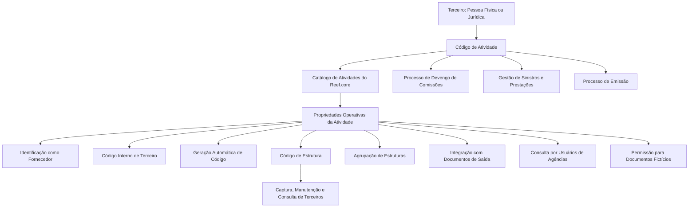

# Definição das Atividades de Terceiros no Reef.core

## 1. Metadados do Documento
- **Arquivo de Origem:** Não informado; conteúdo extraído de documentação Reef.
- **Tipo de Documento:** Especificação Funcional.
- **Domínio / Sistema:** Reef.core / Gestão de Terceiros / MAPFRE.
- **Público-Alvo:** Analistas funcionais, desenvolvedores, arquitetos, operação e equipes locais de Tecnologia.
- **Data/Versão Identificada:** Não identificada.
- **Owner identificado:** `user:agonzalez_mapfre.com`
- **Lifecycle identificado:** Approved.

---

## 2. Resumo Executivo & Contexto de Negócio

O documento define o conceito de **Atividade de Terceiro** no sistema Reef.core. Uma atividade é uma qualidade atribuída a terceiros — pessoas físicas ou jurídicas — para relacioná-los à capacidade de executar determinada função dentro do sistema.

Os códigos de atividade associados a terceiros identificam de forma inequívoca os processos, procedimentos e fluxos operacionais nos quais esses terceiros atuam ou podem atuar. A atividade não é apenas uma classificação descritiva: ela influencia processos funcionais, permissões de acesso, geração de códigos internos, manutenção de dados, integração documental e identificação de fornecedores.

Como exemplo, uma pessoa identificada com a atividade de **Intermediário ou Agente** pode entrar automaticamente no processo de apuração de comissões da entidade MAPFRE. Já uma pessoa com atividade de **Perito** pode ser envolvida em tarefas de atribuição e perícia no processo de Gestão de Sinistros e Prestações; uma pessoa com atividade de **Empregado** pode receber automaticamente desconto comercial na contratação de apólices durante o processo de Emissão.

O núcleo do Reef.core disponibiliza um catálogo de atividades. Os códigos de atividade de `1` a `99`, além do código `999`, são reservados e de uso exclusivo pelo núcleo do sistema. O documento enfatiza que esses códigos devem ser obrigatoriamente respeitados pelas implementações locais.

---

## 3. Arquitetura, Componentes & Tecnologias Envolvidas

### Componentes e conceitos identificados

| Componente / Conceito | Papel no contexto |
| :--- | :--- |
| **Reef.core** | Núcleo do sistema que mantém o catálogo e as propriedades das atividades de terceiros. |
| **Terceiros** | Pessoas físicas ou jurídicas classificadas por códigos de atividade. |
| **Catálogo de Atividades** | Repositório específico fornecido pelo núcleo do sistema para codificação de atividades. |
| **Programa de Manutenção de Terceiros** | Estrutura ou programa que permite captura, manutenção e consulta de terceiros associados a uma atividade. |
| **Módulo de Notificações - Documentos de Saída** | Módulo cuja integração pode ser permitida pela atividade do terceiro. |
| **Gestão de Sinistros e Prestações** | Processo no qual terceiros classificados como peritos podem atuar. |
| **Emissão** | Processo no qual empregados podem receber automaticamente desconto comercial em apólices. |
| **Processo de Devengo de Comissões** | Processo MAPFRE associado, entre outros, a terceiros com atividade de Intermediário ou Agente. |
| **Usuários de Agências** | Usuários cuja consulta a informações pode ser controlada pelo atributo da atividade. |
| **Direção de Tecnologia local** | Área responsável por definir e identificar nomes de estruturas e agrupamentos atribuídos às atividades. |



> **Nota de Análise:** O documento descreve relações funcionais entre atividades, terceiros e processos do Reef.core, mas não detalha interfaces técnicas, métodos HTTP, contratos JSON, bancos de dados, tecnologias de implementação, URLs ou ambientes de infraestrutura.

---

## 4. Regras de Negócio, Especificações Funcionais & Processos

### 4.1 Conceito de Atividade de Terceiro

1. Uma atividade no Reef.core é uma qualidade associada a terceiros.
2. A atividade permite relacionar um terceiro à capacidade de realizar uma função determinada no sistema.
3. Atividades podem ser associadas tanto a pessoas físicas quanto a pessoas jurídicas.
4. Os códigos de atividade identificam inequivocamente processos, procedimentos e fluxos operacionais em que o terceiro intervém ou pode intervir.

### 4.2 Reserva e uso de códigos

1. Os códigos de atividade de `1` a `99` são reservados ao núcleo do sistema.
2. O código `999` também é reservado ao núcleo do sistema.
3. Os códigos reservados são de uso exclusivo pelo núcleo do Reef.core.
4. As equipes locais devem respeitar obrigatoriamente os códigos de atividade próprios do núcleo da aplicação.

### 4.3 Efeitos funcionais da classificação de atividade

| Atividade exemplificada | Efeito funcional mencionado |
| :--- | :--- |
| Intermediário ou Agente | Entrada automática no processo de apuração de comissões da entidade MAPFRE. |
| Perito | Participação em tarefas específicas de atribuição e perícia no processo de Gestão de Sinistros e Prestações. |
| Empregado | Possibilidade de beneficiar-se automaticamente de desconto comercial na contratação de apólices no processo de Emissão. |

### 4.4 Propriedades gerais

#### Código de Atividade do Terceiro
Indica no sistema o código da atividade do terceiro.

#### Descrição da Atividade do Terceiro
Indica a denominação ou a descrição da atividade do terceiro.

### 4.5 Propriedades operativas

#### A atividade permite documentos fictícios
Indica se o código da atividade pode ou não ser associado a terceiros identificados por tipos de documentos definidos como não reais ou fictícios.

#### A atividade corresponde a um fornecedor
Indica se a atividade associada a um terceiro identifica esse terceiro como fornecedor no sistema.

Quando a marcação estiver habilitada, o terceiro terá definições próprias de fornecedores, incluindo:

- Zonas de atuação.
- Serviços permitidos.
- Horários.
- Outras definições próprias de fornecedores não detalhadas no documento.

#### Código de Terceiro
Indica se as informações do terceiro associado à atividade contemplam e implicam a existência e a geração de um código interno do terceiro.

O documento exemplifica que agentes, tramitadores e supervisores possuem um código que os identifica em todo o sistema. Nesses casos, não é necessário informar tipo e código de documento para identificação: basta o código interno do terceiro.

#### Geração Automática
Quando o atributo de código de terceiro estiver ativado, o sistema permite definir se o código interno será ou não gerado automaticamente.

#### Código de Estrutura
Indica o código da estrutura ou programa do sistema que permite realizar:

1. Captura de informações de terceiros.
2. Manutenção de informações de terceiros.
3. Consulta de informações de terceiros.

A aplicação desse código é direcionada aos terceiros que possuam o código de atividade associado.

#### Agrupação de Estruturas
Indica o agrupamento de estruturas ao qual pertence o código da estrutura de manutenção.

A Direção de Tecnologia local é responsável por definir e identificar:

- O nome da estrutura atribuída à atividade do terceiro.
- O agrupamento de estruturas atribuído à atividade do terceiro.

#### A atividade permite geração de documentação
Indica se o código da atividade permite integração, a partir do Programa de Manutenção de Terceiros, com o **Módulo de Notificações - Documentos de Saída**.

#### A atividade permite consulta por usuários de agências
Indica se o Reef.core permite a consulta de informações, por usuários identificados como usuários de agências, para o código de atividade afetado.

Esse atributo controla, na Rotina de Terceiros e para usuários assim diferenciados, a possibilidade de acesso à informação. O objetivo informado é evitar risco local de infração ao Regulamento Geral de Proteção de Dados.

---

## 5. Tabelas de Parâmetros, Ambientes e Estruturas de Dados

### 5.1 Catálogo de atividades fornecido pelo núcleo

| Código de Atividade | Descrição |
| :--- | :--- |
| 1 | Tomadores/Asegurados |
| 2 | Agentes |
| 3 | Peritos |
| 4 | Inspectores |
| 5 | Médicos |
| 6 | Abogados |
| 7 | Procuradores |
| 8 | Supervisores |
| 9 | Tramitadores |
| 10 | Proveedores |
| 11 | Ejecutivos de Cta. |
| 12 | Cobradores |
| 13 | Aseguradoras |
| 14 | Reaseguradoras |
| 15 | Empleados |
| 16 | Brokers |
| 17 | Talleres |
| 18 | Clínicas |
| 19 | Juzgados |
| 20 | Cristaleros |
| 21 | Cerrajeros |
| 22 | Plomeros |
| 23 | Electricistas |
| 24 | Grúas |
| 25 | Investigadores |
| 26 | Recuperadores |
| 27 | Ajustadores |
| 28 | Herreros |
| 29 | Tribunales |
| 30 | Terceros Seg. MOTOR |
| 31 | Terceros Seg. SALUD |
| 32 | Terceros Seg. PATRIMONIALES |
| 33 | Depósitos |
| 34 | Notarías |
| 35 | Centros de Peritación |
| 36 | Comisarías |
| 37 | Empleados de Agentes |
| 38 | Filial |
| 39 | Compañías |
| 40 | Entidades Bancarias |
| 41 | Oficinas Bancarias |
| 42 | Primer Nivel Est. Comercial |
| 43 | Segundo Nivel Est. Comercial |
| 44 | Tercer Nivel Est. Comercial |
| 45 | Representantes Legales |
| 99 | Otros Beneficiarios |
| 999 | Código reservado pelo núcleo; descrição não informada. |

### 5.2 Exemplos de atividades identificadas como fornecedores

| Código de Atividade | Nome do Fornecedor | Marca de Fornecedor |
| :--- | :--- | :--- |
| 17 | Talleres Concertados | S |
| 20 | Cristaleros | S |
| 21 | Cerrajeros | S |
| ... | ... | ... |

> **Nota de Análise:** O documento apresenta apenas exemplos de atividades com a propriedade de fornecedor habilitada. Não disponibiliza a relação completa de códigos classificados como fornecedores.

### 5.3 Propriedades da atividade de terceiro

| Item / Parâmetro | Descrição / Função | Tipo / Valores / Formato | Ambiente / Observações |
| :--- | :--- | :--- | :--- |
| Código de Atividade do Terceiro | Identifica o código da atividade associada ao terceiro. | Código numérico. | Códigos de 1 a 99 e 999 são reservados ao núcleo. |
| Descrição da Atividade do Terceiro | Define a denominação da atividade. | Texto. | Associada ao código de atividade. |
| Permite Documentos Fictícios | Define se a atividade pode ser associada a terceiros com documentos não reais ou fictícios. | Permite / não permite. | Valores técnicos não detalhados. |
| Corresponde a um Proveedor | Identifica a atividade como fornecedora. | Habilitada / não habilitada. | Quando habilitada, permite definições como zonas, serviços e horários. |
| Código de Tercero | Define existência e geração de código interno do terceiro. | Ativado / não ativado. | Aplicável, por exemplo, a agentes, tramitadores e supervisores. |
| Generación Automática | Define geração automática do código interno. | Sim / não. | Disponível apenas quando Código de Tercero está ativado. |
| Código de Estructura | Indica estrutura ou programa para captura, manutenção e consulta. | Código de estrutura. | Associado à atividade do terceiro. |
| Agrupación de Estructuras | Indica o grupo ao qual pertence a estrutura de manutenção. | Agrupamento de estruturas. | Definição sob responsabilidade da Direção de Tecnologia local. |
| Permite Generación de Documentación | Controla integração com o Módulo de Notificações - Documentos de Saída. | Permite / não permite. | Integração realizada a partir do Programa de Manutenção de Terceiros. |
| Permite Consulta a Usuarios de Agencias | Controla a consulta por usuários de agências. | Permite / não permite. | Atua como controle de acesso e mitigação de risco de proteção de dados. |

### 5.4 Documentos e referências vinculadas

| Referência | Relação com o tema |
| :--- | :--- |
| Estructuras | Documento funcional recomendado para interpretação das estruturas associadas às atividades. |
| Documentos Identificativos | Documento funcional recomendado para interpretação de tipos e códigos de documentos de terceiros. |
| Módulo de Notificaciones | Documento funcional recomendado para interpretação da integração documental. |

---

## 6. Bateria de Perguntas & Respostas para RAG (FAQ Sintético)

### P1: O que é uma Atividade de Terceiro no Reef.core?
**R:** Uma Atividade de Terceiro é uma qualidade associada a uma pessoa física ou jurídica no Reef.core. A atividade relaciona o terceiro à sua capacidade de realizar determinada função no sistema e identifica os processos, procedimentos e fluxos operacionais nos quais esse terceiro intervém ou pode intervir.

### P2: Quais códigos de atividade são reservados ao núcleo do Reef.core?
**R:** Os códigos de atividade de `1` a `99`, além do código `999`, são reservados e de uso exclusivo pelo núcleo do sistema. O documento determina que os códigos próprios do núcleo da aplicação devem ser obrigatoriamente respeitados.

### P3: Como a atividade de Agente ou Intermediário impacta o processamento no sistema?
**R:** Quando uma pessoa é identificada com atividade de Intermediário ou Agente, o código de atividade pode permitir sua entrada automática no processo de apuração de comissões da entidade MAPFRE. A retribuição econômica mencionada inclui, entre outros conceitos, parte proporcional das primas obtidas pela atuação comercial direta, intervenção ou colaboração.

### P4: Qual é o efeito de classificar um terceiro como Perito?
**R:** A classificação como Perito permite que o terceiro seja envolvido em tarefas específicas de atribuição e perícia dentro do processo de Gestão de Sinistros e Prestações.

### P5: O que acontece quando uma atividade é marcada como fornecedor?
**R:** Quando o atributo que identifica a atividade como fornecedor está habilitado, o terceiro possui definições próprias de fornecedores no sistema, como zonas de atuação, serviços permitidos e horários. O documento cita Talleres Concertados, Cristaleros e Cerrajeros como exemplos de atividades que normalmente possuem essa propriedade habilitada.

### P6: Para que serve o Código de Tercero?
**R:** O Código de Tercero indica se as informações do terceiro associado à atividade envolvem a existência e a geração de um código interno. Para agentes, tramitadores e supervisores, esse código pode identificar o terceiro em todo o sistema, sem necessidade de informar tipo e código de documento para identificá-lo.

### P7: Quando a geração automática de código interno pode ser configurada?
**R:** A geração automática pode ser definida somente quando o atributo Código de Tercero está ativado. Nessa condição, o sistema permite determinar se o código interno será gerado automaticamente ou não.

### P8: Qual é a finalidade do Código de Estructura?
**R:** O Código de Estructura indica a estrutura ou programa do sistema responsável por permitir a captura, a manutenção e a consulta das informações de terceiros que tenham o código de atividade associado.

### P9: Quem é responsável por definir a estrutura e a agrupação de estruturas de uma atividade?
**R:** A responsabilidade pela definição e identificação do nome da estrutura e do agrupamento de estruturas atribuídos a uma atividade de terceiro é da Direção de Tecnologia local.

### P10: Como a atividade controla a integração com geração de documentos?
**R:** A propriedade “La Actividad Permite la Generación de Documentación” determina se o código de atividade permite integração, a partir do Programa de Manutenção de Terceiros, com o Módulo de Notificações - Documentos de Saída.

### P11: Como a atividade protege dados perante usuários de agências?
**R:** O atributo de consulta da atividade para empregados ou usuários de agências controla, na Rotina de Terceiros, a possibilidade de esses usuários acessarem informações associadas ao código de atividade. O documento informa que esse controle busca evitar risco local de infração ao Regulamento Geral de Proteção de Dados.

### P12: O documento informa todos os métodos, contratos e integrações técnicas do Reef.core?
**R:** Não. O documento apresenta regras funcionais e propriedades de cadastro das atividades de terceiros, mas não detalha métodos HTTP, contratos JSON, APIs, portas, ambientes de infraestrutura ou tecnologias de implementação.

---

## 7. Glossário de Termos, Siglas & Conceitos-Chave

- **Reef.core:** Núcleo do sistema que disponibiliza o catálogo e as propriedades das atividades de terceiros.
- **Terceiro:** Pessoa física ou jurídica associada a uma atividade dentro do sistema.
- **Atividade de Terceiro:** Qualidade que relaciona um terceiro a uma função, processo, procedimento ou fluxo operacional.
- **Código de Atividade:** Código que identifica a atividade associada a um terceiro.
- **Fornecedor / Proveedor:** Terceiro cuja atividade possui marcação de fornecedor habilitada e, portanto, pode possuir definições como zonas de atuação, serviços permitidos e horários.
- **Código de Tercero:** Código interno usado para identificar o terceiro no sistema.
- **Código de Estructura:** Código da estrutura ou programa usado para captura, manutenção e consulta de informações de terceiros.
- **Agrupación de Estructuras:** Agrupamento ao qual pertence o código de estrutura de manutenção.
- **Módulo de Notificaciones - Documentos de Salida:** Módulo com o qual uma atividade pode permitir integração para geração de documentação.
- **Usuarios de Agencias:** Usuários de agências cuja capacidade de consultar informações pode ser controlada por atributo da atividade.
- **Gestión de Siniestros y Prestaciones:** Processo relacionado a tarefas de atribuição e perícia.
- **Emisión:** Processo de contratação de apólices no qual empregados podem receber desconto comercial.
- **MAPFRE:** Entidade citada no contexto do processo de apuração de comissões.
- **Reglamento General de Protección de Datos:** Regulamento citado como referência para o risco de acesso indevido a informações por usuários de agências.

---

## 8. Notas Críticas, Riscos & Limitações

- Os códigos de atividade entre `1` e `99`, bem como o código `999`, são exclusivos do núcleo do Reef.core. O uso inadequado ou a reutilização local desses códigos viola a recomendação operacional documentada.
- A configuração de consulta para usuários de agências é um controle relevante para redução do risco de infração ao Regulamento Geral de Proteção de Dados.
- A Direção de Tecnologia local possui dependência explícita para definição dos nomes de estruturas e agrupamentos de estruturas associados às atividades.
- A lista de fornecedores apresentada é exemplificativa; o documento não apresenta a relação completa de atividades que devem possuir a propriedade de fornecedor habilitada.
- O código `999` é citado como reservado, mas não possui descrição funcional no conteúdo fornecido.
- O documento não especifica valores técnicos concretos para os atributos booleanos, estruturas de persistência, validações de tela, APIs, integrações técnicas, autenticação, logs ou ambientes.
- Os documentos vinculados **Estructuras**, **Documentos Identificativos** e **Módulo de Notificaciones** são recomendados para evitar interpretação isolada e incorreta deste documento.

---

## 9. Conteúdo Bruto Estruturado (Referência Fiel)

```text
--- [PÁGINA 1 DE 5] ---

DEFINICIÓN de las Actividades de los Terceros
Contexto
Una Actividad en Reef.core es una cualidad asociada a los Terceros que permite relacionarlos con su capacidad para realizar una función
determinada en el Sistema.
Las actividades que los Terceros en Reef.core tienen asociadas van a identicar inequívocamente los procesos, procedimientos y ujos
operativos en los que éstos intervienen o pueden intervenir. Por ejemplo:
Si capturamos en el sistema la información de una persona física y la identicamos en el sistema con la actividad asociada a un
Intermediario o Agente, este código de actividad le permitirá entrar de manera automática en el proceso de devengo de comisiones de la
entidad MAPFRE, proceso por el que percibirá una retribución económica consistente, entre otros conceptos, de una parte proporcional de las
primas conseguidas en su labor comercial directa o a través de su intervención o colaboración.
En cambio si a la misma persona la hubiéramos identicado en el sistema como un Perito o como un Empleado, por lo que tendría asignados
códigos diferentes de actividad al código de actividad de Intermediario del ejemplo anterior, esta persona podría respectivamente estar
involucrada en tareas especícas de asignación y peritaje dentro del proceso de Gestión de Siniestros y Prestaciones o beneciarse
automáticamente de un descuento comercial en la contratación de sus pólizas en el proceso de Emisión.
Propiedades Generales
Funcionalmente, el núcleo del Sistema cuenta con la posibilidad de identicar y codicar las diferentes Actividades de los Terceros, sean
estos personas Físicas o Jurídicas, en un catálogo de información especíco que se entrega a las entidades con contenido:
Los códigos de actividad del 1 al 99 (además del código 999) están reservados y son de uso exclusivo por el núcleo del sistema.
Código de Actividad del Tercero
Esta propiedad indica en el sistema el código de la Actividad del Tercero.
La relación de Actividades que provee el núcleo es la que se indica en la siguiente tabla:
ACTIVIDAD DESCRIPCIÓN
1 Tomadores/Asegurados
2 Agentes
3 Peritos
Documentation / DOCUMENTACIÓN Reef
DOCUMENTACIÓN Reef
Mapfredocument
DOCUMENTACIÓN Reef
Owner
user:agonzalez_mapfre.com
Lifecycle
Approved Source
 /
VL
Buscar Inicio Soluciones Arquitecturas APIs Componentes Cloud Documentación Zeus Reef Ayuda
ES

--- [PÁGINA 2 DE 5] ---

ACTIVIDAD DESCRIPCIÓN
4 Inspectores
5 Médicos
6 Abogados
7 Procuradores
8 Supervisores
9 Tramitadores
10 Proveedores
11 Ejecutivos de Cta.
12 Cobradores
13 Aseguradoras
14 Reaseguradoras
15 Empleados
16 Brokers
17 Talleres
18 Clínicas
19 Juzgados
20 Cristaleros
21 Cerrajeros
22 Plomeros
23 Electricistas
24 Grúas
25 Investigadores
26 Recuperadores
27 Ajustadores
28 Herreros
29 Tribunales

--- [PÁGINA 3 DE 5] ---

ACTIVIDAD DESCRIPCIÓN
30 Terceros Seg. MOTOR
31 Terceros Seg. SALUD
32 Terceros Seg. PATRIMONIALES
33 Depósitos
34 Notarías
35 Centros de Peritación
36 Comisarías
37 Empleados de Agentes
38 Filial
39 Compañías
40 Entidades Bancarias
41 Ocinas Bancarias
42 Primer Nivel Est. Comercial
43 Segundo Nivel Est. Comercial
44 Tercer Nivel Est. Comercial
45 Representantes Legales
99 Otros Beneciarios
Descripción de la Actividad del Tercero
Esta propiedad le indica al sistema cual es la denominación o descripción de la Actividad del Tercero.
Propiedades Operativas
La Actividad Permite Documentos Ficticios
Esta propiedad le indica al sistema si el código de la actividad permite o no asociarse a Terceros identicados con tipos de documentos
denidos como documentos no reales o cticios.
¿La Actividad corresponde a un Proveedor?
Este atributo le indica al sistema si la Actividad asociada a un Tercero va a identicar o no a los Proveedores en el sistema. Si esta marca
está habilitada tendrá todas las deniciones propias de los Proveedores como por ejemplo sus Zonas de actuación, Servicios permitidos,
Horarios... etc
Por ejemplo, los siguientes códigos de Actividad suelen tener habilitada esta propiedad:

--- [PÁGINA 4 DE 5] ---

ACTIVIDAD NOMBRE PROVEEDOR
17 Talleres Concertados S
20 Cristaleros S
21 Cerrajeros S
... ... ...
Código de Tercero
Esta propiedad le indica al Sistema si la información del Tercero asociado a la actividad contempla e implica o no la existencia y generación
de un código interno del Tercero.
Ejemplo:
Los agentes, los tramitadores o los supervisores tienen un código que los identican en todo el sistema y por tanto no es necesario introducir
el tipo y el código del documento para identicarlos sino tan sólo este código.
Generación Automática
Siempre y cuando el atributo del código del tercero esté activado el sistema permite denir si el código interno se va o no a generar
automáticamente.
Código de Estructura
Esta propiedad le indica al sistema el Código de la Estructura o Programa del Sistema que permite realizar la captura, el mantenimiento y la
consulta de la información de los Terceros que tengan asociado el código de actividad.
Agrupación de Estructuras
Este atributo le indica al sistema la agrupación de estructuras a la que pertenece el Código de la estructura de mantenimiento.
NOTA: Es responsabilidad de la Dirección de Tecnología local la denición e identicación del nombre de la estructura y de la agrupación de
estructuras que se vayan a asignar a la Actividad del Tercero.
La Actividad Permite la Generación de Documentación
Esta propiedad le indica al sistema si el código de la actividad permite o no la integración con el Módulo de Noticaciones - Documentos de
Salida desde el Programa de Mantenimiento de Terceros.
La Actividad Permite la Consulta a los Usuarios de Agencias
Esta propiedad indica si Reef.core va a permitir o no la Consulta de información a los usuarios identicados como usuarios de Agencias para
el código de la actividad afectada.
Vínculos
Relación de Directrices y Documentos funcionales cuya lectura recomendada para evitar que la interpretación aislada del presente
documento pueda conducir a error.
Estructuras
Documentos Identicativos
Módulo de Noticaciones
Preguntas frecuentes
1 ¿Existe alguna recomendación operativa que deba ser tomada en consideración localmente en la codicación y uso de las Actividades de
Terceros en el Sistema?

--- [PÁGINA 5 DE 5] ---

Como recomendaciones operativas en la codicación y empleo de las actividades de los Terceros debemos considerar
Se ha de respetar obligatoriamente los códigos de actividades propios del núcleo de la aplicación.
Con el Atributo de consulta de la Actividad para los empleados de las agencias se controla, en la Rutina de Terceros y para aquellos
*usuarios así distinguidos*, la posibilidad de acceso a la información evitando el riesgo de infracción del Reglamento General de
Protección de Datos que pudiera existir localmente.
```
