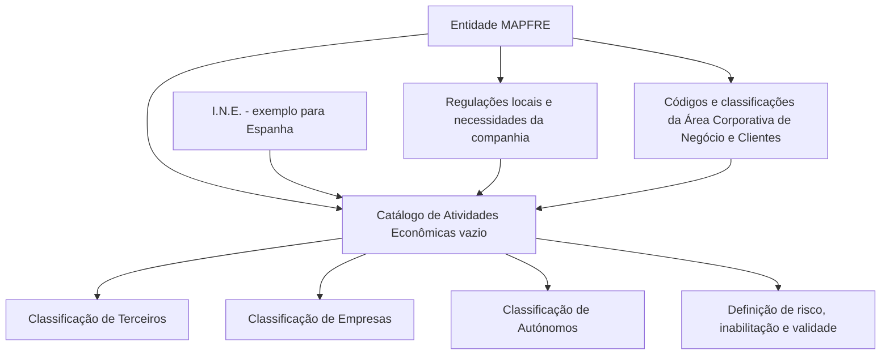
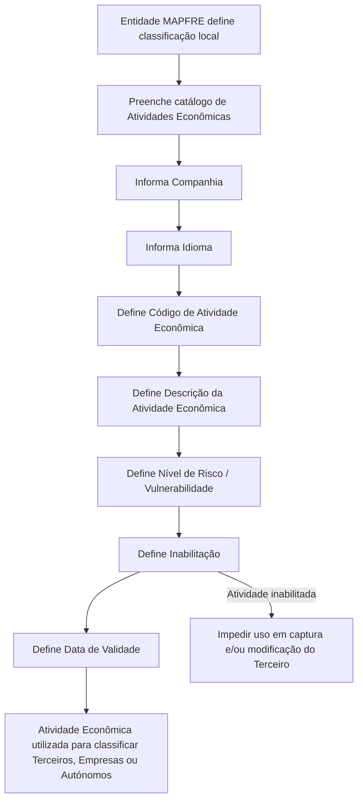

# Definição e Configuração de Atividades Econômicas no Reef.core para Entidades MAPFRE

## 1. Metadados do Documento
- **Arquivo de Origem:** Não identificado no conteúdo fornecido
- **Tipo de Documento:** Especificação Funcional
- **Domínio / Sistema:** Reef.core — cadastro e classificação de Atividades Econômicas de Terceiros
- **Público-Alvo:** Negócio, analistas funcionais, equipes de configuração e operação das entidades MAPFRE
- **Data/Versão Identificada:** Não identificada

---

## 2. Resumo Executivo & Contexto de Negócio

O documento define o uso de **Atividades Econômicas** no sistema **Reef.core**. Uma Atividade Econômica é apresentada como a ação realizada por uma pessoa, negócio, empresa ou estabelecimento para produzir bens e serviços.

No Reef.core, as Atividades Econômicas têm a finalidade de classificar **Terceiros, Empresas ou Autónomos** conforme o setor produtivo em que realizam suas atividades e conforme as subdivisões desses setores. A classificação permite agrupar unidades produtoras de acordo com a atividade exercida.

O Reef.core disponibiliza um catálogo específico de Atividades Econômicas. Esse catálogo é entregue vazio às entidades, cabendo a cada companhia MAPFRE preenchê-lo e configurá-lo de acordo com suas necessidades e com as regulações locais existentes.

O documento cita a Espanha como exemplo de referência local: informações disponibilizadas pelo **I.N.E.** podem ser utilizadas para a configuração correta da classificação. Como alternativa, a entidade MAPFRE pode utilizar códigos e classificações definidos pela Área Corporativa de Negócio e Clientes.

A configuração inclui propriedades gerais, propriedades operativas e outras propriedades. Entre os elementos funcionais mais relevantes estão o código e a descrição da Atividade Econômica, o idioma da definição, o nível de risco ou vulnerabilidade, a inabilitação e a data de validade.

---

## 3. Arquitetura, Componentes & Tecnologias Envolvidas

O conteúdo não descreve uma arquitetura técnica, integrações, APIs, bancos de dados, microsserviços, protocolos ou ambientes de execução. O documento descreve exclusivamente o comportamento funcional do catálogo de Atividades Econômicas dentro do Reef.core.

Os componentes e entidades explicitamente mencionados são:

| Componente / Entidade | Papel descrito |
| :--- | :--- |
| **Reef.core** | Sistema que permite identificar e codificar Atividades Econômicas em um catálogo específico. |
| **Catálogo de Atividades Econômicas** | Catálogo entregue sem conteúdo às entidades para preenchimento e configuração local. |
| **Entidade MAPFRE** | Responsável por definir uma classificação de Atividades Econômicas adequada às necessidades e regulações locais. |
| **Terceiro** | Entidade cuja Atividade Econômica pode ser utilizada em operações de captura e/ou modificação. |
| **Empresas** | Entidades classificadas conforme o setor produtivo em que realizam atividades. |
| **Autónomos** | Entidades classificadas conforme o setor produtivo em que realizam atividades. |
| **Pessoas Jurídicas** | Entidades para as quais a Data de Validade determina quando a Atividade Econômica se torna plenamente operativa. |
| **I.N.E.** | Fonte de informação mencionada como exemplo para a configuração em Espanha. |
| **Área Corporativa de Negócio e Clientes** | Área cujos códigos e classificações podem ser utilizados localmente pela entidade MAPFRE. |



> **Nota de Análise:** O documento não detalha métodos HTTP, contratos JSON, tecnologias de persistência, controles de acesso, integrações externas ou fluxos técnicos de implantação do Reef.core.

---

## 4. Regras de Negócio, Especificações Funcionais & Processos

### 4.1. Finalidade da classificação de Atividades Econômicas

1. Uma Atividade Econômica representa uma ação executada por uma pessoa, negócio, empresa ou estabelecimento para produzir bens e serviços.
2. O Reef.core utiliza as Atividades Econômicas para classificar Terceiros, Empresas ou Autónomos.
3. A classificação considera o setor produtivo no qual os Terceiros, Empresas ou Autónomos realizam suas atividades.
4. A classificação também considera as subdivisões dos setores produtivos.
5. A entidade MAPFRE deve considerar localmente uma classificação que permita classificar e agrupar unidades produtoras conforme a atividade exercida.
6. A classificação pode ser utilizada para a elaboração de estatísticas próprias da entidade MAPFRE.
7. A entidade MAPFRE pode utilizar códigos e classificações da Área Corporativa de Negócio e Clientes.
8. Na Espanha, o documento indica que informações fornecidas pelo I.N.E. poderiam ser utilizadas para a configuração adequada.

### 4.2. Configuração do catálogo de Atividades Econômicas

1. O Reef.core disponibiliza um catálogo de informação específico para identificar e codificar Atividades Econômicas.
2. O catálogo é entregue vazio de conteúdo para as entidades.
3. As companhias MAPFRE devem preencher e configurar o catálogo.
4. O preenchimento e a configuração devem considerar as necessidades da companhia MAPFRE.
5. O preenchimento e a configuração devem considerar as regulações locais existentes.

### 4.3. Propriedades gerais

#### Companhia
- A propriedade **Companhia** informa ao sistema o código da companhia sobre a qual está sendo realizada a definição da Atividade Econômica.

#### Idioma
- A propriedade **Idioma** informa o idioma utilizado na definição do Código da Atividade.
- O documento apresenta como exemplos de idioma: espanhol, inglês, turco e alemão.

#### Código de Atividade Econômica
- A propriedade **Código de Atividade Econômica** informa o código da Atividade Econômica.
- O código deve estar de acordo com o tipo de dado que o suporta na Base de Dados.

#### Descrição da Atividade Econômica
- A propriedade **Descrição da Atividade Econômica** informa a denominação ou descrição da Atividade Econômica que está sendo definida.
- Os exemplos fornecidos incluem:
  - `001 — Actividad Comercial`
  - `002 — Actividad Administraciones Públicas - AA.P`
  - `003 — Actividad Industrial`
  - `004 — Actividad Servicios`

### 4.4. Propriedades operativas

#### Nível de Risco / Vulnerabilidade
- O atributo **Nível de Risco / Vulnerabilidade** determina o fator do nível de risco associado à Atividade Econômica.
- O fator de risco deve ser utilizado nos diferentes processos do sistema.
- Em idioma espanhol, os valores possíveis indicados são:
  1. Sin Riesgo.
  2. Bajo.
  3. Medio.
  4. Alto.
  5. Crítico.

### 4.5. Outras propriedades

#### Inabilitação
- A propriedade **Inabilitação** informa ao sistema que a Atividade Econômica do Terceiro está inabilitada.
- Uma Atividade Econômica inabilitada não pode ser utilizada nas operações de captura e/ou modificação do Terceiro.

#### Data de Validade
- A propriedade **Data de Validade** informa a data a partir da qual a Atividade Econômica das Pessoas Jurídicas está plenamente operativa no sistema.
- O uso correto da Data de Validade permite manter um histórico das alterações realizadas nas definições das categorias.

### 4.6. Fluxo funcional de definição e utilização



### 4.7. Documentação vinculada

O documento recomenda a leitura de diretrizes e documentos funcionais relacionados para evitar que a interpretação isolada da especificação conduza a erro. A referência vinculada explicitamente mencionada é:

- **Actividades de Terceros**

---

## 5. Tabelas de Parâmetros, Ambientes e Estruturas de Dados

| Item / Parâmetro | Descrição / Função | Tipo / Valores / Formato | Ambiente / Observações |
| :--- | :--- | :--- | :--- |
| Companhia | Informa o código da companhia sobre a qual é realizada a definição da Atividade Econômica. | Código da companhia; formato não detalhado. | Aplicável à definição da Atividade Econômica. |
| Idioma | Informa o idioma empregado na definição do Código de Atividade. | Exemplos: espanhol, inglês, turco, alemão. | O documento menciona valores de risco em espanhol. |
| Código de Atividade Econômica | Identifica a Atividade Econômica configurada. | Deve seguir o tipo de dado que o sustenta na Base de Dados; formato não detalhado. | Exemplos documentados: `001`, `002`, `003`, `004`. |
| Descrição da Atividade Econômica | Informa a denominação ou descrição da Atividade Econômica. | Texto descritivo. | Exemplos: Actividad Comercial, Actividad Industrial e Actividad Servicios. |
| Nível de Risco / Vulnerabilidade | Determina o fator de nível de risco associado à Atividade Econômica para uso nos processos do sistema. | `Sin Riesgo`, `Bajo`, `Medio`, `Alto`, `Crítico`. | Valores informados para o idioma espanhol. |
| Inabilitação | Indica que a Atividade Econômica de um Terceiro não está apta para uso operacional. | Estado de inabilitação; valores/formato não detalhados. | Impede utilização em captura e/ou modificação do Terceiro. |
| Data de Validade | Indica a data a partir da qual a Atividade Econômica de Pessoas Jurídicas está plenamente operativa. | Data; formato não detalhado. | Permite histórico das alterações nas definições das categorias. |
| Catálogo de Atividades Econômicas | Catálogo específico para identificação e codificação de Atividades Econômicas. | Conteúdo configurável pela entidade. | É entregue vazio às entidades MAPFRE. |
| Classificação local | Classificação que permite agrupar unidades produtoras segundo a atividade exercida. | Códigos e classificações definidos localmente. | Deve atender necessidades e regulações locais; pode usar referências corporativas. |
| I.N.E. | Fonte de informação mencionada como exemplo para configuração em Espanha. | Não detalhado. | Referência aplicável ao exemplo espanhol. |
| Área Corporativa de Negócio e Clientes | Fonte alternativa de códigos e classificações. | Não detalhado. | Pode ser utilizada pela entidade MAPFRE. |

### Exemplos documentados de códigos e descrições

| Código de Atividade | Descrição |
| :--- | :--- |
| `001` | Actividad Comercial |
| `002` | Actividad Administraciones Públicas - AA.P |
| `003` | Actividad Industrial |
| `004` | Actividad Servicios |

### Valores documentados para Nível de Risco / Vulnerabilidade em espanhol

| Ordem | Valor |
| :--- | :--- |
| 1 | Sin Riesgo |
| 2 | Bajo |
| 3 | Medio |
| 4 | Alto |
| 5 | Crítico |

---

## 6. Bateria de Perguntas & Respostas para RAG (FAQ Sintético)

### P1: Qual é a finalidade das Atividades Econômicas no Reef.core?
**R:** As Atividades Econômicas no Reef.core são utilizadas para classificar Terceiros, Empresas ou Autónomos de acordo com o setor produtivo em que realizam suas atividades e com as subdivisões desses setores. A classificação permite agrupar unidades produtoras conforme a atividade exercida.

### P2: O catálogo de Atividades Econômicas já vem preenchido no Reef.core?
**R:** Não. O catálogo específico de Atividades Econômicas é entregue vazio de conteúdo às entidades. Cada companhia MAPFRE deve preenchê-lo e configurá-lo conforme suas necessidades e as regulações locais existentes.

### P3: Quais propriedades gerais devem ser consideradas na definição de uma Atividade Econômica?
**R:** O documento descreve quatro propriedades gerais: Companhia, que informa o código da companhia; Idioma, que informa o idioma usado na definição do código; Código de Atividade Econômica, que identifica a atividade conforme o tipo de dado suportado na Base de Dados; e Descrição da Atividade Econômica, que informa a denominação da atividade definida.

### P4: Como o Nível de Risco / Vulnerabilidade é utilizado?
**R:** O atributo Nível de Risco / Vulnerabilidade determina o fator de nível de risco associado à Atividade Econômica. Esse fator é utilizado nos diferentes processos do sistema. Para o idioma espanhol, os valores possíveis são Sin Riesgo, Bajo, Medio, Alto e Crítico.

### P5: O que acontece quando uma Atividade Econômica está inabilitada?
**R:** Quando a propriedade Inabilitação indica que uma Atividade Econômica do Terceiro está inabilitada, essa Atividade Econômica não pode ser utilizada nas operações de captura e/ou modificação do Terceiro.

### P6: Qual é a finalidade da Data de Validade da Atividade Econômica?
**R:** A Data de Validade informa a data a partir da qual a Atividade Econômica das Pessoas Jurídicas está plenamente operativa no sistema. O uso correto dessa propriedade permite manter um histórico das alterações feitas nas definições das categorias.

### P7: Quais referências podem ser utilizadas para configurar a classificação local de Atividades Econômicas?
**R:** A entidade MAPFRE deve contemplar uma classificação adequada às necessidades locais e às regulações existentes. O documento menciona que, em Espanha, poderiam ser utilizadas informações fornecidas pelo I.N.E. A entidade também pode utilizar os códigos e classificações da Área Corporativa de Negócio e Clientes.

### P8: Quais códigos de Atividade Econômica são apresentados como exemplos?
**R:** O documento apresenta os seguintes exemplos: `001 — Actividad Comercial`; `002 — Actividad Administraciones Públicas - AA.P`; `003 — Actividad Industrial`; e `004 — Actividad Servicios`.

### P9: A especificação informa o formato técnico do Código de Atividade Econômica?
**R:** Não detalha um formato técnico específico. O documento informa apenas que o Código de Atividade Econômica deve estar de acordo com o tipo de dado que o suporta na Base de Dados.

### P10: Para quais entidades a classificação de Atividades Econômicas é aplicável?
**R:** A classificação de Atividades Econômicas no Reef.core é aplicável a Terceiros, Empresas e Autónomos. O documento também menciona especificamente as Pessoas Jurídicas no contexto da Data de Validade.

### P11: Existe documentação funcional relacionada que deve ser consultada?
**R:** Sim. O documento recomenda a leitura de diretrizes e documentos funcionais relacionados para evitar interpretações incorretas decorrentes da leitura isolada. A referência explicitamente indicada é “Actividades de Terceros”.

---

## 7. Glossário de Termos, Siglas & Conceitos-Chave

- **Reef.core:** Sistema citado como responsável por identificar e codificar Atividades Econômicas em um catálogo específico.
- **Atividade Econômica:** Ação realizada por uma pessoa, negócio, empresa ou estabelecimento para produzir bens e serviços.
- **Terceiro:** Entidade classificada por meio da Atividade Econômica e sujeita a operações de captura e/ou modificação.
- **Autónomo:** Entidade mencionada como passível de classificação pelo setor produtivo em que realiza atividades.
- **Pessoa Jurídica:** Entidade para a qual a Data de Validade determina quando a Atividade Econômica está plenamente operativa no sistema.
- **Nível de Risco / Vulnerabilidade:** Atributo que determina o fator de risco associado a uma Atividade Econômica para utilização nos processos do sistema.
- **Inabilitação:** Propriedade que impede o uso de uma Atividade Econômica nas operações de captura e/ou modificação de um Terceiro.
- **Data de Validade:** Data a partir da qual uma Atividade Econômica de Pessoas Jurídicas se torna plenamente operativa no sistema.
- **I.N.E.:** Sigla mencionada como fonte de informação para configuração de Atividades Econômicas em Espanha; o significado por extenso não é informado no conteúdo.
- **AA.P:** Abreviação presente na descrição “Actividad Administraciones Públicas - AA.P”; o significado por extenso da sigla não é detalhado além da própria descrição.
- **Área Corporativa de Negócio e Clientes:** Área cujos códigos e classificações podem ser utilizados pela entidade MAPFRE.
- **MAPFRE:** Companhia ou entidade corporativa mencionada como responsável pelo preenchimento e configuração local do catálogo.

---

## 8. Notas Críticas, Riscos & Limitações

- O catálogo de Atividades Econômicas é entregue vazio, portanto a qualidade, completude e aderência regulatória da classificação dependem da configuração realizada pela entidade MAPFRE.
- O documento determina que as entidades devem considerar regulações locais existentes ao configurar o catálogo, mas não detalha quais regulações, países ou critérios regulatórios específicos devem ser aplicados.
- A interpretação isolada do documento pode conduzir a erro; o próprio conteúdo recomenda consultar diretrizes e documentos funcionais vinculados, especialmente “Actividades de Terceros”.
- O documento não especifica o formato, tamanho, obrigatoriedade ou regras de unicidade do Código de Atividade Econômica.
- O documento não detalha os valores técnicos, formato ou processo de alteração da propriedade Inabilitação.
- O documento não informa formato de data, comportamento para datas futuras ou históricas, nem tratamento de sobreposição de períodos para a Data de Validade.
- O documento lista valores de Nível de Risco / Vulnerabilidade em espanhol, mas não define equivalências para outros idiomas.
- O documento não apresenta detalhes técnicos sobre APIs, métodos HTTP, contratos JSON, persistência, auditoria, permissões, integrações ou arquitetura de infraestrutura.

---

## 9. Conteúdo Bruto Estruturado (Referência Fiel)

```text
--- [PÁGINA 1 DE 2] ---

DEFINICIÓN de las Actividades Económicas
Contexto
Una Actividad Económica es la acción realizada por una persona, negocio, empresa o establecimiento para producir bienes y servicios.
Las actividades económicas en Reef.core tienen por nalidad clasicar a los Terceros, Empresas o Autónomos, de acuerdo con el sector
productivo en el que realizan sus actividades y las subdivisiones de estas.
De esta manera y a modo de ejemplo en España se podría tomar la información proporcionada por el I.N.E. para su correcta conguración.
Objetivo
Funcionalmente, Reef.core cuenta con la posibilidad de identicar y codicar a las Actividades Económicas en un catálogo de información
especíco que se entrega a las entidades vacío de contenido para que las compañías MAPFRE lo cumplimenten y conguren de acuerdo con
sus necesidades y las regulaciones locales existentes.
Propiedades Generales
Compañía
Esta propiedad le indica al sistema el código de la compañía sobre la que se está realizando la denición.
Idioma
Esta propiedad le indica al sistema el Idioma empleado en la denición del Código de la Actividad como por ejemplo: español, inglés, turco,
alemán,...
Código de Actividad Económica
Esta propiedad indicará el código de la Actividad Económica de acuerdo con el tipo de Dato que lo sustenta en la Base de Datos.
Descripción de la Actividad Económica
Esta propiedad le indica al sistema la denominación o descripción de la Actividad Económica que se está deniendo.
A modo de ejemplo sus valores podrían ser:
Código ACTIVIDAD. Descripción
001 Actividad Comercial
Documentation / DOCUMENTACIÓN Reef
DOCUMENTACIÓN Reef
Mapfredocument
DOCUMENTACIÓN Reef
Owner
user:agonzalez_mapfre.com
Lifecycle
Approved Source
 / 
 VL
Buscar Inicio Soluciones Arquitecturas APIs Componentes Cloud Documentación Zeus Reef Ayuda
ES


--- [PÁGINA 2 DE 2] ---

Código ACTIVIDAD. Descripción
002 Actividad Administraciones Públicas - AA.P
003 Actividad Industrial
004 Actividad Servicios
... ...
Propiedades Operativas
Nivel de Riesgo / Vulnerabilidad
Este Atributo determinará el Factor del Nivel de Riesgo asociado a la actividad económica para su empleo en los diferentes procesos del
Sistema.
En idioma Español, sus posibles valores son:
Sin Riesgo.
Bajo.
Medio.
Alto.
Crítico.
Otras Propiedades
Inhabilitación
Esta propiedad le indica al Sistema que la Actividad Económica del Tercero está inhabilitada para poder ser utilizada en las operaciones de
captura y/o modicación del Tercero.
Fecha de Validez
Esta propiedad le indica al Sistema la fecha a partir de la cual la Actividad Económica de las Personas Jurídicas está plenamente operativa
en el sistema por lo que su correcto uso permite tener un histórico de los cambios efectuados en las deniciones de los categorías.
Vínculos
Relación de Directrices y Documentos funcionales cuya lectura recomendada para evitar que la interpretación aislada del presente
documento pueda conducir a error.
Actividades de Terceros
Preguntas frecuentes
(1) ¿Existe alguna recomendación operativa que deba ser tomada en consideración localmente en la codicación, uso y denición de las
Actividades Económicas de los Terceros en el Sistema?
Localmente, la entidad MAPFRE deberá contemplar una Clasicación de Actividades Económicas que permita la clasicación y agrupación
de las unidades productoras según la actividad que ejerzan, de cara a la elaboración de sus propias estadísticas o bien utilizar los códigos y
Clasicaciones del Área Corporativa de Negocio y Clientes.
```
