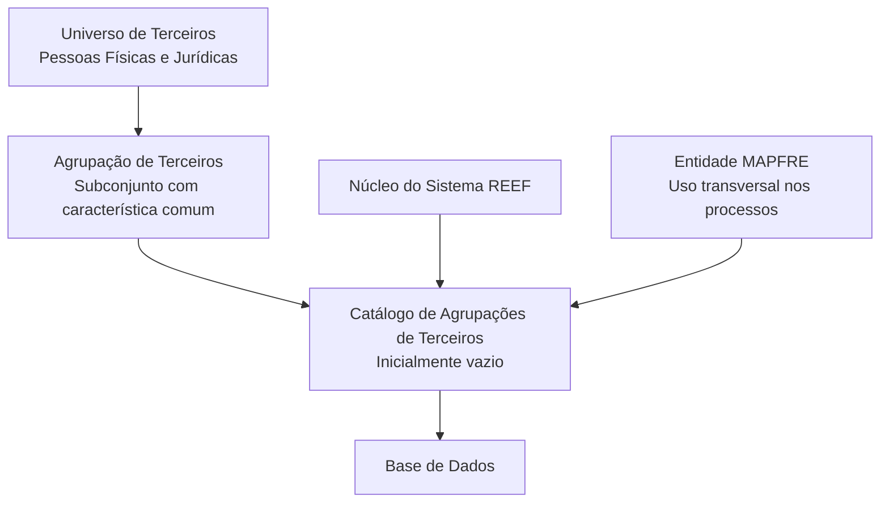

# Definição de Agrupações de Terceiros no Sistema REEF

## 1. Metadados do Documento
- **Arquivo de Origem:** Não identificado no conteúdo fornecido
- **Tipo de Documento:** Especificação Funcional
- **Domínio / Sistema:** REEF / Gestão de Terceiros / MAPFRE
- **Público-Alvo:** Negócio, equipes funcionais e equipes responsáveis pela parametrização do sistema
- **Data/Versão Identificada:** Não identificada

---

## 2. Resumo Executivo & Contexto de Negócio

O documento define o conceito de **Agrupações de Terceiros** no sistema REEF. Uma Agrupação de Terceiros representa um subconjunto do Universo de Terceiros cujos integrantes compartilham pelo menos uma característica comum. Os terceiros podem ser Pessoas Físicas ou Pessoas Jurídicas.

O núcleo do sistema permite identificar e codificar possíveis agrupações em um catálogo de informações. Esse catálogo é entregue inicialmente vazio às entidades, que devem definir seu conteúdo segundo suas necessidades operacionais e de negócio.

A definição de uma Agrupação de Terceiros é sustentada por propriedades que identificam a companhia, a atividade associada, o código de agrupação, a descrição completa e a descrição abreviada. O código de agrupação deve estar alinhado ao tipo de dado que sustentará a informação na Base de Dados.

O documento não estabelece uma codificação obrigatória ou uma recomendação operacional padronizada para as agrupações. Contudo, indica que cada entidade MAPFRE deve avaliar a conveniência de utilizar transversalmente o catálogo nos processos corporativos, permitindo a correta definição e a posterior exploração das informações.

Como documentação relacionada, o documento recomenda a leitura de materiais sobre Atividades de Terceiros, Categorias de Terceiros e Classificação de Terceiros, pois a interpretação isolada da definição de agrupações pode conduzir a erros.

---

## 3. Arquitetura, Componentes & Tecnologias Envolvidas

Os elementos identificados no conteúdo são:

- **Sistema REEF:** Sistema no qual são definidas, identificadas e codificadas as Agrupações de Terceiros.
- **Núcleo do Sistema:** Componente funcional que disponibiliza o catálogo para identificação e codificação das agrupações.
- **Catálogo de Agrupações de Terceiros:** Repositório de informações entregue inicialmente vazio às entidades.
- **Base de Dados:** Estrutura de persistência que sustenta o código da Agrupação do Terceiro conforme o tipo de dado definido.
- **Entidade MAPFRE:** Responsável por analisar a conveniência de utilizar o catálogo transversalmente nos processos da companhia.
- **Universo de Terceiros:** Conjunto de terceiros, Pessoas Físicas ou Jurídicas, do qual são definidos subconjuntos de agrupação.



> **Nota de Análise:** O conteúdo não descreve tecnologias de implementação, interfaces, APIs, métodos HTTP, contratos JSON, servidores, URLs de ambientes ou integrações entre microsserviços.

---

## 4. Regras de Negócio, Especificações Funcionais & Processos

### 4.1 Definição funcional de Agrupação de Terceiros

1. Uma Agrupação de Terceiros é um subconjunto do Universo de Terceiros.
2. Os terceiros pertencentes ao mesmo agrupamento devem compartilhar pelo menos uma característica.
3. Os terceiros podem ser Pessoas Físicas ou Pessoas Jurídicas.
4. O sistema disponibiliza capacidade de identificar e codificar as possíveis Agrupações de Terceiros.
5. As agrupações são mantidas em um catálogo de informações.
6. O catálogo é entregue inicialmente sem conteúdo para as entidades.
7. A entidade deve definir o conteúdo do catálogo conforme sua necessidade de negócio e operação.

### 4.2 Propriedades da definição de agrupação

A definição de uma Agrupação de Terceiros requer as seguintes propriedades:

1. **Companhia:** informa o código da companhia para a qual está sendo realizada a definição da Agrupação do Terceiro.
2. **Código de Atividade do Terceiro:** identifica o código da Atividade do Terceiro associada à Agrupação de Terceiros em definição.
3. **Código de Agrupação do Terceiro:** identifica o código da agrupação conforme o tipo de dado que sustentará a informação na Base de Dados.
4. **Descrição da Agrupação do Terceiro:** informa a denominação ou descrição completa da agrupação.
5. **Descrição Abreviada da Agrupação do Terceiro:** informa a denominação ou descrição abreviada da agrupação.

### 4.3 Diretriz sobre codificação e uso do catálogo

- Não existe preferência ou recomendação para estabelecer ou padronizar a codificação das Agrupações de Terceiros no sistema.
- A entidade MAPFRE deve analisar a conveniência de utilizar transversalmente o catálogo de agrupações nos processos da companhia.
- O uso transversal do catálogo busca permitir a correta definição das agrupações e sua posterior exploração.

### 4.4 Documentação funcional relacionada

A leitura dos documentos abaixo é recomendada para evitar interpretações incorretas decorrentes da análise isolada deste documento:

- Atividades de Terceiros
- Categorias de Terceiros
- Classificação de Terceiros

### 4.5 Exemplo funcional apresentado

Para a atividade **“1 - Asegurados”**, o documento apresenta os seguintes exemplos de agrupações:

- Código `01`: Clientes Banco SANTANDER, abreviatura `BAN.SAN.`
- Código `02`: Clientes BancaSeguros, abreviatura `BAN.SEG.`
- Código `03`: Clientes Mutualidad Médica, abreviatura `MUT.MED.`

---

## 5. Tabelas de Parâmetros, Ambientes e Estruturas de Dados

| Item / Parâmetro | Descrição / Função | Tipo / Valores / Formato | Ambiente / Observações |
| :--- | :--- | :--- | :--- |
| Companhia | Indica o código da companhia sobre a qual a Agrupação do Terceiro está sendo definida. | Código de companhia | Não foram informados valores ou formato. |
| Código de Atividade do Terceiro | Indica o código da Atividade do Terceiro associada à Agrupação de Terceiros. | Código de atividade | O exemplo menciona a atividade `1 - Asegurados`. |
| Código de Agrupação do Terceiro | Indica o código da Agrupação do Terceiro. | Código sustentado pelo tipo de dado da Base de Dados | O documento não define padrão obrigatório de codificação. |
| Descrição da Agrupação do Terceiro | Registra a denominação ou descrição completa da agrupação. | Texto descritivo | Não foi informado tamanho, obrigatoriedade ou formato. |
| Descrição Abreviada da Agrupação do Terceiro | Registra a denominação ou descrição abreviada da agrupação. | Texto abreviado | Não foi informado tamanho, obrigatoriedade ou formato. |
| Catálogo de Agrupações de Terceiros | Catálogo no qual as entidades identificam e codificam possíveis agrupações. | Catálogo de informação | Entregue inicialmente vazio de conteúdo. |
| Base de Dados | Estrutura que sustenta a informação associada ao Código de Agrupação do Terceiro. | Persistência de dados | Não foram detalhados modelo de dados, tabela ou tecnologia. |

### Exemplos de agrupações para a atividade `1 - Asegurados`

| Código da Agrupação | Descrição | Abreviatura | Atividade Associada |
| :--- | :--- | :--- | :--- |
| `01` | Clientes Banco SANTANDER | `BAN.SAN.` | `1 - Asegurados` |
| `02` | Clientes BancaSeguros | `BAN.SEG.` | `1 - Asegurados` |
| `03` | Clientes Mutualidad Médica | `MUT.MED.` | `1 - Asegurados` |

### Ambientes, servidores e rotas

| Item / Parâmetro | Descrição / Função | Tipo / Valores / Formato | Ambiente / Observações |
| :--- | :--- | :--- | :--- |
| Ambientes | Não identificados no conteúdo. | Não informado | O documento não apresenta URLs, hosts, portas ou servidores. |
| Logs | Não identificados no conteúdo. | Não informado | O documento não apresenta rotas, níveis ou parâmetros de log. |
| APIs e integrações | Não identificadas no conteúdo. | Não informado | O documento não detalha contratos, endpoints ou protocolos. |

---

## 6. Bateria de Perguntas & Respostas para RAG (FAQ Sintético)

### P1: O que é uma Agrupação de Terceiros no sistema REEF?
**R:** Uma Agrupação de Terceiros é um subconjunto do Universo de Terceiros cujos membros compartilham ao menos uma característica. Os terceiros podem ser Pessoas Físicas ou Pessoas Jurídicas.

### P2: Qual é a finalidade do catálogo de Agrupações de Terceiros?
**R:** O catálogo permite que as entidades identifiquem e codifiquem possíveis Agrupações de Terceiros no sistema. O catálogo é entregue inicialmente vazio de conteúdo e deve ser definido pela entidade conforme sua necessidade.

### P3: O sistema REEF impõe um padrão de codificação para Agrupações de Terceiros?
**R:** Não. O documento informa expressamente que não existe preferência nem recomendação para estabelecer ou padronizar a codificação das Agrupações de Terceiros no sistema.

### P4: Quais propriedades devem ser consideradas na definição de uma Agrupação de Terceiros?
**R:** O documento identifica cinco propriedades: Companhia, Código de Atividade do Terceiro, Código de Agrupação do Terceiro, Descrição da Agrupação do Terceiro e Descrição Abreviada da Agrupação do Terceiro.

### P5: Qual é a função do campo Companhia na definição de uma agrupação?
**R:** A propriedade Companhia informa ao sistema o código da companhia para a qual está sendo realizada a definição da Agrupação do Terceiro.

### P6: Como o Código de Atividade do Terceiro é utilizado?
**R:** O Código de Atividade do Terceiro identifica a atividade associada à Agrupação de Terceiros que está sendo definida. O documento apresenta como exemplo a atividade `1 - Asegurados`.

### P7: O que determina o Código de Agrupação do Terceiro?
**R:** O Código de Agrupação do Terceiro representa o código da agrupação de acordo com o tipo de dado que sustentará a informação na Base de Dados.

### P8: Quais exemplos de agrupação são apresentados para a atividade “1 - Asegurados”?
**R:** São apresentados três exemplos: `01 - Clientes Banco SANTANDER - BAN.SAN.`, `02 - Clientes BancaSeguros - BAN.SEG.` e `03 - Clientes Mutualidad Médica - MUT.MED.`.

### P9: Qual orientação é fornecida à entidade MAPFRE sobre o uso do catálogo?
**R:** A entidade MAPFRE deve analisar a conveniência de utilizar transversalmente o catálogo de Agrupações de Terceiros nos processos da companhia, permitindo sua correta definição e posterior exploração.

### P10: Quais documentos devem ser lidos em conjunto com a definição de Agrupações de Terceiros?
**R:** O documento recomenda a leitura de Atividades de Terceiros, Categorias de Terceiros e Classificação de Terceiros, pois a interpretação isolada da definição de agrupações pode conduzir a erro.

### P11: O documento especifica APIs, endpoints ou contratos de integração para Agrupações de Terceiros?
**R:** Não. O conteúdo fornecido não detalha APIs, métodos HTTP, endpoints, contratos JSON, tecnologias de integração ou fluxos entre sistemas.

### P12: O documento informa quais campos são obrigatórios ou quais validações devem ser aplicadas?
**R:** Não. Embora descreva as propriedades funcionais da agrupação, o documento não informa obrigatoriedade, tamanhos de campo, regras de validação, mensagens de erro ou restrições de preenchimento.

---

## 7. Glossário de Termos, Siglas & Conceitos-Chave

- **Agrupação de Terceiros:** Subconjunto do Universo de Terceiros que compartilha pelo menos uma característica.
- **Base de Dados:** Estrutura que sustenta a informação associada ao Código de Agrupação do Terceiro.
- **Catálogo de Informação:** Repositório no qual são identificadas e codificadas as possíveis Agrupações de Terceiros.
- **Código de Agrupação do Terceiro:** Código atribuído à agrupação de acordo com o tipo de dado que sustentará a informação na Base de Dados.
- **Código de Atividade do Terceiro:** Código da atividade associada à Agrupação de Terceiros.
- **Companhia:** Código da companhia sobre a qual é realizada a definição da Agrupação do Terceiro.
- **MAPFRE:** Entidade mencionada como responsável por avaliar o uso transversal do catálogo nos processos da companhia.
- **Pessoa Física:** Tipo de terceiro citado como possível integrante de uma Agrupação de Terceiros.
- **Pessoa Jurídica:** Tipo de terceiro citado como possível integrante de uma Agrupação de Terceiros.
- **REEF:** Nome do contexto documental e do sistema mencionado no conteúdo fornecido.
- **Universo de Terceiros:** Conjunto de terceiros a partir do qual são definidos subconjuntos denominados Agrupações de Terceiros.

---

## 8. Notas Críticas, Riscos & Limitações

- O documento não define uma convenção corporativa obrigatória para a codificação das Agrupações de Terceiros. Essa ausência pode resultar em códigos heterogêneos entre entidades ou processos, caso não haja governança complementar.
- O catálogo é entregue inicialmente vazio, exigindo definição e manutenção de conteúdo pela entidade responsável.
- O documento recomenda a leitura conjunta de Atividades de Terceiros, Categorias de Terceiros e Classificação de Terceiros. A interpretação isolada pode causar erro funcional.
- Não foram identificados detalhes sobre obrigatoriedade dos campos, validações, tamanhos, formatos, regras de unicidade ou comportamento diante de duplicidades.
- Não foram identificados detalhes técnicos sobre modelo físico de Base de Dados, integrações, APIs, ambientes, rotas de logs, autenticação ou autorização.
- O texto extraído apresenta caracteres potencialmente corrompidos por extração documental, como `denición`, `codicar` e `Clasicación`. Esses trechos foram preservados na referência fiel para auditoria.

---

## 9. Conteúdo Bruto Estruturado (Referência Fiel)

```text
--- [PÁGINA 1 DE 2] ---

DEFINICIÓN de las Agrupaciones de Terceros
Propiedades Generales
Se entiende por Agrupación de Terceros a los Subconjuntos del Universo de Terceros que comparten al menos una característica entre ellos.
Funcionalmente, el núcleo del Sistema cuenta con la posibilidad de identicar y codicar las posibles Agrupaciones de los Terceros, sean
estos Personas Físicas o Jurídicas, en un catálogo de información que se entrega a las entidades inicialmente vacío de contenido.
Compañía
Esta propiedad le indica al sistema el código de la compañía sobre la que se está realizando la denición de la Agrupación del Tercero.
Código de Actividad del Tercero
Esta propiedad indica en el sistema el código de la Actividad del Tercero asociada a la Agrupación de Terceros que se está deniendo.
Código de Agrupación del Tercero
Esta propiedad indicará en el sistema el código de la Agrupación del Tercero de acuerdo al tipo de dato que sustentará la información en la
Base de Datos.
Descripción de la Agrupación del Tercero
Esta propiedad le indica al sistema cual es la denominación o descripción de la Agrupación del Tercero.
Descripción Abreviada de la Agrupación del Tercero
Esta propiedad le indica al sistema cual es la denominación o descripción abreviada de la Agrupación del Tercero.
A modo de ejemplo y para la actividad '1 - Asegurados
AGRUPACIÓN DESCRIPCIÓN ABREVIATURA
01 Clientes Banco SANTANDER BAN.SAN.
02 Clientes BancaSeguros BAN.SEG.
03 Clientes Mutualidad Médica MUT.MED.
Vínculos
Documentation / DOCUMENTACIÓN Reef
DOCUMENTACIÓN Reef
Mapfredocument
DOCUMENTACIÓN Reef
Owner
user:agonzalez_mapfre.com
Lifecycle
Approved Source
 /
 VL
Buscar Inicio Soluciones Arquitecturas APIs Componentes Cloud Documentación Zeus Reef Ayuda
ES


--- [PÁGINA 2 DE 2] ---

Relación de Directrices y Documentos funcionales cuya lectura recomendada para evitar que la interpretación aislada del presente
documento pueda conducir a error.
Actividades de Terceros
Categorías de Terceros
Clasicación de Terceros
Preguntas frecuentes
(1) ¿Existe alguna recomendación operativa que deba ser tomada en consideración localmente en la codicación, uso y denición de la tabla
de Agrupamientos de Terceros en el Sistema?
No existe una preferencia ni recomendación para establecer o estandarizar la codicación de las Agrupaciones de los Terceros en el sistema,
si bien la entidad MAPFRE debe analizar la conveniencia de utilizar transversalmente en los procesos de la compañía este catálogo de
información para su correcta denición permitiendo así su posterior explotación.
```
