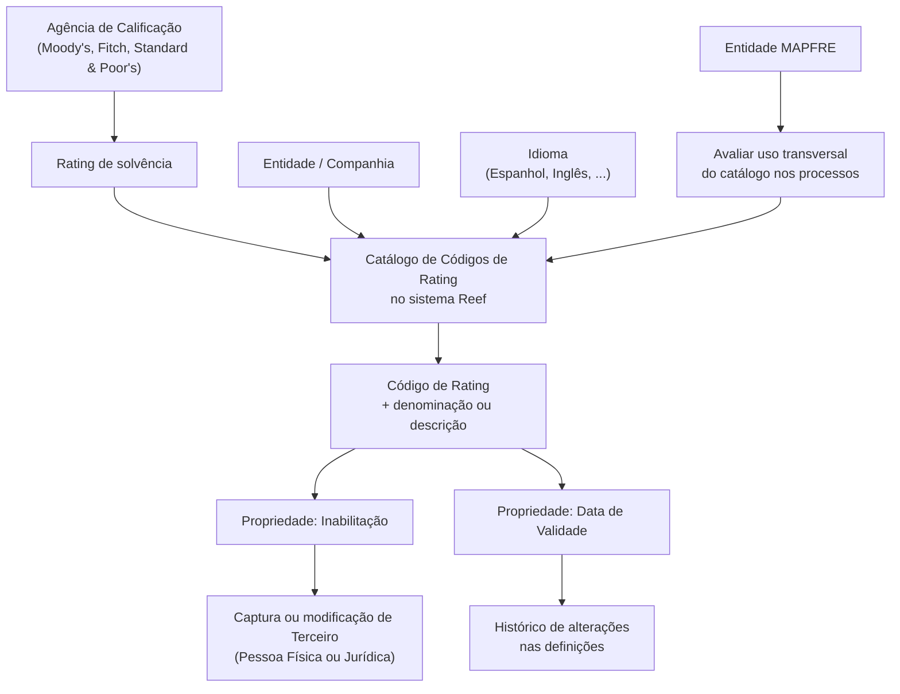

# Definição dos Códigos de Calificação (Rating) no Sistema Reef

## 1. Metadados do Documento
- **Arquivo de Origem:** `Não identificado no conteúdo fornecido`
- **Tipo de Documento:** `Especificação Funcional`
- **Domínio / Sistema:** `Reef / Atividades de Terceiros / Catálogo de Códigos de Rating`
- **Público-Alvo:** `Não identificado explicitamente`
- **Data/Versão Identificada:** `Não identificada`

---

## 2. Resumo Executivo & Contexto de Negócio

O documento define o uso de **Códigos de Calificação (Ratings)** no sistema Reef. Um rating representa a qualificação de solvência de uma empresa ou país para cumprir obrigações financeiras. A classificação é atribuída por uma agência especializada, com exemplos citados de Moody's, Fitch e Standard & Poor's.

O núcleo do sistema Reef disponibiliza um catálogo específico para identificar e codificar Códigos de Rating. O catálogo é inicialmente entregue às entidades sem conteúdo pré-carregado, de modo que cada entidade deve definir os códigos de acordo com suas necessidades de uso e exploração posterior.

A gestão dos Códigos de Rating ocorre por companhia e por idioma, incluindo Espanhol e Inglês como exemplos mencionados. Cada código pode ser individualmente identificado por uma denominação ou texto descritivo, como códigos associados a classificações de grau de investimento ou grau especulativo.

O documento também estabelece propriedades operacionais para os códigos, incluindo a possibilidade de inabilitação e uma data de validade. Essas propriedades permitem controlar se um código pode ser utilizado nas operações de captura ou modificação de terceiros e manter histórico de alterações nas definições.

Embora o uso de ratings seja mais comum para Pessoas Jurídicas, o sistema também permite o uso para Pessoas Físicas, especialmente no caso de Trabalhadores Autónomos. Não há uma recomendação obrigatória de padronização da codificação; contudo, a entidade MAPFRE deve avaliar a conveniência de utilizar o catálogo de forma transversal em seus processos.

---

## 3. Arquitetura, Componentes & Tecnologias Envolvidas

| Componente / Conceito | Descrição |
| :--- | :--- |
| Sistema Reef | Sistema cujo núcleo possui funcionalidade para identificar e codificar Códigos de Rating em catálogo específico. |
| Catálogo de Códigos de Rating | Catálogo de informação entregue inicialmente vazio às entidades para manutenção dos códigos de rating. |
| Entidade / Companhia | Unidade que define e codifica os Códigos de Rating no sistema. |
| Idioma | Contexto de codificação dos códigos por idioma, com exemplos de Espanhol e Inglês. |
| Terceiro | Pessoa Física ou Jurídica cuja captura ou modificação pode utilizar Códigos de Rating habilitados. |
| Agência de Calificação | Agência especializada que atribui ratings de solvência; são citadas Moody's, Fitch e Standard & Poor's. |
| MAPFRE | Entidade mencionada como responsável por analisar a conveniência de uso transversal do catálogo nos processos da companhia. |
| Documentação Reef | Repositório ou contexto de documentação associado ao conteúdo. |
| Atividades de Terceiros | Documento funcional relacionado cuja leitura é recomendada para evitar interpretação isolada incorreta. |



> **Nota de Análise:** O documento descreve o catálogo funcional de Códigos de Rating, mas não detalha arquitetura técnica de implantação, APIs, métodos HTTP, contratos JSON, bancos de dados, integrações sistêmicas, servidores ou ambientes.

---

## 4. Regras de Negócio, Especificações Funcionais & Processos

### 4.1 Definição funcional de Rating

1. O **Rating** é a qualificação de solvência de uma empresa ou de um país para cumprir obrigações financeiras.
2. A classificação é atribuída por uma agência especializada, conhecida como agência de calificação.
3. São citados como exemplos de agências especializadas:
   - Moody's;
   - Fitch;
   - Standard & Poor's.

### 4.2 Catálogo de Códigos de Rating

1. O núcleo do sistema permite identificar e codificar Códigos de Rating.
2. Os Códigos de Rating são mantidos em um catálogo de informação específico.
3. O catálogo é entregue inicialmente às entidades sem conteúdo.
4. A codificação é realizada:
   - no nível de companhia;
   - por idioma;
   - identificando individualmente cada código;
   - utilizando uma denominação ou um texto descritivo.

### 4.3 Identificação individual dos códigos

Cada Código de Rating deve possuir uma identificação individual por código e descrição. O documento apresenta os seguintes exemplos:

| Código de Rating | Descrição |
| :--- | :--- |
| 001 | Grado Inversión Baa2 |
| 002 | Grado Inversión Baa3 |
| 003 | Grado Especulativo Ba1 |

> **Nota de Análise:** O documento apresenta exemplos de códigos e descrições, mas não estabelece que os valores `001`, `002` e `003` sejam obrigatórios, exclusivos ou um padrão corporativo obrigatório.

### 4.4 Regra de inabilitação

A propriedade de **Inabilitação** informa ao sistema se o Código de Rating está inabilitado para uso em operações de:

1. captura de Terceiro;
2. modificação de Terceiro.

A regra se aplica a Terceiros que sejam:

- Pessoa Física;
- Pessoa Jurídica.

Quando um Código de Rating estiver inabilitado, ele não pode ser empregado nessas operações de captura e/ou modificação.

### 4.5 Regra de data de validade

A propriedade **Fecha de Validez** indica a data a partir da qual um Código de Rating está plenamente operativo no sistema.

O uso correto da data de validade permite manter histórico das alterações efetuadas nas definições. O texto menciona “definições de cargos”, embora o restante do conteúdo trate de definições de Códigos de Rating.

> **Nota de Análise:** O documento não detalha o formato da data, a regra de expiração, o comportamento antes da data de validade, nem o mecanismo técnico de manutenção do histórico.

### 4.6 Uso para Pessoas Jurídicas e Pessoas Físicas

1. O uso de classificações de rating é mais comum para Pessoas Jurídicas.
2. O sistema não exclui a utilização de Códigos de Rating para Pessoas Físicas.
3. A utilização em Pessoas Físicas ocorre usualmente quando essas pessoas são Trabalhadores Autónomos.

### 4.7 Diretriz de padronização e codificação

1. Não existe preferência ou recomendação obrigatória para estabelecer ou padronizar a codificação no sistema.
2. A entidade MAPFRE deve analisar a conveniência de utilizar transversalmente esse catálogo de informação nos processos da companhia.
3. A finalidade da utilização transversal é permitir correta exploração posterior das informações.

### 4.8 Exemplos de agrupamento de códigos

O documento apresenta como exemplos de estratégia de organização:

1. Agrupar e codificar os códigos das diferentes Agências de Rating que serão utilizadas nos processos da entidade.
2. Agrupar e codificar os códigos por faixas numéricas.

Exemplo de faixas apresentado:

| Faixa de códigos | Agência de Rating associada no exemplo |
| :--- | :--- |
| 000 a 99 | Moody's |
| 200 a 299 | Fitch |

> **Nota de Análise:** As faixas numéricas para Moody's e Fitch são exemplos de organização. O documento não determina a obrigatoriedade dessas faixas nem define faixas para Standard & Poor's ou outras agências.

### 4.9 Documentação funcional relacionada

A leitura de documentos funcionais relacionados é recomendada para evitar que a interpretação isolada deste documento conduza a erro. O documento relacionado citado é:

- **Atividades de Terceiros**

---

## 5. Tabelas de Parâmetros, Ambientes e Estruturas de Dados

### 5.1 Estrutura funcional do Código de Rating

| Item / Parâmetro | Descrição / Função | Tipo / Valores / Formato | Ambiente / Observações |
| :--- | :--- | :--- | :--- |
| Código de Rating | Identifica individualmente uma classificação no catálogo. | Exemplos: `001`, `002`, `003`. | A estrutura exata, tamanho e regras de unicidade não são detalhados. |
| Descrição / Denominação | Texto descritivo do Código de Rating. | Exemplos: `Grado Inversión Baa2`, `Grado Inversión Baa3`, `Grado Especulativo Ba1`. | Codificação por companhia e por idioma. |
| Companhia | Contexto organizacional para codificação dos Códigos de Rating. | Não especificado. | O sistema permite codificação no nível de companhia. |
| Idioma | Contexto linguístico para identificação e descrição dos códigos. | Exemplos: Espanhol, Inglês. | Outros idiomas são sugeridos pela expressão “...”, mas não são enumerados. |
| Inabilitação | Indica se um Código de Rating está impedido de uso operacional. | Habilitado ou inabilitado; valores técnicos não especificados. | Afeta captura e/ou modificação de Terceiros Pessoa Física ou Pessoa Jurídica. |
| Data de Validade | Indica a partir de quando o Código de Rating está plenamente operativo. | Formato não especificado. | Permite histórico de alterações nas definições. |
| Terceiro | Entidade sujeita a captura ou modificação com uso de Códigos de Rating. | Pessoa Física ou Pessoa Jurídica. | O uso é mais usual em Pessoas Jurídicas; também permitido para Pessoas Físicas, especialmente Trabalhadores Autónomos. |

### 5.2 Agências de Rating citadas

| Item / Parâmetro | Descrição / Função | Tipo / Valores / Formato | Ambiente / Observações |
| :--- | :--- | :--- | :--- |
| Moody's | Exemplo de agência especializada que atribui ratings. | Agência de Calificação. | Exemplo de faixa de codificação: `000` a `99`. |
| Fitch | Exemplo de agência especializada que atribui ratings. | Agência de Calificação. | Exemplo de faixa de codificação: `200` a `299`. |
| Standard & Poor's | Exemplo de agência especializada que atribui ratings. | Agência de Calificação. | Não há faixa de códigos ou regras adicionais detalhadas. |

### 5.3 Informações de documentação e governança

| Item / Parâmetro | Descrição / Função | Tipo / Valores / Formato | Ambiente / Observações |
| :--- | :--- | :--- | :--- |
| Owner | Proprietário indicado no conteúdo. | `user:agonzalez_mapfre.com` | Valor preservado conforme extração original. |
| Lifecycle | Estado do ciclo de vida do documento. | `Approved` | Não há detalhamento sobre o processo de aprovação. |
| Source | Campo de origem apresentado na navegação documental. | `VL` | Significado de `VL` não é explicado. |
| Documentação Reef | Contexto documental citado. | `DOCUMENTACIÓN Reef` | Repetido no conteúdo bruto. |
| Mapfredocument | Texto apresentado na área de vínculos. | `Mapfredocument` | Sem detalhamento adicional. |

### 5.4 Ambientes, rotas e URLs

| Item / Parâmetro | Descrição / Função | Tipo / Valores / Formato | Ambiente / Observações |
| :--- | :--- | :--- | :--- |
| Ambientes | Não identificados. | Não aplicável. | O documento não fornece ambientes, URLs, hosts, portas ou servidores. |
| Rotas de logs | Não identificadas. | Não aplicável. | O documento não fornece caminhos de logs ou parâmetros de observabilidade. |
| APIs e integrações | Não identificadas. | Não aplicável. | O documento não informa endpoints, protocolos, contratos ou métodos de integração. |

---

## 6. Bateria de Perguntas & Respostas para RAG (FAQ Sintético)

### P1: O que é um Código de Rating no sistema Reef?
**R:** Um Código de Rating é um elemento de catálogo utilizado pelo sistema Reef para identificar e codificar uma classificação de solvência. O rating representa a capacidade de uma empresa ou país de cumprir obrigações financeiras e pode estar associado a classificações atribuídas por agências especializadas, como Moody's, Fitch e Standard & Poor's.

### P2: O catálogo de Códigos de Rating já vem preenchido para as entidades?
**R:** Não. O documento informa que o catálogo específico de Códigos de Rating é entregue inicialmente às entidades vazio de conteúdo. Cada entidade deve definir os códigos que utilizará conforme seus processos e necessidades de exploração da informação.

### P3: Como os Códigos de Rating podem ser identificados no catálogo?
**R:** Os Códigos de Rating podem ser codificados por companhia e por idioma. Cada código deve ser individualmente identificado por uma denominação ou texto descritivo. O documento apresenta como exemplos os códigos `001`, `002` e `003`, com descrições como `Grado Inversión Baa2`, `Grado Inversión Baa3` e `Grado Especulativo Ba1`.

### P4: O que acontece quando um Código de Rating está inabilitado?
**R:** Quando um Código de Rating está inabilitado, ele não pode ser empregado nas operações de captura e/ou modificação de Terceiros. Essa restrição se aplica tanto a Terceiros Pessoa Física quanto a Terceiros Pessoa Jurídica.

### P5: Qual é a finalidade da data de validade de um Código de Rating?
**R:** A data de validade indica a partir de qual data o Código de Rating está plenamente operativo no sistema. O uso correto dessa propriedade permite manter histórico das alterações realizadas nas definições. O documento não especifica formato de data, regras de expiração ou comportamento anterior à data de validade.

### P6: Os Códigos de Rating podem ser usados para Pessoas Físicas?
**R:** Sim. Embora o uso de ratings seja mais usual para Pessoas Jurídicas, o sistema não exclui sua utilização para Pessoas Físicas. O documento menciona que esse uso ocorre usualmente quando a Pessoa Física é um Trabalhador Autónomo.

### P7: Existe uma regra obrigatória para padronizar a codificação dos ratings no sistema?
**R:** Não. O documento afirma que não existe preferência nem recomendação para estabelecer ou padronizar a codificação no sistema. A entidade MAPFRE deve analisar a conveniência de utilizar o catálogo transversalmente em seus processos para permitir correta exploração posterior das informações.

### P8: Como a entidade pode organizar os códigos de diferentes agências de rating?
**R:** O documento sugere como exemplos agrupar e codificar os códigos das diferentes Agências de Rating utilizadas nos processos da entidade ou agrupá-los por faixas numéricas. Como exemplo, apresenta a faixa de `000` a `99` para códigos de Moody's e a faixa de `200` a `299` para códigos de Fitch.

### P9: As faixas de códigos de Moody's e Fitch são obrigatórias?
**R:** Não há indicação de obrigatoriedade. As faixas de `000` a `99` para Moody's e de `200` a `299` para Fitch são apresentadas como exemplos de agrupamento e codificação. O documento não estabelece essas faixas como padrão mandatório.

### P10: Quais agências de calificação são citadas no documento?
**R:** O documento cita Moody's, Fitch e Standard & Poor's como exemplos de agências especializadas que atribuem ratings de solvência a empresas ou países.

### P11: Há informações sobre APIs, contratos JSON, bancos de dados ou métodos HTTP do catálogo de Rating?
**R:** Não. O conteúdo fornecido é funcional e não detalha APIs, endpoints, métodos HTTP, contratos JSON, estruturas de banco de dados, servidores, URLs, portas ou mecanismos técnicos de integração.

### P12: Que documentação relacionada deve ser consultada para evitar interpretação isolada incorreta?
**R:** O documento recomenda consultar a documentação funcional relacionada de **Atividades de Terceiros**, pois a interpretação isolada do documento de Códigos de Rating pode conduzir a erro.

---

## 7. Glossário de Termos, Siglas & Conceitos-Chave

- **Agência de Calificação:** Agência especializada que atribui uma qualificação de solvência a empresas ou países. O documento cita Moody's, Fitch e Standard & Poor's.
- **Código de Rating:** Código mantido no catálogo do sistema Reef para identificar individualmente uma classificação de rating.
- **Data de Validade / Fecha de Validez:** Propriedade que indica a data a partir da qual um Código de Rating está plenamente operativo no sistema.
- **Fitch:** Agência de Calificação citada como exemplo no documento.
- **Inabilitação:** Propriedade que determina se um Código de Rating pode ou não ser utilizado nas operações de captura e/ou modificação de Terceiros.
- **MAPFRE:** Entidade mencionada como responsável por analisar a conveniência de uso transversal do catálogo de Códigos de Rating nos processos da companhia.
- **Moody's:** Agência de Calificação citada como exemplo no documento.
- **Pessoa Física:** Tipo de Terceiro que pode utilizar Códigos de Rating; o documento ressalta uso usual quando a pessoa é Trabalhador Autónomo.
- **Pessoa Jurídica:** Tipo de Terceiro para o qual o uso de classificações de rating é mais usual.
- **Rating:** Qualificação de solvência de uma empresa ou país para cumprir suas obrigações financeiras.
- **Reef:** Sistema cujo núcleo permite identificar e codificar Códigos de Rating em um catálogo específico.
- **Standard & Poor's:** Agência de Calificação citada como exemplo no documento.
- **Terceiro:** Pessoa Física ou Pessoa Jurídica sujeita a operações de captura e/ou modificação no sistema.
- **Trabalhador Autónomo:** Pessoa Física para a qual o uso de Códigos de Rating é mencionado como usual em determinados casos.
- **VL:** Valor exibido no campo `Source` do conteúdo documental; o significado não é detalhado.

---

## 8. Notas Críticas, Riscos & Limitações

- O catálogo de Códigos de Rating é entregue inicialmente sem conteúdo, exigindo definição e governança pelas entidades que o utilizarão.
- Não há recomendação ou padrão obrigatório de codificação. A ausência de uma convenção corporativa pode resultar em classificações inconsistentes entre entidades ou processos.
- O documento recomenda que a entidade MAPFRE avalie o uso transversal do catálogo para permitir exploração posterior correta das informações.
- O uso de faixas numéricas para agências, como `000` a `99` para Moody's e `200` a `299` para Fitch, é apresentado apenas como exemplo, não como regra mandatória.
- O documento não especifica estrutura técnica de dados, formato de código, limite de descrição, formato da data de validade, comportamento de expiração ou regras de versionamento.
- Não há informações sobre APIs, integrações, banco de dados, servidores, URLs, ambientes, portas, logs ou mecanismos de autenticação.
- A descrição da data de validade menciona histórico de “definições de cargos”, expressão que não é explicada nem alinhada explicitamente ao restante do conteúdo sobre Códigos de Rating.
- A leitura de **Atividades de Terceiros** é recomendada para evitar interpretação funcional isolada e potencialmente incorreta.
- A extração contém caracteres de substituição (``) em trechos como `Calicación`, `nancieras` e `deniciones`, indicando possível problema de codificação no conteúdo original. A referência bruta foi preservada fielmente.

---

## 9. Conteúdo Bruto Estruturado (Referência Fiel)

```text
--- [PÁGINA 1 DE 2] ---

DEFINICIÓN de los Códigos de Calicación (Rating)
Contexto
¿Qué son los Códigos de Calicación o (Ratings)?
El Rating es la calicación de solvencia de una Empresa o País para hacer frente a sus obligaciones nancieras. Esta nota se la otorga una
agencia especializada (Moody's, Fitch, Standard & Poor's,... ) que se conoce como agencia de Calicación.
Propiedades Generales
Funcionalmente, el núcleo del Sistema cuenta con la posibilidad de identicar y codicar los Códigos de Rating en un catálogo de
información especíco que se entrega a las entidades inicialmente vacío de contenido.
El sistema permite a nivel de compañía y por idioma (Español, Inglés,...) codicar estos códigos denominando e identicando individualmente
cada una de ellos mediante una denominación o texto descriptivo, e.g:
CÓDIGO DE RATING. DESCRIPCIÓN
001 Grado Inversión Baa2
002 Grado Inversión Baa3
003 Grado Especulativo Ba1
... ...
Otras Propiedades
Inhabilitación
Esta propiedad le indica al Sistema si el Código de Rating está inhabilitado para poder ser empleado en las operaciones de captura y/o
modicación del Tercero, sea este una persona Física o Jurídica.
Fecha de Validez
Esta propiedad le indica al Sistema la fecha a partir de la cual el código de Rating está plenamente operativo en el sistema por lo que su
correcto uso permite tener un histórico de los cambios efectuados en las deniciones de los cargos.
Vínculos
Documentation / DOCUMENTACIÓN Reef
DOCUMENTACIÓN Reef
Mapfredocument
DOCUMENTACIÓN Reef
Owner
user:agonzalez_mapfre.com
Lifecycle
Approved Source
 / 
 VL
Buscar Inicio Soluciones Arquitecturas APIs Componentes Cloud Documentación Zeus Reef Ayuda
ES


--- [PÁGINA 2 DE 2] ---

Relación de Directrices y Documentos funcionales cuya lectura recomendada para evitar que la interpretación aislada del presente
documento pueda conducir a error.
Actividades de Terceros
Preguntas frecuentes
(1) ¿Existe alguna recomendación operativa que deba ser tomada en consideración localmente en la codicación, uso y denición del
catálogo de Códigos de Rating en el Sistema?
Es más usual el empleo de las calicaciones en las Personas Jurídicas que en las Físicas, sin embargo el sistema no excluye la posibilidad de
su utilización para las segundas (usualmente cuando son Trabajadores Autónomos).
No existe una preferencia ni recomendación para establecer o estandarizar en el sistema su codicación si bien la entidad MAPFRE debe
analizar la conveniencia de utilizar transversalmente en los procesos de la compañía este catálogo de información para su correcta y
posterior explotación, e.g:
Agrupando y codicando los códigos de las diferentes Agencias de Rating que se van a usar en los procesos de la entidad
Agrupando y codicando los códigos por tramos, e.g: del 000 al 99 para códigos de Moody's, del 200 al 299 para códigos de Fitch,...
```
