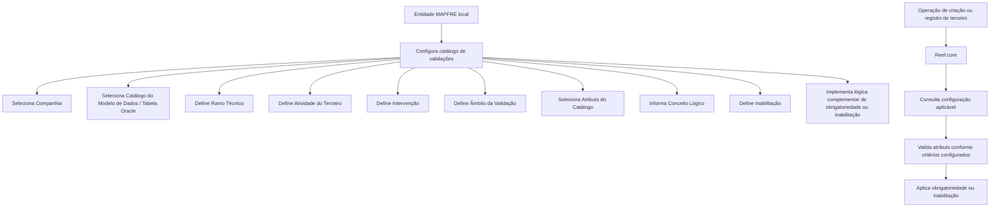

# Definição de Campos Obrigatórios no Registro de Informações de Terceiros por Atividade — Reef.core

## 1. Metadados do Documento
- **Arquivo de Origem:** Não identificado — texto bruto fornecido na solicitação
- **Tipo de Documento:** Especificação Funcional
- **Domínio / Sistema:** Reef.core / MAPFRE / Registro de Terceiros
- **Público-Alvo:** Tecnologia e Processos, desenvolvedores locais, analistas funcionais e equipes operacionais
- **Data/Versão Identificada:** Não identificada
- **Status identificado no conteúdo:** Approved Source

---

## 2. Resumo Executivo & Contexto de Negócio

O documento descreve a configuração de validações de obrigatoriedade e inabilitação aplicadas ao registro de informações de terceiros no núcleo do sistema **Reef.core**. A configuração permite particularizar o comportamento do sistema durante operações de criação de terceiros, definindo quais dados das estruturas de informação devem ser obrigatoriamente registrados.

A responsabilidade pela configuração desse catálogo é atribuída ao Departamento de Tecnologia e Processos da entidade MAPFRE local. A entidade local deve configurar as regras considerando critérios como companhia, catálogo do modelo de dados, ramo técnico, atividade do terceiro, intervenção, âmbito da validação, atributo do catálogo e conceito lógico.

A definição de uma regra pode ser genérica ou específica. Para ramo técnico e atividade do terceiro, o código genérico é `999`; para intervenção, o código genérico é `ZZ`. Esses valores permitem ampliar a abrangência de uma validação para todos os ramos, atividades ou intervenções correspondentes, enquanto valores específicos restringem a regra ao contexto selecionado.

O documento também destaca que a configuração depende do modelo de dados de terceiros utilizado na instalação — antigo ou novo —, pois os atributos devem ser corretamente nomeados. Adicionalmente, o desenho das regras deve considerar os processos efetivamente utilizados para cadastrar terceiros, pois as tabelas envolvidas podem variar entre um registro centralizado pela rotina de terceiros e um registro efetuado diretamente a partir do Processo de Emissão.

---

## 3. Arquitetura, Componentes & Tecnologias Envolvidas

### Componentes e conceitos identificados

| Componente / Conceito | Papel identificado no documento |
| :--- | :--- |
| **Reef.core** | Núcleo do sistema que aplica validações durante as operações de criação e registro de terceiros. |
| **Catálogo de configuração** | Estrutura configurada pela entidade MAPFRE local para determinar obrigatoriedade e inabilitação de atributos. |
| **Modelo de Dados de Terceiros** | Modelo de dados utilizado pela instalação; pode ser antigo ou novo e afeta a nomenclatura dos atributos. |
| **Tabela Oracle** | Tabela associada à atividade do terceiro e utilizada como referência para a configuração de validações sobre atributos. |
| **Direção / Departamento de Tecnologia local** | Área responsável pelo desenvolvimento de componentes de software ou lógica de negócio complementar para regras de obrigatoriedade e inabilitação. |
| **Processo de Emissão** | Processo a partir do qual usuários podem registrar terceiros diretamente, conforme a configuração operacional local. |
| **Rotina de terceiros** | Rotina de registro centralizado de terceiros, citada como alternativa operacional ao cadastro pelo Processo de Emissão. |
| **Conceito lógico** | Identificador que diferencia atributos de mesmo nome pertencentes a contextos distintos, como `PRS_PCE`. |

### Fluxo de configuração e aplicação de validações



> **Nota de Análise:** O documento não detalha contratos de integração, métodos HTTP, serviços externos, estruturas de banco de dados além da referência a tabelas Oracle, nem o mecanismo técnico interno usado por Reef.core para persistir ou executar as validações.

---

## 4. Regras de Negócio, Especificações Funcionais & Processos

### 4.1 Objetivo da configuração

O núcleo do sistema Reef.core permite particularizar seu comportamento em operações de criação de terceiros. Essa particularização ocorre pela configuração de validações sobre dados pertencentes às estruturas de informação dos terceiros, tornando imperativo o respectivo registro quando a regra configurada for aplicável.

### 4.2 Responsabilidade organizacional

A configuração do catálogo é responsabilidade do Departamento de Tecnologia e Processos da entidade MAPFRE local. A entidade local também pode desenvolver componentes de software ou lógica de negócio para estabelecer critérios complementares de obrigatoriedade e inabilitação.

### 4.3 Critérios de aplicabilidade da validação

Uma regra de validação é configurada utilizando os seguintes critérios:

1. **Companhia:** identifica o código da companhia à qual a definição de validação se aplica.
2. **Catálogo do Modelo de Dados de Terceiros:** identifica o código da tabela Oracle sobre a qual serão configuradas validações para atributos do terceiro.
3. **Ramo Técnico:** determina o ramo técnico ao qual a configuração se aplica.
4. **Código de Atividade do Terceiro:** classifica a atividade da pessoa física ou jurídica para a qual a validação é configurada.
5. **Intervenção:** identifica a forma de participação de uma pessoa física ou jurídica em uma apólice ou aplicação.
6. **Âmbito da Validação:** diferencia se a validação se aplica a pessoa física, pessoa jurídica ou ambas as formas.
7. **Atributo do Catálogo do Modelo de Dados:** identifica o atributo da tabela Oracle que será submetido à configuração de validação.
8. **Inabilitação:** determina se a validação sobre o campo deve ou não ser executada.
9. **Conceito Lógico:** diferencia atributos com o mesmo nome pertencentes a conceitos lógicos distintos.

### 4.4 Regras para Ramo Técnico

- O atributo **Ramo Técnico** contém o código do ramo técnico da configuração.
- O código genérico `999` permite aplicar a validação do terceiro a **todos os ramos existentes**.
- Um código de ramo técnico específico permite aplicar a validação do terceiro **somente ao ramo técnico selecionado**.

### 4.5 Regras para Código de Atividade do Terceiro

- O atributo contém a classificação da atividade da pessoa física ou jurídica para a qual a validação será configurada.
- O código genérico `999` permite aplicar a validação a **todas as atividades de terceiros**.
- Um código de atividade específico permite aplicar a validação **somente à atividade selecionada**.

### 4.6 Regras para Intervenção

- A intervenção determina como a pessoa física ou jurídica participa de uma apólice ou aplicação.
- Os exemplos citados de intervenção são: **Tomador**, **Asegurado**, **Conductor** e **Beneficiario**.
- O código genérico `ZZ` permite realizar a validação para **todas as intervenções associadas à atividade do terceiro**.
- Um código de intervenção específico permite realizar a validação apenas para a combinação de **atividade do terceiro e intervenção selecionada**.

### 4.7 Regras para Âmbito da Validação

O atributo **Âmbito da Validação** determina se a regra de validação deve ser aplicada quando o registro de informação do terceiro corresponde a:

- Pessoa física;
- Pessoa jurídica;
- Ambas as formas indistintamente.

> **Nota de Análise:** O conteúdo fornecido não informa os códigos, valores permitidos ou representação técnica do âmbito de validação.

### 4.8 Regras para Atributo do Catálogo do Modelo de Dados

- O atributo identifica o código de um atributo da tabela Oracle que receberá a configuração de validação.
- A entidade deve considerar qual modelo de dados de terceiros está em uso na instalação — antigo ou novo — para nomear corretamente os atributos.
- A nomeação incorreta de atributos pode comprometer a definição da regra de validação.

### 4.9 Regras para Inabilitação

- A propriedade **Inabilitação** informa ao Reef.core se a validação sobre um campo deve ou não ser executada.
- A Direção de Tecnologia local pode desenvolver componente de software ou lógica de negócio para determinar se um atributo deve ser considerado e validado conforme regras definidas pela entidade.

### 4.10 Lógica de negócio para obrigatoriedade

Por desenvolvimento de componente de software pela Direção de Tecnologia local, pode-se determinar se um atributo do catálogo do modelo de dados deve ser capturado obrigatoriamente, segundo critérios complementares definidos pela entidade.

### 4.11 Lógica de negócio para inabilitação

Por desenvolvimento de componente de software ou lógica de negócio pela Direção de Tecnologia local, pode-se determinar se um atributo do catálogo deve ser contemplado e, portanto, validado conforme as regras da entidade.

### 4.12 Regras para Conceito Lógico

- O atributo **Conceito Lógico** contém o código do conceito ao qual pertence o atributo do catálogo do modelo de dados.
- Esse atributo existe na tabela de configuração porque há campos com o mesmo nome em conceitos lógicos diferentes.
- O documento usa `PRS_PCE` como exemplo de campo existente nos contextos de acionistas e representantes legais.
- Os exemplos de conceitos lógicos fornecidos são:
  - `PRS` — Persona;
  - `LGR` — Representantes;
  - `CNT` — Contactos;
  - `ADR` — Direcciones.

### 4.13 Consideração operacional para definição das regras

A entidade local deve identificar quais procedimentos são usados para registrar terceiros antes de definir o catálogo. Devem ser considerados, entre outros, os seguintes cenários:

1. Registro centralizado de terceiros por meio da rotina de terceiros;
2. Registro de terceiros diretamente por usuários a partir do Processo de Emissão.

As tabelas envolvidas podem variar conforme o procedimento utilizado para o registro do terceiro.

---

## 5. Tabelas de Parâmetros, Ambientes e Estruturas de Dados

### 5.1 Parâmetros de configuração de validação

| Item / Parâmetro | Descrição / Função | Tipo / Valores / Formato | Ambiente / Observações |
| :--- | :--- | :--- | :--- |
| Companhia | Indica o código da companhia sobre a qual é realizada a definição da validação. | Código de companhia | Aplicável à entidade configurada. |
| Catálogo do Modelo de Dados de Terceiros | Indica o código da tabela Oracle sobre a qual são configuradas validações de atributos do terceiro. | Código de tabela Oracle | Associado à atividade do terceiro. |
| Ramo Técnico | Define o ramo técnico da configuração de registro. | Código de ramo; `999` para todos os ramos | Um código específico limita a validação ao ramo selecionado. |
| Código de Atividade do Terceiro | Classifica a atividade da pessoa física ou jurídica para a qual a regra é configurada. | Código de atividade; `999` para todas as atividades | Um código específico limita a validação à atividade selecionada. |
| Intervenção | Define como a pessoa física ou jurídica intervém em apólice ou aplicação. | Código de intervenção; `ZZ` para todas as intervenções aplicáveis | Exemplos: Tomador, Asegurado, Conductor, Beneficiario. |
| Âmbito da Validação | Distingue a aplicação da validação para pessoa física, jurídica ou ambas. | Valores não detalhados | O documento não informa códigos para os âmbitos. |
| Atributo do Catálogo do Modelo de Dados | Identifica o atributo da tabela Oracle que será validado. | Código de atributo | A denominação deve corresponder ao modelo antigo ou novo utilizado na instalação. |
| Inabilitação | Indica ao Reef.core se a validação sobre um campo deve ser efetuada. | Regra de inabilitação; valores não detalhados | Pode depender de lógica de negócio local. |
| Conceito Lógico | Identifica o conceito lógico ao qual o atributo pertence. | Código de conceito lógico | Necessário para diferenciar atributos com mesmo nome em contextos distintos. |

### 5.2 Atividades de terceiros e catálogos do modelo de dados

| Atividade do Terceiro | Catálogo do Modelo de Dados / Tabela Oracle |
| :--- | :--- |
| ASEGURADO | `X1000802` |
| AGENTE | `A1001332` |
| TERCERO GENÉRICO | `A1001300` |
| SUPERVISOR | `A1001338` |
| TRAMITADOR | `A1001339` |
| ASEGURADORA | `A1000600` |
| REASEGURADORA | `G2000157` |
| BROKER | `G2000155` |
| EMPLEADO DE AGENTE | `A1001337` |
| COMPAÑÍA | `A1000900` |
| ENTIDAD BANCARIA | `A5020900` |
| OFICINA BANCARIA | `A5020910` |
| PRIMER NIVEL ESTRUCTURA COMERCIAL | `A1000700` |
| SEGUNDO NIVEL ESTRUCTURA COMERCIAL | `A1000701` |
| TERCER NIVEL ESTRUCTURA COMERCIAL | `A1000702` |

### 5.3 Valores genéricos identificados

| Parâmetro | Valor genérico | Efeito da configuração genérica |
| :--- | :--- | :--- |
| Ramo Técnico | `999` | Aplica a validação a todos os ramos existentes. |
| Código de Atividade do Terceiro | `999` | Aplica a validação a todas as atividades de terceiros. |
| Intervenção | `ZZ` | Aplica a validação a todas as intervenções associadas à atividade do terceiro. |

### 5.4 Conceitos lógicos exemplificados

| Código | Conceito identificado no documento | Observação |
| :--- | :--- | :--- |
| `PRS` | Persona | Exemplo de conceito lógico. |
| `LGR` | Representantes | Exemplo de conceito lógico. |
| `CNT` | Contactos | Exemplo de conceito lógico. |
| `ADR` | Direcciones | Exemplo de conceito lógico. |
| `PRS_PCE` | Campo citado como exemplo | Pode existir em acionistas e representantes legais. |

---

## 6. Bateria de Perguntas & Respostas para RAG (FAQ Sintético)

### P1: Qual é o objetivo do catálogo de campos obrigatórios de terceiros no Reef.core?
**R:** O catálogo permite particularizar o comportamento do Reef.core durante operações de criação de terceiros. A entidade MAPFRE local configura validações sobre atributos das estruturas de informação de terceiros para tornar o registro desses dados imperativo quando os critérios da regra forem atendidos.

### P2: Quem é responsável por configurar o catálogo de validações de terceiros?
**R:** A responsabilidade pela configuração do catálogo recai sobre o Departamento de Tecnologia e Processos da entidade MAPFRE local. A Direção de Tecnologia local também pode desenvolver componentes de software ou lógica de negócio complementar para obrigatoriedade e inabilitação.

### P3: O que acontece quando o Ramo Técnico recebe o código `999`?
**R:** O código genérico `999` no atributo Ramo Técnico permite que a validação do terceiro seja aplicada a todos os ramos existentes. Quando é informado um código de ramo específico, a validação fica limitada somente ao ramo técnico indicado.

### P4: Como configurar uma validação aplicável a todas as atividades de terceiros?
**R:** Deve-se utilizar o valor genérico `999` no atributo Código de Atividade do Terceiro. Esse valor permite validar terceiros em todas as atividades existentes; um código específico restringe a regra à atividade configurada.

### P5: O que representa o código `ZZ` no campo Intervenção?
**R:** O código genérico `ZZ` permite realizar a validação para todas as intervenções associadas à atividade do terceiro. Caso seja utilizado o código de uma intervenção específica, a validação será aplicada apenas à combinação da atividade do terceiro com a intervenção selecionada.

### P6: Quais exemplos de intervenção de um terceiro são apresentados no documento?
**R:** O documento cita como exemplos de intervenção a participação de uma pessoa física ou jurídica como Tomador, Asegurado, Conductor ou Beneficiario em uma apólice ou aplicação.

### P7: Por que é necessário informar o Conceito Lógico na configuração?
**R:** O Conceito Lógico é necessário porque pode haver campos com o mesmo nome em conceitos distintos. O documento exemplifica `PRS_PCE`, que pode existir nos contextos de acionistas e representantes legais. O conceito lógico diferencia corretamente o atributo que deve ser configurado e validado.

### P8: O que a propriedade Inabilitação controla no Reef.core?
**R:** A propriedade Inabilitação informa ao Reef.core se a validação sobre determinado campo deve ou não ser realizada. A entidade pode complementar essa decisão com componente de software ou lógica de negócio definida localmente.

### P9: O que deve ser considerado antes de definir os atributos do Catálogo do Modelo de Dados?
**R:** Deve-se considerar se a instalação utiliza o modelo de dados de terceiros antigo ou novo. Essa identificação é fundamental para nomear corretamente os atributos sobre os quais a configuração de validação será aplicada.

### P10: Quais procedimentos de registro de terceiros devem ser considerados na configuração local?
**R:** A entidade deve verificar se o terceiro é registrado de forma centralizada por meio da rotina de terceiros ou se usuários podem registrá-lo diretamente a partir do Processo de Emissão. As tabelas envolvidas podem variar conforme o procedimento utilizado.

### P11: Qual tabela Oracle está associada à atividade ASEGURADO?
**R:** A atividade **ASEGURADO** está associada ao catálogo do modelo de dados ou tabela Oracle `X1000802`.

### P12: Como o Âmbito da Validação diferencia a aplicação de uma regra?
**R:** O Âmbito da Validação define se a validação se aplica a registros de informação de pessoa física, pessoa jurídica ou indistintamente a ambas. O documento não informa códigos ou valores técnicos específicos para essas opções.

---

## 7. Glossário de Termos, Siglas & Conceitos-Chave

- **Reef.core:** Núcleo do sistema com capacidade de particularizar validações em operações de criação de terceiros.
- **Terceiro:** Pessoa física ou jurídica cuja informação é registrada e validada no sistema.
- **Catálogo do Modelo de Dados de Terceiros:** Referência à tabela Oracle e aos atributos usados na configuração das validações de terceiros.
- **Ramo Técnico:** Código do ramo sobre o qual a configuração de registro e validação pode ser aplicada.
- **Atividade do Terceiro:** Classificação da atividade de uma pessoa física ou jurídica para fins de configuração da validação.
- **Intervenção:** Maneira pela qual uma pessoa física ou jurídica participa de uma apólice ou aplicação.
- **Âmbito da Validação:** Critério que diferencia a aplicação de uma validação para pessoa física, pessoa jurídica ou ambas.
- **Inabilitação:** Propriedade que determina se uma validação de campo deve ser efetuada pelo Reef.core.
- **Conceito Lógico:** Código que identifica o contexto ao qual um atributo pertence e diferencia campos homônimos.
- **PRS:** Persona.
- **LGR:** Representantes.
- **CNT:** Contactos.
- **ADR:** Direcciones.
- **PRS_PCE:** Campo citado como exemplo de atributo que pode existir em mais de um conceito lógico.
- **Tomador:** Exemplo de intervenção de terceiro em uma apólice ou aplicação.
- **Asegurado:** Exemplo de intervenção e atividade de terceiro mencionada no documento.
- **Conductor:** Exemplo de intervenção de terceiro em uma apólice ou aplicação.
- **Beneficiario:** Exemplo de intervenção de terceiro em uma apólice ou aplicação.
- **Processo de Emissão:** Processo citado como possível origem de registro direto de terceiros por usuários.

---

## 8. Notas Críticas, Riscos & Limitações

- O documento não informa a estrutura técnica da tabela de configuração, seus nomes, chaves, tipos de campos ou relacionamentos.
- O documento não detalha os valores permitidos para o atributo **Âmbito da Validação**.
- O documento não especifica os valores técnicos que representam o estado de **Inabilitação**.
- Não são apresentados métodos, contratos JSON, APIs, serviços, eventos ou integrações externas associados ao Reef.core.
- A definição correta de atributos depende da identificação prévia do modelo de dados de terceiros utilizado na instalação, antigo ou novo.
- A configuração deve considerar o fluxo real de cadastro de terceiros, pois as tabelas envolvidas podem variar conforme o registro seja centralizado ou executado no Processo de Emissão.
- A lógica local de obrigatoriedade e inabilitação pode depender de desenvolvimento pela Direção de Tecnologia local, mas o documento não detalha requisitos de implementação, linguagem, interfaces ou critérios técnicos dessa lógica.
- Os blocos intitulados “Consejo” e “Ejemplos de Reglas de Negocio” aparecem no conteúdo fornecido sem detalhamento adicional.

---

## 9. Conteúdo Bruto Estruturado (Referência Fiel)

```text
--- [PÁGINA 1 DE 3] ---

DEFINICIÓN de los Campos Obligatorios en el Registro de la
Información de los Terceros, por Actividad del Tercero
Objetivo
Funcionalmente, el núcleo del Sistema cuenta con la posibilidad de particularizar el comportamiento de Reef.core en las Operaciones de
Creación de los Terceros, configurando validaciones sobre los datos de las estructuras de información de los Terceros para que su registro
sea imperativo.
La responsabilidad de la configuración de este catálogo recae en el Departamento de Tecnología y Procesos de la Entidad MAPFRE local.
Compañía
Esta propiedad le indica al sistema el código de la compañía sobre la que se está realizando la definición de la validación de la información
del Tercero.
Catálogo del Modelo de Datos de Terceros
Esta propiedad le indica al sistema el código de la Tabla Oracle sobre la que se está realizando la configuración de la validación sobre los
atributos del Tercero:
ACTIVIDAD CATÁLOGO DEL MODELO DE DATOS
ASEGURADO X1000802
AGENTE A1001332
TERCERO GENÉRICO A1001300
SUPERVISOR A1001338
TRAMITADOR A1001339
ASEGURADORA A1000600
Ejemplos de validaciones de información
Documentation / DOCUMENTACIÓN Reef
DOCUMENTACIÓN Reef
Mapfredocument
DOCUMENTACIÓN Reef
Owner
user:agonzalez_mapfre.com
Lifecycle
Approved Source
 / 
 VL
Buscar Inicio Soluciones Arquitecturas APIs Componentes Cloud Documentación Zeus Reef Ayuda
ES


--- [PÁGINA 2 DE 3] ---

ACTIVIDAD CATÁLOGO DEL MODELO DE DATOS
REASEGURADORA G2000157
BROKER G2000155
EMPLEADO DE AGENTE A1001337
COMPAÑÍA A1000900
ENTIDAD BANCARIA A5020900
OFICINA BANCARIA A5020910
PRIMER NIVEL ESTRUCTURA COMERCIAL A1000700
SEGUNDO NIVEL ESTRUCTURA COMERCIAL A1000701
TERCER NIVEL ESTRUCTURA COMERCIAL A1000702
Ramo Técnico
Esta propiedad contiene el código del ramo técnico sobre el que se está realizando la configuración del registro.
Utilizando el valor genérico en este atributo (código 999) el sistema permite realizar la validación del Tercero para todos los Ramos
existentes o bien al utilizar el código de un Ramo Técnico de los n existentes realizar la validación del Tercero únicamente para ese Ramo.
Código de Actividad del Tercero
Esta propiedad contiene la clasificación de la actividad de la persona física o jurídica (tercero) para la que se está configurando la validación.
Utilizando el valor genérico en este atributo (código 999) el sistema permite realizar la validación del Tercero para todas las Actividades de
los Terceros o bien al utilizar el código de una Actividad de las n existentes realizar la validación del Tercero únicamente para esa
Actividad.
Intervención
Este atributo determina la manera en la que interviene una persona, física o jurídica, en una póliza o aplicación (Tomador, Asegurado,
Conductor, Beneficiario,..)
Utilizando el valor genérico en este atributo (código 'ZZ') el sistema permite realizar la validación del Tercero para todas las Intervenciones
asociadas a la Actividad del Tercero o bien al utilizar el código de una Intervención en particular de las n existentes realizar la validación
del Tercero únicamente para esa Actividad e Intervención.
Ámbito de la Validación
Este Atributo distingue si la validación es de aplicación cuando el registro de la información del Tercero corresponde a una persona física, a
una persona jurídica o indistintamente sobre ambas formas.
Consejo:
Consejo:
Consejo:


--- [PÁGINA 3 DE 3] ---

Utilizando el valor genérico en este atributo (código 'ZZ') el sistema permite realizar la validación del Tercero para todas las Intervenciones
asociadas a la Actividad del Tercero o bien al utilizar el código de una Intervención en particular de las n existentes realizar la validación
del Tercero únicamente para esa Actividad e Intervención.
Atributo del Catálogo del Modelo de Datos
Esta propiedad le indica al sistema el código de uno de los Atributos de la Tabla Oracle sobre la que se está realizando la configuración de la
validación sobre la información del Tercero.
Es fundamental contemplar qué Modelo de Datos de Terceros se emplea en la Instalación (si el antiguo o el nuevo Modelo) para nombrar
correctamente los Atributos.
Inhabilitación
Esta propiedad le indica a Reef.core si la validación sobre el campo se tiene o no que efectuar.
Lógica de Negocio - Obligatoriedad
Mediante el desarrollo por parte de la Dirección de Tecnología local de este componente software, se puede determinar si un Atributo del
Catálogo del Modelo de Datos se tiene o no que capturar obligatoriamente de acuerdo con los criterios complementarios que determine la
Entidad.
Lógica de Negocio - Inhabilitación
Mediante el desarrollo por parte de la Dirección de Tecnología local de este componente software ó lógica de negocio, se puede determinar si
el el Atributo del Catálogo del Modelo de Datos se tiene o no que contemplar, y por tanto, validar de acuerdo con las reglas que determine la
Entidad.
Concepto Lógico
Este Atributo contiene el código del concepto lógico al que pertenece el Atributo del Catálogo del Modelo de Datos.
Se ha incluido este Atributo en la Tabla de configuración debido a que hay campos con el mismo nombre para distintos conceptos lógicos
como, por ejemplo, PRS_PCE en accionistas y representantes legales (Los conceptos lógicos pueden ser PRS (Persona), LGR
(Representantes), CNT (Contactos), ADR (direcciones), ...)
Vínculos
Relación de Directrices y Documentos funcionales cuya lectura recomendada para evitar que la interpretación aislada del presente
documento pueda conducir a error.
Actividades de Terceros
Preguntas frecuentes
1 ¿Existe alguna recomendación operativa que deba ser tomada en consideración localmente en la configuración de este catálogo?
Se debe considerar cual o cuales son los procedimientos por los que se registran los Terceros en el Sistema para una correcta definición (Si
el registro del Tercero se realiza de manera centralizada y utilizando la rutina de terceros, si se permite a los usuarios registrar a los Terceros
directamente desde el propio Proceso de Emisión) puesto que las tablas involucradas pueden variar.
Consejo:
Ejemplos de Reglas de Negocio
Consejo:
```
