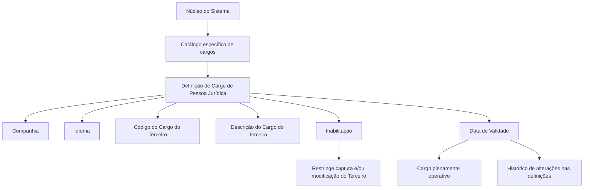

# Definição de Cargos em Pessoas Jurídicas no Sistema Reef

## 1. Metadados do Documento
- **Arquivo de Origem:** `Não identificado no conteúdo fornecido`
- **Tipo de Documento:** `Especificação Funcional`
- **Domínio / Sistema:** `Cargos de Terceiros Jurídicos; Sistema Reef / Mapfredocument`
- **Público-Alvo:** `Não identificado explicitamente`
- **Data/Versão Identificada:** `Não identificada`
- **Owner Identificado:** `user:agonzalez_mapfre.com`
- **Lifecycle Identificado:** `Approved Source`

---

## 2. Resumo Executivo & Contexto de Negócio

O documento descreve a definição de cargos associados a Pessoas Jurídicas no núcleo do sistema. O sistema permite identificar e codificar diferentes cargos de terceiros jurídicos por meio de um catálogo específico de informações.

O catálogo de cargos é entregue inicialmente às instalações sem conteúdo. Dessa forma, a codificação, a descrição e a ativação dos cargos são dados que devem ser definidos no sistema para viabilizar seu uso nas operações relacionadas a terceiros jurídicos.

A definição de cada cargo inclui propriedades gerais: companhia, idioma, código do cargo do terceiro e descrição do cargo do terceiro. A companhia determina o código da empresa para a qual a definição é realizada; o idioma determina o idioma usado na definição; o código identifica o cargo; e a descrição apresenta a denominação correspondente no idioma selecionado.

O documento também estabelece propriedades operacionais importantes: a inabilitação impede que um cargo seja usado em operações de captura e/ou modificação de terceiros, enquanto a data de validade determina a partir de quando o cargo está plenamente operativo. A data de validade também permite manter histórico de alterações realizadas nas definições de cargos.

Não existe preferência ou recomendação corporativa para padronizar a codificação dos cargos no sistema. O documento recomenda a leitura da documentação relacionada a cargos de Pessoas Politicamente Expostas (P.E.P's), pois a interpretação isolada deste documento pode induzir a erro.

---

## 3. Arquitetura, Componentes & Tecnologias Envolvidas

O conteúdo não descreve arquitetura de software, APIs, microsserviços, métodos HTTP, contratos JSON, servidores, tecnologias de implementação ou ambientes técnicos.

Os elementos funcionais identificados são:

- **Núcleo do Sistema:** componente funcional com capacidade de identificar e codificar cargos de terceiros jurídicos.
- **Catálogo de informações específico:** repositório funcional utilizado para definir os diferentes cargos de Pessoas Jurídicas.
- **Pessoa Jurídica / Terceiro Jurídico:** entidade para a qual os cargos são definidos e utilizados.
- **Companhia:** propriedade que associa a definição do cargo ao código de uma companhia.
- **Idioma:** propriedade que contextualiza linguisticamente a descrição do cargo.
- **Inabilitação:** propriedade que restringe o uso do cargo em operações de captura e modificação.
- **Data de Validade:** propriedade que determina o início da operação plena do cargo e suporta histórico de alterações.
- **Reef / Mapfredocument:** referências presentes no cabeçalho de documentação extraído.
- **Documento relacionado:** “Cargos en Personas Políticamente Expuestas (P.E.P's)”.



> **Nota de Análise:** o documento não detalha a estrutura física do catálogo, mecanismos de persistência, permissões de manutenção, interfaces de usuário, métodos de integração ou contratos técnicos.

---

## 4. Regras de Negócio, Especificações Funcionais & Processos

### 4.1. Catálogo de cargos de terceiros jurídicos

1. O núcleo do sistema possui a capacidade de identificar e codificar diferentes cargos de terceiros jurídicos.
2. Os cargos são administrados em um catálogo de informação específico.
3. O catálogo é entregue inicialmente às instalações vazio de conteúdo.
4. O documento não estabelece uma codificação corporativa obrigatória ou um padrão corporativo para os códigos dos cargos.

### 4.2. Definição de cargo de Pessoa Jurídica

A definição de um cargo de Pessoa Jurídica possui as seguintes propriedades:

1. **Companhia**
   - Indica o código da companhia sobre a qual está sendo realizada a definição do cargo da Pessoa Jurídica.

2. **Idioma**
   - Indica o idioma utilizado na definição do cargo da Pessoa Jurídica.
   - A descrição do cargo deve corresponder ao idioma usado na definição.

3. **Código do Cargo do Terceiro**
   - Indica no sistema o código do cargo da Pessoa Jurídica.

4. **Descrição do Cargo do Terceiro**
   - Indica a denominação ou descrição do cargo do terceiro.
   - A denominação ou descrição deve estar de acordo com o idioma utilizado na definição.

### 4.3. Exemplos de cargos apresentados

Para definições em espanhol, o documento apresenta os seguintes exemplos:

| Código do Cargo | Descrição |
| :--- | :--- |
| CEO | Consejero Delegado |
| CFO | Chief Financial Officer |
| CMO | Chief Marketing Officer |
| CIO | Chief Information Officer |
| ... | ... |

> **Nota de Análise:** os exemplos demonstram que as descrições podem preservar denominações em inglês mesmo quando o idioma utilizado na definição é espanhol. O documento não apresenta critérios adicionais para tradução, validação linguística ou unicidade da descrição.

### 4.4. Inabilitação

1. A propriedade **Inhabilitación** indica ao sistema que o cargo da Pessoa Jurídica está inabilitado.
2. Um cargo inabilitado não pode ser utilizado nas operações de:
   - captura do terceiro;
   - modificação do terceiro.

### 4.5. Data de Validade

1. A propriedade **Fecha de Validez** indica a data a partir da qual o cargo do terceiro está plenamente operativo no sistema.
2. O uso correto da data de validade permite manter um histórico das alterações efetuadas nas definições de cargos.
3. O documento não especifica formato de data, fuso horário, regras para datas retroativas, encerramento de validade ou comportamento para cargos sem data de validade.

### 4.6. Vínculos documentais

O documento recomenda a leitura de diretrizes e documentos funcionais relacionados para evitar interpretações incorretas decorrentes da análise isolada do conteúdo.

Documento relacionado identificado:

- **Cargos en Personas Políticamente Expuestas (P.E.P's)**

### 4.7. Recomendação corporativa sobre codificação

A pergunta frequente apresentada no documento é:

> Existe alguma recomendação operativa que deva ser considerada localmente na codificação, uso e definição dos cargos dos terceiros jurídicos no sistema?

Resposta apresentada:

> Não existe, corporativamente, preferência ou recomendação para estabelecer ou padronizar no sistema a sua codificação.

---

## 5. Tabelas de Parâmetros, Ambientes e Estruturas de Dados

### 5.1. Propriedades funcionais do cargo

| Item / Parâmetro | Descrição / Função | Tipo / Valores / Formato | Ambiente / Observações |
| :--- | :--- | :--- | :--- |
| Companhia | Indica o código da companhia sobre a qual é realizada a definição do cargo da Pessoa Jurídica. | Código de companhia; formato não especificado. | Aplicável à definição do cargo. |
| Idioma | Indica o idioma empregado na definição do cargo da Pessoa Jurídica. | Idioma; valores não especificados. | A descrição deve estar de acordo com o idioma definido. |
| Código do Cargo do Terceiro | Identifica no sistema o código do cargo da Pessoa Jurídica. | Código; formato não especificado. | Não há padronização corporativa de codificação identificada. |
| Descrição do Cargo do Terceiro | Indica a denominação ou descrição do cargo do terceiro. | Texto; formato não especificado. | Deve respeitar o idioma utilizado na definição. |
| Inabilitação | Indica que o cargo está inabilitado para uso. | Estado de inabilitação; valores não especificados. | Bloqueia o uso em captura e/ou modificação do terceiro. |
| Data de Validade | Indica a data a partir da qual o cargo está plenamente operativo. | Data; formato não especificado. | Suporta histórico de alterações das definições de cargos. |

### 5.2. Exemplos de códigos e descrições

| Item / Parâmetro | Descrição / Função | Tipo / Valores / Formato | Ambiente / Observações |
| :--- | :--- | :--- | :--- |
| CEO | Consejero Delegado | Código de cargo | Exemplo apresentado para definição com idioma espanhol. |
| CFO | Chief Financial Officer | Código de cargo | Exemplo apresentado para definição com idioma espanhol. |
| CMO | Chief Marketing Officer | Código de cargo | Exemplo apresentado para definição com idioma espanhol. |
| CIO | Chief Information Officer | Código de cargo | Exemplo apresentado para definição com idioma espanhol. |

### 5.3. Referências documentais identificadas

| Item / Parâmetro | Descrição / Função | Tipo / Valores / Formato | Ambiente / Observações |
| :--- | :--- | :--- | :--- |
| DOCUMENTACIÓN Reef | Referência de documentação exibida no conteúdo extraído. | Identificador documental. | Não há detalhamento adicional. |
| Mapfredocument | Referência exibida no cabeçalho de documentação. | Identificador de documentação ou plataforma. | Não há detalhamento adicional. |
| Cargos en Personas Políticamente Expuestas (P.E.P's) | Documento funcional cuja leitura é recomendada. | Vínculo documental. | Recomendado para evitar interpretação isolada incorreta. |
| Owner | `user:agonzalez_mapfre.com` | Identificador de proprietário. | Extraído do cabeçalho. |
| Lifecycle | `Approved Source` | Estado de ciclo de vida. | Extraído do cabeçalho. |

---

## 6. Bateria de Perguntas & Respostas para RAG (FAQ Sintético)

### P1: Qual é a finalidade do catálogo de cargos de Pessoas Jurídicas?
**R:** O catálogo de cargos permite que o núcleo do sistema identifique e codifique os diferentes cargos dos terceiros jurídicos. O catálogo é um repositório específico de informações e é entregue inicialmente às instalações sem conteúdo.

### P2: Quais propriedades devem compor a definição de um cargo de Pessoa Jurídica?
**R:** A definição inclui, no mínimo, companhia, idioma, código do cargo do terceiro, descrição do cargo do terceiro, inabilitação e data de validade. O documento não descreve outros campos obrigatórios, regras de unicidade ou formatos técnicos para essas propriedades.

### P3: O que representa a propriedade Companhia na definição de um cargo?
**R:** A propriedade Companhia informa o código da companhia sobre a qual está sendo realizada a definição do cargo da Pessoa Jurídica.

### P4: Como o idioma influencia a descrição de um cargo?
**R:** O idioma informa qual idioma é utilizado na definição do cargo da Pessoa Jurídica. A descrição do cargo do terceiro deve corresponder ao idioma utilizado nessa definição.

### P5: Um cargo inabilitado pode ser usado para cadastrar ou alterar um terceiro?
**R:** Não. A propriedade Inhabilitación informa ao sistema que o cargo da Pessoa Jurídica está inabilitado para ser utilizado em operações de captura e/ou modificação do terceiro.

### P6: Qual é a função da data de validade do cargo?
**R:** A data de validade indica a partir de qual data o cargo do terceiro está plenamente operativo no sistema. Seu uso correto também permite manter histórico das alterações efetuadas nas definições de cargos.

### P7: Existe um padrão corporativo obrigatório para codificar cargos de terceiros jurídicos?
**R:** Não. O documento afirma que não existe, corporativamente, preferência ou recomendação para estabelecer ou padronizar a codificação dos cargos no sistema.

### P8: Quais exemplos de códigos de cargo são apresentados no documento?
**R:** O documento apresenta CEO, CFO, CMO e CIO como exemplos. As descrições exibidas são, respectivamente, Consejero Delegado, Chief Financial Officer, Chief Marketing Officer e Chief Information Officer.

### P9: O documento define o formato da data de validade?
**R:** Não. O documento explica a finalidade da data de validade, mas não informa o formato aceito, regras de preenchimento, fuso horário, comportamento para datas passadas ou processo de encerramento da validade.

### P10: O documento descreve APIs, microsserviços ou contratos de integração para o catálogo de cargos?
**R:** Não. O conteúdo fornecido descreve propriedades funcionais e regras operacionais do catálogo de cargos, mas não detalha APIs, métodos HTTP, microsserviços, contratos JSON, servidores ou tecnologias de implementação.

### P11: Qual documentação relacionada deve ser consultada para evitar interpretações incorretas?
**R:** O documento recomenda a consulta das diretrizes e documentos funcionais vinculados, especificamente o documento “Cargos en Personas Políticamente Expuestas (P.E.P's)”, para evitar que a interpretação isolada do conteúdo leve a erro.

### P12: O catálogo de cargos já vem preenchido quando entregue às instalações?
**R:** Não. O catálogo específico de informações é entregue inicialmente às instalações vazio de conteúdo.

---

## 7. Glossário de Termos, Siglas & Conceitos-Chave

- **Pessoa Jurídica:** entidade para a qual é realizada a definição de cargos no sistema.
- **Terceiro Jurídico:** denominação usada no documento para o terceiro associado a uma Pessoa Jurídica.
- **Cargo do Terceiro:** função ou denominação atribuída ao terceiro jurídico e registrada no catálogo específico.
- **Catálogo de Informação:** estrutura funcional específica destinada a identificar e codificar cargos de terceiros jurídicos.
- **Companhia:** código da empresa sobre a qual é realizada a definição de cargo.
- **Idioma:** língua empregada na definição e na descrição do cargo.
- **Inhabilitación:** propriedade que torna um cargo indisponível para operações de captura e/ou modificação do terceiro.
- **Fecha de Validez:** data a partir da qual um cargo torna-se plenamente operativo no sistema.
- **CEO:** código de cargo exemplificado como “Consejero Delegado”.
- **CFO:** código de cargo exemplificado como “Chief Financial Officer”.
- **CMO:** código de cargo exemplificado como “Chief Marketing Officer”.
- **CIO:** código de cargo exemplificado como “Chief Information Officer”.
- **P.E.P's:** Pessoas Politicamente Expostas, conforme título do documento relacionado citado.
- **Reef:** referência presente na identificação da documentação extraída.
- **Mapfredocument:** referência presente no cabeçalho da documentação extraída.
- **Lifecycle Approved Source:** estado de ciclo de vida exibido no conteúdo extraído.

---

## 8. Notas Críticas, Riscos & Limitações

- O catálogo é entregue vazio, portanto a disponibilidade de cargos depende do cadastro e da definição local de conteúdo.
- Não existe recomendação ou padronização corporativa para codificação de cargos; isso pode resultar em diferenças de códigos entre instalações.
- Um cargo inabilitado não pode ser utilizado nas operações de captura e/ou modificação do terceiro.
- A data de validade é relevante para determinar quando o cargo está operacional e para manter histórico de alterações.
- O documento não especifica formatos, validações, obrigatoriedade, regras de unicidade, permissões de acesso ou comportamento de erro para os campos do catálogo.
- O documento não detalha integrações, APIs, arquitetura técnica, persistência, trilhas de auditoria, ambientes ou procedimentos de implantação.
- A interpretação isolada do documento pode levar a erro; o próprio conteúdo recomenda a leitura do documento relacionado a cargos de Pessoas Politicamente Expostas.
- **Nota de Análise:** o documento lista o catálogo de cargos e suas propriedades, porém não detalha métodos HTTP, contratos JSON, tabelas físicas, interfaces de manutenção ou serviços técnicos expostos.

---

## 9. Conteúdo Bruto Estruturado (Referência Fiel)

```text
--- [PÁGINA 1 DE 2] ---

DEFINICIÓN de Cargos en Personas Jurídicas
Propiedades Generales
Funcionalmente, el núcleo del Sistema cuenta con la posibilidad de identicar y codicar los diferentes Cargos de los Terceros Jurídicos en
un catálogo de información especíco que se entrega inicialmente a las instalaciones vacío de contenido.
Compañía
Esta propiedad le indica al sistema el código de la compañía sobre la que se está realizando la denición del Cargo de la Persona Jurídica.
Idioma
Esta propiedad le indica al sistema el Idioma empleado en la denición del Cargo de la Persona Jurídica.
Código del Cargo del Tercero
Esta propiedad indicará en el sistema el código del Cargo de la Persona Jurídica.
Descripción del Cargo del Tercero
Esta propiedad le indica al sistema cual es la denominación o descripción del Cargo del Tercero, de acuerdo con el idioma utilizado en la
denición.
A modo de ejemplo y si el Idioma utilizado en la denición es el español:
CÓDIGO CARGO DESCRIPCIÓN
CEO Consejero Delegado
CFO Chief Financial Ocer
CMO Chief Marketing Ocer
CIO Chief Information Ocer
... ...
Otras Propiedades
Inhabilitación
Documentation / DOCUMENTACIÓN Reef
DOCUMENTACIÓN Reef
Mapfredocument
DOCUMENTACIÓN Reef
Owner
user:agonzalez_mapfre.com
Lifecycle
Approved Source
 / 
 VL
Buscar Inicio Soluciones Arquitecturas APIs Componentes Cloud Documentación Zeus Reef Ayuda
ES


--- [PÁGINA 2 DE 2] ---

Esta propiedad le indica al Sistema que el Cargo de la Persona Jurídica está inhabilitado para poder ser utilizada en las operaciones de
captura y/o modicación del Tercero.
Fecha de Validez
Esta propiedad le indica al Sistema la fecha a partir de la cual el cargo del Tercero está plenamente operativo en el sistema por lo que su
correcto uso permite tener un histórico de los cambios efectuados en las deniciones de los cargos.
Vínculos
Relación de Directrices y Documentos funcionales cuya lectura recomendada para evitar que la interpretación aislada del presente
documento pueda conducir a error.
Cargos en Personas Políticamente Expuestas (P.E.P's)
Preguntas frecuentes
(1) ¿Existe alguna recomendación operativa que deba ser tomada en consideración localmente en la codicación, uso y denición de los
Cargos de los Terceros Jurídicos en el Sistema?
No existe Corporativamente una preferencia o recomendación para establecer o estandarizar en el sistema su codicación.
```
