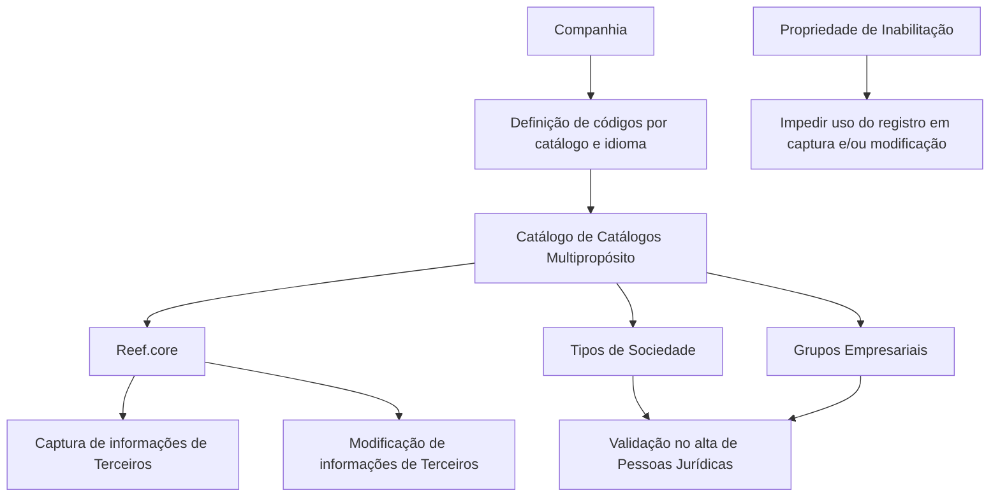

# Catálogo de Catálogos Multipropósito de Terceros — Documentação Reef

## 1. Metadados do Documento
- **Arquivo de Origem:** Não identificado no conteúdo fornecido
- **Tipo de Documento:** Especificação Técnica / Funcional
- **Domínio / Sistema:** Reef.core — gestão de dados de Terceiros
- **Público-Alvo:** Analistas funcionais, equipes de negócio, operação e configuradores do sistema
- **Data/Versão Identificada:** Não identificada

---

## 2. Resumo Executivo & Contexto de Negócio

O documento descreve a definição do **Catálogo de Catálogos Multipropósito de Terceros** no núcleo do sistema Reef.core. Essa funcionalidade permite definir e codificar dados de diferentes naturezas e condições em um repositório de catálogos entregue inicialmente com conteúdo pré-configurado.

O Catálogo de Catálogos é utilizado por Reef.core para reconhecer valores que devem ser submetidos a validações durante a captura de informações de um Terceiro. O documento estabelece sete catálogos cujos códigos precisam ser obrigatoriamente respeitados: Tipo de Sociedade, Grupo Empresarial, Titulação, Zonas Horárias, Segmentação de Clientes, Dispositivo e Canal.

A definição dos códigos associados a cada catálogo ocorre por companhia e por idioma, como Espanhol e Inglês. Cada código pode possuir uma denominação ou texto descritivo individual, permitindo identificação funcional e apresentação localizada.

Como exemplo de uso, o documento relaciona os códigos de Tipos de Sociedade e Grupos Empresariais à validação de informações capturadas no processo de alta de pessoas jurídicas. A funcionalidade também possui uma propriedade de inabilitação, que impede o uso de registros de catálogo em operações de captura e/ou modificação de Terceiros.

O documento não estabelece uma convenção obrigatória para codificação dos catálogos. Contudo, indica que a entidade MAPFRE deve avaliar a conveniência de utilizar transversalmente esses catálogos nos processos corporativos, visando exploração posterior adequada das informações.

---

## 3. Arquitetura, Componentes & Tecnologias Envolvidas

Os componentes e conceitos explicitamente citados são:

- **Reef.core:** núcleo do sistema que utiliza códigos de catálogo para executar validações na captura de dados de Terceiros.
- **Catálogo de Catálogos:** estrutura para definição e codificação de dados de naturezas e condições distintas.
- **Terceiro:** entidade cujas informações são capturadas, validadas e/ou modificadas no sistema.
- **Pessoa Jurídica:** tipo de Terceiro mencionado no exemplo de validação com Tipos de Sociedade e Grupos Empresariais.
- **MAPFRE:** entidade que deve analisar o uso transversal corporativo do catálogo.
- **Atividades de Terceros:** documento funcional relacionado, citado como vínculo recomendado.
- **Perguntas frecuentes:** conteúdo relacionado citado como vínculo recomendado.



**Nota de Análise:** o documento não detalha tecnologias de implementação, APIs, métodos HTTP, banco de dados, protocolos de integração, ambientes técnicos, servidores ou contratos de dados.

---

## 4. Regras de Negócio, Especificações Funcionais & Processos

### 4.1 Definição funcional do Catálogo de Catálogos

1. O núcleo do sistema dispõe de uma funcionalidade para definir e codificar dados de diferentes naturezas e condições.
2. Esses dados são administrados por meio de um Catálogo de Catálogos.
3. O Catálogo de Catálogos é entregue inicialmente nas instalações com conteúdo pré-configurado.
4. Reef.core utiliza códigos de catálogo para identificar valores sobre os quais determinadas validações devem ser realizadas durante a captura de informações de um Terceiro.

### 4.2 Catálogos obrigatórios para validação

Os códigos dos seguintes catálogos devem ser obrigatoriamente respeitados:

1. Tipo de Sociedade.
2. Grupo Empresarial.
3. Titulação.
4. Zonas Horárias.
5. Segmentação de Clientes.
6. Dispositivo.
7. Canal.

### 4.3 Regra de configuração por companhia e idioma

- A definição dos códigos associados a cada catálogo ocorre por companhia.
- A definição dos códigos associados a cada catálogo ocorre por idioma.
- Os idiomas exemplificados no documento são Espanhol e Inglês.
- Cada código pode ser denominado e identificado individualmente por uma denominação ou texto descritivo.

### 4.4 Validação no alta de Pessoas Jurídicas

O documento apresenta como exemplo a codificação conjunta de:

- Códigos de Tipos de Sociedade.
- Códigos de Grupos Empresariais.

Esses códigos devem ser configurados no sistema para validar as informações capturadas durante o processo de alta de pessoas jurídicas.

### 4.5 Inabilitação de registros

A propriedade de **Inhabilitación** informa ao sistema que determinado registro de catálogo está inabilitado para utilização nas seguintes operações:

- Captura de informações de um Terceiro.
- Modificação de informações de um Terceiro.

### 4.6 Diretriz operacional corporativa

- Não existe preferência ou recomendação para estabelecer ou padronizar a codificação dos catálogos no sistema.
- A entidade MAPFRE deve analisar a conveniência de utilizar o catálogo de informações de forma transversal nos processos da companhia.
- O objetivo dessa análise é permitir correta exploração posterior das informações catalogadas.

---

## 5. Tabelas de Parâmetros, Ambientes e Estruturas de Dados

| Item / Parâmetro | Descrição / Função | Tipo / Valores / Formato | Ambiente / Observações |
| :--- | :--- | :--- | :--- |
| Catálogo de Catálogos | Estrutura funcional para definir e codificar dados de diferentes naturezas e condições. | Catálogo funcional | Entregue inicialmente com conteúdo pré-configurado. |
| Reef.core | Núcleo do sistema que usa códigos de catálogo para realizar validações na captura de dados de Terceiros. | Sistema / núcleo funcional | Não há detalhamento técnico adicional. |
| Companhia | Escopo organizacional para definição dos códigos de catálogo. | Organização | Os códigos são definidos por companhia. |
| Idioma | Escopo linguístico para definição dos códigos de catálogo. | Idioma | Exemplos: Espanhol e Inglês. |
| Denominação / texto descritivo | Forma de identificar individualmente um código de catálogo. | Texto descritivo | Associado a cada código. |
| Inhabilitación | Propriedade que bloqueia a utilização de um registro de catálogo. | Propriedade de status | Afeta captura e/ou modificação de Terceiros. |
| Tipo de Sociedade | Catálogo obrigatório utilizado por Reef.core em validações. | Código de catálogo | Aplicável, no exemplo fornecido, ao alta de pessoas jurídicas. |
| Grupo Empresarial | Catálogo obrigatório utilizado por Reef.core em validações. | Código de catálogo | Aplicável, no exemplo fornecido, ao alta de pessoas jurídicas. |
| Titulação | Catálogo obrigatório citado pelo documento. | Código de catálogo | Não há detalhamento adicional. |
| Zonas Horárias | Catálogo obrigatório citado pelo documento. | Código de catálogo | Não há detalhamento adicional. |
| Segmentação de Clientes | Catálogo obrigatório citado pelo documento. | Código de catálogo | Não há detalhamento adicional. |
| Dispositivo | Catálogo obrigatório citado pelo documento. | Código de catálogo | Não há detalhamento adicional. |
| Canal | Catálogo obrigatório citado pelo documento. | Código de catálogo | Não há detalhamento adicional. |

### 5.1 Exemplos de códigos de Tipos de Sociedade

| Código | Descrição | Tipo / Valores / Formato | Ambiente / Observações |
| :--- | :--- | :--- | :--- |
| 001 | Sociedad Anónima | Código numérico | Exemplo de Tipo de Sociedade. |
| 002 | Sociedad Limitada | Código numérico | Exemplo de Tipo de Sociedade. |
| 003 | Sociedad Comanditaria | Código numérico | Exemplo de Tipo de Sociedade. |

### 5.2 Exemplos de códigos de Grupos Empresariais

| Código | Descrição | Tipo / Valores / Formato | Ambiente / Observações |
| :--- | :--- | :--- | :--- |
| AAA | Banco SANTANDER | Código alfanumérico | Exemplo de Grupo Empresarial. |
| BBB | VOLKSWAGEN AG. | Código alfanumérico | Exemplo de Grupo Empresarial. |
| CCC | ABERTIS S.A. | Código alfanumérico | Exemplo de Grupo Empresarial. |
| DDD | GRUPO CARSO | Código alfanumérico | Exemplo de Grupo Empresarial. |
| 10F | GRUPO FALABELLA | Código alfanumérico | Exemplo de Grupo Empresarial. |

**Nota de Análise:** as reticências do conteúdo original indicam a existência de exemplos adicionais, mas o documento fornecido não apresenta a lista completa de códigos.

---

## 6. Bateria de Perguntas & Respostas para RAG (FAQ Sintético)

### P1: Qual é a finalidade do Catálogo de Catálogos Multipropósito de Terceros?
**R:** O Catálogo de Catálogos permite ao núcleo do sistema definir e codificar dados de diferentes naturezas e condições. Reef.core utiliza esses códigos para identificar valores que devem ser submetidos a validações na captura de informações de Terceiros.

### P2: Quais catálogos possuem códigos obrigatórios no Reef.core?
**R:** Os códigos obrigatórios são: Tipo de Sociedade, Grupo Empresarial, Titulação, Zonas Horárias, Segmentação de Clientes, Dispositivo e Canal.

### P3: Como os códigos dos catálogos são definidos?
**R:** Os códigos associados a cada catálogo são definidos por companhia e por idioma. O documento cita Espanhol e Inglês como exemplos de idiomas suportados na definição.

### P4: Para que servem os códigos de Tipo de Sociedade e Grupo Empresarial?
**R:** O documento usa os códigos de Tipos de Sociedade e Grupos Empresariais como exemplo de configuração necessária para validar informações capturadas no processo de alta de pessoas jurídicas.

### P5: O que acontece quando um registro do catálogo está inabilitado?
**R:** Quando a propriedade de Inhabilitación indica que um registro está inabilitado, esse registro não pode ser utilizado nas operações de captura e/ou modificação das informações de um Terceiro.

### P6: Existe uma padronização obrigatória para codificar os catálogos?
**R:** Não. O documento declara que não existe preferência ou recomendação para estabelecer ou padronizar a codificação dos catálogos no sistema.

### P7: Qual recomendação é direcionada à entidade MAPFRE?
**R:** A MAPFRE deve analisar a conveniência de utilizar transversalmente o catálogo de informações nos processos corporativos, visando sua correta exploração posterior.

### P8: Quais exemplos de Tipos de Sociedade estão documentados?
**R:** O conteúdo apresenta os exemplos: código `001` para Sociedad Anónima, código `002` para Sociedad Limitada e código `003` para Sociedad Comanditaria.

### P9: Quais exemplos de Grupos Empresariais estão documentados?
**R:** O conteúdo apresenta `AAA` para Banco SANTANDER, `BBB` para VOLKSWAGEN AG., `CCC` para ABERTIS S.A., `DDD` para GRUPO CARSO e `10F` para GRUPO FALABELLA.

### P10: O documento especifica APIs, serviços ou contratos JSON do Catálogo de Catálogos?
**R:** Não. O documento descreve regras funcionais de configuração e validação, mas não detalha APIs, microsserviços, métodos HTTP, contratos JSON, URLs, tecnologias de persistência ou mecanismos de integração.

---

## 7. Glossário de Termos, Siglas & Conceitos-Chave

- **Reef.core:** núcleo do sistema que utiliza códigos de catálogo para validar valores durante a captura de informações de Terceiros.
- **Catálogo de Catálogos:** mecanismo funcional para definir e codificar dados de diversas naturezas e condições.
- **Terceiro / Tercero:** entidade cujas informações podem ser capturadas ou modificadas no sistema.
- **Tipo de Sociedade:** catálogo de códigos usado, entre outros fins, para validar dados de pessoas jurídicas.
- **Grupo Empresarial:** catálogo de códigos para identificação de grupos empresariais.
- **Inhabilitación:** propriedade que indica que um registro de catálogo está impedido de uso em operações de captura e/ou modificação.
- **MAPFRE:** entidade mencionada como responsável por avaliar o uso transversal do catálogo nos processos da companhia.
- **Alta de Pessoas Jurídicas:** processo de cadastro de pessoas jurídicas, citado como exemplo de aplicação das validações de catálogo.

---

## 8. Notas Críticas, Riscos & Limitações

- O documento não detalha a estrutura técnica de armazenamento dos catálogos.
- Não são informados endpoints, APIs, contratos de integração, formatos JSON, tecnologias ou bancos de dados.
- Não há descrição dos critérios específicos de validação executados por Reef.core para cada catálogo.
- Não há lista completa dos códigos de Tipos de Sociedade ou Grupos Empresariais; o conteúdo apresenta exemplos seguidos de reticências.
- Não existe convenção obrigatória para padronização da codificação dos catálogos.
- A decisão sobre utilização transversal dos catálogos depende de análise da entidade MAPFRE.
- A interpretação isolada do documento pode conduzir a erro; o próprio conteúdo recomenda a leitura dos documentos vinculados **Actividades de Terceros** e **Preguntas frecuentes**.

---

## 9. Conteúdo Bruto Estruturado (Referência Fiel)

```text
--- [PÁGINA 1 DE 2] ---

DEFINICIÓN del Catálogo de Catálogos Multipropósito de Terceros
Propiedades Generales
Funcionalmente, el núcleo del Sistema cuenta con la facilidad de denir y codicar datos de distinta naturaleza y condición en un Catálogo de
Catálogos que se entrega inicialmente en las instalaciones con contenido prejado
Los códigos de los Catálogos que Reef.core utiliza para reconocer sobre qué valores se han de realizar determinadas validaciones al
capturar la información de un Tercero y por tanto se deben respetar obligatoriamente son:
1 - Tipo de Sociedad 2 - Grupo Empresarial 3 - Titulación 4 - Zonas Horarias 5 - Segmentación Clientes 6 - Dispositivo y 7 - Canal
La denición de los códigos asociados de cada uno de los Catálogos de esta Tabla se realiza por compañía e idioma (Español , Inglés, ...)
pudiendo denominar e identicar individualmente cada una de ellos mediante una denominación o texto descriptivo.
A modo de ejemplo, esta funcionalidad del sistema permite codicar conjuntamente los Códigos de los Tipos de Sociedad y los Códigos de
los Grupos Empresariales que tienen que congurarse en el sistema para validar la información capturada en el proceso de Alta de las
personas Jurídicas.
Códigos de los Tipos de Sociedad:
SOCIEDADES MERCANTILES DESCRIPCIÓN
001 Sociedad Anónima
002 Sociedad Limitada
003 Sociedad Comanditaria
... ...
Códigos de los Grupos Empresariales:
GRUPOS EMPRESARIALES DESCRIPCIÓN
AAA Banco SANTANDER
BBB VOLKSWAGEN AG.
Documentation / DOCUMENTACIÓN Reef
DOCUMENTACIÓN Reef
Mapfredocument
DOCUMENTACIÓN Reef
Owner
user:agonzalez_mapfre.com
Lifecycle
Approved Source
 / 
 VL
Buscar Inicio Soluciones Arquitecturas APIs Componentes Cloud Documentación Zeus Reef Ayuda
ES


--- [PÁGINA 2 DE 2] ---

GRUPOS EMPRESARIALES DESCRIPCIÓN
CCC ABERTIS S.A.
DDD GRUPO CARSO
10F GRUPO FALABELLA
... ...
Otras Propiedades
Inhabilitación
Esta propiedad le indica al Sistema si el registro del Catálogo está inhabilitado para poder ser utilizada en las operaciones de captura y/o
modicación del Tercero.
Vínculos
Relación de Directrices y Documentos funcionales cuya lectura es recomendada para complementar o evitar que la interpretación aislada del
presente documento pueda conducir a error.
Actividades de Terceros
Preguntas frecuentes
(1) ¿Existe alguna recomendación operativa que deba ser tomada en consideración localmente en la codicación, uso y denición del
Catálogo de Catálogos en el Sistema?
No existe una preferencia ni recomendación para establecer o estandarizar en el sistema su codicación si bien la entidad MAPFRE debe
analizar la conveniencia de utilizar transversalmente en los procesos de la compañía este catálogo de información para su correcta y
posterior explotación.
```
