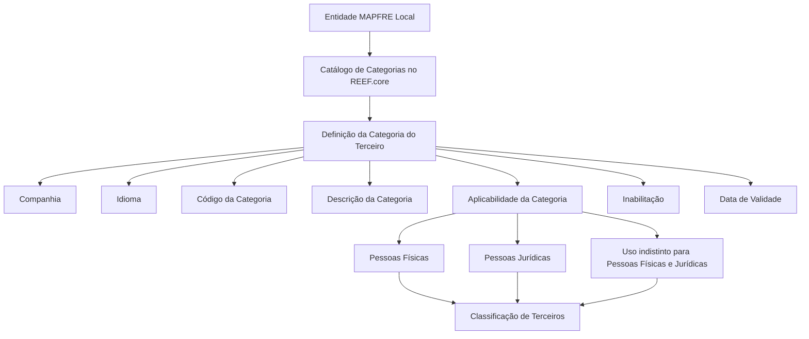

# Definição e Configuração de Categorias de Terceiros no REEF.core

## 1. Metadados do Documento
- **Arquivo de Origem:** Não identificado no conteúdo fornecido
- **Tipo de Documento:** Especificação Técnica / Documento Funcional
- **Domínio / Sistema:** REEF.core — catálogo de Categorias de Terceiros
- **Público-Alvo:** Analistas funcionais, desenvolvedores, arquitetos e equipes de operação da entidade MAPFRE Local
- **Data/Versão Identificada:** Não identificada

---

## 2. Resumo Executivo & Contexto de Negócio

O documento descreve o conceito, a definição e as propriedades de configuração das **Categorias de Terceiros** no sistema REEF.core. Uma categoria representa uma classe, tipo, condição ou divisão que permite classificar terceiros conforme características relevantes ao domínio corporativo.

No contexto de pessoas físicas, a categorização permite formar grupos segundo capacidades, responsabilidades, antiguidade no cargo, atividades profissionais e grupo social. No contexto de pessoas jurídicas, a categorização permite agrupar entidades de acordo com a personalidade jurídica ou classificações aplicáveis à Administração Pública, relacionadas a direito público ou privado.

O núcleo do REEF.core disponibiliza um catálogo específico para identificação e codificação de Códigos de Categorias. O catálogo é entregue inicialmente sem conteúdo, cabendo à entidade realizar sua definição conforme necessidades locais. A entidade MAPFRE Local pode utilizar esse atributo para criar uma classificação própria e específica dos Terceiros.

A configuração de uma categoria envolve propriedades gerais, operativas e complementares. Entre essas propriedades estão companhia, idioma, código, descrição, aplicabilidade para pessoas físicas ou jurídicas, inabilitação e data de validade. A data de validade é relevante para o histórico das alterações nas definições de categorias.

O documento não determina uma codificação padronizada para o catálogo de Categorias. A entidade MAPFRE deve avaliar a conveniência de usar esse catálogo transversalmente nos processos da companhia, considerando a definição correta e a exploração posterior das informações.

---

## 3. Arquitetura, Componentes & Tecnologias Envolvidas

Os componentes e conceitos identificados no documento são:

| Componente / Conceito | Papel identificado |
| :--- | :--- |
| **REEF.core** | Sistema cujo núcleo oferece o catálogo para identificação e codificação de Categorias de Terceiros. |
| **Catálogo de Categorias** | Catálogo de informação inicialmente vazio utilizado para definir códigos e descrições de categorias. |
| **Terceiro** | Entidade submetida à classificação por categoria. Pode ser pessoa física ou pessoa jurídica. |
| **Entidade MAPFRE Local** | Entidade que pode definir e usar uma classificação própria e específica de Terceiros. |
| **Companhia** | Propriedade que identifica o código da companhia para a qual a categoria está sendo definida. |
| **Idioma** | Propriedade usada na definição da categoria e de sua descrição no catálogo. |
| **Documentação Reef / Mapfredocument** | Contexto documental exibido na extração, contendo referência à documentação REEF. |
| **Atividades de Terceiros** | Documento funcional relacionado, indicado para leitura recomendada. |
| **Perguntas frequentes** | Material relacionado, indicado para leitura recomendada. |



**Nota de Análise:** O conteúdo não descreve interfaces de usuário, APIs, métodos HTTP, bancos de dados, contratos JSON, integrações técnicas, servidores, URLs operacionais ou mecanismos de persistência do catálogo de Categorias.

---

## 4. Regras de Negócio, Especificações Funcionais & Processos

### 4.1 Conceito de categoria

Uma categoria é definida como uma classe, um tipo, uma condição ou uma divisão de algo.

No âmbito de pessoas físicas no REEF.core, a categorização pode formar grupos de pessoas conforme:

- Capacidades;
- Responsabilidades;
- Antiguidade no cargo;
- Atividades profissionais;
- Grupo social ao qual a pessoa pertence.

No âmbito de pessoas jurídicas, a categorização pode agrupar entidades conforme:

- Personalidade jurídica;
- Classificações de pessoas jurídicas na Administração Pública;
- Tipo de direito público ou privado que ampara a entidade.

### 4.2 Catálogo de Categorias

O núcleo do sistema possui a capacidade de identificar e codificar os Códigos de Categorias em um catálogo específico de informação.

Regras identificadas:

1. O catálogo é entregue às entidades inicialmente vazio de conteúdo.
2. A entidade MAPFRE Local pode utilizar o catálogo para definir uma classificação própria e específica de Terceiros.
3. O documento não estabelece preferência ou recomendação para padronização da codificação das categorias.
4. A entidade MAPFRE deve analisar a conveniência de adotar transversalmente o catálogo nos processos da companhia.
5. A definição do catálogo deve considerar a exploração posterior das informações classificadas.

### 4.3 Propriedades gerais da Categoria do Terceiro

A definição de uma Categoria do Terceiro contém as seguintes propriedades gerais:

1. **Companhia:** informa o código da companhia sobre a qual está sendo realizada a definição da Categoria do Terceiro.
2. **Idioma:** informa o idioma usado na definição da categoria no catálogo, como espanhol ou inglês.
3. **Código da Categoria do Terceiro:** identifica o código da Categoria do Terceiro no sistema.
4. **Descrição da Categoria do Terceiro:** informa a denominação ou descrição da categoria de acordo com o idioma usado na definição.

O documento apresenta como exemplo de categorias em idioma espanhol:

| Categoria | Descrição |
| :--- | :--- |
| 01 | Categoría 1. |
| 02 | Categoría 2 |
| 03 | Categoría 3 |
| ... | ... |

### 4.4 Aplicabilidade para pessoas físicas e jurídicas

A propriedade operacional de uso em pessoas físicas indica se a tipologia da categorização do Terceiro é usada para:

- Pessoas físicas;
- Pessoas jurídicas;
- Pessoas físicas e pessoas jurídicas indistintamente.

**Regra obrigatória:** quando o código da Categoria puder ser usado indistintamente para pessoas físicas e pessoas jurídicas, o atributo de aplicabilidade deve permanecer sem valor, em branco, em sua definição.

### 4.5 Inabilitação

A propriedade de inabilitação informa ao sistema se a categoria está inabilitada para uso nas operações de captura e/ou modificação do Terceiro.

O documento não detalha os valores possíveis para a propriedade de inabilitação, nem o comportamento técnico do sistema quando uma categoria inabilitada é selecionada ou já está associada a um Terceiro.

### 4.6 Data de Validade

A propriedade de data de validade indica a data a partir da qual a classe do Terceiro está plenamente operativa no sistema.

A data de validade permite manter o histórico dos cambios efetuados nas definições das categorias.

### 4.7 Documentação relacionada

O documento recomenda a leitura dos seguintes materiais para evitar interpretações isoladas e incorretas:

- **Actividades de Terceros**;
- **Preguntas frecuentes**.

---

## 5. Tabelas de Parâmetros, Ambientes e Estruturas de Dados

### 5.1 Propriedades da Categoria do Terceiro

| Item / Parâmetro | Descrição / Função | Tipo / Valores / Formato | Ambiente / Observações |
| :--- | :--- | :--- | :--- |
| Companhia | Indica o código da companhia sobre a qual ocorre a definição da Categoria do Terceiro. | Código de companhia; formato não detalhado. | Aplicável à definição da categoria. |
| Idioma | Indica o idioma utilizado na definição da Categoria no catálogo. | Exemplos citados: espanhol, inglês. | Determina o idioma da descrição da categoria. |
| Código da Categoria do Terceiro | Identifica o código da Categoria do Terceiro no sistema. | Código; formato não detalhado. | Exemplos: `01`, `02`, `03`. |
| Descrição da Categoria do Terceiro | Indica a denominação ou descrição da categoria de acordo com o idioma definido. | Texto descritivo. | Exemplo em espanhol: `Categoría 1.` |
| Uso em Pessoas Físicas | Indica a aplicabilidade da tipologia de categorização do Terceiro. | Pessoas físicas, pessoas jurídicas ou uso indistinto. | Deve permanecer em branco quando a categoria for aplicável indistintamente a pessoas físicas e jurídicas. |
| Inabilitação | Indica se a categoria está inabilitada para uso em operações de captura e/ou modificação do Terceiro. | Valores não detalhados. | A propriedade afeta o uso operacional da categoria. |
| Data de Validade | Indica a data a partir da qual a classe do Terceiro fica plenamente operativa. | Data; formato não detalhado. | Permite histórico de mudanças nas definições de categorias. |

### 5.2 Exemplos de códigos e descrições

| Item / Parâmetro | Descrição / Função | Tipo / Valores / Formato | Ambiente / Observações |
| :--- | :--- | :--- | :--- |
| Categoria `01` | Exemplo de código de Categoria do Terceiro. | Código numérico apresentado como texto. | Descrição em espanhol: `Categoría 1.` |
| Categoria `02` | Exemplo de código de Categoria do Terceiro. | Código numérico apresentado como texto. | Descrição em espanhol: `Categoría 2`. |
| Categoria `03` | Exemplo de código de Categoria do Terceiro. | Código numérico apresentado como texto. | Descrição em espanhol: `Categoría 3`. |

### 5.3 Ambientes, rotas e URLs

| Item / Parâmetro | Descrição / Função | Tipo / Valores / Formato | Ambiente / Observações |
| :--- | :--- | :--- | :--- |
| Ambientes técnicos | Não detalhados no documento. | Não aplicável. | Não foram identificadas URLs, servidores, portas ou ambientes de execução. |
| Rotas de logs | Não detalhadas no documento. | Não aplicável. | Não foram identificados caminhos de logs. |
| APIs e integrações | Não detalhadas no documento. | Não aplicável. | Não foram identificados contratos, métodos HTTP ou endpoints. |

---

## 6. Bateria de Perguntas & Respostas para RAG (FAQ Sintético)

### P1: O que é uma Categoria de Terceiro no REEF.core?
**R:** Uma Categoria de Terceiro é uma classe, tipo, condição ou divisão utilizada para classificar Terceiros no REEF.core. Para pessoas físicas, a classificação pode considerar capacidades, responsabilidades, antiguidade no cargo, atividades profissionais e grupo social. Para pessoas jurídicas, a classificação pode considerar a personalidade jurídica ou classificações relacionadas à Administração Pública e ao direito público ou privado.

### P2: O catálogo de Categorias do REEF.core já vem preenchido?
**R:** Não. O documento informa que o catálogo específico de informação destinado à identificação e codificação dos Códigos de Categorias é entregue inicialmente às entidades sem conteúdo.

### P3: A entidade MAPFRE Local pode criar sua própria classificação de Terceiros?
**R:** Sim. A entidade MAPFRE Local pode usar o atributo de Categoria para realizar uma classificação própria e específica dos Terceiros da entidade.

### P4: Existe uma padronização obrigatória para a codificação das Categorias?
**R:** Não. O documento afirma que não existe preferência nem recomendação para estabelecer ou padronizar a codificação das Categorias no sistema. A entidade MAPFRE deve avaliar a conveniência de utilizar o catálogo transversalmente nos processos da companhia.

### P5: Quais informações gerais devem ser definidas para uma Categoria do Terceiro?
**R:** A definição deve incluir o código da companhia, o idioma utilizado, o código da Categoria do Terceiro e a descrição ou denominação da Categoria do Terceiro no idioma correspondente.

### P6: Qual é a função da propriedade Companhia?
**R:** A propriedade Companhia indica ao sistema o código da companhia sobre a qual está sendo realizada a definição da Categoria do Terceiro.

### P7: Como o idioma influencia a definição de uma Categoria do Terceiro?
**R:** O idioma identifica a língua utilizada na definição da Categoria no catálogo e na sua descrição. O documento cita espanhol e inglês como exemplos. As descrições das categorias devem estar de acordo com o idioma utilizado na definição.

### P8: Quando o atributo de uso em Pessoas Físicas deve ficar em branco?
**R:** O atributo deve permanecer sem valor ou em branco quando o código da Categoria puder ser utilizado indistintamente tanto para pessoas físicas quanto para pessoas jurídicas.

### P9: O que indica a propriedade de Inabilitação de uma categoria?
**R:** A propriedade de Inabilitação informa ao sistema se a categoria está inabilitada para ser utilizada nas operações de captura e/ou modificação do Terceiro.

### P10: Para que serve a Data de Validade na Categoria do Terceiro?
**R:** A Data de Validade indica a data a partir da qual a classe do Terceiro está plenamente operativa no sistema. O uso correto dessa propriedade permite manter o histórico das mudanças realizadas nas definições das categorias.

### P11: Que documentos devem ser consultados para complementar a interpretação das Categorias?
**R:** O documento recomenda a leitura de **Actividades de Terceros** e **Preguntas frecuentes**, pois a interpretação isolada do documento de Categorias pode levar a erro.

### P12: O documento detalha APIs, métodos HTTP ou contratos JSON para administrar Categorias?
**R:** Não. O conteúdo fornecido descreve regras funcionais e propriedades do catálogo, mas não detalha APIs, métodos HTTP, contratos JSON, bancos de dados, interfaces, servidores ou integrações técnicas.

---

## 7. Glossário de Termos, Siglas & Conceitos-Chave

- **REEF.core:** Sistema cujo núcleo possui um catálogo específico para identificação e codificação de Códigos de Categorias.
- **Categoria:** Classe, tipo, condição ou divisão utilizada para classificação.
- **Categoria do Terceiro:** Categoria usada para classificar uma entidade identificada como Terceiro.
- **Terceiro:** Entidade que pode ser pessoa física ou pessoa jurídica e que pode ser classificada por Categoria.
- **Pessoa Física:** Pessoa classificada por atributos como capacidades, responsabilidades, antiguidade no cargo, atividades profissionais ou grupo social.
- **Pessoa Jurídica:** Entidade que pode ser agrupada conforme personalidade jurídica ou classificações relacionadas à Administração Pública e ao direito público ou privado.
- **MAPFRE Local:** Entidade mencionada como responsável por poder utilizar o catálogo para criar classificação própria e específica dos Terceiros.
- **Companhia:** Código da companhia sobre a qual é definida a Categoria do Terceiro.
- **Idioma:** Língua utilizada na definição da Categoria e de sua descrição no catálogo.
- **Código da Categoria do Terceiro:** Código que identifica a Categoria do Terceiro no sistema.
- **Inabilitação:** Propriedade que define se uma categoria pode ser usada em operações de captura e/ou modificação do Terceiro.
- **Data de Validade:** Data a partir da qual a classe do Terceiro fica plenamente operativa e que contribui para o histórico de alterações das definições.
- **Mapfredocument:** Nome apresentado no cabeçalho do conteúdo extraído, associado à documentação REEF.

---

## 8. Notas Críticas, Riscos & Limitações

- O catálogo de Categorias é entregue inicialmente vazio; portanto, a qualidade e a consistência da classificação dependem da definição realizada por cada entidade.
- Não existe padronização ou recomendação explícita de codificação no sistema. Sem governança local, podem ocorrer códigos inconsistentes ou classificações divergentes entre processos.
- A entidade MAPFRE deve avaliar a adoção transversal do catálogo nos processos corporativos para permitir exploração posterior consistente das informações.
- O atributo de aplicabilidade para pessoas físicas e jurídicas exige atenção: quando o uso for indistinto, o valor deve ficar em branco.
- A Data de Validade deve ser usada corretamente para preservar o histórico de alterações nas definições de categorias.
- O documento recomenda a consulta a **Actividades de Terceros** e **Preguntas frecuentes** para reduzir o risco de interpretação isolada ou incorreta.
- O conteúdo não detalha integrações, interfaces, APIs, contratos de dados, valores permitidos para Inabilitação, formatos de data, regras de unicidade de códigos, permissões ou mecanismos de auditoria.
- **Nota de Análise:** O documento lista o REEF.core e o catálogo de Categorias, porém não detalha métodos HTTP, contratos JSON, entidades de persistência ou fluxos técnicos de manutenção das categorias.

---

## 9. Conteúdo Bruto Estruturado (Referência Fiel)

```text
--- [PÁGINA 1 DE 2] ---

DEFINICIÓN de Categorías
Contexto
Se denomina categoría a una clase, un tipo, una condición o una división de algo.
Conceptualmente en Reef.core y en el ámbito de las personas Físicas, su categorización permite conformar grupos de personas de acuerdo a
sus capacidades, responsabilidades, antigüedad en el puesto, actividades profesionales, grupo social al que pertenece, mientras que en el
ámbito de las personas jurídicas permite aglutinar entidades de acuerdo a su personalidad jurídica, o bien referidas a las clasicaciones de
las personas jurídicas en la Administración Pública, de acuerdo al tipo de derecho público o privado que las amparan,...
Propiedades Generales
Funcionalmente, el núcleo del Sistema cuenta con la posibilidad de identicar y codicar los Códigos de Categorías en un catálogo de
información especíco que se entrega a las entidades inicialmente vacío de contenido.
... De esta manera la entidad MAPFRE Local podrá emplear este atributo para efectuar una clasicación de uso propio y especíco con los
Terceros de la entidad.
Compañía
Esta propiedad le indica al sistema el código de la compañía sobre la que se está realizando la denición de la Categoría del Tercero.
Idioma
Esta propiedad le indica al sistema el Idioma empleado en la denición de la Categoría en el Catálogo, como por ejemplo: español, inglés,...
Código de la Categoría del Tercero
Esta propiedad indicará en el sistema el código de la Categoría del Tercero.
Descripción de la Categoría del Tercero
Esta propiedad le indica al sistema cual es la denominación o descripción de la Categoría del Tercero, de acuerdo con el idioma utilizado en la
denición.
A modo de ejemplo y si el Idioma utilizado en la denición es el español:
CATEGORÍA DESCRIPCIÓN
01 Categoría 1.
Documentation / DOCUMENTACIÓN Reef
DOCUMENTACIÓN Reef
Mapfredocument
DOCUMENTACIÓN Reef
Owner
user:agonzalez_mapfre.com
Lifecycle
Approved Source
 / 
 VL
Buscar Inicio Soluciones Arquitecturas APIs Componentes Cloud Documentación Zeus Reef Ayuda
ES


--- [PÁGINA 2 DE 2] ---

CATEGORÍA DESCRIPCIÓN
02 Categoría 2
03 Categoría 3
... ...
Propiedades Operativas
Uso en Personas Físicas
Este atributo indica si la Tipología de la categorización del Tercero se usa para personas Físicas, para personas Jurídicas o indistintamente
para unas u otras.
NOTA: En el supuesto que el código de la Categoría se pueda utilizar indistintamente tanto para personas físicas como para personas
jurídicas, este atributo debe dejarse sin valor/en blanco en su denición.
Otras Propiedades
Inhabilitación
Esta propiedad le indica al Sistema si la calidad está inhabilitada para poder ser utilizada en las operaciones de captura y/o modicación del
Tercero.
Fecha de Validez
Esta propiedad le indica al Sistema la fecha a partir de la cual la clase del Tercero está plenamente operativa en el sistema por lo que su
correcto uso permite tener un histórico de los cambios efectuados en las deniciones de los categorías.
Vínculos
Relación de Directrices y Documentos funcionales cuya lectura recomendada para evitar que la interpretación aislada del presente
documento pueda conducir a error.
Actividades de Terceros
Preguntas frecuentes
(1) ¿Existe alguna recomendación operativa que deba ser tomada en consideración localmente en la codicación, uso y denición del
catálogo de Categorías en el Sistema?
No existe una preferencia ni recomendación para establecer o estandarizar en el sistema su codicación si bien la entidad MAPFRE debe
analizar la conveniencia de utilizar transversalmente en los procesos de la compañía este catálogo de información para su correcta denición
contemplando su posterior explotación.
```
