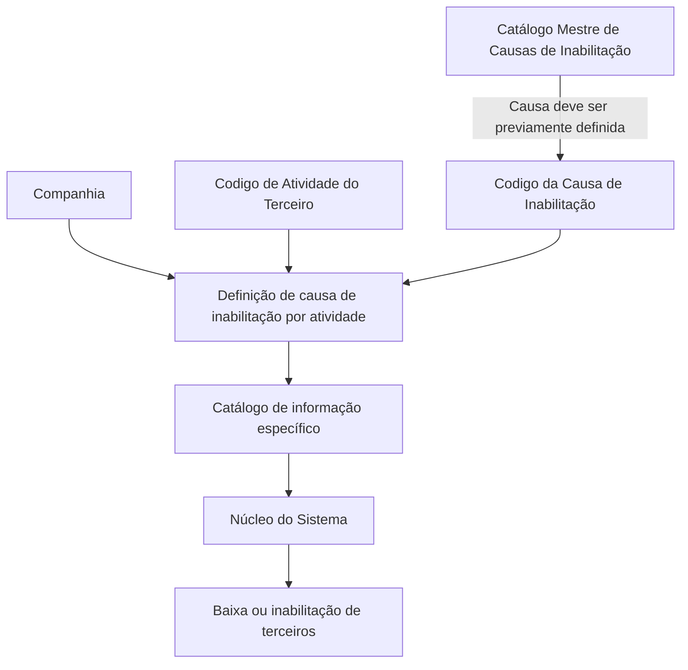
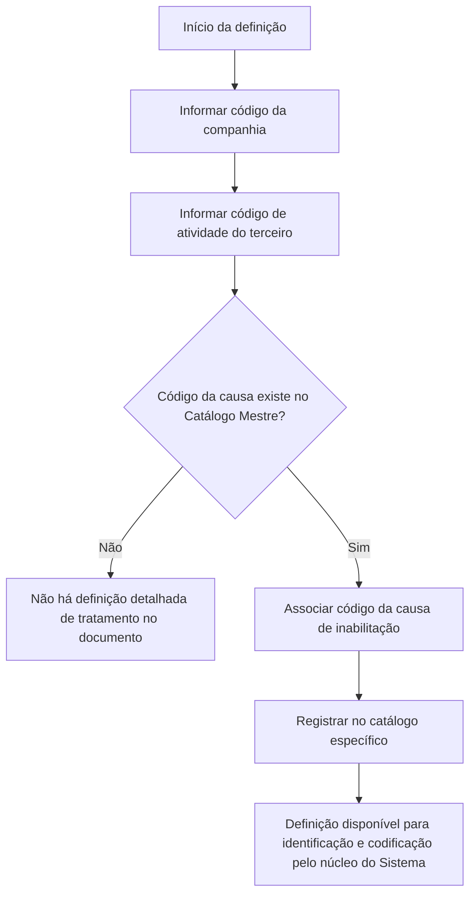

# Definição das Causas de Inabilitação por Atividade de Terceiros

## 1. Metadados do Documento
- **Arquivo de Origem:** Não identificado no conteúdo fornecido
- **Tipo de Documento:** Especificação Funcional
- **Domínio / Sistema:** Reef / Mapfre
- **Público-Alvo:** Negócio, Operação e equipes responsáveis pela configuração do sistema
- **Data/Versão Identificada:** Não identificada
- **Owner identificado:** `user:agonzalez_mapfre.com`
- **Lifecycle identificado:** Approved Source / VL

---

## 2. Resumo Executivo & Contexto de Negócio

O documento descreve a definição de causas de inabilitação de terceiros associadas aos respectivos códigos de atividade no núcleo do Sistema. A funcionalidade permite identificar e codificar motivos que podem provocar a baixa ou inabilitação de terceiros.

A configuração é realizada em um catálogo de informação específico, entregue às entidades sem conteúdo inicial. A definição considera a companhia, o código de atividade do terceiro e o código da causa de inabilitação.

O código da causa de inabilitação deve existir previamente no Catálogo Mestre de Causas de Inabilitação. Portanto, a definição por atividade depende da manutenção prévia desse catálogo mestre.

O documento afirma que não existe preferência ou recomendação corporativa para estabelecer ou padronizar a codificação dos motivos de inabilitação de terceiros por atividade no sistema. Também referencia os documentos funcionais “Actividades de Terceros” e “Causas de Inhabilitación” como leituras recomendadas.

---

## 3. Arquitetura, Componentes & Tecnologias Envolvidas

| Componente / Conceito | Papel descrito |
| :--- | :--- |
| Núcleo do Sistema | Identifica e codifica motivos que podem causar baixa ou inabilitação de terceiros. |
| Catálogo de informação específico | Armazena a definição de causas de inabilitação por código de atividade do terceiro. |
| Catálogo Mestre de Causas de Inabilitação | Deve conter previamente o código da causa de inabilitação utilizado na definição. |
| Companhia | Contextualiza a companhia para a qual a definição do motivo de inabilitação é realizada. |
| Código de Atividade do Terceiro | Identifica a atividade do terceiro à qual a causa de inabilitação se aplica. |
| Código da Causa de Inabilitação | Identifica o motivo de inabilitação aplicável ao terceiro conforme o código de atividade. |
| Reef | Repositório ou contexto de documentação identificado no rodapé do conteúdo. |
| Mapfredocument | Termo identificado na navegação/rodapé do conteúdo. |



> **Nota de Análise:** O documento não detalha telas, APIs, métodos HTTP, contratos JSON, tecnologias de implementação, persistência de dados ou regras de autorização.

---

## 4. Regras de Negócio, Especificações Funcionais & Processos

1. O núcleo do Sistema possui capacidade de identificar e codificar diferentes motivos operacionais que podem provocar a baixa ou inabilitação de terceiros.
2. A identificação e a codificação dos motivos de inabilitação são realizadas de acordo com os códigos de atividade dos terceiros.
3. As definições são registradas em um catálogo de informação específico.
4. O catálogo específico é entregue às entidades sem conteúdo.
5. A propriedade **Companhia** indica o código da companhia sobre a qual é realizada a definição do motivo de inabilitação do terceiro.
6. A propriedade **Código de Atividade do Terceiro** indica o código da atividade do terceiro.
7. A propriedade **Código da Causa de Inabilitação** indica, conforme o código de atividade do terceiro, o código do motivo de inabilitação do terceiro no Sistema.
8. O código da causa de inabilitação deve estar previamente definido no **Catálogo Mestre de Causas de Inabilitação**.
9. Não existe preferência ou recomendação corporativa para estabelecer ou padronizar a codificação dos motivos de inabilitação de terceiros por atividade no Sistema.
10. A leitura dos documentos funcionais relacionados é recomendada para evitar interpretação isolada e potencialmente incorreta do documento.

### Fluxo funcional identificado



> **Nota de Análise:** O documento estabelece a prévia definição da causa no catálogo mestre, mas não especifica o comportamento do sistema quando o código informado não existe nesse catálogo.

---

## 5. Tabelas de Parâmetros, Ambientes e Estruturas de Dados

| Item / Parâmetro | Descrição / Função | Tipo / Valores / Formato | Ambiente / Observações |
| :--- | :--- | :--- | :--- |
| Companhia | Indica o código da companhia sobre a qual é realizada a definição do motivo de inabilitação do terceiro. | Código de companhia; formato não detalhado. | Associado à definição da causa de inabilitação. |
| Código de Atividade do Terceiro | Indica o código da atividade do terceiro. | Código de atividade; formato não detalhado. | Determina o contexto da causa de inabilitação. |
| Código da Causa de Inabilitação | Indica o código do motivo de inabilitação do terceiro conforme o código de atividade. | Código de causa; formato não detalhado. | Deve estar previamente definido no Catálogo Mestre de Causas de Inabilitação. |
| Catálogo de informação específico | Repositório da informação de causas de inabilitação por atividade. | Catálogo; estrutura interna não detalhada. | Entregue às entidades sem conteúdo. |
| Catálogo Mestre de Causas de Inabilitação | Catálogo pré-requisito para os códigos de causa usados na definição por atividade. | Catálogo mestre; estrutura interna não detalhada. | Dependência obrigatória para a definição da causa. |
| Documentos relacionados | “Actividades de Terceros” e “Causas de Inhabilitación”. | Documentação funcional. | Leitura recomendada para evitar interpretação isolada. |
| Owner | Responsável identificado no conteúdo. | `user:agonzalez_mapfre.com` | Identificação apresentada no rodapé. |
| Lifecycle | Estado identificado no conteúdo. | `Approved Source / VL` | Sem detalhamento adicional. |

---

## 6. Bateria de Perguntas & Respostas para RAG (FAQ Sintético)

### P1: Qual é a finalidade da definição de causas de inabilitação por atividade de terceiros?
**R:** A finalidade é permitir que o núcleo do Sistema identifique e codifique os diferentes motivos operacionais que podem provocar a baixa ou inabilitação de terceiros, considerando os respectivos códigos de atividade.

### P2: Quais propriedades compõem a definição de uma causa de inabilitação por atividade?
**R:** A definição utiliza três propriedades: Companhia, Código de Atividade do Terceiro e Código da Causa de Inabilitação.

### P3: O que a propriedade Companhia representa nessa configuração?
**R:** A propriedade Companhia indica o código da companhia sobre a qual está sendo realizada a definição do motivo de inabilitação do terceiro.

### P4: Como o Código de Atividade do Terceiro é utilizado?
**R:** O Código de Atividade do Terceiro identifica a atividade do terceiro e é o contexto usado para associar o código do motivo de inabilitação.

### P5: O que representa o Código da Causa de Inabilitação?
**R:** O Código da Causa de Inabilitação representa, de acordo com o código de atividade do terceiro, o código do motivo de inabilitação do terceiro no Sistema.

### P6: Existe algum pré-requisito para usar um Código da Causa de Inabilitação?
**R:** Sim. O Código da Causa de Inabilitação deve estar previamente definido no Catálogo Mestre de Causas de Inabilitação.

### P7: O catálogo específico possui conteúdo inicial quando é entregue às entidades?
**R:** Não. O documento informa que o catálogo de informação específico é entregue às entidades sem conteúdo.

### P8: Há uma padronização corporativa obrigatória para codificar motivos de inabilitação por atividade?
**R:** Não. O documento declara que não existe, corporativamente, preferência ou recomendação para estabelecer ou padronizar a codificação dos motivos de inabilitação de terceiros por atividade no Sistema.

### P9: Quais documentos funcionais relacionados devem ser consultados?
**R:** O documento recomenda a leitura de “Actividades de Terceros” e “Causas de Inhabilitación”, pois a interpretação isolada do documento atual pode conduzir a erro.

### P10: O documento descreve APIs, métodos HTTP ou contratos de integração para a gestão das causas?
**R:** Não. O documento não detalha APIs, métodos HTTP, contratos JSON, integrações, interfaces de usuário ou tecnologias de implementação.

---

## 7. Glossário de Termos, Siglas & Conceitos-Chave

- **Terceiro:** Entidade cuja baixa ou inabilitação pode ser causada por motivos associados ao seu código de atividade.
- **Inabilitação:** Situação em que um terceiro é inabilitado no Sistema por um motivo codificado.
- **Baixa:** Situação operacional mencionada como possível consequência dos motivos associados aos códigos de atividade de terceiros.
- **Causa de Inabilitação:** Motivo codificado que pode provocar a inabilitação de um terceiro.
- **Código de Atividade do Terceiro:** Código que identifica a atividade do terceiro e contextualiza a causa de inabilitação.
- **Catálogo Mestre de Causas de Inabilitação:** Catálogo no qual o código da causa de inabilitação deve estar previamente definido.
- **Catálogo de informação específico:** Catálogo utilizado para a definição de causas de inabilitação por atividade de terceiros.
- **Reef:** Termo identificado no contexto de documentação apresentado no conteúdo.
- **VL:** Sigla apresentada no campo Lifecycle; o documento não define seu significado.

---

## 8. Notas Críticas, Riscos & Limitações

- A definição de causa por atividade depende da existência prévia da causa no Catálogo Mestre de Causas de Inabilitação.
- O catálogo específico é entregue sem conteúdo; o documento não descreve o processo operacional de carga ou manutenção inicial.
- Não há recomendação corporativa para padronização da codificação dos motivos de inabilitação por atividade, o que pode permitir variações locais.
- O documento recomenda consultar “Actividades de Terceros” e “Causas de Inhabilitación” para evitar erros de interpretação decorrentes de leitura isolada.
- Não há detalhamento sobre validações de formato, mensagens de erro, permissões, auditoria, integração, APIs, persistência, telas ou tratamento de inconsistências.
- **Nota de Análise:** O documento descreve as propriedades funcionais da definição, mas não descreve como essas propriedades são criadas, alteradas, removidas ou consultadas no Sistema.

---

## 9. Conteúdo Bruto Estruturado (Referência Fiel)

```text
--- [PÁGINA 1 DE 1] ---

DEFINICIÓN de las Causas de Inhabilitación por Actividad del Tercero
Propiedades Generales
Funcionalmente, el núcleo del Sistema cuenta con la posibilidad de identicar y codicar los diferentes Motivos que operativamente pueden
provocar la baja o inhabilitación de los Terceros de acuerdo a sus códigos de Actividad, en un catálogo de información especíco que se
entrega a las entidades sin contenido:
Compañía
Esta propiedad le indica al sistema el código de la compañía sobre la que se está realizando la denición del motivo de Inhabilitación del
Tercero.
Código de Actividad del Tercero
Esta propiedad indicará el código de la Actividad del Tercero.
Código de la Causa de Inhabilitación
Esta propiedad indicará, de acuerdo al código de actividad del Tercero, el código del Motivo de la Inhabilitación del Tercero en el sistema.
NOTA: El Código de la Causa de Inhabilitación ha de estar denida previamente en el Catálogo Maestro de Causas de Inhabilitación
Vínculos
Relación de Directrices y Documentos funcionales cuya lectura recomendada para evitar que la interpretación aislada del presente
documento pueda conducir a error.
Actividades de Terceros
Causas de Inhabilitación
Preguntas frecuentes
(1) ¿Existe alguna recomendación operativa que deba ser tomada en consideración localmente en la codicación y uso de las Causas de
Inhabilitación de Terceros por Actividad en el Sistema?
No existe Corporativamente una preferencia o recomendación para establecer o estandarizar en el sistema la codicación de los Motivos de
Inhabilitación.
Documentation / DOCUMENTACIÓN Reef
DOCUMENTACIÓN Reef
Mapfredocument
DOCUMENTACIÓN Reef
Owner
user:agonzalez_mapfre.com
Lifecycle
Approved Source
 /
 VL
Buscar Inicio Soluciones Arquitecturas APIs Componentes Cloud Documentación Zeus Reef Ayuda
ES
```
